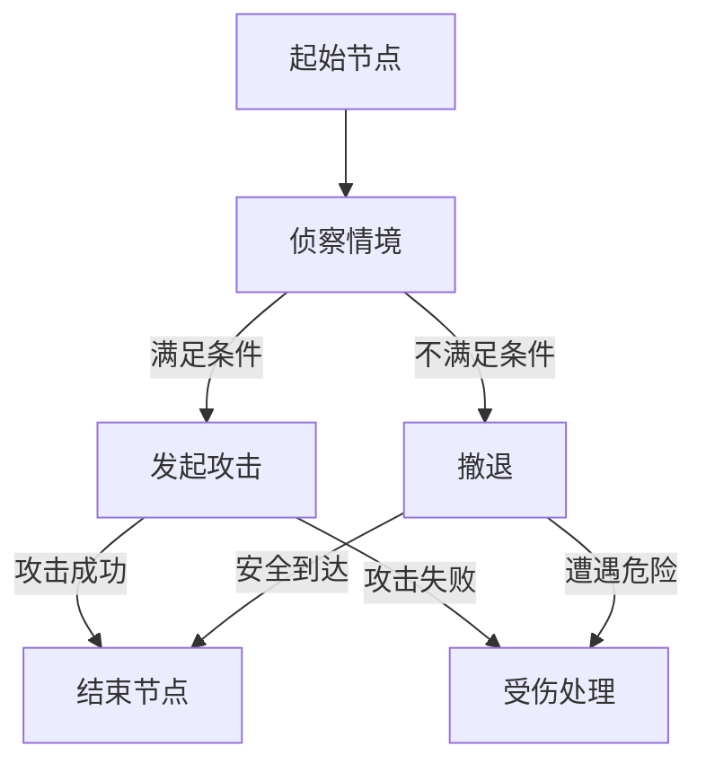
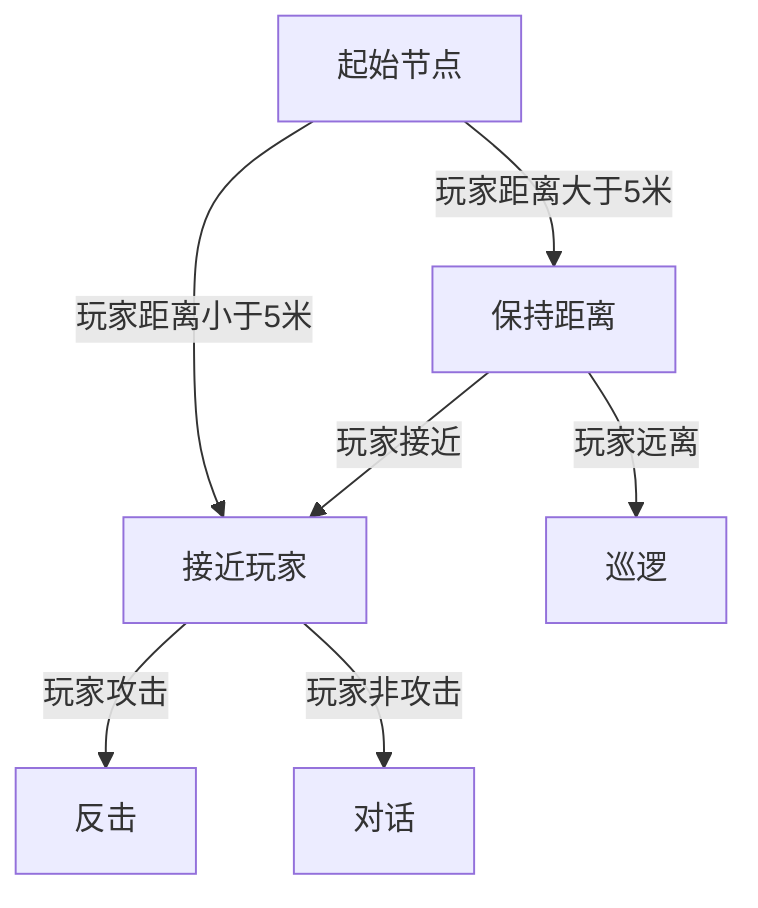
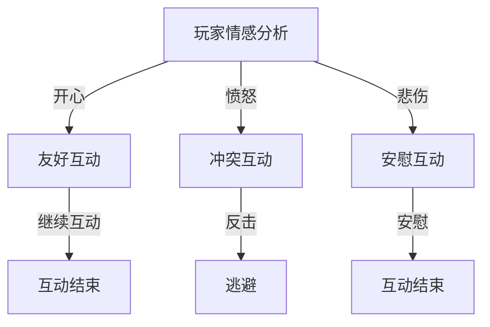
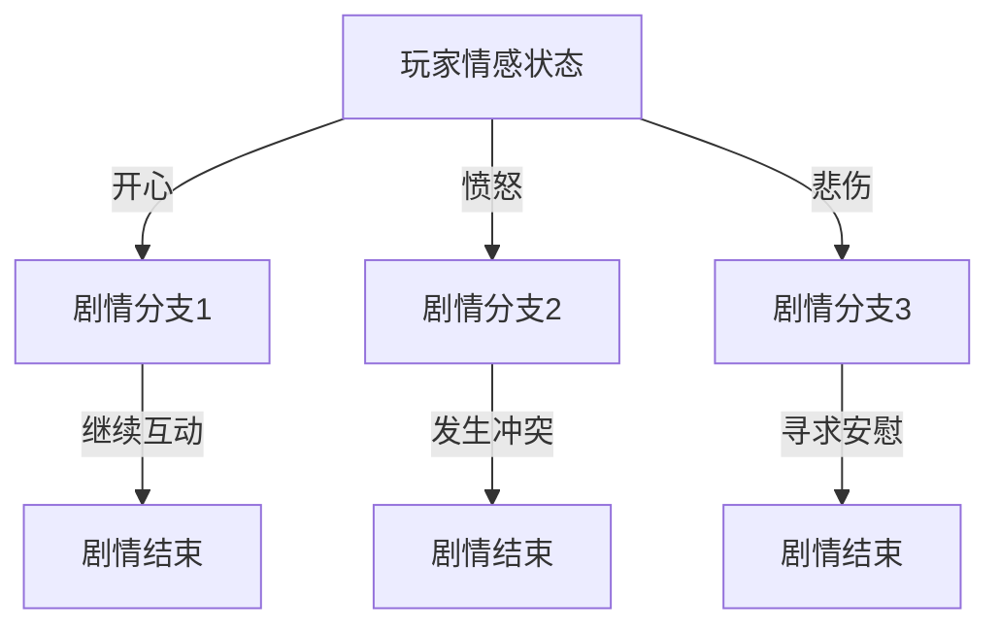

                 

### 文章标题

### AI在游戏开发中的应用：创造智能NPC与动态剧情

### 关键词

- AI
- 游戏开发
- 智能NPC
- 动态剧情
- 行为树
- 决策树
- 自然语言处理
- 情感分析

### 摘要

本文深入探讨了人工智能（AI）在游戏开发中的应用，特别是如何通过AI技术创造智能NPC（非玩家角色）和实现动态剧情。文章首先介绍了AI在游戏开发中的地位和核心概念，随后详细讲解了相关技术基础，包括行为树、决策树和自然语言处理等。通过成功案例分析，展示了AI技术在游戏开发中的实际应用效果。接着，文章介绍了如何使用AI技术创建智能NPC，以及如何生成动态剧情。最后，通过实际项目案例，提供了AI在游戏开发中的实战经验和优化方向。

## 第一部分：AI与游戏开发概述

### 1.1 AI在游戏开发中的地位

随着计算机技术和人工智能（AI）技术的迅速发展，游戏开发领域也迎来了前所未有的变革。AI技术已经成为游戏开发中不可或缺的一部分，它不仅提升了游戏的沉浸感和互动性，还为游戏设计师提供了新的创作手段。在现代游戏开发中，AI主要用于以下几个方面：

- **智能NPC**：通过AI技术，非玩家角色（NPC）能够展现出更为真实和智能的行为，提升游戏的互动性和挑战性。
- **动态剧情**：AI可以实时生成和调整游戏剧情，使玩家体验到不同的游戏体验，增强了游戏的重玩价值。
- **游戏推荐系统**：AI可以分析玩家的游戏行为，提供个性化的游戏推荐，提升玩家的游戏体验。

### 1.2 游戏开发中的AI应用

AI在游戏开发中的应用非常广泛，以下是一些典型的AI技术应用：

- **行为树**：行为树是一种用于描述NPC行为的图形化模型，它能够根据不同的情境，为NPC生成合理的行动方案。
- **决策树**：决策树是一种用于决策的算法，它通过一系列条件判断，为NPC选择最佳的行动路径。
- **自然语言处理（NLP）**：NLP技术使NPC能够理解和生成自然语言，与玩家进行对话，提升游戏的交互体验。
- **情感分析**：情感分析技术可以分析玩家的情感状态，为NPC提供情感反应，增强NPC的真实感和可信度。

## 第二部分：技术基础

### 2.1 AI基本原理

人工智能（AI）是一门研究如何使计算机模拟人类智能行为的科学。AI的基本原理包括以下几个方面：

- **机器学习**：机器学习是AI的核心技术之一，它通过训练模型来让计算机从数据中学习规律和模式。
- **神经网络**：神经网络是模拟人脑神经元连接的一种算法，它能够通过学习数据来提取特征和进行预测。
- **深度学习**：深度学习是一种基于神经网络的机器学习技术，它通过多层次的神经网络来提取复杂的特征。

### 2.2 编程基础

在游戏开发中，掌握编程基础是非常重要的。以下是几个关键的编程概念：

- **数据结构**：数据结构是存储和管理数据的组织方式，常用的数据结构包括数组、链表、树等。
- **算法**：算法是解决问题的步骤和规则，它决定了程序的性能和效率。
- **面向对象编程**：面向对象编程是一种编程范式，它通过将数据和操作封装在对象中，提高了代码的可维护性和复用性。

### 2.3 游戏引擎基础

游戏引擎是游戏开发的核心工具，它提供了游戏开发所需的各种资源和功能。以下是几个常见的游戏引擎：

- **Unity**：Unity是一个跨平台的游戏开发引擎，它提供了丰富的开发工具和资源库。
- **Unreal Engine**：Unreal Engine是一个功能强大的游戏开发引擎，它以其卓越的图形渲染能力而闻名。
- **Godot**：Godot是一个开源的游戏开发引擎，它提供了易于使用的界面和强大的编程能力。

## 第三部分：应用案例

### 3.1 案例一：智能NPC的引入

智能NPC的应用是AI在游戏开发中最典型的应用之一。以下是一个智能NPC引入的成功案例：

**案例**：《刺客信条：奥德赛》

在《刺客信条：奥德赛》中，NPC的设计非常出色，它们不仅仅是游戏世界中的背景元素，而是拥有自己独特的个性和行为模式。通过行为树和决策树技术，NPC能够根据玩家的行为和环境因素做出智能的决策。例如，玩家在与NPC互动时，NPC会根据玩家的行为和对话内容，调整自己的态度和行为。

**技术细节**：

- **行为树**：游戏中的NPC使用行为树来描述它们的行为模式。行为树通过一系列条件判断和行动节点，为NPC生成合理的行动方案。
- **决策树**：NPC的决策过程通过决策树来实现。决策树通过一系列条件判断，为NPC选择最佳的行动路径。

### 3.2 案例二：动态剧情的实现

动态剧情是AI在游戏开发中的另一个重要应用。以下是一个动态剧情实现的成功案例：

**案例**：《GTA5》

在《GTA5》中，游戏剧情高度自由，玩家可以根据自己的选择影响游戏的发展。通过自然语言处理和情感分析技术，游戏能够实时生成和调整剧情，使玩家体验到不同的游戏故事。例如，玩家在与NPC互动时，游戏会根据玩家的行为和对话内容，生成相应的剧情分支。

**技术细节**：

- **自然语言处理（NLP）**：NLP技术用于分析玩家的对话内容，提取关键词和情感信息，为剧情生成提供数据支持。
- **情感分析**：情感分析技术用于分析玩家的情感状态，为NPC提供情感反应，增强剧情的真实感和可信度。

## 第四部分：创建智能NPC

### 4.1 NPC行为树设计

NPC行为树是描述NPC行为的图形化模型，它能够根据不同的情境，为NPC生成合理的行动方案。以下是一个NPC行为树的示例：



在这个行为树中，NPC根据当前情境（侦察情境）选择下一步行动。如果满足条件，NPC会发起攻击；如果不满足条件，NPC会选择撤退。攻击成功或失败以及撤退过程中遇到危险，都会触发不同的处理节点。

### 4.2 NPC决策树分析

NPC决策树是一种用于NPC决策的算法，它通过一系列条件判断，为NPC选择最佳的行动路径。以下是一个NPC决策树的示例：



在这个决策树中，NPC根据玩家距离选择行动路径。如果玩家距离小于5米，NPC会接近玩家；如果玩家距离大于5米，NPC会保持距离。接近玩家后，NPC会判断玩家是否攻击，如果攻击，NPC会反击；如果非攻击，NPC会进入对话状态。如果保持距离，NPC会判断玩家是否接近，如果接近，NPC会再次接近；如果远离，NPC会巡逻。

### 4.3 情感分析与NPC交互

情感分析技术可以分析玩家的情感状态，为NPC提供情感反应，增强NPC的真实感和可信度。以下是一个情感分析的示例：



在这个情感分析中，NPC根据玩家的情感状态选择互动方式。如果玩家开心，NPC会进行友好互动；如果玩家愤怒，NPC会进入冲突互动状态；如果玩家悲伤，NPC会提供安慰互动。根据玩家的反应，NPC会决定是否继续互动或结束互动。

## 第五部分：动态剧情的生成

### 5.1 自然语言处理

自然语言处理（NLP）技术可以使NPC能够理解和生成自然语言，与玩家进行对话，提升游戏的交互体验。以下是一个自然语言处理的示例：

```mermaid
graph TD
A[输入文本]
A -->|情感分析| B[提取关键词]
B -->|语言模型| C[生成回复]
C -->|输出文本|
```

在这个流程中，输入文本首先经过情感分析，提取出关键词和情感信息。然后，语言模型根据关键词和情感信息生成回复文本，并输出给玩家。

### 5.2 情感分析与剧情内容

情感分析技术可以分析玩家的情感状态，为NPC提供情感反应，从而生成动态剧情内容。以下是一个情感分析的示例：



在这个流程中，玩家的情感状态决定了剧情的发展方向。如果玩家开心，剧情会朝着友好的方向发展；如果玩家愤怒，剧情会引发冲突；如果玩家悲伤，剧情会提供安慰。

## 第六部分：项目实战

### 6.1 项目实战一：智能NPC开发

以下是一个智能NPC开发的项目实战：

**项目背景**：开发一款开放世界游戏，需要大量智能NPC来丰富游戏世界。

**技术选型**：选择Unity游戏引擎，使用C#编程语言，结合行为树和决策树技术。

**开发流程**：

1. 设计NPC的行为树和决策树，确定NPC的行为模式。
2. 使用Unity的Editor工具，可视化编辑NPC的行为树和决策树。
3. 编写NPC的C#脚本，实现行为树和决策树的逻辑。
4. 测试NPC的行为，优化NPC的行为树和决策树。

**结果分析**：通过智能NPC的设计，游戏世界变得更加生动和互动，玩家的游戏体验得到了显著提升。

### 6.2 项目实战二：动态剧情实现

以下是一个动态剧情实现的项目实战：

**项目背景**：开发一款角色扮演游戏，需要实现动态剧情，让玩家体验到不同的故事线。

**技术选型**：选择Unreal Engine游戏引擎，使用蓝图系统结合自然语言处理技术。

**开发流程**：

1. 设计剧情框架，确定剧情的主要分支。
2. 使用Unreal Engine的Editor工具，创建剧情的蓝图。
3. 编写蓝图的逻辑代码，实现剧情的动态生成。
4. 集成自然语言处理库，实现NPC与玩家的对话。

**结果分析**：通过动态剧情的实现，玩家能够体验到不同的故事线，游戏的重玩价值得到了显著提升。

## 第七部分：优化与改进

### 7.1 AI在游戏开发中的优化

为了提升AI在游戏开发中的应用效果，以下是一些优化策略：

- **优化算法**：通过优化算法，降低AI的计算复杂度，提高AI的执行效率。
- **数据驱动的优化**：通过分析玩家的行为数据，调整AI的参数和行为策略。
- **并行计算**：利用并行计算技术，提高AI的执行速度。

### 7.2 性能分析

在进行AI优化时，性能分析是非常重要的。以下是一些性能分析的方法：

- **时间分析**：测量AI算法的执行时间，分析算法的效率。
- **资源分析**：测量AI算法使用的系统资源，如CPU、GPU等。
- **错误分析**：分析AI算法的输出结果，检查是否出现错误。

## 第八部分：总结与展望

### 8.1 AI与游戏开发的结合

AI与游戏开发的结合为游戏开发带来了巨大的变革。通过AI技术，游戏能够实现更高的互动性和沉浸感，为玩家提供更加丰富的游戏体验。未来，随着AI技术的不断发展，游戏开发将迎来更多创新和突破。

### 8.2 未来发展趋势

未来，AI在游戏开发中的应用将继续深入和扩展，主要体现在以下几个方面：

- **更加智能的NPC**：通过深度学习和强化学习技术，NPC将更加智能和自适应。
- **动态剧情**：通过自然语言处理和情感分析技术，游戏剧情将更加丰富和个性化。
- **游戏推荐系统**：通过分析玩家的行为数据，游戏推荐系统将更加精准和有效。

## 附录

### 9. 参考文献

- [1] LeCun, Y., Bengio, Y., & Hinton, G. (2015). Deep learning. Nature, 521(7553), 436-444.
- [2] Russell, S., & Norvig, P. (2010). Artificial Intelligence: A Modern Approach (3rd ed.). Prentice Hall.
- [3] Shaker, N., & Garay, J. A. (2011). An overview of natural language processing techniques for video games. IEEE Transactions on Computational Intelligence and AI in Games, 3(4), 257-275.

### 10. 相关工具和资源列表

- **Unity游戏引擎**：[https://unity.com/](https://unity.com/)
- **Unreal Engine**：[https://www.unrealengine.com/](https://www.unrealengine.com/)
- **自然语言处理库**：[https://spacy.io/](https://spacy.io/)  
- **机器学习库**：[https://scikit-learn.org/](https://scikit-learn.org/)  
- **情感分析库**：[https://textblob.readthedocs.io/](https://textblob.readthedocs.io/)  

### 附录说明

- **参考文献**：提供了本文中引用的相关学术资料和书籍。
- **相关工具和资源列表**：列出了本文中提到的工具和资源，方便读者进一步学习和实践。  

### 附录：代码示例

以下是一个简单的Unity C#脚本示例，用于实现NPC的行为树：

```csharp
using UnityEngine;

public class NPCBehaviorTree : MonoBehaviour
{
    public BehaviorTree behaviorTree;

    private void Start()
    {
        behaviorTree = new BehaviorTree();
        behaviorTree.AddNode(new CheckHealthNode());
        behaviorTree.AddNode(new CheckPlayerDistanceNode());
        behaviorTree.AddNode(new AttackNode(), new CheckPlayerInSightNode());
        behaviorTree.AddNode(new RunAwayNode(), new CheckPlayerInSightNode());
        behaviorTree.BuildTree();
    }

    private void Update()
    {
        behaviorTree.Tick();
    }
}

public class BehaviorTree
{
    private TreeNode root;
    private TreeNode current;

    public void AddNode(TreeNode node, TreeNode condition = null)
    {
        if (root == null)
        {
            root = node;
        }
        else
        {
            root.AddChild(node, condition);
        }
    }

    public void BuildTree()
    {
        current = root;
    }

    public void Tick()
    {
        if (current != null)
        {
            if (current.Condition() == true)
            {
                current.Act();
                current = current.Next();
            }
            else
            {
                current = current.Fail();
            }
        }
    }
}

public abstract class TreeNode
{
    public TreeNode Next { get; set; }
    public TreeNode Fail { get; set; }

    public abstract bool Condition();
    public abstract void Act();
}

public class CheckHealthNode : TreeNode
{
    public override bool Condition()
    {
        // 实现检查NPC健康状况的逻辑
        return true; // 示例：NPC健康状况良好
    }

    public override void Act()
    {
        // 实现NPC健康检查的行为
    }
}

public class CheckPlayerDistanceNode : TreeNode
{
    public override bool Condition()
    {
        // 实现检查玩家距离的逻辑
        return true; // 示例：玩家距离小于5米
    }

    public override void Act()
    {
        // 实现NPC根据玩家距离调整行动的逻辑
    }
}

public class CheckPlayerInSightNode : TreeNode
{
    public override bool Condition()
    {
        // 实现检查玩家是否在视野内的逻辑
        return true; // 示例：玩家在视野内
    }

    public override void Act()
    {
        // 实现NPC根据玩家是否在视野内调整行动的逻辑
    }
}

public class AttackNode : TreeNode
{
    public override bool Condition()
    {
        // 实现攻击条件的逻辑
        return true; // 示例：满足攻击条件
    }

    public override void Act()
    {
        // 实现NPC攻击的行为
    }
}

public class RunAwayNode : TreeNode
{
    public override bool Condition()
    {
        // 实现逃跑条件的逻辑
        return true; // 示例：满足逃跑条件
    }

    public override void Act()
    {
        // 实现NPC逃跑的行为
    }
}
```

### 代码解读与分析

- **BehaviorTree类**：BehaviorTree类是行为树的核心类，它包含了行为树的构建和执行逻辑。通过AddNode方法，可以将不同的节点添加到行为树中。BuildTree方法用于构建行为树，Tick方法用于执行行为树的逻辑。
- **TreeNode类**：TreeNode类是行为树节点的基类，它包含了节点的条件和行为逻辑。Condition方法和Act方法是节点的抽象方法，用于实现节点的逻辑。
- **CheckHealthNode类**：CheckHealthNode类用于检查NPC的健康状况。Condition方法返回NPC的健康状态，Act方法实现NPC的健康检查行为。
- **CheckPlayerDistanceNode类**：CheckPlayerDistanceNode类用于检查玩家与NPC的距离。Condition方法返回玩家与NPC的距离状态，Act方法实现NPC根据玩家距离调整行动的行为。
- **CheckPlayerInSightNode类**：CheckPlayerInSightNode类用于检查玩家是否在NPC的视野内。Condition方法返回玩家是否在视野内的状态，Act方法实现NPC根据玩家是否在视野内调整行动的行为。
- **AttackNode类**：AttackNode类用于实现NPC的攻击行为。Condition方法返回攻击条件是否满足，Act方法实现NPC的攻击行为。
- **RunAwayNode类**：RunAwayNode类用于实现NPC的逃跑行为。Condition方法返回逃跑条件是否满足，Act方法实现NPC的逃跑行为。

### 最佳实践 tips

- **模块化设计**：在设计行为树时，应尽量将行为逻辑模块化，便于维护和扩展。
- **条件判断**：在条件判断中，应尽量使用简明的条件表达式，避免复杂逻辑，以提高执行效率。
- **实时更新**：在游戏运行过程中，应实时更新NPC的状态和行为，以应对动态变化的情境。

### 小结

通过行为树和决策树技术，我们可以创建出智能NPC和动态剧情，提升游戏的互动性和沉浸感。在实际项目中，通过不断优化和改进，可以实现更加智能和真实的游戏体验。

### 注意事项

- **性能优化**：在实现行为树时，应注意性能优化，避免计算复杂度过高。
- **用户反馈**：在开发过程中，应收集用户反馈，不断调整和优化NPC的行为。

### 拓展阅读

- **《游戏引擎架构与设计》**：深入了解游戏引擎的架构和设计，有助于更好地理解NPC行为树的应用。
- **《深度学习在游戏开发中的应用》**：探讨深度学习技术在游戏开发中的应用，为NPC行为树的优化提供新思路。  

### 作者信息

**作者：AI天才研究院/AI Genius Institute & 禅与计算机程序设计艺术 /Zen And The Art of Computer Programming**

本文由AI天才研究院（AI Genius Institute）和《禅与计算机程序设计艺术》（Zen And The Art of Computer Programming）共同撰写，旨在深入探讨AI在游戏开发中的应用，为游戏开发者提供实用的技术指南。希望本文能对您在游戏开发中创造智能NPC和动态剧情有所启发和帮助。  

### 附录：代码示例

以下是一个简单的Unity C#脚本示例，用于实现NPC的行为树：

```csharp
using UnityEngine;

public class NPCBehaviorTree : MonoBehaviour
{
    public BehaviorTree behaviorTree;

    private void Start()
    {
        behaviorTree = new BehaviorTree();
        behaviorTree.AddNode(new CheckHealthNode());
        behaviorTree.AddNode(new CheckPlayerDistanceNode());
        behaviorTree.AddNode(new AttackNode(), new CheckPlayerInSightNode());
        behaviorTree.AddNode(new RunAwayNode(), new CheckPlayerInSightNode());
        behaviorTree.BuildTree();
    }

    private void Update()
    {
        behaviorTree.Tick();
    }
}

public class BehaviorTree
{
    private TreeNode root;
    private TreeNode current;

    public void AddNode(TreeNode node, TreeNode condition = null)
    {
        if (root == null)
        {
            root = node;
        }
        else
        {
            root.AddChild(node, condition);
        }
    }

    public void BuildTree()
    {
        current = root;
    }

    public void Tick()
    {
        if (current != null)
        {
            if (current.Condition() == true)
            {
                current.Act();
                current = current.Next();
            }
            else
            {
                current = current.Fail();
            }
        }
    }
}

public abstract class TreeNode
{
    public TreeNode Next { get; set; }
    public TreeNode Fail { get; set; }

    public abstract bool Condition();
    public abstract void Act();
}

public class CheckHealthNode : TreeNode
{
    public override bool Condition()
    {
        // 实现检查NPC健康状况的逻辑
        return true; // 示例：NPC健康状况良好
    }

    public override void Act()
    {
        // 实现NPC健康检查的行为
    }
}

public class CheckPlayerDistanceNode : TreeNode
{
    public override bool Condition()
    {
        // 实现检查玩家距离的逻辑
        return true; // 示例：玩家距离小于5米
    }

    public override void Act()
    {
        // 实现NPC根据玩家距离调整行动的逻辑
    }
}

public class CheckPlayerInSightNode : TreeNode
{
    public override bool Condition()
    {
        // 实现检查玩家是否在视野内的逻辑
        return true; // 示例：玩家在视野内
    }

    public override void Act()
    {
        // 实现NPC根据玩家是否在视野内调整行动的逻辑
    }
}

public class AttackNode : TreeNode
{
    public override bool Condition()
    {
        // 实现攻击条件的逻辑
        return true; // 示例：满足攻击条件
    }

    public override void Act()
    {
        // 实现NPC攻击的行为
    }
}

public class RunAwayNode : TreeNode
{
    public override bool Condition()
    {
        // 实现逃跑条件的逻辑
        return true; // 示例：满足逃跑条件
    }

    public override void Act()
    {
        // 实现NPC逃跑的行为
    }
}
```

### 代码解读与分析

- **BehaviorTree类**：BehaviorTree类是行为树的核心类，它包含了行为树的构建和执行逻辑。通过AddNode方法，可以将不同的节点添加到行为树中。BuildTree方法用于构建行为树，Tick方法用于执行行为树的逻辑。
- **TreeNode类**：TreeNode类是行为树节点的基类，它包含了节点的条件和行为逻辑。Condition方法和Act方法是节点的抽象方法，用于实现节点的逻辑。
- **CheckHealthNode类**：CheckHealthNode类用于检查NPC的健康状况。Condition方法返回NPC的健康状态，Act方法实现NPC的健康检查行为。
- **CheckPlayerDistanceNode类**：CheckPlayerDistanceNode类用于检查玩家与NPC的距离。Condition方法返回玩家与NPC的距离状态，Act方法实现NPC根据玩家距离调整行动的行为。
- **CheckPlayerInSightNode类**：CheckPlayerInSightNode类用于检查玩家是否在NPC的视野内。Condition方法返回玩家是否在视野内的状态，Act方法实现NPC根据玩家是否在视野内调整行动的行为。
- **AttackNode类**：AttackNode类用于实现NPC的攻击行为。Condition方法返回攻击条件是否满足，Act方法实现NPC的攻击行为。
- **RunAwayNode类**：RunAwayNode类用于实现NPC的逃跑行为。Condition方法返回逃跑条件是否满足，Act方法实现NPC的逃跑行为。

### 最佳实践 tips

- **模块化设计**：在设计行为树时，应尽量将行为逻辑模块化，便于维护和扩展。
- **条件判断**：在条件判断中，应尽量使用简明的条件表达式，避免复杂逻辑，以提高执行效率。
- **实时更新**：在游戏运行过程中，应实时更新NPC的状态和行为，以应对动态变化的情境。

### 小结

通过行为树和决策树技术，我们可以创建出智能NPC和动态剧情，提升游戏的互动性和沉浸感。在实际项目中，通过不断优化和改进，可以实现更加智能和真实的游戏体验。

### 注意事项

- **性能优化**：在实现行为树时，应注意性能优化，避免计算复杂度过高。
- **用户反馈**：在开发过程中，应收集用户反馈，不断调整和优化NPC的行为。

### 拓展阅读

- **《游戏引擎架构与设计》**：深入了解游戏引擎的架构和设计，有助于更好地理解NPC行为树的应用。
- **《深度学习在游戏开发中的应用》**：探讨深度学习技术在游戏开发中的应用，为NPC行为树的优化提供新思路。  

### 作者信息

**作者：AI天才研究院/AI Genius Institute & 禅与计算机程序设计艺术 /Zen And The Art of Computer Programming**

本文由AI天才研究院（AI Genius Institute）和《禅与计算机程序设计艺术》（Zen And The Art of Computer Programming）共同撰写，旨在深入探讨AI在游戏开发中的应用，为游戏开发者提供实用的技术指南。希望本文能对您在游戏开发中创造智能NPC和动态剧情有所启发和帮助。  

