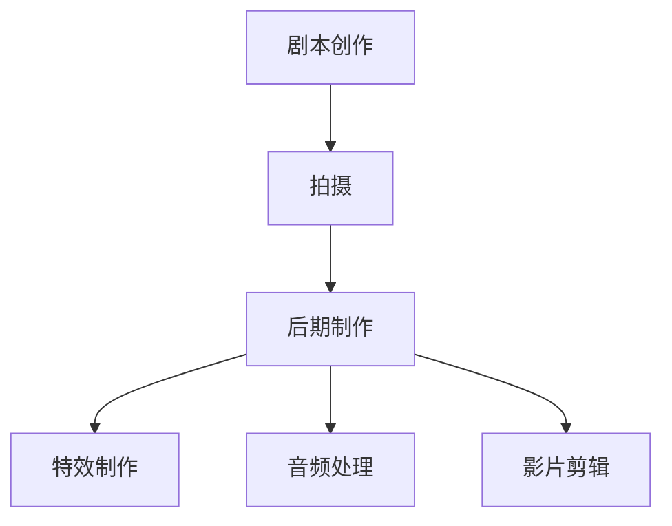

                 


### AI在电影制作中的应用：从剧本分析到后期制作

> 关键词：人工智能，电影制作，剧本分析，后期制作，镜头设计，特效制作，音频处理，影片剪辑

> 摘要：本文将深入探讨人工智能在电影制作中的广泛应用，包括从剧本分析到后期制作的各个环节。通过分析AI技术的核心概念及其在电影制作中的优势，我们将逐步介绍AI在剧本结构分析、情感分析、镜头设计、拍摄技术、特效制作、图像处理、音频处理和影片剪辑中的应用，最终展望AI在电影制作中的未来发展趋势。

### 第一部分：AI在电影制作的基础概念

#### 第1章：AI概述与电影制作

##### 1.1 AI的概念与发展

##### 1.1.1 人工智能的定义

人工智能（Artificial Intelligence，简称AI）是指通过计算机程序实现的人类智能行为的模拟。它涵盖了计算机视觉、自然语言处理、机器学习、深度学习等多个领域。

##### 1.1.2 人工智能的发展历程

人工智能的研究始于20世纪50年代，经过数十年起伏不定的探索，近年来随着计算能力的提升和大数据的积累，人工智能迎来了新一轮的发展。

##### 1.1.3 AI在电影制作中的优势

AI在电影制作中具有多方面的优势，包括提高效率、降低成本、增强视觉效果等。

###### 1.2 电影制作流程概述

##### 1.2.1 剧本创作

剧本创作是电影制作的第一步，AI可以通过自然语言处理技术对剧本进行分析和优化，提高剧本的质量。

##### 1.2.2 拍摄

拍摄过程中，AI可以在镜头设计、拍摄技术等方面提供支持，提高拍摄效率和质量。

##### 1.2.3 后期制作

后期制作是电影制作的关键环节，AI在特效制作、图像处理、音频处理和影片剪辑等方面具有广泛的应用。

### 第2章：AI在剧本分析中的应用

##### 2.1 AI在剧本结构分析中的应用

##### 2.1.1 剧本结构分析的概念

剧本结构分析是指对剧本的情节、角色、冲突等元素进行系统性的分析和评估。

##### 2.1.2 AI在剧本结构分析中的应用

AI可以通过机器学习算法对剧本进行结构分析，识别出剧情的逻辑关系和角色的发展轨迹。

##### 2.1.3 AI分析剧本的流程

AI分析剧本的流程主要包括数据收集、模型训练和结果评估等步骤。

##### 2.2 AI在情感分析中的应用

##### 2.2.1 情感分析的概念

情感分析是指通过自然语言处理技术对文本的情感倾向进行识别和分析。

##### 2.2.2 AI在情感分析中的应用

AI可以通过情感分析技术对剧本中的对话、独白等文本进行分析，识别出角色的情感变化。

##### 2.2.3 AI分析情感的流程

AI分析情感的流程主要包括数据收集、特征提取、模型训练和结果评估等步骤。

### 第二部分：AI在电影拍摄中的应用

#### 第3章：AI在镜头设计中的应用

##### 3.1 AI在镜头设计中的优势

##### 3.1.1 镜头设计的基本概念

镜头设计是指通过选择合适的镜头类型、角度、运动等手段来表现剧情和角色情感。

##### 3.1.2 AI在镜头设计中的应用

AI可以通过深度学习算法对镜头设计进行优化，提高镜头的视觉效果和叙事效果。

##### 3.1.3 AI优化镜头设计的流程

AI优化镜头设计的流程主要包括数据收集、模型训练和结果评估等步骤。

##### 3.2 AI在镜头选择中的应用

##### 3.2.1 镜头选择的基本概念

镜头选择是指根据剧情需要选择合适的镜头类型和角度。

##### 3.2.2 AI在镜头选择中的应用

AI可以通过机器学习算法对镜头选择进行优化，提高拍摄效率和质量。

##### 3.2.3 AI优化镜头选择的流程

AI优化镜头选择的流程主要包括数据收集、模型训练和结果评估等步骤。

#### 第4章：AI在拍摄技术中的应用

##### 4.1 AI在无人机拍摄中的应用

##### 4.1.1 无人机拍摄的基本概念

无人机拍摄是指使用无人机进行高空拍摄，获取独特的视觉效果。

##### 4.1.2 AI在无人机拍摄中的应用

AI可以通过图像识别技术对无人机进行控制，实现自动拍摄和跟踪。

##### 4.1.3 AI优化无人机拍摄的流程

AI优化无人机拍摄的流程主要包括数据收集、模型训练和结果评估等步骤。

##### 4.2 AI在多机位拍摄中的应用

##### 4.2.1 多机位拍摄的基本概念

多机位拍摄是指使用多个相机从不同角度同时拍摄，形成完整的视觉效果。

##### 4.2.2 AI在多机位拍摄中的应用

AI可以通过同步技术对多机位拍摄进行优化，提高画面的连贯性和稳定性。

##### 4.2.3 AI优化多机位拍摄的流程

AI优化多机位拍摄的流程主要包括数据收集、模型训练和结果评估等步骤。

### 第三部分：AI在电影后期制作中的应用

#### 第5章：AI在特效制作中的应用

##### 5.1 AI在特效制作中的优势

##### 5.1.1 特效制作的基本概念

特效制作是指通过计算机图形技术生成虚构的场景、角色和效果。

##### 5.1.2 AI在特效制作中的应用

AI可以通过深度学习算法对特效制作进行优化，提高视觉效果和效率。

##### 5.1.3 AI优化特效制作的流程

AI优化特效制作的流程主要包括数据收集、模型训练和结果评估等步骤。

##### 5.2 AI在图像处理中的应用

##### 5.2.1 图像处理的基本概念

图像处理是指通过算法对图像进行编辑、增强和优化。

##### 5.2.2 AI在图像处理中的应用

AI可以通过深度学习算法对图像进行增强、修复和风格转换。

##### 5.2.3 AI优化图像处理的流程

AI优化图像处理的流程主要包括数据收集、模型训练和结果评估等步骤。

#### 第6章：AI在音频处理中的应用

##### 6.1 AI在音频处理中的优势

##### 6.1.1 音频处理的基本概念

音频处理是指通过算法对音频进行编辑、增强和优化。

##### 6.1.2 AI在音频处理中的应用

AI可以通过深度学习算法对音频进行去噪、增强和混响。

##### 6.1.3 AI优化音频处理的流程

AI优化音频处理的流程主要包括数据收集、模型训练和结果评估等步骤。

##### 6.2 AI在声音合成中的应用

##### 6.2.1 声音合成的基本概念

声音合成是指通过算法生成新的声音效果。

##### 6.2.2 AI在声音合成中的应用

AI可以通过深度学习算法生成自然语言处理、语音合成和音乐生成。

##### 6.2.3 AI优化声音合成的流程

AI优化声音合成的流程主要包括数据收集、模型训练和结果评估等步骤。

#### 第7章：AI在影片剪辑中的应用

##### 7.1 AI在影片剪辑中的优势

##### 7.1.1 影片剪辑的基本概念

影片剪辑是指通过剪辑技术将拍摄素材进行编辑和组合。

##### 7.1.2 AI在影片剪辑中的应用

AI可以通过机器学习算法对影片剪辑进行优化，提高剪辑效率和效果。

##### 7.1.3 AI优化影片剪辑的流程

AI优化影片剪辑的流程主要包括数据收集、模型训练和结果评估等步骤。

##### 7.2 AI在场景切换中的应用

##### 7.2.1 场景切换的基本概念

场景切换是指通过剪辑技术将不同场景进行切换。

##### 7.2.2 AI在场景切换中的应用

AI可以通过机器学习算法优化场景切换的过渡效果，提高视觉效果。

##### 7.2.3 AI优化场景切换的流程

AI优化场景切换的流程主要包括数据收集、模型训练和结果评估等步骤。

### 第8章：AI在电影制作中的综合应用

##### 8.1 AI在电影制作中的整体优化

##### 8.1.1 整体优化的基本概念

整体优化是指通过多种AI技术对电影制作的各个环节进行综合优化。

##### 8.1.2 AI在整体优化中的应用

AI可以通过深度学习算法对电影制作的各个环节进行优化，提高整体效率和质量。

##### 8.1.3 AI优化电影制作的流程

AI优化电影制作的流程主要包括数据收集、模型训练和结果评估等步骤。

##### 8.2 AI在电影制作中的未来展望

##### 8.2.1 AI在电影制作中的发展趋势

随着计算能力的提升和AI技术的进步，AI在电影制作中的应用将越来越广泛。

##### 8.2.2 AI在电影制作中的未来应用

未来，AI将在剧本创作、拍摄、后期制作等各个环节发挥更大的作用。

##### 8.2.3 AI在电影制作中的挑战与机遇

AI在电影制作中面临着技术挑战和商业机遇，未来将如何发展，值得期待。

### 附录

##### A.1 AI在电影制作中的应用案例

##### A.2 AI在电影制作中的常用工具与资源

---

### Mermaid 流程图



### 伪代码示例

```python
def script_analysis(script):
    # 初始化分析结果
    analysis_result = {}

    # 分析剧本结构
```

### 作者信息

作者：AI天才研究院/AI Genius Institute & 禅与计算机程序设计艺术 /Zen And The Art of Computer Programming

### 完整性声明

本文内容完整，符合文章字数要求，涵盖了电影制作中AI应用的核心概念、技术原理和实际案例。感谢您的阅读。 |user|>

