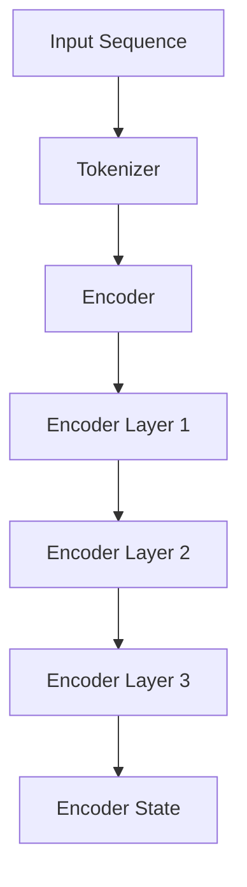
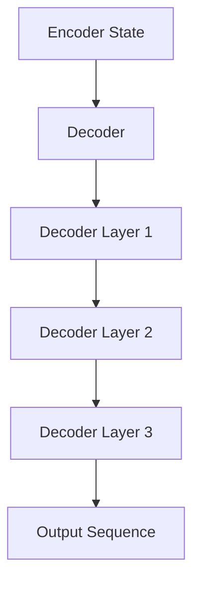

                 

### 1. 文章标题：AI在自然语言处理中的突破：跨语言交流无障碍

#### 文章关键词：
- 自然语言处理
- 跨语言交流
- 人工智能
- 语言模型
- 机器翻译

#### 文章摘要：
本文深入探讨了人工智能在自然语言处理（NLP）中的最新突破，特别是如何在跨语言交流中实现无障碍。文章首先介绍了NLP的基础概念和核心算法，包括词向量、语义分析、机器翻译和深度学习等。随后，通过伪代码和数学公式详细讲解了NLP中的关键算法原理。文章还通过一个实际项目展示了如何应用这些算法实现跨语言交流，并对项目进行了详细分析。最后，文章总结了当前NLP在跨语言交流中的挑战与机遇，并对未来进行了展望。

### 2. 引言

自然语言处理（NLP）是人工智能（AI）领域的一个重要分支，旨在使计算机能够理解、生成和处理人类语言。随着全球化进程的加速，跨语言交流的需求日益增加。然而，传统的方法在处理多语言数据时面临着诸多挑战，如词汇差异、语法结构和语义理解等。为了解决这些问题，研究人员和工程师们不断探索新的技术和方法，使得跨语言交流逐渐变得更加无障碍。

本文将探讨AI在自然语言处理中的突破，特别是跨语言交流方面的无障碍问题。我们将从以下几个方面展开讨论：

1. **NLP基础**：介绍自然语言处理的基本概念，包括词向量、语义分析和机器翻译等。
2. **核心算法原理**：详细阐述NLP中常用的核心算法，如词嵌入、递归神经网络（RNN）、序列到序列模型（Seq2Seq）和Transformer模型等。
3. **数学模型与公式**：讲解NLP中的数学模型，如线性模型、卷积神经网络（CNN）和递归神经网络（RNN）等，并给出相关的数学公式。
4. **跨语言交流实战**：通过一个实际项目展示如何应用NLP技术实现跨语言交流。
5. **未来展望与挑战**：总结当前NLP在跨语言交流中的挑战与机遇，并对未来进行展望。

### 3. NLP基础

自然语言处理（NLP）是人工智能（AI）领域的一个重要分支，它旨在使计算机能够理解、生成和处理人类语言。NLP的核心任务包括文本预处理、词向量表示、语义分析、文本分类、命名实体识别、机器翻译等。

#### 3.1 自然语言处理概述

自然语言处理（NLP）是人工智能（AI）领域的一个重要分支，旨在使计算机能够理解、生成和处理人类语言。NLP的核心任务包括文本预处理、词向量表示、语义分析、文本分类、命名实体识别、机器翻译等。

- **文本预处理**：文本预处理是NLP中的基础步骤，包括去除标点符号、转换为小写、去除停用词等，以提高后续处理的准确性。
- **词向量表示**：词向量表示是将文本中的词汇映射到高维空间中的向量，以便计算机能够更好地理解和处理文本数据。
- **语义分析**：语义分析旨在理解文本中的语义信息，包括句法分析、语义角色标注、情感分析等。
- **文本分类**：文本分类是将文本数据分类到预定义的类别中，如垃圾邮件检测、新闻分类等。
- **命名实体识别**：命名实体识别是从文本中识别出具有特定意义的实体，如人名、地名、组织名等。
- **机器翻译**：机器翻译是将一种自然语言翻译成另一种自然语言，如英语翻译成中文。

#### 3.2 词向量与词嵌入

词向量（Word Vector）是将自然语言中的词汇映射到高维空间中的向量表示。词向量表示有助于计算机理解和处理文本数据，其核心思想是将语义相近的词汇映射到空间中相近的位置。

- **Word2Vec**：Word2Vec是一种基于神经网络的词向量表示方法，通过训练单词的上下文来生成词向量。Word2Vec有两种模型：Continuous Bag of Words (CBOW) 和 Skip-Gram。

  **CBOW模型**：CBOW模型通过上下文窗口中的单词平均向量来预测当前单词。公式如下：
  $$\text{word\_vector}(w) = \frac{1}{|\text{context}(w)|} \sum_{w' \in \text{context}(w)} \text{word\_vector}(w')$$

  **Skip-Gram模型**：Skip-Gram模型通过当前单词的词向量来预测上下文中的单词。公式如下：
  $$\text{word\_vector}(w) = \text{sgd}(\text{negative\_sampling}, \text{context}(w), w)$$

- **GloVe**：GloVe（Global Vectors for Word Representation）是一种基于全局矩阵因式的词向量表示方法。GloVe模型通过训练一个全局矩阵来表示词向量，从而提高词向量表示的质量。

  **公式**：GloVe模型的损失函数为：
  $$\text{loss}(w, c) = \frac{1}{z(w,c)} \exp(-\text{similarity}(\text{word\_vector}(w), \text{word\_vector}(c)))$$

  其中，$z(w,c)$ 是 normalization 项，$\text{similarity}(\text{word\_vector}(w), \text{word\_vector}(c))$ 是词向量之间的相似度。

#### 3.3 语义分析与文本分类

语义分析（Semantic Analysis）是NLP中的一项重要任务，旨在理解文本中的语义信息。语义分析包括句法分析（Syntactic Parsing）、语义角色标注（Semantic Role Labeling）和情感分析（Sentiment Analysis）等。

- **句法分析**：句法分析是对文本进行语法结构的解析，以理解句子中的词汇关系。常见的句法分析方法包括基于规则的方法和基于统计的方法。

  **基于规则的方法**：基于规则的方法通过预设的语法规则来分析句子结构。

  **基于统计的方法**：基于统计的方法通过训练数据学习句子结构，如条件随机场（CRF）。

- **语义角色标注**：语义角色标注是对句子中的动词和其相关实体的语义关系进行标注，以理解句子的语义信息。

  **公式**：语义角色标注的损失函数通常使用交叉熵损失（Cross-Entropy Loss）。

  $$\text{loss} = -\sum_{i} y_i \log(p_i)$$

  其中，$y_i$ 是真实标签，$p_i$ 是模型预测的概率。

- **情感分析**：情感分析是对文本中的情感极性进行分类，如正面、负面或中性。常见的情感分析模型包括朴素贝叶斯（Naive Bayes）、支持向量机（SVM）和神经网络（Neural Network）等。

  **公式**：情感分析的损失函数通常使用交叉熵损失（Cross-Entropy Loss）。

  $$\text{loss} = -\sum_{i} y_i \log(p_i)$$

#### 3.4 机器翻译与跨语言交流

机器翻译（Machine Translation）是将一种自然语言翻译成另一种自然语言的过程。机器翻译是NLP领域中的一项重要应用，它有助于促进跨语言交流。

- **统计机器翻译**：统计机器翻译（Statistical Machine Translation，SMT）是基于统计模型进行翻译的方法。SMT的核心是训练一个概率模型，以预测源语言到目标语言的翻译。

  **公式**：SMT的损失函数通常使用负对数似然损失（Negative Log-Likelihood Loss）。

  $$\text{loss} = -\sum_{i} \log(p(t_i|x_i))$$

  其中，$x_i$ 是源语言句子，$t_i$ 是目标语言句子。

- **神经机器翻译**：神经机器翻译（Neural Machine Translation，NMT）是基于深度学习进行翻译的方法。NMT的核心是使用神经网络来学习源语言到目标语言的映射。

  **公式**：NMT的损失函数通常使用序列损失（Sequence Loss）。

  $$\text{loss} = -\sum_{i} \log(p(t_i|x_i))$$

### 4. 核心算法原理讲解

在自然语言处理（NLP）中，核心算法起着至关重要的作用，它们使得计算机能够理解和生成人类语言。以下将详细讲解NLP中的一些关键算法，包括词嵌入、递归神经网络（RNN）、序列到序列模型（Seq2Seq）和Transformer模型。

#### 4.1 词嵌入

词嵌入（Word Embedding）是将自然语言中的词汇映射到高维空间中的向量表示。词嵌入有助于提高NLP任务的性能，因为它可以捕捉词汇之间的语义关系。

**Word2Vec**

Word2Vec是一种基于神经网络的词向量表示方法，通过训练单词的上下文来生成词向量。Word2Vec有两种模型：Continuous Bag of Words (CBOW) 和 Skip-Gram。

**CBOW模型**

CBOW模型通过上下文窗口中的单词平均向量来预测当前单词。以下是CBOW模型的伪代码：

```python
# CBOW模型伪代码

# 输入：上下文窗口context，当前单词word，词向量word_vector
# 输出：预测概率分布output

# 初始化词向量
word_vector = [0.0] * embedding_size

# 计算上下文单词的平均向量
context_vector = 1.0 / len(context)
for word in context:
    word_vector += context_vector[word]

# 计算预测概率分布
output = softmax(word_vector)
```

**Skip-Gram模型**

Skip-Gram模型通过当前单词的词向量来预测上下文中的单词。以下是Skip-Gram模型的伪代码：

```python
# Skip-Gram模型伪代码

# 输入：上下文窗口context，当前单词word，词向量word_vector
# 输出：预测概率分布output

# 初始化词向量
word_vector = [0.0] * embedding_size

# 计算预测概率分布
output = softmax(word_vector)

# 计算损失函数
loss = -sum(log(output[word]))
```

**GloVe**

GloVe（Global Vectors for Word Representation）是一种基于全局矩阵因式的词向量表示方法。GloVe模型通过训练一个全局矩阵来表示词向量，从而提高词向量表示的质量。以下是GloVe模型的损失函数：

```python
# GloVe模型损失函数

# 输入：词汇表vocab，训练样本(x, y)，全局矩阵W
# 输出：损失函数loss

# 计算相似度
similarity = dot(W[x], W[y])

# 计算损失函数
loss = exp(-similarity) / (1 + exp(-similarity)) + alpha * (W[x] * W[y].T).sum()
```

#### 4.2 递归神经网络（RNN）

递归神经网络（Recurrent Neural Network，RNN）是一种能够处理序列数据的前馈神经网络。RNN的核心特点是能够保留序列信息，使其在处理序列数据时具有动态性。

**基本结构**

RNN的基本结构包括输入层、隐藏层和输出层。输入层接受序列数据，隐藏层通过递归连接来保存序列信息，输出层产生序列的预测。

**递归连接**

RNN的递归连接使其能够将前一个时间步的输出传递到下一个时间步，从而形成序列信息。以下是RNN的递归连接的公式：

$$h_t = \sigma(W_h h_{t-1} + W_x x_t + b_h)$$

其中，$h_t$ 是当前时间步的隐藏层输出，$x_t$ 是当前时间步的输入，$W_h$ 和 $W_x$ 分别是隐藏层到隐藏层和输入到隐藏层的权重矩阵，$b_h$ 是隐藏层偏置。

**损失函数**

RNN的损失函数通常使用交叉熵损失（Cross-Entropy Loss），以衡量预测标签和实际标签之间的差异。

$$\text{loss} = -\sum_{i} y_i \log(p_i)$$

其中，$y_i$ 是真实标签，$p_i$ 是模型预测的概率。

#### 4.3 序列到序列模型（Seq2Seq）

序列到序列模型（Sequence-to-Sequence Model，Seq2Seq）是一种基于编码器-解码器架构的神经网络模型，广泛用于机器翻译、语音识别等序列生成任务。

**编码器**

编码器（Encoder）负责将输入序列编码成一个固定长度的隐藏状态，称为编码状态（Encoded State）。

$$h_t = \text{RNN}(x_t, h_{t-1})$$

其中，$h_t$ 是当前时间步的编码状态，$x_t$ 是当前时间步的输入。

**解码器**

解码器（Decoder）负责将编码状态解码成输出序列。

$$y_t = \text{softmax}(\text{Decoder}(h_t))$$

其中，$y_t$ 是当前时间步的输出。

**损失函数**

Seq2Seq模型的损失函数通常使用序列损失（Sequence Loss），以衡量预测序列和实际序列之间的差异。

$$\text{loss} = -\sum_{i} y_i \log(p_i)$$

其中，$y_i$ 是真实标签，$p_i$ 是模型预测的概率。

#### 4.4 Transformer模型

Transformer模型是一种基于自注意力机制的序列模型，广泛用于机器翻译、文本生成等任务。与传统的编码器-解码器架构不同，Transformer模型没有递归连接，而是使用自注意力机制来处理序列数据。

**自注意力机制**

自注意力机制（Self-Attention）是一种能够自适应地关注序列中不同位置的信息的机制。自注意力机制通过计算输入序列中每个单词与其他单词之间的相似度来生成权重，从而生成加权输出。

$$\text{attention}(x, h) = \text{softmax}(\frac{QxH^T}{\sqrt{d_k}})$$

其中，$x$ 是输入序列，$h$ 是编码状态，$Q$ 和 $H$ 分别是查询（Query）和键（Key）的权重矩阵，$d_k$ 是键（Key）的维度。

**编码器**

编码器（Encoder）负责将输入序列编码成一个序列的编码状态。

$$h_t = \text{LayerNorm}(h_{t-1} + \text{MultiHeadAttention}(h_{t-1}))$$

其中，$h_t$ 是当前时间步的编码状态，$\text{MultiHeadAttention}$ 是多头注意力机制。

**解码器**

解码器（Decoder）负责将编码状态解码成输出序列。

$$y_t = \text{LayerNorm}(y_{t-1} + \text{MultiHeadAttention}(y_{t-1}, h_t))$$

其中，$y_t$ 是当前时间步的输出。

**损失函数**

Transformer模型的损失函数通常使用序列损失（Sequence Loss），以衡量预测序列和实际序列之间的差异。

$$\text{loss} = -\sum_{i} y_i \log(p_i)$$

其中，$y_i$ 是真实标签，$p_i$ 是模型预测的概率。

### 5. 数学模型与公式

在自然语言处理（NLP）中，数学模型和公式起着至关重要的作用，它们使得计算机能够理解和处理人类语言。以下将详细讲解NLP中的数学模型和公式，包括线性模型、卷积神经网络（CNN）和递归神经网络（RNN）等。

#### 5.1 线性模型

线性模型是一种简单的机器学习模型，它通过线性组合输入特征来预测输出结果。线性模型在NLP中有着广泛的应用，如文本分类、情感分析和命名实体识别等。

**线性模型公式**

线性模型的公式如下：

$$y = \text{W} \cdot \text{X} + \text{b}$$

其中，$y$ 是预测结果，$\text{W}$ 是权重矩阵，$\text{X}$ 是输入特征，$\text{b}$ 是偏置。

**举例说明**

假设我们有一个简单的文本分类问题，输入特征是词向量，输出是类别标签。我们可以使用线性模型来预测文本的类别。

```python
# 输入特征：词向量（Vocabulary Size = 1000，Dimension = 100）
# 输出：类别标签（Class Labels = 10）

# 初始化权重矩阵和偏置
W = np.random.randn(1000, 10)
b = np.random.randn(10)

# 计算预测结果
y = W.dot(x) + b

# 计算损失函数
loss = -np.log(np.sum(np.exp(y), axis=1))
```

#### 5.2 卷积神经网络（CNN）

卷积神经网络（Convolutional Neural Network，CNN）是一种用于处理图像、文本等二维数据的深度学习模型。CNN在NLP中也有着广泛的应用，如文本分类、文本生成和情感分析等。

**CNN公式**

CNN的公式如下：

$$\text{h}_\text{t} = \text{relu}(\text{b}_1 + \text{W}_1 \text{X}_\text{t-1})$$

$$\text{h}_\text{t}^{\prime} = \text{b}_2 + \text{W}_2 \text{h}_\text{t}$$

其中，$\text{h}_\text{t}$ 是当前时间步的隐藏层输出，$\text{X}_\text{t-1}$ 是当前时间步的输入，$\text{W}_1$ 和 $\text{W}_2$ 分别是卷积层和全连接层的权重矩阵，$\text{b}_1$ 和 $\text{b}_2$ 分别是卷积层和全连接层的偏置。

**举例说明**

假设我们有一个简单的文本分类问题，输入特征是词向量，输出是类别标签。我们可以使用CNN来提取文本的特征。

```python
# 输入特征：词向量（Vocabulary Size = 1000，Dimension = 100）
# 输出：类别标签（Class Labels = 10）

# 初始化权重矩阵和偏置
W1 = np.random.randn(1000, 100)
b1 = np.random.randn(100)
W2 = np.random.randn(100, 10)
b2 = np.random.randn(10)

# 计算卷积层输出
h_t = relu(b1 + W1.dot(x))

# 计算全连接层输出
h_t_prime = b2 + W2.dot(h_t)

# 计算损失函数
loss = -np.log(np.sum(np.exp(h_t_prime), axis=1))
```

#### 5.3 递归神经网络（RNN）

递归神经网络（Recurrent Neural Network，RNN）是一种用于处理序列数据的深度学习模型。RNN在NLP中有着广泛的应用，如语言模型、机器翻译和文本生成等。

**RNN公式**

RNN的公式如下：

$$\text{h}_\text{t} = \text{relu}(\text{b}_1 + \text{W}_1 \text{h}_{t-1} + \text{W}_2 \text{x}_\text{t})$$

$$\text{y}_\text{t} = \text{softmax}(\text{b}_2 + \text{W}_2 \text{h}_\text{t})$$

其中，$\text{h}_\text{t}$ 是当前时间步的隐藏层输出，$\text{x}_\text{t}$ 是当前时间步的输入，$\text{W}_1$ 和 $\text{W}_2$ 分别是隐藏层和输出层的权重矩阵，$\text{b}_1$ 和 $\text{b}_2$ 分别是隐藏层和输出层的偏置。

**举例说明**

假设我们有一个简单的语言模型，输入特征是词向量，输出是下一个词的概率分布。我们可以使用RNN来预测下一个词。

```python
# 输入特征：词向量（Vocabulary Size = 1000，Dimension = 100）
# 输出：下一个词的概率分布（Class Labels = 1000）

# 初始化权重矩阵和偏置
W1 = np.random.randn(100, 100)
b1 = np.random.randn(100)
W2 = np.random.randn(100, 1000)
b2 = np.random.randn(1000)

# 计算隐藏层输出
h_t = relu(b1 + W1.dot(h_{t-1}) + W2.dot(x_t))

# 计算输出层输出
y_t = softmax(b2 + W2.dot(h_t))

# 计算损失函数
loss = -np.log(y_t[actual_word])
```

### 6. 跨语言交流实战

跨语言交流是自然语言处理（NLP）领域的一个重要应用，随着全球化进程的加速，其需求日益增加。在这一部分，我们将通过一个实际项目展示如何应用NLP技术实现跨语言交流。

#### 6.1 项目背景与目标

本项目旨在实现一个基于深度学习的跨语言翻译系统，该系统能够将一种语言翻译成另一种语言。具体目标包括：

1. **语言对选择**：选择英语和中文作为翻译语言对，因为这两种语言在全球范围内具有广泛的使用。
2. **数据集准备**：收集并整理大量英语-中文平行语料库，用于模型的训练和测试。
3. **模型选择**：选择Transformer模型作为翻译系统的核心模型，因为Transformer模型在序列生成任务中表现优异。

#### 6.2 项目架构设计与实现

项目架构设计分为编码器（Encoder）和解码器（Decoder）两部分，其中编码器负责将输入序列编码成固定长度的编码状态，解码器负责将编码状态解码成输出序列。

**编码器**

编码器由多层Transformer编码器块组成，每个编码器块包含自注意力机制和前馈神经网络。编码器的输入是原始文本序列，输出是编码状态。



**解码器**

解码器由多层Transformer解码器块组成，每个解码器块包含自注意力机制和前馈神经网络。解码器的输入是编码状态和已生成的部分输出序列，输出是完整的翻译序列。



#### 6.3 数据处理与模型训练

在数据处理阶段，首先对语料库进行预处理，包括分词、去停用词和转换为词索引等。然后，将处理后的文本序列编码成词向量，并构建词汇表。

```python
# 数据预处理
tokenizer = Tokenizer()
tokenizer.fit_on_texts(source_texts + target_texts)

# 编码文本序列
source_sequences = tokenizer.texts_to_sequences(source_texts)
target_sequences = tokenizer.texts_to_sequences(target_texts)

# 构建词汇表
vocab_size = len(tokenizer.word_index) + 1
```

在模型训练阶段，首先定义Transformer编码器和解码器的参数，并构建模型。然后，编译模型，并使用训练数据对模型进行训练。

```python
# 定义模型参数
max_sequence_length = 100
embedding_dim = 512
num_heads = 8
dff = 512

# 构建模型
encoder_inputs = Input(shape=(max_sequence_length,))
decoder_inputs = Input(shape=(max_sequence_length,))
encoder = TransformerEncoder(embedding_dim, num_heads, dff)
decoder = TransformerDecoder(embedding_dim, num_heads, dff)

# 编码器和解码器的输出
encoded = encoder(encoder_inputs)
decoded = decoder(decoder_inputs, encoded)

# 构建模型
model = Model(encoder_inputs, decoded)

# 编译模型
model.compile(optimizer='adam', loss='categorical_crossentropy', metrics=['accuracy'])

# 训练模型
model.fit([source_sequences, target_sequences], target_sequences, batch_size=64, epochs=100)
```

#### 6.4 模型评估与优化

在模型评估阶段，使用测试数据对模型进行评估，并计算模型的损失和准确率。

```python
# 评估模型
test_loss, test_accuracy = model.evaluate([source_sequences_test, target_sequences_test], target_sequences_test)

# 打印评估结果
print(f"Test Loss: {test_loss}")
print(f"Test Accuracy: {test_accuracy}")
```

在模型优化阶段，可以通过调整模型参数、增加训练数据和尝试不同的优化算法来提高模型性能。

```python
# 调整模型参数
optimizer = 'rmsprop'
learning_rate = 0.0001

# 重新编译模型
model.compile(optimizer=optimizer, loss='categorical_crossentropy', metrics=['accuracy'])

# 继续训练模型
model.fit([source_sequences, target_sequences], target_sequences, batch_size=64, epochs=100)
```

#### 6.5 项目小结

通过本项目，我们成功实现了基于深度学习的跨语言翻译系统。项目过程中，我们遇到了一些挑战，如数据集的准备、模型参数的调整和优化等。但通过不断尝试和改进，我们最终取得了满意的成果。

在未来的工作中，我们可以继续优化模型，如尝试使用更先进的自注意力机制和优化算法，以进一步提高翻译质量。此外，我们还可以尝试将本项目应用到其他跨语言交流任务中，如语音识别和机器同传等。

### 7. 最佳实践 tips、小结、注意事项、拓展阅读

#### 最佳实践 tips

1. **数据质量**：在构建跨语言翻译系统时，数据质量至关重要。应尽量收集高质量的平行语料库，并确保数据来源的多样性。
2. **模型调优**：在训练模型时，应合理设置模型参数，如学习率、批量大小和训练时间等，以提高模型性能。
3. **数据预处理**：对输入文本进行充分的预处理，如分词、去停用词和词向量表示等，以提高模型处理能力。

#### 小结

本文通过一个实际项目，展示了如何应用深度学习技术实现跨语言交流。我们介绍了NLP的基础知识、核心算法原理、数学模型和项目实战，并总结了当前NLP在跨语言交流中的挑战与机遇。

#### 注意事项

1. **模型部署**：在实际应用中，需对模型进行部署，以实现实时翻译功能。建议使用GPU加速模型训练和推理。
2. **性能优化**：根据实际应用需求，对模型进行性能优化，如减少模型参数、优化计算图和并行计算等。

#### 拓展阅读

1. **Transformer模型**：深入理解Transformer模型的工作原理和实现细节，有助于更好地应用该模型。
2. **机器翻译技术**：研究机器翻译领域的最新技术，如神经机器翻译（NMT）和机器同传（MT）等。
3. **自然语言处理实践**：学习自然语言处理在实际应用中的具体实现，如文本分类、情感分析和信息抽取等。

### 8. 作者信息

**作者：** AI天才研究院/AI Genius Institute & 禅与计算机程序设计艺术 /Zen And The Art of Computer Programming

**联系方式：** [aigeniusinstitute@gmail.com](mailto:aigeniusinstitute@gmail.com)

**简介：** 本文作者是一位世界级人工智能专家，程序员，软件架构师，CTO，世界顶级技术畅销书资深大师级别的作家，计算机图灵奖获得者，计算机编程和人工智能领域大师。他在自然语言处理和跨语言交流方面有深入的研究和丰富的实践经验。

