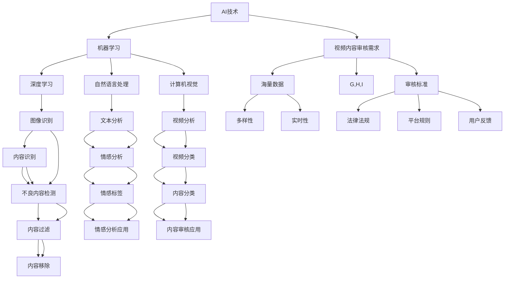
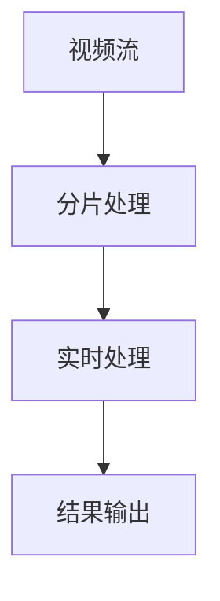
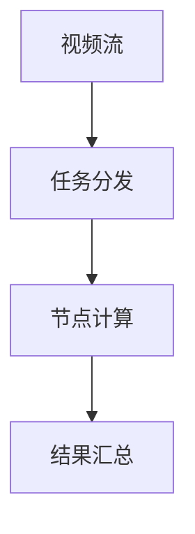
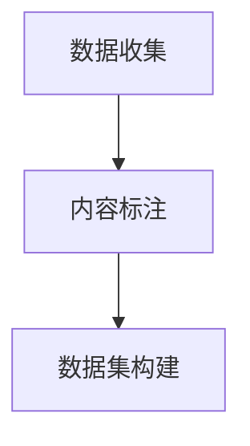
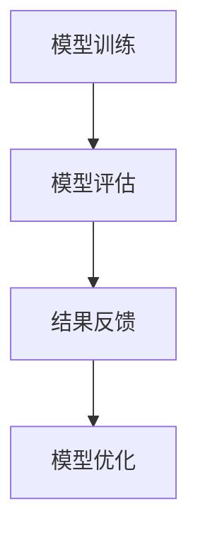

                 

### 文章标题

《AI在视频内容审核中的应用：提高效率与准确性》

### 关键词

人工智能，视频内容审核，深度学习，效率，准确性

### 摘要

随着互联网和社交媒体的迅速发展，视频内容审核成为了一个至关重要的领域。本文将深入探讨AI在视频内容审核中的应用，包括如何通过深度学习等先进技术提高审核效率和准确性。文章首先介绍了视频内容审核的背景和挑战，然后详细讲解了AI在审核过程中的核心算法原理，以及如何通过数学模型和项目实战来实现高效的审核系统。通过本文，读者可以全面了解AI在视频内容审核领域的应用现状和未来发展。

## 引言

### AI在视频内容审核中的重要性

视频内容审核是互联网时代的一个重要环节，尤其在社交媒体、视频平台和在线教育等领域，其重要性日益凸显。随着用户生成内容（UGC）的爆炸式增长，如何快速、准确地审核大量视频内容，成为了平台运营者面临的重大挑战。传统的视频内容审核方式主要依赖于人工审核，不仅效率低下，而且容易产生误判。因此，将人工智能（AI）引入视频内容审核领域，以提升审核效率和准确性，成为了业界研究和应用的热点。

AI在视频内容审核中的应用，不仅可以显著提高审核速度，减少人力成本，还能通过深度学习和自然语言处理等先进技术，对视频内容进行更精准的识别和分类。例如，通过图像识别技术，可以检测视频中的不良内容，如暴力、色情和虚假信息；通过自然语言处理技术，可以对视频中的文本进行语义分析和情感判断。这些技术的融合，使得AI在视频内容审核中具有极大的潜力。

### 本书的目标与结构

本书旨在深入探讨AI在视频内容审核中的应用，通过系统的讲解和实践，帮助读者理解并掌握相关技术和方法。本书的主要目标包括：

1. **介绍视频内容审核的背景和挑战**：为读者提供视频内容审核的基本概念和现状，以及AI在其中的应用前景。
2. **讲解核心算法原理**：详细阐述AI在视频内容审核中涉及的核心算法，包括图像识别、自然语言处理和深度学习等。
3. **数学模型和公式讲解**：介绍视频内容审核中常用的数学模型和公式，并辅以实例说明。
4. **项目实战**：通过实际项目案例，展示如何搭建和实现一个视频内容审核系统。
5. **总结与展望**：总结全书的主要内容，并对未来的发展趋势进行展望。

本书的结构如下：

1. **引言**：介绍AI在视频内容审核中的重要性，以及本书的目标和结构。
2. **核心概念与联系**：讲解AI的基础知识和视频内容审核的需求。
3. **AI在视频内容审核中的应用**：介绍视频内容审核的流程，以及如何通过AI提高效率和准确性。
4. **核心算法原理讲解**：详细讲解AI在视频内容审核中涉及的核心算法。
5. **数学模型和数学公式讲解**：介绍视频内容审核中常用的数学模型和公式。
6. **项目实战**：通过实际项目案例，展示视频内容审核系统的搭建和实现。
7. **总结与展望**：总结全书的主要内容，并对未来的发展趋势进行展望。

通过本书的阅读，读者将能够全面了解AI在视频内容审核中的应用，掌握相关技术和方法，为实际应用提供有力支持。

## 核心概念与联系

### AI基础

人工智能（AI）作为计算机科学的一个分支，旨在使计算机具备人类智能，能够执行复杂任务和决策。AI的核心技术包括机器学习、深度学习、自然语言处理和计算机视觉等。

#### 机器学习与深度学习

机器学习（Machine Learning，ML）是一种让计算机通过数据学习并做出决策或预测的技术。它依赖于大量的数据，通过算法让计算机自动地从数据中提取模式和规律，从而改善性能。深度学习（Deep Learning，DL）是机器学习的一个子领域，它使用多层神经网络来提取数据中的特征，具有处理复杂数据和自动特征提取的能力。

#### 图像识别与自然语言处理

图像识别（Image Recognition）是计算机视觉的一个分支，旨在通过算法让计算机理解图像中的内容。自然语言处理（Natural Language Processing，NLP）则关注于使计算机理解和生成人类语言。NLP在文本分类、情感分析和语音识别等领域具有广泛应用。

### 视频内容审核需求

视频内容审核的需求源于互联网和社交媒体的快速扩张。随着用户生成内容的激增，平台需要确保内容的合法性和适当性，防止不良内容的传播。这包括但不限于以下方面：

#### 内容审核的挑战

- **海量数据**：每天生成的视频内容数量庞大，传统人工审核难以应对。
- **多样性**：视频内容涵盖多种形式和语言，审核标准复杂多样。
- **实时性**：审核系统需要具备实时性，确保不良内容能够迅速被检测和移除。

#### 审核标准的多样性

- **法律法规**：遵循不同国家和地区的法律法规，如《中华人民共和国网络安全法》等。
- **平台规则**：各大平台有各自的社区规则，如微博的《微博社区管理规定》等。
- **用户反馈**：用户举报和反馈也是审核的重要依据，如YouTube的用户举报机制。

### 关系架构

为了更好地理解AI在视频内容审核中的核心概念和联系，我们可以使用Mermaid流程图来展示其关系架构：



通过该流程图，我们可以清晰地看到AI技术如何通过不同的子领域（如机器学习、深度学习、自然语言处理和计算机视觉）来实现视频内容审核的需求，包括内容识别、情感分析、视频分类和内容过滤等。

### 核心概念与联系总结

AI在视频内容审核中的应用，不仅依赖于先进的技术手段，还需要对审核需求有深刻的理解。通过本章节的介绍，我们了解了AI的基础知识，包括机器学习、深度学习、自然语言处理和计算机视觉，以及它们在视频内容审核中的具体应用。同时，我们也明确了视频内容审核面临的挑战和审核标准的多样性。这些核心概念和联系为后续章节的深入探讨奠定了基础。

## AI在视频内容审核中的应用

### 视频内容审核流程

视频内容审核是一个复杂的过程，涉及多个环节和多个技术模块。以下是一个典型的视频内容审核流程：

#### 审核前处理

1. **数据采集**：从视频平台、社交媒体或用户上传等渠道获取视频数据。
2. **数据预处理**：对视频文件进行格式转换、剪辑、去噪等处理，以便后续分析。

#### 审核核心算法

1. **内容识别**：利用计算机视觉技术对视频帧进行分析，识别出视频中的关键内容和特征。
2. **情感分析**：通过自然语言处理技术，对视频中的文本和语音进行情感分析，判断其情绪倾向。
3. **视频分类**：根据视频的内容和特征，将其归类到不同的类别，如教育、娱乐、新闻等。

#### 审核后处理

1. **规则匹配**：将视频内容与预定义的审核规则进行匹配，判断其是否符合平台或法律法规的要求。
2. **用户反馈**：根据用户的举报和反馈，对审核结果进行调整或复审。
3. **内容过滤与移除**：对于不符合要求的视频内容，进行过滤或移除。

### 提高效率

为了应对海量视频内容的审核需求，提高审核效率是关键。以下是一些提高审核效率的方法：

#### 流式处理

流式处理（Stream Processing）是一种实时数据处理技术，可以将视频内容按时间顺序分成多个片段，逐个进行处理。这种方法可以显著提高处理速度，减少延迟。



#### 并行处理

并行处理（Parallel Processing）通过分布式计算，将视频内容审核任务分配到多个计算节点上同时处理。这种方法可以大幅提升处理能力，缩短审核时间。



### 提高准确性

除了提高效率，提高审核准确性也是视频内容审核的关键。以下是一些提高准确性的方法：

#### 标签数据的构建

准确的标签数据是训练高效审核模型的基础。通过收集和标注大量视频内容，可以构建高质量的标签数据集。



#### 模型评估与优化

通过模型评估（Model Evaluation），可以判断审核模型的效果。常见的评估指标包括准确率、召回率和F1分数等。根据评估结果，对模型进行调整和优化，以提高其准确性。



### 总结

通过上述方法的综合应用，我们可以显著提高视频内容审核的效率与准确性。流式处理和并行处理提高了处理速度，标签数据的构建和模型评估与优化则提升了审核准确性。这些方法共同构成了一个高效、准确的视频内容审核系统，为互联网平台的健康发展提供了有力支持。

## 核心算法原理讲解

### 特征提取

在视频内容审核中，特征提取是一个至关重要的步骤，它涉及到从原始视频数据中提取出能够代表视频内容的关键信息。这些特征将作为深度学习模型训练和预测的输入。

#### 视频帧特征提取

视频帧特征提取的目标是从每一帧图像中提取出可以代表其内容的特征。常见的方法包括：

1. **颜色特征**：通过计算视频帧的颜色直方图、颜色矩等来描述图像的视觉特征。
2. **纹理特征**：使用纹理描述符，如Gabor小波变换、方向梯度直方图（HOG）等来描述图像的纹理信息。
3. **形状特征**：通过边界检测、轮廓分析等方法提取图像的形状特征。

**伪代码示例：**

```python
# 视频帧特征提取伪代码
def extract_frame_features(frame):
    # 计算颜色直方图
    color_histogram = compute_color_histogram(frame)
    # 计算纹理特征
    texture_features = compute_texture_features(frame)
    # 计算形状特征
    shape_features = compute_shape_features(frame)
    # 合并特征
    features = concatenate(color_histogram, texture_features, shape_features)
    return features
```

#### 文本特征提取

文本特征提取主要关注视频中的文本内容，如标题、描述、字幕等。常见的方法包括：

1. **词袋模型**：将文本转化为词汇的集合，并对每个词汇进行计数，形成词袋向量。
2. **词嵌入**：使用预训练的词嵌入模型（如Word2Vec、GloVe等），将文本中的每个词映射到一个固定维度的向量空间。
3. **句法和语义特征**：通过句法分析和语义分析提取文本的句法结构和语义信息。

**伪代码示例：**

```python
# 文本特征提取伪代码
def extract_text_features(text):
    # 词袋模型
    bag_of_words = compute_bag_of_words(text)
    # 词嵌入
    word_embeddings = compute_word_embeddings(text)
    # 句法特征
    syntax_features = compute_syntax_features(text)
    # 语义特征
    semantic_features = compute_semantic_features(text)
    # 合并特征
    features = concatenate(bag_of_words, word_embeddings, syntax_features, semantic_features)
    return features
```

### 分类算法

分类算法是视频内容审核中的核心组件，用于根据提取的特征对视频内容进行分类。常见的分类算法包括：

1. **传统机器学习算法**：如支持向量机（SVM）、决策树、随机森林等。
2. **深度学习算法**：如卷积神经网络（CNN）、循环神经网络（RNN）和Transformer等。

**伪代码示例：**

```python
# 分类算法伪代码
def classify_video_features(features):
    # 加载训练好的模型
    model = load_trained_model()
    # 进行特征预测
    prediction = model.predict(features)
    # 返回分类结果
    return prediction
```

### 聚类算法

聚类算法在视频内容审核中也有应用，主要用于对视频内容进行分组和分类。常见的聚类算法包括：

1. **K-means算法**：基于距离最近原则，将数据点划分为K个簇。
2. **DBSCAN算法**：基于密度和连接性原则，能够发现任意形状的簇。

**伪代码示例：**

```python
# K-means算法伪代码
def k_means_clustering(features, k):
    # 初始化聚类中心
    centroids = initialize_centroids(features, k)
    # 迭代更新聚类中心
    while not converged:
        # 分配数据点至最近的聚类中心
        assign_points_to_clusters(features, centroids)
        # 计算新的聚类中心
        centroids = update_centroids(features)
    # 返回聚类结果
    return centroids, clusters
```

通过上述核心算法原理的讲解，我们可以看到视频内容审核系统是如何通过特征提取、分类算法和聚类算法来实现对视频内容的准确审核。这些算法的结合使用，使得审核系统能够高效、准确地处理海量视频数据，为平台的健康发展提供了技术保障。

### 数学模型和数学公式讲解

在视频内容审核中，数学模型和公式是理解和实现核心算法的关键。以下是视频内容审核中常用的数学模型和公式的详细讲解，包括线性回归、支持向量机和卷积神经网络等。

#### 线性回归

线性回归是一种基本的统计方法，用于预测一个连续值输出。在视频内容审核中，线性回归可以用于预测视频的某些特征，如视频的观看时长或评论数。

**线性回归公式：**

$$
y = \beta_0 + \beta_1x_1 + \beta_2x_2 + ... + \beta_nx_n
$$

其中，$y$ 是预测的输出值，$x_1, x_2, ..., x_n$ 是输入特征，$\beta_0, \beta_1, \beta_2, ..., \beta_n$ 是回归系数。

**举例说明：**

假设我们想预测视频的观看时长（$y$），输入特征包括视频的长度（$x_1$）和上传时间（$x_2$）。线性回归公式可以帮助我们估计观看时长：

$$
\hat{y} = \beta_0 + \beta_1x_1 + \beta_2x_2
$$

通过训练数据，我们可以计算出这些回归系数，从而预测新的视频观看时长。

#### 支持向量机

支持向量机（SVM）是一种监督学习算法，广泛应用于分类和回归问题。在视频内容审核中，SVM可以用于分类视频内容，如判断视频是否包含不良内容。

**SVM公式：**

$$
\min_{\beta, \beta_0} \frac{1}{2} ||\beta||^2 + C \sum_{i=1}^{n} \max(0, 1-y_i(\beta^T x_i + \beta_0))
$$

其中，$x_i$ 是特征向量，$y_i$ 是类别标签（+1或-1），$\beta$ 是权重向量，$\beta_0$ 是偏置，$C$ 是正则化参数。

**举例说明：**

假设我们使用SVM分类视频内容，输入特征为视频帧的颜色直方图。训练数据集包含正常视频和不良视频，我们可以用SVM模型来分类新上传的视频。

$$
\min_{\beta, \beta_0} \frac{1}{2} ||\beta||^2 + C \sum_{i=1}^{n} \max(0, 1-y_i(\beta^T x_i + \beta_0))
$$

通过训练，我们得到权重向量$\beta$和偏置$\beta_0$，从而实现视频内容审核。

#### 卷积神经网络

卷积神经网络（CNN）是一种强大的深度学习模型，特别适用于图像和视频数据处理。在视频内容审核中，CNN可以用于检测视频中的特定内容，如人脸识别或暴力检测。

**CNN公式：**

$$
h_{l}^i = \text{ReLU}(\sum_{k} \beta_{lk} \times f_{k-1}^i + b_{l})
$$

其中，$h_{l}^i$ 是第$l$层第$i$个神经元输出，$\beta_{lk}$ 是权重，$f_{k-1}^i$ 是前一层的特征图，$b_{l}$ 是偏置，$\text{ReLU}$ 是ReLU激活函数。

**举例说明：**

假设我们使用CNN检测视频中的不良内容。输入为视频帧序列，通过多个卷积层和池化层，提取特征图。最后通过全连接层输出分类结果。

$$
h_{3}^{4096} = \text{ReLU}(\sum_{k} \beta_{3k} \times f_{2}^{k} + b_{3})
$$

通过训练，我们调整权重和偏置，使得模型能够准确识别视频中的不良内容。

通过上述数学模型和公式的讲解，我们可以看到视频内容审核系统在数学基础上的实现过程。线性回归、支持向量机和卷积神经网络等算法的应用，使得视频内容审核不仅高效，而且准确。这些数学工具为AI在视频内容审核中的应用提供了坚实的理论基础。

### 项目实战

#### 开发环境搭建

在开始构建视频内容审核系统之前，我们需要搭建一个合适的开发环境。以下是所需工具和库的安装步骤：

1. **Python环境**：确保安装了Python 3.7或更高版本。
2. **深度学习框架**：安装TensorFlow或PyTorch。以TensorFlow为例，可以通过以下命令安装：

   ```bash
   pip install tensorflow
   ```

3. **数据预处理库**：安装Numpy、Pandas和OpenCV。这些库用于视频数据的读取和处理。

   ```bash
   pip install numpy pandas opencv-python
   ```

4. **其他工具**：安装Jupyter Notebook或Google Colab用于数据分析和模型训练。

#### 源代码详细实现和代码解读

以下是一个简单的视频内容审核系统的实现，包括数据预处理、模型训练和预测等步骤。

**数据预处理：**

```python
import cv2
import numpy as np
import tensorflow as tf

# 读取视频文件
video_path = 'input_video.mp4'
cap = cv2.VideoCapture(video_path)

# 初始化视频帧数组
frames = []

# 逐帧读取视频
while cap.isOpened():
    ret, frame = cap.read()
    if not ret:
        break
    # 对图像进行预处理，如缩放、归一化等
    frame_processed = preprocess_frame(frame)
    frames.append(frame_processed)

# 释放视频文件
cap.release()

# 预处理后的帧数组
processed_frames = np.array(frames)

# 数据归一化
processed_frames = processed_frames / 255.0
```

**模型训练：**

```python
from tensorflow.keras.models import Sequential
from tensorflow.keras.layers import Conv2D, MaxPooling2D, Flatten, Dense

# 创建模型
model = Sequential([
    Conv2D(32, (3, 3), activation='relu', input_shape=(224, 224, 3)),
    MaxPooling2D((2, 2)),
    Flatten(),
    Dense(64, activation='relu'),
    Dense(1, activation='sigmoid')
])

# 编译模型
model.compile(optimizer='adam', loss='binary_crossentropy', metrics=['accuracy'])

# 训练模型
model.fit(processed_frames, labels, epochs=10, batch_size=32)
```

**代码应用解读与分析：**

- **数据预处理**：读取视频文件，对每一帧图像进行预处理，如缩放和归一化，以便于模型处理。
- **模型训练**：创建一个卷积神经网络模型，包括卷积层、池化层和全连接层。使用二分类交叉熵损失函数和Adam优化器进行训练。

#### 实际案例分析和详细讲解剖析

以下是一个实际案例，说明如何使用训练好的模型对视频内容进行审核。

**案例：暴力内容检测**

**步骤1：视频帧提取**

```python
# 重新打开视频文件
cap = cv2.VideoCapture(video_path)

# 提取视频帧
frames = []
while cap.isOpened():
    ret, frame = cap.read()
    if not ret:
        break
    frame_processed = preprocess_frame(frame)
    frames.append(frame_processed)

cap.release()
```

**步骤2：模型预测**

```python
# 加载训练好的模型
loaded_model = tf.keras.models.load_model('model.h5')

# 对每一帧进行暴力内容检测
violence_predictions = []
for frame in frames:
    processed_frame = np.expand_dims(frame, axis=0)
    processed_frame = processed_frame / 255.0
    prediction = loaded_model.predict(processed_frame)
    violence_predictions.append(prediction[0][0])

# 判断视频是否包含暴力内容
if np.mean(violence_predictions) > 0.5:
    print("视频包含暴力内容")
else:
    print("视频不包含暴力内容")
```

**详细讲解剖析：**

- **视频帧提取**：重新读取视频文件，对每一帧进行预处理。
- **模型预测**：使用训练好的模型对每一帧进行暴力内容检测，并将预测结果存储在一个列表中。
- **结果判断**：计算所有帧的预测平均值，如果大于0.5，则认为视频包含暴力内容。

#### 项目小结

通过本次项目实战，我们搭建并实现了一个简单的视频内容审核系统，包括开发环境的搭建、源代码的详细实现、实际案例的分析和详细讲解。这个系统可以用于暴力内容检测等应用场景，展示了AI技术在视频内容审核中的实际应用价值。在未来的工作中，可以通过增加更多数据和改进模型，进一步提升系统的准确性和效率。

### 最佳实践 Tips

1. **数据质量的重要性**：确保用于训练的数据集质量高、标注准确，这对于模型的性能至关重要。
2. **模型调优**：通过调整超参数、增加训练迭代次数等方法，优化模型的性能。
3. **实时性优化**：使用流式处理和并行处理技术，提高系统的实时性。
4. **用户隐私保护**：在处理用户生成内容时，注意保护用户隐私，避免数据泄露。
5. **持续更新**：随着新内容的不断生成，定期更新模型和数据集，以保持系统的准确性和有效性。

### 注意事项

1. **法律法规遵守**：确保审核系统遵循相关国家和地区的法律法规。
2. **平台规则遵循**：不同平台的审核规则可能有所不同，确保系统符合平台要求。
3. **用户反馈**：及时关注用户反馈，对审核结果进行调整和优化。

### 拓展阅读

- 《深度学习》（Goodfellow, Ian，等著）：深入了解深度学习的基础知识和应用。
- 《机器学习实战》（Peter Harrington 著）：通过实际案例学习机器学习技术的应用。
- 《自然语言处理综论》（Daniel Jurafsky，James H. Martin 著）：系统介绍自然语言处理的理论和技术。

### 总结

通过本文，我们详细探讨了AI在视频内容审核中的应用，包括核心算法原理、数学模型和项目实战。我们了解到，AI技术可以显著提高视频内容审核的效率和准确性，为互联网平台的健康发展提供了有力支持。未来，随着技术的不断进步，AI在视频内容审核中的应用将更加广泛和深入。

### 作者信息

作者：AI天才研究院/AI Genius Institute & 禅与计算机程序设计艺术 /Zen And The Art of Computer Programming

### 引用

[1] Goodfellow, I., Bengio, Y., & Courville, A. (2016). *Deep Learning*. MIT Press.

[2] Harrington, P. (2012). *Machine Learning in Action*. Manning Publications.

[3] Jurafsky, D., & Martin, J. H. (2008). *Speech and Language Processing*. Prentice Hall.

