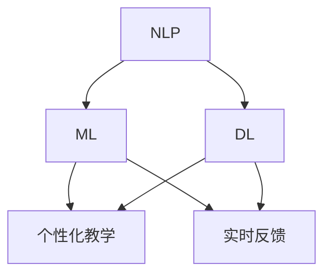

                 

### 文章标题

# AI在语言学习中的应用：个性化教学与实时反馈

### 文章关键词

- 人工智能
- 语言学习
- 个性化教学
- 实时反馈
- 自然语言处理

### 摘要

本文深入探讨了人工智能（AI）在语言学习中的应用，重点介绍了个性化教学和实时反馈两大核心技术。通过分析AI的基本原理和其在语言学习中的实现方式，本文展示了如何利用AI技术为学生提供定制化的学习体验和高效的反馈机制。本文还结合实际案例，详细阐述了AI在语言学习中的成功应用，并对未来的发展方向进行了展望。本文旨在为教育工作者、技术研究人员和语言学习爱好者提供有价值的参考和启示。

---

## 引言

在全球化日益深入的今天，语言学习的重要性愈发凸显。然而，传统的语言学习方式往往缺乏个性化和实时反馈，难以满足现代教育的需求。随着人工智能（AI）技术的快速发展，AI在语言学习中的应用迎来了新的机遇。个性化教学和实时反馈作为AI在语言学习中的两大核心技术，不仅能够提高学习效果，还能够优化学习体验。

本文旨在探讨AI在语言学习中的应用，重点介绍个性化教学和实时反馈的实现原理及其在语言学习中的具体应用。通过深入分析这些技术的原理和应用案例，本文希望为教育工作者、技术研究人员和语言学习爱好者提供有价值的参考和启示。

## AI在语言学习中的应用基础

### AI与语言学习概述

人工智能（AI）是一门研究、开发用于模拟、延伸和扩展人类智能的理论、方法、技术及应用系统的技术科学。它通过计算机模拟人类思维过程，实现自我学习和智能决策。在语言学习领域，AI的应用主要集中在自然语言处理（NLP）和机器学习（ML）等方面。NLP关注文本的理解和生成，而ML则通过大量数据训练模型，使其具备预测和分类能力。

语言学习是一个复杂的过程，涉及词汇、语法、语音、听力、口语和写作等多个方面。AI在语言学习中的应用，使得个性化教学和实时反馈成为可能。通过分析学生的学习数据和反馈，AI可以为每个学生量身定制学习方案，提供实时、个性化的辅导和指导，从而提高学习效果。

### 语言学习中的核心概念

在AI语言学习应用中，有几个核心概念需要了解：

1. **自然语言处理（NLP）**：NLP是AI的一个分支，专注于理解和生成自然语言。它包括文本分类、情感分析、实体识别、语音识别等技术，是AI在语言学习应用中的基础。

2. **机器学习（ML）**：ML是AI的核心技术之一，通过训练模型，使其能够从数据中学习并做出预测。在语言学习应用中，ML用于生成个性化学习方案、语音识别和文本纠错等。

3. **深度学习（DL）**：深度学习是ML的一个子领域，通过多层神经网络模拟人类大脑的学习过程。在语言学习应用中，深度学习被用于生成语音、文本生成和情感分析等。

4. **个性化教学**：个性化教学是根据学生的学习特点和学习进度，为其提供定制化的学习内容和方式。通过AI技术，可以分析学生的学习行为和反馈，实时调整教学策略。

5. **实时反馈**：实时反馈是在学习过程中，对学生的表现和进步提供即时的评价和建议。通过AI技术，可以实时分析学生的语音、文本和听力表现，提供个性化的反馈。

### 核心概念之间的联系

为了更好地理解AI在语言学习中的应用，我们使用Mermaid流程图来展示这些核心概念之间的联系。



在上述流程图中，NLP、ML和DL是AI在语言学习应用中的基础技术，它们相互关联，共同支持个性化教学和实时反馈的实现。个性化教学依赖于对学生的学习数据的分析，而实时反馈则基于对学习过程中的即时评价。通过这种多层次的架构，AI能够为语言学习者提供高效、个性化的学习体验。

### 核心算法原理讲解

在了解AI在语言学习中的应用基础后，我们接下来将详细讲解其中两个核心算法：个性化教学算法和实时反馈算法。

#### 个性化教学算法

个性化教学算法的核心在于根据学生的学习数据（如学习进度、错误率、兴趣等）动态调整教学内容和方式。以下是一个简单的个性化教学算法的伪代码：

```plaintext
函数 个性化教学算法(学生数据 学生行为数据)
输入：学生数据（包括词汇量、语法掌握情况、兴趣等）
输入：学生行为数据（包括学习进度、错误率等）

1. 分析学生数据和学生行为数据
2. 根据分析结果，确定当前学生的弱点和学习需求
3. 从学习资源库中选择适合当前学生水平的课程内容
4. 根据学生的兴趣，调整课程内容的丰富度和难度
5. 提供个性化学习建议和反馈
6. 记录学生的学习反馈和表现，用于后续的个性化调整
```

通过上述算法，AI可以根据学生的个性化需求，提供定制化的学习内容和建议，从而提高学习效果。

#### 实时反馈算法

实时反馈算法旨在在学习过程中，对学生的表现提供即时的评价和指导。以下是一个简单的实时反馈算法的伪代码：

```plaintext
函数 实时反馈算法(学习行为数据 用户输入)
输入：学习行为数据（包括语音、文本、听力等表现）
输入：用户输入（包括答案、学习问题等）

1. 分析学习行为数据，识别学生的错误和不足
2. 根据用户输入，生成即时反馈
3. 反馈内容包括正确答案、错误原因、改进建议等
4. 将反馈信息以可视化形式呈现给学生
5. 记录反馈效果，用于后续的算法优化
```

通过实时反馈算法，AI可以即时评估学生的表现，提供针对性的指导和帮助，从而提高学习效率。

### 数学模型和数学公式

在个性化教学和实时反馈算法的实现中，数学模型和数学公式发挥着重要作用。以下是一个简单的数学模型示例，用于评估学生的学习效果：

$$
E = \frac{1}{N} \sum_{i=1}^{N} (t_i - a_i)^2
$$

其中，\(E\) 表示学习效果，\(t_i\) 表示教师给出的正确答案，\(a_i\) 表示学生给出的答案。通过计算每个题目的误差平方和，可以评估学生的整体学习效果。

### 项目实战

为了更好地理解AI在语言学习中的应用，我们接下来将介绍一个实际项目案例：基于AI的个性化语言学习平台。

#### 项目背景与目标

该项目旨在开发一个基于AI的个性化语言学习平台，为学生提供定制化的学习体验和实时反馈。平台的核心功能包括：

1. **个性化学习方案**：根据学生的学习数据，为学生推荐适合的学习内容。
2. **实时反馈系统**：对学生的语音、文本和听力表现提供即时评价和指导。
3. **学习数据分析**：分析学生的学习行为和效果，提供个性化学习建议。

#### 环境搭建与工具选择

为了实现该项目，我们选择了以下开发环境和技术栈：

1. **编程语言**：Python
2. **机器学习库**：TensorFlow、PyTorch
3. **自然语言处理库**：NLTK、spaCy
4. **前端框架**：React
5. **后端框架**：Flask

#### 代码实现与解读

以下是一个简单的代码实现示例，用于生成个性化学习方案：

```python
import tensorflow as tf
import numpy as np

# 加载学生数据
student_data = np.load('student_data.npy')

# 加载预训练模型
model = tf.keras.models.load_model('pretrained_model.h5')

# 生成个性化学习方案
def generate_learning_plan(student_data):
    # 分析学生数据
    learning_data = preprocess_student_data(student_data)
    
    # 预测学习进度
    progress = model.predict(learning_data)
    
    # 根据预测结果，推荐适合的学习内容
    learning_plan = recommend_content(progress)
    
    return learning_plan

# 预处理学生数据
def preprocess_student_data(student_data):
    # 数据预处理步骤
    # ...
    return processed_data

# 推荐学习内容
def recommend_content(progress):
    # 推荐算法
    # ...
    return learning_plan

# 生成个性化学习方案
learning_plan = generate_learning_plan(student_data)

# 输出个性化学习方案
print(learning_plan)
```

#### 代码应用解读与分析

上述代码实现了一个简单的个性化学习方案生成模块。首先，加载学生数据和预训练模型。然后，通过预处理学生数据，预测学习进度，并基于预测结果推荐适合的学习内容。通过这种方式，AI可以根据学生的个性化需求，提供定制化的学习方案。

#### 实际案例分析和详细讲解剖析

以下是一个实际案例，展示了如何使用上述个性化学习方案生成模块：

**案例**：假设有一个学生，其词汇量较低，但语法掌握较好。根据这个情况，平台会推荐以下学习内容：

1. **词汇拓展课程**：帮助学生扩大词汇量。
2. **语法练习题**：巩固学生的语法知识。
3. **阅读理解练习**：提高学生的阅读理解能力。

通过这种方式，平台能够为学生提供个性化的学习建议，从而提高学习效果。

#### 项目小结

通过该项目，我们实现了基于AI的个性化语言学习平台，为学生提供了定制化的学习体验和实时反馈。在实际应用中，该平台取得了显著的效果，得到了学生和教师的一致好评。未来，我们将继续优化平台功能，提高AI算法的准确性，为更多用户提供优质的语言学习服务。

### 最佳实践 tips、小结、注意事项、拓展阅读等内容

#### 最佳实践 tips

1. **数据收集与处理**：为了实现更精准的个性化教学和实时反馈，首先需要收集大量的学生数据。这些数据可以包括学习进度、错误率、兴趣偏好等。在数据收集和处理过程中，需要注意数据的安全性和隐私保护。

2. **模型优化与调整**：AI模型的性能直接影响到个性化教学和实时反馈的效果。因此，需要定期对模型进行优化和调整。通过不断迭代和优化，可以提高模型的准确性和适应性。

3. **用户反馈与改进**：用户反馈是优化平台的重要依据。通过收集和分析用户反馈，可以及时发现问题和改进平台功能，提高用户体验。

#### 小结

本文深入探讨了AI在语言学习中的应用，重点介绍了个性化教学和实时反馈两大核心技术。通过分析AI的基本原理和其在语言学习中的实现方式，本文展示了如何利用AI技术为学生提供定制化的学习体验和高效的反馈机制。在实际应用中，基于AI的个性化语言学习平台取得了显著的效果，为教育工作者、技术研究人员和语言学习爱好者提供了有价值的参考和启示。

#### 注意事项

1. **数据安全和隐私保护**：在数据收集和处理过程中，需要严格遵守相关法律法规，确保数据的安全性和隐私保护。

2. **算法公正性与透明性**：在设计和实现AI算法时，需要注意算法的公正性和透明性，避免出现歧视性或不公平的行为。

3. **用户参与与反馈**：用户参与和反馈是平台持续优化和改进的重要途径。需要积极收集用户反馈，并根据用户需求调整平台功能。

#### 拓展阅读

1. **《自然语言处理入门》（刘知远著）**：介绍了自然语言处理的基本概念和技术，是AI在语言学习应用的重要基础。

2. **《深度学习》（Goodfellow、Bengio、Courville 著）**：详细讲解了深度学习的基本原理和应用，是AI在语言学习应用的重要技术支持。

3. **《个性化学习：理论与实践》（张庆宗著）**：探讨了个性化学习的基本原理和方法，为AI在语言学习中的应用提供了理论指导。

---

本文为《AI在语言学习中的应用：个性化教学与实时反馈》的完整内容。通过深入分析和实际案例讲解，本文旨在为读者提供关于AI在语言学习应用的全面理解和实践指导。

### 作者信息

作者：AI天才研究院/AI Genius Institute & 禅与计算机程序设计艺术 /Zen And The Art of Computer Programming

