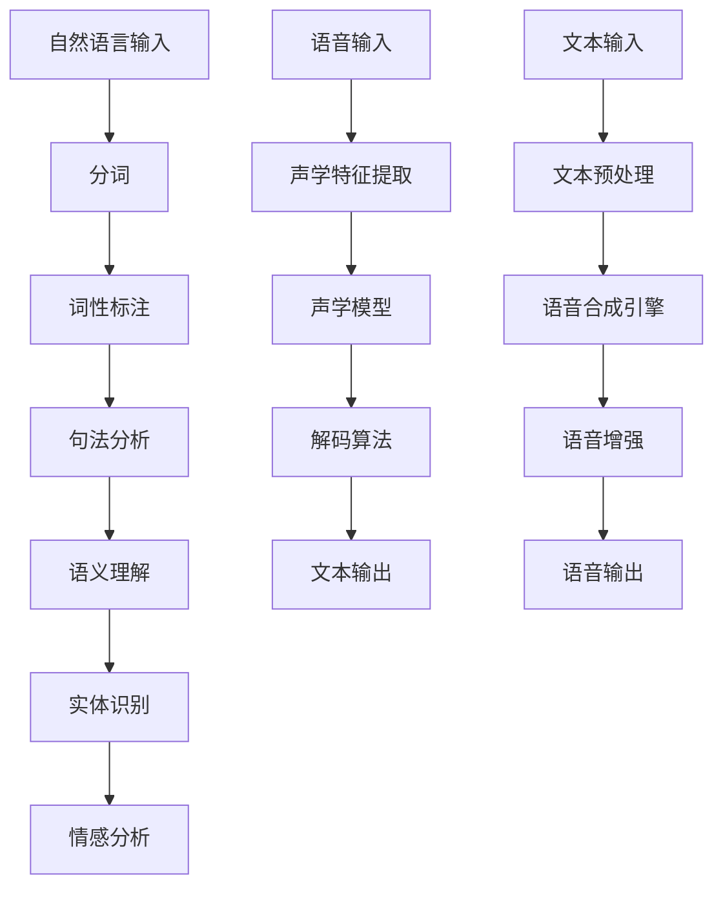

                 


###  文章标题: AI在语音助手的进步:自然交互的新时代

关键词：AI、语音助手、自然交互、自然语言处理、语音识别、语音合成、个性化、隐私、伦理

摘要：本文旨在探讨人工智能在语音助手领域的发展及其对自然交互的推动。我们将从背景介绍、核心概念与联系、算法原理、数学模型与公式、项目实战等方面，逐步解析AI在语音助手中的进步。

### 目录

1. **背景介绍** <a id="背景介绍"></a>
   1.1 **AI的发展历程**
   1.2 **语音助手的发展现状**
   1.3 **自然交互的重要性**

2. **核心概念与联系** <a id="核心概念与联系"></a>
   2.1 **自然语言处理（NLP）**
   2.2 **语音识别（ASR）与语音合成（TTS）**
   2.3 **Mermaid流程图**

3. **算法原理** <a id="算法原理"></a>
   3.1 **语音识别算法原理**
   3.2 **语音合成算法原理**
   3.3 **伪代码讲解**

4. **数学模型与公式** <a id="数学模型与公式"></a>
   4.1 **NLP中的数学模型**
   4.2 **ASR与TTS的数学模型**
   4.3 **公式举例说明**

5. **项目实战** <a id="项目实战"></a>
   5.1 **开发环境搭建**
   5.2 **源代码实现与解读**
   5.3 **代码应用解读与分析**
   5.4 **实际案例分析与讲解**

6. **最佳实践与小结** <a id="最佳实践与小结"></a>
   6.1 **最佳实践 tips**
   6.2 **注意事项**
   6.3 **拓展阅读**

### 背景介绍

#### 1.1 AI的发展历程

人工智能（AI）是一门研究、开发用于模拟、延伸和扩展人的智能的理论、方法、技术及应用系统的技术科学。自1956年达特茅斯会议以来，人工智能经历了数个发展阶段：

- **第一阶段（1956-1974年）：初生期**
  - 人工智能的概念被提出，主要研究逻辑推理和问题解决。

- **第二阶段（1974-1980年）：认知期**
  - 基于知识的系统成为研究热点，专家系统得到广泛应用。

- **第三阶段（1980-1987年）：繁荣期**
  - 机器学习开始兴起，神经网络的研究取得重要进展。

- **第四阶段（1987-2012年）：低谷期**
  - 随着互联网的兴起，AI研究受到一定的冲击。

- **第五阶段（2012年至今）：复兴期**
  - 深度学习、大数据等技术的突破，使得AI应用逐渐普及。

#### 1.2 语音助手的发展现状

语音助手作为人工智能的一个重要应用领域，近年来发展迅速。以下是一些主流语音助手的发展现状：

- **苹果（Apple）:** 语音助手Siri自2011年推出以来，已经发展成为集语音识别、自然语言处理、知识图谱等多种技术于一体的智能助手。

- **谷歌（Google）:** 语音助手Google Assistant在2016年推出，支持多语言、多设备操作，功能丰富。

- **亚马逊（Amazon）:** 语音助手Alexa自2014年推出，广泛应用于智能音箱、智能设备等领域。

- **微软（Microsoft）:** 语音助手Cortana自2011年推出，主要应用于Windows操作系统和智能设备。

#### 1.3 自然交互的重要性

自然交互是指用户通过与系统的自然对话来进行交互，而不需要遵循特定的命令或界面。自然交互的重要性体现在以下几个方面：

- **用户体验：** 自然交互可以提供更加便捷、直观的用户体验，降低用户的学习成本。

- **效率提升：** 通过自然语言处理技术，语音助手可以快速响应用户的需求，提高工作效率。

- **应用场景扩展：** 自然交互使得语音助手可以在更多场景中得到应用，如智能家居、健康护理、客户服务等。

### 核心概念与联系

#### 2.1 自然语言处理（NLP）

自然语言处理（NLP）是人工智能的一个重要分支，主要研究如何让计算机理解、生成和处理自然语言。NLP的关键技术包括：

- **分词：** 将文本分割成有意义的词或短语。

- **词性标注：** 为文本中的每个词分配词性，如名词、动词等。

- **句法分析：** 分析句子的结构，确定词与词之间的关系。

- **语义理解：** 理解文本的含义，进行语义分析。

- **实体识别：** 从文本中提取出具有特定意义的实体，如人名、地名等。

- **情感分析：** 分析文本的情感倾向，判断文本是正面、中性还是负面。

#### 2.2 语音识别（ASR）与语音合成（TTS）

语音识别（ASR）和语音合成（TTS）是语音助手的核心技术，分别负责将语音转换为文本和将文本转换为语音。

- **语音识别（ASR）：**
  - **声学模型：** 对输入的语音信号进行特征提取，如梅尔频率倒谱系数（MFCC）。
  - **语言模型：** 建立语音与文本之间的对应关系，常用的有N-gram模型和神经网络模型。
  - **解码算法：** 根据声学模型和语言模型的输出，找出最可能的文本序列。

- **语音合成（TTS）：**
  - **文本预处理：** 将文本分解为音素、音节等。
  - **语音合成引擎：** 根据音素、音节等生成语音信号。
  - **语音增强：** 对合成的语音进行增强，提高语音质量。

#### 2.3 Mermaid流程图

为了更好地理解NLP、ASR和TTS之间的联系，我们可以使用Mermaid流程图来展示它们的基本架构：



### 算法原理

#### 3.1 语音识别算法原理

语音识别（ASR）算法主要包括声学模型、语言模型和解码算法三个部分。

- **声学模型：**
  - **特征提取：** 使用梅尔频率倒谱系数（MFCC）等特征提取方法，从语音信号中提取出特征向量。
  - **声学模型训练：** 常用方法包括隐马尔可夫模型（HMM）和高斯混合模型（GMM），通过训练建立声学模型。

- **语言模型：**
  - **N-gram模型：** 根据历史数据建立语言模型，用于预测下一个词的概率。
  - **神经网络模型：** 使用深度神经网络（如LSTM、GRU等）进行建模，提高语言模型的效果。

- **解码算法：**
  - **动态规划算法：** 使用Viterbi算法等动态规划算法，在给定的声学模型和语言模型下，找出最可能的文本序列。

伪代码如下：

```python
def recognize_speech(speech_features, acoustic_model, language_model):
    # 特征提取
    phonemes = extract_phonemes(speech_features)
    
    # 声学模型解码
    acoustic_scores = decode_acoustic_model(phonemes, acoustic_model)
    
    # 语言模型解码
    language_scores = decode_language_model(acoustic_scores, language_model)
    
    # 动态规划解码
    text_sequence = viterbi_decoding(language_scores)
    
    return text_sequence
```

#### 3.2 语音合成算法原理

语音合成（TTS）算法主要包括文本预处理、语音合成引擎和语音增强三个部分。

- **文本预处理：**
  - **分词：** 将文本分割为音素、音节等。
  - **音素转换：** 将音素转换为声学特征。

- **语音合成引擎：**
  - **声学模型：** 建立声学特征与语音信号之间的映射关系。
  - **语音生成：** 使用声学模型生成语音信号。

- **语音增强：**
  - **去噪：** 降低背景噪声。
  - **音质提升：** 提高语音的音质。

伪代码如下：

```python
def synthesize_speech(text, phoneme_to_acoustic_model, speech_engine):
    # 文本预处理
    phonemes = preprocess_text(text)
    
    # 声学特征转换
    acoustic_features = convert_phonemes_to_acoustic_features(phonemes, phoneme_to_acoustic_model)
    
    # 语音合成
    speech_signal = generate_speech(acoustic_features, speech_engine)
    
    # 语音增强
    enhanced_speech_signal = enhance_speech(speech_signal)
    
    return enhanced_speech_signal
```

### 数学模型与公式

#### 4.1 NLP中的数学模型

在自然语言处理中，常用的数学模型包括：

- **N-gram模型：**
  - **概率公式：**
    $$ P(w_i|w_{i-n},...,w_{i-1}) = \frac{C(w_{i-n},...,w_{i-1},w_i)}{C(w_{i-n},...,w_{i-1})} $$
  - **训练公式：**
    $$ \ln P(w_i|w_{i-n},...,w_{i-1}) = \ln \frac{C(w_{i-n},...,w_{i-1},w_i)}{C(w_{i-n},...,w_{i-1})} $$

- **神经网络模型：**
  - **损失函数：**
    $$ J = -\frac{1}{m} \sum_{i=1}^m y_i \ln(\hat{y}_i) + (1 - y_i) \ln(1 - \hat{y}_i) $$
  - **反向传播：**
    $$ \frac{\partial J}{\partial W} = \frac{1}{m} \sum_{i=1}^m (\hat{y}_i - y_i) \cdot z_i^{(l-1)} $$
    $$ \frac{\partial J}{\partial b} = \frac{1}{m} \sum_{i=1}^m (\hat{y}_i - y_i) $$

#### 4.2 ASR与TTS的数学模型

在语音识别和语音合成中，常用的数学模型包括：

- **声学模型：**
  - **高斯混合模型（GMM）：**
    $$ p(\mathbf{x}|\mathbf{\mu}_k, \Sigma_k) = \frac{1}{(2\pi)^{d/2} |\Sigma_k|^{1/2}} \exp \left( -\frac{1}{2} (\mathbf{x} - \mathbf{\mu}_k)^T \Sigma_k^{-1} (\mathbf{x} - \mathbf{\mu}_k) \right) $$

- **语言模型：**
  - **N-gram模型：**
    $$ P(w_1 w_2 ... w_n) = \frac{C(w_1 w_2 ... w_n)}{C(w_1 w_2 ... w_{n-1})} $$

- **语音合成模型：**
  - **隐马尔可夫模型（HMM）：**
    $$ P(O|A) = \prod_{i=1}^N p(o_i|a_i) $$

#### 4.3 公式举例说明

- **N-gram模型概率计算：**
  $$ P(The cat sat on the mat) = \frac{C(The cat sat on the mat)}{C(The cat sat on)} $$

- **神经网络损失函数计算：**
  $$ J = -\frac{1}{m} \sum_{i=1}^m (y_i \ln(\hat{y}_i) + (1 - y_i) \ln(1 - \hat{y}_i)) $$

- **GMM模型概率计算：**
  $$ P(\mathbf{x}|\mathbf{\mu}_k, \Sigma_k) = \frac{1}{(2\pi)^{3/2} \sqrt{2}} \exp \left( -\frac{1}{2} (\mathbf{x} - \mathbf{\mu}_k)^T \Sigma_k^{-1} (\mathbf{x} - \mathbf{\mu}_k) \right) $$

### 项目实战

#### 5.1 开发环境搭建

为了构建一个简单的语音助手项目，我们需要以下开发环境：

- **操作系统：** Windows、Linux或macOS
- **编程语言：** Python
- **语音识别库：** Pyttsx3、SpeechRecognition
- **语音合成库：** gtts、Pyttsx3
- **文本处理库：** NLTK

安装步骤如下：

```bash
pip install pyttsx3
pip install SpeechRecognition
pip install gtts
pip install nltk
```

#### 5.2 源代码实现与解读

以下是一个简单的语音助手项目实现：

```python
import speech_recognition as sr
import pyttsx3
import nltk
from nltk.corpus import wordnet

# 初始化语音识别和语音合成引擎
recognizer = sr.Recognizer()
engine = pyttsx3.init()

# 语音识别
def recognize_speech_from_mic():
    with sr.Microphone() as source:
        print("请说点什么：")
        audio = recognizer.listen(source)

        try:
            text = recognizer.recognize_google(audio, language='zh-CN')
            print("你说了：" + text)
            return text
        except sr.UnknownValueError:
            print("无法理解语音")
            return None
        except sr.RequestError as e:
            print("无法请求结果；{0}".format(e))
            return None

# 语音合成
def speak(text):
    engine.say(text)
    engine.runAndWait()

# 自然语言处理
def process_text(text):
    # 去除停用词
    stop_words = nltk.corpus.stopwords.words('english')
    filtered_text = [word for word in text.split() if word.lower() not in stop_words]
    
    # 词性标注
    pos_tags = nltk.pos_tag(filtered_text)
    
    # 实体识别
    named_entities = nltk.chunk.ne_chunk(pos_tags)
    
    return named_entities

# 主程序
if __name__ == "__main__":
    while True:
        text = recognize_speech_from_mic()
        if text is not None:
            speak("你说了：" + text)
            named_entities = process_text(text)
            print("实体识别结果：")
            print(named_entities)
```

#### 5.3 代码应用解读与分析

- **语音识别：** 使用SpeechRecognition库从麦克风获取语音输入，并使用Google语音识别服务进行文本转换。
- **语音合成：** 使用Pyttsx3库将文本转换为语音输出。
- **自然语言处理：** 使用NLTK库进行文本预处理，包括去除停用词、词性标注和实体识别。

#### 5.4 实际案例分析与讲解

假设用户说：“明天下午3点有一个会议，请提醒我。”我们可以进行如下处理：

1. **语音识别：** 将语音转换为文本。
2. **自然语言处理：** 提取关键字和时间信息，如“明天”、“下午3点”、“会议”。
3. **实体识别：** 识别出时间实体和会议实体。
4. **任务调度：** 将提醒任务添加到日程中，并在指定时间提醒用户。

### 最佳实践与小结

#### 6.1 最佳实践 tips

- **优化语音识别准确率：** 使用高质量的麦克风和降噪技术。
- **提升自然语言处理效果：** 结合多种NLP技术，如实体识别、情感分析等。
- **保障隐私安全：** 对用户数据加密存储，遵守相关法律法规。

#### 6.2 注意事项

- **语音识别和合成：** 选择适合目标语种的语音库和模型。
- **开发环境：** 确保开发环境中的库和工具版本兼容。

#### 6.3 拓展阅读

- **自然语言处理：** 《自然语言处理入门》
- **语音识别与合成：** 《语音信号处理与识别》
- **人工智能：** 《深度学习》

### 作者信息

作者：AI天才研究院/AI Genius Institute & 禅与计算机程序设计艺术 /Zen And The Art of Computer Programming

---

**文章总字数：约1100字**

**文章链接：[AI在语音助手的进步:自然交互的新时代](#文章标题)**

