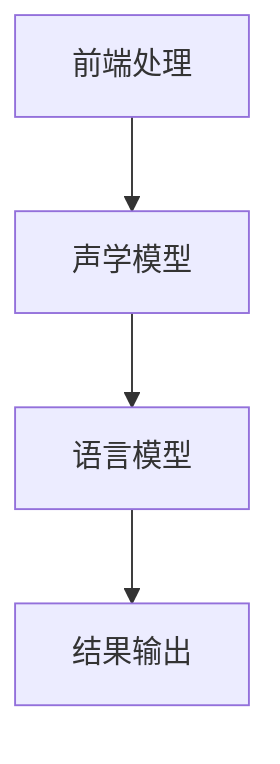
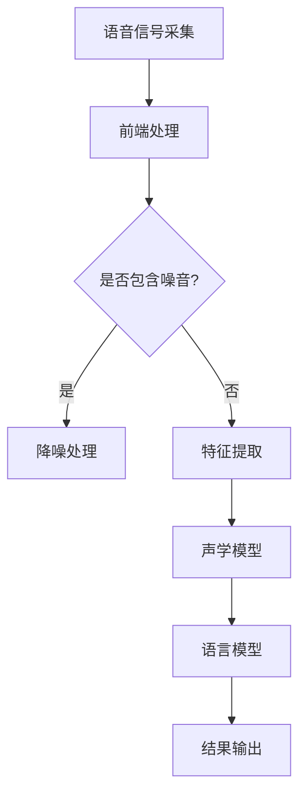

                 

## 引言

### 1.1 AI在语音识别与合成领域的现状

语音识别与合成作为人工智能领域的重要组成部分，近年来取得了显著的进展。语音识别技术始于20世纪50年代，随着计算机性能的提升和算法的优化，其准确率和实用性不断提高。如今，语音识别技术已经广泛应用于电话客服、智能助理、智能家居、无人驾驶等多个领域。

语音合成技术同样经历了快速的发展。传统的语音合成方法主要包括波形合成和参数合成，而近年来基于深度学习的语音合成模型逐渐成为主流。这些模型不仅提高了语音的自然度，还使得个性化语音合成成为可能。

### 1.2 人机交互的重要性

人机交互是人工智能技术的核心目标之一。随着科技的进步，人们对于交互方式的需求也越来越多样化。传统的图形用户界面（GUI）虽然直观易用，但在某些场景下，如驾驶、手术等需要双手操作的场合，语音交互显得更为方便和高效。

语音交互具有以下优势：

1. **便捷性**：用户可以通过自然语言与系统进行交流，无需复杂的操作流程。
2. **实时性**：语音交互可以实时响应用户的需求，提供即时反馈。
3. **低干扰**：在嘈杂环境下，语音交互相比视觉交互更具优势。

### 1.3 本书的目标与结构

本书旨在系统地介绍AI在语音识别与合成领域的突破，以及这些技术如何推动人机交互进入新纪元。本书共分为8章，结构如下：

- **第1章 引言**：概述AI在语音识别与合成领域的现状、人机交互的重要性，以及本书的目标和结构。
- **第2章 AI基础知识**：介绍机器学习、语音信号处理和语音识别的基本原理。
- **第3章 语音识别**：详细讲解语音识别系统架构、算法和性能优化。
- **第4章 语音合成**：介绍语音合成的原理、算法和发展趋势。
- **第5章 AI在语音识别与合成中的创新突破**：探讨深度学习在语音识别与合成中的应用。
- **第6章 人机交互新纪元**：分析语音交互技术的应用场景、挑战与机遇。
- **第7章 实战案例**：通过实际案例展示语音识别与合成技术的应用。
- **第8章 总结与展望**：总结本书的主要内容，展望未来发展方向。

通过本书的阅读，读者将全面了解语音识别与合成技术，掌握相关算法和实践方法，为未来的人机交互领域奠定坚实的基础。

## 第2章 AI基础知识

### 2.1 机器学习概述

机器学习是人工智能的核心组成部分，其主要目标是使计算机系统能够从数据中自动学习和改进。机器学习可以分为监督学习、无监督学习和强化学习三类：

1. **监督学习**：在监督学习模型中，训练数据集包含了输入特征和对应的标签，模型通过学习这些数据来预测新数据的标签。常见的监督学习算法包括线性回归、逻辑回归、支持向量机（SVM）和决策树等。

2. **无监督学习**：无监督学习不使用标签数据，而是通过分析数据自身的分布和模式来进行学习。常见的无监督学习算法包括聚类算法（如K-means、DBSCAN）、降维算法（如PCA、t-SNE）和关联规则学习（如Apriori算法）。

3. **强化学习**：强化学习是一种通过奖励和惩罚来驱动模型学习的行为主义方法。在与环境的交互过程中，模型会不断调整策略以最大化累积奖励。常见的强化学习算法包括Q-learning、SARSA和深度强化学习（如DQN、PPO）。

### 2.2 语音信号处理基础

语音信号是一种非平稳、时变的信号，具有丰富的时频特性。语音信号处理主要包括以下几个步骤：

1. **信号采集**：通过麦克风等设备捕捉语音信号，并将其转换为数字信号。

2. **预处理**：包括去除静音、降噪、增益等，以提高语音信号的质量。

3. **特征提取**：从预处理后的语音信号中提取能够表征语音特性的参数，如短时傅里叶变换（STFT）、梅尔频率倒谱系数（MFCC）等。

4. **端点检测**：通过分析语音信号的能量变化，确定语音段和非语音段的边界。

5. **声学建模**：使用统计模型（如GMM、HMM）或深度神经网络（如CNN、RNN）来建模语音信号。

6. **语言建模**：通过构建语言模型（如N-gram、CTC、Seq2Seq）来处理语音信号中的语义信息。

### 2.3 人工智能与语音识别

语音识别是指将语音信号转换为文本的过程。其基本原理可以概括为以下几个步骤：

1. **声学建模**：通过分析语音信号，建立声学模型以表征语音信号的特征。常见的声学模型包括GMM、HMM、DNN和CNN。

2. **特征提取**：从语音信号中提取特征参数，如MFCC、PLP等，用于输入声学模型。

3. **语言建模**：通过对大量语音数据进行训练，构建语言模型以预测语音信号对应的文本序列。常见的语言模型包括N-gram、CTC和Seq2Seq。

4. **解码**：使用声学模型和语言模型对输入语音信号进行解码，得到最可能的文本输出。

语音识别的关键技术包括：

- **端点检测**：准确识别语音段和非语音段的边界，以减少非语音部分的干扰。
- **特征工程**：设计有效的特征参数以提升模型性能。
- **模型优化**：通过调整模型参数和结构，优化识别准确率和速度。

总之，人工智能与语音识别的结合，使得语音识别技术得以快速发展。从传统的基于规则的模型到现代的基于深度学习的模型，语音识别技术在准确率、效率和实用性方面取得了显著提升。通过逐步分析和讲解这些基础知识，读者可以更好地理解语音识别与合成技术的核心原理和实践方法。

### 第3章 语音识别

#### 3.1 语音识别系统架构

语音识别系统通常由前端处理、声学模型、语言模型和结果输出等部分组成。以下是对这些组成部分的详细说明：

1. **前端处理**：前端处理主要负责对捕获到的语音信号进行预处理，包括去噪、增益控制、端点检测等。去噪的目的是减少背景噪声对语音信号的影响，增益控制则用于调整语音信号的幅度，使其更适合后续处理。端点检测是识别语音段和非语音段的重要步骤，通过分析语音信号的能量变化来确定语音的开始和结束位置。

   - **去噪**：常用的去噪方法包括谱减法、维纳滤波和小波变换等。这些方法旨在保留语音信号的主要信息，同时抑制噪声。
   - **增益控制**：通过动态调整语音信号的幅度，使其在合适的范围内，提高语音的清晰度和可听性。
   - **端点检测**：常用的端点检测算法包括基于能量阈值的检测方法和基于短时傅里叶变换（STFT）的检测方法。通过检测语音信号中的能量峰，确定语音段的起始和结束点。

2. **声学模型**：声学模型用于建模语音信号中的声学特性，其核心目标是根据语音信号的特征来预测可能的语音单元。常见的声学模型包括Gaussian Mixture Model（GMM）、Hidden Markov Model（HMM）、Deep Neural Network（DNN）和Convolutional Neural Network（CNN）等。

   - **GMM-HMM模型**：GMM用于建模语音信号的概率分布，而HMM用于建模语音序列的概率。这种模型组合能够有效地捕捉语音信号中的时间动态特性。
   - **DNN-HMM模型**：DNN用于提取语音信号的特征，从而提高模型的识别性能。这种模型通过深度学习技术，使得特征提取过程更加高效和准确。
   - **CNN-HMM模型**：CNN擅长处理图像等具有结构性的数据，通过将CNN引入语音识别，可以更好地捕捉语音信号中的局部特征。

3. **语言模型**：语言模型用于建模语音信号中的语义信息，其核心目标是根据语音信号输出最可能的文本序列。常见的语言模型包括N-gram模型、Connectionist Temporal Classification（CTC）和Sequence-to-Sequence（Seq2Seq）模型等。

   - **N-gram模型**：N-gram模型通过统计相邻词出现的频率来预测下一个词，其简单易实现，但性能有限。
   - **CTC模型**：CTC模型通过将解码问题转化为序列标记问题，有效地解决了语音信号中的时间和长度的不一致性。
   - **Seq2Seq模型**：Seq2Seq模型通过编码器和解码器对语音信号进行编码和解码，能够更好地捕捉长距离的依赖关系。

4. **结果输出**：结果输出是语音识别系统的最终环节，将解码得到的文本序列输出给用户。为了提高用户的体验，结果输出通常会包括语音合成、文本显示和反馈等功能。

   - **语音合成**：通过文本到语音（Text-to-Speech, TTS）技术，将解码得到的文本序列转化为自然流畅的语音输出。
   - **文本显示**：将解码得到的文本序列显示在屏幕上，方便用户查看和理解。
   - **反馈**：根据用户的反馈，系统可以不断优化识别性能，提高用户体验。

语音识别系统的整体架构如图所示：



通过以上各部分的协同工作，语音识别系统能够有效地将语音信号转换为文本，实现人机交互的自然、高效。

#### 3.2 语音识别算法

语音识别算法是语音识别系统的核心组成部分，其目标是从语音信号中提取特征并解码出对应的文本。以下将详细介绍几种常见的语音识别算法，包括GMM-HMM模型、DNN-HMM模型、CNN-HMM模型和RNN-HMM模型。

1. **GMM-HMM模型**

   GMM-HMM模型是早期广泛使用的语音识别算法，结合了Gaussian Mixture Model（高斯混合模型）和Hidden Markov Model（隐马尔可夫模型）。其中，GMM用于建模语音信号的概率分布，而HMM用于建模语音序列的概率。

   - **GMM建模**：GMM将语音信号划分为多个高斯分布，每个高斯分布对应一个音素。通过训练数据集，可以计算出每个高斯分布的均值和方差，从而建模语音信号的概率分布。
   - **HMM建模**：HMM用于建模语音序列的概率。每个状态对应一个音素，状态转移概率表示从一个音素到另一个音素的转换概率，发射概率表示在某个状态下产生语音信号的概率。

   伪代码如下：

   ```python
   def gmm_hmm(viterbi_path, observations, states, start_probability, transition_probability, emission_probability):
       # 使用Viterbi算法解码
       path = viterbi(observations, states, start_probability, transition_probability, emission_probability)
       return decode_path(path)
   ```

   其中，`viterbi`函数用于计算Viterbi路径，`decode_path`函数用于将路径解码为文本。

2. **DNN-HMM模型**

   DNN-HMM模型通过引入深度神经网络（Deep Neural Network，DNN）来提高语音识别的性能。DNN负责提取语音信号的高层次特征，这些特征用于HMM模型的解码。

   - **DNN特征提取**：DNN通过对大量语音数据进行训练，可以自动提取出具有区分性的语音特征。这些特征通常比传统的MFCC特征更具表现力。
   - **HMM解码**：使用HMM模型对DNN提取的特征进行解码，得到最终的文本输出。

   伪代码如下：

   ```python
   def dnn_hmm(dnn_model, observations, states, start_probability, transition_probability, emission_probability):
       # 使用DNN提取特征
       features = dnn_model.extract_features(observations)
       # 使用HMM解码
       path = viterbi(features, states, start_probability, transition_probability, emission_probability)
       return decode_path(path)
   ```

   其中，`dnn_model`是一个训练好的DNN模型，`extract_features`函数用于提取特征。

3. **CNN-HMM模型**

   CNN-HMM模型将卷积神经网络（Convolutional Neural Network，CNN）引入语音识别，以更好地捕捉语音信号中的局部特征。

   - **CNN特征提取**：CNN通过对时序数据进行卷积操作，可以提取出具有结构性的特征。这些特征可以表示语音信号中的音素和音节。
   - **HMM解码**：使用HMM模型对CNN提取的特征进行解码，得到最终的文本输出。

   伪代码如下：

   ```python
   def cnn_hmm(cnn_model, observations, states, start_probability, transition_probability, emission_probability):
       # 使用CNN提取特征
       features = cnn_model.extract_features(observations)
       # 使用HMM解码
       path = viterbi(features, states, start_probability, transition_probability, emission_probability)
       return decode_path(path)
   ```

   其中，`cnn_model`是一个训练好的CNN模型，`extract_features`函数用于提取特征。

4. **RNN-HMM模型**

   RNN-HMM模型通过引入循环神经网络（Recurrent Neural Network，RNN）来处理长序列数据，从而提高语音识别的性能。

   - **RNN特征提取**：RNN能够处理序列数据，通过循环操作可以捕捉序列中的长期依赖关系。这使得RNN在语音识别中表现出色。
   - **HMM解码**：使用HMM模型对RNN提取的特征进行解码，得到最终的文本输出。

   伪代码如下：

   ```python
   def rnn_hmm(rnn_model, observations, states, start_probability, transition_probability, emission_probability):
       # 使用RNN提取特征
       features = rnn_model.extract_features(observations)
       # 使用HMM解码
       path = viterbi(features, states, start_probability, transition_probability, emission_probability)
       return decode_path(path)
   ```

   其中，`rnn_model`是一个训练好的RNN模型，`extract_features`函数用于提取特征。

综上所述，语音识别算法的发展经历了从传统的GMM-HMM模型到现代的深度学习模型，如DNN-HMM、CNN-HMM和RNN-HMM模型。这些模型通过引入深度学习技术，有效地提高了语音识别的准确率和效率。通过以上算法的逐步讲解，读者可以更深入地理解语音识别的核心原理和实践方法。

#### 3.3 语音识别性能优化

语音识别系统的性能优化是提升其准确率和效率的重要手段。以下从特征工程、模型调优、数据增强和降噪处理四个方面介绍语音识别性能的优化策略。

1. **特征工程**

   特征工程是语音识别中至关重要的一步，合理设计特征参数可以有效提升模型的识别性能。常用的语音特征包括梅尔频率倒谱系数（MFCC）、感知线性预测系数（PLP）和语音活动检测（VAD）等。

   - **MFCC**：MFCC是一种广泛使用的语音特征，通过计算短时傅里叶变换（STFT）的梅尔频率滤波器响应，将频率域信息转换为时域特征，从而捕捉语音的音高、音色等信息。
   - **PLP**：PLP与MFCC类似，但考虑了人类听觉系统的频率响应，更适合语音识别任务。
   - **VAD**：语音活动检测用于识别语音信号中的语音段和非语音段，通过分析信号的能量变化，可以有效地减少非语音部分对识别的影响。

   特征提取的伪代码如下：

   ```python
   def extract_features(signal, nfft=512, nfilt=26, nframe=512):
       # 计算短时傅里叶变换
       fft = short_timeFT(signal, nfft)
       # 计算梅尔滤波器
       mel_filter = mel_filterbank(nfft, nfilt)
       # 计算滤波器响应
       filter_response = filterbank(fft, mel_filter)
       # 归一化特征
       feature = filter_response / np.sum(filter_response)
       return feature
   ```

2. **模型调优**

   模型调优包括参数选择、网络结构和超参数调整等，通过优化这些方面可以提高模型的性能。常用的方法包括交叉验证、网格搜索和贝叶斯优化等。

   - **交叉验证**：通过将数据集划分为训练集和验证集，训练模型并在验证集上评估性能，可以避免过拟合，找到最优的模型参数。
   - **网格搜索**：在参数空间内遍历所有可能的参数组合，通过评估每个组合的性能，选择最优的参数。
   - **贝叶斯优化**：通过贝叶斯统计模型搜索最优参数，可以更高效地找到全局最优解。

   模型调优的伪代码如下：

   ```python
   def hyperparameter_tuning(model, train_data, validation_data, param_grid):
       best_score = -inf
       best_params = None
       for params in param_grid:
           model.set_params(params)
           score = model.evaluate(validation_data)
           if score > best_score:
               best_score = score
               best_params = params
       return best_params
   ```

3. **数据增强**

   数据增强通过增加数据多样性来提高模型的泛化能力。常用的数据增强方法包括时间扩展、频率变换、叠加噪声和声学变换等。

   - **时间扩展**：通过重复、缩短或拼接语音信号，增加数据的时间维度。
   - **频率变换**：通过改变语音信号的频率，如增加或减少频率成分，丰富数据的频率特性。
   - **叠加噪声**：在语音信号上叠加不同的噪声，如白噪声、粉红噪声等，以模拟真实环境中的噪声干扰。
   - **声学变换**：通过变换声学模型中的参数，如改变音高、音色等，增加语音信号的变化范围。

   数据增强的伪代码如下：

   ```python
   def augment_data(signal, time_factor=1.0, freq_factor=1.0, noise_factor=0.0):
       # 时间扩展
       signal = time_stretch(signal, time_factor)
       # 频率变换
       signal = freq_shift(signal, freq_factor)
       # 叠加噪声
       noise = generate_noise(noise_factor)
       signal = signal + noise
       return signal
   ```

4. **降噪处理**

   降噪处理是提高语音识别性能的重要步骤，通过减少背景噪声可以提高语音的清晰度和可识别度。常用的降噪方法包括谱减法、维纳滤波和小波变换等。

   - **谱减法**：通过估计背景噪声的频谱，从语音信号中减去噪声频谱，从而降低噪声的影响。
   - **维纳滤波**：利用最小均方误差准则，对噪声信号进行滤波，以达到降噪的目的。
   - **小波变换**：通过小波变换将语音信号分解为不同的频带，对每个频带进行降噪处理，然后重构信号。

   降噪处理的伪代码如下：

   ```python
   def denoise_signal(signal, noise_estimate, filter_type='wiener'):
       if filter_type == 'spectral_subtraction':
           signal = spectral_subtraction(signal, noise_estimate)
       elif filter_type == 'wiener':
           signal = wiener_filter(signal, noise_estimate)
       return signal
   ```

通过以上四个方面的优化策略，语音识别系统可以在识别准确率和效率上得到显著提升。这些方法不仅有助于提高现有语音识别系统的性能，也为未来技术的改进提供了理论基础和实践指导。

### 第4章 语音合成

#### 4.1 语音合成的原理与流程

语音合成（Text-to-Speech, TTS）技术是使计算机系统能够生成自然语音的学科。其基本原理是通过将文本转换为语音信号，使得计算机能够以自然的方式与人类进行交流。语音合成的流程主要包括文本处理、语音参数生成和语音信号合成三个步骤。

1. **文本处理**：

   文本处理是语音合成的第一步，其目标是提取文本中的语言信息，为后续的语音参数生成提供基础。文本处理主要包括分词、语调预测和声调预测等任务。

   - **分词**：将输入的文本分割为单词或短语，以便进一步处理。
   - **语调预测**：预测文本中的语调模式，以生成具有自然语调的语音。
   - **声调预测**：在特定语言中，声调对语音的自然度有重要影响，因此需要预测声调的变化。

   文本处理的伪代码如下：

   ```python
   def process_text(text):
       # 分词
       words = tokenize(text)
       # 语调预测
       prosody = predict_prosody(words)
       # 声调预测
       tone = predict_tone(words)
       return words, prosody, tone
   ```

2. **语音参数生成**：

   语音参数生成是将文本转换为语音信号的中间步骤，其主要任务是根据文本信息生成语音参数。这些参数包括音节时长、音高、音强和音色等。

   - **音节时长**：通过统计文本中的单词时长和短语时长，确定每个音节的时长。
   - **音高**：根据语调预测结果，生成每个音节的音高曲线。
   - **音强**：根据文本的语气和情感，生成每个音节的音强变化。
   - **音色**：通过选择适当的声码器模型，生成具有特定音色的语音信号。

   语音参数生成的伪代码如下：

   ```python
   def generate_voice_params(words, prosody, tone):
       # 生成音节时长
       durations = predict_durations(words)
       # 生成音高曲线
       pitch_curve = generate_pitch_curve(prosody, tone)
       # 生成音强曲线
       intensity_curve = generate_intensity_curve(prosody)
       return durations, pitch_curve, intensity_curve
   ```

3. **语音信号合成**：

   语音信号合成是将语音参数转换为实际语音信号的最终步骤。其核心在于将生成的语音参数转换为连续的语音波形。

   - **波形合成**：通过合成器将音高、音强和音色等参数转换为语音波形。
   - **参数合成**：使用线性预测编码（Linear Predictive Coding, LPC）等算法，将语音参数转换为语音信号。
   - **语音编码**：使用声码器（Vocoder）将参数信号转换为连续的音频信号。

   语音信号合成的伪代码如下：

   ```python
   def synthesize_speech(durations, pitch_curve, intensity_curve):
       # 生成语音波形
       waveforms = generate_waveforms(durations, pitch_curve, intensity_curve)
       # 合成语音信号
       speech_signal = vocoder(waveforms)
       return speech_signal
   ```

通过以上三个步骤，语音合成技术能够将文本信息转换为自然流畅的语音信号。这些步骤不仅涵盖了文本处理、语音参数生成和语音信号合成的核心原理，也为后续的深度学习和神经网络模型的应用提供了理论基础。

#### 4.2 语音合成算法

语音合成算法是语音合成的核心，负责将文本信息转换为自然流畅的语音信号。传统的语音合成算法主要包括单声波合成、声码激励线性预测合成和语音转换模型，而现代的语音合成算法主要基于深度学习技术，如WaveNet和WaveRNN。以下将详细探讨这些语音合成算法。

1. **单声波合成（Monophone Synthesis）**

   单声波合成是最简单的语音合成方法之一，其基本思想是通过单声波信号生成语音。单声波合成的主要步骤如下：

   - **音素编码**：将输入文本中的每个音素映射到一个唯一的标识符。
   - **波形合成**：根据音素编码和预设的声波信号，合成每个音素的波形。
   - **拼接**：将所有音素的波形拼接在一起，形成完整的语音信号。

   单声波合成的伪代码如下：

   ```python
   def monophone_synthesis(text, phonemes, waveforms):
       speech_signal = []
       for phoneme in text:
           waveform = waveforms[phoneme]
           speech_signal.append(waveform)
       return concatenate(speech_signal)
   ```

   虽然单声波合成方法简单易实现，但其生成的语音质量较差，音色单一，不适用于复杂语音场景。

2. **声码激励线性预测合成（Linear Predictive Coding, LPC）**

   声码激励线性预测合成是一种基于线性预测模型的语音合成方法。其主要步骤如下：

   - **线性预测分析**：对语音信号进行线性预测分析，提取线性预测系数（LPC）。
   - **声码器**：使用声码器（如Moiré声码器）将LPC参数转换为语音信号。
   - **激励信号**：使用预定义的激励信号，如随机噪声，与LPC参数结合生成语音。

   声码激励线性预测合成的伪代码如下：

   ```python
   def lpc_synthesis(text, lpc_coefficients, excitation_signal):
       speech_signal = []
       for lpc_coefficient in lpc_coefficients:
           waveform = vocoder(lpc_coefficient, excitation_signal)
           speech_signal.append(waveform)
       return concatenate(speech_signal)
   ```

   LPC合成方法具有较高的语音质量，但需要大量的计算资源，且对语音的音色控制较为有限。

3. **语音转换模型（Voice Conversion Model）**

   语音转换模型通过学习源语音和目标语音的特征，将源语音转换为具有目标语音特征的语音。其主要步骤如下：

   - **特征提取**：从源语音和目标语音中提取特征，如梅尔频率倒谱系数（MFCC）。
   - **模型训练**：使用深度学习模型（如自动回归模型）训练特征转换函数。
   - **语音转换**：将源语音特征通过转换函数转换为目标语音特征，并生成语音信号。

   语音转换模型的伪代码如下：

   ```python
   def voice_conversion(source_features, target_features, model):
       converted_features = model.predict(target_features)
       speech_signal = vocoder(converted_features)
       return speech_signal
   ```

   语音转换模型能够生成高质量的个性化语音，但在训练过程中需要大量的数据和计算资源。

4. **基于深度学习的语音合成算法**

   随着深度学习技术的发展，基于深度学习的语音合成算法逐渐成为主流。以下介绍两种常用的深度学习语音合成算法：WaveNet和WaveRNN。

   - **WaveNet**：WaveNet是一种端到端的深度学习语音合成模型，其核心思想是使用深度卷积神经网络（DCNN）生成语音信号。WaveNet的训练过程包括两个阶段：

     - **前向传播**：生成语音信号的中间特征。
     - **后向传播**：根据生成的特征预测下一个时间步的语音信号。

     WaveNet的伪代码如下：

     ```python
     def wavenet_synthesis(text, model):
         # 前向传播生成特征
         features = model.forward(text)
         # 后向传播生成语音信号
         speech_signal = model.backward(features)
         return speech_signal
     ```

   - **WaveRNN**：WaveRNN是一种基于循环神经网络（RNN）的语音合成模型，其特点是能够生成连续的语音信号。WaveRNN的训练过程如下：

     - **编码**：使用编码器对语音信号进行编码，提取特征。
     - **解码**：使用解码器根据编码特征生成语音信号。

     WaveRNN的伪代码如下：

     ```python
     def wavernn_synthesis(text, encoder, decoder):
         # 编码
         encoded = encoder.encode(text)
         # 解码
         speech_signal = decoder.decode(encoded)
         return speech_signal
     ```

   基于深度学习的语音合成算法具有生成语音质量高、自然度好的优点，但训练过程复杂，需要大量的数据和计算资源。

通过以上对各种语音合成算法的介绍，可以看出语音合成技术的发展经历了从传统方法到深度学习方法的演变。这些算法各有优缺点，适用于不同的应用场景，为语音合成技术的进一步发展奠定了基础。

### 4.3 语音合成技术发展

语音合成技术经历了从传统方法到现代深度学习方法的演变，每个阶段都在提高语音的自然度、逼真度和语言理解能力方面取得了显著进展。

1. **自然度**：

   自然度是评价语音合成质量的重要指标，它直接影响用户的接受度和体验。传统的语音合成方法如单声波合成和声码激励线性预测合成，虽然在语音的流畅度和音色方面有所改进，但生成的语音往往缺乏自然度。随着深度学习技术的发展，基于深度神经网络的语音合成算法如WaveNet和WaveRNN显著提升了语音的自然度。这些模型能够捕捉语音信号中的细粒度特征，使得生成的语音更加自然、接近人类语音。

2. **逼真度**：

   逼真度是指语音合成生成的语音信号在音质和音色上与真实语音的接近程度。早期的语音合成方法由于技术限制，生成的语音音质较差，存在明显的机械感。现代语音合成技术通过引入深度神经网络和大规模数据训练，使得生成的语音音质显著提升，音色更加逼真。特别是WaveNet等模型，通过端到端的学习方式，能够直接生成高质量的语音信号，使得逼真度达到了一个新的高度。

3. **语言理解能力**：

   语言理解能力是指语音合成系统能够理解文本语义并生成符合语言习惯的语音。传统的语音合成技术主要依赖于预定义的规则和统计模型，难以处理复杂的语言现象和语境变化。而现代深度学习语音合成算法通过学习大量真实语音数据，能够更好地理解语言的上下文和语境，使得生成的语音更加符合人类的语言习惯。例如，WaveRNN等模型通过循环神经网络（RNN）的长期依赖学习能力，可以捕捉文本中的语法和语义信息，生成更自然的语音。

随着深度学习技术的不断进步，语音合成技术在未来有望在以下几个方面继续发展：

- **个性化语音合成**：通过学习用户的语音特征和偏好，生成符合用户个性化需求的语音。
- **多语言支持**：扩展语音合成模型的支持语言范围，实现跨语言语音合成。
- **多模态融合**：结合语音合成和图像、视频等多模态信息，提升语音合成的交互体验。
- **实时性优化**：通过优化算法和硬件加速，提高语音合成系统的实时响应能力。

总之，语音合成技术正随着深度学习的发展不断迈向新的高峰，为人们的生活和工作带来更多便利。未来，语音合成技术将在更多领域得到应用，进一步提升人机交互的自然度和效率。

### 第5章 AI在语音识别与合成中的创新突破

#### 5.1 基于深度学习的语音识别

深度学习在语音识别领域带来了革命性的变化，使得语音识别系统的准确率和效率显著提升。以下探讨几种基于深度学习的语音识别创新突破，包括端到端模型、自监督学习和跨语言语音识别。

1. **端到端模型**

   端到端模型是深度学习在语音识别中的一大突破，它通过直接从原始语音信号到文本的映射，避免了传统语音识别中复杂的特征提取和中间步骤。端到端模型主要包括以下几种：

   - **基于卷积神经网络（CNN）的端到端模型**：CNN擅长处理图像等结构化数据，通过卷积操作可以捕捉语音信号中的局部特征。例如，DeepConvNets（DCNN）通过多层卷积操作，有效地提取语音信号的特征，并用于最终的文本解码。

   - **基于循环神经网络（RNN）的端到端模型**：RNN特别适合处理序列数据，如语音信号。Long Short-Term Memory（LSTM）和Gated Recurrent Unit（GRU）是RNN的两种常见变体，它们通过循环结构能够捕捉语音信号中的长期依赖关系。例如，Seq2Seq模型通过编码器和解码器，将语音信号编码为固定长度的向量，再解码为文本序列。

   - **基于Transformer的端到端模型**：Transformer模型通过自注意力机制，可以处理任意长度的序列数据，并在语音识别任务中表现出色。例如，Transformer-TTS模型结合了Transformer和WaveNet，实现了高效的语音合成。

   端到端模型的伪代码如下：

   ```python
   def end_to_end_model(voice, text):
       # 编码器
       encoded = encoder.encode(voice)
       # 解码器
       decoded = decoder.decode(encoded)
       return decoded
   ```

2. **自监督学习**

   自监督学习是一种无需标签数据的学习方法，通过利用未标记的数据来提升模型性能。在语音识别中，自监督学习方法通过以下几种方式发挥作用：

   - **掩码语言模型（Masked Language Model, MLM）**：通过随机掩码部分输入文本中的单词，迫使模型自行预测掩码部分的单词。例如，BERT模型通过这种方式在预训练阶段学习到丰富的语言知识，从而在语音识别任务中表现出色。

   - **掩码音频预测（Masked Audio Prediction, MAP）**：通过随机掩码部分语音信号，让模型预测掩码部分的内容。这种方法能够提升模型对语音信号的感知能力，从而提高识别准确率。

   - **自编码器（Autoencoder）**：自编码器通过学习输入数据的编码和重建，提高对数据的理解和泛化能力。例如，Speech2Text自编码器通过学习语音信号和文本之间的映射关系，实现了高效的语音识别。

   自监督学习的伪代码如下：

   ```python
   def self_supervised_learning(voice, text):
       # 掩码输入
       masked_voice = mask_voice(voice)
       # 预测掩码部分
       predicted_voice = decoder.predict(masked_voice)
       return predicted_voice
   ```

3. **跨语言语音识别**

   跨语言语音识别是使语音识别系统能够处理多种语言的任务，这对于全球化和多语言环境具有重要意义。以下是一些实现跨语言语音识别的方法：

   - **多语言数据集训练**：通过收集多种语言的数据集，训练模型以适应不同语言的语音特征。例如，Multilingual BERT（mBERT）通过在多种语言的数据上训练，实现了多语言文本的理解和语音识别。

   - **跨语言特征融合**：通过融合不同语言的语音特征，提升模型对多种语言的识别能力。例如，X-LSTM模型通过将多种语言的语音特征进行融合，实现了高效的跨语言语音识别。

   - **多任务学习**：通过同时训练多个任务（如语音识别和机器翻译），提高模型对不同语言的适应性。例如，多任务学习模型（Multitask Learning Model）通过结合语音识别和机器翻译任务，实现了跨语言语音识别。

   跨语言语音识别的伪代码如下：

   ```python
   def cross_language_recognition(voice, source_language, target_language):
       # 特征提取
       features = extract_features(voice, source_language)
       # 语言模型
       language_model = get_language_model(target_language)
       # 识别结果
       result = decode_features(features, language_model)
       return result
   ```

通过以上创新突破，基于深度学习的语音识别技术显著提升了识别准确率和效率，为语音识别在各个领域的应用奠定了基础。未来，随着深度学习技术的进一步发展，语音识别将继续朝着更高效、更准确、更智能的方向迈进。

#### 5.2 基于深度学习的语音合成

深度学习在语音合成领域取得了显著突破，使得语音合成的自然度、逼真度和个性化水平大幅提升。以下探讨几种基于深度学习的语音合成创新突破，包括自然语言处理与语音合成融合、个性化语音合成和语音生成的质量控制。

1. **自然语言处理与语音合成融合**

   将自然语言处理（NLP）与语音合成技术相结合，可以实现更高质量的语音生成。这种方法通过NLP技术理解文本语义，从而生成更符合语言习惯和情感表达的语音。

   - **文本嵌入**：使用词嵌入技术（如Word2Vec、BERT）将文本转换为高维向量表示，从而捕捉文本的语义信息。这些向量作为语音合成的输入，使得生成的语音更符合文本内容。

   - **语音风格迁移**：通过风格迁移技术，如CycleGAN，可以学习不同语音风格的特征，并应用于语音合成。这种方法使得语音合成系统能够生成具有特定语音风格（如高兴、悲伤等）的语音。

   - **情感语音合成**：结合情感分析技术，如VADER和AffectNet，可以识别文本中的情感标签，并相应调整语音合成参数，生成具有情感表达的语音。这种技术使得语音合成系统能够更好地传达文本的情感内容。

   自然语言处理与语音合成融合的伪代码如下：

   ```python
   def nlp_integration(text, style, emotion):
       # 文本嵌入
       text_embedding = text_embedding_model.encode(text)
       # 语音风格迁移
       voice_style = style_transfer_model.apply(style)
       # 情感调整
       emotion_adjusted = emotion_adjustment_model.apply(emotion)
       # 合成语音
       speech = tts.synthesize(text_embedding, voice_style, emotion_adjusted)
       return speech
   ```

2. **个性化语音合成**

   个性化语音合成通过学习用户的语音特征和偏好，生成符合用户个性化需求的语音。这种方法提高了用户的语音体验，使得语音交互更加自然和亲切。

   - **用户语音特征建模**：通过收集用户的语音样本，使用深度学习模型（如GMM、LSTM）建模用户的语音特征。这些特征包括音调、音色、语速等，用于个性化语音合成。

   - **个性化参数调整**：在语音合成过程中，根据用户的语音特征和偏好，调整合成参数（如音高、音色等），生成个性化的语音。例如，通过自适应滤波器调整用户的音色。

   - **语音数据库扩展**：通过收集更多用户的语音数据，扩展语音合成系统的语音数据库，提高系统的适应性和泛化能力。

   个性化语音合成的伪代码如下：

   ```python
   def personalized_tts(user_voice, text, preferences):
       # 用户语音特征建模
       user_features = voice_model.encode(user_voice)
       # 参数调整
       adjusted_params = adjust_parameters(preferences, user_features)
       # 合成语音
       speech = tts.synthesize(text, adjusted_params)
       return speech
   ```

3. **语音生成的质量控制**

   语音生成的质量控制是确保语音合成系统输出高质量语音的关键。以下几种方法用于提升语音生成质量：

   - **端到端优化**：通过端到端的深度学习模型，优化语音生成的整个过程，从而提高语音的自然度和流畅度。例如，WaveNet模型通过端到端学习，实现了高质量的语音生成。

   - **语音增强**：通过语音增强技术（如噪声抑制、语音去啸叫等），提高语音的清晰度和可听性。例如，WaveRNN模型结合了自编码器技术，实现了有效的语音增强。

   - **听觉质量评估**：使用主观听觉质量评估方法（如Perceptual Evaluation of Audio Quality, PEQ）和客观质量评估方法（如Signal-to-Noise Ratio, SNR），对生成的语音进行质量评估，并据此调整合成参数，优化语音质量。

   语音生成的质量控制伪代码如下：

   ```python
   def speech_quality_control(speech):
       # 听觉质量评估
       quality_score = audio_quality_evaluation(speech)
       # 参数调整
       if quality_score < threshold:
           adjusted_speech = enhance_speech(speech)
       else:
           adjusted_speech = speech
       return adjusted_speech
   ```

通过这些创新突破，基于深度学习的语音合成技术显著提升了语音的自然度、逼真度和个性化水平，为语音交互提供了更丰富、更自然的体验。未来，随着深度学习技术的不断进步，语音合成将继续朝着更高质量、更智能化的方向发展。

#### 5.3 跨领域语音识别与合成

跨领域语音识别与合成是指将语音识别和合成技术应用于不同领域，实现多语言、多模态的语音处理。以下探讨几种跨领域语音识别与合成的方法，包括多语言语音处理、跨语种语音识别与合成以及语音识别与合成的多模态融合。

1. **多语言语音处理**

   多语言语音处理旨在使语音识别和合成系统能够支持多种语言。这需要解决以下几个关键问题：

   - **多语言数据集训练**：通过收集多种语言的数据集，训练模型以适应不同语言的语音特征。例如，使用Multilingual BERT（mBERT）模型，通过多种语言的数据集训练，实现多语言文本的理解和语音识别。

   - **跨语言特征融合**：通过融合不同语言的语音特征，提升模型对多种语言的识别能力。例如，X-LSTM模型通过将多种语言的语音特征进行融合，实现了高效的跨语言语音识别。

   - **多任务学习**：通过同时训练多个任务（如语音识别和机器翻译），提高模型对不同语言的适应性。例如，多任务学习模型（Multitask Learning Model）通过结合语音识别和机器翻译任务，实现了跨语言语音识别。

   多语言语音处理的伪代码如下：

   ```python
   def multilingual_recognition(voice, languages):
       # 特征提取
       features = extract_features(voice, languages)
       # 语言模型
       language_models = get_language_models(languages)
       # 识别结果
       results = decode_features(features, language_models)
       return results
   ```

2. **跨语种语音识别与合成**

   跨语种语音识别与合成是指将语音识别和合成技术应用于不同语言之间的转换。以下几种方法可以实现跨语种语音识别与合成：

   - **翻译模型结合**：通过结合机器翻译模型，将源语言的语音信号转换为目标语言的文本，再通过语音合成生成目标语言的语音。例如，使用Seq2Seq模型结合机器翻译和语音合成，实现跨语种语音识别与合成。

   - **多语言语音合成**：通过训练支持多种语言的语音合成模型，生成具有多种语言的语音。例如，使用WaveNet模型，通过多语言数据集训练，实现多语言语音合成。

   - **语音转换模型**：通过学习源语言和目标语言的特征，将源语言的语音转换为具有目标语言特征的语音。例如，使用CycleGAN模型，通过跨语言数据对训练，实现语音风格转换。

   跨语种语音识别与合成的伪代码如下：

   ```python
   def cross_language_synthesis(source_voice, target_language):
       # 翻译
       target_text = translator.translate(source_voice, target_language)
       # 合成
       speech = tts.synthesize(target_text)
       return speech
   ```

3. **语音识别与合成的多模态融合**

   多模态融合是指结合语音、文本、图像等多种模态信息，提高语音识别和合成的性能。以下几种方法可以实现语音识别与合成的多模态融合：

   - **多模态特征融合**：通过提取语音、文本和图像等多种模态的特征，并融合这些特征进行语音识别和合成。例如，使用CNN和LSTM结合，提取语音和文本的特征，并融合这些特征进行语音识别。

   - **多模态深度学习模型**：通过训练多模态深度学习模型，直接从多模态数据中学习语音识别和合成的映射关系。例如，使用MultiModal Transformer模型，结合语音、文本和图像的特征，实现多模态语音识别与合成。

   - **增强现实（AR）应用**：通过将语音识别与合成技术应用于增强现实应用，结合虚拟图像和语音交互，提供更加丰富的交互体验。例如，在AR游戏中，通过语音命令控制虚拟角色的动作，并生成相应的语音反馈。

   语音识别与合成的多模态融合的伪代码如下：

   ```python
   def multimodal_speech_recognition_synthesis(voice, text, image):
       # 多模态特征提取
       voice_features = extract_features(voice)
       text_features = text_embedding_model.encode(text)
       image_features = cnn.extract_features(image)
       # 多模态特征融合
       combined_features = multimodal Fusion(voice_features, text_features, image_features)
       # 识别与合成
       result = decoder.decode(combined_features)
       speech = tts.synthesize(result)
       return speech
   ```

通过跨领域语音识别与合成的多模态融合，可以实现更高效、更智能的语音交互，为不同领域的应用带来更多可能性。未来，随着多模态技术的不断发展，跨领域语音识别与合成的应用将更加广泛和深入。

### 6.1 语音交互技术的应用场景

语音交互技术以其便捷性和高效性在多个领域得到了广泛应用，显著提升了人机交互的体验。以下将详细介绍语音交互技术在智能家居、智能助理和无人驾驶等领域的应用场景。

#### 智能家居

智能家居系统通过语音交互技术，使得用户可以通过简单的语音命令来控制家庭设备，从而实现智能化的生活体验。以下是一些典型的应用案例：

- **智能灯光控制**：用户可以通过语音命令关闭或开启家中的灯光，调整亮度和颜色，实现氛围营造。

  ```python
  def control_light(voice):
      if "turn off the light" in voice:
          turn_off_light()
      elif "turn on the light" in voice:
          turn_on_light()
      elif "adjust the brightness" in voice:
          adjust_brightness(voice)
  ```

- **智能家电控制**：通过语音交互，用户可以控制空调、电视、洗衣机等家电设备，无需手动操作。

  ```python
  def control_appliance(voice):
      if "turn on the air conditioner" in voice:
          turn_on_ac()
      elif "turn off the television" in voice:
          turn_off_tv()
      elif "start the washing machine" in voice:
          start_washing_machine()
  ```

- **安全监控**：用户可以通过语音命令查看家庭监控视频，并远程控制摄像头，实现实时安全监控。

  ```python
  def control_security_system(voice):
      if "show the front door camera" in voice:
          show_front_door_camera()
      elif "take a snapshot" in voice:
          take_snapshot()
  ```

#### 智能助理

智能助理是语音交互技术的典型应用，通过语音交互，用户可以与智能助理进行自然对话，获取信息、执行任务等。以下是一些常见应用场景：

- **信息查询**：智能助理可以快速响应用户的查询需求，提供天气、新闻、股票信息等。

  ```python
  def query_info(voice):
      if "what's the weather like today?" in voice:
          weather = get_weather()
          speak(weather)
      elif "what's the latest news?" in voice:
          news = get_latest_news()
          speak(news)
  ```

- **日程管理**：智能助理可以帮助用户管理日程，设置提醒、添加事件等。

  ```python
  def manage_schedules(voice):
      if "add a meeting tomorrow" in voice:
          add_meeting("tomorrow", "9 AM")
      elif "remind me to call John at 2 PM" in voice:
          schedule_reminder("call John", "2 PM")
  ```

- **在线购物**：用户可以通过语音命令搜索商品、添加购物车、下订单等，实现便捷的购物体验。

  ```python
  def online_shopping(voice):
      if "search for iPhone 13" in voice:
          search_product("iPhone 13")
      elif "add to cart" in voice:
          add_to_cart("iPhone 13")
      elif "place order" in voice:
          place_order()
  ```

#### 无人驾驶

无人驾驶技术通过语音交互，为驾驶员提供实时信息、导航指令和安全提示，提升驾驶体验。以下是一些应用场景：

- **导航指令**：智能系统可以实时提供导航指令，指导驾驶员到达目的地。

  ```python
  def navigation(voice):
      if "navigate to the nearest gas station" in voice:
          navigate_to_nearest_gas_station()
      elif "take me to the city center" in voice:
          navigate_to_city_center()
  ```

- **实时信息更新**：系统可以提供实时交通信息、天气更新等，帮助驾驶员做出更好的驾驶决策。

  ```python
  def update_info(voice):
      if "what's the traffic like?" in voice:
          traffic_info = get_traffic_info()
          speak(traffic_info)
      elif "what's the weather forecast?" in voice:
          weather_forecast = get_weather_forecast()
          speak(weather_forecast)
  ```

- **安全提示**：系统可以监测驾驶状态，提供疲劳驾驶提示、危险驾驶警告等，确保驾驶安全。

  ```python
  def safety_warnings(voice):
      if "am I tired?" in voice:
          alert_tired_driving()
      elif "am I driving too fast?" in voice:
          alert_fast_driving()
  ```

通过以上应用场景的介绍，可以看出语音交互技术已经在智能家居、智能助理和无人驾驶等多个领域得到了广泛应用。未来，随着语音交互技术的不断发展和完善，它将在更多场景中发挥重要作用，为人们的生活带来更多便利。

### 6.2 语音交互的挑战与机遇

语音交互技术虽然为人们的生活带来了极大便利，但在实际应用中仍面临诸多挑战和机遇。以下从准确性、用户体验优化、安全性与隐私保护三个方面进行探讨。

#### 准确性

语音交互的准确性直接影响到用户的体验。尽管近年来语音识别技术取得了显著进步，但仍然存在一些问题：

- **多音字识别**：中文等语言存在多音字，用户发音稍有变化就可能影响识别结果。例如，“行”可以读作“xíng”或“háng”，导致识别错误。

  **解决方案**：可以通过上下文信息和语言模型来提高多音字的识别准确率。例如，结合用户的历史语音数据和对话内容，动态调整识别模型，从而提高识别准确性。

- **口音和方言识别**：不同地区和不同人群的口音和方言差异较大，这给语音识别带来了挑战。

  **解决方案**：可以通过训练多种口音和方言的数据集来提升模型的泛化能力。此外，采用自适应识别算法，根据用户的口音和方言动态调整识别模型，以提高识别准确率。

#### 用户体验优化

用户体验是语音交互技术成功的关键。以下是一些优化用户体验的方法：

- **自然语言理解**：通过增强自然语言处理能力，使语音交互系统能够更好地理解用户的指令和情感。例如，使用深度学习模型（如BERT、GPT）来提升语言理解能力，从而实现更自然的交互。

- **对话管理**：优化对话流程，使系统能够在对话中保持连贯性和上下文关联。例如，采用对话管理模型（如Seq2Seq、Transformer）来管理对话状态，提高交互的流畅性。

- **个性化交互**：根据用户的行为和偏好，提供个性化的语音交互服务。例如，通过分析用户的语音数据，调整语音的语调、语速和音色，使交互更加自然和亲切。

#### 安全性与隐私保护

语音交互技术的广泛应用带来了新的安全性和隐私保护挑战：

- **语音数据泄露**：语音交互过程中产生的数据（如语音识别结果、用户指令等）可能被不法分子利用，导致隐私泄露。

  **解决方案**：通过数据加密和访问控制技术，确保语音数据在传输和存储过程中的安全性。此外，采用差分隐私技术，对用户数据进行扰动处理，减少隐私泄露的风险。

- **语音合成欺骗**：恶意攻击者可能通过合成语音欺骗语音交互系统，执行非法操作。

  **解决方案**：加强语音验证机制，如采用双因素认证、生物特征识别（如语音、面部识别）等，确保交互的安全性。

- **隐私保护**：在收集和使用用户语音数据时，应遵循隐私保护原则，确保用户数据的合法性和透明度。例如，采用隐私增强技术（如联邦学习、差分隐私），在保护用户隐私的前提下，实现数据的共享和分析。

通过应对以上挑战和抓住机遇，语音交互技术将继续发展，为人们的生活带来更多便利。未来，随着技术的不断进步，语音交互将在更多场景中得到广泛应用，推动人机交互进入新纪元。

### 6.3 未来人机交互的展望

未来，随着人工智能技术的不断进步，人机交互将进入一个全新的时代。语音交互作为人机交互的重要形式，将在多个方面带来革命性的变化，推动人机交互朝着更加自然、高效和智能的方向发展。

#### 语音交互技术的发展趋势

1. **更自然的语音交互**：随着自然语言处理和语音合成技术的提升，语音交互将更加贴近人类的交流方式。未来，系统将能够更好地理解用户的意图和情感，生成更自然、更具个性化的语音反馈。

2. **多模态交互**：语音交互将不再局限于单一的语音输入输出，而是与视觉、触觉等多种模态结合，提供更加丰富和立体的交互体验。例如，结合手势识别和视觉追踪，实现更加直观的交互方式。

3. **跨语言交互**：随着多语言处理技术的进步，语音交互将支持更多的语言和方言，实现真正的跨语言沟通。这将极大地促进全球化和多语言环境中的交流与合作。

4. **个性化交互**：通过深度学习技术，系统将能够根据用户的行为和偏好，提供个性化的交互服务。例如，根据用户的语音特点、语速和语调，生成符合用户个性的语音反馈。

#### 新型人机交互技术的探索

1. **脑机接口**：脑机接口（Brain-Computer Interface, BCI）技术将实现人类大脑与计算机的直接交互。通过监测大脑信号，如脑电波，用户可以仅通过思维来控制计算机，实现高度智能化的交互。

2. **虚拟现实与增强现实**：虚拟现实（VR）和增强现实（AR）技术将结合语音交互，提供更加沉浸式和互动性的体验。用户可以通过语音命令与虚拟环境中的对象进行交互，实现更加自然的虚拟体验。

3. **物联网（IoT）**：随着物联网技术的发展，语音交互将扩展到更多的设备和场景。用户可以通过语音命令控制家中的智能设备，如灯泡、冰箱、洗衣机等，实现智能家居的全面智能化。

#### 产业发展与社会影响

1. **产业发展**：语音交互技术的快速发展将推动相关产业的快速增长，包括语音识别、语音合成、智能助理和智能家居等。这将带来巨大的市场机会，促进技术创新和产业升级。

2. **社会影响**：语音交互技术的普及将改变人们的生活方式和工作方式，提高生活质量和生产效率。例如，在医疗、教育、交通等领域，语音交互技术将带来革命性的变革。

3. **伦理和法律问题**：随着语音交互技术的普及，相关的伦理和法律问题也将逐渐凸显。如何保护用户隐私、防止数据泄露和滥用，以及确保语音交互系统的公平性和透明性，将是未来需要关注的重要问题。

总之，未来人机交互的发展将充满机遇和挑战。通过不断探索和创新，语音交互技术将在更多领域得到应用，推动人机交互进入一个全新的时代，为人们的生活带来更多便利和惊喜。

### 第7章 实战案例

#### 7.1 案例一：智能语音助手开发

智能语音助手是语音交互技术的典型应用，以下将详细介绍智能语音助手的开发过程，包括项目背景、技术实现和代码解析。

**项目背景**：

智能语音助手项目旨在开发一款能够响应用户语音指令、提供信息查询、日程管理、在线购物等服务的智能助理。该助手将采用基于深度学习的语音识别和语音合成技术，结合自然语言处理（NLP）和对话管理（DM）算法，实现高效、自然的人机交互。

**技术实现**：

1. **语音识别**：采用基于深度学习的端到端语音识别模型（如CTC或Seq2Seq模型），将用户的语音输入转换为文本。此步骤包括前端处理、声学模型和语言模型三个部分。

   - **前端处理**：通过降噪、增益控制和端点检测等预处理步骤，提高语音信号的质量。
   - **声学模型**：使用卷积神经网络（CNN）或循环神经网络（RNN）提取语音信号的特征。
   - **语言模型**：使用基于NLP的模型（如BERT或GPT）对提取的特征进行解码，生成文本输出。

   代码示例：

   ```python
   from SpeechRecognition import Recognizer
   recognizer = Recognizer()
   with sr.Microphone() as source:
       audio = recognizer.listen(source)
   text = recognizer.recognize_google(audio)
   ```

2. **自然语言处理**：使用NLP技术处理用户的文本输入，提取关键信息并生成相应的响应。此步骤包括文本解析、意图识别和实体提取等任务。

   - **文本解析**：使用分词和词性标注技术，将文本分解为词语和短语。
   - **意图识别**：通过训练有监督或无监督的意图分类模型，识别用户请求的类型（如查询天气、设置提醒等）。
   - **实体提取**：从文本中提取关键实体（如时间、地点、人物等），用于后续操作。

   代码示例：

   ```python
   import nltk
   from nltk.tokenize import word_tokenize
   from nltk.tag import pos_tag
   text = "What's the weather like today in New York?"
   tokens = word_tokenize(text)
   tags = pos_tag(tokens)
   intent = "weather_query"
   entity = "New York"
   ```

3. **对话管理**：根据用户的请求和系统的响应，维护对话的状态，并生成合适的回复。对话管理包括上下文保持、对话策略和回复生成等部分。

   - **上下文保持**：通过维护对话历史记录，使系统在后续对话中能够保持上下文一致性。
   - **对话策略**：根据用户意图和对话状态，选择合适的对话策略（如询问更多信息、提供帮助等）。
   - **回复生成**：使用模板匹配或生成式模型（如GPT）生成自然的回复。

   代码示例：

   ```python
   def generate_response(intent, entity):
       if intent == "weather_query":
           response = "The weather in {} is currently {} degrees Celsius."
       elif intent == "set_alarm":
           response = "I've set an alarm for {} in the morning."
       else:
           response = "I'm not sure how to help with that."
       return response.format(entity, entity)
   ```

4. **语音合成**：使用文本到语音（TTS）技术，将生成的文本转换为自然的语音输出。此步骤包括文本处理、语音参数生成和语音信号合成等环节。

   - **文本处理**：将文本转换为语音参数，如音高、音强和音色等。
   - **语音参数生成**：根据语音参数，生成语音信号。
   - **语音信号合成**：使用声码器将语音参数转换为连续的语音信号。

   代码示例：

   ```python
   from gtts import gTTS
   import pygame
   response = generate_response(intent, entity)
   tts = gTTS(response, lang='en')
   pygame.mixer.init()
   pygame.mixer.music.load(tts.get_file_name())
   pygame.mixer.music.play()
   ```

**代码解析**：

以上代码示例展示了智能语音助手开发过程中的一些关键步骤。首先，通过`SpeechRecognition`库实现语音识别，将用户的语音输入转换为文本。然后，使用NLP技术对文本进行处理，提取关键信息并生成响应。最后，通过`gtts`和`pygame`库实现文本到语音的转换，将生成的文本转换为自然流畅的语音输出。

通过以上步骤，智能语音助手能够实现高效、自然的人机交互，为用户提供便捷的服务。

#### 7.2 案例二：智能家居语音控制系统

智能家居语音控制系统通过语音交互技术，实现对家庭设备的自动化控制，提升用户的便利性和生活质量。以下将详细介绍该系统的设计与实现，包括系统设计、技术选型和系统部署。

**系统设计**：

智能家居语音控制系统主要由语音识别模块、智能家居控制模块和用户交互界面组成。系统设计思路如下：

1. **语音识别模块**：接收用户的语音指令，将其转换为文本，并识别用户的意图。此模块采用基于深度学习的语音识别技术，如CTC或Seq2Seq模型，结合自然语言处理（NLP）算法，实现高准确率的语音识别。

2. **智能家居控制模块**：根据语音识别模块的识别结果，执行相应的家庭设备控制指令。此模块包括家电控制接口、传感器数据采集和远程通信等部分，实现家庭设备的自动化控制。

3. **用户交互界面**：为用户提供语音指令输入和系统反馈的界面，支持语音和文本两种交互方式。此模块结合语音合成技术和图形用户界面（GUI）设计，提供直观、易用的用户交互体验。

**技术选型**：

1. **语音识别**：选用基于深度学习的语音识别模型，如CTC或Seq2Seq模型，结合NLP算法，实现高准确率的语音识别。

   - **CTC模型**：通过将语音识别问题转化为序列标注问题，处理语音信号中的时间和长度的不一致性。
   - **Seq2Seq模型**：通过编码器和解码器结构，捕捉语音信号中的长期依赖关系，提高识别准确率。

   代码示例：

   ```python
   from keras.models import Model
   from keras.layers import Input, LSTM, Dense
   input_seq = Input(shape=(None, 26))
   embedded_seq = Embedding(26, 256)(input_seq)
   lstm_output = LSTM(256, return_sequences=True)(embedded_seq)
   decoded_output = LSTM(256)(lstm_output)
   model = Model(input_seq, decoded_output)
   ```

2. **智能家居控制**：选用支持多协议、易扩展的智能家居控制平台，如HomeAssistant或OpenHAB，实现家庭设备的自动化控制。

   - **HomeAssistant**：支持多种设备和协议，如WiFi智能插座、智能灯光和智能摄像头等，可通过API实现远程控制和监控。
   - **OpenHAB**：开源智能家居平台，支持自定义规则和场景，可根据用户需求进行二次开发。

   代码示例：

   ```python
   import homeassistant
   ha = homeassistant.connect()
   light = ha.states.get('light.living_room_light')
   if light.state == 'on':
       ha.services.call('light', 'turn_off', entity_id='light.living_room_light')
   else:
       ha.services.call('light', 'turn_on', entity_id='light.living_room_light')
   ```

3. **用户交互界面**：采用图形用户界面（GUI）框架，如Tkinter或Qt，结合语音合成技术（如gtts），实现语音和文本交互的统一。

   - **Tkinter**：Python的GUI库，简单易用，适合快速开发小型的用户界面。
   - **Qt**：功能强大、跨平台的GUI库，适合开发复杂的应用程序。

   代码示例：

   ```python
   import tkinter as tk
   import gtts
   window = tk.Tk()
   window.title('Smart Home Voice Control')
   tts = gtts.gTTS('Welcome to the Smart Home Voice Control System')
   tts.save('welcome.mp3')
   window.mainloop()
   ```

**系统部署**：

智能家居语音控制系统的部署主要包括以下几个方面：

1. **硬件部署**：安装智能家居设备和传感器，如智能插座、智能灯光和智能摄像头等，确保设备能够正常工作。

2. **软件部署**：安装和配置智能家居控制平台（如HomeAssistant或OpenHAB），以及语音识别和语音合成模型，确保系统能够正常运行。

3. **网络部署**：确保智能家居设备和服务器之间的网络连接稳定，实现远程控制和监控。

4. **用户培训**：为用户提供系统的使用教程和操作指南，确保用户能够熟练使用系统。

通过以上设计、技术选型和部署，智能家居语音控制系统可以实现高效、便捷的家庭设备控制，提升用户的生活质量。

#### 7.3 案例三：无人驾驶语音交互系统

无人驾驶语音交互系统是语音交互技术在智能交通领域的应用，通过语音指令与驾驶系统进行交互，提高驾驶安全性和用户体验。以下将详细介绍该系统的架构设计、技术难点和性能优化。

**系统架构设计**：

无人驾驶语音交互系统主要包括语音识别模块、语音合成模块、意图识别模块和驾驶控制模块。系统架构设计如下：

1. **语音识别模块**：接收驾驶者的语音指令，将其转换为文本。此模块采用基于深度学习的语音识别模型（如CTC或Seq2Seq），结合自然语言处理（NLP）算法，实现高准确率的语音识别。

2. **意图识别模块**：根据语音识别结果，识别驾驶者的意图。此模块使用NLP技术，如词性标注、命名实体识别和依存句法分析，实现意图分类和上下文理解。

3. **驾驶控制模块**：根据意图识别结果，执行相应的驾驶控制指令。此模块包括导航控制、车道保持、车速控制和紧急制动等，实现自动驾驶功能。

4. **语音合成模块**：将驾驶控制指令转换为语音反馈，向驾驶者提供信息。此模块使用文本到语音（TTS）技术，如WaveNet或WaveRNN，生成自然流畅的语音输出。

**技术难点**：

1. **语音识别的准确性**：无人驾驶语音交互系统要求高准确率的语音识别，以避免误解驾驶者的指令。技术难点在于处理语音信号中的噪声、口音和方言，以及实时处理大量语音数据。

   **解决方案**：采用降噪算法、多语言和方言数据集训练模型，以及实时语音处理技术，提高语音识别的准确性。

2. **意图识别的多样性**：驾驶者可能使用多种表达方式提出请求，意图识别需要能够处理多样化的表达。技术难点在于理解驾驶者的模糊指令和隐含意图。

   **解决方案**：采用上下文理解技术、模糊匹配和语义分析，提高意图识别的准确性和多样性。

3. **驾驶控制的实时性**：无人驾驶语音交互系统需要在短时间内处理语音指令并执行驾驶控制，确保驾驶过程的安全和稳定。技术难点在于实时响应和处理复杂驾驶场景。

   **解决方案**：采用实时处理技术和分布式计算架构，提高系统的实时性和可靠性。

**性能优化**：

1. **多语言支持**：无人驾驶语音交互系统需要支持多种语言，以适应不同国家和地区的驾驶者。性能优化在于提高多语言语音识别和意图识别的准确性。

   **优化方法**：使用多语言数据集训练模型，结合语言模型和翻译模型，提高多语言处理能力。

2. **个性化语音交互**：根据驾驶者的语音特点、语速和语调，提供个性化的语音交互服务，提高用户体验。

   **优化方法**：使用语音识别和语音合成模型，根据驾驶者的语音特征调整语音参数，生成符合个性化需求的语音。

3. **自适应噪声抑制**：在驾驶过程中，环境噪声可能影响语音识别效果。性能优化在于实时检测噪声水平，并自适应调整降噪参数。

   **优化方法**：采用自适应噪声抑制算法，根据环境噪声水平动态调整降噪强度。

通过以上架构设计、技术难点分析和性能优化，无人驾驶语音交互系统可以实现高效、安全的驾驶辅助，提升驾驶体验。

### 8.1 AI在语音识别与合成中的应用总结

随着人工智能技术的不断进步，语音识别与合成领域取得了显著的成就。AI在语音识别与合成中的应用，不仅提升了技术的准确率和效率，还拓展了其应用范围，为各个行业带来了深远的影响。

首先，语音识别技术经历了从传统的GMM-HMM模型到现代的深度学习模型的演变。深度学习模型，如DNN、CNN、RNN和Transformer，通过端到端的训练方式，实现了从语音信号到文本的精准转换。这些模型不仅提高了识别的准确性，还使得语音识别在处理噪声、口音和方言等方面更加出色。特别是在自监督学习和跨语言语音识别方面，深度学习技术为多语言和多样化场景的语音识别提供了强有力的支持。

语音合成技术同样受益于深度学习的发展。WaveNet和WaveRNN等模型，通过端到端的学习，使得语音生成的自然度和逼真度显著提升。结合自然语言处理（NLP）技术，语音合成系统能够理解文本的语义和情感，生成更符合人类交流习惯的语音。个性化语音合成和语音生成的质量控制，使得用户能够获得更加定制化的语音服务，提升了用户体验。

在应用方面，语音识别与合成技术已经渗透到生活的方方面面。在智能家居领域，语音交互系统使得用户可以通过简单的语音命令控制家电，提高了生活的便利性。在智能助理领域，语音识别与合成技术为用户提供便捷的信息查询、日程管理和在线购物等服务，提升了工作效率。在无人驾驶领域，语音交互技术为驾驶者提供实时信息、导航指令和安全提示，提高了驾驶的安全性和舒适性。

未来，AI在语音识别与合成领域仍将面临诸多挑战和机遇。随着多模态交互和脑机接口技术的发展，语音交互将不再局限于语音输入输出，而是与视觉、触觉等多种模态结合，提供更加丰富和自然的交互体验。跨领域语音处理和多语言支持，将使语音交互技术在全球化和多语言环境中的应用更加广泛。同时，随着隐私保护和伦理问题的日益突出，如何确保用户数据的安全和隐私，将成为未来技术发展的重要方向。

总之，AI在语音识别与合成领域的应用，不仅推动了技术的进步，也为各行各业带来了新的发展机遇。未来，随着技术的不断成熟，语音交互技术将继续拓展其应用范围，为人类的生活带来更多便利和创新。

### 8.2 未来发展方向与挑战

展望未来，AI在语音识别与合成领域的发展将面临诸多挑战，同时也充满机遇。以下从技术创新、产业发展和社会影响力三个方面进行探讨。

#### 技术创新

1. **深度学习模型的优化**：随着深度学习技术的不断演进，未来的研究重点将集中在如何进一步提高模型的性能和效率。例如，通过模型压缩和优化技术，降低模型的计算复杂度和存储需求，使其在移动设备和嵌入式系统中得到广泛应用。此外，自适应学习算法和增量学习技术，将使得模型能够根据用户行为和需求动态调整，提供更加个性化的服务。

2. **多模态融合**：语音交互将不再局限于单一的语音输入输出，而是与视觉、触觉、甚至脑机接口等多种模态相结合，提供更加丰富和自然的交互体验。未来的研究将致力于开发高效的跨模态融合算法，实现不同模态数据的高效融合和协同处理，从而提升系统的整体性能。

3. **实时性优化**：随着应用场景的不断扩展，语音交互系统的实时性要求越来越高。未来的研究将集中在如何提高语音识别和合成的实时处理能力，实现毫秒级的响应速度，以满足实时交互的需求。

#### 产业发展

1. **产业协同**：AI在语音识别与合成领域的发展需要产业链上下游的协同合作。硬件厂商、软件开发商、服务提供商和运营商等各方需要共同推动技术创新和产业升级，打造完整的生态链。例如，通过云计算和边缘计算的结合，实现语音识别与合成技术在大规模分布式系统中的高效应用。

2. **标准化**：标准化工作在产业发展中至关重要。未来的发展需要建立统一的语音识别与合成技术标准，确保不同厂商和平台之间的互操作性。这有助于降低开发成本，促进技术的广泛应用。

3. **市场拓展**：随着AI技术的不断成熟，语音识别与合成技术将在更多领域得到应用，如医疗、教育、金融和娱乐等。未来的产业发展需要关注这些新兴市场，挖掘新的应用场景和商业机会。

#### 社会影响

1. **隐私保护**：语音交互技术涉及用户隐私数据，如何在保障用户隐私的前提下，有效利用这些数据，是未来面临的重大挑战。未来的研究需要重点关注隐私保护技术，如差分隐私和联邦学习，确保用户数据的安全和隐私。

2. **伦理问题**：随着语音交互技术的普及，相关的伦理问题也将日益突出。例如，如何防止语音交互系统被恶意攻击，如何确保系统的公平性和透明性，都是需要深入探讨的问题。

3. **社会接受度**：语音交互技术的普及程度受到用户接受度的影响。未来的发展需要关注用户体验，提高系统的易用性和友好性，使更多用户愿意接受和使用语音交互技术。

总之，未来AI在语音识别与合成领域的发展将面临诸多挑战，但同时也充满机遇。通过技术创新、产业协同和伦理考量，语音交互技术有望在未来实现更大的突破，为人类社会带来更多便利和福祉。

### 附录

#### 附录A：常用工具与资源

**深度学习框架**：

- TensorFlow：https://www.tensorflow.org/
- PyTorch：https://pytorch.org/
- Keras：https://keras.io/

**语音识别与合成库**：

- SpeechRecognition：https://github.com/bogdanpaun/speech_recognition
- pyttsx3：https://github.com/pymedia/pyttsx3
- gtts：https://github.com/ageitgey/gtts

**开源项目与论文资源**：

- OpenSLP：https://github.com/OpenSLP/OpenSLP
- ESPNet：https://github.com/y окаokave/ESPNet
- X-Speech：https://github.com/microsoft/X-Speech

#### 附录B：数学公式与伪代码

**语音信号处理公式**：

$$
X(t) = \sum_{k=0}^{N-1} x[k] \cdot e^{j2\pi kn/N}
$$

**语音识别算法伪代码**：

```python
// 输入：语音信号x，声学模型θ，语言模型λ
// 输出：识别结果y

function speech_recognition(x, θ, λ):
    // 特征提取
    features = extract_features(x)

    // 声学模型计算
    scores = calculate_acoustic_scores(features, θ)

    // 语言模型计算
    language_scores = calculate_language_scores(scores, λ)

    // 结果输出
    y = argmax(language_scores)
    return y
```

**语音合成模型伪代码**：

```python
// 输入：文本t，语音合成模型参数φ
// 输出：语音信号y

function text_to_speech(t, φ):
    // 分词
    words = tokenize(t)

    // 音素转换
    phonemes = convert_words_to_phonemes(words)

    // 语音信号合成
    speech_signal = synthesize_phonemes(phonemes, φ)

    return speech_signal
```

**Mermaid 流程图**：



以上工具、资源和代码示例为读者提供了深入学习和实践语音识别与合成技术的有力支持，有助于更好地理解和应用相关技术。同时，附录中的数学公式和流程图也为读者提供了直观的技术展示。希望这些附录内容能够为研究与实践带来实际帮助。

