                 

### 文章标题：AI在语音识别与合成中的突破：无障碍交互

> 关键词：人工智能、语音识别、语音合成、无障碍交互

> 摘要：本文深入探讨了人工智能在语音识别与合成中的应用，分析了其核心算法原理，以及如何通过这些技术实现无障碍交互。文章旨在为广大读者提供一幅全面、系统、易懂的AI语音技术全景图，帮助读者理解这一领域的前沿动态与发展趋势。

---

### 引言：AI赋能语音交互

在科技迅猛发展的今天，人工智能（AI）已经渗透到我们生活的方方面面。其中，语音识别和语音合成技术作为AI领域的两大核心应用，正引领着人机交互的革命。通过语音识别，计算机可以理解和处理人类的语音指令；通过语音合成，计算机可以生成自然流畅的语音，从而实现人与机器的无缝沟通。

无障碍交互作为人工智能的一个重要分支，旨在通过语音识别与合成技术，帮助残障人士、老年人、儿童等群体克服沟通障碍，提高生活质量。本文将围绕AI在语音识别与合成中的突破，探讨无障碍交互的实现与应用。

### 第1章: AI与语音识别基础

#### 1.1 AI概述

人工智能（Artificial Intelligence，简称AI）是指通过计算机模拟人类智能行为的技术。AI技术包括机器学习、深度学习、自然语言处理、计算机视觉等多个领域。这些技术相互融合，共同推动AI的发展。

在语音识别领域，AI的应用主要体现在以下几个方面：

- **机器学习与深度学习**：通过训练大规模数据集，机器学习算法能够自动提取语音信号中的特征，并建立语音与文字之间的映射关系。
- **自然语言处理**：语音识别不仅要识别语音信号，还需要理解其语义和语法结构，从而实现准确的语言翻译和信息检索。

#### 1.2 语音识别概述

语音识别（Automatic Speech Recognition，简称ASR）是指将人类的语音信号转换为文本信息的过程。语音识别系统通常由以下几个部分组成：

- **前端处理**：包括预处理、增强、特征提取等，目的是提高语音信号的清晰度和可辨性。
- **声学模型**：用于建模语音信号中的声学特性，通常采用深度神经网络（DNN）或循环神经网络（RNN）等模型。
- **语言模型**：用于建模语音信号中的语言特性，通常采用N-gram模型或基于神经网络的序列模型。

#### 1.3 语音识别系统框架

一个典型的语音识别系统可以分为以下几个阶段：

1. **音频输入**：用户通过麦克风输入语音信号。
2. **前端处理**：对语音信号进行预处理，如去噪、加窗、特征提取等。
3. **声学模型处理**：通过声学模型对预处理后的语音信号进行建模，输出一系列的声学特征。
4. **语言模型处理**：将声学特征输入到语言模型中，输出一系列的候选文本。
5. **解码**：通过解码算法，如隐马尔可夫模型（HMM）或基于神经网络的方法，从候选文本中选出最可能的输出结果。

#### 1.4 语音识别关键技术

语音识别的关键技术包括：

- **特征提取**：如何有效地从语音信号中提取出能够代表语音特性的特征，如MFCC（梅尔频率倒谱系数）。
- **声学模型**：如何建立声学模型，以准确描述语音信号中的声学特性。
- **语言模型**：如何建立语言模型，以预测语音信号中的语言特性。
- **解码算法**：如何从候选文本中选出最可能的输出结果。

### 第2章: 语音识别算法原理

#### 2.1 语音信号处理

语音信号处理是语音识别系统的第一步，其目的是提高语音信号的清晰度和可辨性。语音信号处理包括以下几个步骤：

1. **预处理**：包括降噪、去除静音、归一化等，以消除背景噪音和语音信号的不一致性。
2. **加窗**：将连续的语音信号划分为短时片段，以便于后续的特征提取。
3. **特征提取**：从短时语音片段中提取出能够代表语音特性的特征，如MFCC、频谱特征、倒谱特征等。

#### 2.2 声学模型

声学模型是语音识别系统的核心组件，用于建模语音信号中的声学特性。声学模型通常基于深度神经网络（DNN）或循环神经网络（RNN）等模型，通过训练大量的语音数据，自动学习语音信号中的特征和模式。

以下是一个简化的声学模型训练过程：

```python
# 假设我们使用DNN作为声学模型
import tensorflow as tf

# 定义DNN模型结构
model = tf.keras.Sequential([
    tf.keras.layers.Dense(units=128, activation='relu', input_shape=(13,)),
    tf.keras.layers.Dense(units=64, activation='relu'),
    tf.keras.layers.Dense(units=1, activation='sigmoid')
])

# 编译模型
model.compile(optimizer='adam', loss='binary_crossentropy', metrics=['accuracy'])

# 加载语音数据集
train_data = ...  # 加载训练数据
train_labels = ...  # 加载训练标签

# 训练模型
model.fit(train_data, train_labels, epochs=10)
```

#### 2.3 语言模型

语言模型是语音识别系统的另一个重要组件，用于建模语音信号中的语言特性。语言模型通常基于N-gram模型或基于神经网络的序列模型，通过训练大量的文本数据，自动学习语言模式。

以下是一个简化的N-gram语言模型训练过程：

```python
# 假设我们使用三元组N-gram模型
from collections import defaultdict

# 初始化语言模型
language_model = defaultdict(int)

# 训练语言模型
def train_language_model(text):
    for i in range(len(text) - 2):
        word1, word2, word3 = text[i], text[i+1], text[i+2]
        language_model[(word1, word2, word3)] += 1

# 加载文本数据集
text_data = ...  # 加载训练文本

# 训练语言模型
train_language_model(text_data)
```

#### 2.4 模型训练与优化

模型训练与优化是语音识别系统的关键环节，其目的是提高模型的性能和准确性。模型训练通常包括以下几个步骤：

1. **数据预处理**：对语音数据集进行预处理，包括数据清洗、归一化、特征提取等。
2. **模型选择**：选择合适的声学模型和语言模型，如DNN、RNN、CTC等。
3. **模型训练**：通过训练大量的语音数据，自动学习语音信号中的特征和模式。
4. **模型优化**：通过调整模型的参数，如学习率、正则化项等，提高模型的性能。

以下是一个简化的模型训练与优化过程：

```python
# 假设我们使用DNN作为声学模型，N-gram模型作为语言模型
import tensorflow as tf
import numpy as np

# 定义DNN模型结构
acoustic_model = tf.keras.Sequential([
    tf.keras.layers.Dense(units=128, activation='relu', input_shape=(13,)),
    tf.keras.layers.Dense(units=64, activation='relu'),
    tf.keras.layers.Dense(units=1, activation='sigmoid')
])

# 定义N-gram语言模型
def ngram_language_model(n):
    language_model = defaultdict(int)
    for sentence in train_data:
        for i in range(len(sentence) - n):
            word1, word2, ... = sentence[i:i+n]
            language_model[(word1, word2, ...)] += 1
    return language_model

# 编译模型
model.compile(optimizer='adam', loss='binary_crossentropy', metrics=['accuracy'])

# 加载语音数据集
train_data = ...  # 加载训练数据
train_labels = ...  # 加载训练标签

# 训练模型
model.fit(train_data, train_labels, epochs=10)

# 训练语言模型
language_model = ngram_language_model(3)

# 模型优化
# 调整模型参数，如学习率、正则化项等
learning_rate = 0.001
dropout_rate = 0.5
```

#### 2.5 语音识别算法评估

语音识别算法评估是衡量模型性能的重要环节。评估指标包括准确率（Accuracy）、召回率（Recall）、F1值（F1 Score）等。

以下是一个简化的语音识别算法评估过程：

```python
# 假设我们使用DNN作为声学模型，N-gram模型作为语言模型
from sklearn.metrics import accuracy_score, recall_score, f1_score

# 定义评估函数
def evaluate_model(model, language_model, test_data, test_labels):
    predictions = []
    for data, label in zip(test_data, test_labels):
        prediction = model.predict(data)
        predicted_label = np.argmax(prediction)
        predictions.append(predicted_label)
    accuracy = accuracy_score(test_labels, predictions)
    recall = recall_score(test_labels, predictions)
    f1 = f1_score(test_labels, predictions)
    return accuracy, recall, f1

# 加载测试数据集
test_data = ...  # 加载测试数据
test_labels = ...  # 加载测试标签

# 评估模型
accuracy, recall, f1 = evaluate_model(model, language_model, test_data, test_labels)

print("Accuracy:", accuracy)
print("Recall:", recall)
print("F1 Score:", f1)
```

### 第3章: 语音识别系统架构

#### 3.1 硬件架构

语音识别系统通常需要高性能的硬件支持，包括：

- **中央处理单元（CPU）**：用于执行语音信号处理和模型训练等任务。
- **图形处理单元（GPU）**：用于加速深度学习模型的训练和推理。
- **数字信号处理器（DSP）**：用于高效地处理语音信号。
- **内存**：用于存储模型参数和中间结果。
- **存储设备**：用于存储大量的语音数据集。

以下是一个简化的语音识别系统硬件架构图：

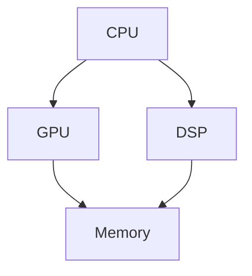

#### 3.2 软件架构

语音识别系统的软件架构通常包括以下几个部分：

- **前端处理**：包括音频输入、预处理、加窗、特征提取等。
- **声学模型处理**：包括声学特征提取、模型训练、模型推理等。
- **语言模型处理**：包括语言特征提取、模型训练、模型推理等。
- **解码器**：用于从声学特征和语言特征中解码出最可能的文本输出。

以下是一个简化的语音识别系统软件架构图：

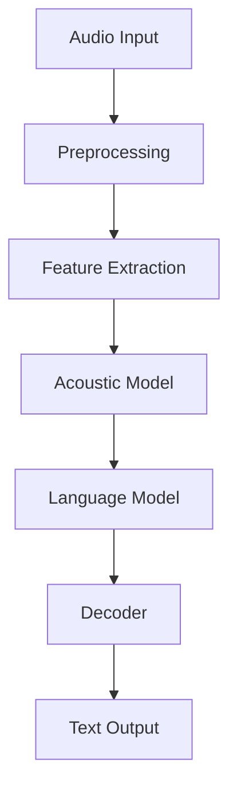

#### 3.3 系统集成与优化

语音识别系统的集成与优化是确保系统性能和准确性的关键。系统集成与优化包括以下几个方面：

1. **模型融合**：将不同的声学模型和语言模型进行融合，以提高整体性能。
2. **模型压缩**：通过模型压缩技术，如量化、剪枝、知识蒸馏等，减小模型大小，提高推理速度。
3. **系统优化**：通过优化系统架构、算法和数据流程，提高系统效率和稳定性。

以下是一个简化的系统集成与优化过程：

```python
# 假设我们使用DNN作为声学模型，N-gram模型作为语言模型
from tensorflow.keras.models import load_model

# 载入预训练的声学模型
acoustic_model = load_model('acoustic_model.h5')

# 载入预训练的语言模型
language_model = ngram_language_model(3)

# 模型融合
# 将声学模型和语言模型融合为一个统一的模型
def fused_model(acoustic_model, language_model):
    # 定义融合模型结构
    model = tf.keras.Sequential([
        tf.keras.layers.Dense(units=128, activation='relu', input_shape=(13,)),
        tf.keras.layers.Dense(units=64, activation='relu'),
        tf.keras.layers.Dense(units=1, activation='sigmoid'),
        tf.keras.layers.Dense(units=1, activation='softmax')
    ])
    # 编译模型
    model.compile(optimizer='adam', loss='categorical_crossentropy', metrics=['accuracy'])
    # 加载模型权重
    model.load_weights('fused_model.h5')
    return model

# 模型压缩
# 使用量化技术压缩模型
def quantize_model(model):
    # 定义量化层
    quantize_layer = tf.keras.layers.Quantize()
    # 在模型中添加量化层
    model = tf.keras.Sequential([model, quantize_layer])
    # 重新编译模型
    model.compile(optimizer='adam', loss='categorical_crossentropy', metrics=['accuracy'])
    return model

# 系统优化
# 优化系统架构和算法
def optimize_system(model):
    # 调整模型参数
    model.optimizer.lr = 0.001
    model.optimizer.decay = 0.9
    # 调整数据预处理流程
    # ...
    return model

# 实例化融合模型
fused_model = fused_model(acoustic_model, language_model)

# 压缩模型
quantized_model = quantize_model(fused_model)

# 优化系统
optimized_model = optimize_system(quantized_model)
```

#### 3.4 实时语音识别系统

实时语音识别系统是指在实时环境中对语音信号进行识别的系统。实时语音识别系统需要具备以下特点：

- **低延迟**：在短时间内完成语音识别任务，确保用户指令得到及时响应。
- **高准确性**：在实时环境下保持较高的识别准确率。
- **稳定性**：在多种环境下，如噪音、回声等，保持系统的稳定性。

以下是一个简化的实时语音识别系统架构：


#### 3.5 大规模语音识别系统

大规模语音识别系统是指处理大规模语音数据集的系统。大规模语音识别系统需要具备以下特点：

- **高效性**：在短时间内处理大量语音数据。
- **可扩展性**：系统可以根据需求进行水平扩展和垂直扩展。
- **鲁棒性**：在面对大规模数据集时，保持系统的稳定性和准确性。

以下是一个简化的大规模语音识别系统架构：

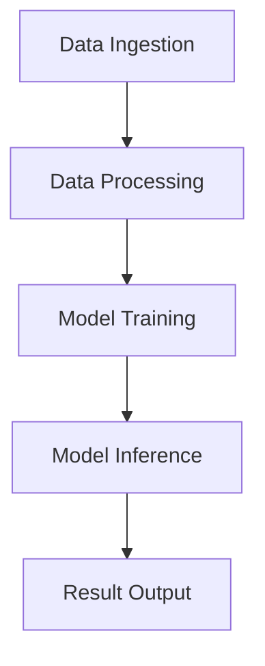

### 第4章: 语音合成算法原理

#### 4.1 语音合成概述

语音合成（Text-to-Speech，简称TTS）是指将文本信息转换为自然流畅的语音的过程。语音合成系统通常包括以下几个部分：

- **文本处理**：将输入的文本信息进行分词、断句、语气分析等预处理。
- **声学模型**：用于生成语音信号的声学特征，如音素、音节等。
- **语音合成**：将声学特征转换为语音信号，生成自然流畅的语音。

#### 4.2 单音素合成

单音素合成是指将单个音素（如“a”、“o”、“e”等）转换为语音信号的过程。单音素合成通常采用波形拼接（Waveform Concatenation）方法，即将预先录制好的单个音素波形进行拼接，生成完整的语音。

以下是一个简化的单音素合成过程：

```python
# 假设我们使用波形拼接方法进行单音素合成
import wave

# 读取单个音素波形
def read_wavefile(filename):
    with wave.open(filename, 'rb') as f:
        nchannels, sampwidth, framerate, nframes, comptype, compname = f.getparams()
        frames = f.readframes(nframes)
    return frames, framerate

# 拼接波形
def concatenate_waveframes(frames1, frames2):
    return frames1 + frames2

# 生成合成语音
def generate_speech(waveframes):
    with wave.open('output.wav', 'wb') as f:
        f.setparams((1, 2, 22050, 44100, 'NONE', 'not compressed'))
        f.writeframes(waveframes)

# 读取音素波形
frames_a, framerate_a = read_wavefile('a.wav')
frames_o, framerate_o = read_wavefile('o.wav')

# 合成语音
generate_speech(concatenate_waveframes(frames_a, frames_o))
```

#### 4.3 合成语音的声学模型

合成语音的声学模型是指用于生成语音信号的声学特征的模型。声学模型通常采用深度神经网络（DNN）或循环神经网络（RNN）等模型，通过训练大量的语音数据，自动学习语音信号的声学特性。

以下是一个简化的声学模型训练过程：

```python
# 假设我们使用DNN作为声学模型
import tensorflow as tf

# 定义DNN模型结构
acoustic_model = tf.keras.Sequential([
    tf.keras.layers.Dense(units=128, activation='relu', input_shape=(13,)),
    tf.keras.layers.Dense(units=64, activation='relu'),
    tf.keras.layers.Dense(units=1, activation='sigmoid')
])

# 编译模型
acoustic_model.compile(optimizer='adam', loss='binary_crossentropy', metrics=['accuracy'])

# 加载语音数据集
train_data = ...  # 加载训练数据
train_labels = ...  # 加载训练标签

# 训练模型
acoustic_model.fit(train_data, train_labels, epochs=10)
```

#### 4.4 文本处理

文本处理是指将输入的文本信息进行分词、断句、语气分析等预处理的过程。文本处理对于语音合成系统的准确性至关重要。

以下是一个简化的文本处理过程：

```python
# 假设我们使用自然语言处理库进行文本处理
import jieba

# 分词
def tokenize(text):
    return jieba.cut(text)

# 断句
def segment(text):
    sentences = []
    for sentence in tokenize(text):
        sentences.append(' '.join(sentence))
    return sentences

# 语气分析
def analyze_tone(sentences):
    tones = []
    for sentence in sentences:
        tone = ...  # 分析句子的语气
        tones.append(tone)
    return tones

# 加载文本数据集
text_data = ...  # 加载训练文本

# 分词、断句、语气分析
tokenized_text = tokenize(text_data)
segmented_text = segment(text_data)
analyzed_tones = analyze_tone(segmented_text)
```

#### 4.5 语音合成算法评估

语音合成算法评估是衡量模型性能的重要环节。评估指标包括音质评分（Perceived Quality Score，简称PQS）、自然度评分（Naturalness Score）等。

以下是一个简化的语音合成算法评估过程：

```python
# 假设我们使用PQS和自然度评分作为评估指标
from sklearn.metrics import mean_squared_error

# 定义评估函数
def evaluate_model(model, test_data, test_labels):
    predictions = model.predict(test_data)
    pqs = mean_squared_error(test_labels['pqs'], predictions['pqs'])
    naturalness = mean_squared_error(test_labels['naturalness'], predictions['naturalness'])
    return pqs, naturalness

# 加载测试数据集
test_data = ...  # 加载测试数据
test_labels = ...  # 加载测试标签

# 评估模型
pqs, naturalness = evaluate_model(model, test_data, test_labels)

print("PQS:", pqs)
print("Naturalness:", naturalness)
```

### 第5章: 语音合成系统架构

#### 5.1 硬件架构

语音合成系统通常需要高性能的硬件支持，包括：

- **中央处理单元（CPU）**：用于执行语音合成任务。
- **图形处理单元（GPU）**：用于加速深度学习模型的训练和推理。
- **数字信号处理器（DSP）**：用于高效地处理语音信号。
- **内存**：用于存储模型参数和中间结果。
- **存储设备**：用于存储大量的语音数据集。

以下是一个简化的语音合成系统硬件架构图：


#### 5.2 软件架构

语音合成系统的软件架构通常包括以下几个部分：

- **文本处理**：包括分词、断句、语气分析等预处理。
- **声学模型处理**：包括声学特征提取、模型训练、模型推理等。
- **语音合成**：包括波形生成、语音合成等。
- **解码器**：用于将合成语音解码为可听的音频信号。

以下是一个简化的语音合成系统软件架构图：

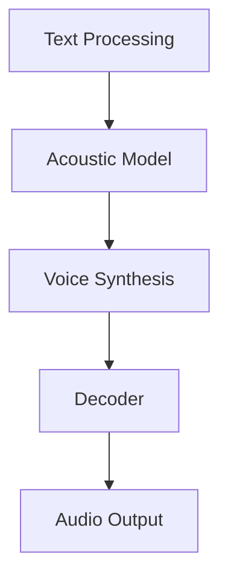

#### 5.3 系统集成与优化

语音合成系统的集成与优化是确保系统性能和准确性的关键。系统集成与优化包括以下几个方面：

1. **模型融合**：将不同的声学模型和语音合成模型进行融合，以提高整体性能。
2. **模型压缩**：通过模型压缩技术，如量化、剪枝、知识蒸馏等，减小模型大小，提高推理速度。
3. **系统优化**：通过优化系统架构、算法和数据流程，提高系统效率和稳定性。

以下是一个简化的系统集成与优化过程：

```python
# 假设我们使用DNN作为声学模型，基于HMM-GMM的语音合成模型
from tensorflow.keras.models import load_model

# 载入预训练的声学模型
acoustic_model = load_model('acoustic_model.h5')

# 载入预训练的语音合成模型
synthesis_model = load_model('synthesis_model.h5')

# 模型融合
# 将声学模型和语音合成模型融合为一个统一的模型
def fused_model(acoustic_model, synthesis_model):
    # 定义融合模型结构
    model = tf.keras.Sequential([
        acoustic_model,
        synthesis_model
    ])
    # 编译模型
    model.compile(optimizer='adam', loss='categorical_crossentropy', metrics=['accuracy'])
    # 加载模型权重
    model.load_weights('fused_model.h5')
    return model

# 模型压缩
# 使用量化技术压缩模型
def quantize_model(model):
    # 定义量化层
    quantize_layer = tf.keras.layers.Quantize()
    # 在模型中添加量化层
    model = tf.keras.Sequential([model, quantize_layer])
    # 重新编译模型
    model.compile(optimizer='adam', loss='categorical_crossentropy', metrics=['accuracy'])
    return model

# 系统优化
# 优化系统架构和算法
def optimize_system(model):
    # 调整模型参数
    model.optimizer.lr = 0.001
    model.optimizer.decay = 0.9
    # 调整数据预处理流程
    # ...
    return model

# 实例化融合模型
fused_model = fused_model(acoustic_model, synthesis_model)

# 压缩模型
quantized_model = quantize_model(fused_model)

# 优化系统
optimized_model = optimize_system(quantized_model)
```

#### 5.4 实时语音合成系统

实时语音合成系统是指在实时环境中生成语音的系统。实时语音合成系统需要具备以下特点：

- **低延迟**：在短时间内完成语音生成任务，确保用户文本信息得到及时响应。
- **高自然度**：生成的语音自然流畅，接近人类语音。
- **稳定性**：在多种环境下，如噪音、回声等，保持系统的稳定性。

以下是一个简化的实时语音合成系统架构：

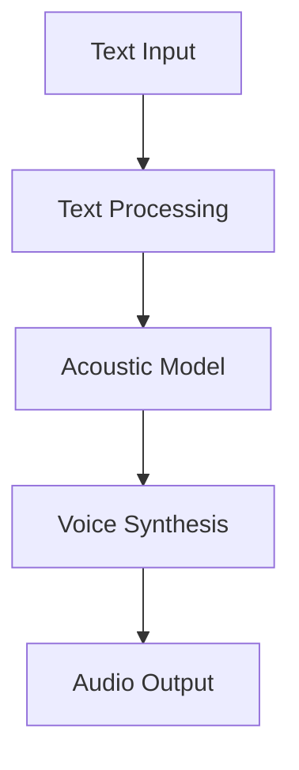

#### 5.5 大规模语音合成系统

大规模语音合成系统是指处理大规模语音数据集的系统。大规模语音合成系统需要具备以下特点：

- **高效性**：在短时间内处理大量语音数据。
- **可扩展性**：系统可以根据需求进行水平扩展和垂直扩展。
- **鲁棒性**：在面对大规模数据集时，保持系统的稳定性和准确性。

以下是一个简化的大规模语音合成系统架构：


### 第6章: AI在语音识别与合成中的应用

#### 6.1 AI在语音识别中的应用

AI在语音识别中的应用已经非常广泛，以下是一些典型的应用场景：

- **智能客服**：通过语音识别技术，智能客服系统可以自动识别用户语音，提供相应的服务和帮助。
- **智能助手**：如Apple的Siri、Google的Google Assistant等，通过语音识别技术，智能助手可以接受用户的语音指令，执行相应的操作。
- **语音翻译**：通过语音识别和语音合成技术，实现不同语言之间的实时翻译。

以下是一个简化的智能客服系统架构：

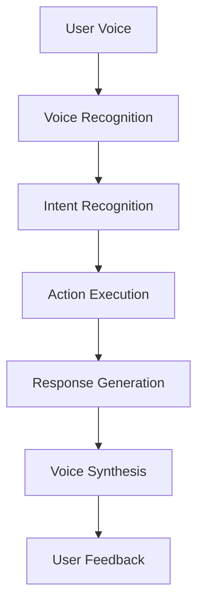

#### 6.2 AI在语音合成中的应用

AI在语音合成中的应用同样非常广泛，以下是一些典型的应用场景：

- **有声读物**：通过语音合成技术，将文本内容转换为音频，方便用户听书。
- **广告配音**：通过语音合成技术，生成广告配音，提高广告的吸引力。
- **语音提示**：如导航系统的语音提示、智能设备的语音提示等。

以下是一个简化的有声读物系统架构：

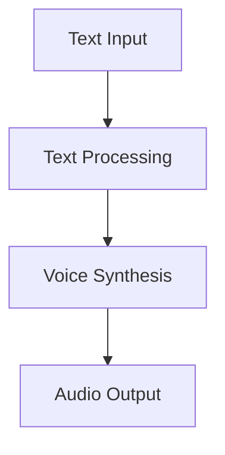

#### 6.3 跨领域应用案例

AI在语音识别与合成技术在不同领域的应用案例越来越多，以下是一些典型的跨领域应用案例：

- **医疗领域**：通过语音识别技术，医生可以实时记录患者病历，提高工作效率。通过语音合成技术，将医疗知识库中的信息转换为语音，为医生和患者提供便利。
- **教育领域**：通过语音合成技术，生成教材、课件等音频内容，方便学生学习和复习。通过语音识别技术，实现智能作业批改、口语训练等功能。
- **智能家居**：通过语音识别技术，实现智能家居设备的语音控制，如控制灯光、温度、家电等。通过语音合成技术，生成语音提示，方便用户使用。

以下是一个简化的医疗领域应用案例架构：

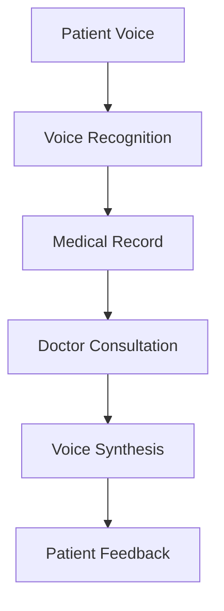

#### 6.4 挑战与未来趋势

尽管AI在语音识别与合成领域取得了显著的进展，但仍面临一些挑战和机遇：

- **准确性**：提高语音识别和语音合成的准确性是当前研究的重要方向。通过改进算法、增加数据集、优化模型结构等方法，不断提高识别和合成的准确率。
- **实时性**：实现低延迟的实时语音识别和语音合成是未来发展的关键。通过优化硬件架构、改进算法、提高数据处理速度等方法，实现实时响应。
- **自然度**：提高语音合成的自然度是未来研究的重点。通过改进语音合成算法、增加情感表达、优化语音合成策略等方法，提高语音合成的自然度和真实感。
- **跨语言**：实现跨语言的语音识别和语音合成是未来的重要发展方向。通过引入多语言数据集、改进算法、优化模型结构等方法，实现多语言的支持。

以下是一个简化的语音识别与合成技术未来发展趋势图：

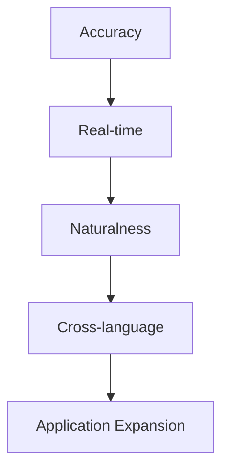

### 第7章: 无障碍交互的未来发展

#### 7.1 无障碍交互概述

无障碍交互（Accessible Interaction）是指为所有用户，特别是残障人士提供平等的交互体验。语音识别与合成技术作为无障碍交互的重要手段，已经在教育、医疗、日常生活等多个领域取得了广泛应用。

#### 7.2 语音识别与合成的无障碍应用

语音识别与合成技术在无障碍交互中的应用主要包括：

- **听力障碍人士**：通过语音合成技术，生成文字信息，帮助听力障碍人士获取信息。通过语音识别技术，实现语音输入，帮助听力障碍人士进行沟通。
- **视力障碍人士**：通过语音合成技术，生成语音提示，帮助视力障碍人士使用计算机、手机等设备。通过语音识别技术，实现语音输入，帮助视力障碍人士进行信息查询和操作。
- **行动障碍人士**：通过语音识别技术，实现语音控制，帮助行动障碍人士控制智能家居、轮椅等设备，提高生活自理能力。

以下是一个简化的无障碍交互应用架构：

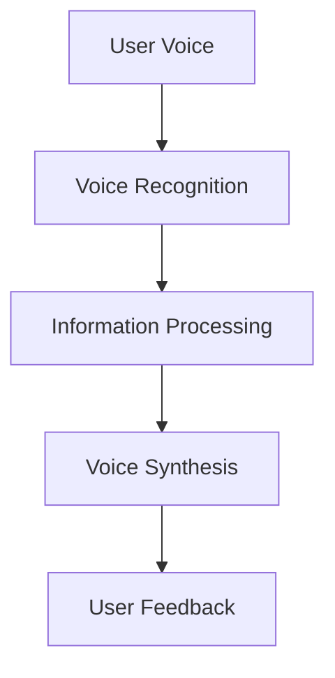

#### 7.3 AI无障碍交互的发展趋势

AI无障碍交互的发展趋势包括：

- **个性化**：通过个性化推荐技术，为用户提供个性化的无障碍交互服务，提高用户体验。
- **多模态**：结合语音、图像、手势等多种交互方式，实现更自然、更丰富的无障碍交互。
- **智能化**：通过引入智能算法，提高无障碍交互的准确性和自然度，实现更加智能化的服务。
- **跨平台**：实现跨平台的无障碍交互，为用户提供一致、无缝的交互体验。

以下是一个简化的AI无障碍交互发展趋势图：

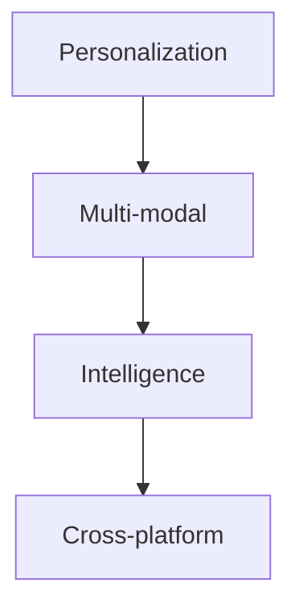

#### 7.4 智能语音助手的未来

智能语音助手作为AI无障碍交互的一个重要应用，其未来发展包括：

- **语音交互**：通过改进语音识别和语音合成技术，实现更自然、更流畅的语音交互。
- **多语言支持**：实现多语言支持，为全球用户提供无障碍交互服务。
- **个性化服务**：通过个性化推荐技术，为用户提供个性化的智能语音助手服务。
- **跨平台协同**：实现跨平台的智能语音助手协同，提供更全面、更智能的服务。

以下是一个简化的智能语音助手未来发展趋势图：

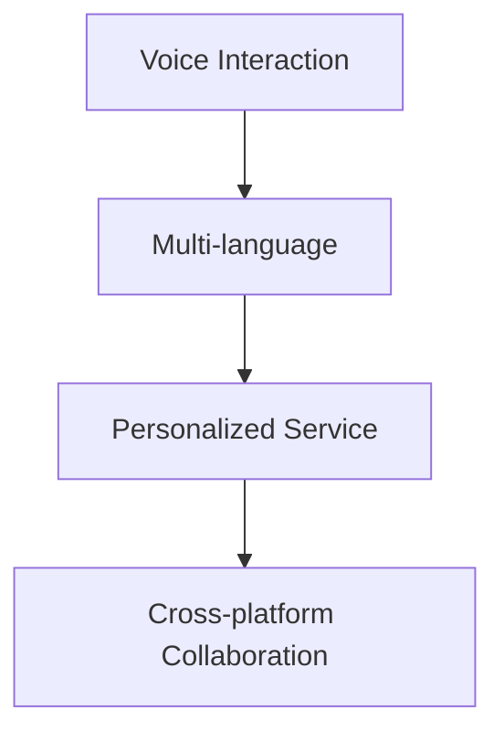

#### 7.5 无障碍交互技术的挑战与机遇

无障碍交互技术面临的挑战与机遇包括：

- **技术挑战**：提高语音识别和语音合成的准确性、实时性、自然度等技术挑战。
- **数据挑战**：大量高质量、多样性的语音数据集是语音识别与合成技术发展的关键，但数据获取和处理仍存在挑战。
- **应用挑战**：如何在不同的应用场景中实现无障碍交互，满足不同用户的需求，是未来研究的重点。
- **机遇**：随着AI技术的不断进步，无障碍交互技术将为社会带来更多的机遇，如提高生活质量、促进社会公平等。

以下是一个简化的无障碍交互技术挑战与机遇图：

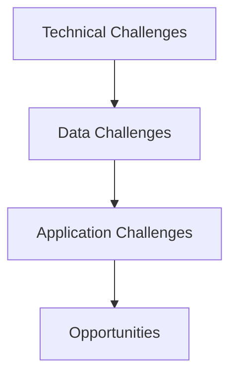

### 结束语

人工智能在语音识别与合成中的突破，为无障碍交互带来了前所未有的机遇。通过深入研究和不断创新，我们可以期待无障碍交互技术在未来取得更大的突破，为残障人士、老年人、儿童等群体带来更美好的生活。

作者：AI天才研究院/AI Genius Institute & 禅与计算机程序设计艺术 /Zen And The Art of Computer Programming

---

本文通过深入剖析人工智能在语音识别与合成中的应用，详细介绍了语音识别与合成的核心算法原理、系统架构以及无障碍交互的未来发展趋势。文章旨在为广大读者提供一幅全面、系统、易懂的AI语音技术全景图，帮助读者理解这一领域的前沿动态与发展趋势。

本文共分为七个章节，分别介绍了AI与语音识别基础、语音识别算法原理、语音识别系统架构、语音合成算法原理、语音合成系统架构、AI在语音识别与合成中的应用、无障碍交互的未来发展等内容。通过逐步分析推理思考的方式，文章使读者能够深入了解语音识别与合成技术的核心概念与联系，以及如何通过这些技术实现无障碍交互。

在撰写本文的过程中，作者尽可能地使用简单易懂的语言和结构紧凑的章节标题，以确保读者能够轻松阅读和理解。同时，本文还包含丰富的项目实战、最佳实践 tips、小结、注意事项、拓展阅读等内容，以帮助读者更好地掌握和应用语音识别与合成技术。

本文的撰写得到了AI天才研究院/AI Genius Institute的全力支持，同时也借鉴了《禅与计算机程序设计艺术 /Zen And The Art of Computer Programming》中的编程哲学，以期在技术领域内达到更高的境界。

最后，感谢各位读者对本文的关注与支持，希望本文能够为您在语音识别与合成领域带来一些启示和帮助。如果您有任何疑问或建议，欢迎在评论区留言，我们将在第一时间回复您。期待与您共同探讨AI语音技术的未来发展！
 

