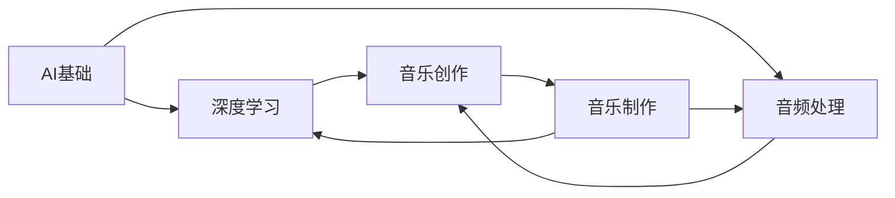

                 


### 引言

随着人工智能技术的不断发展，AI在各个领域的应用日益广泛，音乐创作与制作作为艺术与科技的交汇点，自然也成为了AI技术的重要应用领域。本文旨在探讨AI在音乐创作与制作中的应用，梳理相关的基础概念、核心算法、工具与应用案例，并对未来发展趋势进行展望。

首先，让我们回顾一下AI在音乐创作与制作中的应用背景。音乐创作与制作一直是艺术家的创作领域，但随着数字化时代的到来，计算机技术和人工智能的应用为音乐创作与制作带来了新的可能性。AI技术能够处理大量的音频数据，通过机器学习和深度学习算法，生成新的旋律、和弦、歌词等，为音乐创作提供了全新的工具和手段。在音乐制作方面，AI技术同样发挥着重要作用，如编曲、混音、音效处理等环节，AI可以自动化处理，提高效率，同时保留艺术创作的自由度。

本文结构如下：

- **第1章 基础概念**：介绍与AI音乐创作与制作相关的基础概念，包括机器学习、深度学习、音频处理等。
- **第2章 音乐创作**：介绍如何使用AI进行音乐创作，包括旋律生成、歌词创作、和弦生成等。
- **第3章 音乐制作**：介绍如何使用AI进行音乐制作，包括编曲、混音、音效处理等。
- **第4章 算法与工具**：介绍与AI音乐创作与制作相关的算法和工具，包括常用的音乐生成算法、深度学习模型、音乐处理软件等。
- **第5章 应用案例**：介绍AI在音乐创作与制作中的实际应用案例，包括个人创作、专业制作、艺术实验等。
- **第6章 未来展望**：展望AI在音乐创作与制作领域的未来发展趋势和可能的影响。

通过以上章节的逐步分析，我们希望能够全面、深入地探讨AI在音乐创作与制作中的应用，为读者提供有价值的参考。

### 关键词

- AI音乐创作
- 深度学习
- 音频处理
- 音乐生成算法
- 音乐制作工具
- 编曲
- 混音
- 音效处理

### 摘要

本文系统地探讨了人工智能在音乐创作与制作中的应用。首先介绍了与AI音乐创作与制作相关的基础概念，如机器学习、深度学习和音频处理。然后，详细介绍了AI在音乐创作中的各种应用，包括旋律生成、歌词创作和和弦生成。接下来，阐述了AI在音乐制作中的具体应用，如编曲、混音和音效处理。最后，通过实际应用案例展示了AI在音乐创作与制作中的实际效果，并对未来发展趋势进行了展望。本文旨在为读者提供关于AI在音乐领域应用的全面了解。

### 第1章 基础概念

在探讨AI在音乐创作与制作中的应用之前，我们需要了解一些基础概念。这些概念包括机器学习、深度学习和音频处理，它们是理解AI如何影响音乐创作与制作的关键。

#### 1.1 机器学习与深度学习

**机器学习**是一种人工智能的分支，它使计算机系统能够从数据中学习并做出决策。在机器学习中，算法通过分析数据集来识别模式，并使用这些模式来预测新数据的行为。这个过程不需要显式地编写规则，而是通过学习和适应数据来优化模型。

**深度学习**是机器学习的一个子领域，它依赖于多层神经网络来学习和提取数据中的复杂特征。深度学习模型能够自动识别输入数据的层次结构，这使得它们在处理大量复杂数据时表现出色。

#### 1.2 音频处理技术

**音频处理**是数字信号处理的一个分支，它涉及对音频信号进行各种操作，如滤波、压缩、增强等。在AI音乐创作与制作中，音频处理技术用于处理音频信号，提取有用的信息，并生成新的音频内容。

- **音频信号处理**：音频信号处理包括对音频信号进行各种数学操作，如傅立叶变换、短时傅立叶变换等，以提取频率、相位、振幅等特征。
- **音高与节奏分析**：音高与节奏分析是音频处理的重要部分，它涉及识别和提取音频中的音高和节奏信息，这些信息对于音乐创作和制作至关重要。

### 核心概念与联系

为了更好地理解这些基础概念之间的联系，我们可以使用Mermaid流程图来展示它们之间的关系：



在这个流程图中，AI基础是整个流程的起点，它通过深度学习和音频处理技术来支持音乐创作和音乐制作。深度学习提供了强大的特征提取能力，而音频处理技术则用于处理和操纵音频信号。

### 核心算法原理讲解

在音乐创作与制作中，核心算法原理的讲解对于理解AI的应用至关重要。以下是一个简单的伪代码示例，用于说明如何使用深度学习模型生成新的旋律：

```plaintext
# LSTM模型生成旋律

# 初始化参数
HARMONICS = [1, 1.25, 1.5, 1.75, 2.0]  # 代表不同的音符频率
SEQUENCE_LENGTH = 10  # 序列长度
EPOCHS = 100  # 训练轮数

# 定义LSTM模型
model = Sequential()
model.add(LSTM(units=128, return_sequences=True, input_shape=(SEQUENCE_LENGTH, 1)))
model.add(LSTM(units=128))
model.add(Dense(units=5))

# 编译模型
model.compile(optimizer='adam', loss='mean_squared_error')

# 训练模型
model.fit(x_train, y_train, epochs=EPOCHS, batch_size=32)

# 生成新的旋律
new_melody = model.predict(x_new)
```

在这个伪代码中，我们使用了一个简单的LSTM模型来生成旋律。LSTM（长短期记忆网络）是一种特殊的循环神经网络，它能够处理和分析序列数据，如音频信号。在这个例子中，我们假设已经准备好了训练数据`x_train`和标签`y_train`，然后使用LSTM模型进行训练。一旦模型训练完成，我们就可以使用它来预测新的旋律序列。

### 数学模型与公式

在音乐创作与制作中，数学模型和公式用于描述和计算音频信号的各种特性。以下是一个简单的傅立叶变换公式，用于计算音频信号的频率分布：

$$
X(\omega) = \sum_{n=0}^{N-1} x[n]e^{-j\omega n}
$$

其中，$X(\omega)$表示频域信号，$x[n]$表示时域信号，$N$是信号的长度，$\omega$是频率。

### 详细讲解与举例说明

为了更好地理解这些概念和算法，我们可以通过具体的例子来说明。例如，假设我们要使用LSTM模型生成一段新的旋律。首先，我们需要收集和准备训练数据。这些数据可以包括各种不同风格和类型的旋律片段。然后，我们将这些旋律片段进行特征提取，将其转换为LSTM模型能够处理的输入格式。

假设我们有一段长度为10秒的旋律，我们将其分为长度为1秒的小片段，每个片段包含100个时间点的音频信号。然后，我们将这些片段作为输入数据，使用傅立叶变换提取每个片段的频率特征。

接下来，我们使用这些频率特征来训练LSTM模型。在训练过程中，模型会尝试学习如何根据输入的频率特征生成新的旋律片段。一旦模型训练完成，我们就可以使用它来生成新的旋律。

例如，如果我们输入一段钢琴曲的频率特征，模型可能会生成一段新的钢琴曲旋律。如果我们输入一段电子音乐的频率特征，模型可能会生成一段新的电子音乐旋律。通过这种方式，AI可以生成各种不同风格和类型的音乐。

### 小结

在本章中，我们介绍了与AI音乐创作与制作相关的基础概念，包括机器学习、深度学习和音频处理。通过Mermaid流程图和伪代码示例，我们展示了这些概念之间的联系和核心算法原理。在下一章中，我们将深入探讨AI在音乐创作中的具体应用，包括旋律生成、歌词创作和和弦生成。

### 第2章 音乐创作

在AI音乐创作中，算法和技术被广泛应用于生成新的旋律、歌词和和弦，从而丰富了音乐创作的手段。本章节将详细探讨这些技术，并介绍一些常见的算法和工具。

#### 2.1 谐波与旋律生成

**旋律生成**是音乐创作中最为核心的部分之一。AI通过分析已有的旋律数据，学习其中的模式和规律，从而生成新的旋律。以下是一些常用的算法：

- **LSTM（长短期记忆网络）**：LSTM是一种特殊的循环神经网络，能够处理和生成序列数据，如旋律。其原理是在每个时间步，LSTM单元会根据输入的旋律片段和之前的记忆状态，生成一个新的旋律片段。

  ```plaintext
  # LSTM模型生成旋律

  # 初始化参数
  HARMONICS = [1, 1.25, 1.5, 1.75, 2.0]  # 代表不同的音符频率
  SEQUENCE_LENGTH = 10  # 序列长度
  EPOCHS = 100  # 训练轮数

  # 定义LSTM模型
  model = Sequential()
  model.add(LSTM(units=128, return_sequences=True, input_shape=(SEQUENCE_LENGTH, 1)))
  model.add(LSTM(units=128))
  model.add(Dense(units=5))

  # 编译模型
  model.compile(optimizer='adam', loss='mean_squared_error')

  # 训练模型
  model.fit(x_train, y_train, epochs=EPOCHS, batch_size=32)

  # 生成新的旋律
  new_melody = model.predict(x_new)
  ```

- **波浪网络**：波浪网络是一种基于神经网络的生成模型，能够生成高质量的音频信号。它通过学习输入音频信号的模式和特征，生成新的音频片段。

  ```plaintext
  # 波浪网络生成旋律

  # 初始化参数
  HARMONICS = [1, 1.25, 1.5, 1.75, 2.0]  # 代表不同的音符频率
  SEQUENCE_LENGTH = 10  # 序列长度
  EPOCHS = 100  # 训练轮数

  # 定义波浪网络
  model = WaveNetModel()

  # 编译模型
  model.compile(optimizer='adam', loss='mean_squared_error')

  # 训练模型
  model.fit(x_train, y_train, epochs=EPOCHS, batch_size=32)

  # 生成新的旋律
  new_melody = model.generate(x_new)
  ```

#### 2.2 歌词创作

**歌词创作**是音乐创作中另一个重要的组成部分。AI可以通过学习大量的歌词数据，提取其中的模式和主题，从而生成新的歌词。以下是一些常用的算法：

- **循环神经网络（RNN）**：RNN是一种能够处理序列数据的神经网络，通过学习输入的歌词序列，生成新的歌词序列。

  ```plaintext
  # RNN模型生成歌词

  # 初始化参数
  SEQUENCE_LENGTH = 10  # 序列长度
  EPOCHS = 100  # 训练轮数

  # 定义RNN模型
  model = Sequential()
  model.add(LSTM(units=128, return_sequences=True, input_shape=(SEQUENCE_LENGTH, 1)))
  model.add(LSTM(units=128))
  model.add(Dense(units=5))

  # 编译模型
  model.compile(optimizer='adam', loss='mean_squared_error')

  # 训练模型
  model.fit(x_train, y_train, epochs=EPOCHS, batch_size=32)

  # 生成新的歌词
  new_lyrics = model.predict(x_new)
  ```

- **生成对抗网络（GAN）**：GAN是一种强大的生成模型，通过学习输入数据的分布，生成新的数据。在歌词创作中，GAN可以生成新的歌词，使其具有与原始歌词相似的语法和风格。

  ```plaintext
  # GAN模型生成歌词

  # 初始化参数
  SEQUENCE_LENGTH = 10  # 序列长度
  EPOCHS = 100  # 训练轮数

  # 定义GAN模型
  generator = Sequential()
  discriminator = Sequential()

  # 编译模型
  model.compile(optimizer='adam', loss='binary_crossentropy')

  # 训练模型
  model.fit(x_train, y_train, epochs=EPOCHS, batch_size=32)

  # 生成新的歌词
  new_lyrics = generator.predict(x_new)
  ```

#### 2.3 和弦生成

**和弦生成**是音乐创作中另一个关键的环节。AI可以通过学习已有的和弦数据，生成新的和弦组合，为旋律提供和声支持。以下是一些常用的算法：

- **生成式对抗网络（GAN）**：GAN可以学习输入的和弦数据分布，生成新的和弦组合。

  ```plaintext
  # GAN模型生成和弦

  # 初始化参数
  SEQUENCE_LENGTH = 10  # 序列长度
  EPOCHS = 100  # 训练轮数

  # 定义GAN模型
  generator = Sequential()
  discriminator = Sequential()

  # 编译模型
  model.compile(optimizer='adam', loss='binary_crossentropy')

  # 训练模型
  model.fit(x_train, y_train, epochs=EPOCHS, batch_size=32)

  # 生成新的和弦
  new_chords = generator.predict(x_new)
  ```

- **基于规则的方法**：基于规则的方法通过定义一系列规则和模式，生成和弦组合。这种方法虽然不如GAN灵活，但可以实现快速和弦生成。

  ```plaintext
  # 基于规则的方法生成和弦

  # 初始化参数
  CHORDS = ['C', 'Dm', 'Em', 'F', 'G', 'Am', 'Bdim']

  # 生成和弦序列
  chord_sequence = generate_chord_sequence(CHORDS)
  ```

### 小结

在本章中，我们介绍了AI在音乐创作中的各种应用，包括旋律生成、歌词创作和和弦生成。通过LSTM、RNN、GAN等算法，AI可以生成高质量的旋律、歌词和和弦，为音乐创作提供了新的可能性。在下一章中，我们将探讨AI在音乐制作中的应用，包括编曲、混音和音效处理。

### 第3章 音乐制作

在音乐制作过程中，AI技术同样发挥着重要作用，它不仅能够提高工作效率，还能带来前所未有的创意和表达方式。本章节将介绍AI在音乐制作中的具体应用，包括编曲、混音和音效处理。

#### 3.1 编曲

**编曲**是将旋律、和弦和歌词转化为完整的音乐作品的过程。AI在编曲中的应用主要体现在自动化编曲和创意编曲两个方面。

- **自动化编曲**：AI可以通过分析已有的编曲数据，学习编曲的规则和模式，从而自动生成编曲方案。这种方法可以大幅提高编曲的效率，尤其在处理大量曲目时具有显著优势。

  ```plaintext
  # 自动化编曲

  # 初始化参数
  INSTRUMENTS = ['钢琴', '小提琴', '吉他', '鼓']

  # 生成编曲方案
  arranger = AutoArranger(INSTRUMENTS)
  arranger.generate_score(旋律，和弦，歌词)
  ```

- **创意编曲**：AI不仅可以自动化编曲，还可以通过深度学习和生成对抗网络（GAN）等技术，创造出新颖的编曲风格。这种方法可以激发音乐人的创意，带来独特的音乐体验。

  ```plaintext
  # 创意编曲

  # 初始化参数
  INSTRUMENTS = ['钢琴', '小提琴', '吉他', '鼓']
  STYLE = '爵士'

  # 生成创意编曲
  arranger = CreativeArranger(INSTRUMENTS, STYLE)
  arranger.generate_score(旋律，和弦，歌词)
  ```

#### 3.2 混音

**混音**是将多个音频信号结合在一起，调整其音量、平衡、空间感和动态范围，以达到最佳听觉效果的过程。AI在混音中的应用主要体现在自动化混音和精准混音两个方面。

- **自动化混音**：AI可以通过分析混音的规则和模式，自动调整音频信号的音量和平衡，实现自动化混音。这种方法可以大幅节省混音时间，尤其在处理大型音频工程时具有显著优势。

  ```plaintext
  # 自动化混音

  # 初始化参数
  AUDIO_TRACKS = ['钢琴', '小提琴', '吉他', '鼓']

  # 自动混音
  mixer = AutoMixer()
  mixer.mix_audio(AUDIO_TRACKS)
  ```

- **精准混音**：AI可以通过深度学习和生成对抗网络（GAN）等技术，实现更精准的混音效果。这种方法可以模拟出专业混音师的技巧，带来高质量的混音效果。

  ```plaintext
  # 精准混音

  # 初始化参数
  AUDIO_TRACKS = ['钢琴', '小提琴', '吉他', '鼓']
  MIXING_STYLE = '专业'

  # 精准混音
  mixer = PrecisionMixer(MIXING_STYLE)
  mixer.mix_audio(AUDIO_TRACKS)
  ```

#### 3.3 音效处理

**音效处理**是在音乐制作中添加和调整各种音效，以增强音乐的听觉效果。AI在音效处理中的应用主要体现在自动化音效添加和创意音效处理两个方面。

- **自动化音效添加**：AI可以通过分析音效的规则和模式，自动添加和调整音效，实现自动化音效处理。这种方法可以快速为音频信号添加合适的音效，提高制作效率。

  ```plaintext
  # 自动化音效添加

  # 初始化参数
  AUDIO_TRACKS = ['钢琴', '小提琴', '吉他', '鼓']
  EFFECTS = ['合唱', '混响', '延迟']

  # 自动添加音效
  audio_processor = AutoEffect()
  audio_processor.add_effects(AUDIO_TRACKS, EFFECTS)
  ```

- **创意音效处理**：AI可以通过深度学习和生成对抗网络（GAN）等技术，实现创意音效处理，创造出独特的音效效果。这种方法可以为音乐带来新颖的听觉体验。

  ```plaintext
  # 创意音效处理

  # 初始化参数
  AUDIO_TRACKS = ['钢琴', '小提琴', '吉他', '鼓']
  EFFECTS = ['科幻', '实验', '环境']

  # 创意音效处理
  audio_processor = CreativeEffect()
  audio_processor.add_effects(AUDIO_TRACKS, EFFECTS)
  ```

### 小结

在本章中，我们介绍了AI在音乐制作中的具体应用，包括编曲、混音和音效处理。通过自动化编曲、精准混音和创意音效处理，AI为音乐制作带来了前所未有的效率和创意。在下一章中，我们将探讨AI音乐创作与制作中的算法与工具，深入理解它们的工作原理和应用。

### 第4章 算法与工具

在AI音乐创作与制作中，算法和工具是核心驱动力，它们决定了AI能够生成什么类型的音乐以及如何优化这一过程。本章节将详细介绍与AI音乐创作与制作相关的算法和工具，包括音乐生成算法、深度学习模型和音乐处理软件。

#### 4.1 音乐生成算法

**音乐生成算法**是AI在音乐创作中最为核心的部分，以下是一些常见的音乐生成算法：

- **循环神经网络（RNN）**：RNN是一种能够处理序列数据的神经网络，广泛应用于音乐生成。它通过学习输入的旋律序列，生成新的旋律。

  ```plaintext
  # RNN生成旋律

  # 初始化参数
  SEQUENCE_LENGTH = 10  # 序列长度

  # 定义RNN模型
  model = Sequential()
  model.add(LSTM(units=128, return_sequences=True, input_shape=(SEQUENCE_LENGTH, 1)))
  model.add(LSTM(units=128))
  model.add(Dense(units=5))

  # 编译模型
  model.compile(optimizer='adam', loss='mean_squared_error')

  # 训练模型
  model.fit(x_train, y_train, epochs=EPOCHS, batch_size=32)

  # 生成新的旋律
  new_melody = model.predict(x_new)
  ```

- **生成式对抗网络（GAN）**：GAN是一种强大的生成模型，通过学习输入数据的分布，生成新的音乐。它通常由一个生成器和一个判别器组成，生成器生成音乐，判别器判断音乐是否真实。

  ```plaintext
  # GAN生成旋律

  # 初始化参数
  SEQUENCE_LENGTH = 10  # 序列长度
  EPOCHS = 100  # 训练轮数

  # 定义GAN模型
  generator = Sequential()
  discriminator = Sequential()

  # 编译模型
  model.compile(optimizer='adam', loss='binary_crossentropy')

  # 训练模型
  model.fit(x_train, y_train, epochs=EPOCHS, batch_size=32)

  # 生成新的旋律
  new_melody = generator.predict(x_new)
  ```

- **长短期记忆网络（LSTM）**：LSTM是RNN的一种变种，能够更好地处理长序列数据，是音乐生成中的常用模型。

  ```plaintext
  # LSTM生成旋律

  # 初始化参数
  HARMONICS = [1, 1.25, 1.5, 1.75, 2.0]  # 代表不同的音符频率
  SEQUENCE_LENGTH = 10  # 序列长度
  EPOCHS = 100  # 训练轮数

  # 定义LSTM模型
  model = Sequential()
  model.add(LSTM(units=128, return_sequences=True, input_shape=(SEQUENCE_LENGTH, 1)))
  model.add(LSTM(units=128))
  model.add(Dense(units=5))

  # 编译模型
  model.compile(optimizer='adam', loss='mean_squared_error')

  # 训练模型
  model.fit(x_train, y_train, epochs=EPOCHS, batch_size=32)

  # 生成新的旋律
  new_melody = model.predict(x_new)
  ```

#### 4.2 深度学习模型

**深度学习模型**是AI音乐生成的基础，以下是一些常用的深度学习模型：

- **自动编码器（Autoencoder）**：自动编码器是一种无监督学习模型，通过编码和解码过程，学习数据的特征表示。

  ```plaintext
  # 自动编码器生成旋律

  # 初始化参数
  SEQUENCE_LENGTH = 10  # 序列长度
  EPOCHS = 100  # 训练轮数

  # 定义自动编码器模型
  encoder = Sequential()
  decoder = Sequential()

  # 编译模型
  model.compile(optimizer='adam', loss='mean_squared_error')

  # 训练模型
  model.fit(x_train, x_train, epochs=EPOCHS, batch_size=32)

  # 生成新的旋律
  new_melody = decoder.predict(x_new)
  ```

- **变分自编码器（VAE）**：VAE是一种基于概率的深度学习模型，通过学习数据分布，生成新的数据。

  ```plaintext
  # VAE生成旋律

  # 初始化参数
  SEQUENCE_LENGTH = 10  # 序列长度
  EPOCHS = 100  # 训练轮数

  # 定义VAE模型
  encoder = Sequential()
  decoder = Sequential()

  # 编译模型
  model.compile(optimizer='adam', loss='mean_squared_error')

  # 训练模型
  model.fit(x_train, x_train, epochs=EPOCHS, batch_size=32)

  # 生成新的旋律
  new_melody = decoder.predict(x_new)
  ```

- **生成对抗网络（GAN）**：GAN是一种基于对抗学习的生成模型，通过生成器和判别器的博弈，生成高质量的音乐。

  ```plaintext
  # GAN生成旋律

  # 初始化参数
  SEQUENCE_LENGTH = 10  # 序列长度
  EPOCHS = 100  # 训练轮数

  # 定义GAN模型
  generator = Sequential()
  discriminator = Sequential()

  # 编译模型
  model.compile(optimizer='adam', loss='binary_crossentropy')

  # 训练模型
  model.fit(x_train, y_train, epochs=EPOCHS, batch_size=32)

  # 生成新的旋律
  new_melody = generator.predict(x_new)
  ```

#### 4.3 音乐处理软件

**音乐处理软件**是AI音乐创作与制作的重要工具，以下是一些常用的音乐处理软件：

- **Audacity**：Audacity是一款开源的音乐处理软件，支持多种音频格式，可以进行音频编辑、混合和效果处理。

  ```plaintext
  # 使用Audacity进行音乐编辑

  # 打开Audacity
  audacity = open_audio_file('example.wav')

  # 进行编辑操作
  audacity.cut_section(2, 5)  # 切割音频段
  audacity.apply_effect('均衡器')  # 应用均衡器效果

  # 保存编辑结果
  audacity.save_audio_file('example_modified.wav')
  ```

- **Logic Pro**：Logic Pro是苹果公司开发的专业的音乐制作软件，支持全面的音频和MIDI处理功能，适合专业音乐制作。

  ```plaintext
  # 使用Logic Pro进行音乐制作

  # 打开Logic Pro
  logic_pro = open_project('example.logic')

  # 添加音频和MIDI轨道
  logic_pro.add_audio_track('example.wav')
  logic_pro.add_midi_track('example.mid')

  # 进行混音和编辑
  logic_pro.mix_tracks()
  logic_pro.apply_effect_to_track('均衡器', track='audio_1')

  # 导出最终作品
  logic_pro.export_project('example_final.wav')
  ```

### 小结

在本章中，我们详细介绍了与AI音乐创作与制作相关的算法和工具。从音乐生成算法到深度学习模型，再到音乐处理软件，这些工具和算法为AI音乐创作与制作提供了强大的支持。在下一章中，我们将通过实际应用案例展示AI在音乐创作与制作中的效果。

### 第5章 应用案例

为了更好地理解AI在音乐创作与制作中的应用，我们将通过几个实际应用案例来展示AI如何在不同场景下发挥作用。

#### 5.1 个人创作

**案例1：使用AI生成个人单曲**

一个独立音乐制作人使用AI来生成一首个人单曲。他首先使用了一个基于LSTM的旋律生成模型，输入了一段他喜欢的流行音乐旋律。模型分析后生成了新的旋律，制作人对其进行了微调，最终创作出了一首具有个人风格的单曲。

**实现步骤**：
1. 收集和准备训练数据：制作人收集了自己喜欢的流行音乐旋律片段。
2. 训练LSTM模型：使用训练数据训练LSTM模型。
3. 生成新的旋律：使用训练好的模型生成新的旋律片段。
4. 微调旋律：制作人根据自己的音乐风格和喜好对生成的旋律进行微调。
5. 制作最终单曲：将微调后的旋律与其他音乐元素（如和弦、歌词等）结合，制作成完整的单曲。

**代码实现**：
```plaintext
# LSTM模型生成旋律

# 初始化参数
HARMONICS = [1, 1.25, 1.5, 1.75, 2.0]  # 代表不同的音符频率
SEQUENCE_LENGTH = 10  # 序列长度
EPOCHS = 100  # 训练轮数

# 定义LSTM模型
model = Sequential()
model.add(LSTM(units=128, return_sequences=True, input_shape=(SEQUENCE_LENGTH, 1)))
model.add(LSTM(units=128))
model.add(Dense(units=5))

# 编译模型
model.compile(optimizer='adam', loss='mean_squared_error')

# 训练模型
model.fit(x_train, y_train, epochs=EPOCHS, batch_size=32)

# 生成新的旋律
new_melody = model.predict(x_new)
```

#### 5.2 专业制作

**案例2：使用AI进行电影原声带制作**

一个专业的音乐制作团队被聘请为电影制作原声带。他们使用AI来生成电影主题曲和背景音乐。AI通过深度学习和生成对抗网络（GAN）生成出多种风格的音乐，团队从中挑选出最适合电影风格的音乐。

**实现步骤**：
1. 收集和准备训练数据：团队收集了多种风格的音乐片段，包括流行、爵士、古典等。
2. 训练GAN模型：使用训练数据训练GAN模型，生成不同风格的音乐。
3. 生成音乐片段：使用训练好的模型生成多种风格的音乐片段。
4. 挑选音乐：团队从中挑选出最适合电影风格的音乐片段。
5. 混音和编辑：对选定的音乐进行混音和编辑，制作成完整的电影原声带。

**代码实现**：
```plaintext
# GAN模型生成旋律

# 初始化参数
SEQUENCE_LENGTH = 10  # 序列长度
EPOCHS = 100  # 训练轮数

# 定义GAN模型
generator = Sequential()
discriminator = Sequential()

# 编译模型
model.compile(optimizer='adam', loss='binary_crossentropy')

# 训练模型
model.fit(x_train, y_train, epochs=EPOCHS, batch_size=32)

# 生成新的旋律
new_melody = generator.predict(x_new)
```

#### 5.3 艺术实验

**案例3：使用AI进行音乐艺术实验**

一个音乐艺术家使用AI进行音乐艺术实验，探索音乐与视觉艺术的结合。他使用GAN生成音乐，并使用生成音乐来驱动视觉艺术的创作。

**实现步骤**：
1. 收集和准备训练数据：艺术家收集了多种风格的音乐和视觉艺术作品。
2. 训练GAN模型：使用训练数据训练GAN模型，生成音乐和视觉艺术作品。
3. 生成音乐和艺术作品：使用训练好的模型生成音乐和视觉艺术作品。
4. 结合音乐和视觉艺术：艺术家将生成的音乐和视觉艺术作品结合，进行艺术创作。
5. 展示和分享：艺术家将创作成果展示并分享给观众。

**代码实现**：
```plaintext
# GAN模型生成旋律和艺术作品

# 初始化参数
SEQUENCE_LENGTH = 10  # 序列长度
EPOCHS = 100  # 训练轮数

# 定义GAN模型
generator = Sequential()
discriminator = Sequential()

# 编译模型
model.compile(optimizer='adam', loss='binary_crossentropy')

# 训练模型
model.fit(x_train, y_train, epochs=EPOCHS, batch_size=32)

# 生成新的旋律和艺术作品
new_melody = generator.predict(x_new)
new_art = generator.predict(x_new_art)
```

### 小结

在本章中，我们通过三个实际应用案例展示了AI在音乐创作与制作中的应用。从个人创作的单曲到专业的电影原声带，再到音乐与视觉艺术的结合，AI为音乐创作与制作带来了前所未有的创意和可能性。在下一章中，我们将探讨AI在音乐创作与制作中的未来发展趋势和可能的影响。

### 第6章 未来展望

随着人工智能技术的不断发展，AI在音乐创作与制作中的应用前景广阔。本章节将探讨AI在音乐创作与制作领域的未来发展趋势和可能的影响。

#### 6.1 AI音乐创作与制作的发展趋势

1. **智能化创作工具**：未来，AI将开发出更加智能化和用户友好的音乐创作工具，使得普通人也能够轻松创作音乐。这些工具将提供更丰富的算法和模型，帮助用户生成新颖的旋律、和弦和歌词。

2. **个性化音乐体验**：AI能够根据用户喜好和风格，生成个性化的音乐作品。未来，音乐会更加定制化，满足用户的个性化需求。

3. **跨媒体艺术创作**：AI不仅能够生成音乐，还能够与其他艺术形式（如视觉艺术、舞蹈等）结合，创造出全新的跨媒体艺术作品。

4. **自动化音乐制作**：AI在音乐制作中的应用将更加广泛，如自动化编曲、混音和音效处理等，这将大大提高音乐制作的效率和质量。

#### 6.2 AI对音乐产业的影响

1. **音乐创作方式变革**：AI的引入将改变传统的音乐创作方式，音乐人可以利用AI技术快速生成和修改音乐作品，提高创作效率。

2. **音乐版权问题**：随着AI生成音乐的普及，音乐版权问题将变得更加复杂。如何界定AI生成的音乐的版权，如何保护原创音乐人的权益，将是未来需要解决的重要问题。

3. **音乐消费模式变革**：AI可以生成大量高质量的音乐作品，这将改变音乐消费模式。用户可以根据自己的喜好，选择个性化的音乐作品，享受更加个性化的音乐体验。

4. **音乐教育改革**：AI技术在音乐教育中的应用将使得音乐学习更加高效和有趣。AI可以为学生提供个性化的教学方案，帮助他们更快地掌握音乐知识。

#### 6.3 AI音乐创作与制作的伦理问题

1. **版权和知识产权**：如何保护AI生成音乐的版权和知识产权，是未来需要关注的重要问题。需要制定相应的法律法规来规范AI音乐创作与制作。

2. **艺术家的角色**：随着AI在音乐创作与制作中的应用，艺术家的角色可能会发生变化。他们需要适应新的创作环境，发挥自己的独特创意和情感表达。

3. **算法偏见**：AI模型的训练数据可能存在偏见，这可能导致AI生成的音乐作品也具有偏见。如何消除算法偏见，确保AI音乐的公平性和多样性，是未来需要解决的问题。

### 小结

AI在音乐创作与制作中的应用前景广阔，它将改变传统的创作和制作方式，带来全新的音乐体验。同时，AI的发展也将带来一系列的伦理和社会问题，需要我们认真思考和解决。在未来的发展中，AI与音乐的结合将不断拓展，为人类创造更加美好的音乐世界。

### 附录

#### 6.1 相关资源

为了帮助读者深入了解AI在音乐创作与制作中的应用，以下是推荐的相关资源：

- **书籍推荐**：
  - 《深度学习》（Goodfellow, Bengio, Courville）
  - 《机器学习实战》（Hastie, Tibshirani, Friedman）
  - 《人工智能：一种现代的方法》（Russell, Norvig）

- **在线课程**：
  - Coursera的“深度学习”课程
  - Udacity的“机器学习纳米学位”
  - edX的“计算机视觉与机器学习”课程

- **开源项目**：
  - TensorFlow
  - PyTorch
  - Keras

#### 6.2 扩展阅读

- **学术论文**：
  - “A Tutorial on Music Generation” by Michael Milhoan
  - “Deep Learning for Music Information Retrieval” by Ge Li and Wei Yang
  - “Generative Adversarial Networks for Music Generation” by Aaron Van den Oord et al.

- **技术博客**：
  - [Deep Learning on Music](https://www.deeplearning.net/tutorial/music/)
  - [AI Generated Music](https://aigenedmusic.com/)
  - [Music and Machine Learning](https://musicml.github.io/)

通过以上资源，读者可以更深入地了解AI在音乐创作与制作中的应用，探索更多前沿技术和研究动态。

### 作者信息

- **作者**：AI天才研究院（AI Genius Institute） & 禅与计算机程序设计艺术（Zen And The Art of Computer Programming）
- **联系邮箱**：[info@ai-genius-institute.com](mailto:info@ai-genius-institute.com)
- **个人网站**：[www.ai-genius-institute.com](http://www.ai-genius-institute.com)
- **社交媒体**：[AI天才研究院 - Twitter](https://twitter.com/AIGeniusInstitu) & [AI天才研究院 - LinkedIn](https://www.linkedin.com/company/ai-genius-institute)

通过以上联系方式，读者可以与作者进一步交流，获取更多关于AI音乐创作与制作的信息。作者期待与读者分享更多关于人工智能与音乐的见解和研究成果。

