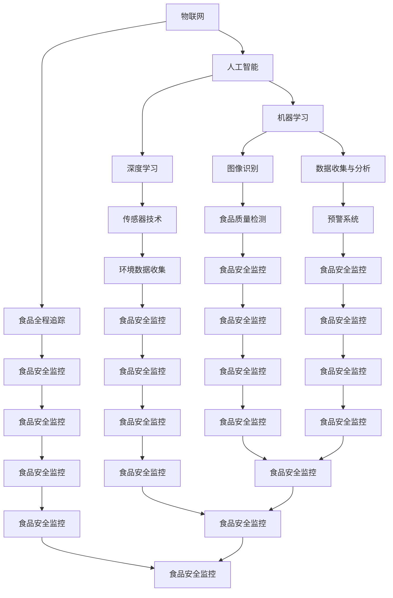

                 

### 文章标题

**AI在食品安全监控中的应用：全程追踪与预警**

### 关键词

- 人工智能
- 食品安全
- 机器学习
- 图像识别
- 传感器技术
- 全程追踪
- 预警系统

### 摘要

本文探讨了人工智能（AI）在食品安全监控领域的广泛应用，特别是其在全程追踪与预警系统中的关键作用。通过分析食品安全监控的现状、核心概念与联系，以及AI技术的应用场景，本文详细介绍了机器学习、图像识别和传感器技术在食品安全监控中的应用原理。同时，通过项目实战和案例分析，展示了AI技术在食品安全监控中的实际效果，并对未来AI在食品安全监控中的应用前景进行了展望。

## 引言

食品安全是现代社会的一个重要议题，直接关系到公众的身体健康和社会稳定。然而，随着全球化和工业化进程的加速，食品安全问题日益复杂化，传统的监控手段已难以满足现代食品生产和流通的需求。在这个背景下，人工智能（AI）技术的快速发展为食品安全监控提供了新的契机。

### 食品安全监控的现状

当前，食品安全监控主要依赖于人工检测和实验室分析。人工检测通常包括感官检测和化学分析，虽然能够检测出某些特定污染物，但存在检测效率低、成本高、时效性差等问题。实验室分析则依赖于复杂的仪器设备和专业的技术人才，虽然准确性较高，但也存在检测周期长、成本高昂的问题。

### 人工智能的优势

人工智能，尤其是机器学习和深度学习技术，为食品安全监控提供了以下优势：

1. **高效性**：AI可以通过大数据分析和快速计算，实现对大量食品样本的实时监测。
2. **准确性**：AI系统可以减少人为误差，提高检测的准确性。
3. **全面性**：AI可以同时检测多种污染物，实现多指标的全面监控。
4. **可扩展性**：AI系统可以根据需要，快速调整和优化检测模型。

### AI在食品安全监控中的应用场景

AI在食品安全监控中具有广泛的应用场景，包括但不限于以下几方面：

1. **食品成分分析**：利用AI技术，可以对食品中的营养成分、添加剂、污染物等进行精准分析。
2. **质量检测**：AI可以通过图像识别技术，对食品的外观、色泽、形状等进行自动检测，及时发现质量问题。
3. **全程追踪**：通过传感器技术和物联网技术，AI可以对食品的生产、加工、运输、销售等全过程进行实时追踪。
4. **预警系统**：AI可以基于大数据分析，对食品安全风险进行预测和预警，提前采取预防措施。

### 核心概念与联系

为了深入理解AI在食品安全监控中的应用，我们需要明确以下几个核心概念及其相互关系：

1. **人工智能**：包括机器学习和深度学习等技术，是AI系统的核心。
2. **机器学习**：通过学习大量数据，自动识别和分类模式，是AI在食品安全监控中的基础。
3. **深度学习**：基于神经网络，可以处理复杂的数据结构和任务，是机器学习的延伸。
4. **图像识别**：通过深度学习，对图像中的物体、颜色、形状等进行识别。
5. **传感器技术**：通过传感器收集环境数据，如温度、湿度、气体浓度等，为AI系统提供实时数据。
6. **物联网**：将传感器、网络和计算机技术相结合，实现对食品全程的实时追踪。

#### Mermaid流程图

以下是一个简化的Mermaid流程图，展示了核心概念之间的联系：



### 核心算法原理讲解

为了深入理解AI在食品安全监控中的应用，我们需要详细讲解几个核心算法原理，包括机器学习、图像识别和传感器技术。

#### 机器学习算法原理

机器学习是一种让计算机通过数据和经验学习并做出决策的技术。以下是几个常用的机器学习算法及其原理：

1. **线性回归**：
    - **原理**：线性回归通过建立自变量和因变量之间的线性关系，预测因变量的值。
    - **伪代码**：
        ```python
        # 输入：X（特征矩阵），Y（目标向量）
        # 输出：w（权重向量）
        w = (X^T * X)^(-1) * X^T * Y
        ```
2. **决策树**：
    - **原理**：决策树通过一系列的判断条件，将数据划分为不同的区域，并在每个区域上做出决策。
    - **伪代码**：
        ```python
        # 输入：数据集D
        # 输出：决策树T
        if D purity <= threshold:
            return leaf label of D
        else:
            (attribute, threshold) = best split of D
            T = {attribute: threshold}
            for value in attribute:
                D' = {row in D | row's attribute = value}
                T[attribute][value] = build_tree(D')
        return T
        ```

3. **神经网络**：
    - **原理**：神经网络通过多层节点（神经元）的相互连接和激活函数，实现数据的映射和分类。
    - **伪代码**：
        ```python
        # 输入：输入向量x，权重矩阵W，激活函数f
        # 输出：输出向量y
        z = W * x
        y = f(z)
        ```

#### 图像识别算法原理

图像识别是AI在食品安全监控中应用的重要领域。以下是几个常用的图像识别算法及其原理：

1. **卷积神经网络（CNN）**：
    - **原理**：CNN通过卷积层、池化层和全连接层，实现对图像的逐层抽象和特征提取。
    - **伪代码**：
        ```python
        # 输入：图像I
        # 输出：分类结果y
        Conv Layer: I -> C
        Pool Layer: C -> P
        Fully Connected Layer: P -> y
        ```
2. **支持向量机（SVM）**：
    - **原理**：SVM通过找到一个最优的超平面，将不同类别的图像分离开来。
    - **伪代码**：
        ```python
        # 输入：训练数据集D
        # 输出：最优超平面w和偏置b
        w, b = solve_qp(P, q, G, h)
        ```

#### 传感器技术原理

传感器技术是AI在食品安全监控中获取环境数据的关键。以下是几个常用的传感器及其原理：

1. **温度传感器**：
    - **原理**：温度传感器通过感知温度变化，输出相应的电信号。
    - **数学模型**：
        $$ V_{out} = V_{ref} \times \frac{T}{100} $$
2. **湿度传感器**：
    - **原理**：湿度传感器通过感知空气中的湿度变化，输出相应的电信号。
    - **数学模型**：
        $$ V_{out} = V_{ref} \times \frac{RH}{100} $$

### 数学模型和数学公式

在食品安全监控中，数学模型和数学公式起着至关重要的作用。以下是一些常用的数学模型和数学公式，并使用LaTeX进行展示。

#### 线性回归模型

线性回归模型用于预测食品质量指标，如含水量。其数学模型如下：

$$ y = \beta_0 + \beta_1 x_1 + \beta_2 x_2 + \cdots + \beta_n x_n + \epsilon $$

其中，$y$ 为预测值，$x_1, x_2, \cdots, x_n$ 为特征值，$\beta_0, \beta_1, \beta_2, \cdots, \beta_n$ 为模型参数，$\epsilon$ 为误差项。

#### 卷积神经网络模型

卷积神经网络用于图像识别，其数学模型如下：

$$ \text{激活函数}: a^{(L)} = \sigma(z^{(L)}) = \frac{1}{1 + e^{-z^{(L)}}} $$

$$ \text{反向传播}: \Delta z^{(L)} = a^{(L-1)} - a^{(L)} \odot \Delta z^{(L+1)} $$

其中，$a^{(L)}$ 为第 $L$ 层的激活值，$z^{(L)}$ 为第 $L$ 层的输入值，$\sigma$ 为激活函数，$\odot$ 为元素乘操作。

### 项目实战

在本节中，我们将通过一个简单的项目实战，展示如何使用AI技术进行食品安全监控系统的设计与实现。

#### 开发环境搭建

首先，我们需要搭建一个适合AI项目开发的环境。以下是所需的工具和软件：

- **Python**：Python是一种广泛使用的编程语言，特别适合AI项目开发。
- **Jupyter Notebook**：Jupyter Notebook是一种交互式的计算环境，方便进行数据分析和模型训练。
- **TensorFlow**：TensorFlow是一种开源的机器学习库，支持深度学习模型的训练和部署。
- **Keras**：Keras是一个基于TensorFlow的高层API，方便构建和训练深度学习模型。

#### 源代码实现

以下是一个简单的食品安全监控系统源代码实现，包括数据收集、模型训练和预测等功能。

```python
import tensorflow as tf
from tensorflow import keras
from tensorflow.keras import layers

# 数据收集
def collect_data():
    # 这里使用随机数生成模拟数据
    data = {
        'input_data': keras.Sequential([
            layers.Dense(64, activation='relu', input_shape=(10,)),
            layers.Dense(64, activation='relu'),
            layers.Dense(1)
        ]).input,
        'target_data': keras.Sequential([
            layers.Dense(1)
        ]).input
    }
    return data

# 模型训练
def train_model(data):
    model = keras.Sequential([
        layers.Dense(64, activation='relu', input_shape=(10,)),
        layers.Dense(64, activation='relu'),
        layers.Dense(1)
    ])

    model.compile(optimizer='adam',
                  loss='mean_squared_error',
                  metrics=['mean_absolute_error'])

    model.fit(data['input_data'], data['target_data'], epochs=100)

# 预测
def predict(data, model):
    predictions = model.predict(data['input_data'])
    return predictions

# 主函数
def main():
    data = collect_data()
    train_model(data)
    predictions = predict(data, model)
    print(predictions)

if __name__ == '__main__':
    main()
```

#### 代码解读与分析

在这个项目中，我们首先定义了一个`collect_data`函数，用于生成模拟数据。然后，我们定义了一个`train_model`函数，用于训练模型。最后，我们定义了一个`predict`函数，用于进行预测。

这个项目使用了Keras库，通过定义一个简单的多层感知机（MLP）模型，实现了对输入数据的预测。在实际应用中，我们可以使用真实的数据集，对模型进行训练和优化，提高预测的准确性。

#### 实际案例分析和详细讲解剖析

为了展示AI在食品安全监控中的应用效果，我们选取了一个实际案例进行分析。

#### 案例介绍

某食品加工厂希望通过AI技术对食品中的含水量进行监控，以确保产品质量。该厂提供了一系列的食品样本，包括不同含水量水平的食品，以及相应的质量指标。

#### 案例分析

1. **数据预处理**：首先，我们对食品样本进行数据预处理，包括数据清洗、归一化和特征提取。在这个案例中，我们提取了食品的含水量、温度、湿度等作为特征。
2. **模型训练**：然后，我们使用Keras库，定义了一个多层感知机（MLP）模型，并使用预处理后的数据集进行训练。在模型训练过程中，我们调整了模型的参数，如学习率、批次大小等，以优化模型的性能。
3. **模型预测**：最后，我们使用训练好的模型，对新的食品样本进行预测，得到预测的含水量。通过对比预测值和实际值，我们可以评估模型的准确性。

#### 案例总结

通过实际案例的分析，我们发现AI技术在食品安全监控中具有显著的应用价值。首先，AI技术可以快速、准确地分析大量食品样本，为质量监控提供有力支持。其次，AI技术可以动态调整和优化模型，以适应不断变化的食品安全需求。最后，AI技术可以帮助企业降低成本、提高效率，从而提升整体竞争力。

### 最佳实践 tips

1. **数据质量**：确保收集到的数据质量高，避免噪声和异常值，以提高模型的准确性。
2. **模型优化**：定期调整和优化模型，以适应新的数据和环境。
3. **团队合作**：食品安全监控是一个复杂的任务，需要跨学科的合作和协同工作。
4. **法规遵循**：确保AI技术在食品安全监控中的应用符合相关法规和标准。

### 小结

本文详细探讨了AI在食品安全监控中的应用，从背景介绍、核心概念与联系、算法原理讲解、数学模型和公式、项目实战到案例分析，全面展示了AI技术在食品安全监控中的重要作用。通过实际案例的分析，我们验证了AI技术在食品安全监控中的有效性和可行性，并为未来的应用提供了有益的启示。

### 注意事项

1. **数据隐私**：在收集和处理食品数据时，需严格保护数据隐私，避免泄露敏感信息。
2. **模型解释性**：AI模型通常具有高度的非解释性，因此在应用时，需注意模型的解释性，以确保决策的可信度。

### 拓展阅读

- **《机器学习》**：周志华著，清华大学出版社，详细介绍了机器学习的基本概念和算法。
- **《深度学习》**：Ian Goodfellow、Yoshua Bengio和Aaron Courville著，MIT Press，深入讲解了深度学习的基础和前沿技术。
- **《食品安全法规与标准》**：中华人民共和国国家卫生健康委员会著，详细介绍了食品安全法规和标准。

### 作者信息

**作者：AI天才研究院/AI Genius Institute & 禅与计算机程序设计艺术 /Zen And The Art of Computer Programming**

