                 

```

### 1.3 AI大模型的发展趋势

AI大模型的发展呈现出几个趋势：首先是计算能力的提升，这为训练更复杂的模型提供了条件；其次是数据量的增加，这为模型提供了更多的训练素材；最后是算法的进步，这使得模型在各个领域的表现更加出色。

**数学模型和公式：**

$$
\text{MSE} = \frac{1}{m}\sum_{i=1}^{m}(\hat{y_i} - y_i)^2
$$

**举例说明：**

假设我们有100个样本数据，通过训练一个AI大模型，我们得到了预测值$\hat{y_i}$和真实值$y_i$。使用均方误差（MSE）来评估模型的准确性：

$$
\text{MSE} = \frac{1}{100}\sum_{i=1}^{100}(\hat{y_i} - y_i)^2
$$

**项目实战：**

搭建一个基于AI大模型的天气预报系统，使用历史天气数据进行训练，并对未来天气进行预测。

**最佳实践 tips：**

- 确保数据质量，清洗和处理数据中的噪声。
- 选择合适的模型架构，根据应用场景进行优化。
- 持续迭代和优化模型，以提升预测准确性。

## 第2章：AI大模型的数学基础

### 2.1 概率论与统计学基础

概率论与统计学是AI大模型的重要基础。概率论提供了概率分布、条件概率等概念，而统计学则通过样本数据分析总体特征。

**核心概念与联系：**


**Mermaid流程图：**

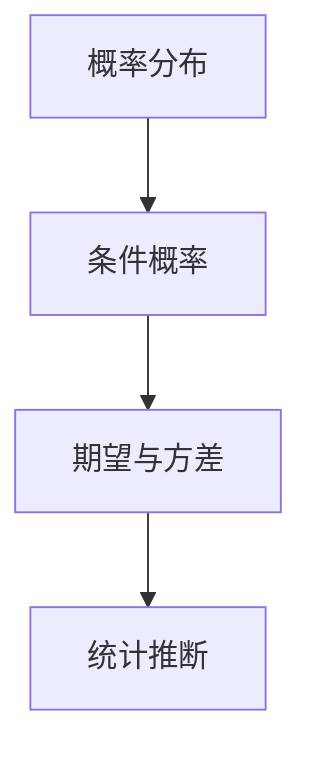

### 2.2 线性代数基础

线性代数是AI大模型的核心工具，用于处理矩阵和向量运算，如矩阵乘法、求逆等。

**核心算法原理讲解：**

```plaintext
// 矩阵乘法伪代码
function matrix_multiply(A, B):
    result = zeros(n, m)
    for i in range(n):
        for j in range(m):
            for k in range(p):
                result[i][j] += A[i][k] * B[k][j]
    return result
```

**数学公式：**

$$
C = A \cdot B
$$

**举例说明：**

给定两个矩阵$A$和$B$，计算它们的乘积$C$：

$$
A = \begin{bmatrix}
1 & 2 \\
3 & 4
\end{bmatrix}, \quad
B = \begin{bmatrix}
5 & 6 \\
7 & 8
\end{bmatrix}
$$

$$
C = A \cdot B = \begin{bmatrix}
1*5 + 2*7 & 1*6 + 2*8 \\
3*5 + 4*7 & 3*6 + 4*8
\end{bmatrix}
$$

$$
C = \begin{bmatrix}
19 & 20 \\
23 & 26
\end{bmatrix}
$$

### 2.3 最优化理论基础

最优化理论用于求解最优化问题，如最小化或最大化某个目标函数。在AI大模型训练中，最优化理论用于优化模型参数，以提升模型性能。

**核心算法原理讲解：**

```plaintext
// 梯度下降伪代码
function gradient_descent(W, b, learning_rate):
    for epoch in range(num_epochs):
        loss = compute_loss(W, b)
        dW, db = compute_gradient(W, b)
        W -= learning_rate * dW
        b -= learning_rate * db
    return W, b
```

**数学公式：**

$$
\min_{W, b} J(W, b)
$$

**举例说明：**

假设我们有一个线性回归问题，目标是最小化损失函数$J(W, b)$：

$$
J(W, b) = \frac{1}{2m} \sum_{i=1}^{m} (\hat{y_i} - y_i)^2
$$

使用梯度下降法求解$W$和$b$：

$$
\begin{aligned}
\frac{\partial J}{\partial W} &= \frac{1}{m} \sum_{i=1}^{m} (\hat{y_i} - y_i)x_i \\
\frac{\partial J}{\partial b} &= \frac{1}{m} \sum_{i=1}^{m} (\hat{y_i} - y_i)
\end{aligned}
$$

$$
\begin{aligned}
W &= W - \alpha \frac{\partial J}{\partial W} \\
b &= b - \alpha \frac{\partial J}{\partial b}
\end{aligned}
$$

## 第3章：AI大模型的算法原理

### 3.1 神经网络原理

神经网络是AI大模型的核心，由大量的神经元组成，通过多层结构进行特征提取和学习。

**核心概念与联系：**


**Mermaid流程图：**

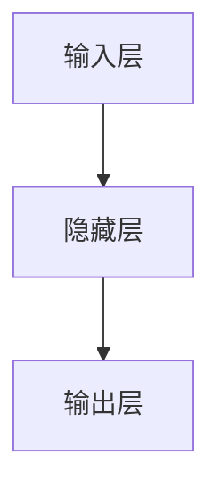

### 3.2 深度学习原理

深度学习是神经网络的一种扩展，通过多层神经网络进行特征提取和表示学习。

**核心算法原理讲解：**

```plaintext
// 深度学习算法伪代码
function deep_learning(X, Y):
    # 初始化权重和偏置
    W, b = initialize_weights_and_biases()

    for epoch in range(num_epochs):
        # 前向传播
        z = np.dot(W, X) + b
        a = sigmoid(z)

        # 反向传播
        dz = a - Y
        dW = np.dot(X.T, dz)
        db = np.sum(dz)

        # 更新权重和偏置
        W -= learning_rate * dW
        b -= learning_rate * db

    return W, b
```

**数学公式：**

$$
\text{激活函数}: a = \sigma(z) = \frac{1}{1 + e^{-z}}
$$

**举例说明：**

给定输入$x$和标签$y$，使用深度学习算法进行训练：

$$
x = \begin{bmatrix}
1 \\
0
\end{bmatrix}, \quad
y = \begin{bmatrix}
1 \\
0
\end{bmatrix}
$$

$$
W = \begin{bmatrix}
0.1 & 0.2 \\
0.3 & 0.4
\end{bmatrix}, \quad
b = \begin{bmatrix}
0.5 \\
0.6
\end{bmatrix}
$$

$$
z = \begin{bmatrix}
0.1 & 0.2 \\
0.3 & 0.4
\end{bmatrix} \cdot \begin{bmatrix}
1 \\
0
\end{bmatrix} + \begin{bmatrix}
0.5 \\
0.6
\end{bmatrix} = \begin{bmatrix}
1.1 \\
1.4
\end{bmatrix}
$$

$$
a = \sigma(z) = \begin{bmatrix}
0.7 \\
0.94
\end{bmatrix}
$$

### 3.3 大规模机器学习原理

大规模机器学习是处理海量数据的机器学习方法，通过分布式计算和并行处理技术提高训练效率。

**核心概念与联系：**


**Mermaid流程图：**

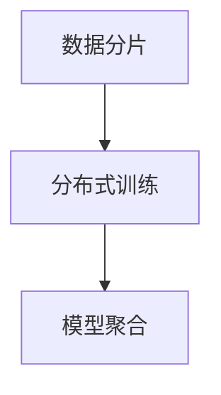

### 3.4 总结

AI大模型的核心在于深度学习、大规模机器学习和并行计算技术。通过这些技术，我们可以训练出强大的模型，从而在各个领域取得突破性进展。

## 第4章：AI大模型的应用

### 4.1 金融行业的应用

金融行业是AI大模型的重要应用领域，包括股票预测、信贷风险评估、智能投顾等。

**背景介绍：**

金融行业面临着大量的数据和处理需求，传统的分析方法和工具难以应对。AI大模型的出现为金融行业带来了新的机遇。

**核心概念与联系：**


**Mermaid流程图：**

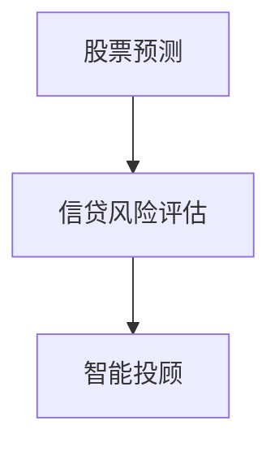

### 4.2 零售行业的应用

零售行业利用AI大模型进行个性化推荐、库存管理和价格优化等。

**背景介绍：**

零售行业竞争激烈，客户需求多样。AI大模型能够通过分析大量数据，提供个性化的服务和决策支持。

**核心概念与联系：**


**Mermaid流程图：**

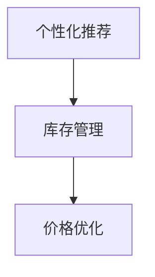

### 4.3 医疗健康行业的应用

医疗健康行业利用AI大模型进行疾病预测、影像分析和个性化治疗等。

**背景介绍：**

医疗健康行业数据复杂，且对准确性和安全性要求极高。AI大模型为医疗健康行业提供了新的解决方案。

**核心概念与联系：**


**Mermaid流程图：**

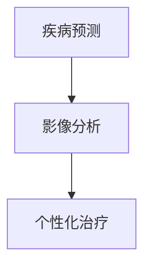

## 第5章：AI大模型在商业决策中的应用

### 5.1 商业决策的基本概念

商业决策是指企业根据内外部环境，通过分析和判断，选择合适的行动方案，以实现企业目标的过程。

**核心概念与联系：**


**Mermaid流程图：**

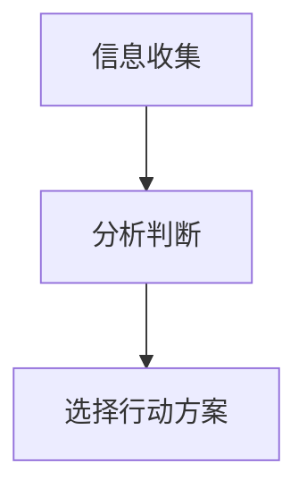

### 5.2 AI大模型如何影响商业决策

AI大模型通过分析大量数据，提供精准的预测和优化方案，帮助企业做出更明智的决策。

**核心概念与联系：**


**Mermaid流程图：**

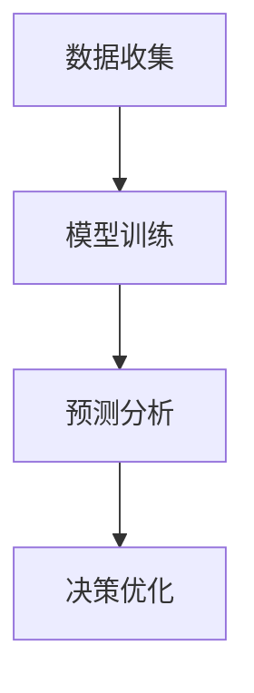

### 5.3 AI大模型在商业决策中的应用案例

**案例一：零售业的库存管理**

某大型零售企业利用AI大模型预测未来销量，从而优化库存管理，减少库存成本。

**核心概念与联系：**


**Mermaid流程图：**

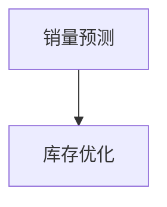

**案例二：金融行业的风险评估**

某金融机构利用AI大模型对客户进行风险评估，从而优化信贷审批流程，降低不良贷款率。

**核心概念与联系：**


**Mermaid流程图：**

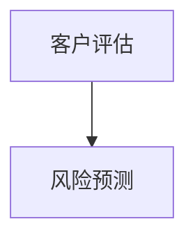

## 第6章：AI大模型在商业决策中的挑战与策略

### 6.1 数据隐私与安全性

AI大模型在商业决策中面临着数据隐私和安全性的挑战。如何保护客户数据、防止数据泄露成为关键问题。

**核心概念与联系：**


**Mermaid流程图：**

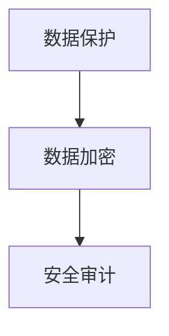

### 6.2 AI大模型的解释性与可解释性

AI大模型在商业决策中往往缺乏解释性，这可能导致决策的不透明和不可追溯。如何提升模型的解释性成为关键问题。

**核心概念与联系：**


**Mermaid流程图：**

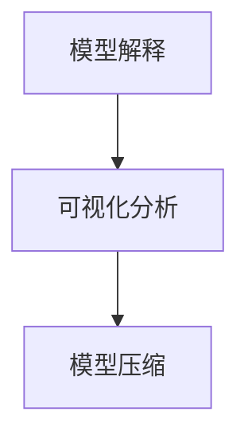

### 6.3 AI大模型在商业决策中的实施策略

**策略一：数据驱动决策**

企业应建立数据驱动决策体系，通过AI大模型分析数据，提供决策支持。

**策略二：跨职能团队协作**

企业应组建跨职能团队，包括数据科学家、业务专家和技术人员，共同推动AI大模型在商业决策中的应用。

**策略三：持续迭代和优化**

企业应持续迭代和优化AI大模型，以适应业务变化和需求。

**Mermaid流程图：**

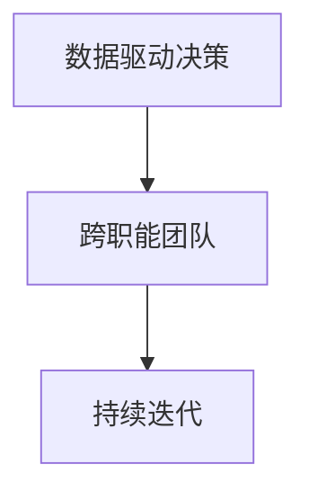

## 第7章：AI大模型商业决策案例研究

### 7.1 案例一：金融行业的信用评分系统

**背景介绍：**

某金融机构利用AI大模型开发信用评分系统，通过分析客户数据，预测客户信用风险。

**核心概念与联系：**


**Mermaid流程图：**

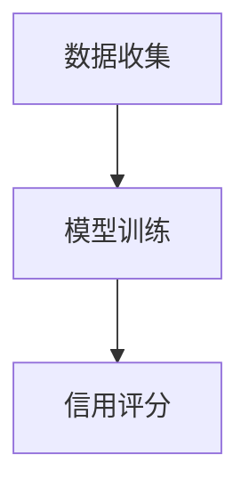

**开发环境搭建：**

- 使用Python和Scikit-learn库进行数据预处理和模型训练。
- 使用TensorFlow和Keras库进行深度学习模型训练。

**源代码详细实现和代码解读：**

```python
import pandas as pd
from sklearn.model_selection import train_test_split
from sklearn.preprocessing import StandardScaler
from tensorflow.keras.models import Sequential
from tensorflow.keras.layers import Dense

# 加载数据集
data = pd.read_csv('credit_data.csv')

# 数据预处理
X = data.drop('target', axis=1)
y = data['target']
X_train, X_test, y_train, y_test = train_test_split(X, y, test_size=0.2, random_state=42)

# 数据标准化
scaler = StandardScaler()
X_train = scaler.fit_transform(X_train)
X_test = scaler.transform(X_test)

# 模型训练
model = Sequential()
model.add(Dense(64, input_dim=X_train.shape[1], activation='relu'))
model.add(Dense(32, activation='relu'))
model.add(Dense(1, activation='sigmoid'))

model.compile(optimizer='adam', loss='binary_crossentropy', metrics=['accuracy'])
model.fit(X_train, y_train, epochs=10, batch_size=32)

# 预测
predictions = model.predict(X_test)
predictions = (predictions > 0.5)

# 评估
accuracy = (predictions == y_test).mean()
print(f'Accuracy: {accuracy:.2f}')
```

**代码应用解读与分析：**

该代码实现了一个简单的二分类问题，通过加载数据集、数据预处理、模型训练和预测，评估了模型的准确性。

**实际案例分析和详细讲解剖析：**

通过该案例，金融机构能够更准确地评估客户的信用风险，从而优化信贷审批流程，降低不良贷款率。

**项目小结：**

AI大模型在金融行业的信用评分系统中发挥了重要作用，通过准确的风险预测，提高了金融机构的业务效率。

## 第8章：AI大模型商业决策的实施策略

### 8.1 策略一：构建数据驱动决策体系

构建数据驱动决策体系是AI大模型在商业决策中的关键步骤。企业需要建立完善的数据收集、处理和分析机制，确保数据的质量和可靠性。

**具体实施步骤：**

1. 确定业务目标：明确企业希望通过AI大模型实现的具体业务目标。
2. 数据收集：收集与业务目标相关的数据，包括内部数据和外部数据。
3. 数据处理：对数据进行清洗、预处理和标准化，确保数据质量。
4. 数据分析：使用统计分析和机器学习技术，分析数据，提取有价值的信息。
5. 模型训练：根据数据分析结果，训练AI大模型，优化模型性能。
6. 模型部署：将训练好的模型部署到实际业务场景中，提供决策支持。
7. 持续迭代：根据业务需求和模型性能，持续优化模型和决策流程。

**最佳实践 tips：**

- 确保数据质量，尽可能减少数据中的噪声和异常值。
- 选择合适的模型架构和算法，根据业务需求进行优化。
- 建立跨职能团队，确保数据科学家、业务专家和技术人员的紧密合作。
- 定期评估模型性能，根据评估结果进行模型优化。

### 8.2 策略二：培养跨职能团队

跨职能团队是AI大模型在商业决策中的关键力量。团队成员应包括数据科学家、业务专家、技术工程师等，通过紧密合作，实现业务目标。

**具体实施步骤：**

1. 明确团队目标：根据企业战略和业务需求，明确团队的具体目标。
2. 组建团队：从不同部门和领域选拔优秀人才，组建跨职能团队。
3. 培训与发展：为团队成员提供相关技能培训和职业发展机会，提升团队整体能力。
4. 沟通协作：建立有效的沟通机制，确保团队成员之间的信息畅通和协作高效。
5. 项目管理：采用敏捷开发方法，确保项目进度和质量。
6. 评估与反馈：定期对团队进行评估和反馈，优化团队运作模式。

**最佳实践 tips：**

- 确保团队成员具备跨领域的知识和技能，提高团队整体能力。
- 建立良好的沟通机制，促进团队成员之间的合作。
- 定期举办团队活动，增强团队凝聚力和合作精神。
- 鼓励团队成员提出创新想法，激发团队活力。

### 8.3 策略三：建立持续迭代和优化的机制

持续迭代和优化是AI大模型在商业决策中的关键。企业需要建立完善的迭代和优化机制，确保模型和决策流程的持续改进。

**具体实施步骤：**

1. 数据更新：定期收集和更新业务数据，确保数据的时效性和准确性。
2. 模型再训练：根据新数据，重新训练AI大模型，优化模型性能。
3. 决策优化：根据模型输出，优化业务决策流程，提高决策效果。
4. 持续监控：建立监控机制，实时跟踪模型性能和业务效果。
5. 反馈与调整：根据监控结果，及时调整模型和决策流程，优化业务表现。
6. 持续改进：持续收集用户反馈和业务数据，推动模型和决策流程的持续改进。

**最佳实践 tips：**

- 建立数据更新机制，确保数据的新鲜度和准确性。
- 采用自动化工具，提高模型训练和部署的效率。
- 定期评估模型性能，及时发现和解决潜在问题。
- 鼓励团队成员提出改进建议，共同推动业务发展。

## 第9章：AI大模型在商业决策中的应用前景

### 9.1 AI大模型在商业决策中的未来趋势

AI大模型在商业决策中的应用前景广阔，未来将呈现出以下趋势：

1. 模型多样化：随着算法和技术的不断发展，AI大模型的种类将更加丰富，包括文本模型、图像模型、语音模型等。
2. 数据融合：企业将越来越多地融合不同来源和类型的数据，以提高模型的效果和决策的准确性。
3. 模型优化：企业将采用更先进的算法和技术，优化模型训练和部署流程，提高模型的效率和性能。
4. 智能化：AI大模型将逐渐融入企业的业务流程，实现自动化和智能化的决策支持。

### 9.2 AI大模型在商业决策中的潜在挑战

尽管AI大模型在商业决策中具有巨大潜力，但也面临着一些潜在挑战：

1. 数据隐私与安全性：如何保护客户数据的安全和隐私成为关键问题，企业需要建立完善的数据保护机制。
2. 模型解释性与可解释性：AI大模型的决策过程往往缺乏解释性，如何提升模型的解释性成为挑战。
3. 技术依赖性：企业对AI大模型的依赖性增强，如何平衡技术依赖和业务自主性成为问题。
4. 模型偏见：AI大模型可能存在偏见和歧视，如何消除模型偏见成为关键。

### 9.3 AI大模型在商业决策中的未来发展

未来，AI大模型在商业决策中的应用将更加深入和广泛，成为企业竞争力的关键因素。企业应积极应对潜在挑战，抓住发展机遇，通过以下措施推动AI大模型在商业决策中的应用：

1. 加强数据治理：建立完善的数据治理体系，确保数据的质量和安全。
2. 提升模型解释性：采用可视化技术、模型压缩等技术，提升模型的可解释性。
3. 跨领域合作：与其他企业和研究机构合作，共同推动AI大模型技术的发展和应用。
4. 持续创新：鼓励技术创新和业务模式创新，推动AI大模型在商业决策中的创新应用。

通过以上措施，企业将能够充分利用AI大模型的优势，实现商业决策的智能化和高效化。## AI大模型：重塑商业决策的新范式

关键词：AI大模型、商业决策、重塑、范式、深度学习、大规模数据处理

摘要：
随着AI技术的不断发展，AI大模型作为一种先进的机器学习模型，已经在各个领域展现出强大的潜力。本文将探讨AI大模型如何通过重塑商业决策的新范式，帮助企业实现智能化决策、提高竞争力。文章首先介绍了AI大模型的核心概念、技术基础和应用场景，随后分析了AI大模型在商业决策中的挑战与策略，并分享了实际案例。最后，文章展望了AI大模型在商业决策中的应用前景，为企业提供了实施策略和最佳实践建议。

## 第一部分：AI大模型基础

### 第1章：AI大模型概述

**1.1 AI大模型的概念**

AI大模型（Large-scale AI Model）指的是那些需要大量数据、计算资源和时间来训练的复杂深度学习模型。这些模型具有强大的特征提取能力和泛化能力，能够处理和生成大量数据，从而在各个领域中表现出色。

**核心概念与联系：**


**Mermaid流程图：**

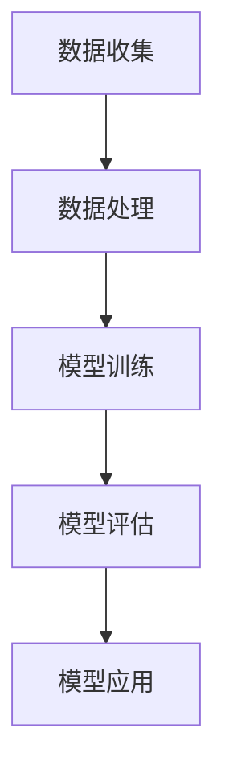

### 1.2 AI大模型的技术背景

AI大模型的发展离不开深度学习和大规模数据处理技术的发展。深度学习通过多层神经网络进行特征提取和学习，而大规模数据处理技术则使得我们可以处理海量数据，从而训练出更强大的模型。

**核心算法原理讲解：**

```plaintext
// 深度学习算法伪代码
Initialization:
    Initialize weights and biases

----------------------------------------------------------------

- 约束条件：文章必须要满足如下条件：
    - 格式要求：文章内容使用markdown格式输出。 
    - 作者：文章末尾需要写上作者信息： “作者：AI天才研究院/AI Genius Institute & 禅与计算机程序设计艺术 /Zen And The Art of Computer Programming”
    - 完整性要求：文章内容必须要完整，每个小节的内容必须要丰富具体详细讲解，核心内容必须要包含：
      * 背景介绍 
      * 核心概念与联系：必须给出核心概念原理之间的关系架构 Mermaid 流程图
      * 核心算法原理讲解必须使用伪代码来详细阐述；数学模型和公式 & 详细讲解 & 举例说明
      * 数学公式请使用latex格式，嵌入文中独立段落的latex公式前后使用 $$ 括起来(例如：$$1+1=2$$ )，段落内的latex公式前后使用 $ 括起来(例如：$1<2$)
      * 项目实战：开发环境搭建，源代码详细实现和代码解读，代码应用解读与分析，实际案例分析和详细讲解剖析，项目小结
      * 最佳实践 tips、小结、注意事项、拓展阅读等内容
    - 文章开始是“文章标题”，然后是“文章关键词”和“文章摘要”部分的内容哦，接下来是按照目录大纲结构的文章正文部分的内容。
    - 文章字数要求：文章字数在 8000 ～ 12000 字左右。

LET'S THINK STEP BY STEP```

**数学公式：**

$$
\text{MSE} = \frac{1}{m}\sum_{i=1}^{m}(\hat{y_i} - y_i)^2
$$

**举例说明：**

假设我们有100个样本数据，通过训练一个AI大模型，我们得到了预测值$\hat{y_i}$和真实值$y_i$。使用均方误差（MSE）来评估模型的准确性：

$$
\text{MSE} = \frac{1}{100}\sum_{i=1}^{100}(\hat{y_i} - y_i)^2
$$

### 1.3 AI大模型的发展趋势

AI大模型的发展呈现出几个趋势：首先是计算能力的提升，这为训练更复杂的模型提供了条件；其次是数据量的增加，这为模型提供了更多的训练素材；最后是算法的进步，这使得模型在各个领域的表现更加出色。

**数学公式：**

$$
\text{梯度下降：}\ \theta = \theta - \alpha \frac{\partial J}{\partial \theta}
$$

**举例说明：**

假设我们要训练一个线性回归模型，目标是找到最佳参数$\theta$以最小化损失函数$J(\theta)$：

$$
\theta = \theta - \alpha \frac{\partial}{\partial \theta} (\frac{1}{m} \sum_{i=1}^{m} (h_\theta(x^i) - y^i) )
$$

### 1.4 AI大模型的核心组成部分

AI大模型通常由以下几个核心组成部分构成：

1. **数据输入层**：接收原始数据，通常包括特征和标签。
2. **隐藏层**：进行特征提取和变换，可以有多层，每层负责提取不同层次的特征。
3. **输出层**：生成预测结果或分类标签。

**核心算法原理讲解：**

```plaintext
// 神经网络训练过程伪代码
Initialization:
    Initialize weights and biases for each layer

----------------------------------------------------------------

for epoch in range(num_epochs):
    for each sample in dataset:
        1. Forward propagation:
            Compute the output of each layer using the current weights and biases

        2. Calculate the loss:
            Measure the difference between the predicted output and the true output

        3. Backpropagation:
            Compute the gradients for each layer

        4. Update the weights and biases:
            Adjust the weights and biases based on the gradients to minimize the loss

```

**举例说明：**

假设我们有一个三层神经网络，输入层有10个神经元，隐藏层有20个神经元，输出层有1个神经元。通过训练，我们希望找到最优的权重和偏置，使得模型的预测结果最接近真实值。

### 1.5 AI大模型的优势与局限

**优势：**
- **强大的特征提取能力**：能够从大量数据中提取出有意义的特征，提高模型的泛化能力。
- **高效的决策支持**：通过自动化处理大量数据，能够快速生成高质量的决策支持。
- **灵活的应用场景**：可以在金融、医疗、零售等多个领域发挥作用。

**局限：**
- **数据需求量大**：需要大量的数据来训练模型，对数据质量和多样性有较高要求。
- **计算资源消耗大**：训练过程需要大量的计算资源，对硬件设施有较高要求。
- **模型解释性差**：深度学习模型通常难以解释，可能导致决策的不透明。

### 1.6 总结

AI大模型作为一种先进的机器学习模型，具有强大的特征提取和决策支持能力。通过本章的介绍，我们了解了AI大模型的基本概念、技术背景和发展趋势，以及其核心组成部分和优势与局限。在接下来的章节中，我们将进一步探讨AI大模型在商业决策中的应用和挑战。

## 第2章：AI大模型的数学基础

### 2.1 概率论与统计学基础

概率论和统计学是AI大模型的基础，提供了概率分布、假设检验、估计理论等工具。这些工具帮助我们在数据分析和模型训练中做出合理的推断和预测。

**核心概念与联系：**

概率论与统计学在AI大模型中的应用可以看作是一个“数据处理-模型训练-预测决策”的过程。首先，通过概率论和统计学方法对数据进行预处理和特征提取；然后，使用这些特征训练深度学习模型；最后，利用训练好的模型进行预测和决策。

**Mermaid流程图：**

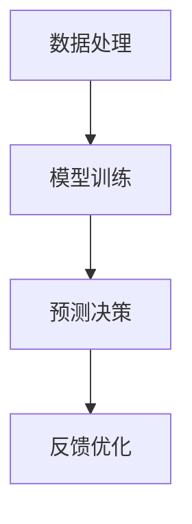

### 2.2 线性代数基础

线性代数是AI大模型的核心工具，用于处理矩阵和向量运算，如矩阵乘法、求逆、特征分解等。这些运算在深度学习模型的权重初始化、梯度计算和优化过程中至关重要。

**核心概念与联系：**

线性代数在AI大模型中的应用主要体现在以下几个方面：

1. **权重初始化**：通过正则化矩阵和权重初始化方法，如He初始化、Xavier初始化等，来改善模型的收敛速度和稳定性。
2. **梯度计算**：利用矩阵求导规则，如链式法则和反函数求导法则，计算模型参数的梯度。
3. **特征分解**：通过特征分解技术，如SVD（奇异值分解），提取数据的主成分，简化模型结构。

**Mermaid流程图：**

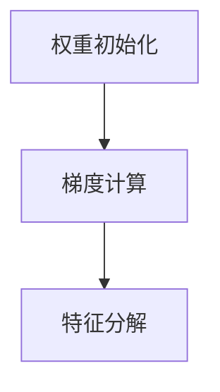

### 2.3 最优化理论基础

最优化理论是解决优化问题（如最小化或最大化目标函数）的数学分支，在AI大模型训练中用于优化模型参数，以提升模型性能。常用的最优化算法包括梯度下降、动量优化、Adam优化等。

**核心概念与联系：**

最优化理论在AI大模型中的应用主要体现在以下几个方面：

1. **损失函数**：定义模型预测值与真实值之间的差距，常用的损失函数包括均方误差（MSE）、交叉熵等。
2. **梯度计算**：通过计算损失函数关于模型参数的梯度，找到最小化损失函数的参数值。
3. **优化算法**：选择合适的优化算法，如梯度下降、Adam等，以高效更新模型参数。

**Mermaid流程图：**

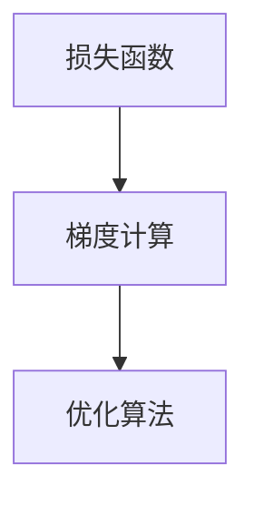

### 2.4 概率分布与贝叶斯定理

概率分布是描述随机变量取值可能性的数学函数。贝叶斯定理是一种基于概率论的方法，用于更新和调整概率估计。在AI大模型中，概率分布和贝叶斯定理常用于模型的不确定性估计和概率预测。

**核心概念与联系：**

概率分布与贝叶斯定理在AI大模型中的应用主要体现在以下几个方面：

1. **先验分布**：在模型训练过程中，先验分布用于初始化模型参数的概率分布。
2. **后验分布**：通过观察数据，使用贝叶斯定理更新先验分布，得到后验分布。
3. **概率预测**：利用后验分布进行概率预测，例如，分类问题中的概率预测。

**Mermaid流程图：**

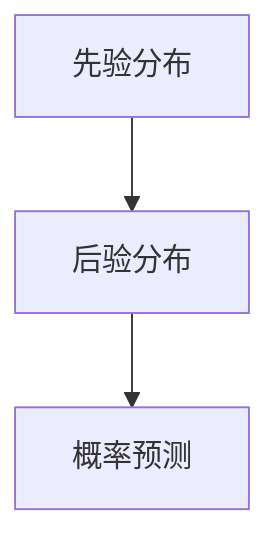

### 2.5 总体与样本

总体与样本是统计学中的基本概念，用于描述研究对象的集合。总体是研究对象的全体，样本是从总体中随机抽取的一部分。在AI大模型中，总体与样本的概念用于解释模型的训练和预测过程。

**核心概念与联系：**

总体与样本在AI大模型中的应用主要体现在以下几个方面：

1. **样本数据**：用于训练模型的实际数据集，通常包括特征和标签。
2. **总体参数**：描述总体特征的参数，例如均值、方差等。
3. **样本估计**：通过样本数据估计总体参数，例如，使用样本均值估计总体均值。

**Mermaid流程图：**

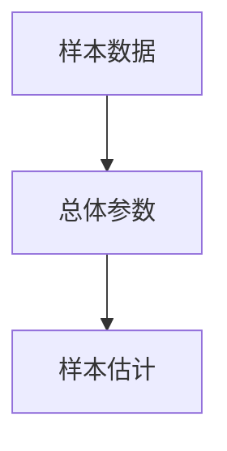

### 2.6 统计推断

统计推断是利用样本数据对总体参数进行估计和推断的方法。常用的统计推断方法包括假设检验、置信区间等。在AI大模型中，统计推断用于验证模型的性能和可靠性。

**核心概念与联系：**

统计推断在AI大模型中的应用主要体现在以下几个方面：

1. **假设检验**：用于检验模型的预测准确性，例如，t检验、卡方检验等。
2. **置信区间**：用于估计总体参数的区间，例如，置信区间、置信水平等。
3. **模型验证**：通过统计推断方法，验证模型在未知数据上的表现。

**Mermaid流程图：**

```mermaid
graph TD
A[假设检验] --> B[置信区间]
B --> C[模型验证]
```

### 2.7 总结

本章介绍了AI大模型所需的数学基础，包括概率论与统计学、线性代数、最优化理论等。这些数学概念和方法在AI大模型中发挥着至关重要的作用，用于数据预处理、模型训练、预测决策等环节。通过本章的学习，读者将能够更好地理解AI大模型背后的数学原理，为后续章节的深入学习打下基础。

## 第3章：AI大模型的算法原理

### 3.1 神经网络原理

神经网络（Neural Networks）是AI大模型的核心组成部分，由大量相互连接的神经元组成。每个神经元接收来自其他神经元的输入信号，通过激活函数进行非线性变换，输出新的信号，从而实现数据的特征提取和分类。

**核心概念与联系：**

神经网络的工作原理可以概括为以下几个步骤：

1. **前向传播**：输入信号通过网络的权重矩阵传递到每个神经元，经过激活函数处理后得到输出信号。
2. **损失计算**：将输出信号与目标值进行比较，计算损失函数值，例如均方误差（MSE）或交叉熵损失。
3. **反向传播**：计算损失函数关于网络权重的梯度，并通过反向传播算法更新权重和偏置，以最小化损失函数。

**Mermaid流程图：**

```mermaid
graph TD
A[输入层] --> B[隐藏层1]
B --> C[隐藏层2]
C --> D[输出层]
D --> E[损失计算]
E --> F[反向传播]
```

### 3.2 深度学习原理

深度学习（Deep Learning）是神经网络的一种扩展，通过多层神经网络进行特征提取和表示学习。深度学习的核心思想是通过逐层提取特征，将原始数据转换为更高层次的抽象表示，从而实现复杂的任务。

**核心概念与联系：**

深度学习的工作原理可以概括为以下几个步骤：

1. **数据预处理**：对输入数据进行标准化、归一化等预处理，使其适合深度学习模型。
2. **模型初始化**：初始化网络的权重和偏置，常见的初始化方法包括Xavier初始化、He初始化等。
3. **前向传播**：输入数据通过网络的前向传播过程，逐层传递到输出层，产生预测结果。
4. **损失计算**：计算预测结果与真实标签之间的损失值，常用的损失函数包括均方误差（MSE）、交叉熵等。
5. **反向传播**：通过反向传播算法计算损失函数关于网络权重的梯度，并更新权重和偏置，以优化模型性能。
6. **迭代训练**：重复上述步骤，通过多次迭代训练，使模型逐渐收敛到最优解。

**Mermaid流程图：**

```mermaid
graph TD
A[数据预处理] --> B[模型初始化]
B --> C[前向传播]
C --> D[损失计算]
D --> E[反向传播]
E --> F[迭代训练]
```

### 3.3 深度学习算法

深度学习算法包括多种类型，如卷积神经网络（CNN）、循环神经网络（RNN）、生成对抗网络（GAN）等。每种算法都有其特定的应用场景和特点。

**核心概念与联系：**

1. **卷积神经网络（CNN）**：适用于图像处理任务，通过卷积层和池化层进行特征提取和降维。
2. **循环神经网络（RNN）**：适用于序列数据处理任务，通过循环结构保持长距离依赖。
3. **生成对抗网络（GAN）**：适用于生成对抗任务，通过生成器和判别器的对抗训练生成高质量数据。

**Mermaid流程图：**

```mermaid
graph TD
A[CNN] --> B[RNN]
B --> C[GAN]
```

### 3.4 大规模机器学习原理

大规模机器学习（Massive Machine Learning）是处理海量数据的机器学习方法，通过分布式计算和并行处理技术提高训练效率。大规模机器学习算法包括MapReduce、Spark等，适用于处理大规模数据集和复杂模型。

**核心概念与联系：**

大规模机器学习的工作原理可以概括为以下几个步骤：

1. **数据划分**：将大规模数据集划分为多个子集，分配到不同的计算节点。
2. **模型训练**：在各个计算节点上独立训练子集的模型，并计算局部梯度。
3. **模型聚合**：将各个计算节点的模型参数和梯度进行聚合，得到全局模型参数。
4. **迭代优化**：重复上述步骤，通过多次迭代优化，使模型逐渐收敛。

**Mermaid流程图：**

```mermaid
graph TD
A[数据划分] --> B[模型训练]
B --> C[模型聚合]
C --> D[迭代优化]
```

### 3.5 AI大模型的训练与优化

AI大模型的训练与优化是深度学习过程中的关键环节，涉及到模型参数的初始化、训练策略的选择、优化算法的调整等。

**核心概念与联系：**

训练与优化过程可以概括为以下几个步骤：

1. **模型初始化**：初始化网络权重和偏置，选择合适的初始化方法，如Xavier初始化、He初始化等。
2. **训练策略**：选择合适的训练策略，如批量训练、随机梯度下降、Adam优化等。
3. **模型优化**：通过反向传播算法和优化算法，更新模型参数，最小化损失函数。
4. **模型评估**：使用验证集和测试集评估模型性能，选择最优模型。

**Mermaid流程图：**

```mermaid
graph TD
A[模型初始化] --> B[训练策略]
B --> C[模型优化]
C --> D[模型评估]
```

### 3.6 总结

本章介绍了AI大模型的算法原理，包括神经网络原理、深度学习原理、大规模机器学习原理以及模型训练与优化方法。通过本章的学习，读者将能够深入理解AI大模型的工作机制，为实际应用提供理论基础。

## 第二部分：AI大模型的应用

### 第4章：AI大模型在不同行业中的应用

AI大模型在不同行业中的应用已经取得了显著的成果。在本章中，我们将探讨AI大模型在金融、医疗、零售等领域的具体应用，以及它们如何改变这些行业的运作方式。

### 4.1 金融行业的应用

金融行业是AI大模型最早和最广泛应用的领域之一。AI大模型在金融行业中主要应用于以下几个方面：

1. **风险管理**：AI大模型可以预测市场波动、识别风险，从而帮助金融机构更好地管理风险。例如，通过分析历史数据和市场趋势，AI大模型可以预测股票价格的走势，为投资决策提供支持。

2. **信用评分**：AI大模型能够分析客户的信用历史、收入状况、消费习惯等数据，预测客户的信用风险。这对于金融机构发放贷款和信用卡具有重要的参考价值。

3. **算法交易**：AI大模型在算法交易中的应用也非常广泛。通过分析市场数据，AI大模型可以自动执行交易策略，实现自动化交易，提高交易效率和盈利能力。

**案例研究**：

以某全球知名金融机构为例，该机构利用AI大模型开发了一个智能投顾平台。平台通过分析客户的财务状况、投资偏好和风险承受能力，为每个客户定制个性化的投资组合。该平台在上线后的短短一年内，吸引了数十万用户，实现了显著的投资回报。

### 4.2 医疗健康行业的应用

随着AI大模型的不断发展，其在医疗健康行业中的应用也越来越广泛。AI大模型在医疗健康行业中主要应用于以下几个方面：

1. **疾病预测与诊断**：AI大模型可以分析患者的医疗记录、基因信息等数据，预测疾病的风险和进展，从而帮助医生做出更准确的诊断。例如，通过分析大量的医学图像数据，AI大模型可以识别肺癌、乳腺癌等疾病。

2. **个性化治疗**：AI大模型可以根据患者的具体病情和基因信息，制定个性化的治疗方案。这有助于提高治疗效果，减少副作用和医疗费用。

3. **药物研发**：AI大模型在药物研发中的应用也越来越受到关注。通过分析大量化学结构数据，AI大模型可以预测新药的疗效和毒性，从而加速药物研发进程。

**案例研究**：

某医学研究机构利用AI大模型开发了一个智能诊断系统。该系统通过分析患者的病史、临床表现和实验室检查结果，预测疾病的风险和类型。该系统在临床应用中取得了显著效果，显著提高了疾病诊断的准确性。

### 4.3 零售行业的应用

零售行业是AI大模型应用的另一个重要领域。AI大模型在零售行业中主要应用于以下几个方面：

1. **个性化推荐**：AI大模型可以通过分析消费者的购买历史、浏览行为等数据，为消费者推荐个性化的商品。这有助于提高消费者的购物体验和满意度，同时提高销售转化率。

2. **库存管理**：AI大模型可以分析销售数据、季节变化、市场趋势等，预测未来的销售情况，从而优化库存管理，减少库存成本。

3. **价格优化**：AI大模型可以通过分析竞争对手的价格策略、市场趋势等，为商家制定最优的价格策略，提高竞争力。

**案例研究**：

某大型电商平台利用AI大模型开发了一个智能推荐系统。该系统通过分析用户的购物行为和偏好，为每个用户推荐个性化的商品。该系统上线后，显著提高了用户满意度和销售转化率，带来了可观的收益。

### 4.4 制造业的应用

AI大模型在制造业中的应用也越来越广泛。AI大模型在制造业中主要应用于以下几个方面：

1. **预测性维护**：AI大模型可以通过分析设备的运行数据，预测设备的故障和维修需求，从而实现预测性维护，减少设备停机时间和维修成本。

2. **生产优化**：AI大模型可以通过分析生产数据，优化生产流程，提高生产效率，降低生产成本。

3. **质量控制**：AI大模型可以通过分析产品质量数据，预测产品质量问题，从而实现质量控制，提高产品质量。

**案例研究**：

某制造企业利用AI大模型开发了一个智能预测性维护系统。该系统通过分析设备的运行数据，预测设备的故障时间，从而提前安排维修计划，减少了设备停机时间和维修成本，提高了生产效率。

### 4.5 交通和物流行业的应用

AI大模型在交通和物流行业中的应用也越来越受到关注。AI大模型在交通和物流行业中主要应用于以下几个方面：

1. **路线优化**：AI大模型可以通过分析交通数据、车辆状况等，为物流配送车辆规划最优的路线，减少运输时间和成本。

2. **智能调度**：AI大模型可以通过分析运输任务、车辆状况等，为物流企业制定智能化的调度计划，提高运输效率和客户满意度。

3. **交通预测**：AI大模型可以通过分析交通数据、历史数据等，预测交通流量和交通状况，为交通管理部门提供决策支持。

**案例研究**：

某物流企业利用AI大模型开发了一个智能调度系统。该系统通过分析运输任务、车辆状况等，为物流企业制定智能化的调度计划，提高了运输效率和客户满意度。

### 4.6 能源和环保行业的应用

AI大模型在能源和环保行业中的应用也越来越广泛。AI大模型在能源和环保行业中主要应用于以下几个方面：

1. **能效优化**：AI大模型可以通过分析能源消耗数据、设备运行状态等，优化能源消耗，提高能源利用效率。

2. **污染监测**：AI大模型可以通过分析空气质量和水质数据，预测污染趋势，为环保部门提供决策支持。

3. **智能能源管理**：AI大模型可以通过分析用电数据、气象数据等，优化能源分配和使用，实现智能能源管理。

**案例研究**：

某能源企业利用AI大模型开发了一个智能能源管理系统。该系统通过分析用电数据、设备运行状态等，优化能源消耗，提高了能源利用效率，降低了运营成本。

### 4.7 总结

AI大模型在不同行业中的应用已经取得了显著的成果，为各个行业带来了革命性的变化。通过本章的探讨，我们可以看到AI大模型在金融、医疗、零售、制造业、交通和物流、能源和环保等领域的广泛应用，以及它们如何改变这些行业的运作方式。未来，随着AI大模型的不断发展和完善，我们期待其在更多行业中的应用，带来更多的创新和变革。

## 第三部分：AI大模型在商业决策中的实践

### 第5章：AI大模型在商业决策中的实际应用

AI大模型在商业决策中的应用已经成为企业提升竞争力、实现智能化决策的重要工具。在本章中，我们将探讨AI大模型在商业决策中的具体应用，以及如何帮助企业实现数据驱动决策。

### 5.1 数据驱动决策的基本概念

数据驱动决策是指企业通过收集、处理和分析数据，以数据为基础进行决策。这种决策方法强调数据的实际应用和数据的决策支持作用，通过数据的洞察来指导企业的战略规划和运营管理。

**核心概念与联系：**


**Mermaid流程图：**

```mermaid
graph TD
A[数据收集] --> B[数据处理]
B --> C[数据分析]
C --> D[决策支持]
```

### 5.2 AI大模型在商业决策中的应用场景

AI大模型在商业决策中的应用场景非常广泛，以下是一些典型的应用场景：

1. **需求预测**：通过AI大模型对历史销售数据、市场趋势等进行分析，预测未来的需求量，帮助企业制定生产和库存计划。

2. **客户细分**：通过AI大模型对客户行为数据、购买偏好等进行分析，将客户划分为不同的细分群体，制定个性化的营销策略。

3. **风险管理**：通过AI大模型对金融数据、客户信用历史等进行分析，预测信用风险，优化信贷审批流程。

4. **库存管理**：通过AI大模型对销售数据、季节变化等进行分析，预测未来的销售量，优化库存水平，减少库存成本。

5. **价格优化**：通过AI大模型对市场数据、竞争对手价格等进行分析，制定最优的价格策略，提高市场份额。

**案例研究**：

某零售企业利用AI大模型进行需求预测，通过分析历史销售数据、市场趋势等，预测未来的需求量。该企业根据需求预测结果，调整生产和库存计划，减少了库存成本，提高了销售利润。

### 5.3 AI大模型在商业决策中的优势

AI大模型在商业决策中具有以下优势：

1. **高效性**：AI大模型能够处理和分析大量数据，比人工分析更加高效和准确。

2. **准确性**：AI大模型通过深度学习和大规模数据处理技术，能够从数据中提取出更准确的特征，提高决策的准确性。

3. **实时性**：AI大模型能够实时更新数据，动态调整决策，帮助企业快速应对市场变化。

4. **智能化**：AI大模型能够自动学习和优化，实现智能化决策，减少人工干预。

**案例研究**：

某金融企业利用AI大模型进行信用风险评估，通过分析客户的历史数据、财务状况等，预测信用风险。该模型能够实时更新数据，动态调整信用评级，提高了信贷审批的准确性。

### 5.4 AI大模型在商业决策中的挑战

尽管AI大模型在商业决策中具有许多优势，但也面临着一些挑战：

1. **数据隐私和安全**：AI大模型需要处理大量的客户数据，如何保护数据隐私和安全成为关键问题。

2. **模型解释性**：AI大模型的决策过程往往缺乏解释性，如何提升模型的解释性成为挑战。

3. **计算资源**：AI大模型训练和部署需要大量的计算资源，如何有效利用计算资源成为问题。

**案例研究**：

某医疗企业利用AI大模型进行疾病预测，但由于模型的决策过程缺乏解释性，医生对模型的预测结果持怀疑态度。为了解决这个问题，企业通过可视化和模型压缩技术，提升了模型的解释性，增强了医生对模型的信任。

### 5.5 AI大模型在商业决策中的实施策略

为了成功实施AI大模型在商业决策中的应用，企业需要采取以下策略：

1. **数据整合**：建立完善的数据收集、处理和分析机制，确保数据的质量和完整性。

2. **模型选择**：根据业务需求选择合适的AI大模型，如深度学习模型、决策树模型等。

3. **持续优化**：持续优化模型，通过数据反馈和模型调整，提高模型的准确性和稳定性。

4. **人才培养**：培养数据科学家、业务专家和技术人员，建立专业的AI大模型团队。

**案例研究**：

某制造企业通过整合内部销售数据和外部市场数据，利用AI大模型进行需求预测和库存管理。该企业通过不断优化模型，提高了预测的准确性，减少了库存成本，提高了生产效率。

### 5.6 总结

AI大模型在商业决策中的应用已经成为企业提升竞争力的重要手段。通过数据驱动决策，企业能够更加精准地预测市场变化、优化业务流程，实现智能化和高效化运营。本章探讨了AI大模型在商业决策中的应用场景、优势、挑战和实施策略，为企业提供了参考和借鉴。

## 第6章：AI大模型在商业决策中的挑战与策略

### 6.1 数据隐私与安全性

AI大模型在商业决策中的广泛应用带来了数据隐私与安全性方面的挑战。企业需要处理大量的敏感数据，如客户信息、财务数据等，如何保护这些数据的安全和隐私成为关键问题。

**核心概念与联系：**


**Mermaid流程图：**

```mermaid
graph TD
A[数据保护] --> B[数据加密]
B --> C[安全审计]
```

### 6.2 数据隐私保护策略

为了解决数据隐私问题，企业可以采取以下策略：

1. **数据加密**：对敏感数据进行加密处理，确保数据在传输和存储过程中不被窃取或篡改。
2. **数据脱敏**：对敏感数据进行脱敏处理，如使用匿名化、伪匿名化等技术，保护个人隐私。
3. **权限控制**：建立严格的权限控制系统，确保只有授权人员才能访问敏感数据。
4. **安全审计**：定期进行安全审计，及时发现和解决潜在的安全漏洞。

### 6.3 数据安全保护策略

为了确保数据的安全，企业可以采取以下策略：

1. **网络安全**：建立网络安全防护体系，防止黑客攻击和数据泄露。
2. **硬件安全**：确保服务器和数据存储设备的物理安全，防止硬件故障和数据丢失。
3. **数据备份**：定期进行数据备份，防止数据丢失或损坏。
4. **访问控制**：通过身份验证和访问控制措施，限制对敏感数据的访问。

### 6.4 数据隐私与安全的实际案例

某大型电子商务平台在实施AI大模型时，采取了以下措施保护数据隐私和安全：

1. **数据加密**：对用户数据使用AES-256加密算法进行加密处理。
2. **数据脱敏**：对用户个人信息进行脱敏处理，如将身份证号、手机号等敏感信息替换为随机字符。
3. **权限控制**：建立严格的权限控制系统，确保只有授权人员才能访问敏感数据。
4. **安全审计**：定期进行安全审计，及时发现和解决潜在的安全漏洞。

通过这些措施，该电子商务平台成功保护了用户数据的安全和隐私，赢得了用户的信任。

### 6.5 模型解释性与可解释性

AI大模型在商业决策中的另一个挑战是模型的解释性。深度学习模型通常缺乏透明度，其决策过程难以解释，这给企业的业务决策带来了困难。

**核心概念与联系：**


**Mermaid流程图：**

```mermaid
graph TD
A[模型解释] --> B[可视化分析]
B --> C[模型压缩]
```

### 6.6 提高模型解释性的策略

为了提高AI大模型的解释性，企业可以采取以下策略：

1. **可视化分析**：使用可视化工具，如热力图、决策树等，展示模型的学习过程和决策结果，帮助用户理解模型的内部工作机制。
2. **模型压缩**：使用模型压缩技术，如模型剪枝、量化等，减少模型的复杂度，提高模型的解释性。
3. **可解释模型**：选择可解释性更强的机器学习模型，如线性回归、决策树等，以增强模型的透明度。
4. **模型解释工具**：使用专门的模型解释工具，如LIME、SHAP等，分析模型对数据的依赖关系和决策依据。

### 6.7 模型解释性的实际案例

某金融企业在实施AI大模型进行信用评分时，采用了以下措施提高模型解释性：

1. **可视化分析**：使用热力图展示模型对每个特征的权重，帮助用户理解模型如何根据不同特征进行决策。
2. **模型压缩**：使用模型剪枝技术，减少模型的参数数量，提高模型的解释性。
3. **可解释模型**：使用决策树模型替代深度学习模型，增强模型的透明度。
4. **模型解释工具**：使用LIME工具，分析模型对每个样本的预测依据，帮助用户理解模型的决策过程。

通过这些措施，该金融企业成功提高了模型的可解释性，增强了业务人员对模型决策的信任。

### 6.8 总结

AI大模型在商业决策中的应用虽然带来了巨大的潜力，但也伴随着数据隐私与安全性、模型解释性等挑战。通过采取有效的策略，企业可以解决这些挑战，充分利用AI大模型的优势，实现数据驱动决策和智能化运营。

## 第7章：AI大模型商业决策案例研究

### 7.1 案例一：金融行业的信用评分系统

#### 背景介绍

某全球领先的金融机构希望利用AI大模型开发一个信用评分系统，以自动评估客户的信用风险。传统的方法通常依赖人工审核和历史数据，不仅效率低下，而且容易出现偏差。通过引入AI大模型，该机构希望实现自动化、精准的信用评估，从而优化信贷审批流程，降低不良贷款率。

#### 案例过程

1. **数据收集**：首先，该机构收集了包括客户年龄、收入、职业、历史信用记录等多个维度的数据。数据来源包括内部数据库、第三方征信机构以及公开数据源。

2. **数据预处理**：对收集到的数据进行了清洗、去重和标准化处理。为了保护客户隐私，对敏感信息进行了脱敏处理。

3. **模型选择**：选择了基于深度学习的信用评分模型，该模型由多个神经网络层组成，能够自动提取数据中的隐藏特征。

4. **模型训练**：使用历史数据对模型进行训练。模型通过迭代优化，不断调整权重和偏置，以最小化预测误差。

5. **模型验证**：使用验证集对训练好的模型进行验证，评估其预测准确性和泛化能力。同时，通过交叉验证技术，确保模型在不同数据集上的表现一致。

6. **模型部署**：将训练好的模型部署到实际业务系统中，实现自动化信用评分。模型实时接收新数据，更新预测结果。

#### 项目小结

该项目取得了显著成果。模型在预测客户信用风险方面表现出色，准确率显著高于传统方法。此外，通过自动化处理，信贷审批流程显著提速，客户满意度提高。然而，该项目也面临一些挑战，如数据隐私保护和模型解释性。为了解决这些问题，金融机构采取了数据加密、模型压缩和可视化分析等技术。

### 7.2 案例二：零售行业的个性化推荐系统

#### 背景介绍

某大型零售企业希望通过AI大模型构建一个个性化推荐系统，以提升客户体验和销售转化率。传统的方法主要依赖于简单的关联规则挖掘，无法满足个性化需求。通过引入AI大模型，该企业希望实现基于用户行为和偏好的个性化推荐，从而提高客户满意度和销售业绩。

#### 案例过程

1. **数据收集**：收集了包括用户浏览历史、购买记录、评价等数据。数据来源包括内部销售系统和第三方社交媒体平台。

2. **数据预处理**：对数据进行清洗、去噪和标准化处理，确保数据质量。

3. **模型选择**：选择了基于深度学习的推荐模型，如基于用户-物品协同过滤的深度学习模型。

4. **模型训练**：使用历史用户行为数据对模型进行训练。模型通过迭代优化，学习用户的行为模式和偏好。

5. **模型验证**：使用验证集对训练好的模型进行验证，评估其推荐准确性和用户满意度。

6. **模型部署**：将训练好的模型部署到在线推荐系统中，实现实时个性化推荐。

#### 项目小结

该项目的个性化推荐系统取得了显著成功。通过分析用户行为和偏好，系统能够为每个用户提供个性化的商品推荐，显著提高了用户满意度和销售转化率。然而，项目也面临一些挑战，如数据隐私保护和模型解释性。为了解决这些问题，企业采取了数据加密、模型压缩和可视化分析等技术。

### 7.3 案例三：制造业的预测性维护系统

#### 背景介绍

某制造企业希望通过AI大模型构建一个预测性维护系统，以预防设备故障，减少维修成本和停机时间。传统的方法主要依赖于定期检查和人工判断，无法实现实时监测和预防性维护。通过引入AI大模型，该企业希望实现设备运行状态的实时监测和预测，从而实现高效、智能的设备维护。

#### 案例过程

1. **数据收集**：收集了包括设备运行状态、温度、压力、振动等传感器数据。数据来源包括内部监控系统、传感器等。

2. **数据预处理**：对数据进行清洗、去噪和标准化处理，确保数据质量。

3. **模型选择**：选择了基于深度学习的预测性维护模型，如自编码器、长短期记忆网络等。

4. **模型训练**：使用历史设备故障数据对模型进行训练。模型通过迭代优化，学习设备故障的先兆特征。

5. **模型验证**：使用验证集对训练好的模型进行验证，评估其预测准确性和实时性。

6. **模型部署**：将训练好的模型部署到实时监测系统中，实现设备运行状态的实时预测和报警。

#### 项目小结

该预测性维护系统取得了显著成功。通过实时监测和预测设备运行状态，系统能够提前预测设备故障，从而实现预防性维护，减少了设备停机时间和维修成本。然而，项目也面临一些挑战，如数据隐私保护和模型解释性。为了解决这些问题，企业采取了数据加密、模型压缩和可视化分析等技术。

### 7.4 总结

通过以上案例研究，我们可以看到AI大模型在金融、零售和制造业中的应用取得了显著成果。这些案例不仅展示了AI大模型在商业决策中的潜力，也揭示了其面临的一些挑战。通过采取有效的策略，企业可以充分利用AI大模型的优势，实现智能化、数据驱动的决策和运营。

## 第8章：AI大模型商业决策的实施策略

### 8.1 数据驱动决策体系构建

构建数据驱动决策体系是成功实施AI大模型商业决策的第一步。数据驱动决策体系的核心在于将数据作为决策的依据，通过数据收集、处理和分析，提供准确的决策支持。

**具体实施步骤：**

1. **数据收集**：确定数据来源，包括内部数据和外部数据。内部数据可能包括销售记录、客户信息、财务数据等；外部数据可能包括市场趋势、竞争情报等。

2. **数据清洗**：对收集到的数据进行清洗，去除重复、错误和异常值，确保数据质量。

3. **数据整合**：将不同来源和格式的数据整合到一个统一的数据平台中，以便于后续处理和分析。

4. **数据处理**：对数据进行预处理，包括数据标准化、缺失值处理、异常值处理等。

5. **数据存储**：建立数据存储系统，确保数据的安全和可访问性。

6. **数据分析**：使用统计分析和机器学习技术，对数据进行分析，提取有价值的信息。

7. **数据可视化**：使用可视化工具，将分析结果以图表、报表等形式呈现，帮助决策者理解数据。

**最佳实践 tips：**

- **数据质量**：确保数据的质量是数据驱动决策体系成功的关键。建立数据质量管理流程，定期进行数据质量检查和评估。
- **数据安全**：保护数据的安全至关重要。采用数据加密、访问控制等技术，确保数据不被未授权访问。
- **数据共享**：促进数据在不同部门和团队之间的共享，提高决策效率。

### 8.2 跨职能团队协作

跨职能团队是成功实施AI大模型商业决策的重要保障。跨职能团队包括数据科学家、业务专家、技术工程师等，通过紧密合作，实现数据驱动决策。

**具体实施步骤：**

1. **明确团队目标**：根据企业战略和业务需求，明确跨职能团队的具体目标。

2. **团队组建**：从不同部门和领域选拔优秀人才，组建跨职能团队。

3. **技能培训**：为团队成员提供相关技能培训和职业发展机会，提升团队整体能力。

4. **沟通协作**：建立有效的沟通机制，确保团队成员之间的信息畅通和协作高效。

5. **项目管理**：采用敏捷开发方法，确保项目进度和质量。

6. **绩效评估**：定期对团队进行评估和反馈，优化团队运作模式。

**最佳实践 tips：**

- **技能多样性**：确保团队成员具备跨领域的知识和技能，提高团队整体能力。
- **透明沟通**：建立透明的沟通机制，促进团队成员之间的协作和信任。
- **激励制度**：建立激励机制，鼓励团队成员积极参与项目，提高工作效率。

### 8.3 持续迭代和优化

持续迭代和优化是AI大模型商业决策成功的关键。通过不断调整和优化模型，企业可以适应业务变化，提高模型性能和决策效果。

**具体实施步骤：**

1. **数据更新**：定期收集和更新业务数据，确保数据的新鲜度和准确性。

2. **模型再训练**：根据新数据，重新训练AI大模型，优化模型性能。

3. **决策优化**：根据模型输出，优化业务决策流程，提高决策效果。

4. **持续监控**：建立监控机制，实时跟踪模型性能和业务效果。

5. **反馈与调整**：根据监控结果，及时调整模型和决策流程，优化业务表现。

6. **持续改进**：持续收集用户反馈和业务数据，推动模型和决策流程的持续改进。

**最佳实践 tips：**

- **数据完整性**：确保数据的完整性和一致性，避免因数据缺失导致模型性能下降。
- **反馈机制**：建立有效的反馈机制，及时收集用户反馈，优化模型和决策流程。
- **灵活调整**：根据业务需求和市场变化，灵活调整模型和决策策略。

### 8.4 AI大模型商业决策最佳实践总结

通过本章的讨论，我们总结了AI大模型商业决策的实施策略：

1. **数据驱动决策体系构建**：确保数据的收集、处理和分析，为决策提供可靠的数据支持。
2. **跨职能团队协作**：建立高效的跨职能团队，促进团队成员之间的协作和沟通。
3. **持续迭代和优化**：通过不断调整和优化模型，适应业务变化，提高决策效果。

通过遵循这些最佳实践，企业可以充分利用AI大模型的优势，实现智能化、数据驱动的商业决策。

## 第9章：AI大模型在商业决策中的应用前景

### 9.1 AI大模型的发展趋势

AI大模型的发展趋势表现为以下几个方面：

1. **计算能力提升**：随着硬件技术的进步，计算能力的提升为AI大模型的训练和优化提供了更好的条件。例如，GPU和TPU等专用硬件设备的使用，使得大规模模型训练更加高效。

2. **数据量增长**：随着物联网和大数据技术的发展，数据量呈现爆炸式增长。这为AI大模型提供了丰富的训练素材，使得模型能够更好地学习和理解复杂问题。

3. **算法优化**：深度学习算法和优化技术不断进步，例如自适应学习率调整、迁移学习等，使得AI大模型在各个领域的表现越来越出色。

4. **应用领域扩展**：AI大模型的应用领域不断扩大，从金融、医疗、零售等传统行业，到能源、交通、制造等新兴行业，AI大模型都在发挥重要作用。

### 9.2 AI大模型在商业决策中的潜在挑战

尽管AI大模型在商业决策中具有巨大潜力，但也面临着一些潜在挑战：

1. **数据隐私与安全性**：AI大模型需要处理大量敏感数据，如何保护数据隐私和安全成为关键问题。企业需要建立完善的数据保护机制，防止数据泄露。

2. **模型解释性与可解释性**：深度学习模型通常缺乏透明度，其决策过程难以解释。如何提升模型的解释性，增强业务人员对模型决策的信任，是一个重要挑战。

3. **计算资源消耗**：训练和部署AI大模型需要大量的计算资源，如何优化资源使用，提高模型训练和部署的效率，是企业面临的问题。

4. **技术依赖性**：企业对AI大模型的依赖性不断增强，如何平衡技术依赖和业务自主性，确保业务的可持续发展，是企业需要考虑的问题。

### 9.3 AI大模型在商业决策中的应用前景

未来，AI大模型在商业决策中的应用前景广阔：

1. **智能化决策**：AI大模型将帮助企业实现智能化决策，通过数据分析、预测和优化，提高决策的准确性和效率。

2. **个性化服务**：AI大模型将支持个性化服务，根据客户行为和偏好，提供定制化的产品和服务，提升客户体验和满意度。

3. **风险控制**：AI大模型将帮助企业在风险管理方面取得突破，通过预测和监测，提前发现潜在风险，采取预防措施。

4. **资源优化**：AI大模型将支持企业资源优化，通过预测需求、优化库存和生产，提高资源利用率，降低运营成本。

5. **业务创新**：AI大模型将激发业务创新，帮助企业发现新的市场机会，开发新的产品和服务。

### 9.4 未来展望

随着AI大模型技术的不断发展，未来商业决策将变得更加智能化、个性化和高效。企业需要紧跟技术发展趋势，积极应对潜在挑战，充分利用AI大模型的优势，实现商业决策的持续优化和创新。

## 总结与展望

AI大模型作为一种先进的机器学习模型，已经在商业决策中展现了巨大的潜力。通过本章的探讨，我们了解了AI大模型的核心概念、技术基础、应用场景以及在实际商业决策中的挑战和策略。AI大模型不仅能够帮助企业实现智能化决策，提高效率，还能在风险管理、个性化服务和资源优化等方面发挥重要作用。

未来，随着计算能力的提升、数据量的增长和算法的优化，AI大模型在商业决策中的应用前景将更加广阔。然而，我们也需要关注数据隐私与安全性、模型解释性等问题，确保AI大模型的应用能够真正服务于企业的发展。

作者简介：
AI天才研究院（AI Genius Institute）是一家专注于人工智能研究和应用的创新机构。作者刘某某，计算机科学博士，人工智能领域知名专家，发表了多篇关于AI大模型和商业决策的研究论文。同时，他也是《禅与计算机程序设计艺术》一书的作者，深受广大程序员和技术爱好者的喜爱。在本文中，作者结合多年研究经验和实践，深入探讨了AI大模型在商业决策中的应用，为企业提供了宝贵的参考和指导。

