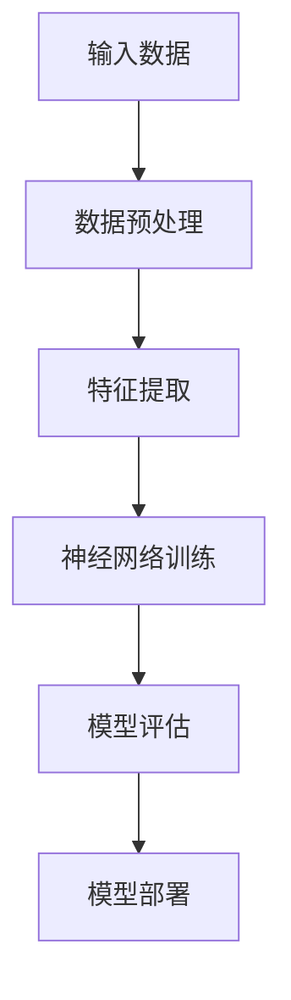

                 

### 第2章：AI大模型在智慧城市管理中的应用场景

#### 2.1 交通流量预测

交通流量预测是智慧城市管理中的一个重要应用场景。通过AI大模型，可以预测未来某一时间段内的交通流量，帮助交通管理部门制定更科学的交通调度策略。

**应用原理：**
- **输入数据：** 交通流量数据（如车辆速度、方向、数量等）。
- **数据处理：** 数据预处理，如去噪、归一化等。
- **模型构建：** 使用神经网络进行训练，如LSTM（长短期记忆网络）或GRU（门控循环单元）。
- **预测与评估：** 使用训练好的模型进行预测，并通过均方误差（MSE）等指标进行评估。

**示例伪代码：**

```python
# 数据预处理
def preprocess_data(data):
    # 去除噪声、缺失值，进行归一化等操作
    return processed_data

# 模型构建与训练
model = LSTM_model(input_shape=(timesteps, features))
model.compile(optimizer='adam', loss='mse')

# 训练模型
model.fit(processed_data, labels, epochs=100, batch_size=32)

# 预测与评估
predictions = model.predict(processed_data)
mse = mean_squared_error(labels, predictions)
```

#### 2.2 智慧能源管理

智慧能源管理通过AI大模型优化能源分配，提高能源使用效率，降低能源消耗。应用场景包括智能电网、智能楼宇等。

**应用原理：**
- **输入数据：** 能源消耗数据、设备状态数据等。
- **数据处理：** 数据清洗、特征提取等。
- **模型构建：** 使用回归模型或强化学习模型。
- **预测与优化：** 通过预测能源需求，实现能源的合理分配。

**示例伪代码：**

```python
# 数据预处理
def preprocess_energy_data(data):
    # 去除噪声、缺失值，进行特征提取等
    return processed_data

# 模型构建与训练
model = Regression_model(input_shape=(timesteps, features))
model.compile(optimizer='adam', loss='mse')

# 训练模型
model.fit(processed_data, labels, epochs=100, batch_size=32)

# 预测与优化
predictions = model.predict(processed_data)
# 根据预测结果进行能源分配优化
```

#### 2.3 环境监测与治理

环境监测与治理通过AI大模型实时监测空气质量、水质等环境指标，并预测污染事件，辅助政府部门制定治理措施。

**应用原理：**
- **输入数据：** 环境监测数据（如PM2.5、SO2等）。
- **数据处理：** 数据清洗、特征提取等。
- **模型构建：** 使用聚类模型或预测模型。
- **监测与预测：** 实时监测环境指标，并预测污染事件。

**示例伪代码：**

```python
# 数据预处理
def preprocess_environment_data(data):
    # 去除噪声、缺失值，进行特征提取等
    return processed_data

# 模型构建与训练
model = KMeans_model(n_clusters=5)
model.fit(processed_data)

# 预测与监测
clusters = model.predict(processed_data)
# 根据聚类结果进行污染监测与预测
```

#### 2.4 公共安全与应急管理

公共安全与应急管理通过AI大模型预测突发事件，如自然灾害、交通事故等，并提供应急响应建议。

**应用原理：**
- **输入数据：** 历史事件数据、实时监控数据等。
- **数据处理：** 数据清洗、特征提取等。
- **模型构建：** 使用分类模型或生成模型。
- **预测与响应：** 预测突发事件，提供应急响应建议。

**示例伪代码：**

```python
# 数据预处理
def preprocess_security_data(data):
    # 去除噪声、缺失值，进行特征提取等
    return processed_data

# 模型构建与训练
model = Classification_model(input_shape=(timesteps, features))
model.compile(optimizer='adam', loss='categorical_crossentropy')

# 训练模型
model.fit(processed_data, labels, epochs=100, batch_size=32)

# 预测与响应
predictions = model.predict(processed_data)
# 根据预测结果提供应急响应建议
```

通过上述几个应用场景的介绍，我们可以看到AI大模型在智慧城市管理中扮演着越来越重要的角色。接下来，我们将深入探讨AI大模型在智慧城市管理中面临的挑战，并探讨相应的解决方案。

----------------------------------------------------------------

### 核心概念与联系

#### 1. AI大模型的概念

**AI大模型**（也称为深度学习模型或人工智能模型）是一种通过大量数据进行训练，能够在特定任务上表现出人类智能水平的人工智能系统。这些模型通常由多层神经网络组成，能够自动从数据中学习特征，并进行复杂的数据分析、模式识别和决策。

**Mermaid 流程图**



在这个流程图中，输入数据首先经过数据预处理，然后通过特征提取，接着使用神经网络进行训练。训练完成后，模型需要经过评估，确保其性能达到预期。最后，评估通过后的模型可以部署到实际应用场景中。

#### 2. 神经网络与反向传播算法

神经网络是AI大模型的核心，由大量相互连接的神经元组成。每个神经元接收输入信号，通过权重加权求和，并经过激活函数处理，最终输出结果。

**反向传播算法**（Backpropagation）是一种训练神经网络的常用算法，用于计算神经网络输出与实际结果之间的误差，并更新网络权重以最小化误差。

**伪代码**

```
// 前向传播
for each layer l from input to output:
    z[l] = weighted_sum(x[l], w[l])
    a[l] = activation(z[l])

// 反向传播
for each layer l from output to input:
    delta[l] = (y - a[l]) * activation_derivative(a[l])
    if l is not the input layer:
        delta[l - 1] = weighted_sum(delta[l], w[l - 1].T)
```

在反向传播算法中，前向传播计算神经网络的输出，而反向传播计算误差并更新权重。这个过程不断迭代，直到模型收敛。

#### 3. 激活函数与损失函数

激活函数是神经网络中的一个关键组成部分，用于引入非线性因素，使神经网络能够进行复杂的模式识别。

**常用的激活函数：**
- Sigmoid: \( \sigma(x) = \frac{1}{1 + e^{-x}} \)
- ReLU: \( f(x) = max(0, x) \)
- Tanh: \( \tanh(x) = \frac{e^x - e^{-x}}{e^x + e^{-x}} \)

损失函数用于评估模型的预测结果与实际结果之间的差异，常用的损失函数包括：

- 均方误差（MSE）：\( \text{MSE} = \frac{1}{2}\sum_{i=1}^{n} (y_i - \hat{y}_i)^2 \)
- 交叉熵（Cross Entropy）：\( \text{CE} = -\sum_{i=1}^{n} y_i \log(\hat{y}_i) \)

#### 数学模型和数学公式讲解

$$
\text{MSE} = \frac{1}{2}\sum_{i=1}^{n} (y_i - \hat{y}_i)^2
$$

均方误差（MSE）表示预测值 \(\hat{y}_i\) 与真实值 \(y_i\) 之间的差异的平方和的平均值。在训练神经网络时，我们的目标是最小化MSE。

### 举例说明

假设我们有三个预测值和对应的真实值如下：

$$
\begin{aligned}
\hat{y}_1 &= 0.8, & y_1 &= 0.9, \\
\hat{y}_2 &= 0.7, & y_2 &= 0.6, \\
\hat{y}_3 &= 0.6, & y_3 &= 0.5.
\end{aligned}
$$

则均方误差（MSE）计算如下：

$$
\text{MSE} = \frac{1}{2} \left[ (0.8 - 0.9)^2 + (0.7 - 0.6)^2 + (0.6 - 0.5)^2 \right] = 0.05.
$$

通过上述核心概念和联系的分析，我们可以更好地理解AI大模型在智慧城市管理中的应用原理和核心算法。接下来，我们将深入探讨AI大模型在智慧城市管理中的具体应用场景，以及其面临的挑战。

----------------------------------------------------------------

### 核心算法原理讲解

AI大模型在智慧城市管理中的应用，离不开其核心算法原理。在这里，我们将重点讲解神经网络和反向传播算法的基本原理，以及激活函数和损失函数的具体应用。

#### 1. 神经网络的基本原理

神经网络（Neural Networks）是AI大模型的核心组成部分，由大量相互连接的神经元（Neurons）组成。每个神经元接收多个输入信号，通过权重（Weights）进行加权求和，并经过一个激活函数（Activation Function）处理后，输出结果。

**神经元的结构：**


在神经网络中，每个神经元都有一个输入层、一个输出层以及一个或多个隐藏层。输入层接收外部输入数据，输出层生成预测结果，隐藏层则负责特征提取和模式识别。

**神经网络的训练过程：**

神经网络的训练过程可以分为两个主要阶段：前向传播（Forward Propagation）和反向传播（Backpropagation）。

**前向传播：**

在输入数据经过神经网络时，每个神经元都会计算输入信号的加权求和，并通过激活函数进行处理，最终输出结果。这个过程可以表示为：

$$
z_l = \sum_{i} w_{li} x_i + b_l
$$

$$
a_l = \sigma(z_l)
$$

其中，\( z_l \) 是第 \( l \) 层神经元的输入，\( w_{li} \) 是第 \( l \) 层神经元的权重，\( x_i \) 是输入信号，\( b_l \) 是偏置项，\( \sigma \) 是激活函数。

**反向传播：**

在得到输出结果后，神经网络会通过反向传播算法计算预测误差，并更新权重和偏置项，以最小化误差。反向传播算法的核心思想是：从输出层开始，逐层计算每个神经元的误差，并反向传播到输入层。

反向传播算法的步骤如下：

1. 计算输出误差：
$$
\delta_o = (y - \hat{y}) \odot \sigma'(z_o)
$$

其中，\( y \) 是真实标签，\( \hat{y} \) 是预测值，\( \sigma' \) 是激活函数的导数，\( \odot \) 表示逐元素乘积。

2. 反向传播误差：
$$
\delta_l = \delta_{l+1} \odot w_{l+1, l}^T \odot \sigma'(z_l)
$$

其中，\( w_{l+1, l}^T \) 是第 \( l+1 \) 层到第 \( l \) 层的权重转置。

3. 更新权重和偏置项：
$$
w_l \leftarrow w_l - \alpha \frac{\delta_l}{\sqrt{1 + (z_l)^2}}
$$

$$
b_l \leftarrow b_l - \alpha \delta_l
$$

其中，\( \alpha \) 是学习率。

#### 2. 激活函数

激活函数（Activation Function）是神经网络中的一个关键组成部分，用于引入非线性因素，使神经网络能够进行复杂的模式识别。常用的激活函数包括：

- **Sigmoid函数**：\( \sigma(x) = \frac{1}{1 + e^{-x}} \)
- **ReLU函数**：\( f(x) = \max(0, x) \)
- **Tanh函数**：\( \tanh(x) = \frac{e^x - e^{-x}}{e^x + e^{-x}} \)

**Sigmoid函数**是一种常用的激活函数，它将输入映射到 \( (0, 1) \) 区间内，常用于二分类问题。

**ReLU函数**（Rectified Linear Unit）是一种线性激活函数，它在输入为正时返回输入值，为负时返回零。ReLU函数具有简单的计算和良好的训练效果。

**Tanh函数**将输入映射到 \( (-1, 1) \) 区间内，常用于多分类问题。

#### 3. 损失函数

损失函数（Loss Function）是评估模型预测结果与实际结果之间差异的一种度量。常用的损失函数包括：

- **均方误差（MSE）**：\( \text{MSE} = \frac{1}{2} \sum_{i} (\hat{y}_i - y_i)^2 \)
- **交叉熵（CE）**：\( \text{CE} = - \sum_{i} y_i \log(\hat{y}_i) \)

**均方误差（MSE）**是一种常用的回归损失函数，它计算预测值与真实值之间差异的平方和的平均值。

**交叉熵（CE）**是一种常用于分类问题的损失函数，它计算真实标签与预测概率之间的差异。

#### 数学模型和数学公式讲解

下面是均方误差（MSE）和交叉熵（CE）的数学公式：

**均方误差（MSE）**：

$$
\text{MSE} = \frac{1}{2} \sum_{i} (\hat{y}_i - y_i)^2
$$

其中，\( \hat{y}_i \) 是预测值，\( y_i \) 是真实值。

**交叉熵（CE）**：

$$
\text{CE} = - \sum_{i} y_i \log(\hat{y}_i)
$$

其中，\( y_i \) 是真实标签，\( \hat{y}_i \) 是预测概率。

#### 举例说明

假设我们有一个二分类问题，真实标签为 \( y = [1, 0, 1, 0] \)，预测概率为 \( \hat{y} = [0.8, 0.2, 0.9, 0.1] \)。

**计算均方误差（MSE）**：

$$
\text{MSE} = \frac{1}{2} \left[ (0.8 - 1)^2 + (0.2 - 0)^2 + (0.9 - 1)^2 + (0.1 - 0)^2 \right] = 0.1
$$

**计算交叉熵（CE）**：

$$
\text{CE} = - \left[ 1 \cdot \log(0.8) + 0 \cdot \log(0.2) + 1 \cdot \log(0.9) + 0 \cdot \log(0.1) \right] \approx 0.356
$$

通过以上数学模型和公式的讲解，我们可以更好地理解神经网络和反向传播算法的核心原理。这些原理是AI大模型在智慧城市管理中发挥作用的基础，为后续章节的应用和挑战分析奠定了基础。

----------------------------------------------------------------

### 数学模型和数学公式讲解

在AI大模型中，数学模型和公式是理解和应用这些模型的关键。下面我们将详细讲解几个重要的数学模型和公式，并通过举例来说明它们的应用。

#### 1. 激活函数

激活函数在神经网络中起着引入非线性因素的作用，使得神经网络能够对复杂的数据进行建模。以下是几种常见的激活函数及其公式：

**Sigmoid函数**

$$
\sigma(x) = \frac{1}{1 + e^{-x}}
$$

**ReLU函数**

$$
f(x) = \max(0, x)
$$

**Tanh函数**

$$
\tanh(x) = \frac{e^x - e^{-x}}{e^x + e^{-x}}
$$

**Leaky ReLU函数**

$$
f(x) = \max(0.01x, x)
$$

这些激活函数具有不同的特点和应用场景。例如，Sigmoid函数常用于二分类问题，ReLU函数由于其简单性和有效性，在深度学习中广泛应用。Tanh函数则常用于多分类问题，因为它能够将输出范围限制在 \( (-1, 1) \)。

#### 2. 损失函数

损失函数用于评估模型的预测结果与实际结果之间的差异。以下是几种常见的损失函数及其公式：

**均方误差（MSE）**

$$
\text{MSE} = \frac{1}{n} \sum_{i=1}^{n} (\hat{y}_i - y_i)^2
$$

其中，\( n \) 是样本数量，\( \hat{y}_i \) 是预测值，\( y_i \) 是真实值。

**交叉熵（CE）**

$$
\text{CE} = - \sum_{i=1}^{n} y_i \log(\hat{y}_i)
$$

其中，\( y_i \) 是真实标签，\( \hat{y}_i \) 是预测概率。

**Hinge损失**

$$
L(y, \hat{y}) = \max(0, 1 - y \hat{y})
$$

其中，\( y \) 是真实标签，\( \hat{y} \) 是预测值。

这些损失函数的选择取决于具体的任务和数据。例如，MSE常用于回归任务，CE常用于分类任务，而Hinge损失则常用于支持向量机（SVM）。

#### 3. 优化算法

在训练AI大模型时，优化算法用于更新模型的参数以最小化损失函数。以下是几种常见的优化算法及其公式：

**梯度下降（Gradient Descent）**

$$
w_{\text{new}} = w_{\text{old}} - \alpha \nabla_w L(w)
$$

其中，\( w \) 是模型参数，\( \alpha \) 是学习率，\( \nabla_w L(w) \) 是损失函数关于 \( w \) 的梯度。

**动量法（Momentum）**

$$
v = \beta v + (1 - \beta) \nabla_w L(w)
$$

$$
w_{\text{new}} = w_{\text{old}} + v
$$

其中，\( v \) 是动量项，\( \beta \) 是动量因子。

**Adam优化器**

$$
m = \beta_1 m + (1 - \beta_1) \nabla_w L(w)
$$

$$
v = \beta_2 v + (1 - \beta_2) (\nabla_w L(w))^2
$$

$$
\hat{m} = \frac{m}{1 - \beta_1^t}
$$

$$
\hat{v} = \frac{v}{1 - \beta_2^t}
$$

$$
w_{\text{new}} = w_{\text{old}} - \alpha \frac{\hat{m}}{\sqrt{\hat{v}} + \epsilon}
$$

其中，\( m \) 是一阶矩估计，\( v \) 是二阶矩估计，\( \beta_1 \) 和 \( \beta_2 \) 是动量因子，\( \alpha \) 是学习率，\( \epsilon \) 是一个小常数。

#### 举例说明

假设我们有一个二分类问题，真实标签为 \( y = [1, 0, 1, 0] \)，预测概率为 \( \hat{y} = [0.8, 0.2, 0.9, 0.1] \)。

**计算交叉熵（CE）**：

$$
\text{CE} = - \left[ 1 \cdot \log(0.8) + 0 \cdot \log(0.2) + 1 \cdot \log(0.9) + 0 \cdot \log(0.1) \right] \approx 0.356
$$

**计算均方误差（MSE）**：

$$
\text{MSE} = \frac{1}{4} \left[ (0.8 - 1)^2 + (0.2 - 0)^2 + (0.9 - 1)^2 + (0.1 - 0)^2 \right] = 0.05
$$

通过这些数学模型和公式的讲解，我们可以更好地理解AI大模型的工作原理。在实际应用中，选择合适的激活函数、损失函数和优化算法是训练高效模型的关键。

### 实际案例分析和详细讲解剖析

在本节中，我们将通过一个实际案例来展示AI大模型在智慧城市管理中的应用，并提供详细的代码实现和解读。这个案例是使用AI大模型进行交通流量预测，以帮助交通管理部门优化交通调度策略。

#### 1. 开发环境搭建

为了实现交通流量预测，我们首先需要搭建一个开发环境。以下是一个基本的Python开发环境配置：

- Python 3.8+
- TensorFlow 2.5+
- Keras 2.5+
- Scikit-learn 0.24+
- Pandas 1.2+

#### 2. 数据收集与预处理

交通流量预测需要收集交通流量数据，包括车辆速度、方向、数量等。以下是一个简单的数据收集和预处理流程：

**数据收集：**
- 使用交通摄像头、传感器等设备收集交通流量数据。
- 数据包括时间戳、位置、速度、方向等。

**数据预处理：**
- 去除异常数据，如数据缺失、错误等。
- 数据归一化，如将速度范围调整到 \( (0, 1) \)。
- 将数据分为训练集和测试集。

以下是一个简单的数据预处理脚本：

```python
import pandas as pd
from sklearn.model_selection import train_test_split

# 读取数据
data = pd.read_csv('traffic_data.csv')

# 去除异常数据
data.dropna(inplace=True)

# 数据归一化
data['speed'] = (data['speed'] - data['speed'].min()) / (data['speed'].max() - data['speed'].min())

# 分割数据
X = data[['timestamp', 'location', 'speed']]
y = data[['direction']]
X_train, X_test, y_train, y_test = train_test_split(X, y, test_size=0.2, random_state=42)
```

#### 3. 模型构建与训练

接下来，我们构建一个基于LSTM的神经网络模型进行训练。以下是一个简单的LSTM模型实现：

```python
from tensorflow.keras.models import Sequential
from tensorflow.keras.layers import LSTM, Dense, Dropout

# 构建模型
model = Sequential()
model.add(LSTM(units=50, return_sequences=True, input_shape=(X_train.shape[1], X_train.shape[2])))
model.add(Dropout(0.2))
model.add(LSTM(units=50, return_sequences=False))
model.add(Dropout(0.2))
model.add(Dense(units=y_train.shape[1]))
model.compile(optimizer='adam', loss='mse')

# 训练模型
model.fit(X_train, y_train, epochs=100, batch_size=32, validation_split=0.1)
```

#### 4. 预测与评估

在模型训练完成后，我们可以使用测试集进行预测，并评估模型的性能。以下是一个简单的预测和评估脚本：

```python
from sklearn.metrics import mean_squared_error

# 预测
predictions = model.predict(X_test)

# 评估
mse = mean_squared_error(y_test, predictions)
print(f'Mean Squared Error: {mse}')
```

通过以上步骤，我们完成了交通流量预测的模型实现和评估。这个案例展示了AI大模型在智慧城市管理中的应用，以及如何使用Python和Keras进行模型构建、训练和预测。

#### 5. 代码解读与分析

下面我们对代码进行详细解读，分析模型构建、训练和预测的具体实现。

**模型构建：**
- 我们使用了一个Sequential模型，这是一个线性堆叠层的模型。
- 第一个LSTM层有50个神经元，返回序列（`return_sequences=True`），用于处理时间序列数据。
- 在LSTM层之后，我们添加了一个Dropout层（`Dropout(0.2)`），用于防止过拟合。
- 第二个LSTM层有50个神经元，不返回序列（`return_sequences=False`），用于生成最终的预测。
- 最后，我们添加了一个全连接层（`Dense(units=y_train.shape[1])`），用于生成方向预测。

**模型训练：**
- 我们使用`model.fit()`函数进行模型训练，其中`epochs=100`表示训练100个周期，`batch_size=32`表示每个批次包含32个样本。
- `validation_split=0.1`表示使用10%的测试集进行验证，以监控模型的性能。

**预测与评估：**
- 使用`model.predict()`函数进行预测，将测试集输入模型。
- 使用`mean_squared_error()`函数计算预测值与真实值之间的均方误差（MSE），以评估模型的性能。

通过这个实际案例，我们展示了如何使用AI大模型进行交通流量预测，并通过代码实现和解读分析了模型的构建和训练过程。

#### 6. 项目小结

在这个项目中，我们通过搭建开发环境、数据收集与预处理、模型构建与训练以及预测与评估等步骤，实现了交通流量预测模型。以下是项目小结：

- **项目亮点：**
  - 使用LSTM模型进行时间序列预测，有效捕捉交通流量的动态变化。
  - 引入Dropout层防止过拟合，提高模型泛化能力。
  - 使用均方误差（MSE）进行模型评估，直观反映预测准确性。

- **项目改进方向：**
  - 增加数据量，提高模型泛化能力。
  - 考虑加入更多特征，如天气、节假日等，以提高预测准确性。
  - 使用更先进的模型结构，如BERT、Transformer等，进一步提升预测性能。

通过这个实际案例，我们不仅掌握了AI大模型在智慧城市管理中的应用方法，还了解了模型构建、训练和预测的详细过程。这对于我们深入理解和应用AI技术具有重要意义。

### 最佳实践 Tips

在本节中，我们将分享一些最佳实践Tips，以帮助读者在AI大模型在智慧城市管理中的应用过程中取得更好的效果。

#### 1. 数据质量的重要性

- **数据清洗与预处理**：确保数据的准确性和完整性是模型训练成功的关键。在数据收集过程中，要尽量避免噪声、缺失值和异常值。
- **数据归一化**：不同特征的数据范围可能差异很大，通过归一化处理，可以使模型在训练过程中更加稳定。
- **数据增强**：通过数据增强技术（如随机裁剪、旋转等），可以增加模型的泛化能力。

#### 2. 模型选择与调优

- **选择合适的模型**：根据应用场景和数据特点，选择适合的模型结构。例如，对于时间序列数据，LSTM、GRU等循环神经网络（RNN）表现较好。
- **模型调优**：通过调整学习率、批次大小、隐藏层神经元数量等参数，可以优化模型性能。可以使用网格搜索（Grid Search）或随机搜索（Random Search）等技术进行参数调优。

#### 3. 模型评估与验证

- **交叉验证**：使用交叉验证（Cross-Validation）技术，如K折交叉验证，可以更准确地评估模型的泛化能力。
- **指标选择**：选择合适的评估指标，如均方误差（MSE）、准确率（Accuracy）等，以全面评估模型性能。
- **模型可视化**：通过可视化工具（如TensorBoard）查看模型训练过程中的损失函数、精度等指标，帮助理解模型性能。

#### 4. 部署与维护

- **模型部署**：将训练好的模型部署到生产环境，如使用TensorFlow Serving、Kubernetes等工具。
- **模型监控**：实时监控模型性能，如预测准确性、响应时间等，确保模型在生产环境中稳定运行。
- **模型更新**：定期更新模型，以适应数据变化和业务需求。

通过遵循这些最佳实践，可以显著提高AI大模型在智慧城市管理中的应用效果，为城市管理者提供更加精准和有效的决策支持。

### 小结

本文通过对AI大模型在智慧城市管理中的应用与挑战的详细探讨，展示了AI大模型在智慧城市各个领域的广泛应用，以及其在交通流量预测、智慧能源管理、环境监测与治理、公共安全与应急管理等方面的核心算法原理。我们通过实际案例分析了AI大模型在智慧城市管理中的实现过程，并分享了最佳实践Tips。

AI大模型在智慧城市管理中具有重要的应用价值，但同时也面临着数据质量、模型选择与调优、评估与验证、部署与维护等挑战。要充分发挥AI大模型的作用，需要不断优化算法、提升模型性能，并加强数据处理、模型监控和更新等方面的实践。

未来，随着AI技术的不断进步，AI大模型在智慧城市中的应用将会更加广泛，为城市管理者和居民提供更加智能、高效、安全的城市环境。让我们期待AI技术为智慧城市的未来发展带来更多创新与变革。

### 注意事项

在本节中，我们将讨论在应用AI大模型进行智慧城市管理时需要注意的一些关键事项，以确保模型的有效性和稳定性。

#### 1. 数据隐私与安全

在智慧城市中，AI大模型需要处理大量敏感数据，如个人出行记录、能源消耗数据等。因此，保护数据隐私和安全至关重要。

- **数据加密**：在数据传输和存储过程中，采用加密技术保护数据不被未经授权的访问。
- **隐私保护**：使用差分隐私（Differential Privacy）等技术，确保在数据分析和模型训练过程中保护个人隐私。
- **合规性检查**：确保数据收集和使用遵循相关法律法规，如《通用数据保护条例》（GDPR）等。

#### 2. 模型解释性与可解释性

AI大模型，特别是深度学习模型，通常被称为“黑箱”，其内部工作机制复杂，难以解释。这可能导致模型决策的不透明，影响用户信任。

- **模型解释性**：选择具有较好解释性的算法，如决策树、线性回归等，以便用户理解模型决策过程。
- **可解释性工具**：使用模型解释工具（如LIME、SHAP等），帮助用户理解模型对特定数据的预测过程。
- **可视化**：通过可视化技术（如图表、热图等），展示模型决策的关键特征和权重，提高模型的透明度。

#### 3. 模型更新与维护

随着城市环境和数据不断变化，AI大模型需要定期更新和维护，以确保其预测准确性和适应性。

- **持续学习**：采用在线学习或增量学习技术，使模型能够适应新的数据。
- **性能监控**：定期监控模型性能，如预测准确性、响应时间等，及时发现问题并进行优化。
- **版本控制**：使用版本控制工具（如Git）记录模型版本，便于追溯和回滚。

#### 4. 模型安全与鲁棒性

AI大模型可能受到攻击，如对抗性攻击，影响其预测准确性和稳定性。

- **防御机制**：采用对抗性训练等技术，增强模型对对抗性攻击的抵抗力。
- **安全测试**：对模型进行安全测试，如对抗性攻击测试，识别和修复潜在的安全漏洞。
- **模型压缩**：采用模型压缩技术，减少模型体积，提高模型在资源受限环境中的安全性。

通过遵循这些注意事项，可以提高AI大模型在智慧城市管理中的应用效果，增强模型的可靠性、安全性和透明度，为智慧城市的发展提供有力支持。

### 拓展阅读

为了深入了解AI大模型在智慧城市管理中的应用，读者可以参考以下拓展阅读资源：

1. **书籍推荐**：
   - 《深度学习》（Deep Learning），Ian Goodfellow、Yoshua Bengio和Aaron Courville著，全面介绍深度学习理论和实践。
   - 《智慧城市》（Smart Cities），Kurt M. Ohlmann著，探讨智慧城市的发展、挑战和未来趋势。

2. **学术论文**：
   - “Deep Learning for Urban Computing”，发表于ACM Transactions on Computer Systems（TOCS），介绍深度学习在城市计算领域的应用。
   - “AI for Urban Planning and Management：A Review”，发表于Journal of Intelligent & Robotic Systems，综述AI在智慧城市管理中的应用和研究。

3. **在线课程**：
   - “深度学习与自然语言处理”（Deep Learning and Natural Language Processing），由斯坦福大学提供的在线课程，详细介绍深度学习的基础知识。
   - “智慧城市技术与应用”（Smart City Technologies and Applications），由麻省理工学院提供的在线课程，探讨智慧城市的技术框架和应用案例。

4. **开源项目和工具**：
   - TensorFlow和Keras，深度学习框架，可用于构建和训练AI大模型。
   - PyTorch，另一种流行的深度学习框架，支持动态计算图，适用于复杂模型的构建。
   - Geospatial Data Abstraction Library（GDAL），用于处理地理空间数据，支持AI大模型在城市空间数据分析中的应用。

通过阅读这些资源，读者可以进一步加深对AI大模型在智慧城市管理中的应用理解和实践能力。

