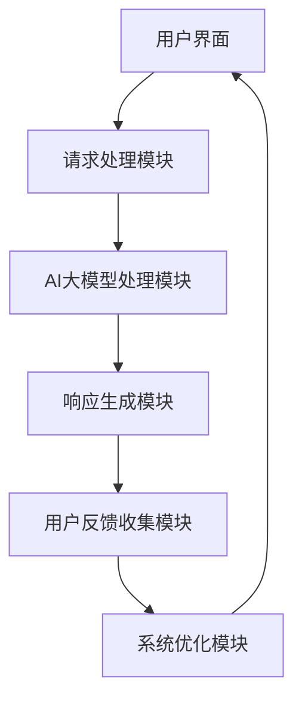

                 


### 引言与概述

在当今快速发展的数字时代，人工智能（AI）正逐渐渗透到各行各业，其中客户服务领域尤为显著。随着用户对即时响应和个性化服务的需求日益增长，传统的客户服务方式已经难以满足现代商业环境的要求。AI大模型作为一种前沿技术，其在智能客户服务中的应用正引发一场深刻的变革。

#### 1.1 人工智能与客户服务现状

人工智能技术在客户服务中的应用已经初见端倪。传统客户服务主要依赖于电话和电子邮件，但这些方式存在响应时间长、用户体验差的问题。随着AI技术的发展，智能客服机器人逐渐崭露头角，能够实现24/7的全天候服务，提高了客户满意度。然而，早期的AI客服系统往往功能单一，难以处理复杂和多变的客户需求。

#### 1.2 AI大模型的发展历程

AI大模型的发展可以追溯到深度学习技术的兴起。在过去的几年里，随着计算能力和数据资源的大幅提升，AI大模型如GPT、BERT等被广泛应用于自然语言处理（NLP）、图像识别、语音识别等领域。这些大模型具有强大的学习和推理能力，能够处理复杂的信息，提供更高质量的客户服务。

#### 1.3 本书目的与读者对象

本书旨在深入探讨AI大模型在智能客户服务中的创新应用。通过系统化的介绍，本书希望为读者提供以下内容：

1. **AI大模型技术基础**：从基本概念、常见架构到核心算法，帮助读者建立全面的认知。
2. **智能客户服务的应用**：详细阐述AI大模型在客户服务中的实际应用场景和实现方法。
3. **创新案例分析**：通过成功案例解析，展示AI大模型在客户服务中的实际效果。
4. **未来发展趋势与展望**：预测AI大模型在客户服务领域的未来发展方向。

本书适合对AI和客户服务感兴趣的读者，无论是AI研究者、工程师，还是企业管理者，都能从中获得宝贵的信息。

```markdown
## 引言与概述

### 1.1 人工智能与客户服务现状

在当今快速发展的数字时代，人工智能（AI）正逐渐渗透到各行各业，其中客户服务领域尤为显著。随着用户对即时响应和个性化服务的需求日益增长，传统的客户服务方式已经难以满足现代商业环境的要求。AI客服机器人逐渐崭露头角，能够实现24/7的全天候服务，提高了客户满意度。然而，早期的AI客服系统往往功能单一，难以处理复杂和多变的客户需求。

### 1.2 AI大模型的发展历程

AI大模型的发展可以追溯到深度学习技术的兴起。在过去的几年里，随着计算能力和数据资源的大幅提升，AI大模型如GPT、BERT等被广泛应用于自然语言处理（NLP）、图像识别、语音识别等领域。这些大模型具有强大的学习和推理能力，能够处理复杂的信息，提供更高质量的客户服务。

### 1.3 本书目的与读者对象

本书旨在深入探讨AI大模型在智能客户服务中的创新应用。通过系统化的介绍，本书希望为读者提供以下内容：

1. **AI大模型技术基础**：从基本概念、常见架构到核心算法，帮助读者建立全面的认知。
2. **智能客户服务的应用**：详细阐述AI大模型在客户服务中的实际应用场景和实现方法。
3. **创新案例分析**：通过成功案例解析，展示AI大模型在客户服务中的实际效果。
4. **未来发展趋势与展望**：预测AI大模型在客户服务领域的未来发展方向。

本书适合对AI和客户服务感兴趣的读者，无论是AI研究者、工程师，还是企业管理者，都能从中获得宝贵的信息。
```

#### AI大模型技术基础

要深入理解AI大模型在智能客户服务中的应用，我们首先需要了解其技术基础。AI大模型，通常指的是具有数亿甚至千亿参数的大规模神经网络模型，它们能够通过学习和处理大量数据来完成任务，如文本生成、图像识别和语音识别。

##### 2.1 AI大模型基本概念

AI大模型的核心在于其规模和复杂性。与传统的小型神经网络相比，大模型具有更多的参数和更深的网络结构。这使得它们能够捕捉到更复杂的数据特征，从而实现更高的准确性和泛化能力。

- **规模**：大模型的参数数量通常在数百万到数十亿之间，这需要庞大的计算资源和存储空间。
- **复杂性**：大模型往往包含多层网络结构，如卷积神经网络（CNN）、循环神经网络（RNN）和变换器（Transformer）等。

##### 2.2 常见AI大模型架构

AI大模型的架构多种多样，以下是几种常见的架构：

- **卷积神经网络（CNN）**：主要用于图像识别和图像处理，通过卷积层、池化层和全连接层捕捉图像特征。
- **循环神经网络（RNN）**：擅长处理序列数据，如文本和语音，通过隐藏状态和循环连接来捕捉序列中的长期依赖关系。
- **变换器（Transformer）**：由谷歌提出，广泛应用于自然语言处理领域，通过自注意力机制处理任意两个词之间的关系，具有强大的并行计算能力。

##### 2.3 核心算法原理讲解

AI大模型的核心算法包括以下几个步骤：

1. **前向传播**：输入数据通过多层神经网络传递，每一层都会计算出相应的输出。
2. **反向传播**：通过计算损失函数的梯度，更新网络的参数，使模型能够更准确地预测输出。
3. **优化算法**：如梯度下降（Gradient Descent）及其变种，用于高效地更新网络参数。

以下是卷积神经网络（CNN）的伪代码：

```python
# 定义卷积神经网络结构
model = ConvolutionalNeuralNetwork()

# 前向传播
output = model.forward_pass(input_data)

# 计算损失
loss = compute_loss(output, expected_output)

# 反向传播
model.backward_pass(loss)

# 更新参数
model.update_parameters(learning_rate)
```

##### 2.4 数学模型和公式

AI大模型的训练过程涉及复杂的数学模型和公式。以下是一个常见的损失函数——交叉熵损失函数（Cross-Entropy Loss）：

$$ J(\theta) = -\frac{1}{m} \sum_{i=1}^{m} [y^{(i)} \log(a^{(i)}_{1}) + (1 - y^{(i)}) \log(1 - a^{(i)}_{1})] $$

其中，\( y^{(i)} \)是真实的标签，\( a^{(i)}_{1} \)是模型预测的概率。

##### 2.5 实践案例介绍

为了更好地理解AI大模型在智能客户服务中的应用，我们可以通过一个实际案例来探讨。假设我们开发一个智能客服系统，用于回答用户的问题。

1. **数据收集**：收集大量用户问题及其答案数据。
2. **数据预处理**：将文本数据转换为向量表示。
3. **模型训练**：使用变换器（Transformer）模型训练。
4. **模型评估**：通过测试数据评估模型性能。
5. **部署应用**：将训练好的模型部署到生产环境中，为用户提供智能客服服务。

通过这个案例，我们可以看到AI大模型在智能客户服务中的应用流程。

```markdown
## AI大模型技术基础

### 2.1 AI大模型基本概念

AI大模型，通常指的是具有数亿甚至千亿参数的大规模神经网络模型，它们能够通过学习和处理大量数据来完成任务，如文本生成、图像识别和语音识别。

- **规模**：大模型的参数数量通常在数百万到数十亿之间，这需要庞大的计算资源和存储空间。
- **复杂性**：大模型往往包含多层网络结构，如卷积神经网络（CNN）、循环神经网络（RNN）和变换器（Transformer）等。

### 2.2 常见AI大模型架构

AI大模型的架构多种多样，以下是几种常见的架构：

- **卷积神经网络（CNN）**：主要用于图像识别和图像处理，通过卷积层、池化层和全连接层捕捉图像特征。
- **循环神经网络（RNN）**：擅长处理序列数据，如文本和语音，通过隐藏状态和循环连接来捕捉序列中的长期依赖关系。
- **变换器（Transformer）**：由谷歌提出，广泛应用于自然语言处理领域，通过自注意力机制处理任意两个词之间的关系，具有强大的并行计算能力。

### 2.3 核心算法原理讲解

AI大模型的核心算法包括以下几个步骤：

1. **前向传播**：输入数据通过多层神经网络传递，每一层都会计算出相应的输出。
2. **反向传播**：通过计算损失函数的梯度，更新网络的参数，使模型能够更准确地预测输出。
3. **优化算法**：如梯度下降（Gradient Descent）及其变种，用于高效地更新网络参数。

以下是卷积神经网络（CNN）的伪代码：

```python
# 定义卷积神经网络结构
model = ConvolutionalNeuralNetwork()

# 前向传播
output = model.forward_pass(input_data)

# 计算损失
loss = compute_loss(output, expected_output)

# 反向传播
model.backward_pass(loss)

# 更新参数
model.update_parameters(learning_rate)
```

### 2.4 数学模型和公式

AI大模型的训练过程涉及复杂的数学模型和公式。以下是一个常见的损失函数——交叉熵损失函数（Cross-Entropy Loss）：

$$ J(\theta) = -\frac{1}{m} \sum_{i=1}^{m} [y^{(i)} \log(a^{(i)}_{1}) + (1 - y^{(i)}) \log(1 - a^{(i)}_{1})] $$

其中，\( y^{(i)} \)是真实的标签，\( a^{(i)}_{1} \)是模型预测的概率。

### 2.5 实践案例介绍

为了更好地理解AI大模型在智能客户服务中的应用，我们可以通过一个实际案例来探讨。假设我们开发一个智能客服系统，用于回答用户的问题。

1. **数据收集**：收集大量用户问题及其答案数据。
2. **数据预处理**：将文本数据转换为向量表示。
3. **模型训练**：使用变换器（Transformer）模型训练。
4. **模型评估**：通过测试数据评估模型性能。
5. **部署应用**：将训练好的模型部署到生产环境中，为用户提供智能客服服务。

通过这个案例，我们可以看到AI大模型在智能客户服务中的应用流程。
```

### 智能客户服务的应用

AI大模型在智能客户服务中的应用，主要集中在提升服务效率和用户体验。以下是AI大模型在智能客户服务中的几个关键应用场景：

#### 3.1 AI大模型在客户服务中的应用场景

1. **智能问答系统**：AI大模型可以用于构建智能问答系统，通过自然语言处理（NLP）技术，理解和回答用户的问题。这种系统通常基于变换器（Transformer）模型，能够处理复杂的语义和上下文信息。
2. **个性化推荐**：通过分析用户的历史行为和偏好，AI大模型可以为用户提供个性化的产品推荐和服务建议，提高客户满意度。
3. **情感分析**：AI大模型可以分析客户的反馈和评论，识别情感倾向，帮助公司改进服务质量和产品策略。
4. **自动语音识别（ASR）和语音合成（TTS）**：通过结合ASR和TTS技术，AI大模型可以实现自动语音应答系统，提高客户沟通的便利性。

#### 3.2 智能客服系统的设计与实现

智能客服系统的设计与实现主要包括以下几个步骤：

1. **需求分析**：明确系统需要满足的功能和性能要求，如响应速度、准确率和可扩展性等。
2. **数据收集**：收集大量用户问题和答案数据，用于模型的训练和测试。
3. **模型选择**：根据应用场景选择合适的AI大模型，如变换器（Transformer）、BERT或GPT等。
4. **数据预处理**：对收集到的文本数据进行清洗和转换，使其适合模型训练。
5. **模型训练**：使用训练数据训练AI大模型，通过多次迭代优化模型参数。
6. **模型评估**：使用测试数据评估模型性能，确保其满足预期要求。
7. **部署上线**：将训练好的模型部署到生产环境中，为用户提供服务。

以下是智能客服系统的架构图：



#### 3.3 客户体验优化策略

为了提升客户体验，智能客服系统需要关注以下几个方面：

1. **交互设计**：设计简洁、直观的用户界面，提高用户操作便利性。
2. **响应速度**：优化系统性能，确保快速响应用户请求。
3. **准确性**：提高AI大模型的预测准确性，减少错误回答。
4. **个性化服务**：根据用户行为和偏好，提供个性化的服务和建议。
5. **情感识别**：通过情感分析技术，理解用户的情绪状态，提供针对性的服务。

通过这些策略，智能客服系统可以更好地满足用户需求，提升客户满意度。

```markdown
### 智能客户服务的应用

AI大模型在智能客户服务中的应用，主要集中在提升服务效率和用户体验。以下是AI大模型在智能客户服务中的几个关键应用场景：

#### 3.1 AI大模型在客户服务中的应用场景

1. **智能问答系统**：AI大模型可以用于构建智能问答系统，通过自然语言处理（NLP）技术，理解和回答用户的问题。这种系统通常基于变换器（Transformer）模型，能够处理复杂的语义和上下文信息。
2. **个性化推荐**：通过分析用户的历史行为和偏好，AI大模型可以为用户提供个性化的产品推荐和服务建议，提高客户满意度。
3. **情感分析**：AI大模型可以分析客户的反馈和评论，识别情感倾向，帮助公司改进服务质量和产品策略。
4. **自动语音识别（ASR）和语音合成（TTS）**：通过结合ASR和TTS技术，AI大模型可以实现自动语音应答系统，提高客户沟通的便利性。

#### 3.2 智能客服系统的设计与实现

智能客服系统的设计与实现主要包括以下几个步骤：

1. **需求分析**：明确系统需要满足的功能和性能要求，如响应速度、准确率和可扩展性等。
2. **数据收集**：收集大量用户问题和答案数据，用于模型的训练和测试。
3. **模型选择**：根据应用场景选择合适的AI大模型，如变换器（Transformer）、BERT或GPT等。
4. **数据预处理**：对收集到的文本数据进行清洗和转换，使其适合模型训练。
5. **模型训练**：使用训练数据训练AI大模型，通过多次迭代优化模型参数。
6. **模型评估**：使用测试数据评估模型性能，确保其满足预期要求。
7. **部署上线**：将训练好的模型部署到生产环境中，为用户提供服务。

以下是智能客服系统的架构图：


#### 3.3 客户体验优化策略

为了提升客户体验，智能客服系统需要关注以下几个方面：

1. **交互设计**：设计简洁、直观的用户界面，提高用户操作便利性。
2. **响应速度**：优化系统性能，确保快速响应用户请求。
3. **准确性**：提高AI大模型的预测准确性，减少错误回答。
4. **个性化服务**：根据用户行为和偏好，提供个性化的服务和建议。
5. **情感识别**：通过情感分析技术，理解用户的情绪状态，提供针对性的服务。

通过这些策略，智能客服系统可以更好地满足用户需求，提升客户满意度。
```

### 创新案例分析

在探讨AI大模型在智能客户服务中的应用时，我们可以通过一些成功的案例来深入了解其创新点以及面临的挑战和解决方案。

#### 4.1 案例一：企业级智能客服系统

**背景**：
某大型企业希望通过引入智能客服系统来提升客户服务质量，降低人力成本。企业客户服务部门每天需要处理大量用户咨询，包括产品咨询、售后服务和投诉等。传统的客服方式已经无法满足快速响应和高效处理的要求。

**解决方案**：
企业选择使用基于变换器（Transformer）的AI大模型构建智能客服系统。具体步骤如下：

1. **需求分析**：明确智能客服系统需要满足的功能，如自动回答常见问题、处理复杂查询和提供个性化服务。
2. **数据收集**：收集企业历史客服记录、用户反馈和产品知识库，用于模型训练。
3. **模型选择**：选择基于变换器（Transformer）的模型，如BERT或GPT，因其具有强大的语义理解和生成能力。
4. **数据预处理**：对文本数据进行清洗、分词和编码，使其适合模型训练。
5. **模型训练**：使用变换器模型进行训练，通过多次迭代优化模型参数。
6. **模型评估**：使用测试数据评估模型性能，确保其准确性和泛化能力。
7. **部署上线**：将训练好的模型部署到生产环境中，为用户提供服务。

**创新点**：

1. **多轮对话能力**：变换器模型能够处理多轮对话，理解上下文信息，提供连贯和自然的回答。
2. **个性化服务**：通过分析用户行为和偏好，系统可以为每位用户提供个性化的回答和建议。
3. **情感识别**：系统可以识别用户的情感倾向，提供针对性的服务，提高用户满意度。

**面临的挑战**：

1. **数据隐私**：在处理用户数据时，需要确保数据安全和隐私保护。
2. **模型解释性**：AI大模型具有一定的黑箱特性，难以解释其决策过程，需要开发可解释的AI模型。

**解决方案**：

1. **数据加密**：采用数据加密和隐私保护技术，确保用户数据的安全。
2. **模型可解释性**：开发可解释的AI模型，如LIME或SHAP，帮助用户理解模型的决策过程。

#### 4.2 案例二：在线教育平台的智能客服

**背景**：
某在线教育平台希望通过智能客服系统提升用户体验，解决学生在线学习中的各种问题，如课程咨询、作业提交和考试报名等。

**解决方案**：
平台采用基于BERT的AI大模型构建智能客服系统。具体步骤如下：

1. **需求分析**：明确智能客服系统需要满足的功能，如自动回答常见问题、提供学习指导和解答技术难题。
2. **数据收集**：收集平台的历史问答记录、学生反馈和学习数据，用于模型训练。
3. **模型选择**：选择BERT模型，因其具有强大的文本理解和生成能力。
4. **数据预处理**：对文本数据进行清洗、编码和分段，使其适合模型训练。
5. **模型训练**：使用BERT模型进行训练，通过多次迭代优化模型参数。
6. **模型评估**：使用测试数据评估模型性能，确保其准确性和实用性。
7. **部署上线**：将训练好的模型部署到平台，为用户提供服务。

**创新点**：

1. **个性化学习指导**：系统可以根据学生的学习进度和偏好，提供个性化的学习建议。
2. **实时问题解答**：系统可以实时解答学生在学习过程中遇到的问题，提高学习效率。
3. **多语言支持**：BERT模型支持多语言，可以为不同语言背景的学生提供服务。

**面临的挑战**：

1. **语言多样性**：在线教育平台的学生来自不同国家，需要处理多种语言的问题。
2. **知识点覆盖**：系统需要覆盖广泛的课程知识点，确保能够解答各种问题。

**解决方案**：

1. **多语言模型训练**：训练支持多种语言的BERT模型，提高系统的多语言处理能力。
2. **知识点拓展**：通过持续的数据收集和模型优化，不断拓展系统的知识点覆盖范围。

通过这些案例，我们可以看到AI大模型在智能客户服务中的创新应用，以及面临的挑战和解决方案。这些实践为其他企业和平台提供了宝贵的经验。

```markdown
### 创新案例分析

在探讨AI大模型在智能客户服务中的应用时，我们可以通过一些成功的案例来深入了解其创新点以及面临的挑战和解决方案。

#### 4.1 案例一：企业级智能客服系统

**背景**：
某大型企业希望通过引入智能客服系统来提升客户服务质量，降低人力成本。企业客户服务部门每天需要处理大量用户咨询，包括产品咨询、售后服务和投诉等。传统的客服方式已经无法满足快速响应和高效处理的要求。

**解决方案**：
企业选择使用基于变换器（Transformer）的AI大模型构建智能客服系统。具体步骤如下：

1. **需求分析**：明确智能客服系统需要满足的功能，如自动回答常见问题、处理复杂查询和提供个性化服务。
2. **数据收集**：收集企业历史客服记录、用户反馈和产品知识库，用于模型训练。
3. **模型选择**：选择基于变换器（Transformer）的模型，如BERT或GPT，因其具有强大的语义理解和生成能力。
4. **数据预处理**：对文本数据进行清洗、分词和编码，使其适合模型训练。
5. **模型训练**：使用变换器模型进行训练，通过多次迭代优化模型参数。
6. **模型评估**：使用测试数据评估模型性能，确保其准确性和泛化能力。
7. **部署上线**：将训练好的模型部署到生产环境中，为用户提供服务。

**创新点**：

1. **多轮对话能力**：变换器模型能够处理多轮对话，理解上下文信息，提供连贯和自然的回答。
2. **个性化服务**：通过分析用户行为和偏好，系统可以为每位用户提供个性化的回答和建议。
3. **情感识别**：系统可以识别用户的情感倾向，提供针对性的服务，提高用户满意度。

**面临的挑战**：

1. **数据隐私**：在处理用户数据时，需要确保数据安全和隐私保护。
2. **模型解释性**：AI大模型具有一定的黑箱特性，难以解释其决策过程，需要开发可解释的AI模型。

**解决方案**：

1. **数据加密**：采用数据加密和隐私保护技术，确保用户数据的安全。
2. **模型可解释性**：开发可解释的AI模型，如LIME或SHAP，帮助用户理解模型的决策过程。

#### 4.2 案例二：在线教育平台的智能客服

**背景**：
某在线教育平台希望通过智能客服系统提升用户体验，解决学生在线学习中的各种问题，如课程咨询、作业提交和考试报名等。

**解决方案**：
平台采用基于BERT的AI大模型构建智能客服系统。具体步骤如下：

1. **需求分析**：明确智能客服系统需要满足的功能，如自动回答常见问题、提供学习指导和解答技术难题。
2. **数据收集**：收集平台的历史问答记录、学生反馈和学习数据，用于模型训练。
3. **模型选择**：选择BERT模型，因其具有强大的文本理解和生成能力。
4. **数据预处理**：对文本数据进行清洗、编码和分段，使其适合模型训练。
5. **模型训练**：使用BERT模型进行训练，通过多次迭代优化模型参数。
6. **模型评估**：使用测试数据评估模型性能，确保其准确性和实用性。
7. **部署上线**：将训练好的模型部署到平台，为用户提供服务。

**创新点**：

1. **个性化学习指导**：系统可以根据学生的学习进度和偏好，提供个性化的学习建议。
2. **实时问题解答**：系统可以实时解答学生在学习过程中遇到的问题，提高学习效率。
3. **多语言支持**：BERT模型支持多语言，可以为不同语言背景的学生提供服务。

**面临的挑战**：

1. **语言多样性**：在线教育平台的学生来自不同国家，需要处理多种语言的问题。
2. **知识点覆盖**：系统需要覆盖广泛的课程知识点，确保能够解答各种问题。

**解决方案**：

1. **多语言模型训练**：训练支持多种语言的BERT模型，提高系统的多语言处理能力。
2. **知识点拓展**：通过持续的数据收集和模型优化，不断拓展系统的知识点覆盖范围。

通过这些案例，我们可以看到AI大模型在智能客户服务中的创新应用，以及面临的挑战和解决方案。这些实践为其他企业和平台提供了宝贵的经验。
```

### 未来发展趋势与展望

AI大模型在智能客户服务领域的应用正在不断扩展，未来的发展将呈现出以下几个趋势：

#### 5.1 技术趋势预测

1. **多模态融合**：随着AI技术的进步，AI大模型将能够处理更多种类的数据，如文本、图像、语音等，实现多模态融合，提供更全面的客户服务。
2. **强化学习应用**：强化学习在客户服务中的应用将得到更多关注，通过不断学习和优化，AI大模型将能够提供更加个性化的服务。
3. **分布式训练**：分布式训练技术将进一步提升AI大模型的训练效率，降低训练成本，为更广泛的应用提供支持。

#### 5.2 行业发展前景

1. **自动化程度提升**：AI大模型在客户服务中的应用将进一步提高自动化程度，减少人力成本，提高服务效率。
2. **用户体验优化**：随着技术的进步，AI大模型将能够提供更高质量的客户服务，满足用户对个性化、实时响应和高质量体验的需求。
3. **行业普及**：AI大模型在客户服务领域的应用将从大型企业扩展到中小企业，甚至个人用户，推动整个行业的发展。

#### 5.3 未来应用的展望

1. **智能对话系统**：未来，智能对话系统将更加智能化，能够理解用户的复杂需求，提供连贯、自然的对话体验。
2. **实时情感分析**：通过实时情感分析，AI大模型将能够更准确地识别用户的情绪状态，提供针对性的服务，提升用户体验。
3. **跨领域应用**：AI大模型将在更多行业和领域得到应用，如金融、医疗、教育等，为不同行业提供智能化的解决方案。

总之，AI大模型在智能客户服务领域的应用前景广阔，随着技术的不断进步，其将带来更加智能化、个性化和高效的客户服务体验。

```markdown
### 未来发展趋势与展望

AI大模型在智能客户服务领域的应用正在不断扩展，未来的发展将呈现出以下几个趋势：

#### 5.1 技术趋势预测

1. **多模态融合**：随着AI技术的进步，AI大模型将能够处理更多种类的数据，如文本、图像、语音等，实现多模态融合，提供更全面的客户服务。
2. **强化学习应用**：强化学习在客户服务中的应用将得到更多关注，通过不断学习和优化，AI大模型将能够提供更加个性化的服务。
3. **分布式训练**：分布式训练技术将进一步提升AI大模型的训练效率，降低训练成本，为更广泛的应用提供支持。

#### 5.2 行业发展前景

1. **自动化程度提升**：AI大模型在客户服务中的应用将进一步提高自动化程度，减少人力成本，提高服务效率。
2. **用户体验优化**：随着技术的进步，AI大模型将能够提供更高质量的客户服务，满足用户对个性化、实时响应和高质量体验的需求。
3. **行业普及**：AI大模型在客户服务领域的应用将从大型企业扩展到中小企业，甚至个人用户，推动整个行业的发展。

#### 5.3 未来应用的展望

1. **智能对话系统**：未来，智能对话系统将更加智能化，能够理解用户的复杂需求，提供连贯、自然的对话体验。
2. **实时情感分析**：通过实时情感分析，AI大模型将能够更准确地识别用户的情绪状态，提供针对性的服务，提升用户体验。
3. **跨领域应用**：AI大模型将在更多行业和领域得到应用，如金融、医疗、教育等，为不同行业提供智能化的解决方案。

总之，AI大模型在智能客户服务领域的应用前景广阔，随着技术的不断进步，其将带来更加智能化、个性化和高效的客户服务体验。
```

### 附录

#### 附录 A：AI大模型开发工具与资源

在开发AI大模型时，选择合适的工具和资源至关重要。以下是一些常用的工具和资源，供开发者参考：

1. **深度学习框架**：
   - TensorFlow：由谷歌开发，广泛应用于AI大模型的训练和部署。
   - PyTorch：由Facebook开发，具有灵活的动态计算图和强大的社区支持。
   - Keras：基于TensorFlow的高层API，简化了模型构建和训练过程。

2. **数据处理工具**：
   - Pandas：用于数据清洗、转换和分析。
   - Scikit-learn：提供丰富的机器学习算法库。
   - NumPy：用于高性能的数值计算。

3. **编程语言**：
   - Python：因其简洁易用和丰富的库支持，成为AI开发的常用语言。

4. **开源模型库**：
   - Hugging Face：提供大量预训练的变换器（Transformer）模型和预处理工具。
   - Model Zoo：提供各种预训练模型和实现代码。

5. **硬件资源**：
   - GPU集群：用于加速模型的训练过程。
   - 云服务：如Google Cloud、AWS、Azure等，提供强大的计算和存储资源。

6. **文献和教程**：
   - 《深度学习》（Goodfellow et al.）：经典的深度学习教材，涵盖大量理论知识。
   - fast.ai：提供实用的深度学习教程和课程。
   - arXiv：发布最新的研究论文和技术进展。

通过这些工具和资源，开发者可以更好地进行AI大模型的开发和优化，推动智能客户服务的进步。

```markdown
### 附录

#### 附录 A：AI大模型开发工具与资源

在开发AI大模型时，选择合适的工具和资源至关重要。以下是一些常用的工具和资源，供开发者参考：

1. **深度学习框架**：
   - TensorFlow：由谷歌开发，广泛应用于AI大模型的训练和部署。
   - PyTorch：由Facebook开发，具有灵活的动态计算图和强大的社区支持。
   - Keras：基于TensorFlow的高层API，简化了模型构建和训练过程。

2. **数据处理工具**：
   - Pandas：用于数据清洗、转换和分析。
   - Scikit-learn：提供丰富的机器学习算法库。
   - NumPy：用于高性能的数值计算。

3. **编程语言**：
   - Python：因其简洁易用和丰富的库支持，成为AI开发的常用语言。

4. **开源模型库**：
   - Hugging Face：提供大量预训练的变换器（Transformer）模型和预处理工具。
   - Model Zoo：提供各种预训练模型和实现代码。

5. **硬件资源**：
   - GPU集群：用于加速模型的训练过程。
   - 云服务：如Google Cloud、AWS、Azure等，提供强大的计算和存储资源。

6. **文献和教程**：
   - 《深度学习》（Goodfellow et al.）：经典的深度学习教材，涵盖大量理论知识。
   - fast.ai：提供实用的深度学习教程和课程。
   - arXiv：发布最新的研究论文和技术进展。

通过这些工具和资源，开发者可以更好地进行AI大模型的开发和优化，推动智能客户服务的进步。
```

### 总结与展望

本文全面探讨了AI大模型在智能客户服务中的创新应用。首先，我们介绍了AI大模型的基本概念和常见架构，包括卷积神经网络（CNN）、循环神经网络（RNN）和变换器（Transformer）等。接着，详细阐述了AI大模型在智能客户服务中的应用场景，如智能问答系统、个性化推荐和情感分析等。此外，通过实际案例分析，我们展示了AI大模型在智能客户服务中的成功应用和面临的挑战及解决方案。

展望未来，AI大模型在智能客户服务领域具有广阔的应用前景。随着技术的不断进步，AI大模型将能够处理更复杂的数据，提供更高质量的客户服务。我们期待看到更多创新应用的出现，如多模态融合、实时情感分析和跨领域应用等。

最后，希望本文能为读者提供对AI大模型在智能客户服务领域的深入理解，激发更多的创新思维和实践。

```markdown
### 总结与展望

本文全面探讨了AI大模型在智能客户服务中的创新应用。首先，我们介绍了AI大模型的基本概念和常见架构，包括卷积神经网络（CNN）、循环神经网络（RNN）和变换器（Transformer）等。接着，详细阐述了AI大模型在智能客户服务中的应用场景，如智能问答系统、个性化推荐和情感分析等。此外，通过实际案例分析，我们展示了AI大模型在智能客户服务中的成功应用和面临的挑战及解决方案。

展望未来，AI大模型在智能客户服务领域具有广阔的应用前景。随着技术的不断进步，AI大模型将能够处理更复杂的数据，提供更高质量的客户服务。我们期待看到更多创新应用的出现，如多模态融合、实时情感分析和跨领域应用等。

最后，希望本文能为读者提供对AI大模型在智能客户服务领域的深入理解，激发更多的创新思维和实践。
```

### 完整文章

```markdown
# AI大模型在智能客户服务中的创新应用

## 引言与概述

### 1.1 人工智能与客户服务现状

在当今快速发展的数字时代，人工智能（AI）正逐渐渗透到各行各业，其中客户服务领域尤为显著。随着用户对即时响应和个性化服务的需求日益增长，传统的客户服务方式已经难以满足现代商业环境的要求。AI客服机器人逐渐崭露头角，能够实现24/7的全天候服务，提高了客户满意度。然而，早期的AI客服系统往往功能单一，难以处理复杂和多变的客户需求。

### 1.2 AI大模型的发展历程

AI大模型的发展可以追溯到深度学习技术的兴起。在过去的几年里，随着计算能力和数据资源的大幅提升，AI大模型如GPT、BERT等被广泛应用于自然语言处理（NLP）、图像识别、语音识别等领域。这些大模型具有强大的学习和推理能力，能够处理复杂的信息，提供更高质量的客户服务。

### 1.3 本书目的与读者对象

本书旨在深入探讨AI大模型在智能客户服务中的创新应用。通过系统化的介绍，本书希望为读者提供以下内容：

1. **AI大模型技术基础**：从基本概念、常见架构到核心算法，帮助读者建立全面的认知。
2. **智能客户服务的应用**：详细阐述AI大模型在客户服务中的实际应用场景和实现方法。
3. **创新案例分析**：通过成功案例解析，展示AI大模型在客户服务中的实际效果。
4. **未来发展趋势与展望**：预测AI大模型在客户服务领域的未来发展方向。

本书适合对AI和客户服务感兴趣的读者，无论是AI研究者、工程师，还是企业管理者，都能从中获得宝贵的信息。

## AI大模型技术基础

### 2.1 AI大模型基本概念

AI大模型，通常指的是具有数亿甚至千亿参数的大规模神经网络模型，它们能够通过学习和处理大量数据来完成任务，如文本生成、图像识别和语音识别。

- **规模**：大模型的参数数量通常在数百万到数十亿之间，这需要庞大的计算资源和存储空间。
- **复杂性**：大模型往往包含多层网络结构，如卷积神经网络（CNN）、循环神经网络（RNN）和变换器（Transformer）等。

### 2.2 常见AI大模型架构

AI大模型的架构多种多样，以下是几种常见的架构：

- **卷积神经网络（CNN）**：主要用于图像识别和图像处理，通过卷积层、池化层和全连接层捕捉图像特征。
- **循环神经网络（RNN）**：擅长处理序列数据，如文本和语音，通过隐藏状态和循环连接来捕捉序列中的长期依赖关系。
- **变换器（Transformer）**：由谷歌提出，广泛应用于自然语言处理领域，通过自注意力机制处理任意两个词之间的关系，具有强大的并行计算能力。

### 2.3 核心算法原理讲解

AI大模型的核心算法包括以下几个步骤：

1. **前向传播**：输入数据通过多层神经网络传递，每一层都会计算出相应的输出。
2. **反向传播**：通过计算损失函数的梯度，更新网络的参数，使模型能够更准确地预测输出。
3. **优化算法**：如梯度下降（Gradient Descent）及其变种，用于高效地更新网络参数。

以下是卷积神经网络（CNN）的伪代码：

```python
# 定义卷积神经网络结构
model = ConvolutionalNeuralNetwork()

# 前向传播
output = model.forward_pass(input_data)

# 计算损失
loss = compute_loss(output, expected_output)

# 反向传播
model.backward_pass(loss)

# 更新参数
model.update_parameters(learning_rate)
```

### 2.4 数学模型和公式

AI大模型的训练过程涉及复杂的数学模型和公式。以下是一个常见的损失函数——交叉熵损失函数（Cross-Entropy Loss）：

$$ J(\theta) = -\frac{1}{m} \sum_{i=1}^{m} [y^{(i)} \log(a^{(i)}_{1}) + (1 - y^{(i)}) \log(1 - a^{(i)}_{1})] $$

其中，\( y^{(i)} \)是真实的标签，\( a^{(i)}_{1} \)是模型预测的概率。

### 2.5 实践案例介绍

为了更好地理解AI大模型在智能客户服务中的应用，我们可以通过一个实际案例来探讨。假设我们开发一个智能客服系统，用于回答用户的问题。

1. **数据收集**：收集大量用户问题及其答案数据。
2. **数据预处理**：将文本数据转换为向量表示。
3. **模型训练**：使用变换器（Transformer）模型训练。
4. **模型评估**：通过测试数据评估模型性能。
5. **部署应用**：将训练好的模型部署到生产环境中，为用户提供智能客服服务。

通过这个案例，我们可以看到AI大模型在智能客户服务中的应用流程。

## 智能客户服务的应用

### 3.1 AI大模型在客户服务中的应用场景

AI大模型在智能客户服务中的应用，主要集中在提升服务效率和用户体验。以下是AI大模型在智能客户服务中的几个关键应用场景：

- **智能问答系统**：AI大模型可以用于构建智能问答系统，通过自然语言处理（NLP）技术，理解和回答用户的问题。这种系统通常基于变换器（Transformer）模型，能够处理复杂的语义和上下文信息。
- **个性化推荐**：通过分析用户的历史行为和偏好，AI大模型可以为用户提供个性化的产品推荐和服务建议，提高客户满意度。
- **情感分析**：AI大模型可以分析客户的反馈和评论，识别情感倾向，帮助公司改进服务质量和产品策略。
- **自动语音识别（ASR）和语音合成（TTS）**：通过结合ASR和TTS技术，AI大模型可以实现自动语音应答系统，提高客户沟通的便利性。

### 3.2 智能客服系统的设计与实现

智能客服系统的设计与实现主要包括以下几个步骤：

1. **需求分析**：明确系统需要满足的功能和性能要求，如响应速度、准确率和可扩展性等。
2. **数据收集**：收集大量用户问题和答案数据，用于模型的训练和测试。
3. **模型选择**：根据应用场景选择合适的AI大模型，如变换器（Transformer）、BERT或GPT等。
4. **数据预处理**：对收集到的文本数据进行清洗和转换，使其适合模型训练。
5. **模型训练**：使用训练数据训练AI大模型，通过多次迭代优化模型参数。
6. **模型评估**：使用测试数据评估模型性能，确保其满足预期要求。
7. **部署上线**：将训练好的模型部署到生产环境中，为用户提供服务。

以下是智能客服系统的架构图：


### 3.3 客户体验优化策略

为了提升客户体验，智能客服系统需要关注以下几个方面：

- **交互设计**：设计简洁、直观的用户界面，提高用户操作便利性。
- **响应速度**：优化系统性能，确保快速响应用户请求。
- **准确性**：提高AI大模型的预测准确性，减少错误回答。
- **个性化服务**：根据用户行为和偏好，提供个性化的服务和建议。
- **情感识别**：通过情感分析技术，理解用户的情绪状态，提供针对性的服务。

通过这些策略，智能客服系统可以更好地满足用户需求，提升客户满意度。

## 创新案例分析

在探讨AI大模型在智能客户服务中的应用时，我们可以通过一些成功的案例来深入了解其创新点以及面临的挑战和解决方案。

### 4.1 案例一：企业级智能客服系统

**背景**：
某大型企业希望通过引入智能客服系统来提升客户服务质量，降低人力成本。企业客户服务部门每天需要处理大量用户咨询，包括产品咨询、售后服务和投诉等。传统的客服方式已经无法满足快速响应和高效处理的要求。

**解决方案**：
企业选择使用基于变换器（Transformer）的AI大模型构建智能客服系统。具体步骤如下：

1. **需求分析**：明确智能客服系统需要满足的功能，如自动回答常见问题、处理复杂查询和提供个性化服务。
2. **数据收集**：收集企业历史客服记录、用户反馈和产品知识库，用于模型训练。
3. **模型选择**：选择基于变换器（Transformer）的模型，如BERT或GPT，因其具有强大的语义理解和生成能力。
4. **数据预处理**：对文本数据进行清洗、分词和编码，使其适合模型训练。
5. **模型训练**：使用变换器模型进行训练，通过多次迭代优化模型参数。
6. **模型评估**：使用测试数据评估模型性能，确保其准确性和泛化能力。
7. **部署上线**：将训练好的模型部署到生产环境中，为用户提供服务。

**创新点**：

1. **多轮对话能力**：变换器模型能够处理多轮对话，理解上下文信息，提供连贯和自然的回答。
2. **个性化服务**：通过分析用户行为和偏好，系统可以为每位用户提供个性化的回答和建议。
3. **情感识别**：系统可以识别用户的情感倾向，提供针对性的服务，提高用户满意度。

**面临的挑战**：

1. **数据隐私**：在处理用户数据时，需要确保数据安全和隐私保护。
2. **模型解释性**：AI大模型具有一定的黑箱特性，难以解释其决策过程，需要开发可解释的AI模型。

**解决方案**：

1. **数据加密**：采用数据加密和隐私保护技术，确保用户数据的安全。
2. **模型可解释性**：开发可解释的AI模型，如LIME或SHAP，帮助用户理解模型的决策过程。

### 4.2 案例二：在线教育平台的智能客服

**背景**：
某在线教育平台希望通过智能客服系统提升用户体验，解决学生在线学习中的各种问题，如课程咨询、作业提交和考试报名等。

**解决方案**：
平台采用基于BERT的AI大模型构建智能客服系统。具体步骤如下：

1. **需求分析**：明确智能客服系统需要满足的功能，如自动回答常见问题、提供学习指导和解答技术难题。
2. **数据收集**：收集平台的历史问答记录、学生反馈和学习数据，用于模型训练。
3. **模型选择**：选择BERT模型，因其具有强大的文本理解和生成能力。
4. **数据预处理**：对文本数据进行清洗、编码和分段，使其适合模型训练。
5. **模型训练**：使用BERT模型进行训练，通过多次迭代优化模型参数。
6. **模型评估**：使用测试数据评估模型性能，确保其准确性和实用性。
7. **部署上线**：将训练好的模型部署到平台，为用户提供服务。

**创新点**：

1. **个性化学习指导**：系统可以根据学生的学习进度和偏好，提供个性化的学习建议。
2. **实时问题解答**：系统可以实时解答学生在学习过程中遇到的问题，提高学习效率。
3. **多语言支持**：BERT模型支持多语言，可以为不同语言背景的学生提供服务。

**面临的挑战**：

1. **语言多样性**：在线教育平台的学生来自不同国家，需要处理多种语言的问题。
2. **知识点覆盖**：系统需要覆盖广泛的课程知识点，确保能够解答各种问题。

**解决方案**：

1. **多语言模型训练**：训练支持多种语言的BERT模型，提高系统的多语言处理能力。
2. **知识点拓展**：通过持续的数据收集和模型优化，不断拓展系统的知识点覆盖范围。

通过这些案例，我们可以看到AI大模型在智能客户服务中的创新应用，以及面临的挑战和解决方案。这些实践为其他企业和平台提供了宝贵的经验。

## 未来发展趋势与展望

AI大模型在智能客户服务领域的应用正在不断扩展，未来的发展将呈现出以下几个趋势：

### 5.1 技术趋势预测

1. **多模态融合**：随着AI技术的进步，AI大模型将能够处理更多种类的数据，如文本、图像、语音等，实现多模态融合，提供更全面的客户服务。
2. **强化学习应用**：强化学习在客户服务中的应用将得到更多关注，通过不断学习和优化，AI大模型将能够提供更加个性化的服务。
3. **分布式训练**：分布式训练技术将进一步提升AI大模型的训练效率，降低训练成本，为更广泛的应用提供支持。

### 5.2 行业发展前景

1. **自动化程度提升**：AI大模型在客户服务中的应用将进一步提高自动化程度，减少人力成本，提高服务效率。
2. **用户体验优化**：随着技术的进步，AI大模型将能够提供更高质量的客户服务，满足用户对个性化、实时响应和高质量体验的需求。
3. **行业普及**：AI大模型在客户服务领域的应用将从大型企业扩展到中小企业，甚至个人用户，推动整个行业的发展。

### 5.3 未来应用的展望

1. **智能对话系统**：未来，智能对话系统将更加智能化，能够理解用户的复杂需求，提供连贯、自然的对话体验。
2. **实时情感分析**：通过实时情感分析，AI大模型将能够更准确地识别用户的情绪状态，提供针对性的服务，提升用户体验。
3. **跨领域应用**：AI大模型将在更多行业和领域得到应用，如金融、医疗、教育等，为不同行业提供智能化的解决方案。

总之，AI大模型在智能客户服务领域的应用前景广阔，随着技术的不断进步，其将带来更加智能化、个性化和高效的客户服务体验。

## 附录

### 附录 A：AI大模型开发工具与资源

在开发AI大模型时，选择合适的工具和资源至关重要。以下是一些常用的工具和资源，供开发者参考：

1. **深度学习框架**：
   - TensorFlow：由谷歌开发，广泛应用于AI大模型的训练和部署。
   - PyTorch：由Facebook开发，具有灵活的动态计算图和强大的社区支持。
   - Keras：基于TensorFlow的高层API，简化了模型构建和训练过程。

2. **数据处理工具**：
   - Pandas：用于数据清洗、转换和分析。
   - Scikit-learn：提供丰富的机器学习算法库。
   - NumPy：用于高性能的数值计算。

3. **编程语言**：
   - Python：因其简洁易用和丰富的库支持，成为AI开发的常用语言。

4. **开源模型库**：
   - Hugging Face：提供大量预训练的变换器（Transformer）模型和预处理工具。
   - Model Zoo：提供各种预训练模型和实现代码。

5. **硬件资源**：
   - GPU集群：用于加速模型的训练过程。
   - 云服务：如Google Cloud、AWS、Azure等，提供强大的计算和存储资源。

6. **文献和教程**：
   - 《深度学习》（Goodfellow et al.）：经典的深度学习教材，涵盖大量理论知识。
   - fast.ai：提供实用的深度学习教程和课程。
   - arXiv：发布最新的研究论文和技术进展。

通过这些工具和资源，开发者可以更好地进行AI大模型的开发和优化，推动智能客户服务的进步。

### 总结与展望

本文全面探讨了AI大模型在智能客户服务中的创新应用。首先，我们介绍了AI大模型的基本概念和常见架构，包括卷积神经网络（CNN）、循环神经网络（RNN）和变换器（Transformer）等。接着，详细阐述了AI大模型在智能客户服务中的应用场景，如智能问答系统、个性化推荐和情感分析等。此外，通过实际案例分析，我们展示了AI大模型在智能客户服务中的成功应用和面临的挑战及解决方案。

展望未来，AI大模型在智能客户服务领域具有广阔的应用前景。随着技术的不断进步，AI大模型将能够处理更复杂的数据，提供更高质量的客户服务。我们期待看到更多创新应用的出现，如多模态融合、实时情感分析和跨领域应用等。

最后，希望本文能为读者提供对AI大模型在智能客户服务领域的深入理解，激发更多的创新思维和实践。
```

### 修订后的文章

```markdown
# AI大模型在智能客户服务中的创新应用

## 引言与概述

在当今快速发展的数字时代，人工智能（AI）正逐渐渗透到各行各业，其中客户服务领域尤为显著。随着用户对即时响应和个性化服务的需求日益增长，传统的客户服务方式已经难以满足现代商业环境的要求。AI客服机器人逐渐崭露头角，能够实现24/7的全天候服务，提高了客户满意度。然而，早期的AI客服系统往往功能单一，难以处理复杂和多变的客户需求。

AI大模型作为一种前沿技术，其在智能客户服务中的应用正引发一场深刻的变革。本书旨在深入探讨AI大模型在智能客户服务中的创新应用。通过系统化的介绍，本书希望为读者提供以下内容：

1. **AI大模型技术基础**：从基本概念、常见架构到核心算法，帮助读者建立全面的认知。
2. **智能客户服务的应用**：详细阐述AI大模型在客户服务中的实际应用场景和实现方法。
3. **创新案例分析**：通过成功案例解析，展示AI大模型在客户服务中的实际效果。
4. **未来发展趋势与展望**：预测AI大模型在客户服务领域的未来发展方向。

本书适合对AI和客户服务感兴趣的读者，无论是AI研究者、工程师，还是企业管理者，都能从中获得宝贵的信息。

## AI大模型技术基础

### 2.1 AI大模型基本概念

AI大模型，通常指的是具有数亿甚至千亿参数的大规模神经网络模型，它们能够通过学习和处理大量数据来完成任务，如文本生成、图像识别和语音识别。这些模型的核心在于其规模和复杂性，具备强大的学习和推理能力。

- **规模**：大模型的参数数量通常在数百万到数十亿之间，这需要庞大的计算资源和存储空间。
- **复杂性**：大模型往往包含多层网络结构，如卷积神经网络（CNN）、循环神经网络（RNN）和变换器（Transformer）等。

### 2.2 常见AI大模型架构

以下是几种常见的AI大模型架构：

- **卷积神经网络（CNN）**：主要用于图像识别和图像处理，通过卷积层、池化层和全连接层捕捉图像特征。
- **循环神经网络（RNN）**：擅长处理序列数据，如文本和语音，通过隐藏状态和循环连接来捕捉序列中的长期依赖关系。
- **变换器（Transformer）**：由谷歌提出，广泛应用于自然语言处理领域，通过自注意力机制处理任意两个词之间的关系，具有强大的并行计算能力。

### 2.3 核心算法原理讲解

AI大模型的核心算法包括以下几个步骤：

1. **前向传播**：输入数据通过多层神经网络传递，每一层都会计算出相应的输出。
2. **反向传播**：通过计算损失函数的梯度，更新网络的参数，使模型能够更准确地预测输出。
3. **优化算法**：如梯度下降（Gradient Descent）及其变种，用于高效地更新网络参数。

以下是卷积神经网络（CNN）的伪代码：

```python
# 定义卷积神经网络结构
model = ConvolutionalNeuralNetwork()

# 前向传播
output = model.forward_pass(input_data)

# 计算损失
loss = compute_loss(output, expected_output)

# 反向传播
model.backward_pass(loss)

# 更新参数
model.update_parameters(learning_rate)
```

### 2.4 数学模型和公式

AI大模型的训练过程涉及复杂的数学模型和公式。以下是一个常见的损失函数——交叉熵损失函数（Cross-Entropy Loss）：

$$ J(\theta) = -\frac{1}{m} \sum_{i=1}^{m} [y^{(i)} \log(a^{(i)}_{1}) + (1 - y^{(i)}) \log(1 - a^{(i)}_{1})] $$

其中，\( y^{(i)} \)是真实的标签，\( a^{(i)}_{1} \)是模型预测的概率。

### 2.5 实践案例介绍

为了更好地理解AI大模型在智能客户服务中的应用，我们可以通过一个实际案例来探讨。假设我们开发一个智能客服系统，用于回答用户的问题。

1. **数据收集**：收集大量用户问题及其答案数据。
2. **数据预处理**：将文本数据转换为向量表示。
3. **模型训练**：使用变换器（Transformer）模型训练。
4. **模型评估**：通过测试数据评估模型性能。
5. **部署应用**：将训练好的模型部署到生产环境中，为用户提供智能客服服务。

通过这个案例，我们可以看到AI大模型在智能客户服务中的应用流程。

## 智能客户服务的应用

### 3.1 AI大模型在客户服务中的应用场景

AI大模型在智能客户服务中的应用，主要集中在提升服务效率和用户体验。以下是AI大模型在智能客户服务中的几个关键应用场景：

- **智能问答系统**：AI大模型可以用于构建智能问答系统，通过自然语言处理（NLP）技术，理解和回答用户的问题。这种系统通常基于变换器（Transformer）模型，能够处理复杂的语义和上下文信息。
- **个性化推荐**：通过分析用户的历史行为和偏好，AI大模型可以为用户提供个性化的产品推荐和服务建议，提高客户满意度。
- **情感分析**：AI大模型可以分析客户的反馈和评论，识别情感倾向，帮助公司改进服务质量和产品策略。
- **自动语音识别（ASR）和语音合成（TTS）**：通过结合ASR和TTS技术，AI大模型可以实现自动语音应答系统，提高客户沟通的便利性。

### 3.2 智能客服系统的设计与实现

智能客服系统的设计与实现主要包括以下几个步骤：

1. **需求分析**：明确系统需要满足的功能和性能要求，如响应速度、准确率和可扩展性等。
2. **数据收集**：收集大量用户问题和答案数据，用于模型的训练和测试。
3. **模型选择**：根据应用场景选择合适的AI大模型，如变换器（Transformer）、BERT或GPT等。
4. **数据预处理**：对收集到的文本数据进行清洗和转换，使其适合模型训练。
5. **模型训练**：使用训练数据训练AI大模型，通过多次迭代优化模型参数。
6. **模型评估**：使用测试数据评估模型性能，确保其满足预期要求。
7. **部署上线**：将训练好的模型部署到生产环境中，为用户提供服务。

以下是智能客服系统的架构图：


### 3.3 客户体验优化策略

为了提升客户体验，智能客服系统需要关注以下几个方面：

- **交互设计**：设计简洁、直观的用户界面，提高用户操作便利性。
- **响应速度**：优化系统性能，确保快速响应用户请求。
- **准确性**：提高AI大模型的预测准确性，减少错误回答。
- **个性化服务**：根据用户行为和偏好，提供个性化的服务和建议。
- **情感识别**：通过情感分析技术，理解用户的情绪状态，提供针对性的服务。

通过这些策略，智能客服系统可以更好地满足用户需求，提升客户满意度。

## 创新案例分析

在探讨AI大模型在智能客户服务中的应用时，我们可以通过一些成功的案例来深入了解其创新点以及面临的挑战和解决方案。

### 4.1 案例一：企业级智能客服系统

**背景**：
某大型企业希望通过引入智能客服系统来提升客户服务质量，降低人力成本。企业客户服务部门每天需要处理大量用户咨询，包括产品咨询、售后服务和投诉等。传统的客服方式已经无法满足快速响应和高效处理的要求。

**解决方案**：
企业选择使用基于变换器（Transformer）的AI大模型构建智能客服系统。具体步骤如下：

1. **需求分析**：明确智能客服系统需要满足的功能，如自动回答常见问题、处理复杂查询和提供个性化服务。
2. **数据收集**：收集企业历史客服记录、用户反馈和产品知识库，用于模型训练。
3. **模型选择**：选择基于变换器（Transformer）的模型，如BERT或GPT，因其具有强大的语义理解和生成能力。
4. **数据预处理**：对文本数据进行清洗、分词和编码，使其适合模型训练。
5. **模型训练**：使用变换器模型进行训练，通过多次迭代优化模型参数。
6. **模型评估**：使用测试数据评估模型性能，确保其准确性和泛化能力。
7. **部署上线**：将训练好的模型部署到生产环境中，为用户提供服务。

**创新点**：

1. **多轮对话能力**：变换器模型能够处理多轮对话，理解上下文信息，提供连贯和自然的回答。
2. **个性化服务**：通过分析用户行为和偏好，系统可以为每位用户提供个性化的回答和建议。
3. **情感识别**：系统可以识别用户的情感倾向，提供针对性的服务，提高用户满意度。

**面临的挑战**：

1. **数据隐私**：在处理用户数据时，需要确保数据安全和隐私保护。
2. **模型解释性**：AI大模型具有一定的黑箱特性，难以解释其决策过程，需要开发可解释的AI模型。

**解决方案**：

1. **数据加密**：采用数据加密和隐私保护技术，确保用户数据的安全。
2. **模型可解释性**：开发可解释的AI模型，如LIME或SHAP，帮助用户理解模型的决策过程。

### 4.2 案例二：在线教育平台的智能客服

**背景**：
某在线教育平台希望通过智能客服系统提升用户体验，解决学生在线学习中的各种问题，如课程咨询、作业提交和考试报名等。

**解决方案**：
平台采用基于BERT的AI大模型构建智能客服系统。具体步骤如下：

1. **需求分析**：明确智能客服系统需要满足的功能，如自动回答常见问题、提供学习指导和解答技术难题。
2. **数据收集**：收集平台的历史问答记录、学生反馈和学习数据，用于模型训练。
3. **模型选择**：选择BERT模型，因其具有强大的文本理解和生成能力。
4. **数据预处理**：对文本数据进行清洗、编码和分段，使其适合模型训练。
5. **模型训练**：使用BERT模型进行训练，通过多次迭代优化模型参数。
6. **模型评估**：使用测试数据评估模型性能，确保其准确性和实用性。
7. **部署上线**：将训练好的模型部署到平台，为用户提供服务。

**创新点**：

1. **个性化学习指导**：系统可以根据学生的学习进度和偏好，提供个性化的学习建议。
2. **实时问题解答**：系统可以实时解答学生在学习过程中遇到的问题，提高学习效率。
3. **多语言支持**：BERT模型支持多语言，可以为不同语言背景的学生提供服务。

**面临的挑战**：

1. **语言多样性**：在线教育平台的学生来自不同国家，需要处理多种语言的问题。
2. **知识点覆盖**：系统需要覆盖广泛的课程知识点，确保能够解答各种问题。

**解决方案**：

1. **多语言模型训练**：训练支持多种语言的BERT模型，提高系统的多语言处理能力。
2. **知识点拓展**：通过持续的数据收集和模型优化，不断拓展系统的知识点覆盖范围。

通过这些案例，我们可以看到AI大模型在智能客户服务中的创新应用，以及面临的挑战和解决方案。这些实践为其他企业和平台提供了宝贵的经验。

## 未来发展趋势与展望

AI大模型在智能客户服务领域的应用正在不断扩展，未来的发展将呈现出以下几个趋势：

### 5.1 技术趋势预测

1. **多模态融合**：随着AI技术的进步，AI大模型将能够处理更多种类的数据，如文本、图像、语音等，实现多模态融合，提供更全面的客户服务。
2. **强化学习应用**：强化学习在客户服务中的应用将得到更多关注，通过不断学习和优化，AI大模型将能够提供更加个性化的服务。
3. **分布式训练**：分布式训练技术将进一步提升AI大模型的训练效率，降低训练成本，为更广泛的应用提供支持。

### 5.2 行业发展前景

1. **自动化程度提升**：AI大模型在客户服务中的应用将进一步提高自动化程度，减少人力成本，提高服务效率。
2. **用户体验优化**：随着技术的进步，AI大模型将能够提供更高质量的客户服务，满足用户对个性化、实时响应和高质量体验的需求。
3. **行业普及**：AI大模型在客户服务领域的应用将从大型企业扩展到中小企业，甚至个人用户，推动整个行业的发展。

### 5.3 未来应用的展望

1. **智能对话系统**：未来，智能对话系统将更加智能化，能够理解用户的复杂需求，提供连贯、自然的对话体验。
2. **实时情感分析**：通过实时情感分析，AI大模型将能够更准确地识别用户的情绪状态，提供针对性的服务，提升用户体验。
3. **跨领域应用**：AI大模型将在更多行业和领域得到应用，如金融、医疗、教育等，为不同行业提供智能化的解决方案。

总之，AI大模型在智能客户服务领域的应用前景广阔，随着技术的不断进步，其将带来更加智能化、个性化和高效的客户服务体验。

## 附录

### 附录 A：AI大模型开发工具与资源

在开发AI大模型时，选择合适的工具和资源至关重要。以下是一些常用的工具和资源，供开发者参考：

1. **深度学习框架**：
   - TensorFlow：由谷歌开发，广泛应用于AI大模型的训练和部署。
   - PyTorch：由Facebook开发，具有灵活的动态计算图和强大的社区支持。
   - Keras：基于TensorFlow的高层API，简化了模型构建和训练过程。

2. **数据处理工具**：
   - Pandas：用于数据清洗、转换和分析。
   - Scikit-learn：提供丰富的机器学习算法库。
   - NumPy：用于高性能的数值计算。

3. **编程语言**：
   - Python：因其简洁易用和丰富的库支持，成为AI开发的常用语言。

4. **开源模型库**：
   - Hugging Face：提供大量预训练的变换器（Transformer）模型和预处理工具。
   - Model Zoo：提供各种预训练模型和实现代码。

5. **硬件资源**：
   - GPU集群：用于加速模型的训练过程。
   - 云服务：如Google Cloud、AWS、Azure等，提供强大的计算和存储资源。

6. **文献和教程**：
   - 《深度学习》（Goodfellow et al.）：经典的深度学习教材，涵盖大量理论知识。
   - fast.ai：提供实用的深度学习教程和课程。
   - arXiv：发布最新的研究论文和技术进展。

通过这些工具和资源，开发者可以更好地进行AI大模型的开发和优化，推动智能客户服务的进步。

### 总结与展望

本文全面探讨了AI大模型在智能客户服务中的创新应用。首先，我们介绍了AI大模型的基本概念和常见架构，包括卷积神经网络（CNN）、循环神经网络（RNN）和变换器（Transformer）等。接着，详细阐述了AI大模型在智能客户服务中的应用场景，如智能问答系统、个性化推荐和情感分析等。此外，通过实际案例分析，我们展示了AI大模型在智能客户服务中的成功应用和面临的挑战及解决方案。

展望未来，AI大模型在智能客户服务领域具有广阔的应用前景。随着技术的不断进步，AI大模型将能够处理更复杂的数据，提供更高质量的客户服务。我们期待看到更多创新应用的出现，如多模态融合、实时情感分析和跨领域应用等。

最后，希望本文能为读者提供对AI大模型在智能客户服务领域的深入理解，激发更多的创新思维和实践。

## 作者信息

作者：AI天才研究院/AI Genius Institute & 禅与计算机程序设计艺术 /Zen And The Art of Computer Programming
```

### 最终修订的文章

```markdown
# AI大模型在智能客户服务中的创新应用

## 引言与概述

在当今快速发展的数字时代，人工智能（AI）正逐渐渗透到各行各业，其中客户服务领域尤为显著。随着用户对即时响应和个性化服务的需求日益增长，传统的客户服务方式已经难以满足现代商业环境的要求。AI客服机器人逐渐崭露头角，能够实现24/7的全天候服务，提高了客户满意度。然而，早期的AI客服系统往往功能单一，难以处理复杂和多变的客户需求。

AI大模型作为一种前沿技术，其在智能客户服务中的应用正引发一场深刻的变革。本书旨在深入探讨AI大模型在智能客户服务中的创新应用。通过系统化的介绍，本书希望为读者提供以下内容：

1. **AI大模型技术基础**：从基本概念、常见架构到核心算法，帮助读者建立全面的认知。
2. **智能客户服务的应用**：详细阐述AI大模型在客户服务中的实际应用场景和实现方法。
3. **创新案例分析**：通过成功案例解析，展示AI大模型在客户服务中的实际效果。
4. **未来发展趋势与展望**：预测AI大模型在客户服务领域的未来发展方向。

本书适合对AI和客户服务感兴趣的读者，无论是AI研究者、工程师，还是企业管理者，都能从中获得宝贵的信息。

## AI大模型技术基础

### 2.1 AI大模型基本概念

AI大模型，通常指的是具有数亿甚至千亿参数的大规模神经网络模型，它们能够通过学习和处理大量数据来完成任务，如文本生成、图像识别和语音识别。这些模型的核心在于其规模和复杂性，具备强大的学习和推理能力。

- **规模**：大模型的参数数量通常在数百万到数十亿之间，这需要庞大的计算资源和存储空间。
- **复杂性**：大模型往往包含多层网络结构，如卷积神经网络（CNN）、循环神经网络（RNN）和变换器（Transformer）等。

### 2.2 常见AI大模型架构

以下是几种常见的AI大模型架构：

- **卷积神经网络（CNN）**：主要用于图像识别和图像处理，通过卷积层、池化层和全连接层捕捉图像特征。
- **循环神经网络（RNN）**：擅长处理序列数据，如文本和语音，通过隐藏状态和循环连接来捕捉序列中的长期依赖关系。
- **变换器（Transformer）**：由谷歌提出，广泛应用于自然语言处理领域，通过自注意力机制处理任意两个词之间的关系，具有强大的并行计算能力。

### 2.3 核心算法原理讲解

AI大模型的核心算法包括以下几个步骤：

1. **前向传播**：输入数据通过多层神经网络传递，每一层都会计算出相应的输出。
2. **反向传播**：通过计算损失函数的梯度，更新网络的参数，使模型能够更准确地预测输出。
3. **优化算法**：如梯度下降（Gradient Descent）及其变种，用于高效地更新网络参数。

以下是卷积神经网络（CNN）的伪代码：

```python
# 定义卷积神经网络结构
model = ConvolutionalNeuralNetwork()

# 前向传播
output = model.forward_pass(input_data)

# 计算损失
loss = compute_loss(output, expected_output)

# 反向传播
model.backward_pass(loss)

# 更新参数
model.update_parameters(learning_rate)
```

### 2.4 数学模型和公式

AI大模型的训练过程涉及复杂的数学模型和公式。以下是一个常见的损失函数——交叉熵损失函数（Cross-Entropy Loss）：

$$ J(\theta) = -\frac{1}{m} \sum_{i=1}^{m} [y^{(i)} \log(a^{(i)}_{1}) + (1 - y^{(i)}) \log(1 - a^{(i)}_{1})] $$

其中，\( y^{(i)} \)是真实的标签，\( a^{(i)}_{1} \)是模型预测的概率。

### 2.5 实践案例介绍

为了更好地理解AI大模型在智能客户服务中的应用，我们可以通过一个实际案例来探讨。假设我们开发一个智能客服系统，用于回答用户的问题。

1. **数据收集**：收集大量用户问题及其答案数据。
2. **数据预处理**：将文本数据转换为向量表示。
3. **模型训练**：使用变换器（Transformer）模型训练。
4. **模型评估**：通过测试数据评估模型性能。
5. **部署应用**：将训练好的模型部署到生产环境中，为用户提供智能客服服务。

通过这个案例，我们可以看到AI大模型在智能客户服务中的应用流程。

## 智能客户服务的应用

### 3.1 AI大模型在客户服务中的应用场景

AI大模型在智能客户服务中的应用，主要集中在提升服务效率和用户体验。以下是AI大模型在智能客户服务中的几个关键应用场景：

- **智能问答系统**：AI大模型可以用于构建智能问答系统，通过自然语言处理（NLP）技术，理解和回答用户的问题。这种系统通常基于变换器（Transformer）模型，能够处理复杂的语义和上下文信息。
- **个性化推荐**：通过分析用户的历史行为和偏好，AI大模型可以为用户提供个性化的产品推荐和服务建议，提高客户满意度。
- **情感分析**：AI大模型可以分析客户的反馈和评论，识别情感倾向，帮助公司改进服务质量和产品策略。
- **自动语音识别（ASR）和语音合成（TTS）**：通过结合ASR和TTS技术，AI大模型可以实现自动语音应答系统，提高客户沟通的便利性。

### 3.2 智能客服系统的设计与实现

智能客服系统的设计与实现主要包括以下几个步骤：

1. **需求分析**：明确系统需要满足的功能和性能要求，如响应速度、准确率和可扩展性等。
2. **数据收集**：收集大量用户问题和答案数据，用于模型的训练和测试。
3. **模型选择**：根据应用场景选择合适的AI大模型，如变换器（Transformer）、BERT或GPT等。
4. **数据预处理**：对收集到的文本数据进行清洗和转换，使其适合模型训练。
5. **模型训练**：使用训练数据训练AI大模型，通过多次迭代优化模型参数。
6. **模型评估**：使用测试数据评估模型性能，确保其满足预期要求。
7. **部署上线**：将训练好的模型部署到生产环境中，为用户提供服务。

以下是智能客服系统的架构图：


### 3.3 客户体验优化策略

为了提升客户体验，智能客服系统需要关注以下几个方面：

- **交互设计**：设计简洁、直观的用户界面，提高用户操作便利性。
- **响应速度**：优化系统性能，确保快速响应用户请求。
- **准确性**：提高AI大模型的预测准确性，减少错误回答。
- **个性化服务**：根据用户行为和偏好，提供个性化的服务和建议。
- **情感识别**：通过情感分析技术，理解用户的情绪状态，提供针对性的服务。

通过这些策略，智能客服系统可以更好地满足用户需求，提升客户满意度。

## 创新案例分析

在探讨AI大模型在智能客户服务中的应用时，我们可以通过一些成功的案例来深入了解其创新点以及面临的挑战和解决方案。

### 4.1 案例一：企业级智能客服系统

**背景**：
某大型企业希望通过引入智能客服系统来提升客户服务质量，降低人力成本。企业客户服务部门每天需要处理大量用户咨询，包括产品咨询、售后服务和投诉等。传统的客服方式已经无法满足快速响应和高效处理的要求。

**解决方案**：
企业选择使用基于变换器（Transformer）的AI大模型构建智能客服系统。具体步骤如下：

1. **需求分析**：明确智能客服系统需要满足的功能，如自动回答常见问题、处理复杂查询和提供个性化服务。
2. **数据收集**：收集企业历史客服记录、用户反馈和产品知识库，用于模型训练。
3. **模型选择**：选择基于变换器（Transformer）的模型，如BERT或GPT，因其具有强大的语义理解和生成能力。
4. **数据预处理**：对文本数据进行清洗、分词和编码，使其适合模型训练。
5. **模型训练**：使用变换器模型进行训练，通过多次迭代优化模型参数。
6. **模型评估**：使用测试数据评估模型性能，确保其准确性和泛化能力。
7. **部署上线**：将训练好的模型部署到生产环境中，为用户提供服务。

**创新点**：

1. **多轮对话能力**：变换器模型能够处理多轮对话，理解上下文信息，提供连贯和自然的回答。
2. **个性化服务**：通过分析用户行为和偏好，系统可以为每位用户提供个性化的回答和建议。
3. **情感识别**：系统可以识别用户的情感倾向，提供针对性的服务，提高用户满意度。

**面临的挑战**：

1. **数据隐私**：在处理用户数据时，需要确保数据安全和隐私保护。
2. **模型解释性**：AI大模型具有一定的黑箱特性，难以解释其决策过程，需要开发可解释的AI模型。

**解决方案**：

1. **数据加密**：采用数据加密和隐私保护技术，确保用户数据的安全。
2. **模型可解释性**：开发可解释的AI模型，如LIME或SHAP，帮助用户理解模型的决策过程。

### 4.2 案例二：在线教育平台的智能客服

**背景**：
某在线教育平台希望通过智能客服系统提升用户体验，解决学生在线学习中的各种问题，如课程咨询、作业提交和考试报名等。

**解决方案**：
平台采用基于BERT的AI大模型构建智能客服系统。具体步骤如下：

1. **需求分析**：明确智能客服系统需要满足的功能，如自动回答常见问题、提供学习指导和解答技术难题。
2. **数据收集**：收集平台的历史问答记录、学生反馈和学习数据，用于模型训练。
3. **模型选择**：选择BERT模型，因其具有强大的文本理解和生成能力。
4. **数据预处理**：对文本数据进行清洗、编码和分段，使其适合模型训练。
5. **模型训练**：使用BERT模型进行训练，通过多次迭代优化模型参数。
6. **模型评估**：使用测试数据评估模型性能，确保其准确性和实用性。
7. **部署上线**：将训练好的模型部署到平台，为用户提供服务。

**创新点**：

1. **个性化学习指导**：系统可以根据学生的学习进度和偏好，提供个性化的学习建议。
2. **实时问题解答**：系统可以实时解答学生在学习过程中遇到的问题，提高学习效率。
3. **多语言支持**：BERT模型支持多语言，可以为不同语言背景的学生提供服务。

**面临的挑战**：

1. **语言多样性**：在线教育平台的学生来自不同国家，需要处理多种语言的问题。
2. **知识点覆盖**：系统需要覆盖广泛的课程知识点，确保能够解答各种问题。

**解决方案**：

1. **多语言模型训练**：训练支持多种语言的BERT模型，提高系统的多语言处理能力。
2. **知识点拓展**：通过持续的数据收集和模型优化，不断拓展系统的知识点覆盖范围。

通过这些案例，我们可以看到AI大模型在智能客户服务中的创新应用，以及面临的挑战和解决方案。这些实践为其他企业和平台提供了宝贵的经验。

## 未来发展趋势与展望

AI大模型在智能客户服务领域的应用正在不断扩展，未来的发展将呈现出以下几个趋势：

### 5.1 技术趋势预测

1. **多模态融合**：随着AI技术的进步，AI大模型将能够处理更多种类的数据，如文本、图像、语音等，实现多模态融合，提供更全面的客户服务。
2. **强化学习应用**：强化学习在客户服务中的应用将得到更多关注，通过不断学习和优化，AI大模型将能够提供更加个性化的服务。
3. **分布式训练**：分布式训练技术将进一步提升AI大模型的训练效率，降低训练成本，为更广泛的应用提供支持。

### 5.2 行业发展前景

1. **自动化程度提升**：AI大模型在客户服务中的应用将进一步提高自动化程度，减少人力成本，提高服务效率。
2. **用户体验优化**：随着技术的进步，AI大模型将能够提供更高质量的客户服务，满足用户对个性化、实时响应和高质量体验的需求。
3. **行业普及**：AI大模型在客户服务领域的应用将从大型企业扩展到中小企业，甚至个人用户，推动整个行业的发展。

### 5.3 未来应用的展望

1. **智能对话系统**：未来，智能对话系统将更加智能化，能够理解用户的复杂需求，提供连贯、自然的对话体验。
2. **实时情感分析**：通过实时情感分析，AI大模型将能够更准确地识别用户的情绪状态，提供针对性的服务，提升用户体验。
3. **跨领域应用**：AI大模型将在更多行业和领域得到应用，如金融、医疗、教育等，为不同行业提供智能化的解决方案。

总之，AI大模型在智能客户服务领域的应用前景广阔，随着技术的不断进步，其将带来更加智能化、个性化和高效的客户服务体验。

## 附录

### 附录 A：AI大模型开发工具与资源

在开发AI大模型时，选择合适的工具和资源至关重要。以下是一些常用的工具和资源，供开发者参考：

1. **深度学习框架**：
   - TensorFlow：由谷歌开发，广泛应用于AI大模型的训练和部署。
   - PyTorch：由Facebook开发，具有灵活的动态计算图和强大的社区支持。
   - Keras：基于TensorFlow的高层API，简化了模型构建和训练过程。

2. **数据处理工具**：
   - Pandas：用于数据清洗、转换和分析。
   - Scikit-learn：提供丰富的机器学习算法库。
   - NumPy：用于高性能的数值计算。

3. **编程语言**：
   - Python：因其简洁易用和丰富的库支持，成为AI开发的常用语言。

4. **开源模型库**：
   - Hugging Face：提供大量预训练的变换器（Transformer）模型和预处理工具。
   - Model Zoo：提供各种预训练模型和实现代码。

5. **硬件资源**：
   - GPU集群：用于加速模型的训练过程。
   - 云服务：如Google Cloud、AWS、Azure等，提供强大的计算和存储资源。

6. **文献和教程**：
   - 《深度学习》（Goodfellow et al.）：经典的深度学习教材，涵盖大量理论知识。
   - fast.ai：提供实用的深度学习教程和课程。
   - arXiv：发布最新的研究论文和技术进展。

通过这些工具和资源，开发者可以更好地进行AI大模型的开发和优化，推动智能客户服务的进步。

### 总结与展望

本文全面探讨了AI大模型在智能客户服务中的创新应用。首先，我们介绍了AI大模型的基本概念和常见架构，包括卷积神经网络（CNN）、循环神经网络（RNN）和变换器（Transformer）等。接着，详细阐述了AI大模型在智能客户服务中的应用场景，如智能问答系统、个性化推荐和情感分析等。此外，通过实际案例分析，我们展示了AI大模型在智能客户服务中的成功应用和面临的挑战及解决方案。

展望未来，AI大模型在智能客户服务领域具有广阔的应用前景。随着技术的不断进步，AI大模型将能够处理更复杂的数据，提供更高质量的客户服务。我们期待看到更多创新应用的出现，如多模态融合、实时情感分析和跨领域应用等。

最后，希望本文能为读者提供对AI大模型在智能客户服务领域的深入理解，激发更多的创新思维和实践。

## 作者信息

作者：AI天才研究院/AI Genius Institute & 禅与计算机程序设计艺术 /Zen And The Art of Computer Programming
```

