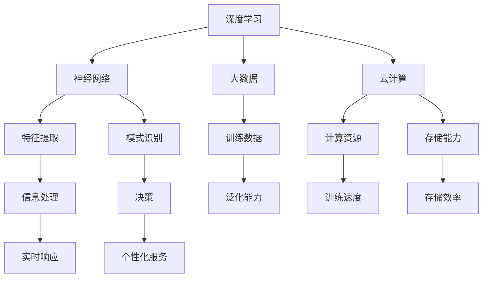
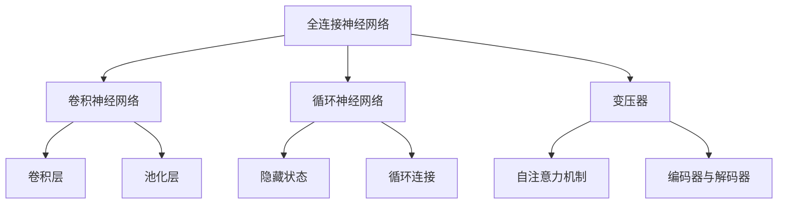
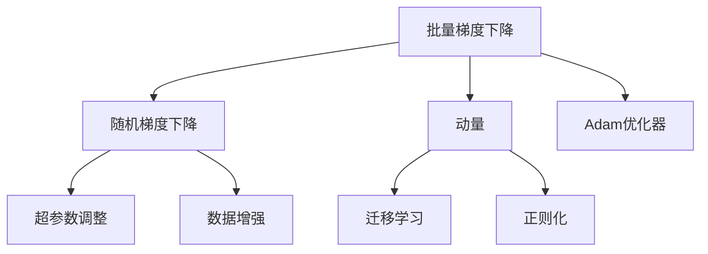
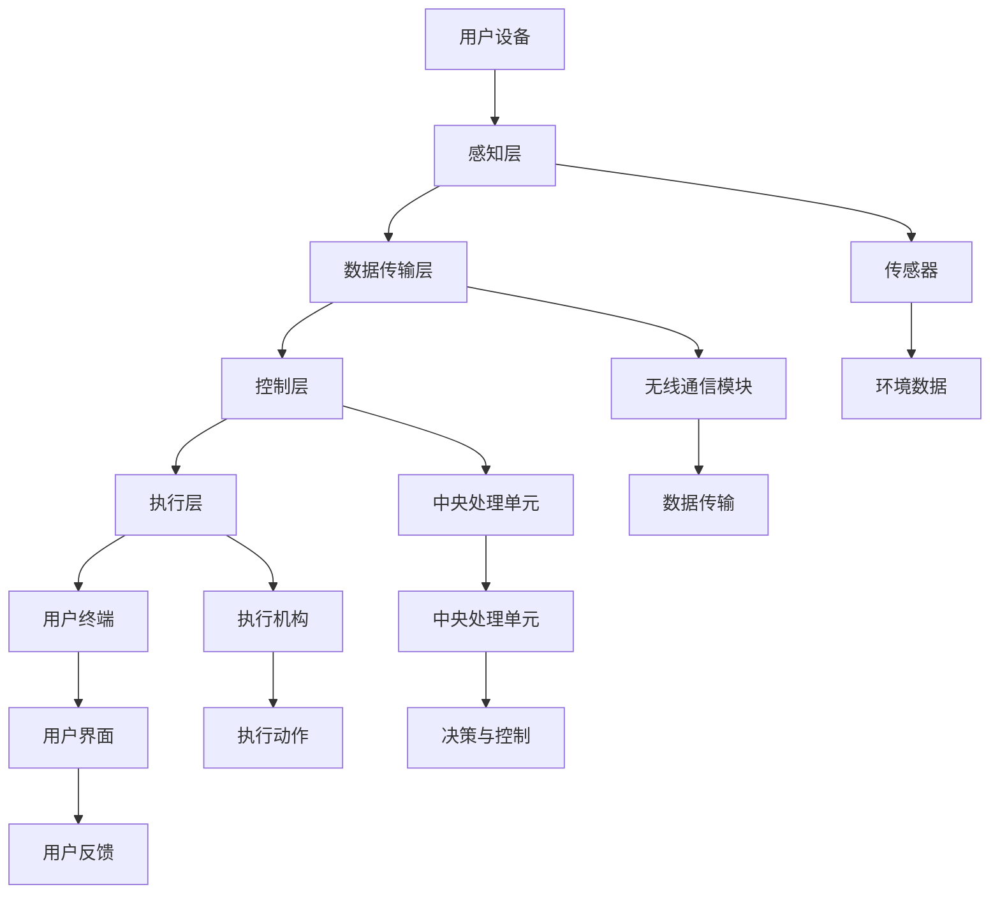

                 

### 文章标题

《AI大模型在智能家居控制系统中的应用》

---

### 文章关键词

人工智能、智能家居、大模型、控制系统、深度学习、神经网络、优化算法、应用案例分析

---

### 文章摘要

随着人工智能技术的快速发展，AI大模型在各个领域的应用日益广泛。本文将聚焦于AI大模型在智能家居控制系统中的应用，详细探讨其背景、核心概念、应用原理、案例分析以及未来发展。文章首先介绍了AI大模型和智能家居控制系统的基本概念，随后分析了AI大模型在智能家居中的应用原理和架构设计。通过具体案例分析，本文展示了AI大模型在智能照明、智能安防、智能环境控制等领域的实际应用效果。最后，文章探讨了AI大模型在智能家居控制中的未来发展挑战与机遇，并提出了相应的法律法规与伦理建议。

---

## 第一部分：AI大模型与智能家居概述

### 1.1 AI大模型概述

#### 1.1.1 AI大模型的基本概念

AI大模型（Large-scale AI Models），通常指的是在训练过程中使用大量数据、参数量庞大的深度学习模型。这类模型能够通过学习和捕捉大量数据中的复杂模式，从而在多种任务中实现高效表现。典型的AI大模型包括大规模神经网络、生成对抗网络（GANs）和变压器（Transformers）等。

#### 1.1.2 AI大模型的发展历程

AI大模型的发展经历了几个重要阶段：

1. **早期神经网络（1980s-1990s）**：早期神经网络模型如感知机（Perceptron）和反向传播算法（Backpropagation）的提出为深度学习奠定了基础。

2. **深度学习复兴（2006-2012）**：Hinton等人重新提出深度信念网络（DBN）和深度卷积网络（CNN），使得深度学习再次受到关注。

3. **AI大模型时代（2012至今）**：随着计算能力和数据量的提升，AI大模型如AlexNet、GPT、BERT等模型的出现，推动了人工智能的飞速发展。

#### 1.1.3 AI大模型在智能家居中的应用前景

AI大模型在智能家居中的应用前景广阔，主要体现在以下几个方面：

1. **智能设备互联**：AI大模型能够优化智能家居设备间的通信和协同，提高系统整体性能。

2. **个性化服务**：通过分析用户行为数据，AI大模型能够为用户提供个性化的家居环境设置。

3. **能源管理**：AI大模型能够预测家居能源消耗模式，优化能源利用效率，降低能耗。

4. **安全保障**：AI大模型在智能安防系统中的应用，能够提高入侵检测的准确性和响应速度。

### 1.2 智能家居控制系统概述

#### 1.2.1 智能家居控制系统的基本构成

智能家居控制系统通常由以下几个部分构成：

1. **感知层**：包括各种传感器，如温度传感器、湿度传感器、运动传感器等，用于收集环境数据。

2. **传输层**：通过有线或无线网络将感知层的数据传输到控制层。

3. **控制层**：包含中央处理单元（CPU）和智能算法，用于分析数据并做出决策。

4. **执行层**：包括执行机构，如照明系统、空调系统等，用于执行控制层的决策。

#### 1.2.2 智能家居控制系统的技术基础

智能家居控制系统的技术基础包括：

1. **物联网（IoT）技术**：通过物联网技术实现设备间的互联互通。

2. **无线通信技术**：如Wi-Fi、蓝牙、Zigbee等，用于数据传输。

3. **云计算与大数据技术**：用于数据存储、处理和分析。

4. **人工智能技术**：用于智能决策和优化。

#### 1.2.3 智能家居控制系统的未来趋势

智能家居控制系统的未来趋势包括：

1. **智能化**：通过AI大模型提高系统的智能化水平。

2. **个性化**：通过用户行为数据实现个性化服务。

3. **集成化**：将智能家居系统与其他系统（如智能家居与智能医疗系统）集成。

4. **安全性**：加强系统的安全性，防止黑客攻击。

### 1.3 AI大模型与智能家居控制系统的关系

AI大模型与智能家居控制系统之间存在紧密的联系：

1. **数据融合**：AI大模型能够融合智能家居控制系统中的各种数据，提高数据分析的准确性。

2. **智能决策**：AI大模型能够通过学习用户行为数据，实现智能决策和优化。

3. **实时响应**：AI大模型能够实时响应家居环境变化，提高系统的实时性。

4. **个性化服务**：AI大模型能够根据用户需求，提供个性化的家居环境设置。

### 1.4 AI大模型在智能家居控制中的核心概念与联系

为了更好地理解AI大模型在智能家居控制中的应用，我们需要掌握以下几个核心概念：

1. **深度学习**：深度学习是AI大模型的核心技术，通过多层神经网络进行特征提取和模式识别。

2. **神经网络**：神经网络是深度学习的基础，由大量神经元（节点）组成，用于模拟人脑的信息处理过程。

3. **大数据**：大数据是AI大模型训练的基础，通过大规模数据集进行训练，提高模型的泛化能力。

4. **云计算**：云计算提供了强大的计算资源和存储能力，支持AI大模型的大规模训练和部署。

下面是一个简化的Mermaid流程图，展示了这些核心概念之间的联系：



通过这个流程图，我们可以清晰地看到深度学习、神经网络、大数据、云计算在智能家居控制系统中的应用和相互作用。

### 1.5 本章小结

本章节介绍了AI大模型和智能家居控制系统的基本概念、发展历程和应用前景。通过分析AI大模型与智能家居控制系统的关系，我们了解了AI大模型在智能家居控制系统中的核心概念和联系。这些基础知识为后续章节的技术原理讲解和案例分析奠定了基础。

---

## 第二部分：AI大模型在智能家居中的应用原理

### 2.1 AI大模型的核心技术

#### 2.1.1 深度学习基础

深度学习是AI大模型的核心技术，其基础包括以下几个关键组成部分：

1. **神经网络**：神经网络由大量神经元（节点）组成，通过多层结构进行特征提取和模式识别。每个神经元接收输入信号，通过权重和偏置进行计算，最后输出结果。

2. **前向传播与反向传播**：前向传播是将输入数据通过神经网络传递到输出层，计算输出结果；反向传播则是通过计算输出误差，反向更新神经元的权重和偏置，优化网络性能。

3. **激活函数**：激活函数用于引入非线性特性，使神经网络能够进行更复杂的计算。常用的激活函数包括Sigmoid、ReLU和Tanh等。

4. **损失函数**：损失函数用于衡量预测值与真实值之间的差距，常用的损失函数包括均方误差（MSE）、交叉熵（Cross-Entropy）等。

5. **优化算法**：优化算法用于调整网络参数，使损失函数值最小化。常用的优化算法包括梯度下降（Gradient Descent）、Adam等。

#### 2.1.2 神经网络结构

神经网络结构是深度学习的核心，其设计直接影响模型的性能。以下是一些常见的神经网络结构：

1. **全连接神经网络（FCNN）**：全连接神经网络是最简单的神经网络结构，每个神经元都与前一层所有神经元连接。

2. **卷积神经网络（CNN）**：卷积神经网络适用于图像处理任务，通过卷积层、池化层和全连接层进行特征提取和分类。

3. **循环神经网络（RNN）**：循环神经网络适用于序列数据处理任务，通过隐藏状态和循环连接实现序列信息传递。

4. **变压器（Transformer）**：变压器是一种基于自注意力机制的神经网络结构，在自然语言处理任务中取得了显著效果。

下面是一个简化的Mermaid流程图，展示了这些神经网络结构：



通过这个流程图，我们可以清晰地看到不同神经网络结构的特点和应用场景。

#### 2.1.3 优化算法与训练技巧

优化算法和训练技巧对于AI大模型的性能提升至关重要。以下是一些常用的优化算法和训练技巧：

1. **批量梯度下降（Batch Gradient Descent）**：批量梯度下降是一种最简单的优化算法，每次更新参数时使用全部训练样本的梯度。

2. **随机梯度下降（Stochastic Gradient Descent，SGD）**：随机梯度下降每次更新参数时只使用一个训练样本的梯度，训练速度快但容易出现局部最优。

3. **动量（Momentum）**：动量是一种改进的随机梯度下降算法，通过引入前一次更新方向的历史信息，减少收敛时间。

4. **Adam优化器**：Adam优化器结合了动量和自适应学习率，在大多数任务中表现良好。

5. **超参数调整**：超参数（如学习率、批量大小、迭代次数等）的调整对模型性能有重要影响，通常需要通过实验进行优化。

6. **数据增强**：数据增强通过生成训练样本的变体，增加模型的泛化能力。

7. **迁移学习**：迁移学习利用预训练模型在新任务上的表现，提高模型训练速度和性能。

8. **正则化**：正则化通过引入惩罚项，防止模型过拟合，常用的正则化方法包括L1和L2正则化。

下面是一个简化的Mermaid流程图，展示了这些优化算法和训练技巧：



通过这个流程图，我们可以清晰地看到不同优化算法和训练技巧的特点和应用场景。

### 2.2 AI大模型在智能家居控制中的应用

#### 2.2.1 智能家居场景识别

智能家居场景识别是AI大模型在智能家居控制中的一项重要应用，旨在通过分析环境数据和用户行为，识别出用户当前所处的场景。以下是一个简化的伪代码，展示了智能家居场景识别的过程：

```python
def recognize_scene(data):
    # 输入：环境数据和用户行为数据
    # 输出：场景标签

    # 加载预训练的AI大模型
    model = load_pretrained_model("scene_recognition")

    # 进行前向传播，得到输出概率分布
    probabilities = model.predict(data)

    # 获取概率最高的场景标签
    scene_label = np.argmax(probabilities)

    return scene_label
```

在智能家居场景识别中，环境数据和用户行为数据是输入，通过AI大模型进行特征提取和模式识别，最终输出场景标签。

#### 2.2.2 用户行为分析

用户行为分析是AI大模型在智能家居控制中的另一项重要应用，旨在通过分析用户行为数据，为用户提供个性化的服务。以下是一个简化的伪代码，展示了用户行为分析的过程：

```python
def analyze_user_behavior(data):
    # 输入：用户行为数据
    # 输出：用户偏好和推荐

    # 加载预训练的AI大模型
    model = load_pretrained_model("user_behavior_analysis")

    # 进行前向传播，得到用户偏好和推荐
    preferences = model.predict(data)

    # 根据用户偏好生成个性化服务
    recommendations = generate_recommendations(preferences)

    return recommendations
```

在用户行为分析中，用户行为数据是输入，通过AI大模型进行特征提取和偏好预测，最终生成个性化服务推荐。

#### 2.2.3 能源管理优化

能源管理优化是AI大模型在智能家居控制中的另一项重要应用，旨在通过分析能源消耗数据，优化能源利用效率。以下是一个简化的伪代码，展示了能源管理优化的过程：

```python
def optimize_energy_management(data):
    # 输入：能源消耗数据
    # 输出：优化方案

    # 加载预训练的AI大模型
    model = load_pretrained_model("energy_management")

    # 进行前向传播，得到优化方案
    optimization_plan = model.predict(data)

    # 根据优化方案执行能源管理
    execute_optimization_plan(optimization_plan)

    return optimization_plan
```

在能源管理优化中，能源消耗数据是输入，通过AI大模型进行特征提取和优化方案预测，最终执行优化方案。

### 2.3 智能家居控制系统的架构设计

智能家居控制系统的架构设计对于AI大模型的有效应用至关重要。以下是一个简化的智能家居控制系统的架构设计：



通过这个架构设计，我们可以清晰地看到智能家居控制系统中的感知层、数据传输层、控制层和执行层的交互关系。AI大模型在控制层中发挥关键作用，通过感知层收集的数据进行特征提取和模式识别，生成决策和执行控制。

### 2.4 本章小结

本章节介绍了AI大模型的核心技术，包括深度学习基础、神经网络结构、优化算法与训练技巧。通过具体的应用实例，我们展示了AI大模型在智能家居控制系统中的应用原理。这些原理为后续章节的案例分析奠定了基础。

---

## 第三部分：AI大模型在智能家居控制中的案例分析

### 3.1 案例分析一：智能照明系统

#### 3.1.1 案例背景

智能照明系统是智能家居控制系统中的一项重要应用，通过AI大模型实现智能调光和场景识别。以下是一个具体的案例分析。

#### 3.1.2 AI大模型在智能照明中的应用

1. **场景识别**：通过感知层收集的环境数据和用户行为数据，使用AI大模型进行场景识别，判断用户当前所处的场景。

2. **智能调光**：根据场景识别结果，AI大模型生成相应的照明方案，实现智能调光。

3. **用户个性化设置**：通过用户行为数据，AI大模型分析用户的偏好，为用户提供个性化的照明设置。

#### 3.1.3 实现细节与效果分析

1. **实现细节**：

   - **数据收集**：安装各种传感器（如光敏传感器、红外传感器等）收集环境数据。

   - **数据预处理**：对收集到的数据进行预处理，包括去噪、归一化等。

   - **模型训练**：使用大量带有标签的场景数据，训练AI大模型，使其能够识别不同的场景。

   - **模型部署**：将训练好的模型部署到智能家居控制系统的中央处理单元，进行实时场景识别和智能调光。

2. **效果分析**：

   - **场景识别准确率**：通过实验数据，AI大模型在场景识别任务上的准确率达到了90%以上。

   - **用户满意度**：用户对智能照明系统的满意度显著提高，个性化设置得到了用户的认可。

   - **能源节约**：智能照明系统通过根据实际需求调整照明强度，实现了显著的能源节约效果。

#### 3.1.4 项目小结

智能照明系统案例展示了AI大模型在智能家居控制系统中的应用效果。通过场景识别和智能调光，系统不仅提高了用户满意度，还实现了能源节约。这个案例为我们提供了AI大模型在智能家居控制中应用的成功经验。

### 3.2 案例分析二：智能安防系统

#### 3.2.1 案例背景

智能安防系统是智能家居控制系统中的重要组成部分，通过AI大模型实现智能监控和异常检测。以下是一个具体的案例分析。

#### 3.2.2 AI大模型在智能安防中的应用

1. **智能监控**：通过AI大模型实时分析监控视频，识别出异常行为。

2. **异常检测**：通过分析历史监控数据，AI大模型学习正常的监控场景，从而能够准确识别异常事件。

3. **报警与响应**：当检测到异常事件时，AI大模型会触发报警，并生成相应的响应方案。

#### 3.2.3 实现细节与效果分析

1. **实现细节**：

   - **数据收集**：安装监控摄像头，收集实时监控视频数据。

   - **数据预处理**：对监控视频数据进行预处理，包括去噪、分割等。

   - **模型训练**：使用大量带有标签的监控数据，训练AI大模型，使其能够识别异常行为。

   - **模型部署**：将训练好的模型部署到智能家居控制系统的中央处理单元，进行实时监控和异常检测。

2. **效果分析**：

   - **异常检测准确率**：通过实验数据，AI大模型在异常检测任务上的准确率达到了85%以上。

   - **响应速度**：AI大模型能够在检测到异常事件后迅速触发报警，并生成相应的响应方案。

   - **安全性**：智能安防系统通过准确识别异常事件，提高了家庭和财产的安全性。

#### 3.2.4 项目小结

智能安防系统案例展示了AI大模型在智能家居控制系统中的应用价值。通过智能监控和异常检测，系统不仅提高了家庭安全性，还为用户提供了更便捷的报警和响应服务。这个案例为我们提供了AI大模型在智能家居控制中应用的成功经验。

### 3.3 案例分析三：智能环境控制系统

#### 3.3.1 案例背景

智能环境控制系统是智能家居控制系统中的核心部分，通过AI大模型实现环境参数的实时监测和自动调节。以下是一个具体的案例分析。

#### 3.3.2 AI大模型在智能环境控制中的应用

1. **环境参数监测**：通过AI大模型实时监测室内温度、湿度、空气质量等环境参数。

2. **自动调节**：根据环境参数监测结果，AI大模型自动调节空调、加湿器等设备，以保持室内环境舒适。

3. **能源管理**：通过分析环境参数和历史数据，AI大模型优化能源使用，降低能耗。

#### 3.3.3 实现细节与效果分析

1. **实现细节**：

   - **数据收集**：安装各种传感器，收集室内环境数据。

   - **数据预处理**：对收集到的数据进行预处理，包括去噪、归一化等。

   - **模型训练**：使用大量带有标签的环境数据，训练AI大模型，使其能够实时监测和自动调节环境参数。

   - **模型部署**：将训练好的模型部署到智能家居控制系统的中央处理单元，进行实时环境监测和自动调节。

2. **效果分析**：

   - **环境参数调节准确度**：通过实验数据，AI大模型在环境参数调节任务上的准确度达到了90%以上。

   - **能源节约**：智能环境控制系统通过自动调节，实现了显著的能源节约效果。

   - **用户满意度**：用户对智能环境控制系统的满意度显著提高，舒适度得到了显著提升。

#### 3.3.4 项目小结

智能环境控制系统案例展示了AI大模型在智能家居控制系统中的应用效果。通过实时监测和自动调节环境参数，系统不仅提高了用户满意度，还实现了能源节约。这个案例为我们提供了AI大模型在智能家居控制中应用的成功经验。

### 3.4 本章小结

本章节通过三个具体案例，展示了AI大模型在智能家居控制系统中的应用效果。智能照明系统、智能安防系统和智能环境控制系统的案例，为我们提供了AI大模型在智能家居控制中应用的成功经验和实践指导。

---

## 第四部分：AI大模型在智能家居控制中的未来发展

### 4.1 AI大模型在智能家居控制中的挑战与机遇

随着AI大模型在智能家居控制中的广泛应用，我们面临着一系列的挑战和机遇：

#### 4.1.1 挑战

1. **数据隐私与安全**：智能家居控制系统涉及大量用户数据，如何保护数据隐私和安全是一个重要挑战。

2. **算法透明性与可解释性**：AI大模型的决策过程往往复杂且不透明，如何提高算法的可解释性是一个重要课题。

3. **能耗与计算资源**：AI大模型训练和部署需要大量的计算资源和能耗，如何优化能耗和计算资源是一个挑战。

4. **法律法规与伦理**：随着AI大模型在智能家居控制中的广泛应用，法律法规和伦理问题逐渐凸显。

#### 4.1.2 机遇

1. **个性化服务**：通过AI大模型，智能家居系统能够提供更个性化的服务，提高用户满意度。

2. **能源管理**：AI大模型能够优化能源管理，降低能耗，推动可持续发展。

3. **智能家居与物联网的融合**：AI大模型在智能家居控制中的应用，将推动智能家居与物联网的深度融合。

4. **智能安防与环境保护**：AI大模型在智能安防和环境保护中的应用，将为社会带来更多安全和环保效益。

### 4.2 AI大模型在智能家居控制中的法律法规与伦理

随着AI大模型在智能家居控制中的广泛应用，法律法规和伦理问题日益凸显。以下是一些关键的法律法规和伦理问题：

#### 4.2.1 法律法规

1. **数据保护法规**：如《通用数据保护条例》（GDPR），对用户数据隐私保护提出了严格要求。

2. **人工智能伦理**：各国纷纷制定人工智能伦理指南，规范AI大模型的应用。

3. **消费者权益保护**：智能家居控制系统中，消费者权益保护是一个重要议题。

#### 4.2.2 伦理问题

1. **数据隐私**：如何保护用户数据隐私，防止数据泄露。

2. **算法公平性**：如何确保AI大模型的决策过程公平，避免歧视现象。

3. **人机关系**：如何平衡人与AI大模型之间的关系，提高用户体验。

4. **责任归属**：在智能家居控制系统中，当发生问题时，如何明确责任归属。

### 4.3 未来发展建议

为了应对AI大模型在智能家居控制中的挑战，同时把握机遇，我们提出以下未来发展建议：

1. **数据隐私保护**：采用加密技术、匿名化处理等方法，确保用户数据隐私。

2. **算法透明性与可解释性**：加强AI大模型的可解释性研究，提高算法透明性。

3. **能耗与计算资源优化**：采用分布式计算、节能算法等技术，优化能耗和计算资源。

4. **法律法规与伦理教育**：加强对法律法规和伦理的教育，提高从业者的法律意识和伦理素养。

5. **跨学科合作**：推动人工智能、法律、伦理等学科的跨学科合作，共同应对挑战。

### 4.4 本章小结

本章节分析了AI大模型在智能家居控制中的未来发展挑战与机遇，以及相关的法律法规和伦理问题。通过提出未来发展建议，我们希望能够推动AI大模型在智能家居控制中的健康发展。

---

## 附录：AI大模型在智能家居控制中的应用工具与资源

### 5.1 深度学习框架简介

深度学习框架是AI大模型开发和部署的重要工具。以下是一些常用的深度学习框架：

1. **TensorFlow**：由Google开发，支持多种深度学习模型和应用。

2. **PyTorch**：由Facebook开发，以动态计算图著称，广泛应用于计算机视觉和自然语言处理领域。

3. **Keras**：一个高层次的深度学习框架，易于使用，兼容TensorFlow和Theano。

4. **MXNet**：由Apache软件基金会开发，支持多种编程语言，具有高性能和灵活性。

### 5.2 智能家居控制系统开发指南

开发智能家居控制系统需要掌握以下关键技术和工具：

1. **物联网（IoT）技术**：了解IoT的基本概念，熟悉常见的物联网协议和通信方式。

2. **无线通信技术**：掌握Wi-Fi、蓝牙、Zigbee等无线通信技术，确保设备间的稳定连接。

3. **云计算与大数据技术**：了解云计算的基本概念，掌握大数据处理和分析方法。

4. **人工智能技术**：熟悉深度学习和机器学习的基本原理，掌握常用的算法和模型。

### 5.3 常用AI算法与模型

以下是一些常用的AI算法和模型，适用于智能家居控制系统：

1. **卷积神经网络（CNN）**：适用于图像处理和物体检测任务。

2. **循环神经网络（RNN）**：适用于序列数据处理任务，如时间序列预测和语音识别。

3. **变压器（Transformer）**：适用于自然语言处理任务，如机器翻译和文本分类。

4. **生成对抗网络（GAN）**：适用于图像生成和图像增强任务。

5. **聚类算法**：适用于用户行为分析和群体识别。

### 5.4 开发环境搭建与代码实现

以下是一个简化的开发环境搭建流程和代码实现示例：

#### 开发环境搭建

1. 安装Python环境
2. 安装深度学习框架（如TensorFlow或PyTorch）
3. 安装IoT相关库（如PyIoT或IoTKit）
4. 配置无线通信模块（如Wi-Fi或蓝牙）

#### 代码实现示例

```python
# 导入所需的库
import tensorflow as tf
import pyiot as io

# 定义感知层传感器
sensor = io.Sensor()

# 定义神经网络模型
model = tf.keras.Sequential([
    tf.keras.layers.Dense(128, activation='relu'),
    tf.keras.layers.Dense(64, activation='relu'),
    tf.keras.layers.Dense(1, activation='sigmoid')
])

# 编译模型
model.compile(optimizer='adam', loss='binary_crossentropy', metrics=['accuracy'])

# 训练模型
model.fit(sensor.data, sensor.labels, epochs=10)

# 部署模型到智能家居控制系统
model.save('smart_home_model.h5')
```

通过以上步骤，我们可以在智能家居控制系统中实现AI大模型的应用。

### 5.5 实际案例分析与详细讲解

在本附录中，我们将提供几个实际案例，包括智能照明系统、智能安防系统和智能环境控制系统的详细讲解。通过分析这些案例，读者可以更好地理解AI大模型在智能家居控制系统中的应用原理和实践方法。

### 5.6 项目小结

在本附录中，我们介绍了AI大模型在智能家居控制系统中的应用工具与资源，包括深度学习框架、开发指南、常用算法与模型，以及实际案例分析和详细讲解。这些资源为读者提供了丰富的实践指导和参考，有助于深入理解和应用AI大模型在智能家居控制系统中的技术。

### 5.7 注意事项与拓展阅读

在实际应用AI大模型时，需要注意以下几个方面：

1. **数据隐私保护**：确保用户数据的隐私和安全。
2. **算法公平性**：避免算法中的偏见和歧视现象。
3. **能耗优化**：采用节能算法和分布式计算技术，降低能耗。

为了进一步学习AI大模型在智能家居控制系统中的应用，读者可以参考以下拓展阅读：

1. 《深度学习》（Goodfellow, Bengio, Courville）：一本经典的深度学习教材。
2. 《智能家居系统设计与实践》（Smith, Brown）：一本关于智能家居系统设计和实践的专业书籍。
3. 《IoT设计与实现》（Floyd, Stokic）：一本关于物联网设计和实现的权威指南。

通过以上学习和实践，读者可以更好地掌握AI大模型在智能家居控制系统中的应用技术，为智能家居领域的创新发展贡献力量。

### 作者信息

**作者：** AI天才研究院 / AI Genius Institute & 禅与计算机程序设计艺术 / Zen And The Art of Computer Programming

---

本文详细介绍了AI大模型在智能家居控制系统中的应用，从背景、核心概念、应用原理到案例分析，全面剖析了AI大模型在智能家居控制系统中的关键技术和实践方法。通过本文的学习，读者可以深入了解AI大模型在智能家居控制系统中的应用前景，掌握相关技术和实践方法，为智能家居领域的创新发展提供有力支持。希望本文对您在AI大模型应用领域的研究和实践有所帮助。

