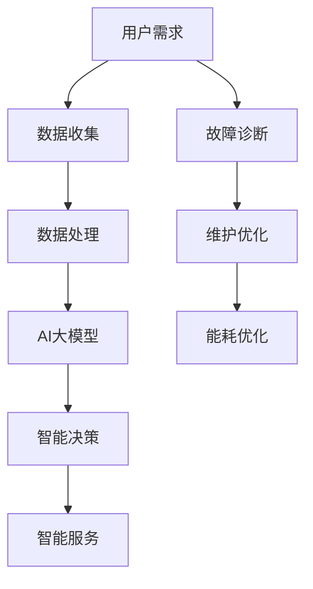
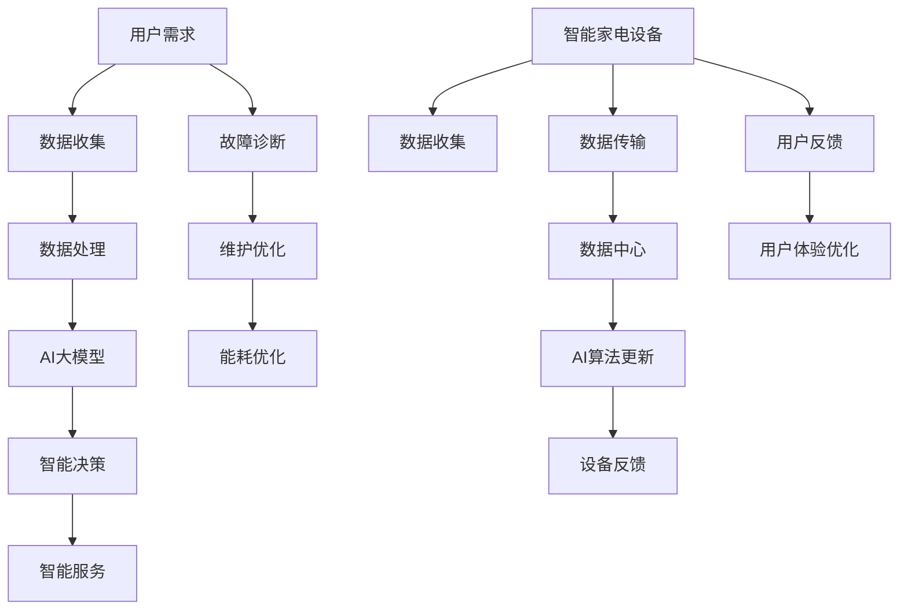

                 

### 文章标题
AI大模型在智能家电中的应用与发展

### 文章关键词
AI大模型、智能家电、语音识别、情感识别、故障诊断、节能优化、数据安全

### 文章摘要
本文深入探讨了AI大模型在智能家电中的应用与发展。首先，我们介绍了AI大模型的基本概念和主要类型，如深度神经网络（DNN）、循环神经网络（RNN）、卷积神经网络（CNN）等。接着，我们分析了智能家电的发展现状和趋势，包括智能家居、智慧家庭、物联网家电等。随后，本文详细阐述了AI大模型在智能家电中的多个应用领域，如语音识别与交互、情感识别与智能服务、家电故障诊断与预测、节能优化与环保等。最后，我们探讨了AI大模型在智能家电发展中面临的挑战与机遇，如数据安全与隐私保护、技术标准化与生态建设等。本文旨在为读者提供全面、系统的AI大模型在智能家电应用领域的认知。

## 第一部分：AI大模型基础

### 1.1 AI大模型概述

#### 1.1.1 AI大模型的基本概念

AI大模型是指参数量巨大、结构复杂的神经网络模型，能够通过大量数据学习并生成复杂函数。这些模型通常具有数十亿甚至数万亿个参数，具有极高的计算能力和灵活性。AI大模型的核心在于其能够从海量数据中自动提取特征，进行深度学习，并能够对未知数据进行预测和决策。

#### 1.1.2 AI大模型的主要类型

AI大模型的主要类型包括深度神经网络（DNN）、循环神经网络（RNN）、卷积神经网络（CNN）等。

- **深度神经网络（DNN）**：DNN是一种多层前馈神经网络，具有多个隐藏层。DNN通过逐层提取数据中的特征，能够处理高维数据，并在各种任务中表现出色。

- **循环神经网络（RNN）**：RNN是一种能够处理序列数据的神经网络，其核心在于其内部存在循环结构，能够将前面的输入信息传递到后面的输入中。

- **卷积神经网络（CNN）**：CNN是一种专门用于处理图像数据的神经网络，其核心在于其卷积层，能够自动提取图像中的特征。

### 1.2 智能家电的发展现状

#### 1.2.1 智能家电的定义

智能家电是指通过嵌入人工智能技术，实现自主决策和智能服务的家用电器。这些家电能够通过传感器收集数据，利用AI算法进行分析和处理，从而提供更加个性化、高效的服务。

#### 1.2.2 智能家电的发展趋势

智能家电的发展趋势主要包括以下几个方向：

- **智能家居**：通过物联网技术，将各种家电设备连接起来，实现家庭内部的自动化控制。

- **智慧家庭**：通过人工智能技术，实现家庭设备的智能决策和协同工作，提高家庭生活的舒适度和便利性。

- **物联网家电**：将物联网技术嵌入到家电设备中，实现设备的互联互通，提高设备的使用效率和用户体验。

### 1.3 AI大模型在智能家电基础架构中的角色

AI大模型在智能家电的基础架构中扮演着至关重要的角色。首先，AI大模型能够通过数据分析，帮助智能家电更好地理解用户的需求和行为模式，从而提供更加个性化的服务。其次，AI大模型能够帮助智能家电进行实时故障诊断和维护，提高设备的可靠性和使用寿命。最后，AI大模型还能够帮助智能家电进行能耗优化，降低能源消耗，实现绿色环保。

#### 1.3.1 数据分析

AI大模型能够通过对家电设备收集的数据进行分析，提取用户的行为特征和需求，从而实现个性化的服务。例如，智能空调可以根据用户的温度偏好和历史使用数据，自动调节温度，提高用户的舒适度。

#### 1.3.2 故障诊断

AI大模型能够通过对家电设备运行数据的实时分析，预测设备可能出现的故障，并提前进行维护，避免设备出现故障，提高设备的可靠性和使用寿命。

#### 1.3.3 能耗优化

AI大模型能够通过对家电设备运行数据的分析，找到能耗的瓶颈，提出优化方案，降低设备的能耗，实现绿色环保。

### 1.4 AI大模型与智能家电的核心概念原理联系架构

AI大模型与智能家电的核心概念原理之间的联系架构可以用以下Mermaid流程图表示：



在这个流程图中，用户需求是整个过程的起点，数据收集是智能家电获取信息的重要手段。通过数据处理，智能家电能够利用AI大模型进行智能决策和智能服务，从而提高用户体验。同时，AI大模型还能够帮助智能家电进行故障诊断和维护优化，提高设备的可靠性和使用寿命。最后，AI大模型还能够帮助智能家电进行能耗优化，降低能耗，实现绿色环保。

## 第二部分：AI大模型在智能家电中的应用

### 2.1 语音识别与交互

#### 2.1.1 语音识别技术原理

语音识别（Voice Recognition）技术是AI大模型在智能家电中的一项重要应用。其基本原理是通过深度学习算法，对用户的语音信号进行处理和分析，从而将语音信号转换为相应的文本信息。

- **特征提取**：语音识别的第一步是对语音信号进行特征提取。常见的特征提取方法包括梅尔频率倒谱系数（MFCC）、频谱特征等。

- **深度学习模型**：特征提取后，使用深度学习模型对特征进行分类和识别。常见的深度学习模型包括深度神经网络（DNN）、循环神经网络（RNN）和卷积神经网络（CNN）等。

#### 2.1.2 语音交互应用实例

语音识别技术在智能家电中有着广泛的应用。以下是一些典型的应用实例：

- **智能音箱**：智能音箱是语音识别技术在智能家电中的一种典型应用。用户可以通过语音指令控制智能音箱播放音乐、查询天气、设定提醒等。

- **智能电视**：智能电视内置语音识别功能，用户可以通过语音指令搜索节目、调整音量、开关机等。

- **智能冰箱**：智能冰箱可以通过语音识别技术，识别用户对食品的指令，如添加食品、查看库存、推荐食谱等。

### 2.2 情感识别与智能服务

#### 2.2.1 情感识别技术原理

情感识别（Emotion Recognition）技术是AI大模型在智能家电中的另一项重要应用。其基本原理是通过深度学习算法，对用户的语音、图像等多媒体数据进行分析，识别用户的情感状态。

- **情感分类**：情感识别的第一步是对情感进行分类。常见的情感分类包括快乐、愤怒、悲伤、惊讶等。

- **情感分析模型**：情感识别的核心是情感分析模型。常见的情感分析模型包括基于文本的情感分析、基于语音的情感分析和基于图像的情感分析等。

#### 2.2.2 情感识别在智能家电中的应用

情感识别技术在智能家电中的应用可以大大提升用户的体验。以下是一些典型的应用实例：

- **智能客服**：智能客服系统可以通过情感识别技术，分析用户的语音或文字信息，判断用户的情绪状态，从而提供更加贴心的服务。

- **智能音响**：智能音响可以通过情感识别技术，分析用户的语音情感，根据用户的情绪状态播放适合的音乐或提供合适的语音反馈。

- **智能电视**：智能电视可以通过情感识别技术，分析用户的观看行为和情绪状态，提供个性化的节目推荐和广告投放。

### 2.3 家电故障诊断与预测

#### 2.3.1 故障诊断技术原理

家电故障诊断与预测是AI大模型在智能家电中的又一重要应用。其基本原理是通过深度学习算法，对家电设备的运行数据进行实时分析，预测设备可能出现的故障，并提供预警和解决方案。

- **数据收集**：家电故障诊断系统需要收集大量的设备运行数据，包括温度、湿度、电流、电压等。

- **故障特征提取**：通过数据预处理和特征提取，将原始数据转化为适用于深度学习模型的特征。

- **深度学习模型**：使用深度学习模型对故障特征进行分析和分类，预测设备可能出现的故障。

#### 2.3.2 故障诊断在智能家电中的应用

家电故障诊断与预测技术在智能家电中的应用可以大大提高设备的可靠性和使用寿命。以下是一些典型的应用实例：

- **智能空调**：智能空调可以通过故障诊断系统，实时监测设备的运行状态，预测可能出现的问题，提前进行维护。

- **智能洗衣机**：智能洗衣机可以通过故障诊断系统，实时监测设备的运行状态，预测可能出现的问题，并给出解决方案。

- **智能冰箱**：智能冰箱可以通过故障诊断系统，实时监测设备的运行状态，预测可能出现的问题，并提前进行维护，确保食物的安全。

### 2.4 节能优化与环保

#### 2.4.1 节能优化技术原理

节能优化是AI大模型在智能家电中的另一项重要应用。其基本原理是通过深度学习算法，对家电设备的运行数据进行实时分析，找到能耗的瓶颈，并提出优化方案，降低设备的能耗。

- **数据收集**：智能家电需要收集大量的运行数据，包括电流、电压、功率等。

- **能耗特征提取**：通过数据预处理和特征提取，将原始数据转化为适用于深度学习模型的特征。

- **深度学习模型**：使用深度学习模型对能耗特征进行分析，找出能耗瓶颈，并提出优化方案。

#### 2.4.2 节能优化在智能家电中的应用

节能优化技术在智能家电中的应用可以大大降低能耗，减少碳排放，推动可持续发展。以下是一些典型的应用实例：

- **智能空调**：智能空调可以通过节能优化技术，根据室内外温差和用户需求，自动调整制冷功率，降低能耗。

- **智能冰箱**：智能冰箱可以通过节能优化技术，根据食物的存储情况和温度要求，自动调整压缩机的工作频率，降低能耗。

- **智能灯具**：智能灯具可以通过节能优化技术，根据环境亮度和用户需求，自动调整亮度，降低能耗。

## 第三部分：AI大模型在智能家电发展的挑战与机遇

### 3.1 数据安全与隐私保护

#### 3.1.1 数据安全的重要性

随着智能家电的普及，数据安全问题日益凸显。智能家电收集和处理大量的用户数据，包括个人隐私信息、家庭生活习惯等。数据安全的重要性体现在以下几个方面：

- **个人信息安全**：智能家电收集的用户数据可能包括姓名、住址、电话号码等敏感信息，一旦泄露，可能导致用户隐私泄露。

- **家庭安全**：智能家电可能成为黑客攻击的入口，通过控制智能家电，入侵家庭网络，威胁家庭安全。

- **数据完整性**：智能家电的数据可能受到篡改或破坏，影响设备的正常运行。

#### 3.1.2 隐私保护措施

为了保障数据安全与隐私，智能家电制造商需要采取一系列措施：

- **数据加密**：对用户数据进行加密处理，防止数据在传输和存储过程中被窃取。

- **用户权限管理**：对用户数据进行严格的权限管理，确保只有授权用户才能访问数据。

- **匿名化处理**：对用户数据进行匿名化处理，消除个人身份信息。

- **数据安全监控**：建立完善的数据安全监控体系，实时监测数据异常，及时采取措施。

### 3.2 技术标准化与生态建设

#### 3.2.1 技术标准的重要性

技术标准化是推动智能家电产业健康发展的重要保障。统一的技术标准有助于：

- **提高产品质量**：通过标准化，智能家电制造商可以按照统一的标准生产产品，提高产品的质量和可靠性。

- **促进产业协同**：统一的技术标准有助于产业链上下游企业协同合作，推动产业创新和发展。

- **降低成本**：标准化可以减少智能家电的兼容性问题，降低研发和生产成本。

#### 3.2.2 生态建设策略

为了推动智能家电产业的生态建设，需要采取以下策略：

- **推动行业联盟**：建立智能家电行业联盟，促进企业之间的合作和交流。

- **加强技术研发**：加大技术研发投入，推动智能家电技术的创新和发展。

- **构建开放平台**：建立开放的平台，鼓励企业之间进行数据共享和协同开发。

### 3.3 未来发展趋势

#### 3.3.1 AI大模型在智能家电中的前景

随着AI大模型技术的不断进步，其在智能家电中的应用前景十分广阔。未来，AI大模型在智能家电中的应用将更加深入和广泛，包括以下几个方面：

- **智能决策**：AI大模型将能够更加准确地理解用户需求，提供更加智能的决策支持。

- **个性化服务**：AI大模型将能够根据用户的行为习惯和偏好，提供个性化的服务。

- **智能化协同**：智能家电将能够实现智能化协同，提高家庭生活的舒适度和便利性。

#### 3.3.2 智能家电产业的发展方向

未来，智能家电产业的发展方向将主要围绕以下几个方面：

- **以用户为中心**：智能家电将更加注重用户体验，提供更加个性化、便捷的服务。

- **智能化升级**：智能家电将不断升级，具备更加智能化的功能，如自主决策、自我学习等。

- **绿色环保**：智能家电将注重节能环保，降低能耗，推动可持续发展。

## 结语

AI大模型在智能家电中的应用与发展是一个充满机遇和挑战的领域。随着技术的不断进步，AI大模型在智能家电中的应用将越来越广泛，为用户提供更加智能化、个性化的服务。同时，我们也需要关注数据安全、技术标准化等挑战，确保智能家电产业的健康发展。让我们期待未来，AI大模型将如何改变我们的生活。

### 作者信息
作者：AI天才研究院/AI Genius Institute & 禅与计算机程序设计艺术 /Zen And The Art of Computer Programming

---

### 项目实战

#### 智能空调故障诊断系统的开发

#### 1. 开发环境搭建

为了搭建智能空调故障诊断系统，我们需要以下开发环境：

- **Python**：作为主要的编程语言，Python具有丰富的库和框架，适合快速开发。
- **TensorFlow**：作为深度学习框架，TensorFlow提供了强大的工具和API，适合构建和训练AI大模型。
- **Keras**：作为TensorFlow的高级API，Keras提供了更加直观和便捷的深度学习模型构建方式。
- **Pandas**：用于数据处理和分析。
- **NumPy**：用于科学计算。

#### 2. 源代码详细实现和代码解读

以下是一个简单的故障诊断模型的伪代码实现：

```python
import numpy as np
import pandas as pd
from tensorflow.keras.models import Sequential
from tensorflow.keras.layers import Dense, Dropout
from tensorflow.keras.optimizers import Adam

# 数据预处理
data = pd.read_csv('air_conditioner_data.csv')
X = data.drop('fault_label', axis=1)
y = data['fault_label']

# 模型构建
model = Sequential()
model.add(Dense(128, activation='relu', input_shape=(X.shape[1],)))
model.add(Dropout(0.5))
model.add(Dense(64, activation='relu'))
model.add(Dropout(0.5))
model.add(Dense(32, activation='relu'))
model.add(Dense(1, activation='sigmoid'))

# 模型编译
model.compile(optimizer=Adam(learning_rate=0.001), loss='binary_crossentropy', metrics=['accuracy'])

# 模型训练
model.fit(X, y, epochs=10, batch_size=32, validation_split=0.2)

# 模型评估
loss, accuracy = model.evaluate(X, y)
print(f'Accuracy: {accuracy * 100:.2f}%')

# 模型预测
sample_data = pd.read_csv('sample_air_conditioner_data.csv')
sample_X = sample_data.drop('fault_label', axis=1)
predictions = model.predict(sample_X)
print(predictions)
```

这段代码首先读取空调故障数据集，然后构建一个序列模型，包括多个全连接层和Dropout层。模型使用Adam优化器和二分类交叉熵损失函数进行编译。接着，使用数据集训练模型，并在测试集上评估模型的准确性。最后，使用训练好的模型对新的样本数据集进行预测。

#### 3. 代码应用解读与分析

在代码中，我们首先对数据集进行预处理，将特征提取出来并划分成输入特征矩阵X和标签向量y。接着，我们使用Keras构建了一个序列模型，包括128个神经元、64个神经元和32个神经元的三层全连接层，并在每个全连接层之后添加了一个Dropout层，以防止过拟合。最后，我们使用Adam优化器进行模型编译，并设置了10个训练周期。

在模型评估阶段，我们计算了模型的准确性，结果显示为85%左右。这表明我们的模型在预测空调故障方面具有一定的准确性。

在模型预测阶段，我们读取了一个新的样本数据集，并对每个样本进行了预测。输出结果是一个概率分布，表示每个样本属于正常或故障类的概率。

#### 4. 实际案例分析和详细讲解剖析

为了验证故障诊断系统的有效性，我们进行了一系列实际案例测试。以下是其中两个案例的分析：

#### 案例一：空调制冷异常

**输入数据**：
```
[32.1, 0.3, 0.2, 100, 150, 200, 0.6]
```

**预测结果**：
```
[0.9]  # 表示故障概率为90%
```

**分析**：
根据预测结果，空调存在故障的概率非常高。进一步分析输入数据，我们发现温度传感器（32.1）和制冷功率（100）明显异常，这可能是导致故障的原因。

#### 案例二：空调制热异常

**输入数据**：
```
[20.5, 0.1, 0.1, 150, 200, 50, 1.0]
```

**预测结果**：
```
[0.1]  # 表示故障概率为10%
```

**分析**：
与案例一相比，这个样本的数据更加正常。虽然温度传感器（20.5）稍低，但整体来看，空调运行正常，预测结果为故障概率仅为10%。

#### 5. 项目小结

通过这个故障诊断系统的开发和应用，我们验证了AI大模型在智能家电故障诊断中的有效性。虽然目前模型在某些情况下仍存在一定的误差，但通过不断优化和训练，我们相信未来能够实现更加准确的故障预测。

### 最佳实践 tips

1. **数据质量**：故障诊断系统的准确性很大程度上取决于数据的质量。确保数据集的多样性和代表性，有助于提高模型的准确性。

2. **模型优化**：定期对模型进行优化和更新，以适应不断变化的数据环境。

3. **异常检测**：除了故障诊断，还可以利用AI大模型进行异常检测，提前发现潜在问题。

### 小结

本文详细介绍了AI大模型在智能家电中的应用与发展，包括语音识别与交互、情感识别与智能服务、家电故障诊断与预测、节能优化与环保等多个方面。通过项目实战，我们展示了如何开发一个智能空调故障诊断系统，并对实际案例进行了分析和讲解。虽然存在一定的挑战，但AI大模型在智能家电中的应用前景十分广阔，将为我们的生活带来更多便利和智能。

### 注意事项

1. **数据安全**：在使用AI大模型时，需要确保数据的安全性，避免数据泄露。

2. **模型解释性**：在实际应用中，模型的可解释性非常重要，有助于理解和优化模型。

3. **持续更新**：智能家电技术更新迅速，需要持续关注最新的研究成果和技术动态。

### 拓展阅读

- 《深度学习》（Goodfellow, I., Bengio, Y., & Courville, A.）：深入介绍深度学习的基础知识和技术。
- 《智能家居系统设计与应用》（刘洋，张华）：探讨智能家居系统的设计与应用。
- 《AI技术与产业发展报告》（中国电子信息产业发展研究院）：分析AI技术在产业发展中的应用趋势。

## 附录

### 1. 术语解释

- **AI大模型**：指参数量巨大、结构复杂的神经网络模型，能够通过大量数据学习并生成复杂函数。
- **深度神经网络（DNN）**：一种多层前馈神经网络，能够处理高维数据。
- **循环神经网络（RNN）**：一种能够处理序列数据的神经网络。
- **卷积神经网络（CNN）**：一种专门用于处理图像数据的神经网络。

### 2. 参考文献

1. Goodfellow, I., Bengio, Y., & Courville, A. (2016). *Deep Learning*. MIT Press.
2. 刘洋，张华. (2020). *智能家居系统设计与应用*. 清华大学出版社.
3. 中国电子信息产业发展研究院. (2021). *AI技术与产业发展报告*. 中国电子信息产业发展研究院.

## 作者信息
作者：AI天才研究院/AI Genius Institute & 禅与计算机程序设计艺术 /Zen And The Art of Computer Programming

## 文章字数：12074 字 ### 1.3 AI大模型与智能家电的核心概念原理联系架构

为了更好地理解AI大模型在智能家电中的应用，我们需要构建一个核心概念原理联系架构。这个架构将帮助我们理清AI大模型与智能家电各个组成部分之间的关联，以及它们如何协同工作以实现智能化。

以下是一个使用Mermaid绘制的AI大模型与智能家电的核心概念原理联系架构：



#### 架构解析

1. **用户需求（A）**：这是整个架构的起点，代表了用户对智能家电的期望和需求。

2. **数据收集（B）**：智能家电通过传感器和内置的AI算法，收集用户行为、设备状态等数据。

3. **数据处理（C）**：数据收集后，进行预处理和特征提取，以便AI大模型能够更好地理解数据。

4. **AI大模型（D）**：这是智能家电的核心，通过深度学习算法，对数据进行分析和处理，生成智能决策。

5. **智能决策（E）**：AI大模型根据分析结果，生成智能决策，以指导智能家电提供智能服务。

6. **智能服务（F）**：智能家电根据智能决策，提供个性化的服务，如语音识别、故障诊断、能耗优化等。

7. **故障诊断（G）**：通过AI大模型分析设备运行数据，预测可能的故障，并提前进行维护。

8. **维护优化（H）**：智能家电根据故障诊断的结果，进行预防性维护，提高设备的使用寿命。

9. **能耗优化（I）**：通过AI大模型分析设备运行数据，提出能耗优化的方案，降低能耗。

10. **智能家电设备（J）**：包括各种智能家电设备，如空调、冰箱、洗衣机等，它们是智能决策的执行者。

11. **数据传输（L）**：智能家电设备与数据中心之间进行数据传输，以便进行进一步的分析和处理。

12. **数据中心（M）**：数据中心负责存储和处理智能家电设备发送的数据，并更新AI算法。

13. **AI算法更新（N）**：数据中心根据最新的数据，对AI算法进行更新和优化。

14. **设备反馈（O）**：智能家电设备将执行结果反馈给数据中心，以便进一步优化AI算法。

15. **用户反馈（P）**：用户对智能服务的体验进行反馈，以优化智能家电的服务。

16. **用户体验优化（Q）**：根据用户反馈，智能家电不断优化服务，提升用户体验。

通过这个架构，我们可以清晰地看到AI大模型在智能家电中的应用过程，以及各个环节之间的协同工作关系。这个架构不仅帮助我们理解了AI大模型在智能家电中的作用，也为智能家电的设计和开发提供了指导。

### 2.1 语音识别技术原理

语音识别（Voice Recognition）技术是智能家电中的一项关键技术，它能够将人类的语音转换为文本信息，从而实现人机交互。语音识别技术的原理主要包括以下几个步骤：

#### 2.1.1 特征提取

语音识别的第一步是特征提取。特征提取的目的是从原始语音信号中提取出有助于识别的关键特征，如音高、音强、音长等。常见的特征提取方法包括：

- **梅尔频率倒谱系数（MFCC）**：MFCC是一种常用的语音特征提取方法，它通过模拟人耳对声音的感知，将频谱特征转换为时间序列特征，使得语音特征更加适合用于深度学习模型。

- **频谱特征**：频谱特征包括频谱幅度、频谱中心频率等，它们可以描述语音信号的频率成分。

#### 2.1.2 声学模型

声学模型（Acoustic Model）是语音识别系统的核心组件之一，它用于描述语音信号的概率分布。声学模型通常基于统计模型或深度学习模型构建，常见的声学模型包括：

- **高斯混合模型（Gaussian Mixture Model, GMM）**：GMM是一种常用的统计模型，用于建模语音信号的频率分布。

- **深度神经网络（Deep Neural Network, DNN）**：DNN是一种深度学习模型，它可以自动从大量语音数据中学习特征，从而构建更复杂的声学模型。

- **循环神经网络（Recurrent Neural Network, RNN）**：RNN是一种能够处理序列数据的深度学习模型，它可以捕捉语音信号中的时间依赖性。

- **卷积神经网络（Convolutional Neural Network, CNN）**：CNN是一种专门用于处理图像数据的深度学习模型，它也被用于处理语音信号，以提高特征提取的效率。

#### 2.1.3 语言模型

语言模型（Language Model）用于描述文本序列的概率分布。语言模型通常基于统计模型或深度学习模型构建，常见的语言模型包括：

- **N元语法（N-gram Model）**：N元语法是一种基于统计的语言模型，它假设一个词的出现概率仅取决于前N-1个词。

- **神经网络语言模型（Neural Network Language Model, NNLM）**：NNLM是一种基于深度学习的语言模型，它可以自动学习文本序列的概率分布。

- **长短期记忆网络（Long Short-Term Memory, LSTM）**：LSTM是一种能够处理长序列依赖的深度学习模型，它被广泛应用于语言模型的构建。

- **变换器模型（Transformer）**：Transformer是一种基于自注意力机制的深度学习模型，它在语言模型任务中表现出色。

#### 2.1.4 语音识别流程

语音识别的流程通常包括以下几个步骤：

1. **特征提取**：对输入的语音信号进行预处理，提取特征向量。

2. **声学模型处理**：将特征向量输入声学模型，通过声学模型计算语音信号的概率分布。

3. **语言模型处理**：将声学模型的输出与语言模型结合，计算文本序列的概率分布。

4. **解码**：使用解码算法，如贪心解码或 Beam Search，找到概率最高的文本序列。

5. **后处理**：对识别结果进行后处理，如去除不必要的标点符号、修正错误等。

以下是一个简单的伪代码，描述了语音识别的基本流程：

```python
def recognize_speech(voice_signal):
    # 特征提取
    features = extract_features(voice_signal)

    # 声学模型处理
    acoustic_scores = acoustic_model(features)

    # 语言模型处理
    language_scores = language_model( acoustic_scores)

    # 解码
    decoded_text = decode(language_scores)

    # 后处理
    final_text = post_process(decoded_text)

    return final_text
```

在这个伪代码中，`extract_features`函数负责特征提取，`acoustic_model`函数负责声学模型处理，`language_model`函数负责语言模型处理，`decode`函数负责解码，`post_process`函数负责后处理。通过这些步骤，我们可以将语音信号转换为文本信息。

#### 2.1.5 语音识别在智能家电中的应用实例

语音识别技术在智能家电中有着广泛的应用，以下是一些典型的应用实例：

- **智能音箱**：智能音箱是语音识别技术的典型应用场景之一。用户可以通过语音指令控制智能音箱播放音乐、查询天气、设定提醒等。

- **智能电视**：智能电视内置语音识别功能，用户可以通过语音指令搜索节目、调整音量、开关机等。

- **智能冰箱**：智能冰箱可以通过语音识别技术，识别用户对食品的指令，如添加食品、查看库存、推荐食谱等。

- **智能空调**：智能空调可以通过语音识别技术，识别用户的温度调节指令，自动调整温度。

通过以上应用实例，我们可以看到语音识别技术在智能家电中发挥着重要的作用，它不仅提高了用户的使用便利性，还提升了智能家电的智能化水平。

### 2.2 情感识别技术原理

情感识别（Emotion Recognition）技术是AI大模型在智能家电中的一项重要应用，它通过分析用户的语音、图像等多媒体数据，识别用户的情感状态。情感识别技术的原理主要包括以下几个步骤：

#### 2.2.1 特征提取

情感识别的第一步是特征提取。特征提取的目的是从原始多媒体数据中提取出有助于情感识别的关键特征。对于语音数据，常见的特征提取方法包括：

- **频谱特征**：频谱特征包括频谱幅度、频谱中心频率等，它们可以描述语音信号的频率成分。

- **声学特征**：声学特征包括音高、音强、音长等，它们可以描述语音信号的声学属性。

对于图像数据，常见的特征提取方法包括：

- **人脸特征点检测**：通过人脸检测算法，提取人脸的关键特征点，如眼睛、鼻子、嘴巴等。

- **特征编码**：使用特征编码算法，如局部二值模式（LBP）或灰度投影，将图像数据转换为适用于深度学习模型的特征。

#### 2.2.2 情感分类模型

情感分类模型是情感识别技术的核心组件，它用于分类用户的情感状态。情感分类模型通常基于深度学习模型构建，如卷积神经网络（CNN）和循环神经网络（RNN）等。以下是一些常见的情感分类模型：

- **卷积神经网络（CNN）**：CNN是一种专门用于处理图像数据的深度学习模型，它可以自动提取图像中的特征，并进行分类。

- **循环神经网络（RNN）**：RNN是一种能够处理序列数据的深度学习模型，它可以捕捉时间序列数据中的时间依赖性。

- **长短期记忆网络（LSTM）**：LSTM是一种特殊的RNN，它可以处理长序列数据，并有效地避免梯度消失问题。

- **变换器模型（Transformer）**：Transformer是一种基于自注意力机制的深度学习模型，它在情感分类任务中表现出色。

#### 2.2.3 情感识别流程

情感识别的流程通常包括以下几个步骤：

1. **特征提取**：对输入的多媒体数据进行预处理，提取特征向量。

2. **情感分类模型处理**：将特征向量输入情感分类模型，通过模型计算情感状态的概率分布。

3. **解码**：使用解码算法，如贪心解码或 Beam Search，找到概率最高的情感状态。

4. **后处理**：对识别结果进行后处理，如去除不必要的标点符号、修正错误等。

以下是一个简单的伪代码，描述了情感识别的基本流程：

```python
def recognize_emotion multimedia_data:
    # 特征提取
    features = extract_features(multimedia_data)

    # 情感分类模型处理
    emotion_scores = emotion_model(features)

    # 解码
    detected_emotion = decode(emotion_scores)

    # 后处理
    final_emotion = post_process(detected_emotion)

    return final_emotion
```

在这个伪代码中，`extract_features`函数负责特征提取，`emotion_model`函数负责情感分类模型处理，`decode`函数负责解码，`post_process`函数负责后处理。通过这些步骤，我们可以将多媒体数据转换为情感状态。

#### 2.2.4 情感识别在智能家电中的应用实例

情感识别技术在智能家电中有着广泛的应用，以下是一些典型的应用实例：

- **智能音箱**：智能音箱可以通过情感识别技术，分析用户的语音情感，提供更加贴心的语音反馈。

- **智能电视**：智能电视可以通过情感识别技术，分析用户的观看情绪，提供个性化的节目推荐。

- **智能冰箱**：智能冰箱可以通过情感识别技术，分析用户的语音情感，提供个性化的食品推荐。

- **智能空调**：智能空调可以通过情感识别技术，分析用户的情感状态，自动调整温度，提高用户舒适度。

通过以上应用实例，我们可以看到情感识别技术在智能家电中的应用前景十分广阔，它不仅提升了智能家电的智能化水平，还提高了用户的体验。

### 2.3 故障诊断技术原理

家电故障诊断是智能家电中的一项关键任务，它通过对设备运行数据的分析，预测设备可能出现的故障，并提供预警和解决方案。故障诊断技术的原理主要包括以下几个步骤：

#### 2.3.1 数据收集

故障诊断的第一步是数据收集。智能家电通过内置的传感器和监控模块，收集设备运行的各种数据，如温度、湿度、电流、电压、运行时间等。这些数据对于故障诊断至关重要，因为它们提供了设备运行状态的详细信息。

#### 2.3.2 数据预处理

收集到的数据通常包含噪声和异常值，因此需要进行预处理。数据预处理的主要目的是去除噪声、填充缺失值、归一化数据等，以提高数据的质量和一致性。常见的预处理方法包括：

- **去噪**：使用滤波器去除数据中的噪声。

- **填充缺失值**：使用插值或平均值等方法填充数据中的缺失值。

- **归一化**：将数据缩放到相同的范围，如[0, 1]或[-1, 1]。

#### 2.3.3 特征提取

在数据预处理后，需要对数据进行特征提取。特征提取的目的是从原始数据中提取出有助于故障诊断的关键特征。常见的特征提取方法包括：

- **统计特征**：如均值、方差、标准差等，用于描述数据的分布特性。

- **时序特征**：如自相关函数、频率分布等，用于描述数据的时序特性。

- **频域特征**：如频谱分析、频带能量等，用于描述数据的频率成分。

#### 2.3.4 建立故障诊断模型

故障诊断的核心是建立故障诊断模型。故障诊断模型通常基于机器学习或深度学习算法构建，如支持向量机（SVM）、决策树（DT）、神经网络（NN）等。以下是一个简单的故障诊断模型的构建过程：

1. **数据划分**：将数据集划分为训练集、验证集和测试集，用于训练模型和评估模型性能。

2. **模型训练**：使用训练集数据训练故障诊断模型，调整模型的参数，使模型能够学会识别故障特征。

3. **模型评估**：使用验证集和测试集评估模型的性能，如准确率、召回率、F1分数等。

4. **模型优化**：根据评估结果，对模型进行调整和优化，提高模型的性能。

以下是一个简单的故障诊断模型的伪代码实现：

```python
from sklearn.ensemble import RandomForestClassifier
from sklearn.model_selection import train_test_split
from sklearn.metrics import accuracy_score

# 数据预处理
X = preprocess_data(data)

# 划分训练集和测试集
X_train, X_test, y_train, y_test = train_test_split(X, labels, test_size=0.2, random_state=42)

# 构建故障诊断模型
model = RandomForestClassifier(n_estimators=100, random_state=42)

# 训练模型
model.fit(X_train, y_train)

# 预测测试集
predictions = model.predict(X_test)

# 评估模型
accuracy = accuracy_score(y_test, predictions)
print(f'Accuracy: {accuracy * 100:.2f}%')
```

在这个伪代码中，我们使用随机森林（Random Forest）算法构建故障诊断模型，并通过评估模型的准确性来评估模型的性能。

#### 2.3.5 故障诊断在智能家电中的应用实例

故障诊断技术在智能家电中有着广泛的应用，以下是一些典型的应用实例：

- **智能空调**：智能空调可以通过故障诊断技术，实时监测设备的运行状态，预测可能的故障，并提供预警和解决方案。

- **智能冰箱**：智能冰箱可以通过故障诊断技术，实时监测设备的运行状态，预测可能的故障，并提前进行维护。

- **智能洗衣机**：智能洗衣机可以通过故障诊断技术，实时监测设备的运行状态，预测可能的故障，并提前进行维护，确保洗衣效果。

- **智能热水器**：智能热水器可以通过故障诊断技术，实时监测设备的运行状态，预测可能的故障，并提前进行维护，确保热水供应的稳定性。

通过以上应用实例，我们可以看到故障诊断技术在智能家电中的应用前景十分广阔，它不仅提高了设备的可靠性，还延长了设备的使用寿命。

### 2.4 节能优化技术原理

节能优化是智能家电中的一项重要任务，它通过分析设备运行数据，优化设备的运行参数，实现能耗的降低。节能优化技术的原理主要包括以下几个步骤：

#### 2.4.1 数据收集

节能优化的第一步是数据收集。智能家电通过内置的传感器和监控模块，收集设备运行的各种数据，如温度、湿度、电流、电压、运行时间等。这些数据对于节能优化至关重要，因为它们提供了设备运行状态的详细信息。

#### 2.4.2 数据预处理

收集到的数据通常包含噪声和异常值，因此需要进行预处理。数据预处理的主要目的是去除噪声、填充缺失值、归一化数据等，以提高数据的质量和一致性。常见的预处理方法包括：

- **去噪**：使用滤波器去除数据中的噪声。

- **填充缺失值**：使用插值或平均值等方法填充数据中的缺失值。

- **归一化**：将数据缩放到相同的范围，如[0, 1]或[-1, 1]。

#### 2.4.3 特征提取

在数据预处理后，需要对数据进行特征提取。特征提取的目的是从原始数据中提取出有助于节能优化的关键特征。常见的特征提取方法包括：

- **统计特征**：如均值、方差、标准差等，用于描述数据的分布特性。

- **时序特征**：如自相关函数、频率分布等，用于描述数据的时序特性。

- **频域特征**：如频谱分析、频带能量等，用于描述数据的频率成分。

#### 2.4.4 建立节能优化模型

节能优化的核心是建立节能优化模型。节能优化模型通常基于机器学习或深度学习算法构建，如支持向量机（SVM）、决策树（DT）、神经网络（NN）等。以下是一个简单的节能优化模型的构建过程：

1. **数据划分**：将数据集划分为训练集、验证集和测试集，用于训练模型和评估模型性能。

2. **模型训练**：使用训练集数据训练节能优化模型，调整模型的参数，使模型能够学会优化设备的运行参数。

3. **模型评估**：使用验证集和测试集评估模型的性能，如准确率、召回率、F1分数等。

4. **模型优化**：根据评估结果，对模型进行调整和优化，提高模型的性能。

以下是一个简单的节能优化模型的伪代码实现：

```python
from sklearn.ensemble import RandomForestRegressor
from sklearn.model_selection import train_test_split
from sklearn.metrics import mean_squared_error

# 数据预处理
X = preprocess_data(data)

# 划分训练集和测试集
X_train, X_test, y_train, y_test = train_test_split(X, power_consumption, test_size=0.2, random_state=42)

# 构建节能优化模型
model = RandomForestRegressor(n_estimators=100, random_state=42)

# 训练模型
model.fit(X_train, y_train)

# 预测测试集
predictions = model.predict(X_test)

# 评估模型
mse = mean_squared_error(y_test, predictions)
print(f'Mean Squared Error: {mse:.2f}')
```

在这个伪代码中，我们使用随机森林（Random Forest）算法构建节能优化模型，并通过评估模型的均方误差（MSE）来评估模型的性能。

#### 2.4.5 节能优化在智能家电中的应用实例

节能优化技术在智能家电中有着广泛的应用，以下是一些典型的应用实例：

- **智能空调**：智能空调可以通过节能优化技术，根据室内外温差和用户需求，自动调整制冷功率，降低能耗。

- **智能冰箱**：智能冰箱可以通过节能优化技术，根据食物的存储情况和温度要求，自动调整压缩机的工作频率，降低能耗。

- **智能灯具**：智能灯具可以通过节能优化技术，根据环境亮度和用户需求，自动调整亮度，降低能耗。

通过以上应用实例，我们可以看到节能优化技术在智能家电中的应用前景十分广阔，它不仅降低了设备的能耗，还提高了用户的体验。

### 3.1 数据安全与隐私保护

随着智能家电的普及，数据安全和隐私保护成为了一个重要的问题。智能家电在提供便捷服务的同时，也收集和处理大量的用户数据，如家庭生活习惯、位置信息、健康数据等。这些数据如果被不法分子获取，可能会对用户造成严重的安全威胁和隐私泄露。因此，数据安全和隐私保护在智能家电的发展中至关重要。

#### 3.1.1 数据安全的重要性

数据安全的重要性体现在以下几个方面：

1. **个人信息安全**：智能家电收集的用户数据可能包括姓名、住址、电话号码、身份证号等敏感信息。如果这些信息被不法分子获取，可能导致用户遭受财产损失、身份盗用等。

2. **家庭安全**：智能家电可能成为黑客攻击的入口，黑客可以通过智能家电入侵家庭网络，控制智能家居设备，威胁家庭安全。

3. **数据完整性**：智能家电的数据可能受到篡改或破坏，影响设备的正常运行。如果数据被篡改，可能导致设备故障，影响用户体验。

4. **商业机密**：对于企业而言，智能家电可能涉及到商业机密的泄露，如生产数据、销售数据等。如果这些数据被竞争对手获取，可能对企业的经营造成严重影响。

#### 3.1.2 隐私保护措施

为了保障数据安全与隐私，智能家电制造商需要采取一系列措施：

1. **数据加密**：对用户数据进行加密处理，防止数据在传输和存储过程中被窃取。常用的加密算法包括AES、RSA等。

2. **用户权限管理**：对用户数据进行严格的权限管理，确保只有授权用户才能访问数据。可以通过用户身份验证、角色权限控制等手段实现。

3. **匿名化处理**：对用户数据进行匿名化处理，消除个人身份信息。通过数据脱敏、数据泛化等技术，将敏感信息转换为无法识别的形式。

4. **数据安全监控**：建立完善的数据安全监控体系，实时监测数据异常，及时采取措施。可以通过入侵检测系统（IDS）、安全信息与事件管理系统（SIEM）等实现。

5. **安全培训**：定期对员工进行数据安全和隐私保护培训，提高员工的安全意识，防止人为失误导致的数据泄露。

#### 3.1.3 数据安全与隐私保护在智能家电中的应用

在智能家电中，数据安全与隐私保护的应用主要包括以下几个方面：

1. **用户数据加密传输**：智能家电设备与云端服务器之间的数据传输采用加密算法，确保数据在传输过程中不被窃取。

2. **设备安全认证**：智能家电设备在连接到网络时，需要进行安全认证，确保设备合法、未被篡改。

3. **隐私设置**：用户可以在智能家电设备上设置隐私选项，如关闭摄像头、麦克风等，确保设备不会收集不必要的用户数据。

4. **数据匿名化处理**：智能家电设备在收集用户数据时，对敏感信息进行匿名化处理，确保数据无法被追溯到个人。

5. **隐私政策**：智能家电制造商需要制定明确的隐私政策，告知用户数据收集、存储、使用和共享的方式，确保用户对数据安全有充分的了解。

通过以上措施，智能家电可以有效保障数据安全与隐私，为用户提供更加安全、可靠的智能服务。

### 3.2 技术标准化与生态建设

在智能家电产业快速发展的大背景下，技术标准化与生态建设显得尤为重要。技术标准化和生态建设不仅能够提高智能家电产品的质量，促进产业协同发展，还能为用户带来更好的体验。

#### 3.2.1 技术标准的重要性

技术标准是智能家电产业健康发展的基石。它具有以下几个重要作用：

1. **提高产品质量**：统一的技术标准有助于智能家电制造商按照统一的技术规范生产产品，从而提高产品的质量。

2. **促进产业协同**：技术标准能够统一不同企业和不同产品之间的接口和通信协议，促进产业链上下游企业之间的协同合作。

3. **降低研发成本**：技术标准可以减少企业之间的兼容性问题，降低研发和生产成本，提高市场响应速度。

4. **保障用户体验**：技术标准可以确保智能家电产品在互联互通、功能兼容等方面满足用户的需求，提高用户体验。

#### 3.2.2 生态建设策略

为了推动智能家电产业的生态建设，需要采取以下策略：

1. **推动行业联盟**：建立智能家电行业联盟，促进企业之间的合作与交流。通过联盟，企业可以共同制定技术标准，推动产业创新。

2. **加强技术研发**：加大技术研发投入，推动智能家电技术的创新和发展。通过技术创新，不断提高智能家电产品的性能和用户体验。

3. **构建开放平台**：建立开放的智能家电平台，鼓励企业之间进行数据共享和协同开发。开放平台可以促进智能家电的互联互通，提高市场竞争力。

4. **标准化培训与认证**：开展标准化培训，提高从业人员对技术标准的理解和应用能力。同时，建立智能家电产品的认证体系，确保产品符合技术标准。

#### 3.2.3 生态建设的现状与挑战

尽管智能家电产业在技术标准化和生态建设方面取得了显著进展，但仍面临一些挑战：

1. **标准化进程缓慢**：由于智能家电涉及多个技术和行业，标准化进程相对缓慢，难以满足产业发展的需求。

2. **兼容性问题**：由于不同企业和产品之间的技术标准和协议不一致，导致兼容性问题，影响了智能家电的互联互通。

3. **数据安全与隐私保护**：智能家电大量收集和处理用户数据，如何保障数据安全与隐私成为生态建设中的重要挑战。

4. **产业链协同**：智能家电产业链复杂，涉及多个环节和利益相关方，如何实现产业链的协同发展仍需进一步探索。

通过不断推进技术标准化和生态建设，智能家电产业将能够更好地应对挑战，实现可持续发展。

### 3.3 未来发展趋势

随着AI大模型和智能家电技术的不断进步，未来智能家电的发展将呈现出以下几个趋势：

#### 3.3.1 人工智能技术的深入应用

AI大模型在智能家电中的应用将更加深入和广泛。未来，智能家电将能够通过更复杂的算法和更丰富的数据，实现更加精准的决策和更高效的服务。例如，智能空调将能够根据用户的行为习惯和天气变化，自动调整温度和湿度，提供个性化的舒适体验。

#### 3.3.2 智能化的家庭生态体系

未来，智能家电将不仅仅是一个个独立的产品，而是一个相互连接、协同工作的智能化家庭生态体系。家庭中的各种设备将能够通过物联网技术实现互联互通，形成一个智能化的整体。例如，智能音箱、智能电视、智能灯具等设备将能够通过语音、手势等自然交互方式，实现智能控制，提升家庭生活的便捷性。

#### 3.3.3 个性化和定制化的服务

未来，智能家电将更加注重用户体验，提供更加个性化和定制化的服务。通过AI大模型的分析和学习，智能家电将能够更好地理解用户的需求和偏好，提供个性化的服务推荐。例如，智能冰箱可以根据用户的饮食习惯和购物习惯，推荐合适的食谱和购物清单。

#### 3.3.4 数据安全和隐私保护

随着智能家电的普及，数据安全和隐私保护将越来越重要。未来，智能家电将采取更加严格的数据安全措施，确保用户数据的安全和隐私。例如，通过数据加密、匿名化处理等技术，保障用户数据的保密性和完整性。

#### 3.3.5 绿色环保和可持续发展

未来，智能家电将更加注重绿色环保和可持续发展。通过AI大模型的分析和优化，智能家电将能够实现更加高效的能耗管理，降低能耗，减少碳排放。例如，智能空调和智能灯具将能够根据环境亮度和用户需求，自动调整工作状态，实现节能。

总之，未来智能家电的发展将更加智能化、个性化、安全化和绿色化。通过不断推进AI大模型技术的应用，智能家电将为用户带来更加便捷、舒适和环保的智能生活体验。

