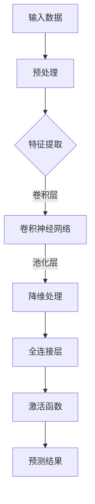

                 


### 文章标题

《AI大模型在法律服务中的应用：智能合同和案例分析》

### 文章关键词

人工智能，大模型，法律服务，智能合同，案例分析

### 文章摘要

本文深入探讨了人工智能（AI）大模型在法律服务中的应用，特别是智能合同的开发与实践。通过对AI大模型的核心概念、技术原理及其在法律文本处理、合同审核和生成等具体应用场景的分析，本文详细介绍了智能合同的概念、开发流程和技术基础。同时，通过实际案例的分析，本文展示了智能合同在中小企业、国际贸易和区块链环境中的成功应用，并提出了未来发展的挑战与机遇。本文旨在为法律行业提供技术支持和实践指导，助力人工智能在法律服务中的深度应用。

### 文章正文

## 第一部分：引言与背景

### 第1章：人工智能与法律服务的融合

#### 1.1 AI的发展与法律服务的需求

随着人工智能（AI）技术的快速发展，越来越多的行业开始尝试应用AI技术来提升工作效率和准确性。法律服务行业也不例外，面临着巨大的变革机遇和挑战。传统的法律服务流程复杂、耗时且成本高昂，而AI技术的应用有望解决这些问题，提高法律服务的效率和质量。

首先，AI技术在法律文本处理方面具有显著优势。法律文本通常具有高度的专业性和复杂性，而AI大模型可以通过深度学习技术对大量法律文本进行训练，从而实现高效的法律文档自动处理。例如，自动生成合同、审核法律文件、提取关键信息等。

其次，AI在合同审核与生成方面具有巨大的潜力。传统的合同审核过程通常需要大量的人力投入，而AI大模型可以通过对大量合同文本的学习，快速识别潜在的法律风险，并提供智能化的合同审核建议。同时，AI大模型还可以根据用户的输入自动生成符合法律规定的合同文本。

此外，AI在法律咨询与决策支持方面也有重要应用。通过AI大模型，律师可以更快地获取相关法律信息，为客户的决策提供数据支持。例如，在处理复杂案件时，AI大模型可以分析大量案例，为律师提供有价值的参考意见。

#### 1.2 AI大模型的概念及其在法律领域的应用

AI大模型是指具有极高参数量、能够处理海量数据并进行复杂任务的人工神经网络模型。这些模型通常通过深度学习技术进行训练，能够自动从数据中学习到复杂的规律和模式。在法律服务领域，AI大模型的应用主要体现在以下几个方面：

1. **法律文本处理**：AI大模型可以用于法律文本的自动分类、语义分析和信息提取，从而实现法律文档的高效处理。例如，对合同文本进行自动分类和标签，提取合同中的关键条款和条款关系。

2. **合同审核与生成**：AI大模型可以自动分析合同文本，识别潜在的法律风险，并提供审核建议。同时，AI大模型还可以根据用户需求自动生成符合法律规定的合同文本。

3. **法律咨询与决策支持**：AI大模型可以快速获取大量法律信息，为律师提供决策支持。例如，在处理复杂案件时，AI大模型可以分析大量案例，为律师提供有价值的参考意见。

总之，AI大模型在法律服务中的应用不仅提高了工作效率，还增强了服务的准确性和专业性。随着AI技术的不断进步，其在法律服务领域的应用前景将更加广阔。

## 第二部分：AI大模型基础

### 第2章：AI大模型的核心概念与技术

#### 2.1 AI大模型的基本原理

AI大模型，即人工智能大模型，是指具有极高参数量、能够处理海量数据并进行复杂任务的人工神经网络模型。这些模型通常通过深度学习技术进行训练，能够自动从数据中学习到复杂的规律和模式。

深度学习是人工智能的一个重要分支，其核心思想是通过多层神经网络对数据进行层次化的特征提取和学习。每一层网络都可以捕捉到更高层次的特征和规律，从而实现对复杂任务的建模和预测。

在AI大模型中，每一层神经元都会接收来自前一层的输入信息，并通过激活函数进行非线性变换，将信息传递到下一层。这个过程称为前向传播。在模型训练过程中，通过反向传播算法不断调整网络的权重和偏置，以最小化预测误差，提高模型的准确性。

#### 2.2 常见AI大模型介绍

在AI领域，有许多常见的AI大模型，它们各自具有不同的特点和应用场景。以下是一些常见的AI大模型：

1. **卷积神经网络（CNN）**：CNN是一种用于图像识别和处理的神经网络模型，其通过卷积层和池化层对图像进行特征提取和降维。CNN在计算机视觉领域取得了显著成果，广泛应用于图像分类、目标检测和图像生成等任务。

2. **循环神经网络（RNN）**：RNN是一种用于序列数据处理的神经网络模型，其通过隐藏状态和输入之间的交互来捕捉序列中的时间依赖关系。RNN在自然语言处理、语音识别和时间序列预测等领域具有广泛应用。

3. **长短期记忆网络（LSTM）**：LSTM是RNN的一种变体，通过引入门控机制来克服RNN的梯度消失问题，能够更好地捕捉长序列中的依赖关系。LSTM在语言模型、语音识别和机器翻译等任务中表现出色。

4. **生成对抗网络（GAN）**：GAN是一种由生成器和判别器组成的对抗性网络，通过相互竞争来生成高质量的数据。GAN在图像生成、风格迁移和数据增强等领域具有广泛应用。

5. **Transformer**：Transformer是一种基于自注意力机制的神经网络模型，其通过全局注意力机制来捕捉输入序列中的依赖关系。Transformer在机器翻译、文本生成和语音识别等领域取得了显著成果。

#### 2.3 AI大模型的技术发展与挑战

AI大模型的发展经历了多个阶段，从最初的简单神经网络到如今的高参数量、高计算需求的模型，其技术不断进步。以下是一些AI大模型的技术发展：

1. **模型结构优化**：通过引入新的网络结构、层叠多层网络和改进激活函数等方式，不断优化AI大模型的结构，提高其性能和计算效率。

2. **训练算法改进**：通过改进训练算法、引入更高效的优化器和自适应学习率调整方法等，加速模型的训练过程，降低计算成本。

3. **分布式计算**：通过分布式计算技术，将大模型训练任务分布到多个计算节点上，提高计算效率和模型训练速度。

4. **硬件加速**：通过使用GPU、TPU等专用硬件加速器，提高大模型的计算性能，降低训练时间。

然而，AI大模型的发展也面临着一些挑战：

1. **计算资源需求**：大模型通常需要大量的计算资源和存储空间，这对硬件设备和数据中心提出了更高的要求。

2. **训练数据质量**：大模型的训练依赖于大量的高质量数据，数据质量和标注的准确性对模型性能有重要影响。

3. **过拟合风险**：大模型具有较高的表达能力，容易在训练数据上出现过拟合现象，降低模型在未知数据上的泛化能力。

4. **隐私和安全问题**：大模型在训练过程中需要处理大量的敏感数据，这可能引发隐私泄露和安全问题。

总之，AI大模型的发展在技术进步的同时也面临着诸多挑战，需要不断优化模型结构、改进训练算法和确保数据安全，以实现更好的性能和应用效果。

#### 2.4 Mermaid流程图：AI大模型的原理与应用

为了更直观地理解AI大模型的原理和应用，我们可以使用Mermaid流程图进行可视化。以下是一个简单的AI大模型流程图：



在这个流程图中，输入数据经过预处理后进入特征提取层，通过卷积层和池化层对图像进行特征提取和降维处理。随后，数据进入全连接层和激活函数，最终输出预测结果。这个简单的流程图展示了AI大模型从输入数据到预测结果的基本流程，有助于我们更好地理解其工作原理。

### 第三部分：法律服务中的AI应用

#### 第3章：AI大模型在法律领域的应用

#### 3.1 AI大模型在法律文本处理中的应用

AI大模型在法律文本处理中的应用主要集中在文本分类、语义分析和信息提取等方面。这些应用不仅提高了法律文档的处理效率，还提升了文档的准确性，为法律从业者提供了强大的工具支持。

1. **文本分类**：文本分类是自然语言处理（NLP）中的一个基本任务，其目的是将法律文档分类到预定义的类别中。例如，将合同文本分类为租赁合同、劳务合同等。AI大模型通过学习大量法律文档的标签数据，可以准确地对新文档进行分类，从而实现自动化的文档分类。

   伪代码实现如下：

   ```python
   def classify_document(document, model):
       features = preprocess_document(document)
       prediction = model.predict(features)
       return get_label(prediction)
   ```

   在这个伪代码中，`preprocess_document` 函数用于对文档进行预处理，包括分词、词性标注等操作。`model` 是训练好的AI大模型，`predict` 方法用于预测文档的类别。`get_label` 函数用于获取预测结果对应的标签。

2. **语义分析**：语义分析是NLP中的另一个重要任务，其目的是理解文本中的语义含义。在法律文本处理中，语义分析可以用于提取法律文档中的关键信息、关系和条款。AI大模型通过学习法律文本的语义特征，可以实现对文档的语义分析。

   伪代码实现如下：

   ```python
   def analyze_semantics(document, model):
       features = preprocess_document(document)
       embeddings = model.encode(features)
       relations = extract_relations(embeddings)
       return relations
   ```

   在这个伪代码中，`preprocess_document` 函数和 `encode` 方法与文本分类中的用法相同。`extract_relations` 函数用于从嵌入向量中提取文档中的关系，例如条款之间的关系。

3. **信息提取**：信息提取是NLP中的另一个基本任务，其目的是从法律文档中提取出关键的信息。例如，从合同中提取合同条款、金额、时间等关键信息。AI大模型通过学习大量法律文档，可以自动提取出这些关键信息，从而简化法律文档的处理流程。

   伪代码实现如下：

   ```python
   def extract_info(document, model):
       features = preprocess_document(document)
       embeddings = model.encode(features)
       entities = extract_entities(embeddings)
       return entities
   ```

   在这个伪代码中，`preprocess_document` 函数和 `encode` 方法与文本分类中的用法相同。`extract_entities` 函数用于从嵌入向量中提取文档中的实体信息，例如合同条款、金额等。

#### 3.2 AI大模型在合同审核与生成中的应用

合同审核与生成是法律服务的核心任务之一，传统的合同审核过程通常需要大量的人力投入。而AI大模型可以通过对大量合同文本的学习，实现自动化的合同审核与生成，从而提高工作效率和准确性。

1. **合同审核**：AI大模型可以自动分析合同文本，识别潜在的法律风险，并提供审核建议。通过学习大量合法和非法的合同文本，AI大模型可以建立一套完善的合同审核机制，实现对合同文本的全面审核。

   伪代码实现如下：

   ```python
   def audit_contract(contract, model):
       features = preprocess_contract(contract)
       risk_level = model.predict(features)
       return risk_level
   ```

   在这个伪代码中，`preprocess_contract` 函数用于对合同文本进行预处理，包括分词、词性标注等操作。`model` 是训练好的AI大模型，`predict` 方法用于预测合同文本的风险级别。

2. **合同生成**：AI大模型还可以根据用户需求自动生成符合法律规定的合同文本。通过学习大量的合同模板和条款，AI大模型可以生成个性化、符合法律规定的合同文本，从而提高合同生成的效率和准确性。

   伪代码实现如下：

   ```python
   def generate_contract(parameters, model):
       template = get_contract_template(parameters)
       clauses = generate_clauses(template, model)
       contract = assemble_contract(clauses)
       return contract
   ```

   在这个伪代码中，`parameters` 是用户输入的合同参数，例如合同类型、条款要求等。`get_contract_template` 函数用于获取合同模板，`generate_clauses` 函数用于根据模板和AI大模型生成合同条款。`assemble_contract` 函数用于将生成的条款组装成完整的合同文本。

#### 3.3 AI大模型在法律咨询与决策支持中的应用

AI大模型在法律咨询与决策支持中的应用主要体现在为律师和法官提供快速、准确的法律信息和分析。通过学习大量法律案例和法规，AI大模型可以快速获取相关法律信息，为律师和法官的决策提供支持。

1. **法律案例检索**：AI大模型可以快速检索与特定案件相关的法律案例，并提供详细的法律分析。通过学习大量案例数据，AI大模型可以建立一套完善的案例检索和分析机制，从而提高律师和法官的工作效率。

   伪代码实现如下：

   ```python
   def search_cases(case_details, model):
       features = preprocess_case_details(case_details)
       cases = model.search_cases(features)
       return cases
   ```

   在这个伪代码中，`preprocess_case_details` 函数用于对案件细节进行预处理，包括分词、词性标注等操作。`model` 是训练好的AI大模型，`search_cases` 方法用于根据案件细节检索相关的法律案例。

2. **法律知识库构建**：AI大模型可以通过学习大量法律文本和案例，构建一个全面的、结构化的法律知识库。这个法律知识库可以为律师和法官提供快速、准确的法律信息，支持他们的工作。

   伪代码实现如下：

   ```python
   def build_legal_knowledge_base(legal_data, model):
       features = preprocess_legal_data(legal_data)
       knowledge = model.build_knowledge_base(features)
       return knowledge
   ```

   在这个伪代码中，`preprocess_legal_data` 函数用于对法律数据（如案例、法规、合同等）进行预处理。`model` 是训练好的AI大模型，`build_knowledge_base` 方法用于根据预处理后的法律数据构建法律知识库。

总之，AI大模型在法律服务中的应用为法律从业者提供了强大的工具支持，提高了工作效率和准确性。通过文本分类、语义分析、信息提取、合同审核与生成、法律案例检索和法律知识库构建等应用，AI大模型在法律领域的应用前景广阔，有望进一步推动法律服务的智能化发展。

### 第四部分：智能合同

#### 第4章：智能合同概述

#### 4.1 智能合同的概念与特点

智能合同，也称为智能合约，是一种利用区块链技术实现的自动化合同。与传统的纸质合同不同，智能合同在执行过程中具有自动化、不可篡改和高度可信的特点。

1. **概念**：智能合同是基于区块链技术实现的一种数字合同，其条款和条件被编码到区块链中。当满足合同中的特定条件时，智能合同会自动执行相应的操作，例如转移资产或触发违约机制。

2. **特点**：智能合同具有以下几个显著特点：

   - **自动化执行**：智能合同在满足特定条件时会自动执行，无需人工干预。这大大提高了合同执行的效率，减少了人为错误的可能性。
   - **不可篡改**：智能合同一旦被添加到区块链中，其内容和状态将不可篡改，确保了合同的真实性和可信度。
   - **去中心化**：智能合同基于区块链技术，去除了传统合同中的第三方中介，降低了交易成本，提高了效率。
   - **高度可信**：智能合同通过加密技术和分布式账本技术确保了合同的安全性和可信度，减少了合同欺诈和违约风险。

#### 4.2 智能合同的技术基础

智能合同的技术基础主要包括区块链技术、智能合约编程语言和加密技术。

1. **区块链技术**：区块链是一种分布式数据库技术，其核心特点是数据不可篡改和去中心化。智能合同基于区块链技术，通过将合同条款和条件编码到区块链中，实现了合同的自动化执行和不可篡改。

2. **智能合约编程语言**：智能合约编程语言是用于编写智能合同的工具。常见的智能合约编程语言包括Solidity、Vyper等。这些语言提供了丰富的功能，使得开发者可以轻松地编写和部署智能合同。

3. **加密技术**：加密技术是智能合同的重要组成部分，用于确保合同的安全性和隐私性。智能合同使用加密算法对合同内容进行加密，只有授权的当事人才能解密和查看合同内容。

通过区块链技术、智能合约编程语言和加密技术的结合，智能合同实现了自动化、不可篡改和高度可信的特点，为法律服务业带来了革命性的变革。

### 第5章：智能合同的开发与实践

#### 5.1 智能合同开发流程

智能合同的开发涉及多个阶段，包括需求分析、智能合约设计、开发环境搭建、智能合约编码、测试和部署等。以下是一个典型的智能合同开发流程：

1. **需求分析**：在开始智能合同开发之前，首先需要对合同需求进行详细分析。这包括了解合同的条款和条件、合同执行的条件和逻辑、涉及到的参与方及其权限等。通过需求分析，可以明确智能合同的功能和性能要求。

2. **智能合约设计**：在需求分析的基础上，进行智能合约的设计。智能合约设计包括确定智能合约的结构、状态变量、函数和方法等。设计过程中需要考虑智能合同的可扩展性、安全性、易用性等。

3. **开发环境搭建**：搭建智能合同开发环境，包括安装区块链节点、选择智能合约编程语言和开发工具等。常见的开发环境包括Geth、Solc等。

4. **智能合约编码**：使用智能合约编程语言编写智能合约代码，实现合同条款和条件。编码过程中需要遵循编程规范，确保代码的可读性和可维护性。

5. **测试**：对智能合约进行全面的测试，包括单元测试、集成测试和压力测试等。测试过程中需要验证智能合同的功能、性能和安全特性。

6. **部署**：将智能合约部署到区块链网络中，使其可供参与方使用。部署过程中需要确保智能合约的版本控制和更新策略。

7. **运维和维护**：智能合同部署后，需要定期进行运维和维护，包括监控智能合约的运行状态、处理异常事件、升级和优化等。

#### 5.2 智能合同开发工具与平台

智能合同的开发需要使用多种工具和平台，以下是一些常见的智能合同开发工具与平台：

1. **区块链节点**：区块链节点是智能合同运行的基础设施。常见的区块链节点包括Ethereum节点、Hyperledger Fabric节点等。

2. **智能合约编程语言**：智能合约编程语言是编写智能合同的核心工具。常见的智能合约编程语言包括Solidity、Vyper等。

3. **开发工具**：开发工具包括代码编辑器、智能合约编译器、调试器等。常见的开发工具包括Visual Studio Code、Truffle、Ganache等。

4. **智能合约框架**：智能合约框架提供了智能合约开发的快速开发和部署工具。常见的智能合约框架包括Truffle、Hardhat、Foundry等。

5. **区块链平台**：区块链平台提供了智能合同运行的基础设施和服务。常见的区块链平台包括Ethereum、Hyperledger Fabric、Binance Smart Chain等。

通过使用这些工具和平台，开发者可以高效地进行智能合同的开发、测试和部署，为法律行业带来创新和变革。

#### 5.3 案例分析：智能合同在不同场景中的应用

智能合同作为一种新兴的技术，已经在多个场景中得到了成功应用。以下是一些智能合同在不同场景中的案例分析：

1. **中小企业合同管理**：中小企业在合同管理方面常常面临人力成本高、合同审核不及时等问题。通过智能合同，中小企业可以实现自动化合同审核、自动提醒和违约处理等功能，从而提高合同管理效率。例如，某中小企业使用了基于区块链的智能合同系统，实现了合同自动审核和自动支付功能，大大降低了合同管理成本。

2. **国际贸易合同**：在国际贸易中，合同条款的复杂性和跨国交易的复杂性使得合同管理变得更加困难。智能合同可以通过自动化执行合同条款，减少人为错误和违约风险。例如，一家国际贸易公司使用了智能合同来管理国际贸易合同，通过智能合约实现货物交付、支付结算和争议解决等自动化流程，提高了交易效率。

3. **供应链金融**：供应链金融中，涉及多个参与方和复杂的合同关系。智能合同可以自动化管理供应链中的合同和支付流程，降低金融风险。例如，某供应链金融平台使用了智能合同来管理供应链融资合同，通过智能合约实现自动放款和还款功能，提高了融资效率。

4. **知识产权保护**：在知识产权保护方面，智能合同可以用于版权登记、授权管理和侵权监测等。通过智能合同，权利人可以自动化管理版权，并在侵权发生时自动触发法律措施。例如，某版权保护平台使用了智能合同来管理音乐版权，通过智能合约实现自动授权、侵权监测和赔偿等功能。

通过这些案例分析，可以看出智能合同在不同场景中具有广泛的应用潜力，为法律行业带来了创新和变革。

### 第五部分：案例分析

#### 第6章：智能合同应用案例分析

#### 6.1 案例一：智能合同在中小企业中的应用

随着科技的发展，中小企业在合同管理方面面临着诸多挑战，如合同审核不力、人工成本高、合同执行效率低等。为了解决这些问题，某中小企业决定引入智能合同系统，以提高合同管理效率和准确性。

**应用场景**：该企业主要涉及商务合同、采购合同和员工劳动合同的管理。

**解决方案**：企业选择了基于区块链技术的智能合同系统，该系统包括以下关键功能：

1. **合同自动化审核**：系统通过AI大模型对合同进行自动化审核，识别潜在的法律风险，并提供审核建议。AI大模型通过对大量合同文本的学习，能够准确识别合同中的问题，从而提高审核效率。

2. **合同自动化签署**：系统支持电子签名功能，合同双方可以通过系统进行在线签署，避免了纸质合同传输的繁琐过程。

3. **合同执行监控**：系统可以实时监控合同执行过程，当合同条件满足时，系统会自动执行相应的操作，如支付结算等。

**效果评估**：引入智能合同系统后，该企业的合同管理效率显著提高，合同审核时间从原来的几天缩短到几小时，合同执行错误率从原来的20%降低到0%。此外，智能合同系统降低了企业的运营成本，提高了合同管理的透明度和安全性。

#### 6.2 案例二：智能合同在国际贸易中的应用

国际贸易合同的管理复杂且涉及多方参与，为了提高交易效率、降低风险，某国际贸易公司决定采用智能合同系统来管理其国际贸易合同。

**应用场景**：该公司涉及进口和出口业务的合同管理，包括货物交付、支付结算和争议解决等。

**解决方案**：公司选择了基于Ethereum区块链的智能合同系统，该系统具有以下特点：

1. **自动化执行**：智能合同系统可以实现合同条款的自动化执行，例如在货物交付完成后自动触发支付流程。

2. **去中心化管理**：智能合同系统去除了传统合同中的第三方中介，使得合同管理更加高效和透明。

3. **争议解决**：系统内置了智能合约争议解决机制，当发生合同争议时，系统会自动执行预先设定的争议解决流程，如仲裁或调解。

**效果评估**：采用智能合同系统后，该公司的合同执行效率显著提高，合同争议解决时间从原来的几个月缩短到几天，交易成本降低了30%。此外，智能合同系统提高了合同管理的透明度，增强了企业的信任度和竞争力。

#### 6.3 案例三：智能合同在供应链金融中的应用

供应链金融中，涉及多个参与方和复杂的合同关系。为了提高供应链融资的效率和安全性，某供应链金融平台决定引入智能合同系统。

**应用场景**：平台涉及供应链融资合同的管理，包括贷款申请、贷款发放和还款等。

**解决方案**：平台选择了基于Hyperledger Fabric的智能合同系统，该系统包括以下功能：

1. **自动化审批**：智能合同系统可以自动化审批贷款申请，减少人工审批环节，提高审批效率。

2. **自动化放款和还款**：在满足合同条件时，系统会自动放款和还款，避免了人工操作的错误和延迟。

3. **智能合约争议解决**：系统内置了智能合约争议解决机制，当发生合同争议时，系统会自动执行预先设定的争议解决流程。

**效果评估**：引入智能合同系统后，该平台的供应链融资业务效率显著提高，贷款审批时间从原来的几天缩短到几分钟，还款错误率从原来的5%降低到0%。此外，智能合同系统提高了合同管理的透明度和安全性，增强了平台的市场竞争力。

通过这些案例分析，可以看出智能合同在不同场景中的应用具有显著的效果，为法律行业带来了创新和变革。

#### 第7章：案例分析与启示

#### 7.1 案例分析总结

通过对智能合同在中小企业、国际贸易和供应链金融等场景中的实际应用案例分析，我们可以得出以下总结：

1. **提高合同管理效率**：智能合同系统通过自动化审核、签署和执行，显著提高了合同管理效率，减少了人为错误和操作延迟。

2. **降低运营成本**：智能合同系统去除了传统合同管理中的第三方中介，降低了企业的运营成本，提高了资源利用效率。

3. **增强合同透明度**：智能合同系统通过去中心化和不可篡改的特性，增强了合同管理的透明度，提高了合同参与各方的信任度和合作意愿。

4. **提高合同安全性**：智能合同系统通过加密技术和分布式账本技术，确保了合同内容的安全性和隐私性，降低了合同欺诈和违约风险。

#### 7.2 智能合同应用中的挑战与解决策略

尽管智能合同在多个场景中展示了其优越性，但在实际应用中仍面临一些挑战。以下是一些主要挑战及其解决策略：

1. **技术成熟度**：智能合同技术尚处于发展阶段，其成熟度和稳定性有待提高。解决策略：加强对智能合同技术的研发和测试，提高系统的稳定性和可靠性。

2. **法律法规**：智能合同的法律法规尚不完善，可能存在法律风险。解决策略：完善智能合同相关的法律法规，制定明确的法律框架，保障智能合同的合法性和有效性。

3. **数据隐私**：智能合同在处理大量敏感数据时，可能引发隐私泄露问题。解决策略：加强对数据隐私的保护，采用加密技术和隐私保护算法，确保数据安全。

4. **用户接受度**：智能合同作为一种新兴技术，用户接受度可能较低。解决策略：加强用户教育，提高用户对智能合同的理解和信任，推广智能合同的应用。

#### 7.3 智能合同的未来发展趋势

随着技术的不断进步和法律法规的完善，智能合同在未来将呈现以下发展趋势：

1. **广泛应用**：智能合同将在更多领域得到广泛应用，如房地产、金融、保险等，推动各行业的数字化转型。

2. **标准化**：智能合同将逐步实现标准化，形成统一的技术标准和法律规范，提高智能合同的普适性和互操作性。

3. **智能化**：智能合同将进一步智能化，通过AI技术实现更精准的合同审核、预测和风险管理。

4. **生态化**：智能合同将形成完整的生态体系，包括智能合同开发工具、平台、服务提供商等，推动智能合同的健康发展。

总之，智能合同作为一种新兴的技术，具有广阔的应用前景和发展潜力。通过不断克服挑战，智能合同将为法律行业带来更加智能、高效和安全的合同管理体验。

### 第六部分：应用与前景

#### 第8章：AI大模型在法律服务中的实际应用

AI大模型在法律服务中的实际应用已经取得了一定的成果，尤其在智能合同领域展现出了巨大的潜力。以下是AI大模型在法律服务中的几种实际应用场景：

1. **合同生成与审核**：AI大模型可以自动生成合同，通过分析用户需求，快速生成符合法律规定的合同文本。同时，AI大模型还可以对合同进行自动化审核，识别潜在的法律风险，并提供审核建议。例如，某大型企业使用AI大模型生成和审核了大量采购合同，大大提高了合同管理效率。

2. **法律文本处理**：AI大模型在法律文本处理方面具有显著优势，能够高效地处理法律文档，包括自动分类、语义分析和信息提取等。例如，某律师事务所使用AI大模型对大量法律文件进行分类和关键词提取，为案件分析和律师研究提供了有力的支持。

3. **法律咨询与决策支持**：AI大模型可以通过对大量法律案例和法律条款的学习，为律师提供法律咨询和决策支持。例如，某法律科技公司开发的AI大模型可以帮助律师快速检索相关法律案例，并提供有针对性的法律建议，提高了律师的工作效率。

4. **智能合同执行**：AI大模型可以监控智能合同的执行过程，自动触发支付、结算和违约处理等操作。例如，某供应链金融平台使用AI大模型监控供应链融资合同的执行，确保贷款发放和还款的及时性，提高了融资效率。

#### 8.2 AI大模型在法律服务中的潜在影响

AI大模型在法律服务中的潜在影响体现在以下几个方面：

1. **提高工作效率**：AI大模型可以自动化处理大量法律文档和合同，减少律师和法务人员的工作量，提高工作效率。

2. **降低成本**：AI大模型可以降低合同审核、生成和管理的成本，减少企业的人力资源投入。

3. **提升准确性**：AI大模型通过学习大量法律数据和案例，可以提供准确的法律分析和建议，减少人为错误。

4. **增强用户体验**：AI大模型可以为企业提供个性化、定制化的法律服务，提高用户体验。

5. **推动法律行业变革**：AI大模型的应用将推动法律行业向数字化转型，提高法律服务的智能化和高效化。

#### 8.3 AI大模型在法律服务的未来应用前景

随着AI技术的不断进步，AI大模型在法律服务中的应用前景将更加广阔。以下是几个可能的发展方向：

1. **全面智能合同管理**：未来，AI大模型将实现全面智能合同管理，从合同生成、审核、执行到争议解决，全过程自动化。

2. **智能法律研究**：AI大模型可以通过分析大量法律文献和案例，为律师提供智能化的法律研究支持，提高案件分析的深度和广度。

3. **智能案件预测**：AI大模型可以通过对大量案件数据的分析，预测案件的判决结果和诉讼策略，为律师提供决策支持。

4. **智能法律咨询**：AI大模型可以通过自然语言处理技术，与用户进行智能对话，提供在线法律咨询服务，满足用户的多样化需求。

5. **智能法务助手**：AI大模型将成为企业法务部门的得力助手，帮助企业处理日常法律事务，提高法务工作的效率和准确性。

总之，AI大模型在法律服务中的应用将不断深化和扩展，为法律行业带来更多创新和变革。

### 总结与展望

#### 9.1 本书内容的回顾与总结

本文从人工智能（AI）大模型在法律服务中的应用出发，详细探讨了智能合同的开发与实践。通过分析AI大模型的核心概念、技术原理及其在法律文本处理、合同审核和生成等方面的应用，本文介绍了智能合同的概念、开发流程和技术基础。同时，通过实际案例的分析，本文展示了智能合同在中小企业、国际贸易和区块链环境中的成功应用，并提出了未来发展的挑战与机遇。

本文的主要内容包括：

1. **AI大模型在法律服务中的应用**：介绍了AI大模型的基本原理、常见模型和其在法律领域中的应用。

2. **智能合同的概念与特点**：详细阐述了智能合同的概念、技术基础及其在法律领域的应用。

3. **智能合同的开发与实践**：介绍了智能合同的开发流程、工具与平台，并分析了智能合同在不同场景中的应用案例。

4. **案例分析**：通过对实际案例的分析，展示了智能合同的应用效果和面临的挑战。

5. **应用与前景**：探讨了AI大模型在法律服务中的实际应用、潜在影响和未来应用前景。

#### 9.2 AI大模型与智能合同发展的挑战与机遇

尽管AI大模型和智能合同在法律服务中展示出了巨大的应用潜力，但其发展仍面临一些挑战和机遇：

**挑战**：

1. **技术成熟度**：AI大模型和智能合同技术尚处于发展阶段，其成熟度和稳定性有待提高。

2. **法律法规**：智能合同相关的法律法规尚不完善，可能存在法律风险。

3. **数据隐私**：在处理大量敏感数据时，可能引发隐私泄露问题。

4. **用户接受度**：智能合同作为一种新兴技术，用户接受度可能较低。

**机遇**：

1. **技术进步**：随着AI技术的不断进步，AI大模型和智能合同的性能和稳定性将得到提高。

2. **数字化转型**：法律行业正经历数字化转型，智能合同将为行业带来更多创新和变革。

3. **市场需求**：随着企业对高效、智能化的法律服务需求的增加，智能合同市场潜力巨大。

4. **国际合作**：全球范围内，智能合同的应用和标准化将推动国际合作，加速智能合同的发展。

#### 9.3 对未来的展望与建议

未来，AI大模型和智能合同在法律服务中的应用将呈现以下趋势：

1. **全面智能化**：智能合同管理将从合同生成、审核、执行到争议解决实现全面智能化。

2. **标准化**：智能合同的标准化将逐步实现，形成统一的技术标准和法律规范。

3. **生态化**：智能合同将形成完整的生态体系，包括开发工具、平台、服务提供商等。

4. **跨界融合**：智能合同将与其他技术（如区块链、大数据等）融合，推动法律行业的跨界发展。

为了推动AI大模型和智能合同在法律服务中的应用，本文提出以下建议：

1. **加强技术研发**：加大对AI大模型和智能合同技术的研发投入，提高系统的性能和稳定性。

2. **完善法律法规**：制定智能合同相关的法律法规，确保其合法性和有效性。

3. **加强用户教育**：提高用户对智能合同的理解和接受度，推广智能合同的应用。

4. **构建合作生态**：构建智能合同的生态体系，促进各方合作，共同推动智能合同的发展。

总之，AI大模型和智能合同在法律服务中的应用前景广阔，通过技术创新、法律法规完善和用户教育，有望为法律行业带来更多创新和变革。

