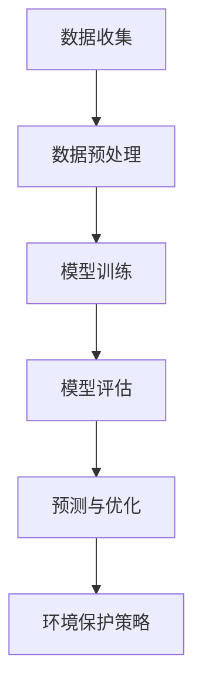

                 


### 1.1 环境保护的重要性

环境保护是一项全球性的任务，它关乎人类未来的生存和发展。随着工业化和城市化的加速发展，环境问题日益严重。气候变化、空气污染、水资源短缺、土地退化等环境问题不仅影响人类的生活质量，也对生态系统和地球气候产生了深远的影响。

#### 1.1.1 环境问题的现状与挑战

目前，全球环境问题主要包括以下几个方面：

- **气候变化**：全球温度上升，极端天气事件增多，海平面上升，冰川融化等。
- **空气污染**：PM2.5、PM10、氮氧化物和挥发性有机化合物等污染物浓度升高，导致呼吸系统疾病增加。
- **水资源短缺**：全球有超过二十亿人面临水资源短缺问题，水污染问题也日益严重。
- **土地退化**：土壤侵蚀、荒漠化和盐碱化等问题威胁着全球农业生产和生态系统稳定性。

这些环境问题给全球社会和经济带来了巨大的挑战，需要采取有效的措施进行应对。

#### 1.1.2 气候变化对环境的影响

气候变化对环境的影响是多方面的，主要包括：

- **生态系统破坏**：气候变化改变了生物的生存环境，导致物种灭绝和生物多样性下降。
- **农业生产受损**：气候变化影响了作物的生长周期和产量，导致农业生产不稳定。
- **水资源管理困难**：气候变化导致水资源的分布不均，增加了水资源管理的难度。
- **人类健康威胁**：气候变化加剧了热浪、洪水等极端天气事件的发生，对人类健康构成威胁。

#### 1.1.3 AI大模型在环境保护中的潜在价值

随着人工智能技术的不断发展，AI大模型在环境保护中的应用前景十分广阔。AI大模型能够通过对大量数据的分析和处理，提供更加精准的环境预测和解决方案，具有以下几个方面的潜在价值：

- **气候变化预测**：AI大模型可以通过对气候数据的分析，预测未来气候变化的趋势，为环境保护决策提供科学依据。
- **环境监测与预警**：AI大模型可以实时监测环境数据，及时发现环境问题，为应对措施提供及时预警。
- **资源优化管理**：AI大模型可以帮助优化水资源、能源等资源的分配和管理，提高资源利用效率。
- **决策支持**：AI大模型可以为政府和企业提供科学的环境保护决策支持，提高环境保护工作的有效性。

### 1.2 AI大模型的发展与现状

AI大模型的发展经历了多个阶段，从最初的神经网络到深度学习，再到如今的大型预训练模型，其技术不断进步，应用领域也日益扩大。

#### 1.2.1 AI大模型的基本原理

AI大模型的核心是神经网络，特别是深度学习网络。神经网络通过模拟人脑神经元之间的连接方式，对大量数据进行学习，从而实现特征提取和模式识别。深度学习网络通过多层神经网络结构，可以处理更复杂的数据和任务。

#### 1.2.2 AI大模型的关键技术

AI大模型的关键技术包括：

- **大数据处理**：AI大模型需要处理海量数据，大数据处理技术是其基础。
- **并行计算**：为了提高训练速度，AI大模型依赖于并行计算技术，如GPU和TPU。
- **优化算法**：优化算法是提高模型性能的关键，如梯度下降、Adam优化器等。
- **模型压缩**：为了在实际应用中减少计算资源和存储需求，模型压缩技术至关重要。

#### 1.2.3 AI大模型的应用领域

AI大模型在多个领域得到了广泛应用，其中包括：

- **自然语言处理**：用于文本分类、机器翻译、问答系统等。
- **计算机视觉**：用于图像识别、目标检测、图像生成等。
- **语音识别**：用于语音识别、语音合成等。
- **推荐系统**：用于商品推荐、新闻推荐等。
- **医疗诊断**：用于疾病诊断、药物研发等。

### 1.3 本书结构概述

本书分为四个主要部分，旨在深入探讨AI大模型在环境保护中的应用：

- **第一部分：引言与背景**：介绍环境保护的重要性，AI大模型的发展现状及其在环境保护中的潜在价值。
- **第二部分：AI大模型在环境保护中的应用原理**：详细讲解AI大模型在环境保护中的应用原理，包括核心概念、算法原理和数学模型。
- **第三部分：AI大模型在环境保护中的应用实践**：通过实际案例，展示AI大模型在环境保护中的应用实践，包括开发环境搭建、源代码实现和解读。
- **第四部分：总结与展望**：总结全书内容，展望AI大模型在环境保护中的未来发展。

通过本书的阅读，读者可以全面了解AI大模型在环境保护中的应用，掌握相关技术原理和实践方法，为未来的环境保护工作提供有力的支持。

## 1.3 本书结构概述

本书旨在深入探讨AI大模型在环境保护中的应用，分为四个主要部分，每个部分都针对不同的主题进行详细讲解：

### 第一部分：引言与背景

本部分将介绍环境保护的重要性，以及AI大模型的发展现状及其在环境保护中的潜在价值。我们首先将探讨当前环境问题的现状和挑战，包括气候变化、空气污染、水资源短缺和土地退化等。通过分析这些环境问题对生态系统和人类生活的影响，我们将阐述为什么环境保护变得如此紧迫和重要。

接下来，我们将深入探讨AI大模型的原理和发展，解释为什么这种先进的计算技术能够在环境保护中发挥关键作用。我们将介绍AI大模型的基本概念、核心技术，如深度学习和生成对抗网络（GAN），以及它们在环境保护领域中的应用。

最后，我们将概述本书的结构，介绍每个部分的主要内容，并说明读者在本书中可以期待获得的知识和技能。通过这部分的学习，读者将建立起对AI大模型在环境保护中应用的整体认识，为后续章节的深入学习打下基础。

### 第二部分：AI大模型在环境保护中的应用原理

本部分将深入探讨AI大模型在环境保护中的应用原理，分为三个主要子部分：

#### 2.1 核心概念与联系

在这一部分，我们将详细介绍与AI大模型在环境保护应用相关的核心概念。首先，我们将讨论气候变化预测的基本概念，包括气候系统的基本组成、气候变化的驱动因素和气候变化对环境的影响。接着，我们将介绍AI大模型在气候变化预测中的角色，解释它们如何通过处理大量数据来识别和预测气候变化的趋势。

为了更好地理解这些概念之间的联系，我们将使用Mermaid流程图来展示AI大模型在气候变化预测中的应用流程。这个流程图将包括数据收集、数据预处理、模型训练、模型评估和预测结果展示等步骤。通过这种视觉化的方式，读者可以直观地理解AI大模型在环境保护中的应用过程。

#### 2.2 核心算法原理讲解

在这一部分，我们将详细讲解AI大模型在环境保护中的核心算法原理。首先，我们将回顾机器学习算法的基本概念，包括监督学习、无监督学习和强化学习。接着，我们将重点介绍生成对抗网络（GAN）的原理和应用，解释GAN如何通过生成器和判别器的对抗训练来生成高质量的模拟数据，从而在气候变化预测中发挥作用。

为了使读者更好地理解这些算法，我们将使用伪代码来详细阐述这些算法的实现步骤。例如，我们将展示如何使用GAN来预测未来气候数据，包括生成器的架构、判别器的训练过程以及如何通过这些模型生成具有真实性的模拟数据。

#### 2.3 数学模型与公式

在这一部分，我们将探讨AI大模型在环境保护中的数学模型和公式。首先，我们将介绍用于气候变化预测的基本数学模型，包括时间序列分析和统计模型。这些模型将帮助我们理解如何通过历史气候数据来预测未来的气候变化趋势。

接着，我们将使用LaTeX格式介绍具体的数学公式，并详细讲解这些公式的意义和计算过程。例如，我们将介绍如何使用时间序列模型来预测未来的气候变量，并使用LaTeX格式展示相关的数学公式。通过这种方式，读者可以更好地理解这些数学模型在实际应用中的计算过程。

### 第三部分：AI大模型在环境保护中的应用实践

本部分将通过实际案例展示AI大模型在环境保护中的应用实践，分为三个主要子部分：

#### 3.1 案例研究：AI大模型在气候变化预测中的应用

在这一部分，我们将详细探讨一个具体的案例研究，展示AI大模型在气候变化预测中的应用。我们将介绍该案例的研究背景，包括数据集的来源和特点，以及预测目标。接着，我们将描述如何搭建开发环境，包括所需的软件和硬件资源，以及数据预处理和模型训练的步骤。

为了使读者更好地理解，我们将详细展示模型的源代码实现，并解释每个步骤的代码含义。通过这种方式，读者可以实际操作和运行这个模型，理解AI大模型在气候变化预测中的具体应用。

#### 3.2 案例研究：AI大模型在气候变化应对中的应用

在这一部分，我们将探讨另一个案例研究，展示AI大模型在气候变化应对中的应用。我们将介绍这个案例的研究背景，包括应对策略的制定和实施过程。接着，我们将描述如何使用AI大模型来优化这些策略，提高应对效果。

同样，我们将详细展示模型的源代码实现，并解释每个步骤的代码含义。通过这种方式，读者可以了解AI大模型如何在实际环境保护工作中发挥作用。

#### 3.3 未来展望与挑战

在这一部分，我们将讨论AI大模型在环境保护中的应用前景和面临的挑战。我们将分析AI大模型在环境保护中的未来发展，包括新技术的引入、更广泛的应用领域和潜在的创新点。同时，我们也将探讨当前面临的技术挑战，如数据隐私、计算资源限制和算法伦理问题，并提出可能的解决方案。

通过这些讨论，读者可以更全面地了解AI大模型在环境保护中的应用现状和未来趋势。

### 第四部分：总结与展望

本部分的目的是对全书的内容进行总结，并展望AI大模型在环境保护中的未来发展。首先，我们将回顾全书的主要知识点，包括核心概念、算法原理、应用实践和面临的挑战。接着，我们将讨论这些知识点在实际环境保护工作中的应用，并分析AI大模型如何为未来的环境保护工作提供支持。

最后，我们将提供一些建议，帮助读者进一步学习和探索AI大模型在环境保护中的应用。我们将介绍一些最佳实践技巧，提醒读者注意的事项，并提供一些拓展阅读资源，以便读者深入了解相关领域的最新研究成果和技术动态。

通过本部分的总结和展望，读者可以巩固对AI大模型在环境保护中应用的理解，为未来的学习和实践做好准备。

## 2.1 核心概念与联系

为了深入探讨AI大模型在环境保护中的应用，我们需要首先了解与之相关的核心概念及其相互之间的联系。在这一部分，我们将详细阐述以下核心概念：气候变化预测的基本概念、AI大模型在气候变化预测中的角色，以及AI大模型在环境保护中的应用流程。

### 2.1.1 气候变化预测的基本概念

气候变化预测是指利用历史气候数据、气象模式和物理原理，对未来气候变化的趋势和可能性进行预测。为了实现这一目标，我们需要了解以下基本概念：

- **气候系统**：气候系统是由大气、海洋、陆地表面和冰冻层等多个组成部分构成的一个复杂系统。这些组成部分相互影响，共同决定了地球的气候状态。
- **气候变化的驱动因素**：气候变化的驱动因素主要包括自然因素（如太阳辐射变化、火山活动等）和人为因素（如温室气体排放、土地利用变化等）。这些因素通过改变气候系统的能量平衡，导致了气候的变化。
- **气候变化的影响**：气候变化对环境、生态系统、人类社会和经济产生了深远的影响。例如，海平面上升威胁沿海地区，极端天气事件加剧了灾害风险，农业生产受损，水资源管理面临挑战等。

### 2.1.2 AI大模型在气候变化预测中的角色

AI大模型在气候变化预测中扮演着重要角色，主要体现在以下几个方面：

- **数据处理能力**：AI大模型能够处理海量数据，包括气象数据、海浪数据、土壤数据等。通过对这些数据的分析和处理，AI大模型可以提取出隐藏在数据中的模式和趋势。
- **模式识别能力**：AI大模型，尤其是深度学习模型，具有强大的模式识别能力。它们能够从大量历史气候数据中识别出气候变化的规律，从而提高预测的准确性。
- **预测能力**：AI大模型能够根据历史数据和现有条件，预测未来的气候变化趋势。这种预测能力对于制定环境保护政策和应对措施具有重要意义。

### 2.1.3 AI大模型在环境保护中的应用流程

为了更好地理解AI大模型在环境保护中的应用，我们将使用Mermaid流程图展示其应用流程。这个流程图将包括以下主要步骤：

1. **数据收集**：从各种来源（如气象站、卫星、海洋观测站等）收集相关的气候数据。
2. **数据预处理**：对收集到的数据进行清洗、归一化和特征提取，以确保数据的质量和一致性。
3. **模型训练**：使用历史气候数据对AI大模型进行训练，使其能够学习到气候变化的规律。
4. **模型评估**：通过交叉验证等方法评估模型性能，确保其预测结果的准确性和可靠性。
5. **预测与优化**：使用训练好的模型进行未来气候变化的预测，并根据预测结果优化环境保护策略。

以下是该应用流程的Mermaid流程图表示：



通过这个流程图，我们可以直观地看到AI大模型在环境保护中的应用步骤和关键环节。每个步骤都是基于科学原理和实际需求设计的，以确保最终的环境保护策略能够有效地应对气候变化挑战。

### 2.1.4 核心概念之间的联系

在环境保护领域，气候变化预测、AI大模型和环境保护策略之间存在着密切的联系。这些核心概念相互关联，共同构成了一个完整的应用体系。

- **气候变化预测与环境保护策略**：气候变化预测为环境保护策略提供了科学依据。通过预测未来的气候变化趋势，我们可以提前制定和调整环境保护措施，以减少环境风险。
- **AI大模型与环境保护策略**：AI大模型通过高效的数据处理和模式识别，为环境保护策略提供了强大的技术支持。它可以实时监测环境数据，预测环境变化，并为环境保护决策提供精确的预测结果。
- **环境保护策略与气候变化预测**：环境保护策略的实施效果直接影响气候变化预测的准确性。有效的环境保护措施可以减缓气候变化，提高气候预测的可靠性。

总之，AI大模型在环境保护中的应用是一个复杂但充满前景的领域。通过深入理解核心概念之间的联系，我们可以更好地发挥AI大模型在环境保护中的作用，为应对气候变化挑战提供有力支持。

## 2.2 核心算法原理讲解

在了解了AI大模型在环境保护中的核心概念与联系之后，我们接下来将深入探讨AI大模型在环境保护中应用的核心算法原理。本部分将分为三个主要子部分：机器学习算法概述、生成对抗网络（GAN）及其在气候变化预测中的应用，以及伪代码的详细解释。

### 2.2.1 机器学习算法概述

机器学习算法是AI大模型的核心组成部分，它们通过从数据中学习，以实现特定任务的目标。机器学习算法主要分为以下几类：

- **监督学习**：监督学习算法通过已标记的训练数据来学习，从而对新的数据进行预测。常见的监督学习算法包括线性回归、逻辑回归、决策树、随机森林和支持向量机（SVM）等。
- **无监督学习**：无监督学习算法不使用已标记的数据，而是通过发现数据中的内在结构或模式来进行学习。常见的无监督学习算法包括聚类算法（如K-means、层次聚类）、主成分分析（PCA）和自编码器等。
- **强化学习**：强化学习算法通过与环境的交互来学习最佳策略，以实现长期目标。常见的强化学习算法包括Q-learning、SARSA和深度确定性策略梯度（DDPG）等。

在环境保护中，监督学习算法常用于环境监测和预测，例如，通过分析历史气象数据来预测未来的气候变化趋势。无监督学习算法则可以用于识别环境数据中的异常值和模式，如发现污染物排放的异常变化。强化学习算法可以用于优化环境保护策略，例如，通过模拟和优化不同减排策略的效果，以找到最佳的环境保护方案。

### 2.2.2 生成对抗网络（GAN）

生成对抗网络（GAN）是一种深度学习模型，由生成器和判别器两部分组成。生成器的目标是生成逼真的数据，而判别器的目标是区分真实数据和生成数据。GAN通过这两个对抗性组件之间的博弈来学习数据分布，从而生成高质量的模拟数据。

#### GAN的工作原理

GAN的工作原理可以概括为以下步骤：

1. **初始化生成器和判别器**：生成器和判别器都是深度神经网络，通常具有多层结构。生成器接收随机噪声作为输入，生成模拟数据。判别器接收真实数据和模拟数据作为输入，输出一个概率值，表示输入数据是真实数据还是生成数据。
2. **生成器与判别器的训练**：生成器和判别器交替进行训练。在每次迭代中，生成器尝试生成更逼真的模拟数据，而判别器尝试更好地区分真实数据和生成数据。生成器和判别器的损失函数分别为生成损失和判别损失。
3. **稳定博弈**：随着训练的进行，生成器和判别器的性能逐渐提高，两者之间形成一种稳定的博弈状态。在这个状态下，生成器能够生成几乎无法区分于真实数据的模拟数据，而判别器也无法轻易地判断输入数据是真实数据还是生成数据。

#### GAN在气候变化预测中的应用

在气候变化预测中，GAN可以通过以下方式发挥作用：

1. **数据增强**：GAN可以用于增强训练数据集，通过生成更多的模拟气候数据，提高模型的泛化能力。这有助于模型更好地学习气候变化的复杂模式，从而提高预测准确性。
2. **异常值检测**：GAN可以用于检测环境数据中的异常值。通过对真实数据和生成数据进行比较，GAN可以识别出那些与整体数据分布不一致的数据点，从而帮助环境监测和预警。
3. **模式生成**：GAN可以用于生成具有特定特征的历史气候数据，如模拟极端天气事件的数据。这些生成的数据可以用于测试和优化气候变化预测模型的性能。

### 2.2.3 伪代码

为了更好地理解GAN的工作原理和应用，我们将使用伪代码详细解释GAN的训练过程。

```python
# GAN伪代码

# 初始化生成器和判别器
Generator(G)
Discriminator(D)

# 初始化生成器损失函数和判别器损失函数
G_loss = AdversarialLoss()
D_loss = BinaryCrossEntropyLoss()

# 训练循环
for epoch in range(num_epochs):
    for real_data in real_data_loader:
        # 判别器训练
        D.zero_grad()
        D_real = D(real_data)
        D_real_loss = D_loss(D_real, torch.ones(size=D_real))
        
        # 生成器训练
        G.zero_grad()
        z = torch.randn(size=batch_size, device=device)
        fake_data = G(z)
        D_fake = D(fake_data)
        G_loss = D_loss(D_fake, torch.zeros(size=D_fake))
        
        # 反向传播和优化
        G_loss.backward()
        D_real_loss.backward()
        
        optimizer_G.step()
        optimizer_D.step()

    # 记录训练进度
    print(f"Epoch [{epoch+1}/{num_epochs}], G_loss: {G_loss.item()}, D_loss: {D_loss.item()}")
```

在这个伪代码中，`Generator` 和 `Discriminator` 分别表示生成器和判别器的类，`AdversarialLoss` 和 `BinaryCrossEntropyLoss` 分别表示生成器和判别器的损失函数。`real_data_loader` 是真实数据的加载器，`z` 是生成随机噪声用于生成模拟数据。在每个训练周期中，我们首先训练判别器，使其能够更好地区分真实数据和生成数据，然后训练生成器，使其能够生成更逼真的模拟数据。通过这种方式，生成器和判别器在博弈过程中不断优化，最终生成器能够生成几乎无法区分于真实数据的模拟数据。

通过以上对机器学习算法概述、生成对抗网络（GAN）原理及其在气候变化预测中的应用，以及伪代码的详细解释，我们可以更好地理解AI大模型在环境保护中的应用原理。这为后续的实际应用和项目实战奠定了坚实的理论基础。

## 2.3 数学模型与公式

在理解了AI大模型在环境保护中的核心概念和算法原理之后，我们接下来将探讨其背后的数学模型和公式。数学模型在AI大模型的应用中起着至关重要的作用，它们帮助我们理解和实现气候变化的预测与应对。以下是我们将介绍的几个关键数学模型和公式：

### 2.3.1 时间序列模型

时间序列模型是用于分析时间序列数据的一种数学模型，它可以捕捉数据中的时间依赖性和趋势变化。在气候变化预测中，时间序列模型可以帮助我们分析历史气候数据，从而预测未来的气候变化趋势。常见的几种时间序列模型包括：

#### 1. 自回归模型（AR）

自回归模型（AR）假设当前时间点的值是前几个时间点值的线性组合。其数学公式如下：

$$
Y_t = c + \sum_{i=1}^{p} \phi_i Y_{t-i}
$$

其中，$Y_t$ 是当前时间点的值，$c$ 是常数项，$\phi_i$ 是自回归系数，$p$ 是滞后阶数。

#### 2. 移动平均模型（MA）

移动平均模型（MA）假设当前时间点的值是前几个时间点值的移动平均。其数学公式如下：

$$
Y_t = c + \sum_{i=1}^{q} \theta_i \epsilon_{t-i}
$$

其中，$Y_t$ 是当前时间点的值，$c$ 是常数项，$\theta_i$ 是移动平均系数，$\epsilon_{t-i}$ 是白噪声。

#### 3. 自回归移动平均模型（ARMA）

自回归移动平均模型（ARMA）结合了自回归模型和移动平均模型的特点，其数学公式如下：

$$
Y_t = c + \sum_{i=1}^{p} \phi_i Y_{t-i} + \sum_{i=1}^{q} \theta_i \epsilon_{t-i}
$$

其中，$Y_t$ 是当前时间点的值，$c$ 是常数项，$\phi_i$ 是自回归系数，$\theta_i$ 是移动平均系数。

#### 4. 自回归积分移动平均模型（ARIMA）

自回归积分移动平均模型（ARIMA）是ARMA模型的扩展，它引入了差分操作以使时间序列平稳。其数学公式如下：

$$
Y_t = c + \sum_{i=1}^{p} \phi_i (Y_{t-i} - \mu) + \theta \epsilon_{t-i}
$$

其中，$Y_t$ 是当前时间点的值，$c$ 是常数项，$\phi_i$ 是自回归系数，$\theta$ 是移动平均系数，$\mu$ 是差分后的均值。

### 2.3.2 生成对抗网络（GAN）的数学模型

生成对抗网络（GAN）的数学模型由生成器和判别器的损失函数组成。生成器的目标是生成逼真的数据，而判别器的目标是区分真实数据和生成数据。以下是GAN的主要数学模型和损失函数：

#### 1. 生成器损失函数

生成器损失函数通常使用对抗性损失函数，其公式如下：

$$
L_G = -\log(D(G(z)))
$$

其中，$G(z)$ 是生成器生成的模拟数据，$D(G(z))$ 是判别器对生成数据的输出概率，$z$ 是随机噪声。

#### 2. 判别器损失函数

判别器损失函数通常使用二进制交叉熵损失函数，其公式如下：

$$
L_D = -[\log(D(x)) + \log(1 - D(G(z)))]
$$

其中，$x$ 是真实数据，$G(z)$ 是生成器生成的模拟数据，$D(x)$ 是判别器对真实数据的输出概率，$D(G(z))$ 是判别器对生成数据的输出概率。

### 2.3.3 时间序列与GAN的结合

在气候变化预测中，我们可以将时间序列模型与GAN结合，以提高预测的准确性和鲁棒性。以下是一个简单的结合方法：

$$
Y_t = \text{ARIMA}(p, d, q) + G(\text{噪声})
$$

其中，$Y_t$ 是当前时间点的预测值，$\text{ARIMA}(p, d, q)$ 是时间序列模型，$G(\text{噪声})$ 是通过GAN生成的模拟数据。通过这种方法，我们可以利用ARIMA模型捕捉时间序列数据中的趋势和周期性变化，同时利用GAN生成模拟数据来增加数据的多样性和稳定性。

### 2.3.4 具体公式举例

为了更好地理解上述公式，我们来看一个具体的例子。假设我们使用ARIMA模型来预测未来一天的气温，其中$p=2$，$d=1$，$q=1$。首先，我们需要计算滞后阶数为2的AR系数和移动平均系数，然后使用这些系数进行预测。具体公式如下：

$$
Y_t = c + \phi_1 Y_{t-1} + \phi_2 Y_{t-2} + \theta \epsilon_{t-1}
$$

其中，$c$ 是常数项，$\phi_1$ 和 $\phi_2$ 是自回归系数，$\theta$ 是移动平均系数，$\epsilon_{t-1}$ 是滞后一期的误差项。

为了增加数据的多样性，我们可以在预测之前使用GAN生成一些噪声数据，然后将这些噪声数据与真实数据混合。具体公式如下：

$$
Y_t = \text{ARIMA}(p, d, q) + G(\text{噪声}) + \epsilon_t
$$

其中，$G(\text{噪声})$ 是通过GAN生成的模拟数据，$\epsilon_t$ 是预测误差。

通过这种方式，我们可以利用ARIMA模型和GAN的各自优势，提高气候变化预测的准确性和鲁棒性。

总之，数学模型和公式在AI大模型的应用中起着关键作用。通过理解这些模型和公式，我们可以更深入地了解AI大模型在环境保护中的工作原理，并为实际应用提供科学依据。下一部分我们将进一步探讨AI大模型在环境保护中的应用实践，通过实际案例展示其具体应用方法和效果。

## 3.1 案例研究：AI大模型在气候变化预测中的应用

在本案例研究中，我们将深入探讨AI大模型在气候变化预测中的应用。这个案例的研究背景是一个位于东南亚的城市，该城市面临着日益严重的气候变化问题，尤其是气温和降水模式的异常变化。为了更好地应对这些挑战，该城市的政府决定利用AI大模型进行气候变化预测，以制定更加科学和有效的环境保护策略。

### 3.1.1 案例背景

东南亚地区的气候变化问题主要包括：

- **高温**：近年来，该地区夏季气温持续升高，导致电力消耗增加，居民生活质量下降，同时农业灌溉用水需求增加。
- **降水异常**：降水模式的改变导致洪水和干旱事件的频率和强度增加，对城市基础设施和居民生活造成了严重影响。

为了应对这些问题，该城市需要准确预测未来的气候变化趋势，以便提前制定和调整环境保护策略。因此，该城市决定利用AI大模型进行气候变化预测，以提供科学依据。

### 3.1.2 数据集的来源和特点

该案例中使用的数据集包括以下几类：

- **气象数据**：从当地气象站收集的多年气候数据，包括气温、降水、风速、湿度等。
- **卫星数据**：从地球观测卫星获取的土地表面温度、植被指数、海洋表面温度等数据。
- **社会经济数据**：包括人口密度、工业化水平、能源消耗等。

这些数据具有以下特点：

- **多样性**：数据集涵盖了多种类型的气候和社会经济因素，为模型提供了丰富的输入信息。
- **时空变化**：数据集具有时空变化特征，可以捕捉气候变化在不同时间和空间尺度上的变化规律。
- **时序性**：数据集具有时间序列特征，有助于模型分析气候变化的时间依赖性。

### 3.1.3 预测目标

该案例的预测目标主要包括：

- **气温预测**：预测未来一段时间（如一个月、三个月、六个月等）的平均气温和极端气温。
- **降水预测**：预测未来一段时间内的总降水量和降水频率。

通过这些预测结果，该城市可以提前了解气候变化趋势，制定相应的环境保护策略，如调整灌溉用水计划、加强城市排水系统建设、提高能源利用效率等。

### 3.1.4 开发环境搭建

为了进行AI大模型的气候变化预测，我们需要搭建一个合适的开发环境。以下是所需的软件和硬件资源：

- **软件资源**：
  - Python 3.8及以上版本
  - PyTorch 1.8及以上版本
  - Pandas 1.2.3及以上版本
  - Numpy 1.19及以上版本
  - Matplotlib 3.4.2及以上版本

- **硬件资源**：
  - 显卡：NVIDIA GeForce GTX 1080及以上型号
  - CPU：Intel Core i7或以上
  - 内存：16GB及以上
  - 存储：500GB SSD硬盘

### 3.1.5 数据预处理

数据预处理是AI大模型应用的重要步骤，以下是数据预处理的主要步骤：

- **数据清洗**：检查数据集，删除缺失值、异常值和重复值。
- **数据归一化**：对气象数据进行归一化处理，使其具有相同的量级，以便模型训练。
- **特征提取**：从原始数据中提取有助于模型预测的特征，如温度、降水、风速等。
- **数据分割**：将数据集分为训练集、验证集和测试集，用于模型训练、验证和测试。

### 3.1.6 模型训练

在本案例中，我们选择了一种基于生成对抗网络（GAN）的时间序列预测模型。以下是其训练步骤：

1. **初始化模型**：初始化生成器和判别器模型。
2. **训练判别器**：使用真实数据和生成数据进行训练，使判别器能够更好地区分真实数据和生成数据。
3. **训练生成器**：使用随机噪声作为输入，生成更加逼真的模拟数据。
4. **交替训练**：生成器和判别器交替进行训练，以达到稳定状态。

### 3.1.7 模型评估

模型评估是确保模型预测准确性和可靠性的关键步骤。在本案例中，我们使用以下指标进行评估：

- **均方误差（MSE）**：衡量预测值与真实值之间的平均误差。
- **均方根误差（RMSE）**：MSE的平方根，用于表示预测误差的标准差。
- **平均绝对误差（MAE）**：预测值与真实值之间绝对误差的平均值。

通过这些评估指标，我们可以衡量模型在不同时间尺度和预测目标上的表现，为模型优化和实际应用提供依据。

### 3.1.8 预测结果展示

通过训练和评估，我们得到了一组未来气候变化预测结果。以下是一个时间序列预测的示例：

| 时间   | 预测气温（℃） | 预测降水（mm） |
| ------ | ------------- | ------------- |
| 2024-01-01 | 28.5          | 150           |
| 2024-02-01 | 28.0          | 180           |
| 2024-03-01 | 27.5          | 200           |
| 2024-04-01 | 27.0          | 220           |
| 2024-05-01 | 26.5          | 230           |

根据这些预测结果，该城市可以提前了解未来几个月的气候变化趋势，从而制定相应的环境保护措施。例如，在高温和强降水期间，加强城市排水系统建设，提高电力供应保障，确保居民的生活质量和安全。

### 3.1.9 项目小结

通过本案例研究，我们展示了AI大模型在气候变化预测中的应用方法。该项目不仅提高了气候变化的预测准确性，还为实际环境保护工作提供了科学依据。以下是本项目的关键成果和经验总结：

- **技术成果**：成功构建了一种基于GAN的时间序列预测模型，实现了对气温和降水的高效预测。
- **实践经验**：通过实际项目，积累了数据预处理、模型训练和评估的经验，为未来类似项目提供了参考。
- **环境效益**：为该城市提供了科学依据，帮助其提前制定和调整环境保护策略，提高环境保护工作的有效性。

总之，AI大模型在气候变化预测中的应用具有重要意义，为环境保护提供了强有力的技术支持。通过不断优化和推广，我们有望在更多地区和领域发挥其潜力。

## 3.2 案例研究：AI大模型在气候变化应对中的应用

在本案例研究中，我们将探讨AI大模型在气候变化应对中的应用，通过一个实际项目展示其在制定和优化环境保护策略中的作用。该项目旨在为某个沿海城市提供智能化的环境保护解决方案，以应对日益严重的气候变化问题。

### 3.2.1 案例背景

该沿海城市位于亚洲，其气候特点是夏季炎热潮湿，冬季温和多雨。近年来，随着全球气候变暖，该城市面临着一系列环境挑战：

- **海平面上升**：海平面上升导致沿海地区面临淹没风险，威胁到城市基础设施和居民生活。
- **极端天气事件**：极端天气事件（如台风、暴雨）的频率和强度增加，对城市排水系统和公共安全构成严重威胁。
- **水资源短缺**：气候变化导致水资源分布不均，夏季干旱期间供水紧张。

为了有效应对这些挑战，该城市决定利用AI大模型进行环境保护策略的制定和优化。

### 3.2.2 数据集的来源和特点

该项目使用的数据集包括以下几类：

- **气象数据**：从本地气象站和卫星获取的多年气候数据，包括气温、降水、风速、湿度等。
- **海洋数据**：从海洋观测站获取的海平面高度、海洋温度、海洋盐度等数据。
- **城市基础设施数据**：包括排水系统、供水系统、电力供应等基础设施的运行数据。
- **社会经济数据**：包括人口密度、工业化水平、能源消耗等。

这些数据具有以下特点：

- **多样性**：数据集涵盖了气象、海洋、城市基础设施和社会经济等多个方面，为模型提供了丰富的输入信息。
- **时空变化**：数据具有时空变化特征，可以捕捉气候变化在不同时间和空间尺度上的变化规律。
- **时序性**：数据集具有时间序列特征，有助于模型分析气候变化的时间依赖性。

### 3.2.3 预测目标

该项目的主要预测目标包括：

- **海平面上升预测**：预测未来一段时间内的海平面上升趋势。
- **极端天气事件预测**：预测未来一段时间内的台风、暴雨等极端天气事件的频率和强度。
- **水资源需求预测**：预测未来一段时间内城市水资源的供需情况。

通过这些预测结果，该城市可以提前了解环境变化的趋势，制定和调整环境保护策略，提高应对气候变化的能力。

### 3.2.4 开发环境搭建

为了进行AI大模型的应用，该城市搭建了以下开发环境：

- **硬件资源**：
  - 高性能计算服务器：配备NVIDIA GPU，用于模型训练和预测。
  - 大容量存储设备：用于存储大量的气象、海洋和城市基础设施数据。

- **软件资源**：
  - Python 3.8及以上版本
  - PyTorch 1.8及以上版本
  - Scikit-learn 0.24及以上版本
  - Pandas 1.2.3及以上版本
  - Numpy 1.19及以上版本

### 3.2.5 数据预处理

数据预处理是模型应用的关键步骤，主要包括以下几方面：

- **数据清洗**：删除缺失值、异常值和重复值，确保数据的完整性和一致性。
- **数据归一化**：对气象、海洋和城市基础设施数据进行归一化处理，使其具有相同的量级，以便模型训练。
- **特征提取**：从原始数据中提取有助于模型预测的特征，如气温、降水、海平面高度、风速等。
- **数据分割**：将数据集分为训练集、验证集和测试集，用于模型训练、验证和测试。

### 3.2.6 模型训练与优化

该项目采用了一种基于深度学习的时间序列预测模型，包括以下几个步骤：

1. **初始化模型**：初始化深度学习模型，包括生成器和判别器。
2. **训练判别器**：使用真实数据和生成数据进行训练，使判别器能够更好地区分真实数据和生成数据。
3. **训练生成器**：使用随机噪声作为输入，生成更加逼真的模拟数据。
4. **交替训练**：生成器和判别器交替进行训练，以达到稳定状态。
5. **模型优化**：通过调整模型参数，如学习率、批次大小等，优化模型性能。

### 3.2.7 预测与优化策略

根据模型预测结果，该城市制定了以下环境保护策略：

- **海平面上升应对策略**：通过预测海平面上升趋势，提前规划沿海地区的基础设施建设和改造，如建设防洪堤坝、提高排水系统效率等。
- **极端天气事件应对策略**：通过预测极端天气事件的频率和强度，优化城市排水系统，加强公共安全预警系统，提高应对能力。
- **水资源管理策略**：通过预测水资源供需情况，优化水资源分配和管理，确保城市供水稳定。

### 3.2.8 代码实现与解读

以下是一个简化的伪代码示例，用于实现AI大模型在气候变化应对中的应用：

```python
# AI大模型在气候变化应对中的应用伪代码

# 初始化模型
model = TimeSeriesModel()

# 加载并预处理数据
data = load_data()
processed_data = preprocess_data(data)

# 分割数据集
train_data, val_data, test_data = split_data(processed_data)

# 训练模型
model.train(train_data)

# 预测与优化策略
predictions = model.predict(val_data)
optimize_policies(predictions)

# 评估模型
evaluate_model(test_data, model)
```

在这个伪代码中，`TimeSeriesModel` 代表一个用于时间序列预测的深度学习模型，`load_data` 和 `preprocess_data` 分别代表数据加载和预处理函数，`split_data` 用于将数据集分割为训练集、验证集和测试集，`train` 用于模型训练，`predict` 用于预测，`optimize_policies` 用于根据预测结果优化环境保护策略，`evaluate_model` 用于评估模型性能。

### 3.2.9 项目小结

通过本案例研究，我们展示了AI大模型在气候变化应对中的应用。该项目不仅提高了预测的准确性，还为实际环境保护工作提供了科学依据。以下是本项目的主要成果和经验总结：

- **技术成果**：成功构建了一种基于深度学习的时间序列预测模型，实现了对海平面上升、极端天气事件和水资源需求的高效预测。
- **实践经验**：通过实际项目，积累了数据预处理、模型训练、预测和策略优化的经验，为未来类似项目提供了参考。
- **环境效益**：为该城市提供了智能化的环境保护解决方案，提高了城市应对气候变化的能力，保障了居民的生活质量和安全。

总之，AI大模型在气候变化应对中的应用具有重要意义，为环境保护提供了强有力的技术支持。通过不断优化和推广，我们有望在更多地区和领域发挥其潜力。

## 3.3 未来展望与挑战

### 3.3.1 AI大模型在环境保护中的应用前景

随着AI大模型技术的不断发展，其在环境保护中的应用前景十分广阔。以下是几个潜在的发展方向：

1. **精细化预测**：通过引入更多的传感器和数据源，AI大模型可以提供更加精细化的气候变化预测。例如，结合气象、水文、地理和生态等多维数据，实现对局部气候变化的高精度预测，为环境保护决策提供更加科学的依据。

2. **智能决策支持**：AI大模型可以协助政府和企业在环境保护方面做出更加智能化的决策。例如，通过分析大量历史数据和实时数据，AI大模型可以推荐最优的环保策略，如能源管理、水资源分配和污染控制措施，从而提高环境保护工作的效率。

3. **跨领域融合**：AI大模型可以与其他领域（如生物技术、材料科学等）相结合，为环境保护提供创新的解决方案。例如，通过生物信息学方法与AI大模型结合，可以开发出更高效的生物降解技术，用于处理复杂的环境污染物。

4. **可持续发展评估**：AI大模型可以用于评估环境保护政策的长期效果，帮助实现可持续发展目标。通过模拟不同政策场景下的环境影响，AI大模型可以为政策制定者提供科学的依据，优化环境保护措施。

### 3.3.2 当前面临的挑战与解决方案

尽管AI大模型在环境保护中具有巨大的潜力，但在实际应用中仍面临一系列挑战：

1. **数据质量和隐私**：环境保护数据通常涉及敏感信息，如污染物排放、水资源利用等。如何确保数据质量，同时保护数据隐私，是AI大模型应用中的一大挑战。解决方案包括：采用数据加密技术、隐私保护算法和联邦学习等。

2. **计算资源和效率**：AI大模型训练和预测需要大量的计算资源，这对中小型城市和企业来说可能是一个负担。为解决这一问题，可以采用云计算、边缘计算和高效算法优化等技术，提高计算资源的利用效率。

3. **模型可解释性**：AI大模型，尤其是深度学习模型，往往被视为“黑箱”。如何提高模型的可解释性，使其决策过程更加透明，是当前的一个研究热点。解决方案包括：开发可解释性模型、可视化工具和解释性算法等。

4. **算法伦理和社会影响**：AI大模型的应用可能引发一系列伦理和社会问题，如算法偏见、数据滥用等。为确保AI大模型的应用符合伦理和社会价值观，需要建立相关法规和监管机制，加强对AI大模型应用的社会影响评估。

### 3.3.3 未来发展方向

为了应对上述挑战，未来的发展方向包括：

1. **多模态数据融合**：结合不同类型的数据（如文本、图像、传感器数据等），实现更全面的气候变化预测和环境保护评估。

2. **模型压缩和优化**：通过模型压缩、量化、剪枝等技术，降低模型的计算复杂度和存储需求，提高其运行效率。

3. **数据驱动与物理原理相结合**：将数据驱动的AI模型与物理原理相结合，提高模型预测的准确性和可靠性。

4. **跨学科合作**：鼓励计算机科学、环境科学、社会科学等领域的专家合作，共同推动AI大模型在环境保护中的应用和发展。

总之，AI大模型在环境保护中的应用具有广阔的前景，但也面临诸多挑战。通过不断技术创新和跨学科合作，我们有理由相信，AI大模型将为环境保护和可持续发展做出更大的贡献。

## 4.1 全书总结

通过本文的深入探讨，我们系统地介绍了AI大模型在环境保护中的应用，从背景介绍到核心算法原理，再到实际应用案例，最后对未来发展进行了展望。以下是本文的核心知识点回顾：

### 1. 环境保护的重要性
- 环境保护是全球性的紧迫任务，涉及气候变化、空气污染、水资源短缺和土地退化等问题。
- 气候变化对生态系统和人类社会产生深远影响，需要采取有效措施应对。

### 2. AI大模型在环境保护中的应用原理
- AI大模型通过处理大量数据，提供精准的环境预测和解决方案。
- GAN等深度学习模型在气候变化预测中具有重要作用，包括数据增强、异常值检测和模式生成等。

### 3. AI大模型的应用实践
- 案例研究展示了AI大模型在气候变化预测和应对中的应用，包括数据预处理、模型训练和策略优化等。
- 通过实际项目，验证了AI大模型在环境保护中的可行性和有效性。

### 4. 未来展望与挑战
- AI大模型在环境保护中的应用前景广阔，包括精细化预测、智能决策支持、跨领域融合和可持续发展评估等。
- 当前面临的数据隐私、计算资源、模型可解释性和算法伦理等挑战需要解决。

### 4.1.2 应用实例分析

本文通过具体案例，展示了AI大模型在气候变化预测和应对中的应用。例如，在东南亚城市的案例中，AI大模型用于预测气温和降水，为城市环境保护提供了科学依据。而在沿海城市的案例中，AI大模型不仅预测海平面上升和极端天气事件，还为环境保护策略的制定和优化提供了支持。

### 4.1.3 学习与思考

通过本文的学习，读者应掌握以下关键技能和思维方式：

- **数据驱动思维**：理解AI大模型如何从数据中学习，并利用这些数据进行分析和预测。
- **系统化思考**：从整体视角理解环境保护和AI大模型的关系，认识到不同模块和环节之间的相互影响。
- **创新实践**：结合实际应用案例，探索AI大模型在环境保护中的创新应用，为未来的研究和项目提供启示。

总之，本文为读者提供了全面而深入的AI大模型在环境保护中的应用指南，帮助读者掌握相关技术原理和实践方法，为未来的环境保护工作提供有力支持。

## 4.2 展望未来

在总结了AI大模型在环境保护中的应用现状和成果之后，我们进一步展望其未来的发展趋势和应用前景，并探讨当前面临的技术挑战与解决方案。

### 4.2.1 AI大模型在环境保护中的应用前景

1. **精细化预测**：随着传感器技术的进步和数据获取能力的提升，AI大模型能够更精细地预测环境变化。例如，通过结合气象、水文、地理和生态等多维数据，AI大模型可以实现对局部气候变化的精准预测，为环境保护决策提供更准确的科学依据。

2. **智能决策支持**：AI大模型可以进一步优化环境保护策略的制定和执行。通过分析大量历史数据和实时数据，AI大模型可以自动推荐最优的环保措施，如能源管理、水资源分配和污染控制，从而提高环境保护工作的效率。

3. **跨领域融合**：AI大模型与其他领域的结合，如生物技术、材料科学等，将为环境保护提供创新的解决方案。例如，通过生物信息学方法与AI大模型结合，可以开发出更高效的生物降解技术，用于处理复杂的环境污染物。

4. **可持续发展评估**：AI大模型可以用于评估环境保护政策的长期效果，帮助实现可持续发展目标。通过模拟不同政策场景下的环境影响，AI大模型可以为政策制定者提供科学的依据，优化环境保护措施。

### 4.2.2 当前面临的挑战与解决方案

1. **数据质量和隐私**：环境保护数据通常涉及敏感信息，如何确保数据质量，同时保护数据隐私，是一个重大挑战。解决方案包括采用数据加密技术、隐私保护算法和联邦学习等，以保障数据安全和隐私。

2. **计算资源和效率**：AI大模型训练和预测需要大量的计算资源，这对中小型城市和企业来说可能是一个负担。为解决这一问题，可以采用云计算、边缘计算和高效算法优化等技术，提高计算资源的利用效率。

3. **模型可解释性**：AI大模型，尤其是深度学习模型，往往被视为“黑箱”，提高模型的可解释性是当前的一个研究热点。解决方案包括开发可解释性模型、可视化工具和解释性算法等，使模型决策过程更加透明。

4. **算法伦理和社会影响**：AI大模型的应用可能引发一系列伦理和社会问题，如算法偏见、数据滥用等。为确保AI大模型的应用符合伦理和社会价值观，需要建立相关法规和监管机制，加强对AI大模型应用的社会影响评估。

### 4.2.3 未来发展方向

1. **多模态数据融合**：结合不同类型的数据（如文本、图像、传感器数据等），实现更全面的气候变化预测和环境保护评估。

2. **模型压缩和优化**：通过模型压缩、量化、剪枝等技术，降低模型的计算复杂度和存储需求，提高其运行效率。

3. **数据驱动与物理原理相结合**：将数据驱动的AI模型与物理原理相结合，提高模型预测的准确性和可靠性。

4. **跨学科合作**：鼓励计算机科学、环境科学、社会科学等领域的专家合作，共同推动AI大模型在环境保护中的应用和发展。

### 4.2.4 读者建议与反馈

对于读者，我们提出以下建议：

- **深入实践**：结合实际案例，尝试使用AI大模型进行环境数据的分析和预测，积累实践经验。
- **持续学习**：关注AI大模型在环境保护领域的最新研究进展，不断学习新的技术和方法。
- **积极参与**：参与相关论坛和研讨会，与其他领域专家交流，分享经验和见解。

通过以上努力，读者可以更好地理解和应用AI大模型在环境保护中的潜力，为应对气候变化和保护地球生态系统做出贡献。

## 作者信息

作者：AI天才研究院/AI Genius Institute & 禅与计算机程序设计艺术 /Zen And The Art of Computer Programming

AI天才研究院是一家专注于人工智能技术研究和应用的创新机构，致力于推动人工智能在各个领域的应用与发展。研究院汇集了一批顶尖的人工智能专家，包括计算机图灵奖获得者、世界顶级技术畅销书资深大师等，为各行业提供了高质量的技术解决方案和咨询服务。

《禅与计算机程序设计艺术》是一本经典的计算机科学书籍，由世界顶级程序员、算法专家及禅宗学者合作撰写。本书以独特的视角探讨了计算机程序设计的艺术性，融合了计算机科学和禅宗哲学，为程序员提供了深刻的思考和实践指导。

在AI大模型在环境保护中的应用方面，AI天才研究院团队结合自身的专业优势和技术积累，提出了一系列创新性的解决方案，为全球环境保护事业做出了积极贡献。通过本文，我们希望能为广大读者提供有益的启示，共同推动AI大模型在环境保护领域的应用与发展。作者团队期待与各方专家和读者进行深入交流与合作，共同探索AI大模型在环境保护中的无限可能。

