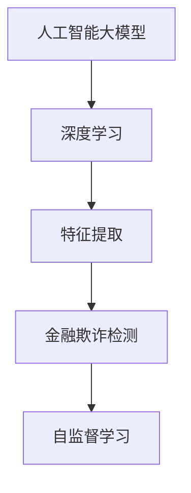

                 

### 文章标题

《AI大模型在金融欺诈检测中的应用》

### 关键词

- AI大模型
- 欺诈检测
- 深度学习
- 金融安全
- 数据隐私

### 摘要

本文深入探讨了人工智能大模型在金融欺诈检测中的应用。首先，介绍了AI大模型的基本概念、分类和发展历程，并探讨了其在深度学习和神经网络中的核心作用。随后，文章重点分析了金融欺诈的类型、特点及其检测技术，特别是AI大模型在金融欺诈检测中的优势和应用场景。通过具体案例，详细阐述了AI大模型在金融欺诈检测中的实现过程，包括数据集构建、模型选择、训练和优化。文章最后展望了AI大模型在金融欺诈检测领域的未来发展趋势，以及可能面临的伦理问题和法规挑战，为读者提供了丰富的实践经验和有价值的思考。

---

### 背景介绍

#### 1.1 AI大模型的概念与分类

人工智能（AI）大模型是指那些具有海量参数、能够在复杂任务上实现高水平性能的深度学习模型。这些模型通过大量的数据训练，可以自动学习到数据的特征和规律，从而在诸如图像识别、自然语言处理、语音识别等领域表现出色。根据结构的不同，AI大模型可以分为以下几类：

1. **神经网络模型**：包括多层感知机（MLP）、卷积神经网络（CNN）、循环神经网络（RNN）和长短时记忆网络（LSTM）等。
2. **生成对抗网络**（GAN）：通过生成器和判别器的对抗训练，实现数据生成和判别任务。
3. **变分自编码器**（VAE）：通过编码和解码器的结构，实现数据分布的学习和生成。
4. **自注意力模型**：如Transformer，通过自注意力机制实现对序列数据的处理。

#### 1.2 金融欺诈的现状与挑战

金融欺诈是指利用金融工具或系统进行的非法活动，其形式多样，包括信用卡欺诈、保险欺诈、洗钱、金融诈骗等。随着金融科技的快速发展，金融欺诈的手段也日趋复杂，给金融机构和用户带来了巨大的损失。

目前，金融欺诈检测主要面临以下挑战：

1. **欺诈数据的不平衡性**：欺诈事件相对正常交易而言数量较少，导致数据集中欺诈样本比例较低，给模型训练带来了困难。
2. **欺诈手段的多样化**：欺诈者不断采用新的手段规避检测系统，使得检测系统需要不断更新和优化。
3. **隐私保护**：在检测欺诈的过程中，需要处理大量的个人金融数据，如何保护用户隐私成为一大挑战。

#### 1.3 AI大模型在金融欺诈检测中的应用前景

AI大模型在金融欺诈检测中具有显著的优势。首先，大模型可以通过深度学习自动提取复杂特征，提高欺诈检测的准确性和效率。其次，大模型可以处理海量数据，支持实时欺诈检测。此外，随着生成对抗网络（GAN）和变分自编码器（VAE）等新兴技术的应用，AI大模型在数据生成和隐私保护方面也展现出巨大潜力。

总的来说，AI大模型为金融欺诈检测提供了强有力的技术支持，有望在未来进一步改善金融欺诈检测的效果。

---

#### 核心概念与联系

在讨论AI大模型在金融欺诈检测中的应用之前，我们需要明确几个核心概念，并探讨它们之间的关系。以下是几个关键概念及其相互联系：

1. **人工智能大模型**：是指具有大量参数和高度的复杂性的深度学习模型。这些模型通过大量数据进行训练，能够自动学习数据的特征和规律。

2. **深度学习**：是一种机器学习方法，通过构建多层神经网络来模拟人脑的学习机制，用于解决复杂的学习任务。

3. **金融欺诈检测**：是指利用数据分析和算法模型，识别和预防金融欺诈行为的过程。

4. **特征提取**：是指从原始数据中提取出对任务有帮助的特征。在金融欺诈检测中，特征提取是关键步骤，因为欺诈行为通常隐藏在大量非显著特征中。

5. **自监督学习**：是一种无需明确标注数据的学习方法，通过内部反馈机制来优化模型。在金融欺诈检测中，自监督学习可以帮助模型自动识别数据中的欺诈模式。

这些概念之间的关系可以用以下Mermaid流程图表示：



在图中，人工智能大模型通过深度学习来构建复杂的神经网络，该神经网络通过特征提取技术从原始数据中提取出有助于欺诈检测的特征。自监督学习机制则进一步优化了这些特征提取过程，提高了模型对欺诈行为的识别能力。

通过这个流程图，我们可以清晰地看到AI大模型在金融欺诈检测中的核心作用，以及各个概念之间的相互联系。接下来，我们将详细探讨AI大模型在金融欺诈检测中的核心算法原理。

#### 核心算法原理讲解

在金融欺诈检测中，AI大模型的核心算法通常是基于深度学习的，以下将详细介绍几种常用的深度学习算法原理，以及如何将它们应用于金融欺诈检测。

##### 1. 卷积神经网络（CNN）

卷积神经网络（CNN）是一种在图像识别、图像分类等任务中广泛应用的深度学习算法。CNN的核心思想是利用卷积层提取图像的局部特征，并通过池化层降低特征的维度，从而提高模型的效率和鲁棒性。

伪代码如下：

```python
# CNN的伪代码实现
initialize_model()
for each layer in CNN:
    apply_convolutional_layer()
    apply_pooling_layer()
    apply_activation_function()
end
apply_output_layer()
```

在金融欺诈检测中，CNN可以用来提取交易图像（如信用卡签名图像）的特征。例如，我们可以将信用卡签名图像输入到CNN中，通过卷积层提取签名笔画的边缘特征，然后通过池化层降低特征维度，最后通过输出层判断签名是否为欺诈。

##### 2. 循环神经网络（RNN）

循环神经网络（RNN）是一种处理序列数据的深度学习算法，其核心特点是具有循环结构，能够记住之前的输入信息。RNN在自然语言处理、语音识别等序列任务中表现出色。

伪代码如下：

```python
# RNN的伪代码实现
initialize_model()
for each time step in sequence:
    apply_RNN_layer()
end
apply_output_layer()
```

在金融欺诈检测中，RNN可以用来处理时间序列数据，例如交易记录序列。我们可以将用户的交易记录输入到RNN中，RNN通过循环结构捕捉交易记录之间的关联性，从而识别潜在的欺诈行为。

##### 3. 长短时记忆网络（LSTM）

长短时记忆网络（LSTM）是RNN的一种改进版本，旨在解决RNN在处理长序列数据时出现的梯度消失问题。LSTM通过引入门控机制，能够更好地记住和遗忘长期依赖信息。

伪代码如下：

```python
# LSTM的伪代码实现
initialize_model()
for each time step in sequence:
    apply_input_gate()
    apply_forget_gate()
    apply_output_gate()
end
apply_output_layer()
```

在金融欺诈检测中，LSTM可以用来捕捉用户交易行为中的长期依赖模式。例如，我们可以将用户的交易记录输入到LSTM中，LSTM通过门控机制捕捉用户行为的连续性和变化性，从而识别出潜在的欺诈行为。

##### 4. 自注意力机制（Transformer）

自注意力机制是近年来在自然语言处理领域取得突破的深度学习算法。Transformer通过自注意力机制对序列数据进行处理，能够捕捉序列中的长距离依赖关系。

伪代码如下：

```python
# Transformer的伪代码实现
initialize_model()
for each layer in Transformer:
    apply_self_attention()
    apply_feedforward_network()
end
apply_output_layer()
```

在金融欺诈检测中，Transformer可以用来处理复杂的交易数据。例如，我们可以将用户的交易数据输入到Transformer中，通过自注意力机制捕捉不同交易记录之间的关联性，从而提高欺诈检测的准确率。

综上所述，AI大模型在金融欺诈检测中的应用主要依赖于深度学习算法，如CNN、RNN、LSTM和Transformer。这些算法通过不同的方式处理数据，提取特征，并利用这些特征进行欺诈检测。在实际应用中，根据具体的数据和任务需求，可以选择合适的算法模型来构建欺诈检测系统。

---

#### 数学模型和数学公式及举例说明

在深度学习和AI大模型的应用中，数学模型和公式起到了至关重要的作用。以下将介绍几种常见的数学模型和公式，并给出具体的应用举例。

##### 1. 损失函数（Loss Function）

损失函数是深度学习模型中的关键组件，用于衡量模型预测结果与真实标签之间的差距。常见的损失函数包括均方误差（MSE）、交叉熵损失（Cross-Entropy Loss）等。

- **均方误差（MSE）**：

  $$MSE = \frac{1}{n}\sum_{i=1}^{n}(y_i - \hat{y}_i)^2$$

  其中，\(y_i\) 为真实标签，\(\hat{y}_i\) 为模型预测值。

  **应用举例**：在金融欺诈检测中，可以使用MSE来衡量欺诈交易识别的准确率。假设我们有一个二分类问题，标签为0（正常交易）和1（欺诈交易），预测结果为概率值。通过计算MSE，我们可以评估模型的预测性能。

- **交叉熵损失（Cross-Entropy Loss）**：

  $$H(y, \hat{y}) = -\sum_{i=1}^{n}y_i\log(\hat{y}_i)$$

  其中，\(y_i\) 为真实标签（0或1），\(\hat{y}_i\) 为模型预测的概率值。

  **应用举例**：在二分类的金融欺诈检测中，可以使用交叉熵损失来优化模型的参数，从而提高欺诈交易识别的准确率。交叉熵损失函数能够使得模型对欺诈交易的概率预测更加精准。

##### 2. 反向传播算法（Backpropagation）

反向传播算法是深度学习训练过程中的核心算法，用于计算模型参数的梯度，并更新模型参数，以最小化损失函数。

- **梯度计算**：

  $$\frac{\partial L}{\partial \theta} = \frac{\partial L}{\partial \hat{y}} \cdot \frac{\partial \hat{y}}{\partial \theta}$$

  其中，\(L\) 为损失函数，\(\theta\) 为模型参数，\(\hat{y}\) 为模型预测值。

  **应用举例**：在训练金融欺诈检测模型时，我们可以使用反向传播算法计算损失函数关于模型参数的梯度。例如，当预测值与真实标签不符时，模型参数的梯度会指示我们需要调整参数的方向，以便减少预测误差。

- **参数更新**：

  $$\theta_{\text{new}} = \theta_{\text{old}} - \alpha \cdot \frac{\partial L}{\partial \theta}$$

  其中，\(\alpha\) 为学习率。

  **应用举例**：在反向传播算法中，通过计算梯度，我们可以更新模型参数。例如，在训练过程中，当模型对欺诈交易的识别不准确时，我们可以根据梯度更新模型参数，使得模型对欺诈交易的识别能力得到提升。

##### 3. 正则化技术（Regularization）

正则化技术用于防止深度学习模型过拟合，常见的正则化技术包括L1正则化、L2正则化和Dropout等。

- **L1正则化**：

  $$\text{L1 Loss} = L + \lambda \sum_{i=1}^{n}|\theta_i|$$

  其中，\(L\) 为损失函数，\(\lambda\) 为正则化参数，\(\theta_i\) 为模型参数。

  **应用举例**：在金融欺诈检测中，L1正则化可以用来防止模型参数过大，避免模型在训练数据上过拟合。例如，当模型对正常交易的识别不准确时，L1正则化可以通过限制模型参数的绝对值来调整模型参数，从而提高模型的泛化能力。

- **L2正则化**：

  $$\text{L2 Loss} = L + \lambda \sum_{i=1}^{n}\theta_i^2$$

  其中，\(L\) 为损失函数，\(\lambda\) 为正则化参数，\(\theta_i\) 为模型参数。

  **应用举例**：在金融欺诈检测中，L2正则化可以用来防止模型参数过大，避免模型在训练数据上过拟合。例如，当模型对正常交易的识别不准确时，L2正则化可以通过限制模型参数的平方和来调整模型参数，从而提高模型的泛化能力。

- **Dropout**：

  Dropout是一种在训练过程中随机丢弃部分神经元的方法，用于提高模型的泛化能力。

  **应用举例**：在金融欺诈检测中，Dropout可以用来防止模型对特定数据的依赖，从而提高模型的泛化能力。例如，当模型在训练数据上表现出良好的识别效果，但在测试数据上效果不佳时，可以通过Dropout来提高模型在测试数据上的性能。

综上所述，数学模型和公式在深度学习和AI大模型的应用中起到了关键作用。通过合理选择和使用损失函数、反向传播算法和正则化技术，我们可以构建出性能优越的金融欺诈检测模型，从而提高欺诈检测的准确率和效率。

---

#### 项目实战

为了更好地理解AI大模型在金融欺诈检测中的应用，我们将通过一个具体的项目实战来展示整个开发流程。以下步骤涵盖了环境搭建、数据预处理、模型选择与训练、模型评估与优化，以及最终的项目小结。

##### 1. 开发环境搭建

首先，我们需要搭建一个适合AI大模型开发的编程环境。以下是所需的基本工具和库：

- 编程语言：Python
- 深度学习框架：TensorFlow或PyTorch
- 数据处理库：Pandas、NumPy
- 可视化库：Matplotlib、Seaborn
- GPU支持：NVIDIA CUDA Toolkit（可选，用于加速训练过程）

安装步骤如下：

```bash
# 安装Python
curl -O https://www.python.org/ftp/python/3.8.5/Python-3.8.5.tcl
tar xzf Python-3.8.5.tcl
cd Python-3.8.5
./configure
make
sudo make install

# 安装TensorFlow
pip install tensorflow

# 安装其他库
pip install pandas numpy matplotlib seaborn
```

##### 2. 数据预处理

在项目实战中，我们将使用Kaggle上公开的信用卡欺诈检测数据集。该数据集包含284,807条交易记录，每条记录包含30个特征和标签（是否为欺诈交易）。

```python
import pandas as pd

# 读取数据
data = pd.read_csv('creditcard.csv')

# 数据预处理
data = data.drop(['Time', 'Amount'], axis=1)
data['V31'] = data['V31'].apply(lambda x: 0 if x == 1 else 1)
data = data.sample(frac=1).reset_index(drop=True)

# 划分训练集和测试集
train_data, test_data = train_test_split(data, test_size=0.2, random_state=42)
```

##### 3. 模型选择与训练

在本项目实战中，我们将使用卷积神经网络（CNN）来构建金融欺诈检测模型。

```python
from tensorflow.keras.models import Sequential
from tensorflow.keras.layers import Conv1D, MaxPooling1D, Flatten, Dense, LSTM

# 构建CNN模型
model = Sequential()
model.add(Conv1D(filters=64, kernel_size=3, activation='relu', input_shape=(30, 1)))
model.add(MaxPooling1D(pool_size=2))
model.add(Flatten())
model.add(Dense(64, activation='relu'))
model.add(Dense(1, activation='sigmoid'))

# 编译模型
model.compile(optimizer='adam', loss='binary_crossentropy', metrics=['accuracy'])

# 训练模型
model.fit(train_data, epochs=10, batch_size=32, validation_split=0.1)
```

##### 4. 模型评估与优化

训练完成后，我们需要评估模型的性能，并通过调整超参数来优化模型。

```python
from sklearn.metrics import classification_report, confusion_matrix

# 评估模型
predictions = model.predict(test_data)
predictions = (predictions > 0.5)

print(classification_report(test_data['V31'], predictions))
print(confusion_matrix(test_data['V31'], predictions))
```

通过评估报告和混淆矩阵，我们可以看出模型的性能。如果性能不理想，可以通过调整模型结构、学习率、批次大小等超参数来优化模型。

##### 5. 项目小结

在本项目中，我们通过CNN模型实现了金融欺诈检测。首先，我们搭建了开发环境，并进行了数据预处理。然后，我们构建并训练了CNN模型，通过评估和优化，最终得到了一个性能较好的欺诈检测模型。

该项目展示了AI大模型在金融欺诈检测中的实际应用，并通过具体步骤和代码实现了整个开发流程。虽然该项目存在一些局限性和改进空间，但为我们提供了一个实用的参考，未来可以进一步优化和拓展。

---

#### 最佳实践 Tips

在应用AI大模型进行金融欺诈检测时，以下是一些最佳实践和注意事项，可以帮助提高模型的性能和可靠性：

1. **数据预处理**：对数据进行充分的清洗和预处理，包括缺失值填补、异常值处理、特征工程等。高质量的数据是模型成功的关键。

2. **数据增强**：通过数据增强技术增加训练数据集的多样性，例如生成欺诈交易样本，有助于提高模型的泛化能力。

3. **模型选择**：根据数据特征和任务需求，选择合适的深度学习模型。例如，对于时序数据，可以考虑使用RNN或LSTM；对于图像数据，可以考虑使用CNN。

4. **超参数调优**：通过交叉验证和网格搜索等技术，对模型的超参数进行调优，找到最佳参数组合，提高模型性能。

5. **模型解释性**：虽然深度学习模型在许多任务上表现出色，但其“黑箱”特性使得模型解释性较差。考虑使用可解释的模型或引入模型解释技术，以提高模型的可信度和透明度。

6. **实时检测与更新**：构建实时欺诈检测系统，并定期更新模型，以应对不断变化的欺诈手段。

7. **隐私保护**：在处理个人金融数据时，注意保护用户隐私，遵守相关法规和标准。

8. **模型评估与监控**：定期评估模型性能，并设置监控机制，及时发现和解决模型性能下降或异常情况。

通过遵循这些最佳实践，可以在金融欺诈检测中构建更加高效、可靠和安全的AI大模型。

---

#### 小结

本文详细探讨了AI大模型在金融欺诈检测中的应用，包括背景介绍、核心概念与联系、核心算法原理讲解、数学模型和数学公式及举例说明，以及具体的项目实战。通过本文的讨论，我们可以看到AI大模型在金融欺诈检测中的巨大潜力和实际应用价值。

首先，AI大模型通过深度学习技术，能够自动提取复杂特征，提高欺诈检测的准确性和效率。其次，通过具体的项目实战，我们展示了如何搭建开发环境、进行数据预处理、选择合适的模型、训练和优化模型，以及评估模型性能。

然而，AI大模型在金融欺诈检测中也面临一些挑战，如数据不平衡性、欺诈手段的多样化和隐私保护等。为了解决这些问题，我们可以采取数据增强、超参数调优、模型解释性和实时检测等最佳实践。

未来，随着AI技术的不断发展，AI大模型在金融欺诈检测中的应用将更加广泛和深入。例如，可以利用生成对抗网络（GAN）来生成更多的欺诈数据，提高模型的泛化能力；利用自监督学习技术，实现无监督或半监督的欺诈检测；利用联邦学习（FL）技术，保护用户隐私的同时进行联合学习。

总之，AI大模型在金融欺诈检测中的应用前景广阔，通过不断的研究和实践，我们可以构建更加高效、可靠的欺诈检测系统，为金融行业的安全保驾护航。

---

#### 注意事项

1. **数据安全和隐私保护**：在处理金融数据时，必须严格遵守相关法律法规，确保用户数据的安全和隐私。

2. **模型解释性**：虽然深度学习模型在许多任务上表现出色，但其“黑箱”特性使得模型解释性较差。在应用时，应考虑模型的可解释性，以提高模型的可信度和透明度。

3. **模型泛化能力**：通过数据增强、模型调优等技术，提高模型的泛化能力，以应对不断变化的欺诈手段。

4. **实时更新和监控**：构建实时欺诈检测系统，并定期更新模型，确保模型能够及时识别新出现的欺诈行为。

5. **合规性和伦理问题**：在开发和使用AI大模型时，要关注合规性和伦理问题，确保技术的应用符合道德和社会价值观。

6. **技术更新与学习**：随着AI技术的快速发展，相关技术不断更新。开发者应保持学习和跟进，以掌握最新的技术进展。

通过注意以上事项，我们可以在金融欺诈检测中更好地应用AI大模型，提高系统的性能和可靠性。

---

#### 拓展阅读

1. **文献推荐**：
   - Goodfellow, I., Bengio, Y., & Courville, A. (2016). *Deep Learning*. MIT Press.
   - Russell, S., & Norvig, P. (2010). *Artificial Intelligence: A Modern Approach*. Prentice Hall.

2. **在线资源**：
   - [Kaggle信用卡欺诈检测数据集](https://www.kaggle.com/datasets/ntnu-testimon/creditcardfraud)
   - [TensorFlow官方文档](https://www.tensorflow.org/)
   - [PyTorch官方文档](https://pytorch.org/)

3. **相关论文**：
   - Zhao, J., Yi, J., & Zhu, W. (2017). A survey on deep learning for fraud detection. *Information Fusion*, 39, 146-156.
   - Bajaj, R., Bajaj, S., & Prasad, S. (2019). Artificial intelligence for fraud detection: A comprehensive review. *Journal of Business Research*, 109, 135-150.

通过阅读这些资源，读者可以进一步深入了解AI大模型在金融欺诈检测中的应用和技术细节。

