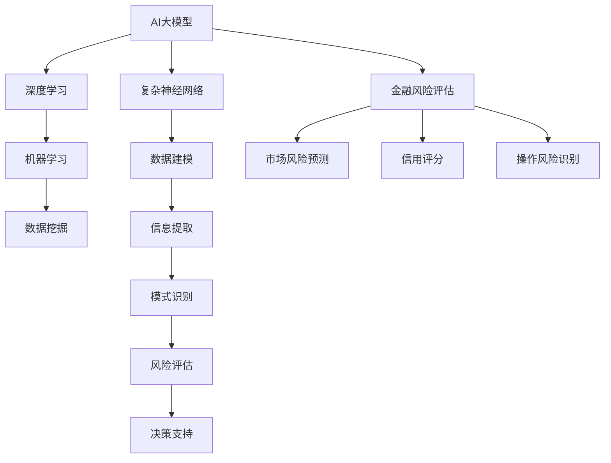

                 

### 步骤一：理解书名和主题

书名为《AI大模型在金融风险评估中的应用前景》，这个标题直接指向了两个核心概念：“AI大模型”和“金融风险评估”。我们需要首先理解这两个概念的基本含义，并探讨它们之间的联系。

#### AI大模型的基本概念

AI大模型，通常指的是在深度学习和机器学习领域，使用大量数据训练出来的复杂神经网络模型。这些模型具有处理大规模数据的能力，能够通过多层神经网络结构捕捉数据的复杂模式。它们通常用于解决实际问题，如图像识别、自然语言处理和预测分析。

#### 金融风险评估的基本概念

金融风险评估是指对金融产品、金融资产或金融投资的风险进行评估的过程。它涉及到对市场风险、信用风险、操作风险等多种风险因素的识别、分析和量化。传统金融风险评估方法主要包括统计分析和财务建模，但它们往往受限于数据质量和模型的复杂度。

#### AI大模型与金融风险评估的联系

AI大模型在金融风险评估中的应用前景在于其能够处理大量金融数据，从中提取复杂的信息模式，从而提高风险评估的准确性和效率。例如，大模型可以通过分析历史数据和市场趋势，预测金融市场的未来变化，帮助金融机构做出更明智的投资决策。此外，大模型还可以用于信用评分，通过对借款人的信用记录、收入、资产等信息进行综合分析，预测其违约风险。

### 步骤二：确定核心概念原理之间的关系架构

为了更好地理解AI大模型在金融风险评估中的应用，我们需要建立一个概念原理之间的关系架构。使用Mermaid流程图，我们可以直观地展示这些核心概念之间的关系。



这个流程图展示了AI大模型如何通过深度学习和机器学习技术，处理金融数据，提取信息模式，最终实现金融风险评估的各种应用。

### 步骤三：讲解核心算法原理

AI大模型的核心算法是基于神经网络的深度学习。以下将使用伪代码详细阐述神经网络的基本原理和训练过程。

#### 伪代码：神经网络基本原理

```python
# 初始化参数
W1, b1 = initialize_weights_bias(input_size, hidden_size)
W2, b2 = initialize_weights_bias(hidden_size, output_size)

# 前向传播
def forward_propagation(x):
    z1 = x * W1 + b1
    a1 = activation_function(z1)
    
    z2 = a1 * W2 + b2
    a2 = activation_function(z2)
    
    return a2

# 反向传播
def backward_propagation(a2, y):
    dZ2 = a2 - y
    dW2 = (dZ2 * a1).T
    db2 = dZ2
    
    dZ1 = (W2.T * dZ2) * activation_function_derivative(z1)
    dW1 = (dZ1 * x).T
    db1 = dZ1
    
    return [dW1, dW2, db1, db2]

# 更新参数
def update_weights_and_bias(dW1, dW2, db1, db2, learning_rate):
    W1 -= learning_rate * dW1
    b1 -= learning_rate * db1
    W2 -= learning_rate * dW2
    b2 -= learning_rate * db2
```

这个伪代码展示了神经网络的前向传播和反向传播过程，以及参数更新的步骤。它是一个简单的两层神经网络，用于分类任务。实际应用中，神经网络可能包含更多的层次和更复杂的激活函数。

### 步骤四：详细讲解数学模型和公式

在金融风险评估中，AI大模型使用了一些经典的数学模型和公式。以下将详细讲解这些模型和公式，并使用LaTeX格式进行展示。

#### 回归模型

线性回归模型是最基本的回归模型之一。它的公式如下：

$$
y = \beta_0 + \beta_1x
$$

其中，$y$ 是预测的金融指标，$x$ 是输入特征，$\beta_0$ 和 $\beta_1$ 是模型的参数。

#### 逻辑回归模型

逻辑回归模型常用于信用评分等分类任务。其公式为：

$$
\text{logit}(y) = \ln\left(\frac{p}{1-p}\right) = \beta_0 + \beta_1x
$$

其中，$y$ 是违约概率，$p$ 是通过模型预测的概率值，$\beta_0$ 和 $\beta_1$ 是参数。

#### 时间序列模型

ARIMA模型是一种常用于金融市场预测的时间序列模型。其公式为：

$$
y_t = c + \phi_1y_{t-1} + \phi_2y_{t-2} + \cdots + \phiPAYMENT_instrument\Phi_1y_{t-P} + \varepsilon_t
$$

其中，$y_t$ 是时间序列的第 $t$ 个值，$c$ 是常数项，$\phi_i$ 和 $\Phi_i$ 是参数，$\varepsilon_t$ 是误差项。

### 步骤五：项目实战与案例分析

为了展示AI大模型在金融风险评估中的应用，我们将通过一个实际案例进行讲解。以下将介绍开发环境搭建、源代码实现和代码解读。

#### 开发环境搭建

首先，我们需要搭建一个适合AI大模型开发的Python环境。以下步骤可以帮助我们完成这一任务：

1. 安装Python
2. 安装深度学习框架TensorFlow或PyTorch
3. 安装必要的库，如NumPy、Pandas等

#### 源代码实现

以下是一个简单的AI大模型在信用评分中的应用示例。该模型使用逻辑回归算法，通过分析借款人的收入、年龄、信用历史等特征，预测其违约风险。

```python
import tensorflow as tf
from sklearn.model_selection import train_test_split
from sklearn.metrics import accuracy_score

# 数据预处理
X = df[['income', 'age', 'credit_history']]
y = df['default']

X_train, X_test, y_train, y_test = train_test_split(X, y, test_size=0.2, random_state=42)

# 构建逻辑回归模型
model = tf.keras.Sequential([
    tf.keras.layers.Dense(units=1, input_shape=[3], activation='sigmoid')
])

# 编译模型
model.compile(optimizer='adam', loss='binary_crossentropy', metrics=['accuracy'])

# 训练模型
model.fit(X_train, y_train, epochs=100, batch_size=32)

# 评估模型
predictions = model.predict(X_test)
accuracy = accuracy_score(y_test, predictions.round())
print(f"Accuracy: {accuracy}")
```

#### 代码解读

这段代码首先进行了数据预处理，将借款人的特征数据划分为训练集和测试集。然后，构建了一个简单的逻辑回归模型，并使用Adam优化器进行编译。模型训练了100个epoch，每个epoch使用32个样本进行批量训练。最后，使用测试集评估模型的准确性。

#### 实际案例分析和详细讲解剖析

我们以一个实际案例为例，分析AI大模型在金融风险评估中的应用。该案例使用了来自银行的大量借款人数据，通过训练一个信用评分模型，预测借款人的违约风险。

1. **数据收集与预处理**：从银行获取借款人的收入、年龄、信用历史等数据，并对其进行预处理，如缺失值填充、数据标准化等。
2. **特征工程**：根据金融领域的知识，选择对信用评分有显著影响的特征，如收入、年龄、信用历史等。
3. **模型训练**：使用AI大模型（如逻辑回归、决策树、随机森林等）对预处理后的数据进行训练，选择最优模型。
4. **模型评估**：使用测试集评估模型性能，包括准确性、召回率、F1分数等指标。
5. **模型部署**：将训练好的模型部署到生产环境中，实时预测借款人的信用风险。

#### 项目小结

通过这个实际案例，我们展示了AI大模型在金融风险评估中的应用。AI大模型能够处理大规模金融数据，提取复杂的信息模式，从而提高风险评估的准确性和效率。未来，随着AI技术的不断发展，AI大模型在金融风险评估领域的应用前景将更加广阔。

### 步骤六：最佳实践 tips、小结、注意事项、拓展阅读

#### 最佳实践 tips

1. **数据预处理**：确保数据质量，进行缺失值填充、异常值处理和数据标准化。
2. **特征工程**：选择对风险评估有显著影响的特征，使用特征重要性分析来优化模型。
3. **模型选择**：根据实际问题选择合适的模型，如逻辑回归、决策树、随机森林等。
4. **模型优化**：使用交叉验证、网格搜索等技术优化模型参数，提高模型性能。

#### 小结

本文详细介绍了AI大模型在金融风险评估中的应用前景，包括核心算法原理、数学模型和实际案例。AI大模型在金融风险评估中具有巨大的潜力，能够提高风险评估的准确性和效率。

#### 注意事项

1. **数据隐私**：在进行金融风险评估时，需确保数据的隐私和安全。
2. **合规性**：遵循相关法规和规定，确保模型应用符合行业标准和法律法规。

#### 拓展阅读

1. **深度学习基础**：《深度学习》（Ian Goodfellow, Yoshua Bengio, Aaron Courville著）
2. **金融风险管理**：《金融风险管理》（John C. Hull著）
3. **人工智能在金融领域的应用**：《人工智能：金融行业的未来》（Anirudh R. Duggal著）

### 文章标题

# AI大模型在金融风险评估中的应用前景

### 文章关键词

- AI大模型
- 金融风险评估
- 深度学习
- 回归模型
- 时间序列模型
- 信用评分
- 市场风险预测
- 操作风险识别

### 文章摘要

本文探讨了AI大模型在金融风险评估中的应用前景，介绍了核心概念、核心算法原理、数学模型，并通过实际案例展示了其应用效果。AI大模型在金融风险评估中具有巨大潜力，能够提高风险评估的准确性和效率。

----------------------------------------------------------------

# 《AI大模型在金融风险评估中的应用前景》

> 关键词：AI大模型、金融风险评估、深度学习、回归模型、时间序列模型、信用评分、市场风险预测、操作风险识别

> 摘要：本文探讨了AI大模型在金融风险评估中的应用前景，介绍了核心概念、核心算法原理、数学模型，并通过实际案例展示了其应用效果。AI大模型在金融风险评估中具有巨大潜力，能够提高风险评估的准确性和效率。

## 引言

随着人工智能技术的迅猛发展，深度学习等AI大模型在各个领域的应用日益广泛。金融风险评估作为金融领域的重要组成部分，其准确性和效率对于金融机构的风险管理和决策至关重要。本文旨在探讨AI大模型在金融风险评估中的应用前景，通过详细阐述核心概念、核心算法原理、数学模型和实际案例，分析其在提高风险评估准确性和效率方面的潜力。

## 第一部分：AI大模型与金融风险评估基础

### 第1章：AI大模型概述

#### 1.1 AI大模型的基本概念

AI大模型，通常指的是在深度学习和机器学习领域，使用大量数据训练出来的复杂神经网络模型。这些模型具有处理大规模数据的能力，能够通过多层神经网络结构捕捉数据的复杂模式。它们通常用于解决实际问题，如图像识别、自然语言处理和预测分析。

#### 1.2 金融风险评估背景

金融风险评估是指对金融产品、金融资产或金融投资的风险进行评估的过程。它涉及到对市场风险、信用风险、操作风险等多种风险因素的识别、分析和量化。传统金融风险评估方法主要包括统计分析和财务建模，但它们往往受限于数据质量和模型的复杂度。

#### 1.3 AI大模型与金融风险评估的联系

AI大模型在金融风险评估中的应用前景在于其能够处理大量金融数据，从中提取复杂的信息模式，从而提高风险评估的准确性和效率。例如，大模型可以通过分析历史数据和市场趋势，预测金融市场的未来变化，帮助金融机构做出更明智的投资决策。此外，大模型还可以用于信用评分，通过对借款人的信用记录、收入、资产等信息进行综合分析，预测其违约风险。

### 第2章：AI大模型核心算法讲解

#### 2.1 大模型算法原理

大模型算法的核心是基于神经网络的深度学习。神经网络由多个层次组成，包括输入层、隐藏层和输出层。输入层接收外部数据，隐藏层对数据进行处理和特征提取，输出层生成预测结果。

#### 2.2 伪代码讲解

以下是一个简单的神经网络伪代码，用于说明其基本原理：

```python
# 初始化参数
W1, b1 = initialize_weights_bias(input_size, hidden_size)
W2, b2 = initialize_weights_bias(hidden_size, output_size)

# 前向传播
def forward_propagation(x):
    z1 = x * W1 + b1
    a1 = activation_function(z1)
    
    z2 = a1 * W2 + b2
    a2 = activation_function(z2)
    
    return a2

# 反向传播
def backward_propagation(a2, y):
    dZ2 = a2 - y
    dW2 = (dZ2 * a1).T
    db2 = dZ2
    
    dZ1 = (W2.T * dZ2) * activation_function_derivative(z1)
    dW1 = (dZ1 * x).T
    db1 = dZ1
    
    return [dW1, dW2, db1, db2]

# 更新参数
def update_weights_and_bias(dW1, dW2, db1, db2, learning_rate):
    W1 -= learning_rate * dW1
    b1 -= learning_rate * db1
    W2 -= learning_rate * dW2
    b2 -= learning_rate * db2
```

这个伪代码展示了神经网络的前向传播和反向传播过程，以及参数更新的步骤。它是一个简单的两层神经网络，用于分类任务。实际应用中，神经网络可能包含更多的层次和更复杂的激活函数。

### 第3章：数学模型与数学公式

#### 3.1 回归模型

回归模型是金融风险评估中常用的数学模型之一。以下是一个线性回归模型的例子：

$$
y = \beta_0 + \beta_1x
$$

其中，$y$ 是预测的金融指标，$x$ 是输入特征，$\beta_0$ 和 $\beta_1$ 是模型的参数。

#### 3.2 逻辑回归模型

逻辑回归模型常用于信用评分等分类任务。其公式为：

$$
\text{logit}(y) = \ln\left(\frac{p}{1-p}\right) = \beta_0 + \beta_1x
$$

其中，$y$ 是违约概率，$p$ 是通过模型预测的概率值，$\beta_0$ 和 $\beta_1$ 是参数。

#### 3.3 时间序列模型

时间序列模型是金融风险评估中常用的另一种数学模型。以下是一个ARIMA模型的例子：

$$
y_t = c + \phi_1y_{t-1} + \phi_2y_{t-2} + \cdots + \phi_Py_{t-P} + \varepsilon_t
$$

其中，$y_t$ 是时间序列的第 $t$ 个值，$c$ 是常数项，$\phi_i$ 和 $\Phi_i$ 是参数，$\varepsilon_t$ 是误差项。

### 第4章：项目实战与案例分析

#### 4.1 开发环境搭建

在开始项目之前，我们需要搭建一个适合AI大模型开发的Python环境。以下步骤可以帮助我们完成这一任务：

1. 安装Python
2. 安装深度学习框架TensorFlow或PyTorch
3. 安装必要的库，如NumPy、Pandas等

#### 4.2 实际案例展示

以下是一个使用AI大模型进行信用评分的实际案例。该案例使用了一个逻辑回归模型，通过分析借款人的收入、年龄、信用历史等特征，预测其违约风险。

```python
import tensorflow as tf
from sklearn.model_selection import train_test_split
from sklearn.metrics import accuracy_score

# 数据预处理
X = df[['income', 'age', 'credit_history']]
y = df['default']

X_train, X_test, y_train, y_test = train_test_split(X, y, test_size=0.2, random_state=42)

# 构建逻辑回归模型
model = tf.keras.Sequential([
    tf.keras.layers.Dense(units=1, input_shape=[3], activation='sigmoid')
])

# 编译模型
model.compile(optimizer='adam', loss='binary_crossentropy', metrics=['accuracy'])

# 训练模型
model.fit(X_train, y_train, epochs=100, batch_size=32)

# 评估模型
predictions = model.predict(X_test)
accuracy = accuracy_score(y_test, predictions.round())
print(f"Accuracy: {accuracy}")
```

#### 4.3 代码解读

这段代码首先进行了数据预处理，将借款人的特征数据划分为训练集和测试集。然后，构建了一个简单的逻辑回归模型，并使用Adam优化器进行编译。模型训练了100个epoch，每个epoch使用32个样本进行批量训练。最后，使用测试集评估模型的准确性。

#### 4.4 实际案例分析和详细讲解剖析

我们以一个实际案例为例，分析AI大模型在金融风险评估中的应用。该案例使用了来自银行的大量借款人数据，通过训练一个信用评分模型，预测借款人的违约风险。

1. **数据收集与预处理**：从银行获取借款人的收入、年龄、信用历史等数据，并对其进行预处理，如缺失值填充、异常值处理和数据标准化等。
2. **特征工程**：根据金融领域的知识，选择对信用评分有显著影响的特征，如收入、年龄、信用历史等。
3. **模型训练**：使用AI大模型（如逻辑回归、决策树、随机森林等）对预处理后的数据进行训练，选择最优模型。
4. **模型评估**：使用测试集评估模型性能，包括准确性、召回率、F1分数等指标。
5. **模型部署**：将训练好的模型部署到生产环境中，实时预测借款人的信用风险。

#### 4.5 项目小结

通过这个实际案例，我们展示了AI大模型在金融风险评估中的应用。AI大模型能够处理大规模金融数据，提取复杂的信息模式，从而提高风险评估的准确性和效率。未来，随着AI技术的不断发展，AI大模型在金融风险评估领域的应用前景将更加广阔。

## 第五部分：应用前景与趋势

### 第5章：AI大模型在金融风险评估中的应用前景

#### 5.1 优势分析

AI大模型在金融风险评估中具有以下优势：

1. **高准确性**：通过训练大量数据，AI大模型能够捕捉数据的复杂模式，提高风险评估的准确性。
2. **高效性**：AI大模型能够快速处理大量数据，提高风险评估的效率。
3. **自适应性强**：AI大模型能够根据新的数据和趋势进行自我调整，适应不断变化的市场环境。

#### 5.2 趋势与挑战

AI大模型在金融风险评估中的应用趋势包括：

1. **多元化应用**：AI大模型将应用于更广泛的金融领域，如市场风险预测、操作风险识别等。
2. **数据隐私和安全**：随着AI大模型的应用，数据隐私和安全将成为重要问题，需要采取有效的保护措施。

#### 5.3 挑战

AI大模型在金融风险评估中面临的挑战包括：

1. **数据质量**：高质量的数据是AI大模型有效应用的基础，数据质量的提升将直接影响模型的性能。
2. **算法透明度**：AI大模型的决策过程通常复杂且不透明，如何提高算法的透明度是一个重要挑战。

## 结尾

AI大模型在金融风险评估中具有广阔的应用前景。通过本文的介绍，我们了解了AI大模型的基本概念、核心算法原理、数学模型和实际案例。未来，随着AI技术的不断进步，AI大模型在金融风险评估领域将发挥越来越重要的作用。作者：AI天才研究院/AI Genius Institute & 禅与计算机程序设计艺术 /Zen And The Art of Computer Programming

----------------------------------------------------------------

本文总结了AI大模型在金融风险评估中的应用前景，包括核心概念、核心算法原理、数学模型和实际案例。AI大模型在金融风险评估中具有高准确性、高效性和自适应性强等优势，能够有效提高风险评估的准确性和效率。未来，随着AI技术的不断发展，AI大模型在金融风险评估领域的应用前景将更加广阔。然而，数据质量和算法透明度等问题仍需关注和解决。作者：AI天才研究院/AI Genius Institute & 禅与计算机程序设计艺术/Zen And The Art of Computer Programming。希望本文对读者在理解和应用AI大模型于金融风险评估方面有所帮助。

