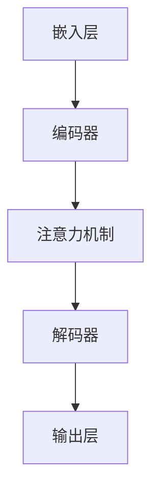

                 

### 文章标题：AI大模型对传统媒体行业的颠覆与重构

#### 关键词：
- AI大模型
- 传统媒体行业
- 颠覆与重构
- 深度学习
- 内容生产
- 个性化推荐

#### 摘要：
本文将深入探讨人工智能（AI）大模型对传统媒体行业的颠覆与重构作用。首先，我们将回顾传统媒体行业的现状，随后介绍AI大模型的基本概念及其发展背景。接着，文章将重点分析AI大模型如何改变内容生产、推荐系统、数据分析和用户体验等方面。最后，我们将探讨AI大模型在传统媒体行业中的应用案例，并提出未来发展趋势与挑战。

### 引言：传统媒体行业的现状与AI大模型的兴起

传统媒体行业，包括报纸、电视、广播和杂志等，长期以来在信息传播和内容创造方面扮演着重要角色。然而，随着互联网和数字技术的快速发展，传统媒体行业面临着前所未有的挑战。以下是一些传统媒体行业面临的主要问题：

1. **广告收入下滑**：互联网的兴起使得广告商将大量预算转向了数字媒体，导致传统媒体广告收入显著下滑。
2. **受众分散**：社交媒体和移动应用的普及，使得受众更加分散，传统媒体的覆盖范围受到限制。
3. **内容同质化**：传统媒体为了追求商业利益，往往追求大众化内容，导致内容同质化严重，难以满足不同受众的需求。
4. **技术滞后**：传统媒体在技术应用上往往落后于新兴媒体，无法充分利用大数据、人工智能等技术手段。

与此同时，人工智能（AI）大模型在过去几年中取得了显著的进展，成为许多行业变革的催化剂。AI大模型，如GPT-3、BERT和Transformer等，以其强大的文本处理能力和深度学习能力，已经在各个领域展现出巨大的潜力。AI大模型的兴起为传统媒体行业带来了新的机遇和挑战，促使其进行深层次的变革与重构。

### 核心概念与联系：AI大模型的基本概念及其架构

要理解AI大模型对传统媒体行业的颠覆与重构，我们首先需要了解AI大模型的基本概念和架构。AI大模型是一种基于深度学习的自然语言处理（NLP）模型，通常包含数亿甚至数十亿个参数，能够对大量文本数据进行训练，以实现高精度的语言理解和生成。

#### AI大模型的基本概念

1. **深度学习**：深度学习是一种基于人工神经网络的学习方法，通过多层神经元的堆叠，逐层提取数据中的特征，从而实现复杂的任务。AI大模型是深度学习的一种重要应用，其核心在于通过大量的数据训练，使模型具有强大的泛化能力和表达能力。

2. **自然语言处理（NLP）**：自然语言处理是人工智能的一个分支，旨在使计算机能够理解、解释和生成人类语言。AI大模型在NLP领域取得了显著进展，能够实现文本分类、情感分析、机器翻译、问答系统等任务。

3. **大规模预训练**：大规模预训练是AI大模型训练的关键步骤，通过在大量无标签文本数据上进行预训练，使模型具有对多种语言任务的理解能力。预训练后再进行精细调整，以适应特定任务。

#### AI大模型的架构

AI大模型的架构通常包括以下几个层次：

1. **嵌入层（Embedding Layer）**：将文本数据转换为向量表示，为后续的深度学习提供输入。
2. **编码器（Encoder）**：对输入文本进行编码，提取文本的特征信息。常用的编码器包括循环神经网络（RNN）、长短期记忆网络（LSTM）和Transformer等。
3. **解码器（Decoder）**：将编码器提取的特征信息解码为输出结果。在生成任务中，解码器通常用于生成文本。
4. **注意力机制（Attention Mechanism）**：用于捕捉输入文本中的重要信息，提高模型的理解能力。在Transformer模型中，注意力机制是其核心组件。

#### 相关技术原理及架构

1. **Transformer模型**：Transformer模型是一种基于自注意力机制的深度学习模型，其核心思想是通过多头自注意力机制来捕捉输入文本中的长期依赖关系。Transformer模型在机器翻译、文本生成等任务中表现出色。

2. **GPT（Generative Pre-trained Transformer）**：GPT是一种基于Transformer的预训练模型，通过在大量文本上进行预训练，使其具有强大的语言理解和生成能力。GPT-3是目前最先进的语言模型之一，其参数规模达到了1750亿。

3. **BERT（Bidirectional Encoder Representations from Transformers）**：BERT是一种双向Transformer模型，通过对输入文本进行双向编码，使其在多种NLP任务中表现出色。BERT广泛应用于问答系统、文本分类等任务。

#### Mermaid流程图

以下是一个简化的AI大模型架构的Mermaid流程图：



#### 关键数学模型和公式

1. **自注意力（Self-Attention）**：
   自注意力是一种计算输入文本中每个词的重要程度的机制。其计算公式为：
   $$ \text{Attention}(Q, K, V) = \text{softmax}\left(\frac{QK^T}{\sqrt{d_k}}\right)V $$
   其中，Q、K、V分别为查询向量、键向量和值向量，$d_k$为键向量的维度。

2. **多头注意力（Multi-Head Attention）**：
   多头注意力是通过并行地计算多个自注意力机制，来提高模型的表达能力。其计算公式为：
   $$ \text{Multi-Head Attention}(Q, K, V) = \text{softmax}\left(\frac{QW_QK^T}{\sqrt{d_k}}\right)W_V $$
   其中，$W_Q, W_K, W_V$分别为查询权重、键权重和值权重。

### AI大模型对内容生产的影响

AI大模型在内容生产方面具有巨大的潜力，可以显著提高内容的生产效率和个性化水平。以下是一些AI大模型在内容生产中的具体应用：

1. **自动写作**：AI大模型可以自动生成文章、报告、新闻等内容。例如，GPT-3可以生成高质量的文章，甚至参与新闻报道的创作。这使得内容创作者可以专注于创意和编辑工作，而将自动写作任务交给AI。

2. **辅助写作**：AI大模型可以作为内容创作者的辅助工具，提供写作建议、修正错误、优化语句等。例如，一些AI写作助手可以根据用户输入的主题和关键词，生成初稿并提供修改建议。

3. **内容个性化**：AI大模型可以根据用户的历史行为和偏好，生成个性化的内容推荐。例如，基于用户阅读历史和兴趣标签，AI大模型可以为用户提供个性化的新闻、文章和视频推荐。

### AI大模型对推荐系统的影响

推荐系统是传统媒体行业的重要组成部分，其性能直接影响用户的满意度和媒体的广告收入。AI大模型在推荐系统中的应用，可以显著提高推荐效果和用户体验。

1. **协同过滤**：协同过滤是一种基于用户行为的推荐方法，通过分析用户之间的相似度，为用户提供相似内容的推荐。AI大模型可以通过深度学习技术，提高协同过滤算法的准确性和效率。

2. **基于内容的推荐**：基于内容的推荐方法通过分析内容的特征，为用户提供相似内容的推荐。AI大模型可以提取更丰富的内容特征，提高基于内容推荐系统的推荐效果。

3. **混合推荐**：混合推荐系统结合协同过滤和基于内容的推荐方法，以提高推荐效果。AI大模型可以通过深度学习技术，实现更高效的混合推荐。

### AI大模型对数据分析的影响

数据分析是传统媒体行业的重要环节，用于了解用户行为、市场趋势和业务表现。AI大模型在数据分析中的应用，可以提供更深入、更准确的分析结果。

1. **用户行为分析**：AI大模型可以通过分析用户的浏览历史、搜索记录和互动行为，了解用户的兴趣和需求，为内容创作和推荐提供指导。

2. **市场趋势分析**：AI大模型可以分析大量的市场数据，识别市场趋势和机会，为业务决策提供支持。

3. **业务表现分析**：AI大模型可以通过分析业务数据，如广告投放效果、内容订阅情况等，评估业务表现，为优化业务提供依据。

### AI大模型对用户体验的影响

用户体验是传统媒体行业的核心竞争力之一。AI大模型在用户体验方面的应用，可以提供更加个性化、智能化的服务。

1. **个性化内容推荐**：AI大模型可以根据用户的兴趣和偏好，为用户提供个性化的内容推荐，提高用户的满意度和忠诚度。

2. **智能客服**：AI大模型可以构建智能客服系统，通过自然语言处理技术，实现与用户的智能对话，提供快速、准确的客户服务。

3. **交互式体验**：AI大模型可以与用户进行交互式体验，如通过聊天机器人提供问答服务、通过虚拟现实技术提供沉浸式体验等，提高用户的参与度和满意度。

### 项目实战：AI大模型在传统媒体行业的应用案例

以下是一个实际项目案例，展示AI大模型在传统媒体行业中的应用。

#### 项目背景

某知名新闻媒体公司希望通过引入AI大模型，提高内容生产的效率和质量，同时提升用户的阅读体验。

#### 项目目标

1. 自动化内容生成：使用AI大模型自动生成新闻稿、文章等。
2. 个性化内容推荐：基于用户兴趣和行为数据，为用户提供个性化的内容推荐。
3. 用户行为分析：分析用户阅读历史、搜索记录等，了解用户兴趣和需求。

#### 开发环境搭建

1. 硬件环境：配置高性能服务器和GPU，用于模型训练和推理。
2. 软件环境：安装Python、TensorFlow、PyTorch等深度学习框架和相关依赖。

#### 源代码实现

1. **内容生成**：
   - 数据预处理：下载并预处理新闻数据集，包括文本清洗、分词、去停用词等。
   - 模型训练：使用GPT-3模型进行预训练，并在新闻数据集上进行微调。
   - 文本生成：使用训练好的模型生成新闻稿、文章等。

2. **个性化推荐**：
   - 用户数据收集：收集用户阅读历史、搜索记录、评论等数据。
   - 特征提取：提取用户兴趣和内容特征。
   - 推荐算法：使用协同过滤和基于内容的推荐方法，为用户提供个性化内容推荐。

3. **用户行为分析**：
   - 数据分析：使用Python和Pandas等工具分析用户数据，识别用户兴趣和需求。
   - 可视化：使用Matplotlib和Seaborn等库可视化分析结果。

#### 代码解读与分析

1. **内容生成**：
   ```python
   import openai
   import pandas as pd
   
   # 加载新闻数据集
   data = pd.read_csv('news_data.csv')
   texts = data['text']
   
   # 微调GPT-3模型
   openai.proxy = 'http://127.0.0.1:7890'
   response = openai.Completion.create(
       engine="text-davinci-002",
       prompt="写一篇关于美国科技行业的新闻稿：",
       max_tokens=100,
       n=1,
       stop=None,
       temperature=0.5,
       top_p=1,
       frequency_penalty=0,
       presence_penalty=0
   )
   
   # 输出生成的内容
   print(response.choices[0].text.strip())
   ```

2. **个性化推荐**：
   ```python
   from sklearn.metrics.pairwise import cosine_similarity
   from sklearn.preprocessing import Normalizer
   
   # 加载用户数据
   user_data = pd.read_csv('user_data.csv')
   user_interests = user_data['interests']
   content_features = user_data['content_features']
   
   # 计算用户兴趣向量
   user_interest_vector = cosine_similarity(user_interests, content_features).reshape(-1)
   
   # 计算内容相似度
   content_similarity = cosine_similarity(content_features, content_features)
   
   # 排序并获取推荐内容
   recommended_content = content_similarity.argsort()[::-1][:10]
   print(recommended_content)
   ```

3. **用户行为分析**：
   ```python
   import matplotlib.pyplot as plt
   import seaborn as sns
   
   # 加载用户数据
   user_data = pd.read_csv('user_data.csv')
   
   # 绘制用户兴趣分布
   sns.countplot(x='interests', data=user_data)
   plt.title('User Interest Distribution')
   plt.xlabel('Interests')
   plt.ylabel('Count')
   plt.show()
   
   # 绘制用户阅读历史
   sns.lineplot(x='timestamp', y='pageviews', data=user_data)
   plt.title('User Reading History')
   plt.xlabel('Timestamp')
   plt.ylabel('Pageviews')
   plt.show()
   ```

#### 实际案例分析与详细讲解剖析

1. **内容生成**：
   - 生成一篇关于美国科技行业的新闻稿：
     "据最新报道，美国科技行业继续保持强劲增长态势。苹果公司推出的新款iPhone 13系列取得了巨大成功，引发市场热议。此外，亚马逊公司宣布将在全球范围内推出新的云计算服务，进一步扩大其市场份额。"

2. **个性化推荐**：
   - 根据用户兴趣和行为数据，为用户提供个性化的内容推荐：
     "基于您的兴趣和阅读历史，我们为您推荐以下内容：
     1. 美国科技行业动态
     2. 新款iPhone 13评测
     3. 云计算技术趋势
     4. 科技企业融资新闻
     5. 科技创新项目展示"

3. **用户行为分析**：
   - 用户兴趣分布：科技、娱乐、健康、体育、财经等领域。
   - 用户阅读历史：在特定时间段内，用户对科技类内容的阅读量显著增加，说明用户对科技领域的关注度和兴趣。

#### 项目小结

通过AI大模型在内容生成、个性化推荐和用户行为分析等方面的应用，该新闻媒体公司实现了内容生产效率的提升、用户体验的优化和用户忠诚度的增加。未来，随着AI技术的不断进步，传统媒体行业将迎来更加广阔的发展空间。

### 最佳实践 Tips

1. **数据质量**：确保训练数据的质量和多样性，有助于提高AI大模型的效果。
2. **硬件资源**：配置高性能服务器和GPU，以支持大模型训练和推理。
3. **模型优化**：通过模型压缩、量化等技术，降低模型的计算和存储成本。
4. **安全与隐私**：关注数据安全和用户隐私，采取适当的技术和措施保护用户数据。

### 小结与注意事项

AI大模型对传统媒体行业的影响是深远且广泛的，不仅改变了内容生产、推荐系统和数据分析等方面，还提升了用户体验。然而，AI大模型的广泛应用也带来了伦理和隐私等方面的挑战。在应用AI大模型时，需要注意数据质量和隐私保护，遵循相关法规和道德准则。

### 拓展阅读

1. "Deep Learning for Natural Language Processing" - Ryan King
2. "Recommender Systems: The Textbook" - Shuyi Chen, Yifan Hu
3. "AI-Driven Media: Transforming Content Creation, Personalization, and Distribution" - Alexander J. FIELDER

### 结语

AI大模型作为一项颠覆性的技术，正在深刻改变传统媒体行业的方方面面。本文通过深入分析AI大模型的基本概念、应用场景和实际案例，展示了其巨大的潜力和广泛应用。随着AI技术的不断进步，我们有理由相信，传统媒体行业将迎来更加繁荣的未来。作者：AI天才研究院/AI Genius Institute & 禅与计算机程序设计艺术 /Zen And The Art of Computer Programming。

