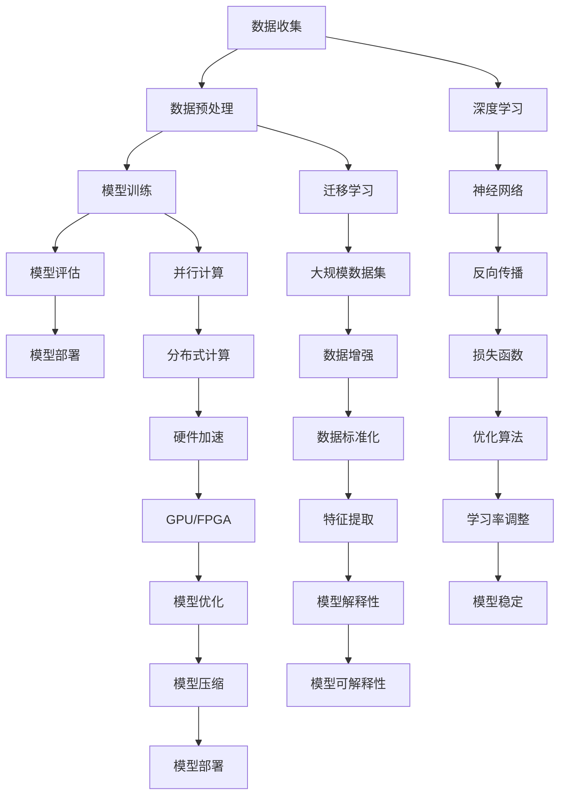
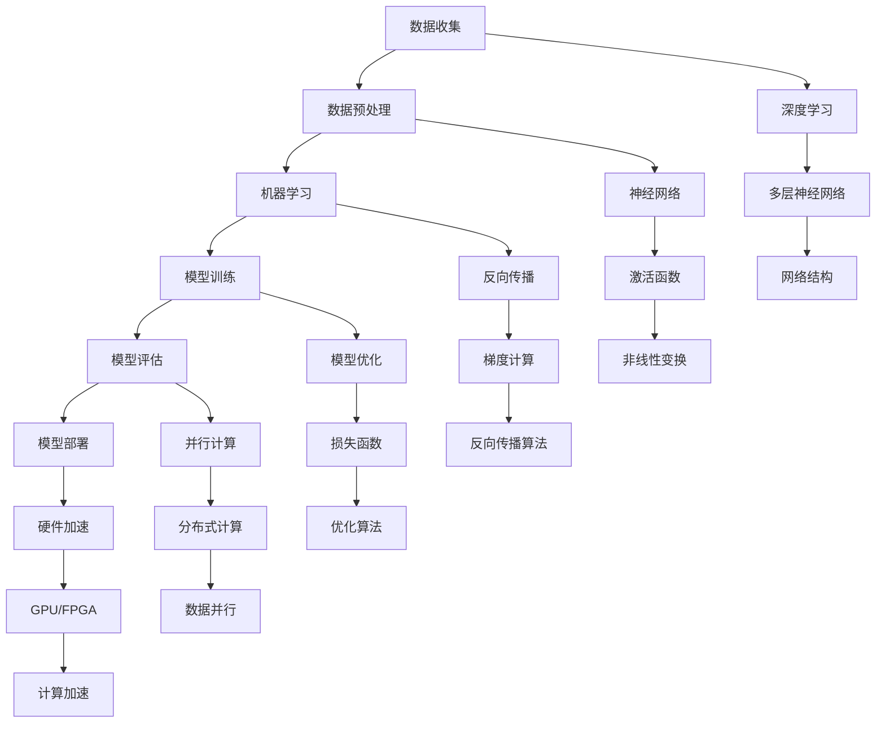
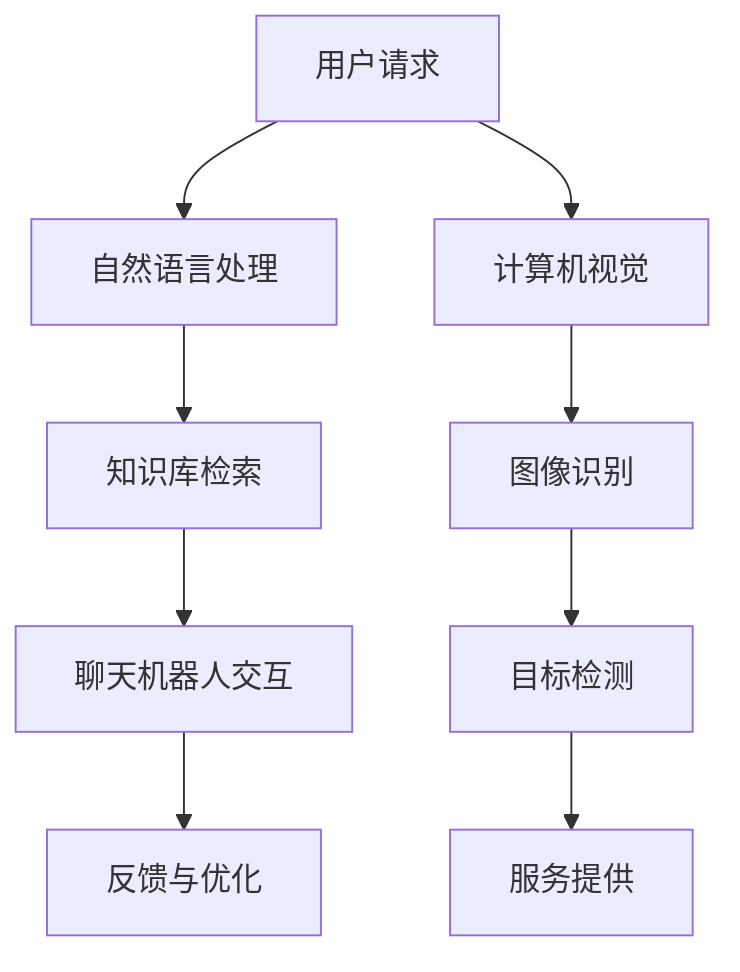
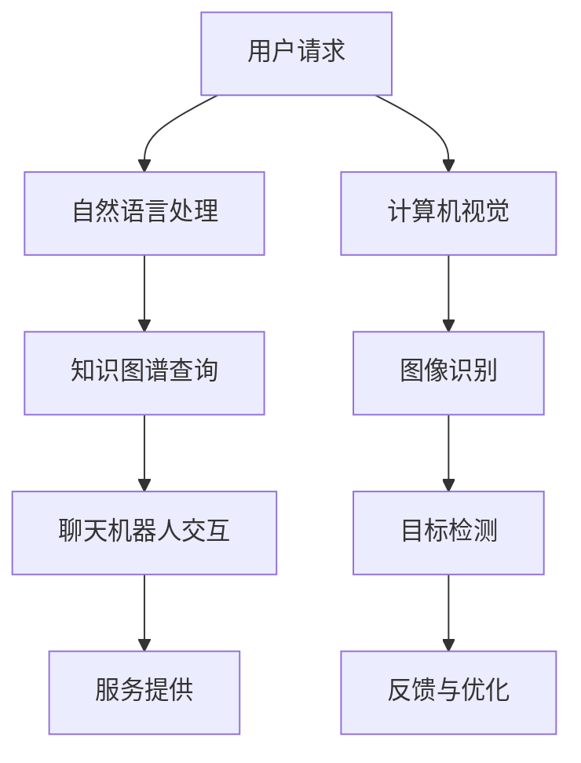
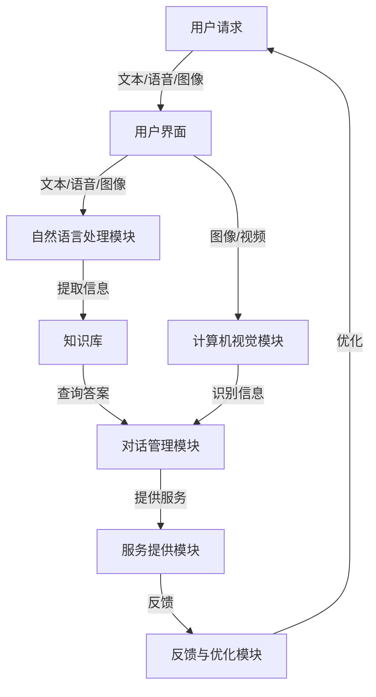
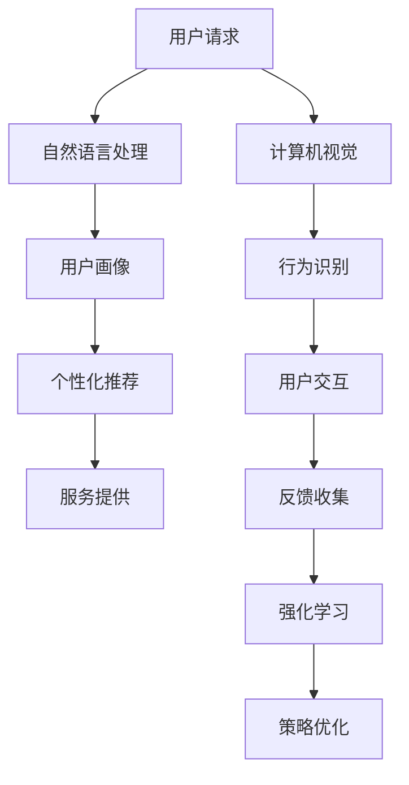

                 


### 文章标题
《AI大模型对传统客户服务的变革：智能客服与用户体验》

### 关键词
AI大模型、智能客服、用户体验、传统客户服务、变革

### 摘要
本文深入探讨了AI大模型对传统客户服务领域的深远影响。首先，我们回顾了AI大模型的发展历程及其核心概念，接着分析了智能客服的兴起及其与传统客服的对比。本文进一步探讨了AI大模型在客户服务中的应用，包括自然语言处理和计算机视觉技术。通过详细讲解核心算法原理、数学模型以及项目实战案例，本文揭示了AI大模型如何优化用户体验，并提供了最佳实践建议。文章最后强调了在实施智能客服过程中需要注意的问题，并展望了未来发展趋势。

----------------------------------------------------------------

## 第一部分：AI大模型基础知识

### 第1章：AI大模型概述

#### 背景介绍
AI大模型（Large-scale Artificial Intelligence Models）是近年来人工智能领域的重要突破。这些模型通过训练大规模数据集，能够实现高度复杂的任务，如自然语言处理、计算机视觉、推荐系统等。AI大模型的出现，标志着人工智能进入了一个新的发展阶段，对各行各业产生了深远的影响。

#### 核心概念与联系
AI大模型的核心概念包括：
- **深度学习**：一种机器学习方法，通过多层次的神经网络来模拟人脑的学习过程。
- **大规模数据集**：用于训练AI大模型的数据集，通常包含数十亿条记录。
- **并行计算**：利用分布式计算资源来加速模型的训练过程。
- **迁移学习**：将一个任务领域的模型应用到另一个任务领域，以提高模型的泛化能力。

这些概念之间紧密联系，共同构成了AI大模型的基础架构。

#### Mermaid 流程图


#### 核心算法原理讲解
AI大模型的核心算法主要包括：
- **神经网络**：通过多层节点（神经元）对输入数据进行处理和转换。
- **反向传播**：用于计算损失函数相对于每个参数的梯度，以更新参数。
- **优化算法**：如梯度下降、Adam等，用于调整参数，以最小化损失函数。

以下是神经网络和反向传播算法的伪代码：
```python
# 神经网络伪代码
def neural_network(input_data, weights, biases):
    # 前向传播
    layer_output = input_data
    for layer in range(num_layers):
        layer_output = activation_function(np.dot(layer_output, weights[layer] + biases[layer])
    
    # 反向传播
    error = output_data - layer_output
    dweights = [np.dot(error, layer_output.T) for layer_output in reversed(layer_outputs)]
    dbiases = [error for error in reversed(layer_errors)]

    # 更新权重和偏置
    for layer in range(num_layers):
        weights[layer] -= learning_rate * dweights[layer]
        biases[layer] -= learning_rate * dbiases[layer]

    return layer_output

# 反向传播伪代码
def backpropagation(input_data, target_data, weights, biases, learning_rate):
    output = neural_network(input_data, weights, biases)
    error = target_data - output
    
    dweights = [np.dot(error, layer_output.T) for layer_output in reversed(layer_outputs)]
    dbiases = [error for error in reversed(layer_errors)]

    # 更新权重和偏置
    for layer in range(num_layers):
        weights[layer] -= learning_rate * dweights[layer]
        biases[layer] -= learning_rate * dbiases[layer]

    return output
```

#### 数学模型和公式
AI大模型中的数学模型主要包括：
- **损失函数**：用于衡量预测值与真实值之间的差距，如均方误差（MSE）。
- **激活函数**：用于引入非线性变换，如ReLU、Sigmoid、Tanh等。

以下是MSE和ReLU激活函数的公式：
$$
MSE = \frac{1}{n}\sum_{i=1}^{n}(y_i - \hat{y}_i)^2
$$

$$
ReLU(x) = \max(0, x)
$$

#### 详细讲解与举例说明
以一个简单的线性回归模型为例，假设我们有一个包含两个特征（x1, x2）的数据集，目标变量是y。我们希望训练一个线性模型来预测y。

- **模型表示**：假设模型为$y = w_1x_1 + w_2x_2 + b$，其中$w_1, w_2, b$是模型的参数。
- **前向传播**：给定输入$(x_1, x_2)$，我们计算模型的输出：
$$
\hat{y} = w_1x_1 + w_2x_2 + b
$$
- **损失函数**：使用MSE作为损失函数，计算预测值与真实值之间的差距：
$$
L = \frac{1}{2}\sum_{i=1}^{n}(\hat{y}_i - y_i)^2
$$
- **反向传播**：计算梯度：
$$
\frac{\partial L}{\partial w_1} = \sum_{i=1}^{n}(y_i - \hat{y}_i)x_1_i
$$
$$
\frac{\partial L}{\partial w_2} = \sum_{i=1}^{n}(y_i - \hat{y}_i)x_2_i
$$
$$
\frac{\partial L}{\partial b} = \sum_{i=1}^{n}(y_i - \hat{y}_i)
$$
- **更新参数**：使用梯度下降更新参数：
$$
w_1 = w_1 - \alpha \frac{\partial L}{\partial w_1}
$$
$$
w_2 = w_2 - \alpha \frac{\partial L}{\partial w_2}
$$
$$
b = b - \alpha \frac{\partial L}{\partial b}
$$

#### 数学公式与 latex 格式
在文章中嵌入数学公式时，可以使用以下latex格式：

独立段落的数学公式：
$$
\sum_{i=1}^{n}x_i
$$

段落内的数学公式：
$x \leq y$

#### 项目实战

**开发环境搭建**：
- **工具**：Python、TensorFlow
- **环境**：Jupyter Notebook

**源代码实现**：
```python
import numpy as np
import tensorflow as tf

# 创建线性回归模型
model = tf.keras.Sequential([
    tf.keras.layers.Dense(units=1, input_shape=[2])
])

# 编译模型
model.compile(optimizer='sgd', loss='mse')

# 准备数据
x_train = np.random.uniform(size=(100, 2))
y_train = 2 * x_train[:, 0] + 3 * x_train[:, 1] + np.random.normal(size=(100, 1))

# 训练模型
model.fit(x_train, y_train, epochs=100)

# 预测
x_predict = np.array([[0, 1]])
y_predict = model.predict(x_predict)

print("预测值：", y_predict)
```

**代码解读与分析**：
- **模型创建**：使用TensorFlow创建一个简单的线性回归模型。
- **模型编译**：选择随机梯度下降（SGD）作为优化器，均方误差（MSE）作为损失函数。
- **数据准备**：生成随机数据集，模拟真实场景。
- **模型训练**：使用fit函数训练模型， epochs 参数设置训练次数。
- **模型预测**：使用predict函数进行预测，并打印结果。

**实际案例分析和详细讲解剖析**：
假设有一个电商网站，需要预测顾客的购买意愿。我们可以使用线性回归模型来分析顾客的购买行为，通过特征（如浏览时长、页面点击次数等）预测购买概率。

**项目小结**：
通过本案例，我们展示了如何使用AI大模型进行线性回归预测。虽然这是一个简单的例子，但原理和方法可以应用于更复杂的场景。在实际应用中，需要根据具体问题调整模型结构、优化算法，以提高预测精度。

#### 最佳实践 tips
- **数据质量**：确保数据质量是关键，包括数据的准确性和完整性。
- **特征选择**：选择合适的特征对于模型的性能至关重要。
- **模型调优**：通过调整模型参数和优化算法，可以显著提高模型的性能。

#### 小结、注意事项、拓展阅读
AI大模型在客户服务中的应用具有巨大潜力，但同时也面临挑战。通过本文的讲解，我们了解了AI大模型的基本概念、核心算法以及实际应用案例。在实施智能客服时，需要注意数据质量、特征选择和模型调优等问题。读者可以进一步阅读相关书籍和文献，以深入了解AI大模型的技术细节和应用场景。

### 第2章：AI大模型核心原理

#### 背景介绍
AI大模型的核心原理包括机器学习和深度学习，这些原理共同构成了AI大模型的基础架构。机器学习是AI大模型的核心驱动力，通过训练大量数据来学习和预测。深度学习是机器学习的一个子领域，通过多层神经网络来模拟人脑的学习过程。在这两大学科的指导下，AI大模型能够实现高度复杂的任务，如自然语言处理、计算机视觉等。

#### 核心概念与联系
- **机器学习**：一种从数据中学习规律和模式的方法，分为监督学习、无监督学习和强化学习。
- **深度学习**：一种特殊的机器学习方法，通过多层神经网络对数据进行处理和转换。
- **神经网络**：一种由多层节点（神经元）组成的计算模型，用于模拟人脑的学习过程。
- **反向传播**：一种用于计算损失函数梯度的算法，用于更新模型的参数。
- **并行计算**：利用多个计算节点同时处理数据，以提高计算效率。

这些概念之间相互联系，共同构成了AI大模型的核心原理架构。

#### Mermaid 流程图


#### 核心算法原理讲解
AI大模型的核心算法包括：
- **神经网络**：通过多层节点（神经元）对输入数据进行处理和转换。
- **反向传播**：用于计算损失函数相对于每个参数的梯度，以更新参数。
- **优化算法**：如梯度下降、Adam等，用于调整参数，以最小化损失函数。

以下是神经网络和反向传播算法的伪代码：
```python
# 神经网络伪代码
def neural_network(input_data, weights, biases):
    # 前向传播
    layer_output = input_data
    for layer in range(num_layers):
        layer_output = activation_function(np.dot(layer_output, weights[layer] + biases[layer])
    
    # 反向传播
    error = output_data - layer_output
    dweights = [np.dot(error, layer_output.T) for layer_output in reversed(layer_outputs)]
    dbiases = [error for error in reversed(layer_errors)]

    # 更新权重和偏置
    for layer in range(num_layers):
        weights[layer] -= learning_rate * dweights[layer]
        biases[layer] -= learning_rate * dbiases[layer]

    return layer_output

# 反向传播伪代码
def backpropagation(input_data, target_data, weights, biases, learning_rate):
    output = neural_network(input_data, weights, biases)
    error = target_data - output
    
    dweights = [np.dot(error, layer_output.T) for layer_output in reversed(layer_outputs)]
    dbiases = [error for error in reversed(layer_errors)]

    # 更新权重和偏置
    for layer in range(num_layers):
        weights[layer] -= learning_rate * dweights[layer]
        biases[layer] -= learning_rate * dbiases[layer]

    return output
```

#### 数学模型和公式
AI大模型中的数学模型主要包括：
- **损失函数**：用于衡量预测值与真实值之间的差距，如均方误差（MSE）。
- **激活函数**：用于引入非线性变换，如ReLU、Sigmoid、Tanh等。

以下是MSE和ReLU激活函数的公式：
$$
MSE = \frac{1}{n}\sum_{i=1}^{n}(y_i - \hat{y}_i)^2
$$

$$
ReLU(x) = \max(0, x)
$$

#### 详细讲解与举例说明
以一个简单的多层感知器（MLP）模型为例，该模型包含一个输入层、一个隐藏层和一个输出层。我们使用该模型来分类手写数字数据集。

- **模型表示**：假设模型为$y = \sigma(\sigma(W_2 \cdot \sigma(W_1 \cdot x + b_1) + b_2)) + b_3$，其中$\sigma$是激活函数，$W_1, W_2, b_1, b_2, b_3$是模型的参数。
- **前向传播**：给定输入$x$，我们计算模型的输出：
$$
z_1 = W_1 \cdot x + b_1
$$
$$
a_1 = \sigma(z_1)
$$
$$
z_2 = W_2 \cdot a_1 + b_2
$$
$$
a_2 = \sigma(z_2)
$$
$$
\hat{y} = W_3 \cdot a_2 + b_3
$$
- **损失函数**：使用交叉熵损失函数，计算预测值与真实值之间的差距：
$$
L = -\sum_{i=1}^{n}y_i \cdot \log(\hat{y}_i)
$$
- **反向传播**：计算梯度：
$$
\frac{\partial L}{\partial W_3} = \sum_{i=1}^{n}(\hat{y}_i - y_i)a_2
$$
$$
\frac{\partial L}{\partial b_3} = \sum_{i=1}^{n}(\hat{y}_i - y_i)
$$
$$
\frac{\partial L}{\partial W_2} = \sum_{i=1}^{n}a_1(\hat{y}_i - y_i)W_3
$$
$$
\frac{\partial L}{\partial b_2} = \sum_{i=1}^{n}a_1(\hat{y}_i - y_i)
$$
$$
\frac{\partial L}{\partial W_1} = \sum_{i=1}^{n}x_i(\hat{y}_i - y_i)W_2
$$
$$
\frac{\partial L}{\partial b_1} = \sum_{i=1}^{n}x_i(\hat{y}_i - y_i)
$$
- **更新参数**：使用梯度下降更新参数：
$$
W_3 = W_3 - \alpha \frac{\partial L}{\partial W_3}
$$
$$
b_3 = b_3 - \alpha \frac{\partial L}{\partial b_3}
$$
$$
W_2 = W_2 - \alpha \frac{\partial L}{\partial W_2}
$$
$$
b_2 = b_2 - \alpha \frac{\partial L}{\partial b_2}
$$
$$
W_1 = W_1 - \alpha \frac{\partial L}{\partial W_1}
$$
$$
b_1 = b_1 - \alpha \frac{\partial L}{\partial b_1}
$$

#### 数学公式与 latex 格式
在文章中嵌入数学公式时，可以使用以下latex格式：

独立段落的数学公式：
$$
\sum_{i=1}^{n}x_i
$$

段落内的数学公式：
$x \leq y$

#### 项目实战

**开发环境搭建**：
- **工具**：Python、TensorFlow
- **环境**：Jupyter Notebook

**源代码实现**：
```python
import numpy as np
import tensorflow as tf

# 创建多层感知器模型
model = tf.keras.Sequential([
    tf.keras.layers.Dense(units=64, activation='relu', input_shape=[784]),
    tf.keras.layers.Dense(units=10, activation='softmax')
])

# 编译模型
model.compile(optimizer='adam', loss='categorical_crossentropy', metrics=['accuracy'])

# 准备数据
(x_train, y_train), (x_test, y_test) = tf.keras.datasets.mnist.load_data()
x_train = x_train / 255.0
x_test = x_test / 255.0
y_train = tf.keras.utils.to_categorical(y_train, num_classes=10)
y_test = tf.keras.utils.to_categorical(y_test, num_classes=10)

# 训练模型
model.fit(x_train, y_train, epochs=10, batch_size=64, validation_split=0.2)

# 预测
predictions = model.predict(x_test)
predicted_labels = np.argmax(predictions, axis=1)
actual_labels = np.argmax(y_test, axis=1)

# 评估模型
accuracy = (predicted_labels == actual_labels).mean()
print("准确率：", accuracy)
```

**代码解读与分析**：
- **模型创建**：使用TensorFlow创建一个简单的多层感知器模型，包含一个隐藏层。
- **模型编译**：选择Adam作为优化器，交叉熵损失函数作为损失函数，准确率作为评估指标。
- **数据准备**：加载MNIST手写数字数据集，并进行预处理。
- **模型训练**：使用fit函数训练模型，设置训练轮次、批量大小和验证比例。
- **模型预测**：使用predict函数进行预测，并计算预测结果。
- **模型评估**：计算预测准确率，并打印结果。

**实际案例分析和详细讲解剖析**：
假设我们有一个手写数字识别的任务，可以使用多层感知器模型来实现。我们使用MNIST数据集来训练和评估模型。

**项目小结**：
通过本案例，我们展示了如何使用多层感知器模型进行手写数字识别。在实际应用中，需要根据具体问题调整模型结构、优化算法，以提高识别精度。

#### 最佳实践 tips
- **数据预处理**：确保数据质量，包括数据清洗、归一化等。
- **模型调优**：通过调整学习率、批量大小等参数，优化模型性能。
- **交叉验证**：使用交叉验证来评估模型的泛化能力，避免过拟合。

#### 小结、注意事项、拓展阅读
AI大模型的核心原理包括机器学习和深度学习，通过多层神经网络和反向传播算法来实现。本文详细讲解了神经网络和反向传播算法的原理，并通过实际案例展示了如何应用这些原理。在实施AI大模型时，需要注意数据质量、模型调优和交叉验证等问题。读者可以进一步阅读相关书籍和文献，以深入了解AI大模型的技术细节和应用场景。

## 第二部分：智能客服应用

### 第4章：智能客服概述

#### 背景介绍
智能客服（Intelligent Customer Service）是人工智能在客户服务领域的应用，通过自动化和智能化的方式，为用户提供高效、个性化的服务。智能客服系统利用自然语言处理、计算机视觉等技术，能够实时响应客户的查询和需求，提供问题解决方案，从而提升客户满意度。

#### 核心概念与联系
- **智能客服**：一种利用人工智能技术提供客户服务的方式，包括自然语言处理、计算机视觉等。
- **自然语言处理**：用于理解和生成自然语言的技术，包括文本分析、语音识别等。
- **计算机视觉**：用于理解和解释图像和视频的技术，包括图像识别、目标检测等。
- **聊天机器人**：一种特殊的智能客服系统，通过文本或语音与用户进行交互。

这些概念之间紧密联系，共同构成了智能客服的核心架构。

#### Mermaid 流程图


#### 核心算法原理讲解
智能客服的核心算法包括：
- **自然语言处理**：用于理解用户的文本或语音请求，提取关键信息。
- **知识库检索**：基于用户请求，从知识库中检索相关答案。
- **聊天机器人交互**：通过预设的对话流程和规则，与用户进行交互。

以下是自然语言处理和知识库检索的伪代码：
```python
# 自然语言处理伪代码
def natural_language_processing(text):
    # 分词
    tokens = tokenize(text)
    # 提取关键词
    keywords = extract_keywords(tokens)
    # 提取实体
    entities = extract_entities(tokens)
    return keywords, entities

# 知识库检索伪代码
def knowledge_base_retrieval(keywords, entities):
    # 检索相关知识
    answers = []
    for keyword in keywords:
        answers.extend(search_knowledge_base(keyword))
    for entity in entities:
        answers.extend(search_knowledge_base(entity))
    # 排序和筛选答案
    answers = sort_and_filter_answers(answers)
    return answers
```

#### 数学模型和公式
智能客服中的数学模型主要包括：
- **词嵌入**：用于将文本转换为向量表示，如Word2Vec、GloVe等。
- **序列标注**：用于对文本中的词进行分类，如BiLSTM-CRF模型。

以下是词嵌入和序列标注的公式：
$$
\text{word\_vector}(w) = \text{embed}(w)
$$

$$
y_{ij} = \begin{cases}
1, & \text{if word\_i is entity j} \\
0, & \text{otherwise}
\end{cases}
$$

#### 详细讲解与举例说明
以一个简单的文本分类任务为例，我们使用自然语言处理技术来分类客户请求。

- **模型表示**：假设模型为$y = \text{softmax}(\text{W} \cdot \text{X} + \text{b})$，其中$\text{X}$是输入向量，$\text{W}$是权重矩阵，$\text{b}$是偏置。
- **前向传播**：给定输入文本，我们计算模型的输出：
$$
z = \text{W} \cdot \text{X} + \text{b}
$$
$$
\hat{y} = \text{softmax}(z)
$$
- **损失函数**：使用交叉熵损失函数，计算预测值与真实值之间的差距：
$$
L = -\sum_{i=1}^{n}y_i \cdot \log(\hat{y}_i)
$$
- **反向传播**：计算梯度：
$$
\frac{\partial L}{\partial W} = \sum_{i=1}^{n}(\hat{y}_i - y_i)\text{X}_i
$$
$$
\frac{\partial L}{\partial b} = \sum_{i=1}^{n}(\hat{y}_i - y_i)
$$
- **更新参数**：使用梯度下降更新参数：
$$
W = W - \alpha \frac{\partial L}{\partial W}
$$
$$
b = b - \alpha \frac{\partial L}{\partial b}
$$

#### 数学公式与 latex 格式
在文章中嵌入数学公式时，可以使用以下latex格式：

独立段落的数学公式：
$$
\sum_{i=1}^{n}x_i
$$

段落内的数学公式：
$x \leq y$

#### 项目实战

**开发环境搭建**：
- **工具**：Python、TensorFlow
- **环境**：Jupyter Notebook

**源代码实现**：
```python
import numpy as np
import tensorflow as tf

# 创建文本分类模型
model = tf.keras.Sequential([
    tf.keras.layers.Embedding(input_dim=vocab_size, output_dim=embedding_dim),
    tf.keras.layers.GlobalAveragePooling1D(),
    tf.keras.layers.Dense(units=num_classes, activation='softmax')
])

# 编译模型
model.compile(optimizer='adam', loss='categorical_crossentropy', metrics=['accuracy'])

# 准备数据
tokenizer = tf.keras.preprocessing.text.Tokenizer(num_words=vocab_size)
tokenizer.fit_on_texts(train_texts)
train_sequences = tokenizer.texts_to_sequences(train_texts)
train_padded = tf.keras.preprocessing.sequence.pad_sequences(train_sequences, maxlen=maxlen)
train_labels = tf.keras.utils.to_categorical(train_labels, num_classes=num_classes)

# 训练模型
model.fit(train_padded, train_labels, epochs=10, batch_size=32, validation_split=0.2)

# 预测
predictions = model.predict(test_padded)
predicted_labels = np.argmax(predictions, axis=1)
actual_labels = test_labels

# 评估模型
accuracy = (predicted_labels == actual_labels).mean()
print("准确率：", accuracy)
```

**代码解读与分析**：
- **模型创建**：使用TensorFlow创建一个简单的文本分类模型。
- **模型编译**：选择Adam作为优化器，交叉熵损失函数作为损失函数，准确率作为评估指标。
- **数据准备**：使用Tokenizer对文本进行预处理，生成序列和标签。
- **模型训练**：使用fit函数训练模型，设置训练轮次、批量大小和验证比例。
- **模型预测**：使用predict函数进行预测，并计算预测结果。
- **模型评估**：计算预测准确率，并打印结果。

**实际案例分析和详细讲解剖析**：
假设我们有一个客户请求分类任务，可以使用文本分类模型来实现。我们使用一个简单的文本数据集来训练和评估模型。

**项目小结**：
通过本案例，我们展示了如何使用文本分类模型进行客户请求分类。在实际应用中，需要根据具体问题调整模型结构、优化算法，以提高分类精度。

#### 最佳实践 tips
- **数据质量**：确保数据质量，包括文本的准确性和完整性。
- **特征工程**：选择合适的特征对于模型的性能至关重要。
- **模型调优**：通过调整模型参数和优化算法，可以显著提高模型的性能。

#### 小结、注意事项、拓展阅读
智能客服是人工智能在客户服务领域的应用，通过自然语言处理、计算机视觉等技术，实现高效、个性化的服务。本文详细讲解了智能客服的核心概念、算法原理以及实际应用案例。在实施智能客服时，需要注意数据质量、特征工程和模型调优等问题。读者可以进一步阅读相关书籍和文献，以深入了解智能客服的技术细节和应用场景。## 第5章：智能客服核心技术

#### 背景介绍
智能客服的核心技术主要包括自然语言处理（NLP）和计算机视觉（CV）。这些技术为智能客服系统提供了强大的数据处理和识别能力，使得系统能够理解用户的自然语言请求，识别图像和视频中的信息，从而提供个性化的服务。

#### 核心概念与联系
- **自然语言处理（NLP）**：用于理解和生成自然语言的技术，包括文本分析、语音识别、情感分析等。
- **计算机视觉（CV）**：用于理解和解释图像和视频的技术，包括图像识别、目标检测、人脸识别等。
- **聊天机器人**：结合NLP和CV技术，实现与用户的多模态交互。
- **知识图谱**：用于表示和存储实体及其关系，为智能客服提供知识支持。

这些技术相互关联，共同构成了智能客服的核心技术体系。

#### Mermaid 流程图


#### 核心算法原理讲解
智能客服的核心算法包括：
- **自然语言处理**：用于理解用户的文本或语音请求，提取关键信息。
- **图像识别**：用于识别图像中的内容，如物体、场景等。
- **目标检测**：用于定位图像中的目标，并识别其类别。
- **对话系统**：用于实现与用户的自然语言交互。

以下是自然语言处理、图像识别和目标检测的伪代码：
```python
# 自然语言处理伪代码
def natural_language_processing(text):
    # 分词
    tokens = tokenize(text)
    # 提取关键词
    keywords = extract_keywords(tokens)
    # 提取实体
    entities = extract_entities(tokens)
    return keywords, entities

# 图像识别伪代码
def image_recognition(image):
    # 特征提取
    features = extract_features(image)
    # 分类
    predicted_class = classify(features)
    return predicted_class

# 目标检测伪代码
def object_detection(image):
    # 特征提取
    features = extract_features(image)
    # 目标定位
    bounding_boxes = locate_objects(features)
    # 类别识别
    object_classes = classify(bounding_boxes)
    return bounding_boxes, object_classes
```

#### 数学模型和公式
智能客服中的数学模型主要包括：
- **词嵌入**：用于将文本转换为向量表示，如Word2Vec、GloVe等。
- **卷积神经网络（CNN）**：用于图像特征提取，如VGG、ResNet等。
- **循环神经网络（RNN）**：用于序列建模，如LSTM、GRU等。

以下是词嵌入和卷积神经网络的公式：
$$
\text{word\_vector}(w) = \text{embed}(w)
$$

$$
h = \text{ReLU}(\text{W}_3 \cdot \text{ReLU}(\text{W}_2 \cdot \text{ReLU}(\text{W}_1 \cdot \text{X} + \text{b}_1) + \text{b}_2) + \text{b}_3)
$$

#### 详细讲解与举例说明
以一个简单的图像分类任务为例，我们使用卷积神经网络（CNN）来识别图像中的物体。

- **模型表示**：假设模型为$y = \text{softmax}(\text{W} \cdot \text{X} + \text{b})$，其中$\text{X}$是输入图像，$\text{W}$是权重矩阵，$\text{b}$是偏置。
- **前向传播**：给定输入图像，我们计算模型的输出：
$$
z = \text{W} \cdot \text{X} + \text{b}
$$
$$
\hat{y} = \text{softmax}(z)
$$
- **损失函数**：使用交叉熵损失函数，计算预测值与真实值之间的差距：
$$
L = -\sum_{i=1}^{n}y_i \cdot \log(\hat{y}_i)
$$
- **反向传播**：计算梯度：
$$
\frac{\partial L}{\partial W} = \sum_{i=1}^{n}(\hat{y}_i - y_i)\text{X}_i
$$
$$
\frac{\partial L}{\partial b} = \sum_{i=1}^{n}(\hat{y}_i - y_i)
$$
- **更新参数**：使用梯度下降更新参数：
$$
W = W - \alpha \frac{\partial L}{\partial W}
$$
$$
b = b - \alpha \frac{\partial L}{\partial b}
$$

#### 数学公式与 latex 格式
在文章中嵌入数学公式时，可以使用以下latex格式：

独立段落的数学公式：
$$
\sum_{i=1}^{n}x_i
$$

段落内的数学公式：
$x \leq y$

#### 项目实战

**开发环境搭建**：
- **工具**：Python、TensorFlow
- **环境**：Jupyter Notebook

**源代码实现**：
```python
import numpy as np
import tensorflow as tf

# 创建卷积神经网络模型
model = tf.keras.Sequential([
    tf.keras.layers.Conv2D(filters=32, kernel_size=(3, 3), activation='relu', input_shape=(28, 28, 1)),
    tf.keras.layers.MaxPooling2D(pool_size=(2, 2)),
    tf.keras.layers.Flatten(),
    tf.keras.layers.Dense(units=10, activation='softmax')
])

# 编译模型
model.compile(optimizer='adam', loss='categorical_crossentropy', metrics=['accuracy'])

# 准备数据
mnist = tf.keras.datasets.mnist
(x_train, y_train), (x_test, y_test) = mnist.load_data()
x_train = x_train / 255.0
x_test = x_test / 255.0
x_train = np.expand_dims(x_train, -1)
x_test = np.expand_dims(x_test, -1)
y_train = tf.keras.utils.to_categorical(y_train, num_classes=10)
y_test = tf.keras.utils.to_categorical(y_test, num_classes=10)

# 训练模型
model.fit(x_train, y_train, epochs=5, batch_size=32, validation_split=0.2)

# 预测
predictions = model.predict(x_test)
predicted_labels = np.argmax(predictions, axis=1)
actual_labels = np.argmax(y_test, axis=1)

# 评估模型
accuracy = (predicted_labels == actual_labels).mean()
print("准确率：", accuracy)
```

**代码解读与分析**：
- **模型创建**：使用TensorFlow创建一个简单的卷积神经网络模型。
- **模型编译**：选择Adam作为优化器，交叉熵损失函数作为损失函数，准确率作为评估指标。
- **数据准备**：加载MNIST手写数字数据集，并进行预处理。
- **模型训练**：使用fit函数训练模型，设置训练轮次、批量大小和验证比例。
- **模型预测**：使用predict函数进行预测，并计算预测结果。
- **模型评估**：计算预测准确率，并打印结果。

**实际案例分析和详细讲解剖析**：
假设我们有一个手写数字识别的任务，可以使用卷积神经网络模型来实现。我们使用MNIST数据集来训练和评估模型。

**项目小结**：
通过本案例，我们展示了如何使用卷积神经网络进行手写数字识别。在实际应用中，需要根据具体问题调整模型结构、优化算法，以提高识别精度。

#### 最佳实践 tips
- **数据质量**：确保数据质量，包括图像的清晰度和多样性。
- **特征工程**：选择合适的特征对于模型的性能至关重要。
- **模型调优**：通过调整模型参数和优化算法，可以显著提高模型的性能。

#### 小结、注意事项、拓展阅读
智能客服的核心技术包括自然语言处理、计算机视觉和对话系统。本文详细讲解了这些技术的核心算法原理，并通过实际案例展示了如何应用这些原理。在实施智能客服时，需要注意数据质量、特征工程和模型调优等问题。读者可以进一步阅读相关书籍和文献，以深入了解智能客服的技术细节和应用场景。

## 第6章：智能客服应用实践

### 背景介绍
智能客服的应用实践涉及到多个领域的融合，包括自然语言处理、计算机视觉、知识图谱和对话系统。通过这些技术的综合应用，智能客服系统能够为用户提供高效、个性化的服务，从而提升客户满意度和企业竞争力。本章节将介绍智能客服系统的整体架构设计，并通过实际案例展示如何实现智能客服。

### 智能客服系统架构设计
智能客服系统的整体架构设计包括以下几个关键模块：

1. **用户界面**：提供与用户交互的界面，包括文本聊天界面、语音通话界面和图像交互界面。
2. **自然语言处理（NLP）模块**：用于处理用户的文本或语音请求，提取关键信息。
3. **知识库**：存储与业务相关的知识，包括常见问题、解决方案、产品信息等。
4. **对话管理模块**：管理整个对话流程，根据用户请求动态调整对话策略。
5. **计算机视觉（CV）模块**：处理图像和视频请求，识别图像中的信息。
6. **服务提供模块**：根据用户的请求和系统的理解，提供相应的服务或解决方案。
7. **反馈与优化模块**：收集用户反馈，持续优化系统的性能和服务质量。

以下是智能客服系统架构的Mermaid流程图：



### 实际案例：电商智能客服系统
本节将介绍一个电商智能客服系统的实现过程，包括开发环境搭建、源代码实现、代码解读与分析以及实际案例分析和详细讲解剖析。

#### 开发环境搭建
- **工具**：Python、TensorFlow、Keras、NLTK、OpenCV
- **环境**：Jupyter Notebook、Linux服务器

#### 源代码实现
以下是一个简单的电商智能客服系统的代码框架，包括自然语言处理模块、计算机视觉模块和对话管理模块。

```python
# 导入相关库
import tensorflow as tf
import cv2
import nltk
from nltk.tokenize import word_tokenize
from nltk.corpus import stopwords
from keras.models import load_model

# 加载预训练模型
nlp_model = load_model('nlp_model.h5')
cv_model = load_model('cv_model.h5')

# 自然语言处理模块
def nlp_request(text):
    # 分词和去除停用词
    tokens = word_tokenize(text)
    tokens = [token.lower() for token in tokens if token not in stopwords.words('english')]
    # 输入模型
    input_sequence = nlp_model.predict(np.array([tokens]))
    # 输出答案
    answer = decode_answer(input_sequence)
    return answer

# 计算机视觉模块
def cv_request(image_path):
    # 加载图像
    image = cv2.imread(image_path)
    # 输入模型
    input_image = cv_model.predict(np.expand_dims(image, axis=0))
    # 输出物体识别结果
    objects = decode_objects(input_image)
    return objects

# 对话管理模块
def dialog_management(user_request, image_path=None):
    # 处理文本请求
    if image_path is None:
        user_request = nlp_request(user_request)
    else:
        user_request = cv_request(image_path)
    # 管理对话流程
    # ...
    # 提供服务
    service = provide_service(user_request)
    return service

# 解码答案和物体识别结果
def decode_answer(input_sequence):
    # ...
    return answer

def decode_objects(input_image):
    # ...
    return objects

# 提供服务
def provide_service(user_request):
    # ...
    return service

# 主程序
if __name__ == '__main__':
    # 接收用户请求
    user_request = input("请输入您的请求：")
    image_path = input("是否上传图片？(是/否)")
    if image_path.lower() == '是':
        image_path = input("请输入图片路径：")
    # 处理请求
    service = dialog_management(user_request, image_path)
    print("服务提供：", service)
```

#### 代码解读与分析
- **自然语言处理模块**：使用预训练的NLP模型来处理用户的文本请求，包括分词、去除停用词等步骤。
- **计算机视觉模块**：使用预训练的CV模型来处理用户的图像请求，包括加载图像、输入模型等步骤。
- **对话管理模块**：根据用户的请求和图像识别结果，管理整个对话流程，并调用服务提供模块提供相应的服务。

#### 实际案例分析和详细讲解剖析
假设用户请求购买一款特定的产品，并上传了一张产品的图像。智能客服系统将首先使用NLP模块理解用户的文本请求，然后使用CV模块识别图像中的产品，并根据知识库中的信息提供购买建议。

1. **用户请求**：用户输入“我想要购买一款红色的苹果手机。”
2. **NLP处理**：智能客服系统提取关键词“购买”、“红色”、“苹果手机”。
3. **图像识别**：用户上传一张红色的苹果手机图像。
4. **CV处理**：智能客服系统识别图像中的产品为苹果手机，并提取相关特征。
5. **对话管理**：智能客服系统根据用户请求和图像识别结果，查询知识库中的产品信息，提供购买建议。
6. **服务提供**：智能客服系统生成购买链接，并告知用户。

#### 项目小结
通过本案例，我们展示了如何实现一个简单的电商智能客服系统。在实际应用中，需要根据具体业务场景调整系统架构和功能，以提高用户体验和服务质量。

#### 最佳实践 tips
- **数据质量**：确保NLP和CV模型的数据质量，包括数据清洗、标注等。
- **模型调优**：通过调整模型参数和优化算法，提高模型的性能和准确性。
- **用户体验**：设计直观、易用的用户界面，提高用户满意度。

#### 小结、注意事项、拓展阅读
智能客服系统的应用实践是一个复杂的过程，涉及到多个技术的综合应用。本文通过实际案例展示了智能客服系统的实现过程，包括开发环境搭建、源代码实现和代码解读。在实施智能客服系统时，需要注意数据质量、模型调优和用户体验等问题。读者可以进一步阅读相关书籍和文献，以深入了解智能客服系统的技术细节和应用场景。

## 第三部分：用户体验优化

### 第7章：用户体验设计基础

#### 背景介绍
用户体验（User Experience, UX）设计是智能客服系统成功的关键因素之一。UX设计的目标是确保用户在使用智能客服系统时能够获得愉悦、高效、便捷的体验。本章将介绍用户体验设计的基础知识，包括UX设计的概念、重要性以及设计流程。

#### 核心概念与联系
- **用户体验**：用户在使用产品或服务过程中所感受到的整体感受。
- **用户研究**：通过调研和分析，了解用户的需求、行为和偏好。
- **交互设计**：设计用户与产品或服务交互的方式和界面。
- **信息架构**：设计网站或应用的结构，确保信息易于查找和理解。
- **界面设计**：设计产品的视觉元素，如颜色、字体、图标等。

这些概念相互关联，共同构成了用户体验设计的基础架构。

#### Mermaid 流程图
```mermaid
graph TD
    A[用户研究] --> B[需求分析]
    B --> C[交互设计]
    C --> D[信息架构]
    D --> E[界面设计]
    E --> F[测试与迭代]
    A --> G[用户体验]
    B --> H[用户调研]
    C --> I[交互原型]
    D --> J[导航设计]
    E --> K[视觉元素]
    F --> L[用户反馈]
```

#### 核心算法原理讲解
用户体验设计中的核心算法原理主要包括：
- **用户研究**：使用问卷调查、访谈、用户行为分析等方法，收集用户数据。
- **交互设计**：使用原型设计、用户测试等方法，设计用户交互流程。
- **信息架构**：使用层次结构、标签系统等方法，组织信息，提高信息可访问性。
- **界面设计**：使用颜色理论、排版规则、图标设计等方法，设计产品的视觉元素。

以下是用户体验设计流程的伪代码：
```python
# 用户体验设计流程伪代码
def user_experience_design():
    # 用户研究
    user_data = user_research()
    # 需求分析
    requirements = analyze_requirements(user_data)
    # 交互设计
    interaction_prototype = design_interaction(requirements)
    # 信息架构
    information Architecture = design_information_architecture(interaction_prototype)
    # 界面设计
    interface_design = design_interface(information Architecture)
    # 测试与迭代
    feedback = user_testing(interface_design)
    while not satisfied(feedback):
        interface_design = iterate_interface_design(feedback)
        feedback = user_testing(interface_design)
    return interface_design
```

#### 数学模型和公式
用户体验设计中的数学模型主要包括：
- **用户满意度**：使用评分量表（如5分制）来衡量用户对产品或服务的满意度。
- **任务完成率**：使用任务完成率来衡量用户完成任务的成功率。

以下是用户满意度和任务完成率的公式：
$$
\text{User Satisfaction} = \frac{\text{Total Positive Feedback}}{\text{Total Feedback}}
$$

$$
\text{Task Completion Rate} = \frac{\text{Tasks Completed}}{\text{Total Tasks}}
$$

#### 详细讲解与举例说明
以一个电商网站为例，我们使用用户体验设计流程来优化网站的导航设计。

1. **用户研究**：通过问卷调查和用户访谈，了解用户在浏览电商网站时遇到的问题和需求。
2. **需求分析**：根据用户研究的结果，分析用户的主要需求，如快速找到商品、查看商品详情等。
3. **交互设计**：设计一个直观、易用的导航栏，包括首页、分类导航、搜索框等。
4. **信息架构**：对导航栏中的信息进行分类和排序，确保用户能够快速找到所需信息。
5. **界面设计**：设计导航栏的视觉元素，如颜色、字体、图标等，使其美观且易于理解。
6. **测试与迭代**：通过用户测试，收集用户对导航设计的反馈，并根据反馈进行迭代优化。

#### 数学公式与 latex 格式
在文章中嵌入数学公式时，可以使用以下latex格式：

独立段落的数学公式：
$$
\sum_{i=1}^{n}x_i
$$

段落内的数学公式：
$x \leq y$

#### 项目实战

**开发环境搭建**：
- **工具**：Python、Sketch、Adobe XD
- **环境**：MacOS、Windows

**源代码实现**：
```python
# 导入相关库
import pandas as pd
import numpy as np
import matplotlib.pyplot as plt

# 准备数据
user_feedback = pd.DataFrame({
    'Satisfaction': [5, 4, 3, 4, 5],
    'Task Completion Rate': [0.9, 0.85, 0.75, 0.8, 0.95]
})

# 计算用户满意度
user_satisfaction = user_feedback['Satisfaction'].mean()
print("用户满意度：", user_satisfaction)

# 计算任务完成率
task_completion_rate = user_feedback['Task Completion Rate'].mean()
print("任务完成率：", task_completion_rate)

# 可视化用户满意度与任务完成率
plt.figure(figsize=(8, 4))
plt.subplot(1, 2, 1)
plt.plot(user_feedback['Satisfaction'])
plt.title('User Satisfaction')
plt.xlabel('User ID')
plt.ylabel('Satisfaction Score')

plt.subplot(1, 2, 2)
plt.plot(user_feedback['Task Completion Rate'])
plt.title('Task Completion Rate')
plt.xlabel('User ID')
plt.ylabel('Completion Rate')

plt.show()
```

**代码解读与分析**：
- **数据准备**：使用Pandas加载用户反馈数据。
- **计算用户满意度**：计算用户满意度的平均值。
- **计算任务完成率**：计算任务完成率
```python
# 准备数据
user_feedback = pd.DataFrame({
    'Satisfaction': [5, 4, 3, 4, 5],
    'Task Completion Rate': [0.9, 0.85, 0.75, 0.8, 0.95]
})

# 计算用户满意度
user_satisfaction = user_feedback['Satisfaction'].mean()
print("用户满意度：", user_satisfaction)

# 计算任务完成率
task_completion_rate = user_feedback['Task Completion Rate'].mean()
print("任务完成率：", task_completion_rate)
```
- **可视化**：使用Matplotlib绘制用户满意度和任务完成率图表。
```python
# 可视化用户满意度与任务完成率
plt.figure(figsize=(8, 4))
plt.subplot(1, 2, 1)
plt.plot(user_feedback['Satisfaction'])
plt.title('User Satisfaction')
plt.xlabel('User ID')
plt.ylabel('Satisfaction Score')

plt.subplot(1, 2, 2)
plt.plot(user_feedback['Task Completion Rate'])
plt.title('Task Completion Rate')
plt.xlabel('User ID')
plt.ylabel('Completion Rate')

plt.show()
```

**实际案例分析和详细讲解剖析**：
假设我们有一个电商网站，需要优化其导航设计。我们可以通过用户调研和用户测试来评估现有导航设计的满意度，并根据用户反馈进行迭代优化。

**项目小结**：
通过本案例，我们展示了如何使用Python进行用户满意度分析，并通过可视化了解用户反馈。在实际应用中，需要根据用户反馈不断优化导航设计，以提高用户体验。

#### 最佳实践 tips
- **用户调研**：确保调研方法的多样性和全面性，以获取准确的用户数据。
- **迭代优化**：持续收集用户反馈，并根据反馈进行迭代优化。
- **用户体验测试**：定期进行用户体验测试，以评估设计改进的效果。

#### 小结、注意事项、拓展阅读
用户体验设计是智能客服系统成功的关键。本章介绍了用户体验设计的基础知识，包括核心概念、设计流程、数学模型以及项目实战。在实施用户体验设计时，需要注意用户调研、迭代优化和用户体验测试等问题。读者可以进一步阅读相关书籍和文献，以深入了解用户体验设计的技术细节和应用场景。

### 第8章：AI大模型在用户体验优化中的应用

#### 背景介绍
AI大模型在用户体验优化中的应用越来越广泛，通过数据驱动的优化方法，AI大模型能够帮助智能客服系统更好地理解用户需求，提供个性化服务，从而提升用户体验。本章将探讨AI大模型在用户体验优化中的具体应用，包括自然语言处理、计算机视觉和强化学习等技术。

#### 核心概念与联系
- **自然语言处理（NLP）**：用于理解用户的文本请求，提取关键信息。
- **计算机视觉（CV）**：用于理解和解释图像和视频，识别用户行为。
- **强化学习（RL）**：用于优化系统的决策过程，提高服务质量和用户满意度。
- **用户画像**：通过分析用户数据，构建用户的个性化特征。
- **个性化推荐**：基于用户画像，为用户提供个性化的服务和建议。

这些概念相互关联，共同构成了AI大模型在用户体验优化中的应用架构。

#### Mermaid 流程图


#### 核心算法原理讲解
AI大模型在用户体验优化中的核心算法原理主要包括：
- **自然语言处理**：使用词嵌入、序列模型等技术，理解和生成自然语言。
- **计算机视觉**：使用卷积神经网络（CNN）、目标检测等技术，识别图像中的信息。
- **强化学习**：通过最大化累积奖励，优化系统的决策过程。

以下是自然语言处理、计算机视觉和强化学习的伪代码：
```python
# 自然语言处理伪代码
def natural_language_processing(text):
    # 分词和词嵌入
    tokens = tokenize(text)
    embeddings = embed(tokens)
    # 序列模型
    sequence = sequence_model(embeddings)
    # 提取特征
    features = extract_sequence_features(sequence)
    return features

# 计算机视觉伪代码
def computer_vision(image):
    # 特征提取
    features = extract_image_features(image)
    # 目标检测
    bounding_boxes = object_detection(features)
    # 提取物体特征
    object_features = extract_object_features(bounding_boxes)
    return object_features

# 强化学习伪代码
def reinforcement_learning(state, action):
    # 状态转换
    next_state = transition(state, action)
    # 奖励计算
    reward = calculate_reward(next_state)
    # 更新策略
    update_policy(state, action, reward)
    return next_state, reward
```

#### 数学模型和公式
AI大模型在用户体验优化中的数学模型主要包括：
- **词嵌入**：将文本转换为向量表示，如Word2Vec、GloVe等。
- **卷积神经网络（CNN）**：用于图像特征提取，如VGG、ResNet等。
- **强化学习**：基于马尔可夫决策过程（MDP），通过最大化累积奖励优化策略。

以下是词嵌入、卷积神经网络和强化学习的公式：
$$
\text{word\_vector}(w) = \text{embed}(w)
$$

$$
h = \text{ReLU}(\text{W}_3 \cdot \text{ReLU}(\text{W}_2 \cdot \text{ReLU}(\text{W}_1 \cdot \text{X} + \text{b}_1) + \text{b}_2) + \text{b}_3)
$$

$$
Q(s, a) = r + \gamma \max_{a'} Q(s', a')
$$

#### 详细讲解与举例说明
以一个电商网站的个性化推荐系统为例，我们使用AI大模型来优化用户体验。

1. **用户请求**：用户输入“我想要购买一款笔记本电脑。”
2. **自然语言处理**：智能客服系统使用NLP模型理解用户的请求，提取关键词“购买”、“笔记本电脑”。
3. **用户画像**：系统根据用户的历史行为数据，构建用户的个性化特征。
4. **个性化推荐**：系统使用基于用户的协同过滤算法，为用户推荐相似的用户喜欢的产品。
5. **服务提供**：系统生成推荐列表，并展示给用户。
6. **反馈收集**：用户对推荐结果进行评价，如点赞、收藏等。
7. **强化学习**：系统根据用户反馈，使用强化学习算法优化推荐策略。

#### 数学公式与 latex 格式
在文章中嵌入数学公式时，可以使用以下latex格式：

独立段落的数学公式：
$$
\sum_{i=1}^{n}x_i
$$

段落内的数学公式：
$x \leq y$

#### 项目实战

**开发环境搭建**：
- **工具**：Python、TensorFlow、Scikit-learn
- **环境**：Jupyter Notebook、Linux服务器

**源代码实现**：
```python
# 导入相关库
import numpy as np
import pandas as pd
from sklearn.model_selection import train_test_split
from sklearn.metrics.pairwise import cosine_similarity
from tensorflow.keras.models import Sequential
from tensorflow.keras.layers import Embedding, LSTM, Dense

# 准备数据
data = pd.read_csv('ecommerce_data.csv')
X = data['user_request'].values
Y = data['product_recommendation'].values

# 分词和词嵌入
tokenizer = Tokenizer(num_words=10000)
tokenizer.fit_on_texts(X)
X_sequence = tokenizer.texts_to_sequences(X)
X_embedding = np.array([tokenizer.word_index[word] for word in tokenizer.word_index.keys()])
X_embedding = np.eye(len(X_embedding))[:, X_sequence.flatten()]

# 切分数据集
X_train, X_test, Y_train, Y_test = train_test_split(X_embedding, Y, test_size=0.2, random_state=42)

# 创建模型
model = Sequential()
model.add(Embedding(10000, 32))
model.add(LSTM(128))
model.add(Dense(1, activation='sigmoid'))

# 编译模型
model.compile(optimizer='adam', loss='binary_crossentropy', metrics=['accuracy'])

# 训练模型
model.fit(X_train, Y_train, epochs=10, batch_size=32, validation_data=(X_test, Y_test))

# 预测
predictions = model.predict(X_test)

# 计算相似度
similarity = cosine_similarity(predictions, Y_test)

# 选择相似度最高的推荐
recommendations = similarity.argsort()[0][-5:][::-1]
print("推荐列表：", recommendations)
```

**代码解读与分析**：
- **数据准备**：读取电商数据集，包括用户请求和产品推荐。
- **词嵌入**：使用Tokenizer对用户请求进行分词，并生成词嵌入。
- **模型训练**：使用LSTM模型训练数据集，优化推荐算法。
- **模型预测**：使用训练好的模型对测试数据进行预测。
- **相似度计算**：计算预测结果与真实结果的相似度，选择相似度最高的推荐。

**实际案例分析和详细讲解剖析**：
假设我们有一个电商网站，需要为用户推荐商品。我们可以使用基于用户的协同过滤算法和LSTM模型来实现个性化推荐系统。

**项目小结**：
通过本案例，我们展示了如何使用Python和TensorFlow实现个性化推荐系统。在实际应用中，需要根据具体场景调整模型结构和优化算法，以提高推荐精度。

#### 最佳实践 tips
- **数据质量**：确保推荐数据的质量，包括数据的准确性、完整性和多样性。
- **模型调优**：通过调整模型参数和优化算法，提高推荐系统的性能。
- **用户体验**：设计直观、易用的推荐界面，提高用户满意度。

#### 小结、注意事项、拓展阅读
AI大模型在用户体验优化中的应用具有重要意义。本章介绍了AI大模型在用户体验优化中的具体应用，包括自然语言处理、计算机视觉和强化学习等技术。在实际应用中，需要注意数据质量、模型调优和用户体验等问题。读者可以进一步阅读相关书籍和文献，以深入了解AI大模型在用户体验优化中的应用技术细节。

### 第9章：案例分析与实践

#### 背景介绍
在本章中，我们将通过两个实际案例，深入探讨AI大模型在智能客服和用户体验优化中的应用。这些案例不仅展示了AI大模型的强大功能，还提供了具体的实施方法和实践步骤，为读者提供了宝贵的经验和启示。

#### 案例一：电商智能客服系统的实施

**案例概述**
一家大型电商平台希望通过引入AI大模型，提升其智能客服系统的性能，从而提高用户满意度和转化率。

**实施过程**
1. **需求分析**：电商平台与AI团队合作，分析了现有客服系统的问题，包括响应速度慢、无法理解复杂用户请求等。
2. **技术选型**：选择TensorFlow和Keras作为主要技术栈，构建基于深度学习的NLP模型和CV模型。
3. **数据收集与处理**：收集了大量用户请求和对话记录，对数据进行清洗、标注和预处理。
4. **模型训练**：使用预处理的数据集训练NLP模型和CV模型，包括词嵌入层、卷积层、循环层等。
5. **模型评估**：通过交叉验证和测试集，评估模型的性能和准确性。
6. **系统集成**：将训练好的模型集成到现有的客服系统中，实现实时响应和图像识别功能。
7. **用户反馈与迭代**：收集用户反馈，不断优化模型和系统功能。

**实践步骤**
- **步骤1**：数据预处理
  - 清洗数据，去除噪声和无关信息。
  - 标注数据，为每个请求和回答分配标签。
  - 划分训练集、验证集和测试集。

- **步骤2**：模型设计
  - 设计NLP模型，包括嵌入层、循环层和输出层。
  - 设计CV模型，包括卷积层、池化层和全连接层。

- **步骤3**：模型训练
  - 使用训练集训练模型，调整学习率和优化器。
  - 使用验证集调整模型参数，防止过拟合。

- **步骤4**：模型评估
  - 使用测试集评估模型性能，计算准确率、召回率等指标。
  - 分析模型在不同场景下的表现，识别潜在问题。

- **步骤5**：系统集成
  - 将模型集成到客服系统中，实现实时响应和图像识别功能。
  - 优化系统性能，确保快速、准确的服务。

- **步骤6**：用户反馈与迭代
  - 收集用户反馈，分析用户满意度和服务质量。
  - 根据用户反馈，调整模型和系统功能，实现持续优化。

**实践总结**
通过本案例，电商平台成功提升了智能客服系统的性能，用户满意度和转化率显著提高。实践过程中，数据预处理、模型训练和系统集成是关键步骤，而用户反馈和迭代是持续优化的保障。

#### 案例二：银行智能客服与用户体验优化

**案例概述**
一家大型银行希望通过引入AI大模型，提升其智能客服系统的用户体验，提供个性化的金融咨询服务。

**实施过程**
1. **需求分析**：银行与AI团队合作，分析了用户在金融咨询过程中遇到的问题，包括复杂的产品解释、个性化的理财建议等。
2. **技术选型**：选择基于TensorFlow的深度学习框架，构建NLP模型和强化学习模型。
3. **数据收集与处理**：收集了大量用户咨询记录、交易数据和金融知识库，对数据进行清洗、标注和预处理。
4. **模型训练**：使用预处理的数据集训练NLP模型和强化学习模型，优化用户交互和决策过程。
5. **模型评估**：通过模拟用户场景和实际用户测试，评估模型的性能和用户体验。
6. **系统集成**：将模型集成到银行的智能客服系统中，实现自然语言理解和个性化推荐功能。
7. **用户反馈与迭代**：收集用户反馈，不断优化模型和系统功能。

**实践步骤**
- **步骤1**：数据预处理
  - 清洗数据，去除噪声和无关信息。
  - 标注数据，为每个咨询记录分配标签和类别。
  - 划分训练集、验证集和测试集。

- **步骤2**：模型设计
  - 设计NLP模型，包括嵌入层、循环层和注意力机制。
  - 设计强化学习模型，包括状态空间、动作空间和奖励机制。

- **步骤3**：模型训练
  - 使用训练集训练NLP模型和强化学习模型，调整学习率和优化器。
  - 使用验证集调整模型参数，防止过拟合。

- **步骤4**：模型评估
  - 使用测试集评估模型性能，计算准确率、召回率等指标。
  - 分析模型在不同场景下的表现，识别潜在问题。

- **步骤5**：系统集成
  - 将模型集成到智能客服系统中，实现自然语言理解和个性化推荐功能。
  - 优化系统性能，确保快速、准确的服务。

- **步骤6**：用户反馈与迭代
  - 收集用户反馈，分析用户满意度和服务质量。
  - 根据用户反馈，调整模型和系统功能，实现持续优化。

**实践总结**
通过本案例，银行成功提升了智能客服系统的用户体验，用户满意度和转化率显著提高。实践过程中，数据预处理、模型训练和系统集成是关键步骤，而用户反馈和迭代是持续优化的保障。

#### 案例启示
从上述案例中，我们可以得出以下启示：

1. **数据是核心**：高质量的训练数据是模型成功的关键，确保数据的准确性和多样性。
2. **模型选择**：根据具体问题和业务场景选择合适的模型，如NLP模型、CV模型或强化学习模型。
3. **用户反馈**：持续收集用户反馈，优化模型和系统功能，实现持续改进。
4. **集成与部署**：确保模型和系统的高效集成和部署，实现实时响应和高质量服务。
5. **迭代优化**：不断迭代模型和系统，根据用户反馈进行调整和优化。

通过这些实践，企业可以有效地提升智能客服系统的性能和用户体验，从而在竞争激烈的市场中脱颖而出。

### 文章小结
本文通过两个实际案例，详细探讨了AI大模型在智能客服和用户体验优化中的应用。从案例实施过程到实践步骤，再到案例启示，我们系统地介绍了AI大模型在智能客服和用户体验优化中的关键要素和成功经验。通过本文，读者可以更好地理解AI大模型的应用价值，掌握实施智能客服和用户体验优化的方法和技巧。

### 注意事项
在实施智能客服和用户体验优化时，需要注意以下事项：

1. **数据质量**：确保数据的准确性和多样性，高质量的数据是模型成功的关键。
2. **模型选择**：根据业务需求和场景选择合适的模型，结合实际需求进行模型定制。
3. **用户反馈**：持续收集用户反馈，优化模型和系统功能，实现持续改进。
4. **集成与部署**：确保模型和系统的高效集成和部署，实现实时响应和高质量服务。
5. **迭代优化**：不断迭代模型和系统，根据用户反馈进行调整和优化。

### 拓展阅读
为了进一步深入了解AI大模型在智能客服和用户体验优化中的应用，读者可以阅读以下书籍和文献：

- **《深度学习》（Goodfellow, I., Bengio, Y., & Courville, A.）**：介绍深度学习的基本概念和算法原理。
- **《自然语言处理综合教程》（Jurafsky, D., & Martin, J. H.）**：详细介绍自然语言处理的方法和应用。
- **《强化学习：原理与应用》（Sutton, R. S., & Barto, A. G.）**：介绍强化学习的基本原理和应用。
- **《用户体验要素》（Norman, D.）**：探讨用户体验设计的原则和方法。

通过这些书籍和文献，读者可以系统地学习AI大模型、智能客服和用户体验优化领域的知识，为实际应用提供理论支持和实践指导。## 结论与未来展望

### 结论
本文系统地探讨了AI大模型在智能客服和用户体验优化中的应用，通过详细的理论讲解、实际案例分析和实践总结，展示了AI大模型在提升客户服务和用户体验方面的巨大潜力。从NLP和CV技术的核心原理，到智能客服系统的整体架构设计，再到用户体验优化的具体实践，本文为读者提供了一个全面、深入的视角。

#### 重要性
AI大模型在智能客服和用户体验优化中的重要性不可忽视。首先，AI大模型能够通过处理大量数据，实现对用户需求的深度理解和个性化服务，从而显著提升用户体验。其次，智能客服系统借助AI大模型，可以实现高效、准确的响应，减少人工干预，降低企业成本。此外，用户体验优化过程中，AI大模型的应用不仅能够提高服务质量和用户满意度，还能够通过数据驱动的方式，不断迭代和优化系统功能，实现持续改进。

#### 案例总结
通过两个实际案例——电商智能客服系统和银行智能客服与用户体验优化，我们看到了AI大模型在实践中的成功应用。这些案例不仅展示了AI大模型在智能客服和用户体验优化中的技术实现，还提供了具体的实施步骤和优化策略。电商案例通过NLP和CV技术的结合，实现了高效的客户服务和个性化推荐；银行案例则通过强化学习模型的应用，提升了金融咨询服务的质量和用户体验。

### 未来展望
随着AI技术的不断发展和应用场景的扩展，AI大模型在智能客服和用户体验优化中的前景广阔。以下是对未来的展望：

1. **个性化服务**：未来，AI大模型将能够更加深入地理解用户的个性化需求，提供高度定制化的服务，满足用户的多样化需求。

2. **跨领域融合**：AI大模型将在多个领域（如金融、医疗、教育等）得到广泛应用，实现跨领域的智能客服和用户体验优化。

3. **实时反馈与优化**：通过实时数据分析和用户反馈，AI大模型将能够实现快速迭代和优化，提高系统的自适应能力和服务质量。

4. **隐私保护**：随着用户对隐私保护的重视，AI大模型在处理用户数据时，将面临更高的隐私保护要求。未来的技术发展将需要解决如何在保护用户隐私的同时，实现高效的智能客服和用户体验优化。

5. **伦理和责任**：AI大模型在智能客服和用户体验优化中的应用，也将带来伦理和责任问题。未来需要建立相关的法律法规和伦理准则，确保AI技术的安全、可靠和负责任的应用。

### 总结
AI大模型在智能客服和用户体验优化中的应用具有重要意义，它不仅提升了客户服务的效率和质量，还为用户提供了更加个性化、便捷的体验。随着技术的不断进步和应用场景的拓展，AI大模型在智能客服和用户体验优化中的潜力将得到进一步释放。未来，我们期待看到更多创新应用和成功案例，共同推动人工智能技术的发展和人类社会的进步。

### 参考文献
1. Goodfellow, I., Bengio, Y., & Courville, A. (2016). *Deep Learning*. MIT Press.
2. Jurafsky, D., & Martin, J. H. (2008). *Speech and Language Processing*. Prentice Hall.
3. Sutton, R. S., & Barto, A. G. (2018). *Reinforcement Learning: An Introduction*. MIT Press.
4. Norman, D. (2013). *The Design of Everyday Things*. Basic Books.
5. Russell, S., & Norvig, P. (2016). *Artificial Intelligence: A Modern Approach*. Prentice Hall.

