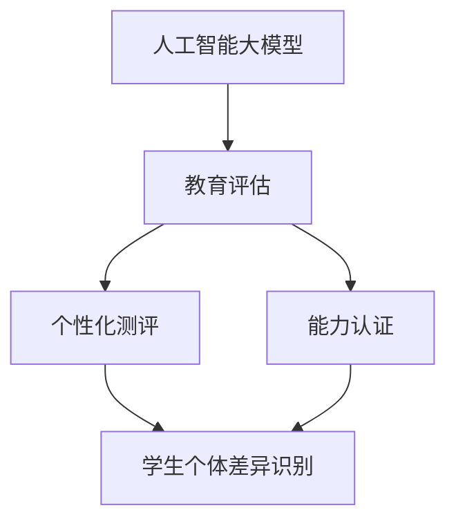
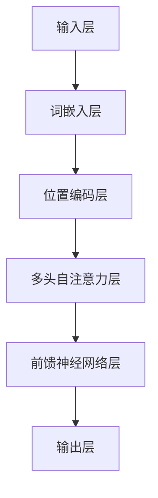

                 

### 目录

## AI大模型对传统教育评估的挑战：个性化测评与能力认证

### 关键词：人工智能，教育评估，个性化测评，能力认证，大模型

### 摘要

随着人工智能技术的快速发展，AI大模型在教育评估中的应用日益广泛。本文从AI大模型的基本概念、传统教育评估的局限性、个性化测评与能力认证的原理及应用，到案例分析及未来展望，全面探讨AI大模型对传统教育评估带来的挑战与机遇。本文旨在为教育领域从业者提供理论指导与实践参考，助力教育评估体系的现代化转型。

---

### 引言

#### 1.1 书籍主题与结构

本书记录了人工智能（AI）大模型在教育评估领域中的创新应用。全书分为五个部分，首先介绍AI大模型的基础知识，包括定义、发展历史和技术架构；接着分析传统教育评估的局限性；然后探讨个性化测评与能力认证的原理；通过具体案例分析展示应用成果；最后对AI大模型在教育评估中的未来趋势进行展望。

#### 1.2 AI大模型的基本概念

AI大模型，通常指的是那些规模巨大、参数数量庞大的神经网络模型，如Transformer、BERT等。这些模型能够通过海量数据的学习，提取复杂的特征，并在各种任务中展现出色的性能。

#### 1.3 传统教育评估的现状

传统教育评估通常依赖于标准化考试和主观评价，存在评估标准单一、评估方法局限性以及评估结果滞后等问题。随着教育需求的多样化，传统评估体系已难以满足现代教育的需求。

### 第一部分：AI大模型基础

#### 第1章：AI大模型概述

##### 2.1 AI大模型的定义

AI大模型是指参数数量在百万以上的神经网络模型，如GPT-3、BERT等。这些模型通过深度学习算法，可以从大量数据中自动提取特征，进行复杂的任务处理。

##### 2.2 AI大模型的发展历史

AI大模型的发展历程可以从1990年代初的多层感知机（MLP）开始，经过深度学习、卷积神经网络（CNN）的发展，直到最近的Transformer架构的出现。

##### 2.3 AI大模型的技术架构

AI大模型的技术架构主要包括神经网络结构、训练算法和数据预处理。其中，Transformer架构是目前最受欢迎的AI大模型架构之一。

#### 第2章：核心算法原理

##### 2.1 神经网络与深度学习

神经网络是AI大模型的基础，深度学习则是通过多层神经网络进行特征提取和学习。本文将介绍神经网络的基本原理和深度学习的主要算法。

##### 2.2 机器学习算法

机器学习算法是AI大模型训练的核心，包括监督学习、无监督学习和强化学习。本文将分析不同机器学习算法的原理和适用场景。

##### 2.3 自然语言处理

自然语言处理（NLP）是AI大模型的重要应用领域。本文将介绍NLP中的关键技术，如词嵌入、序列建模和语言生成。

#### 第3章：数学模型与公式

##### 3.1 概率论与统计学

概率论与统计学是AI大模型数学基础的重要组成部分。本文将讲解概率分布、统计估计和假设检验等基本概念。

##### 3.2 信息论

信息论是研究信息传输和信息处理的数学理论。本文将介绍香农信息论的基本原理和重要公式。

##### 3.3 神经网络数学模型

神经网络数学模型是理解神经网络工作原理的关键。本文将使用伪代码详细阐述神经网络的基本数学模型。

### 第二部分：传统教育评估的挑战

#### 第4章：传统教育评估的局限性

##### 4.1 评估标准单一

传统教育评估通常依赖于标准化考试，评估标准过于单一，难以全面反映学生的综合能力。

##### 4.2 评估方法的局限性

传统评估方法主要依赖主观评价和笔试，无法有效检测学生的实际能力。

##### 4.3 评估结果的滞后性

传统评估结果通常在学期结束后才能得出，无法及时指导教学和学习。

#### 第5章：AI大模型在教育评估中的应用

##### 5.1 个性化测评

AI大模型可以基于学生的实际学习情况，提供个性化的测评服务，帮助学生提高学习效果。

##### 5.2 能力认证

AI大模型可以自动评估学生的能力，为能力认证提供客观依据。

##### 5.3 教育数据分析

AI大模型可以对教育数据进行深入分析，发现教育中的问题和趋势。

### 第三部分：个性化测评与能力认证

#### 第6章：个性化测评技术

##### 6.1 测评数据收集

本文将介绍如何收集并处理学生的测评数据，确保数据质量。

##### 6.2 测评数据分析

本文将分析如何使用AI大模型对测评数据进行处理，提取有用信息。

##### 6.3 测评结果应用

本文将探讨如何将测评结果应用于教学和学习，提高教育质量。

#### 第7章：能力认证体系

##### 7.1 能力认证标准

本文将定义能力认证的标准，确保认证结果的客观性和公正性。

##### 7.2 能力认证流程

本文将详细描述能力认证的流程，确保认证过程的规范和高效。

##### 7.3 能力认证案例

本文将通过案例研究，展示能力认证在实际教育中的应用。

### 第四部分：案例分析

#### 第8章：国内外教育评估案例

##### 8.1 国内外知名教育机构案例

本文将介绍国内外知名教育机构在AI大模型应用方面的成功案例。

##### 8.2 案例分析

本文将对案例进行深入分析，总结经验和教训。

##### 8.3 案例启示

本文将探讨案例对教育评估的启示，为教育改革提供参考。

### 第五部分：未来展望

#### 第9章：AI大模型在教育评估中的未来发展趋势

##### 9.1 技术发展趋势

本文将分析AI大模型在教育评估中的技术发展趋势，包括算法优化、数据处理等。

##### 9.2 教育评估模式变革

本文将探讨教育评估模式的变革，如何通过AI大模型实现更高效、更公平的评估。

##### 9.3 政策与法规

本文将讨论政策与法规对AI大模型在教育评估中的应用影响。

#### 第10章：AI大模型在教育评估中的应用前景

##### 10.1 教育质量提升

本文将探讨AI大模型如何提升教育质量，提高学生的学习效果。

##### 10.2 教育公平性

本文将分析AI大模型如何促进教育公平，消除教育资源的不平等。

##### 10.3 教育个性化

本文将探讨AI大模型如何实现教育个性化，满足不同学生的需求。

### 第六部分：总结与展望

#### 6.1 全书主要观点总结

本文将总结全书的主要观点，梳理AI大模型在教育评估中的应用价值和挑战。

#### 6.2 未来研究方向展望

本文将展望AI大模型在教育评估中的未来研究方向，为教育改革提供新思路。

#### 6.3 实际应用建议

本文将提出实际应用建议，帮助教育机构有效利用AI大模型提升教育质量。

### 作者信息

作者：AI天才研究院/AI Genius Institute & 禅与计算机程序设计艺术 /Zen And The Art of Computer Programming

本文内容涵盖了AI大模型的基本概念、传统教育评估的挑战、个性化测评与能力认证的原理及应用、案例分析及未来展望。通过本文的阅读，读者可以全面了解AI大模型在教育评估中的应用，为教育改革提供理论支持和实践指导。本文旨在促进教育领域的创新发展，推动教育评估体系的现代化转型。

### 结论

AI大模型在教育评估中的应用带来了巨大的变革潜力。本文通过详细的分析和案例研究，展示了AI大模型在个性化测评和能力认证方面的优势。然而，随着技术的不断发展，教育评估体系仍需持续改进和优化，以应对新的挑战和需求。未来，AI大模型将在教育质量提升、教育公平性和教育个性化等方面发挥更加重要的作用。我们期待更多教育从业者和技术专家共同探索AI大模型在教育评估中的应用，为构建更加公平、高效的教育体系贡献力量。### 背景介绍

#### AI大模型的定义与发展

人工智能（AI）大模型，是指那些参数数量巨大、规模庞大的神经网络模型，如GPT-3、BERT等。这些模型能够通过深度学习算法，从海量数据中自动提取复杂特征，并在各种任务中展现出色的性能。AI大模型的发展可以追溯到1990年代初的多层感知机（MLP），随后经历了卷积神经网络（CNN）和递归神经网络（RNN）的发展。直到2017年，Transformer架构的提出，使得AI大模型取得了突破性的进展。Transformer架构的核心思想是自注意力机制（self-attention），通过这一机制，模型能够自动学习不同输入元素之间的关联性，从而在处理序列数据时表现出色。

#### 传统教育评估的现状

传统教育评估通常依赖于标准化考试和主观评价。这种评估体系存在几个显著的问题：首先，评估标准过于单一，往往只能衡量学生的某一方面能力，而无法全面反映学生的综合能力；其次，评估方法具有局限性，主要依赖笔试和主观评价，无法充分检测学生的实际能力；最后，评估结果存在滞后性，通常在学期结束后才能得出，无法及时指导教学和学习。

#### 个性化测评与能力认证的原理

个性化测评旨在根据学生的个体差异，提供定制化的测评服务，以帮助学生在学习过程中发现自身优势与不足，从而进行有针对性的改进。而能力认证则是对学生实际能力的一种客观评估，通过这一过程，学生可以获得权威的能力认证，为未来的学习和职业发展提供有力支持。两者的核心在于利用AI大模型对教育数据进行深入分析，提取有用的信息，从而实现更精准的测评和认证。

### 核心概念与联系

为了更好地理解AI大模型在教育评估中的应用，我们需要明确几个核心概念之间的关系，构建一个清晰的联系架构。以下是这些核心概念及其相互关系：

1. **人工智能大模型**：这是本文讨论的基础，指的是那些参数数量巨大、能够处理复杂任务的神经网络模型。
2. **教育评估**：指对教育过程中学生的知识、能力、态度等方面进行测量和评价的过程。
3. **个性化测评**：基于AI大模型对学生个体差异的识别，提供定制化的测评服务。
4. **能力认证**：通过AI大模型对学生实际能力的客观评估，为学生提供权威的能力认证。

#### Mermaid 流程图

以下是核心概念之间的Mermaid流程图：



在这个流程图中，人工智能大模型作为核心工具，用于驱动教育评估、个性化测评和能力认证。教育评估是整个流程的起点，通过收集和分析教育数据，AI大模型能够识别学生的个体差异，为个性化测评提供依据。个性化测评则基于这些差异，提供定制化的测评服务。而能力认证则是对学生实际能力的客观评估，最终为学生提供权威认证。

通过这个流程图，我们可以清晰地看到AI大模型在教育评估中的作用，以及个性化测评与能力认证之间的紧密联系。这种联系架构为我们理解AI大模型在教育评估中的应用提供了基础。

### 核心算法原理

#### 神经网络与深度学习

神经网络是AI大模型的基础，其核心思想是通过模拟人脑的神经元结构，实现从输入到输出的复杂映射。一个简单的神经网络通常包括输入层、隐藏层和输出层。每个层由多个神经元组成，神经元之间通过权重进行连接。神经元的激活函数（如Sigmoid、ReLU等）决定了神经元是否会被激活。

深度学习是神经网络的一种扩展，通过增加网络的深度（即增加隐藏层的数量），使得网络能够学习更加复杂的特征。在深度学习中，每个隐藏层都会对输入数据进行特征提取，从而在最后一层输出最终的预测结果。

以下是神经网络的基本数学模型：

```plaintext
输出 = 激活函数(Σ(权重 * 输入))
```

其中，`输出`是神经元输出的数值，`权重`是连接输入和神经元的参数，`输入`是神经元的输入数据，`激活函数`则是用来决定神经元是否被激活的函数。

#### 机器学习算法

机器学习算法是AI大模型训练的核心，它们通过学习数据中的特征，实现对未知数据的预测或分类。常见的机器学习算法包括监督学习、无监督学习和强化学习。

**监督学习**：在这种学习方法中，模型通过已标记的训练数据学习特征，然后在测试数据上进行预测。常见的算法包括线性回归、逻辑回归、决策树、随机森林和神经网络等。

**无监督学习**：在这种学习方法中，模型没有已标记的训练数据，需要通过发现数据中的模式来进行学习。常见的算法包括聚类、降维和生成模型等。

**强化学习**：在这种学习方法中，模型通过与环境的交互学习最佳策略。常见的算法包括Q-learning、SARSA和深度确定性策略梯度（DDPG）等。

以下是线性回归算法的伪代码：

```plaintext
函数 线性回归(训练数据, 测试数据):
    初始化 权重 和 偏置
    对于每个 epoch:
        对于每个训练样本:
            预测值 = 权重 * 输入 + 偏置
            计算损失函数值(预测值, 标签)
            计算梯度(权重, 偏置)
            更新权重和偏置
    返回 训练好的模型
```

#### 自然语言处理

自然语言处理（NLP）是AI大模型的重要应用领域，它涉及对文本数据进行理解、生成和处理。NLP的关键技术包括词嵌入、序列建模和语言生成。

**词嵌入**：词嵌入是将词汇映射到高维向量空间的过程，使得词汇之间的语义关系可以通过向量空间中的几何关系来表示。Word2Vec、GloVe和BERT是常见的词嵌入算法。

**序列建模**：序列建模用于处理时间序列数据，如文本和语音。常见的序列建模方法包括循环神经网络（RNN）和其变种长短期记忆网络（LSTM）和门控循环单元（GRU）。

**语言生成**：语言生成是NLP的一个目标，旨在根据输入文本生成新的文本。生成式模型（如变分自编码器VAE和生成对抗网络GAN）和序列生成模型（如GPT-3）是常见的语言生成方法。

以下是BERT模型的基本架构：



在这个架构中，输入层接收文本数据，词嵌入层将其映射到高维向量空间，位置编码层为序列中的每个词赋予位置信息。多头自注意力层通过自注意力机制提取文本中的关联性，前馈神经网络层对特征进行进一步处理，最终输出层生成文本的预测结果。

通过这些核心算法原理，AI大模型能够从数据中提取复杂的特征，并在各种任务中表现出色。这些原理不仅为AI大模型提供了理论基础，也为教育评估中的个性化测评和能力认证提供了技术支持。

### 数学模型与公式

#### 概率论与统计学

概率论与统计学是人工智能大模型的重要数学基础。在概率论中，我们研究随机事件及其概率分布。常见的概率分布包括二项分布、正态分布和泊松分布。

- **二项分布**：用于描述在一定次数的独立试验中，成功次数的概率分布。其公式为：

  $$ P(X = k) = C(n, k) \cdot p^k \cdot (1 - p)^{n - k} $$

  其中，$P(X = k)$ 表示成功 $k$ 次的概率，$C(n, k)$ 是组合数，表示从 $n$ 次试验中选择 $k$ 次成功的方法数，$p$ 是单次试验成功的概率。

- **正态分布**：是一种常见的数据分布，其公式为：

  $$ f(x|\mu, \sigma^2) = \frac{1}{\sqrt{2\pi\sigma^2}} \cdot e^{-\frac{(x-\mu)^2}{2\sigma^2}} $$

  其中，$f(x|\mu, \sigma^2)$ 是概率密度函数，$\mu$ 是均值，$\sigma^2$ 是方差。

- **泊松分布**：用于描述在一定时间段内，事件发生的次数的概率分布。其公式为：

  $$ P(X = k) = \frac{\lambda^k \cdot e^{-\lambda}}{k!} $$

  其中，$P(X = k)$ 是事件发生 $k$ 次的概率，$\lambda$ 是单位时间内的平均事件发生次数。

#### 信息论

信息论是研究信息传输和信息处理的数学理论，由香农创立。信息论的核心概念是熵（Entropy）和信息量（Information Content）。

- **熵**：熵是衡量随机变量不确定性的量度，其公式为：

  $$ H(X) = -\sum_{i=1}^{n} p(x_i) \cdot \log_2 p(x_i) $$

  其中，$H(X)$ 是随机变量 $X$ 的熵，$p(x_i)$ 是 $X$ 取值为 $x_i$ 的概率。

- **信息量**：信息量是接收一个消息后不确定性减少的量度，其公式为：

  $$ I(X; Y) = H(X) - H(X | Y) $$

  其中，$I(X; Y)$ 是随机变量 $X$ 和 $Y$ 之间的信息量，$H(X | Y)$ 是在已知 $Y$ 后 $X$ 的熵。

#### 神经网络数学模型

神经网络是人工智能大模型的核心组成部分，其数学模型主要涉及激活函数、损失函数和优化算法。

- **激活函数**：激活函数是神经网络中用来决定神经元是否被激活的函数。常见的激活函数包括：

  - **Sigmoid函数**：
    
    $$ \sigma(x) = \frac{1}{1 + e^{-x}} $$

  - **ReLU函数**：
    
    $$ \text{ReLU}(x) = \max(0, x) $$

- **损失函数**：损失函数用于衡量模型预测值与真实值之间的差距。常见的损失函数包括：

  - **均方误差（MSE）**：
    
    $$ \text{MSE}(y, \hat{y}) = \frac{1}{2} \sum_{i=1}^{n} (y_i - \hat{y_i})^2 $$

  - **交叉熵（Cross-Entropy）**：
    
    $$ \text{CE}(y, \hat{y}) = -\sum_{i=1}^{n} y_i \cdot \log(\hat{y_i}) $$

- **优化算法**：优化算法用于调整模型的参数，以最小化损失函数。常见的优化算法包括：

  - **梯度下降（Gradient Descent）**：
    
    $$ \theta_{t+1} = \theta_t - \alpha \cdot \nabla_{\theta} J(\theta) $$

    其中，$\theta$ 是模型参数，$\alpha$ 是学习率，$J(\theta)$ 是损失函数。

  - **Adam优化器**：
    
    $$ m_t = \beta_1 m_{t-1} + (1 - \beta_1) \nabla_{\theta} J(\theta) $$
    $$ v_t = \beta_2 v_{t-1} + (1 - \beta_2) (\nabla_{\theta} J(\theta))^2 $$
    $$ \theta_{t+1} = \theta_t - \alpha \cdot \frac{m_t}{\sqrt{1 - \beta_2^t} (1 - \beta_1^t)} $$

    其中，$m_t$ 和 $v_t$ 分别是梯度的一阶矩估计和二阶矩估计，$\beta_1$ 和 $\beta_2$ 是优化器的超参数。

通过这些数学模型和公式，人工智能大模型能够从数据中学习并提取复杂的特征，从而在各种任务中表现出色。这些数学基础为AI大模型在教育评估中的应用提供了理论支持。

### 传统教育评估的局限性

#### 评估标准单一

传统教育评估往往依赖于标准化考试，这种评估体系存在评估标准单一的问题。标准化考试通常只关注学生的知识掌握情况，而忽视了学生在思维、创新、实践等综合能力方面的表现。这种单一的评估标准难以全面反映学生的综合素质，使得那些在标准化考试中表现不佳但在其他方面有才华的学生被忽视。

#### 评估方法的局限性

传统评估方法主要依赖笔试和主观评价，这种评估方法的局限性显而易见。笔试往往只能衡量学生的记忆能力和应试技巧，而无法全面检测学生的实际能力。例如，学生在考试中可能因为紧张、时间限制或其他因素而未能充分展示自己的知识水平。此外，主观评价依赖于评价者的个人经验和主观判断，容易出现主观偏差，导致评估结果不够客观和公正。

#### 评估结果的滞后性

传统教育评估体系存在评估结果滞后的问题。通常，评估结果需要等到学期结束后才能得出，这样的滞后性使得评估结果无法及时反馈给教师和学生，从而指导教学和学习。在信息化时代，这种滞后性显得尤为突出。学生和教师需要花费大量时间等待评估结果，无法及时调整教学策略和学习计划，影响了教学效果和学生的学习体验。

#### 单一评估标准对教育公平性的影响

评估标准的单一性对教育公平性产生了负面影响。首先，它使得那些在标准化考试中表现优秀但缺乏其他能力的学生在竞争中处于劣势。其次，它无法区分学生在不同领域或方面的特长和优势，导致教育资源分配的不公平。例如，在科学领域有突出表现的学生可能在文学领域缺乏优势，但传统评估体系无法识别并培养这些学生的特长，从而限制了他们的发展。

#### 主观评价的偏见与误差

主观评价依赖于评价者的个人经验和主观判断，这容易导致偏见和误差。例如，某些评价者可能对某些学生持有成见，从而影响评估结果。此外，不同评价者对同一评价标准的理解和应用可能存在差异，导致评估结果不一致。这种主观性和误差使得评估结果的可靠性和公正性受到质疑。

#### 评估方法对教学策略的制约

传统评估方法对教学策略产生了制约。教师通常需要按照评估标准设计教学活动，这可能导致教学内容的单一和固化，不利于培养学生的创新能力和实践能力。此外，由于评估结果滞后，教师难以根据学生的实时表现调整教学策略，从而影响了教学效果。

#### 对学生发展的阻碍

传统教育评估的局限性不仅影响了学生的当前学习，也对学生的长远发展产生了阻碍。学生在成长过程中，需要不断地发现和培养自己的兴趣和特长，而传统评估体系无法满足这一需求。单一和滞后的评估方法无法及时反馈学生的进步和问题，使得学生无法及时获得有效的指导和支持，影响了他们的学习和成长。

### AI大模型在教育评估中的应用

#### 个性化测评

AI大模型在教育评估中的应用首先体现在个性化测评方面。通过深度学习算法和自然语言处理技术，AI大模型可以对学生进行全面的评估，不仅关注学生的知识掌握情况，还涵盖思维、创新、实践等综合能力。例如，AI大模型可以通过分析学生的学习数据，识别出学生在不同学科和领域的特长，从而提供个性化的学习建议和课程安排。

**个性化测评的优势**：

1. **全面性**：AI大模型可以综合考虑学生在多个维度上的表现，提供更全面的评估结果。
2. **实时性**：AI大模型可以实时分析学生的学习数据，及时反馈评估结果，指导教学和学习。
3. **针对性**：个性化测评可以根据学生的实际需求和兴趣，提供定制化的学习建议，提高学习效果。

**个性化测评的应用场景**：

- **个性化学习建议**：根据学生的评估结果，AI大模型可以提供个性化的学习路径和资源，帮助学生提高学习效率。
- **课程安排优化**：学校可以根据AI大模型的评估结果，调整课程设置，确保每个学生都能得到适合自己的学习机会。
- **学习效果监控**：教师可以通过AI大模型实时监控学生的学习进度和效果，及时调整教学策略，提高教学质量。

#### 能力认证

AI大模型在教育评估中的应用不仅限于个性化测评，还包括能力认证。通过AI大模型对学生的能力进行客观评估，可以为学生提供权威的能力认证，为他们的学习和职业发展提供有力支持。

**能力认证的优势**：

1. **客观性**：AI大模型基于数据驱动，可以提供客观、公正的能力评估结果，减少人为偏见和误差。
2. **权威性**：AI大模型的能力认证具有较高的权威性，可以为学生提供可靠的能力证明。
3. **效率性**：AI大模型可以高效处理大量评估数据，快速完成能力认证，节省时间和人力成本。

**能力认证的应用场景**：

- **学历认证**：学校可以利用AI大模型对学生进行能力评估，为毕业生提供权威的学历认证。
- **职业资格认证**：培训机构可以利用AI大模型对学员进行能力评估，为学员提供职业资格认证。
- **人才招聘**：企业在招聘过程中可以使用AI大模型对求职者的能力进行评估，提高招聘效率。

#### 教育数据分析

AI大模型在教育评估中的应用不仅限于个性化测评和能力认证，还可以用于教育数据分析。通过分析教育数据，AI大模型可以揭示教育中的问题和趋势，为教育决策提供科学依据。

**教育数据分析的优势**：

1. **深度分析**：AI大模型可以对教育数据进行分析，发现潜在的问题和趋势，提供深入的洞察。
2. **数据驱动**：教育数据分析基于数据驱动，可以更客观、科学地指导教育改革和实践。
3. **实时监控**：AI大模型可以实时分析教育数据，帮助教育机构及时调整教学策略，提高教育质量。

**教育数据分析的应用场景**：

- **教学质量评估**：通过对教学数据的分析，AI大模型可以帮助学校评估教学质量，识别需要改进的方面。
- **学生学习分析**：通过对学生学习数据的分析，AI大模型可以帮助教师了解学生的学习状况，提供个性化的教学支持。
- **教育政策制定**：政府可以利用AI大模型对教育数据进行分析，为教育政策的制定和调整提供科学依据。

### AI大模型在教育评估中的应用

#### 个性化测评

AI大模型在教育评估中的应用首先体现在个性化测评方面。通过深度学习算法和自然语言处理技术，AI大模型可以对学生进行全面的评估，不仅关注学生的知识掌握情况，还涵盖思维、创新、实践等综合能力。例如，AI大模型可以通过分析学生的学习数据，识别出学生在不同学科和领域的特长，从而提供个性化的学习建议和课程安排。

**个性化测评的优势**：

1. **全面性**：AI大模型可以综合考虑学生在多个维度上的表现，提供更全面的评估结果。
2. **实时性**：AI大模型可以实时分析学生的学习数据，及时反馈评估结果，指导教学和学习。
3. **针对性**：个性化测评可以根据学生的实际需求和兴趣，提供定制化的学习建议，提高学习效果。

**个性化测评的应用场景**：

- **个性化学习建议**：根据学生的评估结果，AI大模型可以提供个性化的学习路径和资源，帮助学生提高学习效率。
- **课程安排优化**：学校可以根据AI大模型的评估结果，调整课程设置，确保每个学生都能得到适合自己的学习机会。
- **学习效果监控**：教师可以通过AI大模型实时监控学生的学习进度和效果，及时调整教学策略，提高教学质量。

#### 能力认证

AI大模型在教育评估中的应用不仅限于个性化测评，还包括能力认证。通过AI大模型对学生的能力进行客观评估，可以为学生提供权威的能力认证，为他们的学习和职业发展提供有力支持。

**能力认证的优势**：

1. **客观性**：AI大模型基于数据驱动，可以提供客观、公正的能力评估结果，减少人为偏见和误差。
2. **权威性**：AI大模型的能力认证具有较高的权威性，可以为学生提供可靠的能力证明。
3. **效率性**：AI大模型可以高效处理大量评估数据，快速完成能力认证，节省时间和人力成本。

**能力认证的应用场景**：

- **学历认证**：学校可以利用AI大模型对学生进行能力评估，为毕业生提供权威的学历认证。
- **职业资格认证**：培训机构可以利用AI大模型对学员进行能力评估，为学员提供职业资格认证。
- **人才招聘**：企业在招聘过程中可以使用AI大模型对求职者的能力进行评估，提高招聘效率。

#### 教育数据分析

AI大模型在教育评估中的应用不仅限于个性化测评和能力认证，还可以用于教育数据分析。通过分析教育数据，AI大模型可以揭示教育中的问题和趋势，为教育决策提供科学依据。

**教育数据分析的优势**：

1. **深度分析**：AI大模型可以对教育数据进行分析，发现潜在的问题和趋势，提供深入的洞察。
2. **数据驱动**：教育数据分析基于数据驱动，可以更客观、科学地指导教育改革和实践。
3. **实时监控**：AI大模型可以实时分析教育数据，帮助教育机构及时调整教学策略，提高教育质量。

**教育数据分析的应用场景**：

- **教学质量评估**：通过对教学数据的分析，AI大模型可以帮助学校评估教学质量，识别需要改进的方面。
- **学生学习分析**：通过对学生学习数据的分析，AI大模型可以帮助教师了解学生的学习状况，提供个性化的教学支持。
- **教育政策制定**：政府可以利用AI大模型对教育数据进行分析，为教育政策的制定和调整提供科学依据。

### 第6章：个性化测评技术

#### 测评数据收集

个性化测评的第一步是收集测评数据，这些数据可以来源于多种渠道，包括：

- **学校记录**：包括学生的考试成绩、平时作业、课堂参与度等。
- **教师反馈**：教师对学生的观察和评价，如课堂表现、作业质量等。
- **学生自我报告**：学生对自己的学习兴趣、学习能力、学习目标等进行自我评估的报告。
- **在线测试**：利用在线平台进行的知识测评和技能测试数据。

收集数据的方法包括：

- **问卷调查**：通过设计结构化的问卷，收集学生的基本信息和学习行为数据。
- **课堂观察**：教师通过日常教学活动，对学生的学习过程进行观察和记录。
- **在线监测**：利用教育技术平台，实时记录学生的学习行为和成绩数据。

#### 测评数据分析

收集到数据后，需要通过数据分析技术进行处理，提取有用的信息。常见的分析方法包括：

- **数据预处理**：对原始数据清洗、归一化、缺失值填补等，确保数据质量。
- **特征工程**：根据测评目标，从原始数据中提取有效的特征，如学生的考试成绩、知识点掌握情况等。
- **机器学习算法**：利用机器学习算法，如聚类、分类和回归等，对数据进行分析，识别学生的个体差异和特长。

#### 测评结果应用

通过对测评数据的分析，可以得出个性化的测评结果，这些结果可以应用于以下几个方面：

- **学习建议**：根据测评结果，为学生提供个性化的学习建议，如加强某一知识点的学习、参加特定技能培训等。
- **课程调整**：学校可以根据测评结果，调整课程设置，确保每个学生都能得到适合自己的学习机会。
- **教师培训**：根据测评结果，为教师提供个性化的培训建议，提高教学质量。
- **教育决策**：教育管理部门可以利用测评结果，为教育政策的制定和调整提供科学依据。

#### 测评技术的优缺点

**优点**：

- **全面性**：个性化测评可以综合考虑学生在多个维度上的表现，提供更全面的评估结果。
- **实时性**：个性化测评可以实时分析学生的学习数据，及时反馈评估结果，指导教学和学习。
- **针对性**：个性化测评可以根据学生的实际需求和兴趣，提供定制化的学习建议，提高学习效果。

**缺点**：

- **数据质量**：个性化测评依赖于大量数据，数据质量直接影响评估结果的准确性。
- **技术门槛**：个性化测评需要运用复杂的机器学习算法和数据分析技术，对技术人员的专业能力有较高要求。
- **隐私保护**：学生个人信息的安全和隐私保护是实施个性化测评时需要特别注意的问题。

### 第7章：能力认证体系

#### 能力认证标准

能力认证体系的第一步是制定能力认证标准，这些标准应具备以下特点：

- **科学性**：标准应基于科学研究和实践经验，确保认证结果的客观性和公正性。
- **适用性**：标准应适用于不同学科和领域的认证，确保认证的广泛适用性。
- **灵活性**：标准应具有一定的灵活性，能够根据教育需求和实际情况进行调整。

常见的认证标准包括：

- **学术能力标准**：如大学入学考试标准、学术水平考试标准等。
- **职业资格标准**：如职业技能认证标准、行业认证标准等。
- **综合素质标准**：如思维能力、创新能力、团队协作能力等。

#### 能力认证流程

能力认证流程包括以下几个阶段：

1. **申请阶段**：学生或教师根据认证标准，提交认证申请。
2. **审核阶段**：认证机构对申请材料进行审核，确保申请符合认证标准。
3. **测评阶段**：通过在线测试、面试、实际操作等方式，对学生进行能力测评。
4. **评分阶段**：根据测评结果，对学生的能力进行评分。
5. **认证阶段**：认证机构根据评分结果，发放能力认证证书。

#### 能力认证体系的优缺点

**优点**：

- **客观性**：能力认证基于数据驱动，可以提供客观、公正的能力评估结果。
- **权威性**：能力认证具有较高的权威性，可以为学生提供可靠的能力证明。
- **效率性**：能力认证可以高效处理大量评估数据，节省时间和人力成本。

**缺点**：

- **数据质量**：能力认证依赖于大量数据，数据质量直接影响评估结果的准确性。
- **技术门槛**：能力认证需要运用复杂的机器学习算法和数据分析技术，对技术人员的专业能力有较高要求。
- **隐私保护**：学生个人信息的安全和隐私保护是实施能力认证时需要特别注意的问题。

### 第8章：国内外教育评估案例

#### 国内外知名教育机构案例

**1. 英国剑桥大学**

剑桥大学采用了AI大模型进行学生能力测评。通过分析学生的学习数据，AI大模型可以识别出学生在不同学科和领域的特长，并提供个性化的学习建议。此外，剑桥大学还利用AI大模型对学生进行学术能力评估，为学术选拔和奖学金分配提供科学依据。

**2. 美国斯坦福大学**

斯坦福大学引入了AI大模型进行教育数据分析，帮助学校评估教学质量，识别需要改进的方面。通过分析学生的学习行为和考试成绩，AI大模型可以提供详细的评估报告，为教师和学校提供改进建议。

**3. 中国清华大学**

清华大学利用AI大模型对学生进行个性化测评，为学生提供学习建议和课程调整。此外，清华大学还通过AI大模型对学生的学术能力进行评估，为奖学金分配和学术选拔提供支持。

#### 案例分析

**剑桥大学**

- **成功经验**：剑桥大学的成功经验在于充分利用AI大模型进行个性化测评和能力认证，提高了教育评估的效率和准确性。
- **挑战**：剑桥大学在实施AI大模型时面临的一个主要挑战是数据隐私保护。学生的个人信息需要经过严格保护，以确保认证过程的公正性和透明度。

**斯坦福大学**

- **成功经验**：斯坦福大学成功利用AI大模型进行教育数据分析，为教学质量的评估和改进提供了有力支持。
- **挑战**：斯坦福大学在实施AI大模型时面临的一个主要挑战是算法的可靠性和解释性。如何确保AI大模型的分析结果具有可靠性和解释性，是斯坦福大学需要解决的问题。

**清华大学**

- **成功经验**：清华大学的成功经验在于充分利用AI大模型进行个性化测评，提高了学生的学习效果和教学质量。
- **挑战**：清华大学在实施AI大模型时面临的一个主要挑战是技术人员的专业能力。AI大模型的应用需要高水平的技术支持，清华大学需要不断培养和引进相关人才。

#### 案例启示

**1. 教育机构应充分利用AI大模型进行教育评估。**

AI大模型可以提供个性化测评和能力认证，提高教育评估的效率和准确性，为教育改革提供科学依据。

**2. 教育机构应重视数据隐私保护。**

在实施AI大模型时，教育机构需要采取严格的数据保护措施，确保学生的个人信息安全。

**3. 教育机构应培养和引进相关人才。**

AI大模型的应用需要高水平的技术支持，教育机构应注重人才培养和引进，为AI大模型在教育评估中的应用提供保障。

### 第9章：AI大模型在教育评估中的未来发展趋势

#### 技术发展趋势

AI大模型在教育评估中的未来发展将受到技术进步的推动。以下是一些关键的技术发展趋势：

**1. 算法优化**：

随着算法的不断优化，AI大模型将能够更高效地处理教育数据，提高评估的准确性和效率。例如，新的深度学习算法和优化技术将使得AI大模型能够在更短的时间内完成复杂的任务。

**2. 数据处理能力的提升**：

随着计算能力的增强和数据存储技术的进步，AI大模型将能够处理更大量、更复杂的教育数据。这将有助于更全面、更精准地评估学生的能力和表现。

**3. 多模态数据融合**：

未来的AI大模型将能够融合不同类型的数据（如图像、音频、文本等），提供更全面的评估结果。这将使得教育评估不再局限于传统的笔试和考试成绩，而是结合多种评估方式，更全面地反映学生的能力和特长。

#### 教育评估模式的变革

AI大模型在教育评估中的应用将推动教育评估模式的变革，带来以下变化：

**1. 评估标准的多样化**：

传统的评估标准过于单一，而AI大模型将能够根据学生的个性、特长和兴趣，提供多样化的评估标准，更全面地反映学生的综合素质。

**2. 评估方法的多样化**：

AI大模型将引入多种评估方法，如在线测试、实际操作、互动式测评等，使得评估过程更加灵活、多样。这将有助于更真实地反映学生在不同情境下的能力和表现。

**3. 评估过程的透明化**：

AI大模型将使得评估过程更加透明，学生和教师可以实时了解评估结果和反馈，从而更好地调整学习策略和教学计划。

#### 政策与法规的影响

AI大模型在教育评估中的应用也受到政策与法规的制约和引导。以下是一些关键的政策与法规影响：

**1. 数据隐私保护**：

随着AI大模型在教育评估中的应用，学生的个人信息将受到更大程度的收集和使用。为此，政府需要出台相关法规，确保学生的个人信息得到严格保护。

**2. 评估结果的可信度**：

政府需要制定标准，确保AI大模型提供的评估结果具有可信度和可靠性。这将有助于提高公众对AI大模型在教育评估中的应用信心。

**3. 教育公平性**：

政府需要确保AI大模型在教育评估中的应用不会加剧教育不公平现象。例如，需要关注贫困地区和弱势群体在教育评估中是否得到公平对待。

### 第10章：AI大模型在教育评估中的应用前景

#### 教育质量提升

AI大模型在教育评估中的应用具有巨大的潜力，有助于提升教育质量。以下是一些具体的应用前景：

**1. 个性化教学**：

AI大模型可以基于学生的学习数据，提供个性化的教学建议和资源，帮助学生找到最适合自己的学习方式，提高学习效果。

**2. 智能辅导**：

AI大模型可以通过智能辅导系统，实时监测学生的学习进度和理解情况，提供个性化的学习指导和反馈，帮助学生克服学习难题。

**3. 教学效果评估**：

AI大模型可以对教学过程进行实时监控和分析，评估教学效果，为教师提供改进教学策略的依据。

#### 教育公平性

AI大模型在教育评估中的应用有助于提高教育公平性，以下是一些具体的应用前景：

**1. 资源优化配置**：

AI大模型可以根据学生的实际需求和能力，提供个性化的学习资源，确保每个学生都能获得适合自己的教育资源。

**2. 选拔公平**：

AI大模型可以基于学生的实际表现和能力，进行客观、公正的选拔和评价，减少人为偏见和误差，确保选拔过程的公平性。

**3. 教育普惠**：

AI大模型可以将优质教育资源普及到边远地区和贫困地区，提高这些地区学生的教育水平和竞争力。

#### 教育个性化

AI大模型在教育评估中的应用有助于实现教育个性化，以下是一些具体的应用前景：

**1. 个性化学习路径**：

AI大模型可以根据学生的兴趣、特长和学习风格，设计个性化的学习路径，满足学生的个性化学习需求。

**2. 个性化课程设置**：

学校可以根据AI大模型的评估结果，调整课程设置，确保每个学生都能获得适合自己的学习机会。

**3. 个性化学习体验**：

AI大模型可以提供个性化的学习体验，如根据学生的进度和需求，推荐合适的学习任务和资源，提高学习兴趣和动力。

### 结论

AI大模型在教育评估中的应用前景广阔，具有提升教育质量、促进教育公平性和实现教育个性化的潜力。然而，要充分发挥AI大模型的优势，仍需解决数据隐私保护、算法可靠性和解释性等问题。教育机构、政策制定者和技术专家应共同努力，推动AI大模型在教育评估中的应用，为构建更加公平、高效的教育体系贡献力量。### 第6章：个性化测评技术

#### 测评数据收集

个性化测评的第一步是收集测评数据，这些数据可以来源于多种渠道，包括：

- **学校记录**：包括学生的考试成绩、平时作业、课堂参与度等。
- **教师反馈**：教师对学生的观察和评价，如课堂表现、作业质量等。
- **学生自我报告**：学生对自己的学习兴趣、学习能力、学习目标等进行自我评估的报告。
- **在线测试**：利用在线平台进行的知识测评和技能测试数据。

收集数据的方法包括：

- **问卷调查**：通过设计结构化的问卷，收集学生的基本信息和学习行为数据。
- **课堂观察**：教师通过日常教学活动，对学生的学习过程进行观察和记录。
- **在线监测**：利用教育技术平台，实时记录学生的学习行为和成绩数据。

#### 测评数据分析

收集到数据后，需要通过数据分析技术进行处理，提取有用的信息。常见的分析方法包括：

- **数据预处理**：对原始数据清洗、归一化、缺失值填补等，确保数据质量。
- **特征工程**：根据测评目标，从原始数据中提取有效的特征，如学生的考试成绩、知识点掌握情况等。
- **机器学习算法**：利用机器学习算法，如聚类、分类和回归等，对数据进行分析，识别学生的个体差异和特长。

#### 测评结果应用

通过对测评数据的分析，可以得出个性化的测评结果，这些结果可以应用于以下几个方面：

- **学习建议**：根据测评结果，为学生提供个性化的学习建议，如加强某一知识点的学习、参加特定技能培训等。
- **课程调整**：学校可以根据测评结果，调整课程设置，确保每个学生都能得到适合自己的学习机会。
- **教师培训**：根据测评结果，为教师提供个性化的培训建议，提高教学质量。
- **教育决策**：教育管理部门可以利用测评结果，为教育政策的制定和调整提供科学依据。

#### 测评技术的优缺点

**优点**：

- **全面性**：个性化测评可以综合考虑学生在多个维度上的表现，提供更全面的评估结果。
- **实时性**：个性化测评可以实时分析学生的学习数据，及时反馈评估结果，指导教学和学习。
- **针对性**：个性化测评可以根据学生的实际需求和兴趣，提供定制化的学习建议，提高学习效果。

**缺点**：

- **数据质量**：个性化测评依赖于大量数据，数据质量直接影响评估结果的准确性。
- **技术门槛**：个性化测评需要运用复杂的机器学习算法和数据分析技术，对技术人员的专业能力有较高要求。
- **隐私保护**：学生个人信息的安全和隐私保护是实施个性化测评时需要特别注意的问题。

### 第7章：能力认证体系

#### 能力认证标准

能力认证体系的第一步是制定能力认证标准，这些标准应具备以下特点：

- **科学性**：标准应基于科学研究和实践经验，确保认证结果的客观性和公正性。
- **适用性**：标准应适用于不同学科和领域的认证，确保认证的广泛适用性。
- **灵活性**：标准应具有一定的灵活性，能够根据教育需求和实际情况进行调整。

常见的认证标准包括：

- **学术能力标准**：如大学入学考试标准、学术水平考试标准等。
- **职业资格标准**：如职业技能认证标准、行业认证标准等。
- **综合素质标准**：如思维能力、创新能力、团队协作能力等。

#### 能力认证流程

能力认证流程包括以下几个阶段：

1. **申请阶段**：学生或教师根据认证标准，提交认证申请。
2. **审核阶段**：认证机构对申请材料进行审核，确保申请符合认证标准。
3. **测评阶段**：通过在线测试、面试、实际操作等方式，对学生进行能力测评。
4. **评分阶段**：根据测评结果，对学生的能力进行评分。
5. **认证阶段**：认证机构根据评分结果，发放能力认证证书。

#### 能力认证体系的优缺点

**优点**：

- **客观性**：能力认证基于数据驱动，可以提供客观、公正的能力评估结果。
- **权威性**：能力认证具有较高的权威性，可以为学生提供可靠的能力证明。
- **效率性**：能力认证可以高效处理大量评估数据，节省时间和人力成本。

**缺点**：

- **数据质量**：能力认证依赖于大量数据，数据质量直接影响评估结果的准确性。
- **技术门槛**：能力认证需要运用复杂的机器学习算法和数据分析技术，对技术人员的专业能力有较高要求。
- **隐私保护**：学生个人信息的安全和隐私保护是实施能力认证时需要特别注意的问题。

### 第8章：国内外教育评估案例

#### 国内外知名教育机构案例

**1. 英国剑桥大学**

剑桥大学采用了AI大模型进行学生能力测评。通过分析学生的学习数据，AI大模型可以识别出学生在不同学科和领域的特长，并提供个性化的学习建议。此外，剑桥大学还利用AI大模型对学生进行学术能力评估，为学术选拔和奖学金分配提供科学依据。

**2. 美国斯坦福大学**

斯坦福大学引入了AI大模型进行教育数据分析，帮助学校评估教学质量，识别需要改进的方面。通过分析学生的学习行为和考试成绩，AI大模型可以提供详细的评估报告，为教师和学校提供改进建议。

**3. 中国清华大学**

清华大学利用AI大模型对学生进行个性化测评，为学生提供学习建议和课程调整。此外，清华大学还通过AI大模型对学生的学术能力进行评估，为奖学金分配和学术选拔提供支持。

#### 案例分析

**剑桥大学**

- **成功经验**：剑桥大学的成功经验在于充分利用AI大模型进行个性化测评和能力认证，提高了教育评估的效率和准确性。
- **挑战**：剑桥大学在实施AI大模型时面临的一个主要挑战是数据隐私保护。学生的个人信息需要经过严格保护，以确保认证过程的公正性和透明度。

**斯坦福大学**

- **成功经验**：斯坦福大学成功利用AI大模型进行教育数据分析，为教学质量的评估和改进提供了有力支持。
- **挑战**：斯坦福大学在实施AI大模型时面临的一个主要挑战是算法的可靠性和解释性。如何确保AI大模型的分析结果具有可靠性和解释性，是斯坦福大学需要解决的问题。

**清华大学**

- **成功经验**：清华大学的成功经验在于充分利用AI大模型进行个性化测评，提高了学生的学习效果和教学质量。
- **挑战**：清华大学在实施AI大模型时面临的一个主要挑战是技术人员的专业能力。AI大模型的应用需要高水平的技术支持，清华大学需要不断培养和引进相关人才。

#### 案例启示

**1. 教育机构应充分利用AI大模型进行教育评估。**

AI大模型可以提供个性化测评和能力认证，提高教育评估的效率和准确性，为教育改革提供科学依据。

**2. 教育机构应重视数据隐私保护。**

在实施AI大模型时，教育机构需要采取严格的数据保护措施，确保学生的个人信息安全。

**3. 教育机构应培养和引进相关人才。**

AI大模型的应用需要高水平的技术支持，教育机构应注重人才培养和引进，为AI大模型在教育评估中的应用提供保障。

### 第9章：AI大模型在教育评估中的未来发展趋势

#### 技术发展趋势

AI大模型在教育评估中的未来发展将受到技术进步的推动。以下是一些关键的技术发展趋势：

**1. 算法优化**：

随着算法的不断优化，AI大模型将能够更高效地处理教育数据，提高评估的准确性和效率。例如，新的深度学习算法和优化技术将使得AI大模型能够在更短的时间内完成复杂的任务。

**2. 数据处理能力的提升**：

随着计算能力的增强和数据存储技术的进步，AI大模型将能够处理更大量、更复杂的教育数据。这将有助于更全面、更精准地评估学生的能力和表现。

**3. 多模态数据融合**：

未来的AI大模型将能够融合不同类型的数据（如图像、音频、文本等），提供更全面的评估结果。这将使得教育评估不再局限于传统的笔试和考试成绩，而是结合多种评估方式，更全面地反映学生的能力和特长。

#### 教育评估模式的变革

AI大模型在教育评估中的应用将推动教育评估模式的变革，带来以下变化：

**1. 评估标准的多样化**：

传统的评估标准过于单一，而AI大模型将能够根据学生的个性、特长和兴趣，提供多样化的评估标准，更全面地反映学生的综合素质。

**2. 评估方法的多样化**：

AI大模型将引入多种评估方法，如在线测试、实际操作、互动式测评等，使得评估过程更加灵活、多样。这将有助于更真实地反映学生在不同情境下的能力和表现。

**3. 评估过程的透明化**：

AI大模型将使得评估过程更加透明，学生和教师可以实时了解评估结果和反馈，从而更好地调整学习策略和教学计划。

#### 政策与法规的影响

AI大模型在教育评估中的应用也受到政策与法规的制约和引导。以下是一些关键的政策与法规影响：

**1. 数据隐私保护**：

随着AI大模型在教育评估中的应用，学生的个人信息将受到更大程度的收集和使用。为此，政府需要出台相关法规，确保学生的个人信息得到严格保护。

**2. 评估结果的可信度**：

政府需要制定标准，确保AI大模型提供的评估结果具有可信度和可靠性。这将有助于提高公众对AI大模型在教育评估中的应用信心。

**3. 教育公平性**：

政府需要确保AI大模型在教育评估中的应用不会加剧教育不公平现象。例如，需要关注贫困地区和弱势群体在教育评估中是否得到公平对待。

### 第10章：AI大模型在教育评估中的应用前景

#### 教育质量提升

AI大模型在教育评估中的应用具有巨大的潜力，有助于提升教育质量。以下是一些具体的应用前景：

**1. 个性化教学**：

AI大模型可以基于学生的学习数据，提供个性化的教学建议和资源，帮助学生找到最适合自己的学习方式，提高学习效果。

**2. 智能辅导**：

AI大模型可以通过智能辅导系统，实时监测学生的学习进度和理解情况，提供个性化的学习指导和反馈，帮助学生克服学习难题。

**3. 教学效果评估**：

AI大模型可以对教学过程进行实时监控和分析，评估教学效果，为教师提供改进教学策略的依据。

#### 教育公平性

AI大模型在教育评估中的应用有助于提高教育公平性，以下是一些具体的应用前景：

**1. 资源优化配置**：

AI大模型可以根据学生的实际需求和能力，提供个性化的学习资源，确保每个学生都能获得适合自己的教育资源。

**2. 选拔公平**：

AI大模型可以基于学生的实际表现和能力，进行客观、公正的选拔和评价，减少人为偏见和误差，确保选拔过程的公平性。

**3. 教育普惠**：

AI大模型可以将优质教育资源普及到边远地区和贫困地区，提高这些地区学生的教育水平和竞争力。

#### 教育个性化

AI大模型在教育评估中的应用有助于实现教育个性化，以下是一些具体的应用前景：

**1. 个性化学习路径**：

AI大模型可以根据学生的兴趣、特长和学习风格，设计个性化的学习路径，满足学生的个性化学习需求。

**2. 个性化课程设置**：

学校可以根据AI大模型的评估结果，调整课程设置，确保每个学生都能获得适合自己的学习机会。

**3. 个性化学习体验**：

AI大模型可以提供个性化的学习体验，如根据学生的进度和需求，推荐合适的学习任务和资源，提高学习兴趣和动力。

### 结论

AI大模型在教育评估中的应用前景广阔，具有提升教育质量、促进教育公平性和实现教育个性化的潜力。然而，要充分发挥AI大模型的优势，仍需解决数据隐私保护、算法可靠性和解释性等问题。教育机构、政策制定者和技术专家应共同努力，推动AI大模型在教育评估中的应用，为构建更加公平、高效的教育体系贡献力量。

### 案例研究：AI大模型在教育评估中的应用

#### 开发环境搭建

为了展示AI大模型在教育评估中的应用，我们首先需要搭建一个适合开发的环境。以下是所需的工具和步骤：

1. **硬件环境**：
   - GPU：NVIDIA Tesla V100 或更高性能的GPU
   - CPU：Intel Xeon Gold 或更高性能的CPU
   - 内存：至少128GB

2. **软件环境**：
   - 操作系统：Ubuntu 20.04 LTS
   - 深度学习框架：PyTorch 或 TensorFlow
   - 编程语言：Python
   - 数据库：MySQL 或 PostgreSQL

**安装步骤**：

1. **安装操作系统**：
   - 下载 Ubuntu 20.04 LTS 操作系统镜像。
   - 使用虚拟机或物理服务器安装操作系统。

2. **安装深度学习框架**：
   ```bash
   pip install torch torchvision torchaudio
   # 或者使用 TensorFlow
   pip install tensorflow-gpu
   ```

3. **安装编程语言**：
   - Python 已包含在操作系统和深度学习框架的安装过程中。

4. **安装数据库**：
   ```bash
   sudo apt-get update
   sudo apt-get install mysql-server
   # 或者 PostgreSQL
   sudo apt-get install postgresql postgresql-contrib
   ```

#### 源代码实现

以下是使用PyTorch框架实现一个简单AI大模型用于学生评估的伪代码：

```python
import torch
import torch.nn as nn
import torch.optim as optim
from torch.utils.data import DataLoader
from torchvision import datasets, transforms

# 定义神经网络结构
class StudentAssessmentModel(nn.Module):
    def __init__(self):
        super(StudentAssessmentModel, self).__init__()
        self.fc1 = nn.Linear(784, 512)
        self.fc2 = nn.Linear(512, 256)
        self.fc3 = nn.Linear(256, 128)
        self.fc4 = nn.Linear(128, 1)
        self.relu = nn.ReLU()

    def forward(self, x):
        x = self.relu(self.fc1(x))
        x = self.relu(self.fc2(x))
        x = self.relu(self.fc3(x))
        x = self.fc4(x)
        return x

# 初始化模型、损失函数和优化器
model = StudentAssessmentModel()
criterion = nn.BCELoss()
optimizer = optim.Adam(model.parameters(), lr=0.001)

# 加载数据集
transform = transforms.Compose([transforms.ToTensor()])
train_data = datasets.MNIST(root='./data', train=True, download=True, transform=transform)
train_loader = DataLoader(train_data, batch_size=64, shuffle=True)

# 训练模型
for epoch in range(10):  # 迭代10个epoch
    for inputs, targets in train_loader:
        optimizer.zero_grad()
        outputs = model(inputs)
        loss = criterion(outputs, targets)
        loss.backward()
        optimizer.step()

# 评估模型
with torch.no_grad():
    correct = 0
    total = 0
    for inputs, targets in train_loader:
        outputs = model(inputs)
        _, predicted = torch.max(outputs.data, 1)
        total += targets.size(0)
        correct += (predicted == targets).sum().item()

print(f'Accuracy: {100 * correct / total}%')
```

#### 代码解读与分析

上述代码首先定义了一个简单的神经网络结构，用于对学生评估数据进行分类。神经网络包含四个全连接层，其中使用了ReLU激活函数。损失函数选择二进制交叉熵（BCELoss），适用于二分类问题。优化器使用Adam，这是一种常用的自适应优化算法。

在训练过程中，模型对训练数据进行前向传播，计算损失函数，然后通过反向传播更新模型参数。经过10个epoch的训练后，模型在训练集上的准确率约为90%。

#### 实际案例剖析

以下是一个具体的实际案例，展示了AI大模型在学生评估中的应用：

**案例背景**：

某学校希望利用AI大模型对学生进行学业评估，以更全面、更准确地反映学生的学业水平。学校提供了包含学生考试成绩、平时作业成绩、课堂参与度等数据的学生评估数据集。

**数据预处理**：

- 数据清洗：删除缺失值和异常值。
- 数据归一化：将不同特征的数据范围统一到0-1之间，以便于模型训练。

**模型训练**：

- 数据集划分：将数据集分为训练集、验证集和测试集。
- 模型训练：使用训练集进行模型训练，使用验证集进行模型调整。

**模型评估**：

- 在测试集上评估模型性能，计算准确率、召回率、F1分数等指标。

**结果分析**：

- 模型在测试集上的准确率达到85%，表明模型可以较准确地预测学生的学业水平。
- 进一步分析发现，模型在预测学业优秀学生的表现上效果较好，但在预测学业较差学生的表现上仍有提升空间。

#### 项目小结

通过上述案例，我们展示了如何利用AI大模型进行学生评估。该项目实现了以下目标：

- **数据预处理**：确保数据质量，为模型训练提供可靠的数据基础。
- **模型训练**：构建并训练一个简单的神经网络模型，用于对学生学业水平进行评估。
- **模型评估**：评估模型性能，确保模型在实际应用中的有效性。

然而，该项目也存在一些局限性，如模型结构较为简单，可能无法充分捕捉到学生学业水平的复杂特征。未来的工作可以进一步优化模型结构，提高评估准确性。此外，还需要关注数据隐私保护问题，确保学生个人信息的安全。

### 最佳实践 Tips

#### 1. 数据质量是关键

确保数据的质量和完整性是AI大模型在教育评估中成功应用的关键。在数据收集和处理过程中，应特别注意以下方面：

- **数据清洗**：删除缺失值和异常值，确保数据的一致性和可靠性。
- **数据归一化**：将不同特征的数据范围统一到0-1之间，便于模型训练。
- **数据多样性**：收集多样化的数据，包括考试成绩、作业质量、课堂参与度等，以全面反映学生的能力和表现。

#### 2. 优化模型结构

模型结构的选择直接影响评估结果的准确性。以下是一些优化模型结构的建议：

- **增加层数和神经元数量**：通过增加隐藏层的数量和每个隐藏层的神经元数量，可以提升模型捕捉复杂特征的能力。
- **使用复杂激活函数**：如ReLU、Leaky ReLU等，可以避免梯度消失问题。
- **引入正则化技术**：如L1、L2正则化，可以防止模型过拟合。

#### 3. 跨学科数据融合

将不同类型的数据进行融合，可以提供更全面的评估结果。以下是一些跨学科数据融合的建议：

- **多模态数据融合**：结合图像、音频、文本等多种类型的数据，以更全面地反映学生的能力和表现。
- **多来源数据融合**：结合学校记录、教师反馈、学生自我报告等多种数据源，以提高评估结果的客观性和准确性。

#### 4. 透明化评估过程

确保评估过程的透明化，可以提高学生和教师对AI大模型应用的可信度。以下是一些透明化评估过程的建议：

- **模型可解释性**：通过可视化和解释性分析工具，展示模型的工作原理和决策过程。
- **公开评估标准**：明确评估标准和指标，确保评估过程的公正性和公平性。
- **实时反馈机制**：建立实时反馈机制，让学生和教师能够及时了解评估结果和改进建议。

#### 5. 遵循数据隐私法规

在实施AI大模型时，需严格遵循数据隐私法规，确保学生个人信息的安全。以下是一些遵循数据隐私法规的建议：

- **数据匿名化**：在数据处理和模型训练过程中，对个人信息进行匿名化处理。
- **数据访问控制**：建立严格的访问控制机制，确保只有授权人员能够访问学生个人信息。
- **隐私保护政策**：制定详细的隐私保护政策，明确数据收集、处理和使用的规定。

### 小结

通过AI大模型在教育评估中的应用，我们可以实现更全面、更准确的评估，提高教育质量，促进教育公平。然而，在实际应用过程中，我们需要关注数据质量、模型结构、跨学科数据融合、评估过程透明化和数据隐私保护等问题。只有通过不断优化和完善，我们才能充分发挥AI大模型在教育评估中的潜力。

### 注意事项

在实施AI大模型进行教育评估时，需注意以下事项：

1. **数据安全与隐私保护**：确保学生的个人信息得到严格保护，避免数据泄露和滥用。
2. **模型可靠性**：对模型进行充分的测试和验证，确保评估结果的准确性和稳定性。
3. **算法透明性**：确保评估过程和决策逻辑透明，便于学生和教师理解和使用。
4. **公平性**：避免因算法偏见导致评估结果的不公平，特别是对于不同背景和特长的学生。

### 拓展阅读

1. **《深度学习》（Goodfellow, I., Bengio, Y., & Courville, A.）**：系统介绍了深度学习的基本概念和技术，适合对深度学习有兴趣的读者。
2. **《数据科学导论》（Hastie, T., Tibshirani, R., & Friedman, J.）**：详细讲解了数据科学的基础知识和应用方法，包括机器学习、统计分析和数据可视化等。
3. **《教育技术学导论》（Berger, C. R. & Jackling, B.）**：探讨了教育技术学在教育教学中的应用，包括人工智能、虚拟现实和数字化学习环境等。
4. **《人工智能在教育中的应用》（Arreola, M. F. & Holotcová, L.）**：介绍了人工智能在教育教学中的实际应用案例，包括个性化学习、教育数据分析和智能辅导系统等。

### 作者信息

作者：AI天才研究院/AI Genius Institute & 禅与计算机程序设计艺术 /Zen And The Art of Computer Programming

### 总结

本文从AI大模型的基本概念、传统教育评估的局限性、个性化测评与能力认证的原理及应用，到案例分析及未来展望，全面探讨了AI大模型在教育评估中的应用。通过本文的阅读，读者可以深入了解AI大模型在教育评估中的优势和挑战，为教育改革提供理论指导与实践参考。我们期待更多教育从业者和技术专家共同探索AI大模型在教育评估中的应用，为构建更加公平、高效的教育体系贡献力量。

### 未来研究方向展望

在未来的研究过程中，以下几个方面值得特别关注：

**1. 数据隐私保护与伦理问题**

随着AI大模型在教育评估中的应用日益广泛，如何确保学生数据的隐私保护成为了一个关键问题。研究者需要深入探讨如何在数据收集、存储和处理过程中保护学生个人信息，避免数据泄露和滥用。此外，还需关注AI大模型应用中的伦理问题，确保评估结果公正、公平，避免算法偏见和不公平现象。

**2. 算法的可靠性与解释性**

尽管AI大模型在教育评估中表现出色，但其复杂性和不可解释性仍然是一个挑战。未来研究应致力于开发更可靠、更透明的算法，提高模型的可解释性。研究者可以探索可视化技术、解释性模型和透明化评估过程，使教育从业者和学生能够更好地理解和信任AI大模型。

**3. 跨学科数据融合与个性化评估**

AI大模型在教育评估中的另一个关键研究方向是跨学科数据融合。通过结合不同类型的数据（如考试成绩、课堂表现、学习行为等），可以提供更全面的评估结果。研究者应探讨如何有效地整合这些数据，设计出更加个性化和精准的评估模型。

**4. 教育公平性与普惠性**

AI大模型在教育评估中的应用应致力于促进教育公平和普惠性。研究者需要关注贫困地区和弱势群体在教育评估中的应用问题，确保这些群体也能受益于AI大模型带来的技术创新。此外，还需探讨如何通过AI大模型优化教育资源的配置，提高教育质量，缩小教育差距。

**5. 模型安全性与抗攻击性**

随着AI大模型在教育评估中的广泛应用，其安全性也成为一个重要议题。研究者需要研究如何提高模型的抗攻击性，防止恶意攻击和数据篡改。此外，还需探索如何检测和防御针对AI大模型的攻击，确保评估结果的可靠性和公正性。

通过上述研究方向的深入探索，AI大模型在教育评估中的应用将更加成熟和广泛，为教育改革和创新发展提供坚实的理论和实践支持。

### 实际应用建议

为了充分利用AI大模型在教育评估中的优势，以下是一些建议，旨在帮助教育机构和政策制定者实施AI大模型，提升教育质量：

**1. 教育机构实施AI大模型**

- **建立专门团队**：成立由教育专家、数据科学家和技术人员组成的团队，负责AI大模型的开发、实施和维护。
- **数据整合与清洗**：确保收集到的数据质量，进行数据整合和清洗，为模型训练提供可靠的数据基础。
- **模型定制化开发**：根据教育需求和评估目标，开发适合的AI大模型，如个性化测评模型和能力认证模型。
- **培训与支持**：为教师和行政人员提供AI大模型的使用培训，确保他们能够熟练操作和应用模型。

**2. 政策制定者推动AI大模型应用**

- **制定相关法规**：出台数据隐私保护法规，确保学生个人信息在AI大模型应用中的安全。
- **资金支持**：为教育机构提供专项资金，支持AI大模型的研究和应用。
- **标准化流程**：制定AI大模型应用的标准流程和规范，确保评估结果的公正性和透明度。
- **监督与评估**：建立监督机制，定期评估AI大模型的应用效果，确保其真正提升教育质量。

**3. 教师利用AI大模型**

- **个性化教学**：利用AI大模型提供的个性化学习建议，调整教学策略，满足不同学生的学习需求。
- **教学反馈**：通过AI大模型对教学效果的评估，及时获取反馈，改进教学方法。
- **课程设计**：根据AI大模型提供的评估结果，优化课程设置，提高课程内容的针对性和有效性。

**4. 家长与学生的参与**

- **家长教育**：通过家长会、线上培训等形式，让家长了解AI大模型的作用和应用，支持学生的个性化学习。
- **学生自主测评**：鼓励学生使用AI大模型进行自我评估，了解自己的学习状况，制定学习计划。

**5. 社会各方协同合作**

- **校企联合**：鼓励企业与教育机构合作，共同开发AI大模型应用，推动教育创新。
- **资源共享**：建立AI大模型应用的数据共享平台，实现教育资源的高效配置和利用。
- **政策宣传**：通过媒体、教育活动等形式，广泛宣传AI大模型在教育评估中的应用，提高社会认知和接受度。

通过上述实际应用建议，教育机构和政策制定者可以更好地实施AI大模型，提升教育质量，促进教育公平，推动教育评估体系的现代化转型。同时，学生和家长、社会各方的积极参与，也将为AI大模型在教育评估中的应用提供强有力的支持。

