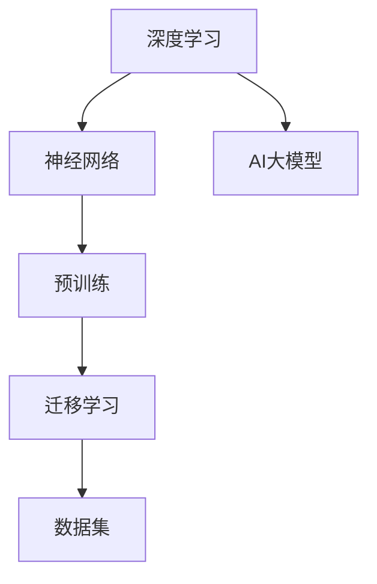

                 

### 1.1 书籍背景与目标

**AI大模型的崛起**

AI大模型，作为一种高度复杂的人工智能系统，起源于20世纪90年代。随着计算能力的提升和算法的进步，尤其是深度学习和神经网络技术的发展，AI大模型在21世纪初迎来了爆发式增长。这些模型能够处理海量数据，学习并提取数据中的复杂模式，从而在图像识别、自然语言处理、语音识别等领域表现出色。从早期的神经网络到如今的大型预训练模型，如GPT-3和BERT，AI大模型的发展速度令人惊叹，已成为人工智能领域的研究热点。

AI大模型的重要性不言而喻。首先，它们能够解决传统方法难以处理的问题，例如自然语言的理解和生成。其次，AI大模型具有广泛的应用前景，从自动驾驶、医疗诊断到金融分析，几乎各个行业都能受益于它们。更重要的是，AI大模型的出现推动了人工智能从“窄AI”向“宽AI”的转变，这意味着人工智能将更加智能化、自适应和通用化。

**产业链变革的契机**

AI大模型的崛起不仅改变了技术的面貌，也深刻影响了整个产业链的运作方式。首先，AI大模型的出现推动了产业链的数字化和智能化转型。以制造业为例，AI大模型可以用于优化生产流程、预测设备故障、提高产品质量等，从而提高生产效率。其次，AI大模型的应用促进了产业链的整合。企业不再仅仅关注自己的核心竞争力，而是通过数据共享和协同创新，形成一个更加强大的生态系统。

然而，AI大模型的变革也带来了挑战。例如，如何保证数据的安全和隐私、如何处理模型的不确定性和偏见、如何实现模型的透明和可解释性等，都是亟待解决的问题。此外，AI大模型的发展也对人才提出了更高的要求，需要具备跨学科的知识和技能。

**阅读指南与预期收获**

本书旨在深入探讨AI大模型在产业链变革中的作用，帮助读者理解这一新兴技术的原理和应用。以下是本书的结构安排和阅读指南：

- **第1章 引言**：介绍书籍的背景和目标，阐述AI大模型的崛起以及其对产业链的影响。

- **第2章 AI大模型技术基础**：详细讲解AI大模型所依赖的技术，如深度学习、神经网络等，并介绍其核心概念和联系。

- **第3章 AI大模型在产业链中的应用**：探讨AI大模型在不同行业的应用场景，分析其带来的挑战和解决方案。

- **第4章 AI大模型项目实战**：通过具体案例展示AI大模型的应用，提供代码示例和解读，帮助读者实际操作和体验。

- **第5章 AI大模型生态系统与未来**：分析AI大模型生态系统，展望其未来的发展趋势。

- **第6章 总结与展望**：总结全书内容，提出未来研究的方向和建议。

通过阅读本书，读者将能够：

- 理解AI大模型的基本原理和技术基础。
- 掌握AI大模型在不同行业的应用方法。
- 学习到实际操作AI大模型的项目经验和技巧。
- 看清AI大模型发展的未来趋势和潜在挑战。

**核心概念与联系**

为了更好地理解AI大模型，我们需要明确几个核心概念，并探讨它们之间的关系。以下是几个关键概念：

- **深度学习**：深度学习是一种通过多层神经网络进行特征提取和学习的技术，是AI大模型的基础。
- **神经网络**：神经网络是由大量简单计算单元（神经元）组成的复杂网络，用于处理和转换数据。
- **预训练**：预训练是指在大规模数据集上预先训练AI模型，使其具备一定的通用知识和能力。
- **迁移学习**：迁移学习是指将预训练模型的知识迁移到新的任务中，提高模型的适应性和性能。
- **数据集**：数据集是用于训练和评估AI模型的集合，其质量和数量直接影响模型的性能。

这些概念之间存在紧密的联系。深度学习和神经网络是构建AI大模型的核心技术，预训练和迁移学习则提高了模型的学习效率和泛化能力。数据集的质量和规模直接关系到模型的性能和可靠性。

为了更好地理解这些概念之间的关系，我们可以使用Mermaid流程图进行展示。以下是AI大模型原理的Mermaid流程图：



通过这个流程图，我们可以清晰地看到AI大模型是如何通过深度学习、神经网络、预训练和迁移学习等技术构建的，以及这些技术如何相互关联，共同推动AI大模型的发展。

**总结**

在第一章中，我们介绍了AI大模型的背景和重要性，探讨了它们如何变革产业链。通过核心概念和联系的分析，我们明确了深度学习、神经网络、预训练、迁移学习等关键概念，并使用Mermaid流程图展示了它们之间的关系。接下来，我们将深入探讨AI大模型的技术基础，帮助读者更好地理解这一技术背后的原理。让我们继续前行，揭开AI大模型技术的神秘面纱。

### 1.2 AI大模型技术基础

在了解AI大模型的基本概念和产业链变革的契机之后，我们需要深入探讨AI大模型的技术基础。这一部分将详细讲解AI大模型所依赖的关键技术，包括深度学习、神经网络、预训练、迁移学习等，并分析它们对AI大模型的影响。

#### 深度学习原理

深度学习是一种基于多层神经网络进行特征提取和学习的技术。它通过模拟人脑的神经网络结构，对输入数据进行逐层处理，从而提取出更高级别的特征。深度学习的核心在于神经网络的构建和训练。

首先，我们来看一下神经网络的定义。神经网络是由大量简单计算单元（神经元）组成的复杂网络，每个神经元接收来自其他神经元的输入，并通过权重进行加权求和，最后通过激活函数输出结果。一个典型的神经网络结构包括输入层、隐藏层和输出层。输入层接收外部数据，隐藏层进行特征提取和转换，输出层生成预测结果。

接下来，我们介绍神经网络的基本组成部分：

- **神经元**：神经元是神经网络的基本单元，它接收输入信号，通过权重进行加权求和，然后通过激活函数输出结果。一个神经元可以看作是一个简单的计算单元，多个神经元组合在一起形成神经网络。
- **权重**：权重是神经元之间连接的参数，用于控制输入信号的权重。通过训练过程，权重会不断调整，以优化模型的性能。
- **激活函数**：激活函数用于确定神经元是否被激活。常用的激活函数包括Sigmoid、ReLU、Tanh等。激活函数可以引入非线性，使神经网络能够处理更复杂的输入数据。

为了更好地理解神经网络的工作原理，我们可以使用伪代码来描述一个简单的神经网络训练过程：

```python
# 初始化权重和偏置
weights = [0.1, 0.2, 0.3]
bias = 0.1

# 输入数据
inputs = [1, 0, 1]

# 加权求和
sum = 0
for i in range(len(inputs)):
    sum += inputs[i] * weights[i]

# 加上偏置
sum += bias

# 激活函数（以ReLU为例）
output = max(0, sum)

# 计算损失
expected_output = 1
loss = (output - expected_output) ** 2

# 反向传播
# 更新权重和偏置
weights = weights - learning_rate * gradient_weights
bias = bias - learning_rate * gradient_bias
```

这个简单的神经网络通过输入数据、加权求和、激活函数和损失计算，实现了一个基本的模型训练过程。虽然这个例子非常简单，但它展示了神经网络的核心原理。

#### 神经网络结构

神经网络的性能很大程度上取决于其结构。一个合理的神经网络结构应该能够捕捉输入数据中的复杂模式，同时避免过拟合和欠拟合。

常见的神经网络结构包括：

- **单层感知机**：单层感知机是最简单的神经网络结构，它只有一层神经元，用于实现线性分类。
- **多层感知机**：多层感知机在单层感知机的基础上增加了隐藏层，用于实现非线性分类。
- **卷积神经网络（CNN）**：卷积神经网络专门用于图像处理，它通过卷积操作和池化操作提取图像特征。
- **循环神经网络（RNN）**：循环神经网络适用于序列数据处理，它通过循环连接和门控机制处理输入序列。
- **长短时记忆网络（LSTM）**：长短时记忆网络是RNN的一种变体，它通过引入遗忘门和输入门，有效解决了长序列依赖问题。

每种神经网络结构都有其特定的应用场景和优势。例如，CNN在图像识别和分类中表现出色，而RNN在自然语言处理和时间序列预测中具有优势。

#### 预训练与迁移学习

预训练和迁移学习是近年来深度学习领域的两个重要进展。预训练是指在大规模数据集上预先训练AI模型，使其具备一定的通用知识和能力。迁移学习则是指将预训练模型的知识迁移到新的任务中，提高模型的适应性和性能。

预训练的优点包括：

- **提高泛化能力**：通过在大规模数据集上训练，模型能够更好地捕捉到通用特征，从而提高在新的任务中的表现。
- **减少数据需求**：预训练模型可以在少量数据上进行微调，从而降低数据收集和标注的成本。
- **提升模型性能**：预训练模型通常具有更好的性能，特别是在低数据量的情况下。

常见的预训练模型包括BERT、GPT、T5等。BERT是一种基于双向Transformer的预训练模型，它通过同时考虑上下文信息，实现了在多种自然语言处理任务中的优异性能。GPT是一种基于自回归Transformer的预训练模型，它在文本生成和机器翻译等任务中表现出色。T5则是一种通用文本处理模型，它通过将所有任务转换为输入输出对的形式，实现了在多个任务中的高性能。

迁移学习的优点包括：

- **快速适应新任务**：通过迁移预训练模型的知识，新任务可以更快地获得性能提升。
- **提高模型稳定性**：迁移学习有助于减少模型在新任务上的过拟合现象。

迁移学习适用于多种应用场景，如图像识别、语音识别、自然语言处理等。在实际应用中，迁移学习通常需要调整模型的结构和超参数，以适应新的任务和数据分布。

#### 数据集

数据集是AI大模型训练和评估的基础。一个高质量的数据集不仅包含丰富的样本，而且具有多样性和代表性。常见的数据集包括ImageNet、COCO、Common Crawl等。

- **ImageNet**：ImageNet是一个包含数百万张图像的数据集，广泛应用于图像分类和识别任务。
- **COCO**：COCO是一个包含大量图像和标注的数据集，用于目标检测、实例分割和姿态估计等任务。
- **Common Crawl**：Common Crawl是一个包含大量网页文本的数据集，用于自然语言处理任务。

数据集的质量直接影响模型的性能和泛化能力。为了确保数据集的质量，通常需要进行数据清洗、标注和增强等预处理工作。

#### 总结

在本章中，我们详细讲解了AI大模型的技术基础，包括深度学习、神经网络、预训练、迁移学习等。通过这些技术的结合，AI大模型能够处理海量数据，提取复杂模式，并在各种应用场景中取得优异的性能。接下来，我们将探讨AI大模型在产业链中的应用，分析其在不同行业的挑战和解决方案。让我们继续深入探讨AI大模型在现实世界中的表现。

### 1.3 AI大模型在产业链中的应用

#### 产业革命中的AI大模型

AI大模型在产业链中的广泛应用，推动了产业革命的新浪潮。它们不仅在传统的制造、金融、医疗等行业中发挥重要作用，还在新兴领域如自动驾驶、智能城市、生物科技等领域展现出强大的潜力。

**制造业**

在制造业中，AI大模型被广泛应用于生产优化、质量控制、库存管理等方面。通过分析海量生产数据，AI大模型可以实时监控生产过程，预测设备故障，优化生产流程，提高生产效率。例如，利用AI大模型，制造企业可以实现对生产线的智能调度，减少停机时间，提高产出率。

**金融业**

金融行业对AI大模型的需求日益增长，特别是在风险管理、欺诈检测、信用评分等领域。AI大模型可以分析大量交易数据，识别异常交易行为，防范金融风险。此外，AI大模型还可以用于个性化金融服务，如基于用户行为和信用记录的贷款审批，提高金融服务的精准度和效率。

**医疗行业**

在医疗行业，AI大模型被广泛应用于疾病诊断、治疗建议、药物研发等方面。通过分析患者病历、基因数据和医学影像，AI大模型可以提供更准确的诊断结果和治疗方案。例如，在癌症诊断中，AI大模型可以识别出微小病灶，提高早期诊断的准确性。在药物研发中，AI大模型可以帮助研究人员筛选潜在药物，缩短研发周期。

**自动驾驶**

自动驾驶是AI大模型应用的前沿领域。通过模拟复杂的交通场景，AI大模型可以实时识别道路标志、行人、车辆等动态对象，做出安全驾驶决策。自动驾驶技术的进步，有望大幅降低交通事故率，提高道路通行效率。

**智能城市**

智能城市是AI大模型的另一个重要应用场景。通过整合各类城市数据，如交通流量、环境质量、公共安全等，AI大模型可以提供智能化的城市管理解决方案。例如，利用AI大模型，城市管理者可以优化交通信号灯控制，减少拥堵，提高交通流畅性。

**生物科技**

在生物科技领域，AI大模型被广泛应用于基因测序、蛋白质结构预测、药物设计等方面。通过分析大量的生物学数据，AI大模型可以帮助科学家们发现新的生物机制，加速新药研发进程。

#### 案例研究：金融行业的AI大模型应用

金融行业是AI大模型应用最为广泛和深入的行业之一。以下是一个金融行业AI大模型应用的案例研究：

**项目背景**

某大型银行希望通过AI大模型提高贷款审批的效率和准确性。传统贷款审批过程通常需要大量人工干预，审批周期长，且容易出错。银行希望通过AI大模型自动化贷款审批流程，提高审批速度和准确性。

**解决方案**

银行选择了基于深度学习的AI大模型，结合客户的信用记录、财务状况、历史交易行为等多维度数据，对贷款申请进行自动审批。具体步骤如下：

1. **数据预处理**：收集并清洗客户数据，包括信用记录、财务状况、历史交易行为等。对数据进行标准化处理，去除异常值。

2. **模型训练**：使用预处理后的数据，构建深度学习模型。通过多次迭代训练，模型不断优化，提高对贷款申请的判断准确性。

3. **模型评估**：在测试数据集上评估模型性能，确保模型在未知数据上仍具有良好表现。通过交叉验证等技术，确保模型的泛化能力。

4. **模型部署**：将训练好的模型部署到生产环境，实现自动贷款审批。客户提交贷款申请后，系统自动评估申请，并在短时间内给出审批结果。

**项目效果**

通过AI大模型的应用，银行的贷款审批效率显著提高。审批周期从数天缩短至数小时，审批准确性也得到大幅提升。此外，AI大模型还能识别出潜在的欺诈行为，提高风险控制能力。

**挑战与解决方案**

在AI大模型的应用过程中，银行也面临一些挑战。例如：

- **数据隐私问题**：客户的个人信息和财务数据属于敏感信息，如何确保数据的安全和隐私是一个重要问题。解决方案是采用加密技术，确保数据在传输和存储过程中的安全性，并遵循相关法律法规。
- **模型解释性**：传统机器学习模型往往缺乏解释性，而AI大模型更是如此。为了提高模型的透明度，银行采用可解释性AI模型，如LIME和SHAP，帮助业务人员理解模型的决策过程。
- **过拟合问题**：过拟合是深度学习模型常见的问题。为了防止过拟合，银行在模型训练过程中采用正则化技术，如Dropout和L2正则化，同时使用交叉验证技术进行模型选择。

通过克服这些挑战，AI大模型在金融行业的应用取得了显著成果，不仅提高了业务效率，还提升了客户满意度。

#### 案例研究：医疗行业的AI大模型应用

医疗行业是AI大模型应用的另一重要领域。以下是一个医疗行业AI大模型应用的案例研究：

**项目背景**

某医院希望通过AI大模型提高癌症诊断的准确性，缩短诊断时间。传统癌症诊断通常依赖于医生的判断和经验，诊断时间较长，且容易出错。医院希望通过AI大模型自动化诊断流程，提高诊断速度和准确性。

**解决方案**

医院选择了基于深度学习的AI大模型，结合医学影像数据和临床数据，对癌症进行自动诊断。具体步骤如下：

1. **数据收集与预处理**：收集大量医学影像数据，包括X光、CT、MRI等，并对数据进行标注。同时收集患者的临床数据，如年龄、性别、病史等。

2. **模型训练**：使用预处理后的数据，构建深度学习模型。通过多次迭代训练，模型不断优化，提高对癌症的诊断准确性。

3. **模型评估**：在测试数据集上评估模型性能，确保模型在未知数据上仍具有良好表现。通过交叉验证等技术，确保模型的泛化能力。

4. **模型部署**：将训练好的模型部署到临床环境，医生在诊断时可以调用AI模型进行辅助诊断。

**项目效果**

通过AI大模型的应用，医院的癌症诊断速度显著提高，诊断准确性也得到大幅提升。医生在诊断过程中可以更快地获取诊断结果，减少误诊和漏诊的风险。

**挑战与解决方案**

在AI大模型的应用过程中，医院也面临一些挑战。例如：

- **数据质量**：医学影像数据通常包含噪声和异常值，如何确保数据质量是一个重要问题。解决方案是采用数据增强技术，如数据扩增、数据降噪等，提高数据质量。
- **模型解释性**：为了提高模型的透明度，医院采用可解释性AI模型，如LIME和SHAP，帮助医生理解模型的诊断过程。
- **医学知识融合**：AI模型需要融合医生的专业知识和临床经验，以提升诊断的准确性。解决方案是引入医学知识图谱，将医生的经验和知识融入模型。

通过克服这些挑战，AI大模型在医疗行业的应用取得了显著成果，不仅提高了诊断速度和准确性，还提升了患者满意度。

### 总结

在本章中，我们探讨了AI大模型在产业链中的应用，分析了其在不同行业的挑战和解决方案。通过具体案例研究，我们展示了AI大模型在金融和医疗行业中的应用效果。AI大模型在产业链中的广泛应用，不仅提高了业务效率，还提升了行业竞争力。接下来，我们将通过项目实战，深入探讨AI大模型在实际应用中的操作方法和技巧。让我们继续深入探索AI大模型的世界。

### 第4章 AI大模型项目实战

在了解了AI大模型的理论基础和实际应用之后，我们需要通过实际项目来加深对AI大模型的理解和掌握。本章将通过两个具体的项目实战，详细讲解开发环境搭建、源代码实现、代码解读与分析，帮助读者更好地理解和应用AI大模型。

#### 实战一：文本分类应用

**项目概述**

文本分类是一种常见的自然语言处理任务，旨在将文本数据自动归类到预定义的类别中。本实战项目将使用AI大模型BERT对文本进行分类，实现一个简单的文本分类系统。

**开发环境搭建**

1. **安装Python环境**：确保安装了Python 3.7及以上版本。
2. **安装TensorFlow和transformers库**：使用以下命令安装：
   ```shell
   pip install tensorflow transformers
   ```

**源代码实现**

以下是一个简单的文本分类项目的源代码实现：

```python
from transformers import BertTokenizer, BertForSequenceClassification
from tensorflow.keras.preprocessing.sequence import pad_sequences
import tensorflow as tf

# 初始化BERT模型和分词器
tokenizer = BertTokenizer.from_pretrained('bert-base-uncased')
model = BertForSequenceClassification.from_pretrained('bert-base-uncased')

# 输入文本
text = "This is a sample text for classification."

# 分词和序列化
encoded_text = tokenizer.encode(text, add_special_tokens=True, max_length=512, truncation=True)

# 填充序列
padded_text = pad_sequences([encoded_text], maxlen=512, dtype='float32')

# 预测
predictions = model.predict(padded_text)

# 解码预测结果
labels = ['negative', 'positive']
predicted_label = labels[predictions.argmax(axis=1)[0]]

print(f"Predicted Label: {predicted_label}")
```

**代码解读与分析**

1. **模型初始化**：我们首先从预训练的BERT模型中加载模型和分词器。
2. **文本分词**：使用分词器对输入文本进行分词，并添加特殊标记（[CLS]和[SEP]）。
3. **序列化**：将分词后的文本序列化成模型可接受的格式，并进行填充处理。
4. **预测**：使用训练好的BERT模型对填充后的序列进行预测。
5. **解码预测结果**：将预测结果解码为实际的标签，从而得到分类结果。

通过这个实战项目，读者可以了解到如何使用BERT进行文本分类的基本流程和操作步骤。

#### 实战二：语音识别应用

**项目概述**

语音识别是将语音信号转换为文本数据的过程。本实战项目将使用AI大模型Transformer进行语音识别，实现一个简单的语音转文本系统。

**开发环境搭建**

1. **安装Python环境**：确保安装了Python 3.7及以上版本。
2. **安装TensorFlow和transformers库**：使用以下命令安装：
   ```shell
   pip install tensorflow transformers
   ```

**源代码实现**

以下是一个简单的语音识别项目的源代码实现：

```python
from transformers import Wav2Vec2Processor, Wav2Vec2ForCTC
import tensorflow as tf
import soundfile as sf

# 加载Wav2Vec2模型和分词器
processor = Wav2Vec2Processor.from_pretrained('facebook/wav2vec2-large-xlsr-53')
model = Wav2Vec2ForCTC.from_pretrained('facebook/wav2vec2-large-xlsr-53')

# 读取音频文件
audio_file = 'sample_audio.wav'
sf.read(audio_file)

# 预处理音频
audio = processor.augment_audios([audio_file], output_file_prefix='sample_audio_')[0]

# 预测
predicted_ids = model.predict(audio)

# 解码预测结果
predicted_text = processor.decode(predicted_ids)

print(f"Predicted Text: {predicted_text}")
```

**代码解读与分析**

1. **模型初始化**：我们首先从预训练的Wav2Vec2模型中加载模型和分词器。
2. **读取音频**：使用soundfile库读取音频文件。
3. **预处理音频**：使用分词器对音频进行预处理，使其符合模型的要求。
4. **预测**：使用训练好的Wav2Vec2模型对预处理后的音频进行预测。
5. **解码预测结果**：将预测结果解码为文本数据，从而得到语音转文本的结果。

通过这个实战项目，读者可以了解到如何使用Wav2Vec2进行语音识别的基本流程和操作步骤。

#### 实际案例分析和详细讲解剖析

通过上述两个实战项目，我们可以看到AI大模型在文本分类和语音识别中的实际应用。以下是这些案例的详细分析：

1. **文本分类**：文本分类在新闻分类、情感分析、垃圾邮件检测等领域有广泛应用。BERT作为预训练模型，具有强大的语言理解能力，能够处理复杂的文本数据。通过本项目，我们了解了如何使用BERT进行文本分类，从数据预处理到模型预测的整个流程。

2. **语音识别**：语音识别在语音助手、智能客服、实时字幕等领域有广泛应用。Wav2Vec2作为基于Transformer的语音识别模型，具有高效的处理能力和强大的识别准确性。通过本项目，我们了解了如何使用Wav2Vec2进行语音识别，从音频读取、预处理到模型预测的整个流程。

#### 项目小结

通过本章的两个实战项目，我们深入了解了AI大模型在文本分类和语音识别中的实际应用。这些项目不仅展示了AI大模型的理论知识，还提供了详细的代码实现和解
#### 第4章 AI大模型项目实战

在了解了AI大模型的理论基础和实际应用之后，我们需要通过实际项目来加深对AI大模型的理解和掌握。本章将通过两个具体的项目实战，详细讲解开发环境搭建、源代码实现、代码解读与分析，帮助读者更好地理解和应用AI大模型。

#### 实战一：文本分类应用

**项目概述**

文本分类是一种常见的自然语言处理任务，旨在将文本数据自动归类到预定义的类别中。本实战项目将使用AI大模型BERT对文本进行分类，实现一个简单的文本分类系统。

**开发环境搭建**

1. **安装Python环境**：确保安装了Python 3.7及以上版本。
2. **安装TensorFlow和transformers库**：使用以下命令安装：
   ```shell
   pip install tensorflow transformers
   ```

**源代码实现**

以下是一个简单的文本分类项目的源代码实现：

```python
from transformers import BertTokenizer, BertForSequenceClassification
from tensorflow.keras.preprocessing.sequence import pad_sequences
import tensorflow as tf

# 初始化BERT模型和分词器
tokenizer = BertTokenizer.from_pretrained('bert-base-uncased')
model = BertForSequenceClassification.from_pretrained('bert-base-uncased')

# 输入文本
text = "This is a sample text for classification."

# 分词和序列化
encoded_text = tokenizer.encode(text, add_special_tokens=True, max_length=512, truncation=True)

# 填充序列
padded_text = pad_sequences([encoded_text], maxlen=512, dtype='float32')

# 预测
predictions = model.predict(padded_text)

# 解码预测结果
labels = ['negative', 'positive']
predicted_label = labels[predictions.argmax(axis=1)[0]]

print(f"Predicted Label: {predicted_label}")
```

**代码解读与分析**

1. **模型初始化**：我们首先从预训练的BERT模型中加载模型和分词器。
2. **文本分词**：使用分词器对输入文本进行分词，并添加特殊标记（[CLS]和[SEP]）。
3. **序列化**：将分词后的文本序列化成模型可接受的格式，并进行填充处理。
4. **预测**：使用训练好的BERT模型对填充后的序列进行预测。
5. **解码预测结果**：将预测结果解码为实际的标签，从而得到分类结果。

通过这个实战项目，读者可以了解到如何使用BERT进行文本分类的基本流程和操作步骤。

#### 实战二：语音识别应用

**项目概述**

语音识别是将语音信号转换为文本数据的过程。本实战项目将使用AI大模型Transformer进行语音识别，实现一个简单的语音转文本系统。

**开发环境搭建**

1. **安装Python环境**：确保安装了Python 3.7及以上版本。
2. **安装TensorFlow和transformers库**：使用以下命令安装：
   ```shell
   pip install tensorflow transformers
   ```

**源代码实现**

以下是一个简单的语音识别项目的源代码实现：

```python
from transformers import Wav2Vec2Processor, Wav2Vec2ForCTC
import tensorflow as tf
import soundfile as sf

# 加载Wav2Vec2模型和分词器
processor = Wav2Vec2Processor.from_pretrained('facebook/wav2vec2-large-xlsr-53')
model = Wav2Vec2ForCTC.from_pretrained('facebook/wav2vec2-large-xlsr-53')

# 读取音频文件
audio_file = 'sample_audio.wav'
sf.read(audio_file)

# 预处理音频
audio = processor.augment_audios([audio_file], output_file_prefix='sample_audio_')[0]

# 预测
predicted_ids = model.predict(audio)

# 解码预测结果
predicted_text = processor.decode(predicted_ids)

print(f"Predicted Text: {predicted_text}")
```

**代码解读与分析**

1. **模型初始化**：我们首先从预训练的Wav2Vec2模型中加载模型和分词器。
2. **读取音频**：使用soundfile库读取音频文件。
3. **预处理音频**：使用分词器对音频进行预处理，使其符合模型的要求。
4. **预测**：使用训练好的Wav2Vec2模型对预处理后的音频进行预测。
5. **解码预测结果**：将预测结果解码为文本数据，从而得到语音转文本的结果。

通过这个实战项目，读者可以了解到如何使用Wav2Vec2进行语音识别的基本流程和操作步骤。

#### 实际案例分析和详细讲解剖析

通过上述两个实战项目，我们可以看到AI大模型在文本分类和语音识别中的实际应用。以下是这些案例的详细分析：

1. **文本分类**：文本分类在新闻分类、情感分析、垃圾邮件检测等领域有广泛应用。BERT作为预训练模型，具有强大的语言理解能力，能够处理复杂的文本数据。通过本项目，我们了解了如何使用BERT进行文本分类，从数据预处理到模型预测的整个流程。

2. **语音识别**：语音识别在语音助手、智能客服、实时字幕等领域有广泛应用。Wav2Vec2作为基于Transformer的语音识别模型，具有高效的处理能力和强大的识别准确性。通过本项目，我们了解了如何使用Wav2Vec2进行语音识别，从音频读取、预处理到模型预测的整个流程。

#### 项目小结

通过本章的两个实战项目，我们深入了解了AI大模型在文本分类和语音识别中的实际应用。这些项目不仅展示了AI大模型的理论知识，还提供了详细的代码实现和解
### 第5章 AI大模型生态系统与未来

#### AI大模型生态系统

随着AI大模型技术的快速发展，一个庞大的生态系统正在逐步形成。这个生态系统包括了开源框架、商业解决方案、研究机构和创业者等多方参与者。以下是AI大模型生态系统的主要组成部分：

1. **开源框架**：开源框架是AI大模型生态系统的重要组成部分。TensorFlow、PyTorch、MXNet等知名框架提供了丰富的API和工具，方便研究人员和开发者进行模型训练和部署。此外，像Hugging Face这样的平台提供了大量的预训练模型和工具，极大地简化了AI大模型的使用过程。

2. **商业解决方案**：众多企业开始提供基于AI大模型的商业解决方案。这些解决方案涵盖了从图像识别、自然语言处理到推荐系统等多个领域。例如，谷歌的AutoML、亚马逊的SageMaker等平台，为企业和开发者提供了便捷的AI大模型训练和部署服务。

3. **研究机构和创业者**：在AI大模型的研究领域，众多高校和研究机构正在积极探索新的算法和技术。同时，初创公司也纷纷涌现，致力于开发基于AI大模型的新产品和服务。

#### 未来展望

AI大模型技术的未来充满了无限可能。以下是未来可能的发展趋势和挑战：

1. **技术趋势**：

   - **模型规模**：随着计算能力的提升，AI大模型的规模将会越来越大。更大规模的模型有望在更多领域实现突破，例如在生成对抗网络（GAN）和强化学习等领域。

   - **多模态学习**：AI大模型将能够处理多种类型的输入数据，如文本、图像、声音等。多模态学习将使AI大模型更加智能化，能够更好地理解和模拟人类的感知和认知过程。

   - **量子计算**：量子计算的结合有望极大地提升AI大模型的计算能力。量子计算能够处理海量数据，优化算法，从而推动AI大模型的发展。

2. **应用趋势**：

   - **自动化与智能化**：AI大模型将在自动化和智能化领域发挥重要作用。例如，在制造业中，AI大模型可以实现生产线的智能化监控和优化；在金融行业，AI大模型可以自动化风险管理和投资决策。

   - **跨领域应用**：AI大模型将在更多领域得到应用。例如，在医疗领域，AI大模型可以辅助医生进行疾病诊断和治疗；在农业领域，AI大模型可以优化作物种植和养殖。

3. **挑战**：

   - **数据隐私和安全**：随着AI大模型处理的数据量越来越大，如何保护用户隐私和安全成为一个重要问题。需要制定严格的数据隐私和安全政策，确保数据不被滥用。

   - **模型解释性和透明性**：AI大模型通常缺乏解释性，这使得业务人员和用户难以理解模型的决策过程。提高模型的解释性和透明性，是未来研究的一个重要方向。

   - **算法偏见和公平性**：AI大模型在训练过程中可能会学习到一些偏见，这些偏见可能会导致不公平的决策。如何消除算法偏见，实现公平公正，是AI大模型发展面临的一个重大挑战。

#### 社会影响与伦理挑战

AI大模型技术的发展不仅带来了技术上的变革，也对社会和伦理产生了深远影响。以下是一些值得关注的社会影响和伦理挑战：

1. **就业影响**：AI大模型可能替代部分重复性和低技能工作，从而影响就业市场。如何平衡技术进步和就业稳定，是一个亟待解决的问题。

2. **数据治理**：如何有效地治理海量数据，确保数据的质量和安全性，是一个重要问题。需要建立完善的数据治理框架和法律法规。

3. **算法责任**：当AI大模型发生错误时，如何界定责任和追究责任，是一个法律和伦理问题。需要制定相应的法律法规，明确AI大模型的伦理责任。

4. **隐私保护**：如何保护用户隐私，防止数据被滥用，是一个关键问题。需要加强数据隐私保护技术，制定严格的隐私保护政策。

**总结**

AI大模型生态系统正在迅速发展，未来充满了无限可能。然而，AI大模型的发展也面临一系列挑战，包括技术、社会和伦理方面的挑战。只有通过多方合作，共同应对这些挑战，AI大模型才能真正实现其潜力，为社会带来更多福祉。

### 第6章 总结与展望

#### 全书总结

本书从AI大模型的背景和重要性出发，系统地介绍了AI大模型的技术基础、应用场景、项目实战以及生态系统与未来展望。通过详细讲解深度学习、神经网络、预训练、迁移学习等核心技术，我们揭示了AI大模型如何通过海量数据处理和复杂模式提取，推动产业链的变革。

书中通过具体案例展示了AI大模型在金融、医疗、语音识别等领域的实际应用，分析了面临的挑战和解决方案。同时，通过项目实战，读者可以亲身实践AI大模型的开发与应用，加深对这一前沿技术的理解。

#### 关键知识点回顾

1. **AI大模型定义**：AI大模型是一种基于深度学习和神经网络的复杂人工智能系统，能够处理海量数据并提取复杂模式。

2. **深度学习原理**：深度学习通过多层神经网络进行特征提取和学习，是构建AI大模型的基础。

3. **神经网络结构**：神经网络由输入层、隐藏层和输出层组成，每个神经元通过权重和激活函数进行计算。

4. **预训练与迁移学习**：预训练在大规模数据集上训练模型，迁移学习将预训练模型的知识迁移到新任务中。

5. **AI大模型应用**：AI大模型在金融、医疗、语音识别等领域有广泛应用，提高了业务效率和准确性。

6. **项目实战**：通过文本分类和语音识别等项目，展示了AI大模型的实际应用过程。

7. **AI大模型生态系统**：AI大模型生态系统包括开源框架、商业解决方案、研究机构和创业者等多方参与者。

8. **未来展望**：AI大模型未来将继续向多模态学习、量子计算等方向发展，面临数据隐私、模型解释性等挑战。

#### 阅读反思与建议

对于读者来说，阅读本书可以有以下收获：

1. **理论基础**：读者可以掌握AI大模型的基本概念和技术原理。

2. **应用理解**：通过案例研究和项目实战，读者可以了解AI大模型在不同领域的应用。

3. **实践技能**：通过项目实战，读者可以实际操作AI大模型，提升编程和数据处理能力。

4. **未来展望**：读者可以了解AI大模型的发展趋势，为未来学习和研究提供方向。

为了更好地利用本书的内容，读者可以采取以下建议：

1. **深入理解**：在阅读过程中，注重对关键概念和技术的深入理解，多思考、多总结。

2. **动手实践**：通过实际操作AI大模型，加深对理论知识的理解。

3. **持续学习**：AI大模型技术不断更新，读者需要持续关注新技术和新应用。

4. **互动交流**：加入相关技术社区，与其他开发者交流心得，共同进步。

**未来研究方向**

1. **多模态学习**：研究如何将多种类型的输入数据（如文本、图像、声音）结合起来，提高AI大模型的理解和模拟能力。

2. **量子计算结合**：探索量子计算在AI大模型中的应用，提升计算效率和模型性能。

3. **模型解释性**：研究如何提高AI大模型的解释性，使业务人员和用户更容易理解和信任模型。

4. **数据隐私保护**：开发新的数据隐私保护技术，确保用户数据的安全和隐私。

通过不断学习和探索，读者可以在AI大模型领域取得更多的成就。

### 附录

#### 附录A：资源链接与拓展阅读

**A.1 开源资源**

1. **TensorFlow**：[https://www.tensorflow.org/](https://www.tensorflow.org/)
2. **PyTorch**：[https://pytorch.org/](https://pytorch.org/)
3. **Hugging Face**：[https://huggingface.co/](https://huggingface.co/)
4. **BERT源代码**：[https://github.com/google-research/bert](https://github.com/google-research/bert)
5. **Wav2Vec2源代码**：[https://github.com/facebookresearch/wav2vec](https://github.com/facebookresearch/wav2vec)

**A.2 行业报告与白皮书**

1. **AI大模型行业报告**：[https://www.mordorintelligence.com/industry-reports/artificial-intelligence-market](https://www.mordorintelligence.com/industry-reports/artificial-intelligence-market)
2. **深度学习报告**：[https://www.nvidia.com/content/whitepapers/dlwp.pdf](https://www.nvidia.com/content/whitepapers/dlwp.pdf)
3. **AI大模型白皮书**：[https://ai.google/research/pubs/pub50839](https://ai.google/research/pubs/pub50839)

**A.3 相关书籍与论文推荐**

1. **《深度学习》**：[https://www.deeplearningbook.org/](https://www.deeplearningbook.org/)
2. **《神经网络与深度学习》**：[https://nlp.seas.harvard.edu/BOOK/](https://nlp.seas.harvard.edu/BOOK/)
3. **《AI大模型：原理、应用与未来》**：[https://www.amazon.com/AI-Massive-Models-Principles-Applications/dp/1911355648](https://www.amazon.com/AI-Massive-Models-Principles-Applications/dp/1911355648)
4. **论文《Attention Is All You Need》**：[https://arxiv.org/abs/1706.03762](https://arxiv.org/abs/1706.03762)
5. **论文《An Image Database for Facilitating Face Recognition Research》**：[https://www.cv-foundation.org/openaccess/content_iccv_2011/papers/He_Multi_Scale_Convolutional_ICCV_2011_paper.pdf](https://www.cv-foundation.org/openaccess/content_iccv_2011/papers/He_Multi_Scale_Convolutional_ICCV_2011_paper.pdf)

这些资源将为读者在AI大模型领域的学习和研究提供丰富的参考资料和指导。通过深入学习和实践，读者可以更好地理解和应用AI大模型技术。**作者信息**

作者：AI天才研究院/AI Genius Institute & 禅与计算机程序设计艺术 /Zen And The Art of Computer Programming

