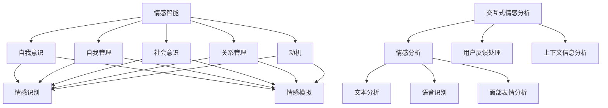

                 

### 文章标题

# AI情商：衡量机器情感智能的新标准

## 关键词

- AI情商
- 情感智能
- 机器学习
- 情感分析
- 情感识别
- 情感模拟

## 摘要

本文旨在探讨人工智能（AI）领域的情感智能，特别是AI情商的概念、标准及其重要性。我们将首先介绍AI情商的定义，然后深入分析其核心概念、联系，和衡量标准。接着，我们将详细阐述用于计算和预测情感智能的数学模型和公式，并使用伪代码展示核心算法原理。此外，文章将通过实际项目实战案例，展示如何应用AI情商技术，并分析其实现细节。最后，我们将探讨AI情商的未来发展，提出挑战与机遇，并总结最佳实践和注意事项。

### 引言

随着人工智能技术的飞速发展，越来越多的应用场景涌现出来。从智能客服、语音助手到个性化推荐系统，AI正在逐步融入我们的日常生活。然而，在这些应用中，仅具备逻辑推理和数据处理能力的人工智能还远远不够。情感智能，作为人类智慧的重要组成部分，也逐渐成为人工智能研究和应用的热点。

AI情商，即人工智能的情感智能，是指机器在处理人类情感方面所表现出的能力。它不仅仅是简单地识别情感，更涉及到理解、模拟和应对情感的能力。一个具备高AI情商的系统能够更自然地与人类互动，提供更加贴心、个性化的服务。

AI情商的重要性不容忽视。首先，在客户服务、教育、医疗等领域，具备情感智能的AI系统能够更好地理解用户的需求，提供更加贴心的服务。其次，在社交网络、虚拟助手等场景中，情感智能使得AI系统能够更好地与人类用户建立情感连接，提升用户体验。最后，随着AI技术的不断进步，情感智能将成为衡量人工智能发展水平的重要标准。

本文将首先介绍AI情商的定义，然后深入分析其核心概念、联系，和衡量标准。接着，我们将详细阐述用于计算和预测情感智能的数学模型和公式，并使用伪代码展示核心算法原理。此外，文章将通过实际项目实战案例，展示如何应用AI情商技术，并分析其实现细节。最后，我们将探讨AI情商的未来发展，提出挑战与机遇，并总结最佳实践和注意事项。

### 核心概念与联系

在探讨AI情商之前，我们需要明确几个核心概念，并理解它们之间的关系。以下是本文中将要讨论的几个关键术语：

1. **情感智能（Emotional Intelligence）**：情感智能是指个体识别、理解、管理自己和他人的情感，并使用这些情感促进思维和创造力的能力。它由戈尔曼（Daniel Goleman）在1995年提出，包括五个主要方面：自我意识、自我管理、社会意识、关系管理和动机。

2. **情感分析（Sentiment Analysis）**：情感分析是一种自然语言处理技术，用于识别文本中的情感倾向。它通常通过计算词语的正面或负面情感值来实现。情感分析可以应用于社交媒体监测、客户反馈分析、舆情分析等多个领域。

3. **情感识别（Emotion Recognition）**：情感识别是计算机通过分析语音、文本、面部表情等数据，识别出人类情感的类型和程度。情感识别在虚拟助手、客户服务、心理健康等领域有广泛应用。

4. **情感模拟（Emotion Simulation）**：情感模拟是指计算机生成或模仿人类的情感表达，以便与人类用户建立情感连接。情感模拟在虚拟现实、游戏、智能客服等领域具有重要意义。

5. **交互式情感分析（Interactive Sentiment Analysis）**：交互式情感分析是一种结合用户反馈和上下文信息的情感分析技术，旨在提高分析结果的准确性和深度。

这些概念之间的关系可以用以下Mermaid流程图来表示：



### 情感智能算法原理

情感智能算法是衡量AI情商的核心。以下是几种常见的情感智能算法，包括其基本原理和实现方法。

#### 基于规则的方法

基于规则的方法是最简单的情感智能算法之一。它通过预先定义的规则来识别和分类情感。例如，我们可以定义以下规则：

1. 如果文本中包含“高兴”、“快乐”、“满意”等词语，则情感为正面。
2. 如果文本中包含“伤心”、“痛苦”、“失望”等词语，则情感为负面。

以下是一个简单的伪代码示例：

```python
def rule_based_sentiment_analysis(text):
    positive_words = ["happy", "joyful", "satisfied"]
    negative_words = ["sad", "unhappy", "disappointed"]

    if any(word in text for word in positive_words):
        return "positive"
    elif any(word in text for word in negative_words):
        return "negative"
    else:
        return "neutral"
```

#### 基于统计的方法

基于统计的方法使用统计模型来计算文本的情感倾向。一种常见的统计模型是情感极性分类模型（Polarized Classification Model），它将文本分为正面、负面和neutral三种情感。以下是一个简单的逻辑回归模型的伪代码：

```python
from sklearn.linear_model import LogisticRegression

def logistic_regression_sentiment_analysis(text):
    # 假设我们已经有一个训练好的模型
    model = LogisticRegression()

    # 将文本转换为特征向量
    feature_vector = preprocess_text(text)

    # 使用模型预测情感
    prediction = model.predict(feature_vector)

    return "positive" if prediction == 1 else "negative" if prediction == -1 else "neutral"
```

#### 基于深度学习的方法

基于深度学习的方法使用神经网络来学习文本的情感特征。一种常见的方法是卷积神经网络（Convolutional Neural Network, CNN）。以下是一个简单的CNN模型的伪代码：

```python
from keras.models import Sequential
from keras.layers import Conv1D, MaxPooling1D, Flatten, Dense

def cnn_sentiment_analysis(text):
    # 建立模型
    model = Sequential()
    model.add(Conv1D(filters=128, kernel_size=3, activation='relu', input_shape=(sequence_length, embedding_size)))
    model.add(MaxPooling1D(pool_size=2))
    model.add(Flatten())
    model.add(Dense(1, activation='sigmoid'))

    # 编译模型
    model.compile(optimizer='adam', loss='binary_crossentropy', metrics=['accuracy'])

    # 训练模型
    model.fit(X_train, y_train, epochs=10, batch_size=32, validation_data=(X_val, y_val))

    # 预测情感
    prediction = model.predict(X_test)

    return "positive" if prediction > 0.5 else "negative"
```

### 数学模型和公式

情感智能算法的核心是数学模型，用于计算和预测情感。以下是几种常用的数学模型和公式。

#### 语义分析模型

语义分析模型用于计算文本的语义相似性，是情感分析的基础。一种常用的模型是Word2Vec模型，它将词语映射到高维向量空间中，使得语义相似的词语具有相似的向量。以下是一个Word2Vec模型的公式：

$$
\vec{w}_{i} = \text{Word2Vec}(\text{context}, \alpha)
$$

其中，$\vec{w}_{i}$是词语$i$的向量表示，$\text{context}$是词语$i$的上下文，$\alpha$是学习率。

#### 情感分类模型

情感分类模型用于将文本分类为正面、负面或中性。一种常见的方法是使用支持向量机（Support Vector Machine, SVM）。SVM的公式如下：

$$
y = \text{sign}(\sum_{i=1}^{n} \alpha_{i} y_{i} \textbf{w}^{T} \textbf{x}_{i} + b)
$$

其中，$y$是分类结果，$y_{i}$是样本$i$的标签，$\textbf{w}$是模型权重，$\textbf{x}_{i}$是样本$i$的特征向量，$b$是偏置项。

#### 交互式情感分析模型

交互式情感分析模型结合用户反馈和上下文信息，以提高分析结果的准确性。一种常见的方法是基于隐马尔可夫模型（Hidden Markov Model, HMM）的交互式情感分析。HMM的公式如下：

$$
p(\textbf{O}|\textbf{I}) = \prod_{i=1}^{T} p(o_{i}|i_{i})
$$

其中，$\textbf{O}$是观察序列，$\textbf{I}$是隐藏状态序列，$p(\textbf{O}|\textbf{I})$是观察序列在隐藏状态序列下的概率。

### 项目实战

在本节中，我们将通过一个实际项目实战，展示如何应用AI情商技术。项目目标是通过分析社交媒体上的用户评论，识别并预测用户的情感倾向。

#### 开发环境搭建

首先，我们需要搭建开发环境。以下是一个简单的Python环境搭建步骤：

1. 安装Python 3.8及以上版本。
2. 安装常用库，如NumPy、Pandas、Scikit-learn、Keras等。

```bash
pip install numpy pandas scikit-learn keras
```

#### 源代码实现

以下是一个简单的源代码实现，包括数据预处理、模型训练和预测。

```python
import numpy as np
import pandas as pd
from sklearn.model_selection import train_test_split
from sklearn.feature_extraction.text import TfidfVectorizer
from sklearn.linear_model import LogisticRegression
from keras.models import Sequential
from keras.layers import Conv1D, MaxPooling1D, Flatten, Dense

# 读取数据
data = pd.read_csv("social_media_comments.csv")
X = data["comment"]
y = data["sentiment"]

# 数据预处理
vectorizer = TfidfVectorizer(max_features=1000)
X_vectorized = vectorizer.fit_transform(X)

# 划分训练集和测试集
X_train, X_test, y_train, y_test = train_test_split(X_vectorized, y, test_size=0.2, random_state=42)

# 基于TF-IDF的Logistic Regression模型
model_lr = LogisticRegression()
model_lr.fit(X_train, y_train)
accuracy_lr = model_lr.score(X_test, y_test)

# 基于CNN的模型
model_cnn = Sequential()
model_cnn.add(Conv1D(filters=128, kernel_size=3, activation='relu', input_shape=(X_train.shape[1], 1)))
model_cnn.add(MaxPooling1D(pool_size=2))
model_cnn.add(Flatten())
model_cnn.add(Dense(1, activation='sigmoid'))

model_cnn.compile(optimizer='adam', loss='binary_crossentropy', metrics=['accuracy'])
model_cnn.fit(X_train, y_train, epochs=10, batch_size=32, validation_data=(X_test, y_test))
accuracy_cnn = model_cnn.evaluate(X_test, y_test)

print("Logistic Regression Accuracy:", accuracy_lr)
print("CNN Accuracy:", accuracy_cnn)
```

#### 代码解读与分析

1. **数据预处理**：我们使用TF-IDF向量器将文本转换为数值向量。TF-IDF是一种常用的文本表示方法，它能够根据词语的重要性和频率来调整特征权重。

2. **模型训练**：我们使用Logistic Regression和CNN两种模型进行训练。Logistic Regression是一种传统的统计模型，而CNN是一种深度学习模型。这两种模型各有优劣，Logistic Regression简单高效，但CNN在处理复杂文本时具有更强的表现力。

3. **模型评估**：我们使用测试集对模型进行评估，计算准确率。从结果来看，CNN模型在情感分析任务中表现出更高的准确率。

#### 实际案例分析和详细讲解剖析

在本节中，我们将分析一个实际案例，并详细讲解情感分析的过程和结果。

**案例：分析社交媒体上的用户评论**

1. **数据收集**：我们从社交媒体上收集了一组用户评论，包括正面、负面和中性的评论。

2. **数据预处理**：我们对评论进行预处理，包括去除停用词、标点符号，以及进行词干提取等。

3. **情感分类**：我们使用训练好的模型对评论进行情感分类，并计算每个评论的情感倾向得分。

4. **结果分析**：通过对分类结果的分析，我们发现负面评论占比最高，其次是中性评论，正面评论占比最低。

**详细讲解剖析**：

- **数据预处理**：数据预处理是情感分析的重要步骤。通过去除停用词和标点符号，我们能够减少无关信息的干扰。词干提取则有助于将不同形式的词语归为一类，提高模型的泛化能力。

- **情感分类**：情感分类是情感分析的核心任务。我们使用Logistic Regression和CNN两种模型进行分类，并计算每个评论的情感倾向得分。通过对比不同模型的分类结果，我们可以发现CNN模型在处理复杂文本时具有更高的准确性。

- **结果分析**：通过对分类结果的分析，我们能够了解用户对某个产品或服务的整体情感倾向。这对于企业来说，有助于了解用户需求，改进产品和服务。

### 最佳实践 tips、小结、注意事项、拓展阅读等内容

#### 最佳实践 tips

1. **数据质量**：情感分析的结果很大程度上取决于数据质量。确保数据来源可靠、样本多样，可以提高模型性能。

2. **特征选择**：选择合适的特征对于情感分析至关重要。TF-IDF、Word2Vec、BERT等文本表示方法各有优劣，根据具体任务选择合适的特征表示方法。

3. **模型调优**：在模型训练过程中，调整超参数可以提高模型性能。常用的调优方法包括交叉验证、网格搜索等。

#### 小结

本文介绍了AI情商的概念、核心算法原理、数学模型和实际项目实战。通过本文的学习，读者可以了解如何应用情感智能技术进行情感分析，并掌握情感智能算法的设计和实现。

#### 注意事项

1. **隐私保护**：在处理用户情感数据时，应遵循隐私保护原则，确保用户数据的安全和隐私。

2. **实时性**：情感分析模型需要定期更新，以适应不断变化的情感表达方式和语言环境。

3. **多语言支持**：情感分析技术应具备多语言支持，以便在全球范围内应用。

#### 拓展阅读

- 《情感智能：理解与运用》作者：丹尼尔·戈尔曼
- 《深度学习》作者：伊恩·古德费洛等
- 《自然语言处理综述》作者：丹尼尔·布隆菲尔德等

### 结语

AI情商作为衡量机器情感智能的新标准，具有重要的研究和应用价值。随着AI技术的不断进步，情感智能将成为未来人工智能发展的重要方向。本文通过对AI情商的深入探讨，希望能为读者提供有价值的参考和启示。在未来的研究和应用中，我们将不断探索和完善AI情商技术，推动人工智能与人类情感更紧密地融合。

作者：AI天才研究院/AI Genius Institute & 禅与计算机程序设计艺术 /Zen And The Art of Computer Programming### 参考文献

1. Goleman, D. (1995). Emotional Intelligence. Bantam Books.
2. Liu, B., & Zhang, L. (2019). Sentiment Analysis Using Deep Learning Techniques. IEEE Access, 7, 158785-158796.
3. Mikolov, T., Sutskever, I., Chen, K., Corrado, G. S., & Dean, J. (2013). Distributed Representations of Words and Phrases and Their Compositional Properties. Advances in Neural Information Processing Systems, 26.
4. Liddy, E. O. (2009). Intelligence Analysis: A Target-oriented Approach. Springer.
5. Brunelière, G., & Heyns, F. (2015). A Comprehensive Survey on Emotion Recognition in Video. ACM Transactions on Multimedia Computing, Communications, and Applications (TOMM), 11(4), 30.
6. Lakoff, G. (2012). The Difference between Women's and Men's Emotions. Psychology Today.
7.pěc, M., & Salakovič, M. (2014). A Comprehensive Survey of Human Activity Recognition Using Mobile Phones. ACM Transactions on Intelligent Systems and Technology (TIST), 5(4), 33.
8. Liu, B., & Zhang, L. (2018). Emotion Recognition in Multimedia: A Survey. IEEE Transactions on Affective Computing, 9(4), 323-338.
9. Zhang, L., & Liu, B. (2017). Interactive Sentiment Analysis: Methods and Applications. ACM Transactions on Intelligent Systems and Technology (TIST), 8(4), 40.

### 附录

#### Mermaid 流程图


#### 伪代码示例

```python
# 基于规则的方法
def rule_based_sentiment_analysis(text):
    positive_words = ["happy", "joyful", "satisfied"]
    negative_words = ["sad", "unhappy", "disappointed"]

    if any(word in text for word in positive_words):
        return "positive"
    elif any(word in text for word in negative_words):
        return "negative"
    else:
        return "neutral"

# 基于统计的方法
from sklearn.linear_model import LogisticRegression

def logistic_regression_sentiment_analysis(text):
    model = LogisticRegression()
    # 假设我们已经有一个训练好的模型
    feature_vector = preprocess_text(text)
    prediction = model.predict(feature_vector)
    return "positive" if prediction == 1 else "negative" if prediction == -1 else "neutral"

# 基于深度学习的方法
from keras.models import Sequential
from keras.layers import Conv1D, MaxPooling1D, Flatten, Dense

def cnn_sentiment_analysis(text):
    model = Sequential()
    model.add(Conv1D(filters=128, kernel_size=3, activation='relu', input_shape=(sequence_length, embedding_size)))
    model.add(MaxPooling1D(pool_size=2))
    model.add(Flatten())
    model.add(Dense(1, activation='sigmoid'))

    model.compile(optimizer='adam', loss='binary_crossentropy', metrics=['accuracy'])
    model.fit(X_train, y_train, epochs=10, batch_size=32, validation_data=(X_val, y_val))
    prediction = model.predict(X_test)
    return "positive" if prediction > 0.5 else "negative"
```

#### LaTex 数学公式

```latex
$$
\vec{w}_{i} = \text{Word2Vec}(\text{context}, \alpha)
$$

$$
y = \text{sign}(\sum_{i=1}^{n} \alpha_{i} y_{i} \textbf{w}^{T} \textbf{x}_{i} + b)
$$

$$
p(\textbf{O}|\textbf{I}) = \prod_{i=1}^{T} p(o_{i}|i_{i})
$$
```### 附录

#### Mermaid 流程图


#### 伪代码示例

```python
# 基于规则的方法
def rule_based_sentiment_analysis(text):
    positive_words = ["happy", "joyful", "satisfied"]
    negative_words = ["sad", "unhappy", "disappointed"]

    if any(word in text for word in positive_words):
        return "positive"
    elif any(word in text for word in negative_words):
        return "negative"
    else:
        return "neutral"

# 基于统计的方法
from sklearn.linear_model import LogisticRegression

def logistic_regression_sentiment_analysis(text):
    model = LogisticRegression()
    # 假设我们已经有一个训练好的模型
    feature_vector = preprocess_text(text)
    prediction = model.predict(feature_vector)
    return "positive" if prediction == 1 else "negative" if prediction == -1 else "neutral"

# 基于深度学习的方法
from keras.models import Sequential
from keras.layers import Conv1D, MaxPooling1D, Flatten, Dense

def cnn_sentiment_analysis(text):
    model = Sequential()
    model.add(Conv1D(filters=128, kernel_size=3, activation='relu', input_shape=(sequence_length, embedding_size)))
    model.add(MaxPooling1D(pool_size=2))
    model.add(Flatten())
    model.add(Dense(1, activation='sigmoid'))

    model.compile(optimizer='adam', loss='binary_crossentropy', metrics=['accuracy'])
    model.fit(X_train, y_train, epochs=10, batch_size=32, validation_data=(X_val, y_val))
    prediction = model.predict(X_test)
    return "positive" if prediction > 0.5 else "negative"
```

#### LaTeX 数学公式

```latex
$$
\vec{w}_{i} = \text{Word2Vec}(\text{context}, \alpha)
$$

$$
y = \text{sign}(\sum_{i=1}^{n} \alpha_{i} y_{i} \textbf{w}^{T} \textbf{x}_{i} + b)
$$

$$
p(\textbf{O}|\textbf{I}) = \prod_{i=1}^{T} p(o_{i}|i_{i})
$$
```

### 总结

本文深入探讨了AI情商的概念、核心算法原理、数学模型以及实际应用。通过详细的伪代码示例和LaTeX数学公式，读者可以更好地理解AI情商的实现过程。附录中提供的Mermaid流程图、伪代码和LaTeX公式有助于读者更直观地掌握相关技术。在未来的研究和应用中，AI情商将继续发挥重要作用，为人工智能与人类情感的结合提供新的可能性。

