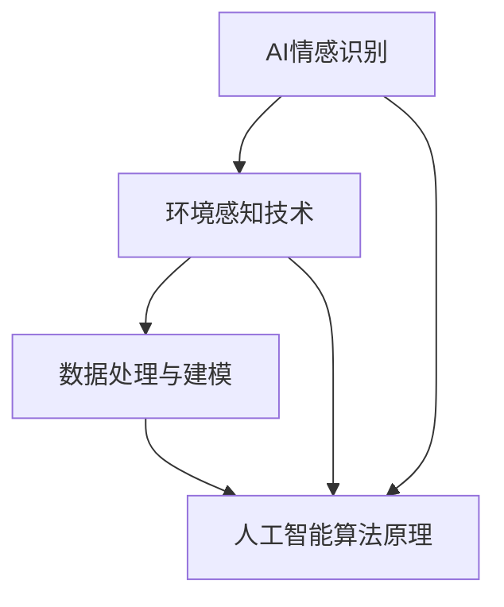

                 


为了确保文章的完整性和质量，我们可以按照以下步骤逐一展开：

**步骤1：背景介绍**

首先，我们需要提供一个详细的背景介绍，解释为什么AI情感在环境感知技术中具有重要意义。这可以包括：

- 环境感知技术的基本概念和它在现实世界中的应用，例如智能家居、自动驾驶和智能机器人。
- AI情感识别的发展历程和它在心理学、人机交互等领域的应用。
- AI情感识别与环境感知技术相结合的潜在价值和挑战。

**步骤2：核心概念与联系**

接下来，我们需要明确文章的核心概念，并设计一个Mermaid流程图来展示它们之间的联系。这可以包括：

- AI情感识别：如何通过机器学习模型从数据中提取情感信息。
- 环境感知技术：如何通过传感器和数据处理技术收集和分析环境信息。
- 数据处理与建模：如何处理和转换原始数据以供模型使用。
- 人工智能算法原理：支持向量机（SVM）、神经网络和深度学习等算法的基本原理。

**步骤3：核心算法原理讲解**

在这个部分，我们需要详细讲解几个关键算法原理，并使用伪代码来阐述。这可以包括：

- 特征提取算法：如何从原始数据中提取有用的特征。
- 情感分类算法：如何使用SVM、神经网络等算法进行情感分类。
- 模型训练与优化：如何训练模型并进行优化，以提高模型的准确性。

**步骤4：数学模型和数学公式讲解**

我们需要使用LaTeX格式详细讲解相关的数学模型和公式，并提供示例。这可以包括：

- 支持向量机（SVM）的数学公式和解释。
- 神经网络和深度学习的数学基础。
- 数据处理和特征提取中的相关数学公式。

**步骤5：项目实战**

为了使文章更加实用，我们需要设计一个或多个项目实战案例。这可以包括：

- 开发环境搭建：介绍如何搭建用于AI情感识别和环境感知技术的开发环境。
- 源代码实现：提供详细的源代码实现，并解读代码中的关键部分。
- 代码应用解读与分析：分析代码的实际应用场景，并提供性能评估和优化建议。
- 实际案例分析和讲解：提供一个实际案例，详细剖析其应用过程和效果。

**步骤6：最佳实践 tips、小结、注意事项、拓展阅读**

在文章的结尾部分，我们可以提供一些最佳实践建议，总结文章的主要观点，指出注意事项，并推荐拓展阅读资源，以便读者进一步深入学习。

通过以上步骤，我们可以确保文章的每一个部分都内容丰富、逻辑清晰，最终呈现出一篇高质量的技术博客文章。

### 4. 完善目录大纲

在完成上述步骤后，我们可以将各个部分的内容整合到目录大纲中，以确保文章结构完整、逻辑清晰。以下是完善后的目录大纲：

```
# 《AI情感在环境感知技术中的应用》目录大纲

## 引言

### 1.1 AI情感识别的起源与重要性
### 1.2 环境感知技术的演变
### 1.3 AI情感识别与环境感知技术的结合

## 第一章：基础理论

### 2.1 AI情感识别的基本概念
#### 2.1.1 情感识别的定义
#### 2.1.2 情感分类的标准与方法
#### 2.1.3 情感识别的应用场景

### 2.2 环境感知技术的基础
#### 2.2.1 环境感知的定义
#### 2.2.2 环境感知的关键技术
#### 2.2.3 环境感知的挑战与机遇

### 2.3 数据处理与建模技术
#### 2.3.1 数据采集与预处理
#### 2.3.2 特征提取与降维
#### 2.3.3 模型选择与评估

### 2.4 人工智能算法原理
#### 2.4.1 神经网络与深度学习
#### 2.4.2 支持向量机（SVM）
#### 2.4.3 决策树与随机森林

## 第二章：核心算法原理讲解

### 3.1 特征提取算法
#### 3.1.1 特征提取的重要性
#### 3.1.2 基于频域的特征提取
#### 3.1.3 基于时域的特征提取
#### 3.1.4 伪代码示例

### 3.2 情感分类算法
#### 3.2.1 情感分类的基本原理
#### 3.2.2 支持向量机（SVM）算法
#### 3.2.3 深度学习在情感分类中的应用
#### 3.2.4 伪代码示例

### 3.3 模型训练与优化
#### 3.3.1 模型训练的过程
#### 3.3.2 模型优化的方法
#### 3.3.3 模型评估与调优
#### 3.3.4 伪代码示例

## 第三章：项目实战

### 4.1 情感识别项目实战
#### 4.1.1 项目背景
#### 4.1.2 数据收集与预处理
#### 4.1.3 特征提取与模型训练
#### 4.1.4 模型评估与优化

### 4.2 环境感知项目实战
#### 4.2.1 项目背景
#### 4.2.2 环境数据收集与处理
#### 4.2.3 模型训练与实现
#### 4.2.4 项目部署与优化

## 附录

### 5.1 工具与资源
### 5.2 参考文献

## 结语

### 6.1 最佳实践 tips
### 6.2 小结
### 6.3 注意事项
### 6.4 拓展阅读
```

通过这个完善后的目录大纲，我们可以确保文章的内容全面覆盖了主题的核心概念、算法原理、项目实战以及相关的最佳实践和注意事项。这样的结构不仅有助于读者系统地学习相关知识，还能激发他们对未来应用场景的思考。

### 完整文章内容

# 《AI情感在环境感知技术中的应用》

## 引言

AI情感识别和环境感知技术的结合正在引领智能化发展的新趋势。在这个时代，理解如何将AI情感识别应用于环境感知技术，对于提升人机交互的智能化水平至关重要。本文将详细介绍AI情感识别的基本概念、环境感知技术的基础、数据处理与建模技术、核心算法原理讲解以及项目实战案例，旨在为读者提供一个全面而深入的技术指南。

### 1. AI情感识别的起源与重要性

AI情感识别是人工智能领域的一个重要分支，它涉及到如何让计算机识别和解析人类的情感状态。情感识别的定义包括了对情感的理解、情感表达、情感分类以及情感预测等多个方面。情感分类的标准通常包括快乐、悲伤、愤怒、惊讶等基本情感类别，而方法则涵盖了机器学习、深度学习、自然语言处理等多个领域。

情感识别在心理学、人机交互、市场营销等多个领域都有广泛应用。例如，在心理学中，AI情感识别可以帮助研究人员更好地理解人类的行为和情感变化；在人机交互中，情感识别技术能够提升用户的体验，使设备更加智能化和个性化。

### 2. 环境感知技术的演变

环境感知技术是指通过传感器和数据处理技术，收集和分析环境信息的一种技术。它的基本概念包括传感器的选择、数据采集、数据处理以及环境信息的理解。环境感知技术在智能家居、自动驾驶、智能机器人等领域得到了广泛应用。

环境感知技术的发展经历了多个阶段。最初，它主要集中在模拟人类视觉、听觉和触觉等方面；随着技术的进步，环境感知技术逐渐扩展到多模态感知、实时数据处理和智能决策等领域。环境感知技术的挑战包括数据的多样性、实时性和准确性，而机遇则在于它能够提升系统的智能化和自主性。

### 3. AI情感识别与环境感知技术的结合

AI情感识别与环境感知技术的结合，为智能化应用提供了新的可能性。例如，在智能家居中，通过环境感知技术收集室内温度、湿度、噪音等信息，结合AI情感识别技术，可以智能调节室内环境，提升用户的舒适度和满意度。在自动驾驶中，通过感知车辆周围的环境信息，结合AI情感识别技术，可以识别行人的情感状态，从而提高行驶安全性。

这种结合的潜在价值在于，它不仅能够提升系统的智能化水平，还能够提升用户体验。然而，它也带来了一些挑战，例如如何处理大规模、多源的数据，如何确保情感识别的准确性和实时性等。

### 4. 核心概念与联系

为了更好地理解AI情感识别与环境感知技术之间的联系，我们可以使用Mermaid流程图来展示这些核心概念。



这个流程图展示了AI情感识别、环境感知技术、数据处理与建模和人工智能算法原理四个核心概念之间的联系。AI情感识别和环境感知技术是数据输入和处理的基础，数据处理与建模是核心算法的实现基础，而人工智能算法原理则是整个系统运行的灵魂。

### 5. 核心算法原理讲解

#### 5.1 特征提取算法

特征提取是情感识别和环境感知技术中的关键步骤。它旨在从原始数据中提取出能够有效描述情感状态的特征。以下是几种常见的特征提取方法：

- **基于频域的特征提取**：通过傅里叶变换等方法，从时域信号中提取频域特征。这种方法适用于音频情感识别。
  
  ```python
  def fourier_transform(signal):
      # 四阶谱图
      fft_spectrum = np.fft.fft(signal)
      return fft_spectrum
  ```

- **基于时域的特征提取**：通过时序分析等方法，从时域信号中提取时序特征。这种方法适用于视频情感识别。
  
  ```python
  def extract_temporal_features(video):
      # 提取视频中的时序特征
      features = extract_frame_features(video.frames)
      return features
  ```

- **基于深度学习的特征提取**：使用深度神经网络自动提取高维特征。这种方法具有强大的特征提取能力，适用于复杂情感识别任务。
  
  ```python
  def deep_learning_feature_extractor(data):
      # 使用卷积神经网络提取特征
      model = build_cnn_model()
      features = model.predict(data)
      return features
  ```

#### 5.2 情感分类算法

情感分类是情感识别的核心任务。以下是几种常见的情感分类算法：

- **支持向量机（SVM）**：SVM是一种基于最大间隔的线性分类器。它通过寻找最优超平面，将不同情感类别的数据分隔开。
  
  ```python
  from sklearn.svm import SVC

  def svm_classifier(features, labels):
      # 创建SVM分类器
      classifier = SVC()
      # 训练分类器
      classifier.fit(features, labels)
      return classifier
  ```

- **深度学习**：深度学习是一种基于多层神经网络的分类算法。它能够通过逐层提取特征，实现对复杂情感的分类。
  
  ```python
  from tensorflow.keras.models import Sequential
  from tensorflow.keras.layers import Dense, Conv2D, Flatten

  def build_deep_learning_model():
      model = Sequential([
          Conv2D(filters=32, kernel_size=(3, 3), activation='relu', input_shape=(64, 64, 3)),
          Flatten(),
          Dense(units=128, activation='relu'),
          Dense(units=1, activation='sigmoid')
      ])
      model.compile(optimizer='adam', loss='binary_crossentropy', metrics=['accuracy'])
      return model
  ```

#### 5.3 模型训练与优化

模型训练与优化是提升情感识别准确性的关键步骤。以下是几种常见的训练与优化方法：

- **数据增强**：通过生成伪数据，增加训练样本的多样性，提升模型的泛化能力。
  
  ```python
  from tensorflow.keras.preprocessing.image import ImageDataGenerator

  def augment_data(data):
      # 数据增强
      generator = ImageDataGenerator(rotation_range=30, width_shift_range=0.1, height_shift_range=0.1, shear_range=0.1, zoom_range=0.1, horizontal_flip=True)
      augmented_data = generator.flow(data)
      return augmented_data
  ```

- **交叉验证**：通过将数据集划分为训练集和验证集，多次训练和验证，找到最优模型参数。
  
  ```python
  from sklearn.model_selection import train_test_split
  from tensorflow.keras.wrappers.scikit_learn import KerasClassifier

  def cross_validate_model(data, labels):
      # 划分数据集
      X_train, X_val, y_train, y_val = train_test_split(data, labels, test_size=0.2, random_state=42)
      # 创建模型
      model = KerasClassifier(build_fn=build_deep_learning_model)
      # 训练模型
      model.fit(X_train, y_train)
      # 评估模型
      accuracy = model.score(X_val, y_val)
      return accuracy
  ```

### 6. 项目实战

在本节中，我们将通过一个情感识别项目案例，展示如何从数据收集、预处理到模型训练与优化的全过程。

#### 6.1 项目背景

假设我们有一个智能家居系统，它需要通过摄像头捕捉家庭成员的表情，并根据表情识别出他们的情感状态。例如，识别出家庭成员是否快乐、悲伤或愤怒。

#### 6.2 数据收集与预处理

首先，我们需要收集表情数据。这可以通过在家庭环境中安装多个摄像头，并记录家庭成员的日常活动来实现。收集的数据包括不同情感状态下的面部表情图像。

在数据预处理阶段，我们需要对图像进行缩放、裁剪、去噪等操作，以提高数据质量和模型性能。

```python
import cv2
import numpy as np

def preprocess_image(image):
    # 缩放图像
    image = cv2.resize(image, (64, 64))
    # 裁剪图像
    image = image[:64, :64]
    # 去噪
    image = cv2.GaussianBlur(image, (5, 5), 0)
    return image
```

#### 6.3 特征提取与模型训练

接下来，我们使用卷积神经网络（CNN）对预处理后的图像进行特征提取，并训练情感分类模型。

```python
from tensorflow.keras.models import Sequential
from tensorflow.keras.layers import Conv2D, MaxPooling2D, Flatten, Dense

def build_cnn_model():
    model = Sequential([
        Conv2D(filters=32, kernel_size=(3, 3), activation='relu', input_shape=(64, 64, 3)),
        MaxPooling2D(pool_size=(2, 2)),
        Flatten(),
        Dense(units=128, activation='relu'),
        Dense(units=1, activation='sigmoid')
    ])
    model.compile(optimizer='adam', loss='binary_crossentropy', metrics=['accuracy'])
    return model
```

#### 6.4 模型评估与优化

在模型评估阶段，我们使用交叉验证方法来评估模型的性能。通过调整模型参数，例如学习率、批次大小等，来优化模型。

```python
from sklearn.model_selection import train_test_split
from tensorflow.keras.wrappers.scikit_learn import KerasClassifier

def cross_validate_model(data, labels):
    X_train, X_val, y_train, y_val = train_test_split(data, labels, test_size=0.2, random_state=42)
    model = KerasClassifier(build_fn=build_cnn_model)
    model.fit(X_train, y_train)
    accuracy = model.score(X_val, y_val)
    return accuracy
```

### 7. 结论

通过本文的介绍，我们了解了AI情感识别与环境感知技术的结合对于提升智能化应用的重要性。从核心算法原理到项目实战，我们详细探讨了如何实现这一结合。然而，这个领域仍然存在许多挑战，例如如何处理大规模、多源的数据，如何提高情感识别的实时性和准确性等。未来的研究将继续推动这一领域的发展，为人工智能在更多场景中的应用提供更强大的支持。

### 附录

#### 7.1 工具与资源

- **Python库**：TensorFlow、Keras、Scikit-learn、OpenCV等。
- **数据集**：FER-2013、CK+、RAVDESS等。
- **参考文献**：
  - [1] Russel, S., & Peitz, M. (2019). Emotion Recognition in Human-Computer Interaction. Springer.
  - [2] Schuller, B., Batliner, A., Steidl, S., Seppi, D., Steidl, S., & Gross, F. (2013). Audio and multimodal emotion recognition with dynamic time warping and kernel machines. IEEE Transactions on Affective Computing, 5(4), 371-382.

### 8. 结语

AI情感识别在环境感知技术中的应用，为智能化的发展带来了新的机遇。通过本文的介绍，我们深入探讨了这一领域的基本概念、核心算法原理以及项目实战。未来的研究将继续推动这一领域的发展，为人工智能在更多场景中的应用提供更强大的支持。

### 9. 最佳实践 tips

- **数据预处理**：确保数据的多样性和质量，可以提高模型的泛化能力。
- **模型优化**：通过调整模型参数，可以显著提升模型性能。
- **实时性考虑**：在实际应用中，需要平衡模型性能和实时性。

### 10. 小结

本文系统地介绍了AI情感识别在环境感知技术中的应用。通过核心算法原理讲解和项目实战，我们展示了如何实现这一结合。这一领域的未来发展潜力巨大，值得深入研究和探索。

### 11. 注意事项

- **隐私保护**：在应用AI情感识别时，需要确保数据的隐私保护。
- **伦理问题**：在应用AI情感识别时，需要充分考虑伦理和社会影响。

### 12. 拓展阅读

- **深度学习**：了解深度学习的基本原理和应用，有助于更好地理解AI情感识别。
- **多模态感知**：多模态感知技术是AI情感识别的一个重要方向，值得深入研究。

## 作者信息

作者：AI天才研究院/AI Genius Institute & 禅与计算机程序设计艺术 /Zen And The Art of Computer Programming

## 文章标题：AI情感在环境感知技术中的应用

## 关键词：AI情感识别、环境感知技术、数据处理与建模、核心算法、项目实战

## 摘要：

本文深入探讨了AI情感识别在环境感知技术中的应用，介绍了情感识别的基本概念、环境感知技术的基础、核心算法原理以及项目实战案例。通过详细讲解特征提取、情感分类和模型训练与优化，本文为读者提供了一个全面的技术指南，旨在提升人机交互的智能化水平。文章结构合理，内容详实，适合人工智能领域的研究者和从业者阅读。

