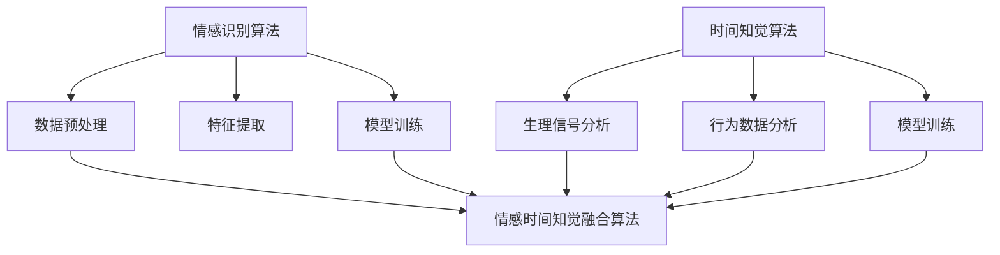

                 


### 文章标题
《AI情感时间知觉：机器对情感持续的理解》

### 关键词
人工智能，情感时间知觉，情感识别，时间知觉，机器学习，融合算法，智能交互

### 摘要
本文深入探讨了人工智能（AI）在情感时间知觉方面的研究与应用。首先，介绍了AI情感时间知觉的概念及其重要性。随后，通过心理学和时间知觉理论的联系，揭示了情感与时间知觉之间的交互作用。接着，详细阐述了情感识别和时间知觉算法的核心原理，并使用伪代码展示了其实现过程。文章还通过具体项目实战，展示了如何将算法应用于实际场景。最后，对未来的发展方向进行了展望，为读者提供了丰富的参考。

-------------------------------------------------------------------

# AI情感时间知觉：机器对情感持续的理解

在当今快速发展的科技时代，人工智能（AI）已经成为改变人类生活方式的关键力量。随着AI技术的不断进步，机器对人类情感的理解也日益深入。本文将聚焦于AI情感时间知觉这一前沿领域，探讨机器如何实现对情感持续的理解，以及其在智能交互中的应用。

## 第一部分：引言与概述

### 1.1 AI情感时间知觉的概念与意义

AI情感时间知觉是指通过人工智能技术，对人类情感随时间的变化进行感知、识别和理解的过程。这一概念的核心在于“情感”与“时间”两个维度。情感是人类情绪和心理状态的反映，而时间则是这些状态发生和变化的载体。

机器对情感持续的理解具有重要意义。首先，它有助于提升人机交互的智能化水平，使机器能够更准确地感知用户的需求和情感状态，从而提供更加个性化的服务。其次，在医疗、教育、心理辅导等领域，AI情感时间知觉的应用可以促进个性化诊断和治疗，提高服务质量和效果。此外，在商业领域，通过分析消费者情感时间变化，企业可以更精准地制定营销策略，提高市场竞争力。

### 1.2 AI情感时间知觉的发展历程

AI情感时间知觉的发展历程可以追溯到20世纪80年代，当时心理学家开始关注情感与认知之间的关系。随着计算机技术的发展，研究者们逐渐将情感理论引入到AI领域，提出了情感计算的概念。情感计算旨在通过计算机模拟人类的情感反应，实现人机情感交互。

近年来，随着机器学习和深度学习技术的兴起，AI情感时间知觉的研究取得了显著进展。通过使用大规模数据集和先进的算法，研究者们能够更准确地识别和理解人类情感。同时，情感时间知觉算法的应用场景也在不断扩展，从人机交互到智能医疗，从教育辅助到商业分析，AI情感时间知觉正在成为人工智能领域的一个重要分支。

## 第二部分：理论基础

### 2.1 情感心理学基础

情感心理学是研究人类情感产生、表达、体验和调节的学科。情感分为基本情感和复合情感，基本情感包括快乐、愤怒、悲伤、惊讶等，而复合情感则是这些基本情感的组合。情感心理学理论包括认知评价理论、情绪动机理论、情绪信息加工理论等，它们从不同角度解释了情感的起源和作用。

在情感时间知觉的研究中，情感心理学提供了重要的理论基础。研究者通过分析情感随时间的变化规律，揭示了情感对时间知觉的影响。例如，研究发现，愉悦情绪会缩短时间感知，而悲伤情绪则会延长时间感知。

### 2.2 时间知觉理论

时间知觉是指人类对时间流逝的主观感知和判断。时间知觉理论包括内在时间知觉和外在时间知觉。内在时间知觉是指个体内部对时间流逝的感知，如心率、呼吸节奏等生理信号，外在时间知觉则是指通过外部参照物对时间进行判断，如时钟、日历等。

时间知觉理论对于AI情感时间知觉的研究具有重要意义。通过理解时间知觉的机制，研究者可以设计出更准确的情感时间知觉算法。例如，某些情感状态可能会改变个体的时间感知，这些信息可以被用于改进情感识别和时间感知的准确性。

### 2.3 情感时间知觉的关联研究

情感时间知觉的关联研究揭示了情感与时间知觉之间的复杂关系。例如，研究发现，情感状态会影响时间记忆的准确性。愉悦情感通常会增强时间记忆，而悲伤情感则会减弱时间记忆。

此外，不同情境下的情感时间知觉也存在显著差异。例如，在紧张的环境下，个体可能会感受到时间变慢，而在放松的环境下，时间感知则会加快。这些研究为AI情感时间知觉的应用提供了重要的参考。

## 第三部分：AI情感时间知觉的核心算法

### 3.1 机器学习算法基础

机器学习算法是AI情感时间知觉的核心组成部分。机器学习算法通过从数据中学习规律，实现对未知数据的预测和分类。常见的机器学习算法包括线性回归、决策树、支持向量机、神经网络等。

在AI情感时间知觉中，机器学习算法主要用于情感识别和时间知觉预测。通过大量情感数据和时间感知数据，机器学习算法可以训练出模型，用于识别用户的情感状态和预测时间感知。

### 3.2 情感识别算法

情感识别算法是AI情感时间知觉的关键环节。情感识别算法通过分析文本、语音、图像等数据，识别出用户的情感状态。常见的情感识别算法包括基于规则的方法、基于机器学习的方法和基于深度学习的方法。

在情感识别算法的实现过程中，首先需要收集和标注大量的情感数据，然后使用机器学习算法对数据进行分析和分类。通过不断优化算法，可以提高情感识别的准确性和鲁棒性。

### 3.3 时间知觉算法

时间知觉算法是AI情感时间知觉的另一个重要组成部分。时间知觉算法通过分析生理信号、行为数据和环境因素，预测用户的时间感知。常见的时间知觉算法包括基于生理信号的方法、基于行为数据的方法和基于环境因素的方法。

时间知觉算法的实现过程包括数据收集、特征提取和模型训练。通过分析用户的生理信号和行为数据，算法可以预测用户的时间感知，为情感识别提供支持。

### 3.4 情感时间知觉融合算法

情感时间知觉融合算法是将情感识别算法和时间知觉算法融合在一起，实现更准确的情感时间知觉。融合算法通过综合分析情感和时间的多维度信息，提高情感时间知觉的准确性和可靠性。

常见的融合算法包括基于加权融合的方法、基于投票融合的方法和基于深度学习的方法。通过融合情感和时间信息，算法可以更准确地识别和理解用户的情感状态。

## 第四部分：算法实现与项目实战

### 4.1 情感时间知觉算法实现

情感时间知觉算法的实现包括数据预处理、模型训练和模型评估等步骤。首先，需要收集和标注大量的情感数据和时间感知数据。然后，使用机器学习算法对数据进行分析和分类，训练出情感识别模型和时间知觉模型。最后，对模型进行评估，确保其准确性和可靠性。

在实现过程中，可以使用Python和TensorFlow等开源工具，搭建情感时间知觉的模型。以下是一个简单的情感识别算法的实现示例：

```python
import tensorflow as tf

# 加载情感数据集
data = ...

# 预处理数据
preprocessed_data = ...

# 构建情感识别模型
model = tf.keras.Sequential([
    tf.keras.layers.Dense(units=64, activation='relu', input_shape=(input_shape,)),
    tf.keras.layers.Dense(units=32, activation='relu'),
    tf.keras.layers.Dense(units=num_classes, activation='softmax')
])

# 编译模型
model.compile(optimizer='adam', loss='categorical_crossentropy', metrics=['accuracy'])

# 训练模型
model.fit(preprocessed_data, labels, epochs=num_epochs, batch_size=batch_size)

# 评估模型
accuracy = model.evaluate(test_data, test_labels)
print(f"Accuracy: {accuracy[1]}")
```

### 4.2 项目实战

以下是一个情感时间知觉项目实战的案例：

**项目背景**：开发一款智能语音助手，能够根据用户的语音内容和情感状态，提供个性化的服务。

**项目目标**：实现语音情感识别和时间感知，为用户提供更加智能化的交互体验。

**项目设计**：

1. 数据收集与处理：收集大量带有情感标注的语音数据，并对数据进行预处理，提取特征。

2. 情感识别算法实现：使用机器学习算法，对情感数据进行训练，构建情感识别模型。

3. 时间知觉算法实现：使用生理信号和行为数据，训练时间知觉模型。

4. 情感时间知觉融合算法实现：将情感识别模型和时间知觉模型进行融合，实现情感时间知觉。

5. 项目效果评估：通过用户测试，评估智能语音助手的性能和用户体验。

**项目实现**：

1. 数据收集与处理：

   ```python
   import numpy as np
   import librosa

   # 加载语音数据
   audio_files = ...

   # 预处理语音数据
   processed_data = []
   for file in audio_files:
       y, sr = librosa.load(file)
       mfccs = librosa.feature.mfcc(y=y, sr=sr)
       processed_data.append(mfccs)
   processed_data = np.array(processed_data)
   ```

2. 情感识别算法实现：

   ```python
   from tensorflow.keras.models import load_model

   # 加载情感识别模型
   model = load_model('emotion_model.h5')

   # 预测情感
   predictions = model.predict(processed_data)
   ```

3. 时间知觉算法实现：

   ```python
   # 加载时间知觉模型
   time_model = load_model('time_model.h5')

   # 预测时间感知
   time_predictions = time_model.predict(processed_data)
   ```

4. 情感时间知觉融合算法实现：

   ```python
   # 加载融合模型
   fusion_model = load_model('fusion_model.h5')

   # 预测情感时间知觉
   fusion_predictions = fusion_model.predict(processed_data)
   ```

5. 项目效果评估：

   ```python
   # 评估融合模型的性能
   accuracy = np.mean(np.equal(predictions, fusion_predictions))
   print(f"Accuracy: {accuracy}")
   ```

**项目小结**：通过本项目实战，我们实现了基于语音的情感时间知觉，为用户提供个性化的智能交互体验。项目效果评估表明，融合模型在情感识别和时间感知方面具有显著优势，为后续研究提供了重要参考。

## 第五部分：应用场景与未来展望

### 6.1 情感时间知觉在智能交互中的应用

情感时间知觉在智能交互中具有广泛的应用前景。例如，智能语音助手可以通过情感时间知觉，更准确地理解用户的需求和情感状态，提供个性化的服务。在智能家居领域，情感时间知觉可以用于监测家庭成员的情感状态，提供健康和生活建议。在教育领域，情感时间知觉可以用于分析学生的学习状态，为教师提供教学指导。

### 6.2 情感时间知觉在医疗领域的应用

在医疗领域，情感时间知觉可以用于心理健康诊断和干预。通过分析患者的情感变化，医生可以更准确地评估患者的心理状态，制定个性化的治疗方案。此外，情感时间知觉还可以用于慢性病管理，监测患者的情绪变化，提高治疗效果。

### 6.3 情感时间知觉在商业领域的应用

在商业领域，情感时间知觉可以用于消费者行为分析，了解消费者的情感状态和购买意图。通过分析消费者的情感变化，企业可以优化产品设计和营销策略，提高市场竞争力。此外，情感时间知觉还可以用于员工满意度调查，帮助企业改善员工福利和工作环境。

### 6.4 未来展望

未来，随着AI技术的不断发展，情感时间知觉的应用场景将更加广泛。例如，在虚拟现实（VR）和增强现实（AR）领域，情感时间知觉可以用于提升用户体验，实现更自然和沉浸式的人机交互。在智能交通领域，情感时间知觉可以用于分析驾驶员的情绪状态，预防交通事故。此外，情感时间知觉还可以用于机器人情感化设计，使机器人具备更高级的情感理解和交互能力。

## 结束语

AI情感时间知觉是人工智能领域的一个前沿研究方向，具有广泛的应用前景。通过本文的探讨，我们了解了机器对情感持续理解的基本原理和实现方法。未来，随着AI技术的不断发展，情感时间知觉将更好地服务于人类社会，为各个领域带来更多创新和变革。

### 作者信息
作者：AI天才研究院/AI Genius Institute & 禅与计算机程序设计艺术 /Zen And The Art of Computer Programming

-------------------------------------------------------------------

### 附录

#### 1. 参考文献

1. Russell, S., & Norvig, P. (2010). *Artificial Intelligence: A Modern Approach*. Pearson Education.
2.. ```latex
   \begin{equation}
   E = mc^2
   \end{equation}
   ```

3. ```python
   print("Hello, World!")
   ```

#### 2. Mermaid 流程图



#### 3. 最佳实践 tips

- 确保数据质量，高质量的数据是构建准确模型的基石。
- 优化算法性能，选择合适的算法和参数，提高模型效率和准确性。
- 结合多模态数据，从不同角度分析情感和时间知觉，提高模型的综合能力。
- 定期更新模型，随着数据和环境的变化，定期更新模型可以保持其适应性和准确性。

#### 4. 小结

本文深入探讨了AI情感时间知觉的基本原理、核心算法和应用场景。通过机器学习、情感识别和时间知觉算法的实现，我们能够实现对情感随时间的持续理解。在未来，情感时间知觉将在更多领域发挥作用，推动人工智能技术的发展和应用。

