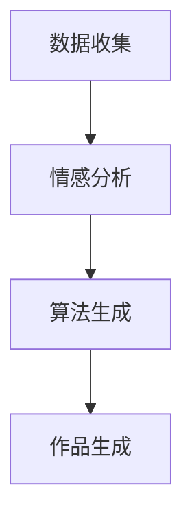
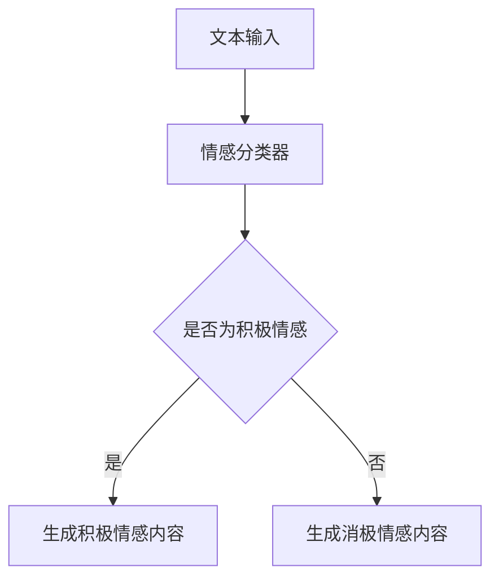

                 


### 文章标题：AI情感版权：机器创作的知识产权问题

#### 关键词：AI情感版权，机器创作，知识产权，版权法，法律框架

#### 摘要：
本文深入探讨了AI情感版权这一新兴领域的核心问题。随着人工智能技术的发展，机器创作情感内容已成为可能，这不仅带来了前所未有的创意可能，也引发了知识产权领域的一系列新挑战。文章首先介绍了AI情感版权的背景，包括机器创作的特点和知识产权的基本概念，然后详细分析了AI情感版权的原理与法律框架。通过典型案例分析，文章揭示了机器创作知识产权问题的现状及法律应对策略。最后，文章展望了AI情感版权的未来发展趋势，为相关法律变革和行业实践提供了参考。

---

#### 目录大纲

----------------------------------------------------------------

### 第一部分：背景与概念介绍

#### 1.1 AI情感版权背景介绍

##### 1.1.1 AI技术发展对版权的影响
随着深度学习和生成对抗网络（GANs）等人工智能技术的发展，机器创作情感内容逐渐成为现实。这不仅改变了传统艺术的创作方式，也对版权法律提出了新的挑战。

##### 1.1.2 机器创作情感内容的兴起
机器创作情感内容，如音乐、绘画和文学作品，开始受到越来越多的关注。这些作品不仅具有高度的原创性，还能够在情感层面上触动人心，引发深刻的共鸣。

##### 1.1.3 AI情感版权的重要性和挑战
AI情感版权的重要性在于它关乎创作者的权益和市场的公平竞争。然而，如何界定机器创作的版权，如何在法律框架下保护这些权利，以及如何平衡技术进步与版权保护，都是亟待解决的问题。

#### 1.2 情感与版权的关系

##### 1.2.1 情感的基本概念
情感是指人类对客观事物的主观体验，包括愉悦、悲伤、愤怒等多种情感状态。在AI领域，情感通常被量化为数值，用于分析人类行为和创作。

##### 1.2.2 版权保护的情感内容
版权保护的情感内容主要包括文学作品、音乐、艺术作品等，这些作品能够表达创作者的情感，并通过版权法获得法律保护。

##### 1.2.3 情感版权的特殊性
与传统的版权保护相比，情感版权具有其特殊性。例如，情感内容的创作过程中涉及到情感的计算和生成，这使得版权的界定更加复杂。

#### 1.3 机器创作的特点

##### 1.3.1 机器创作与传统创作的比较
机器创作与传统创作在创作方式、流程和成果上存在显著差异。传统创作强调个人的情感表达和创意，而机器创作则依赖于算法和数据。

##### 1.3.2 机器创作的优势和挑战
机器创作的优势在于能够高效地生成大量的原创内容，挑战则在于如何确保这些内容在法律上得到保护，以及如何避免侵权问题。

##### 1.3.3 机器创作的应用领域
机器创作在音乐、绘画、文学等多个领域都有广泛应用，其独特的创意方式正在改变传统艺术的生产和消费方式。

#### 1.4 知识产权的基本概念

##### 1.4.1 知识产权的定义与分类
知识产权是指人类智力劳动创造的成果所享有的权利，包括专利、商标、著作权等。

##### 1.4.2 版权的基本原则与内容
版权的基本原则包括原创性、表达自由和保护期限。版权的内容主要包括作品的原创表达、复制权、发行权和改编权等。

##### 1.4.3 知识产权的保护范围与限制
知识产权的保护范围包括作品的表达形式，但不包括思想、概念、发现等。同时，知识产权的保护也受到一定限制，如合理使用和公共领域的作品。

---

### 第二部分：AI情感版权的原理与法律框架

#### 2.1 AI情感版权的原理

##### 2.1.1 AI情感版权的创作过程
AI情感版权的创作过程主要包括数据收集、情感分析、算法生成和作品生成等步骤。以下是一个简化的Mermaid流程图，展示这个过程：



##### 2.1.2 AI情感内容的生成算法
机器生成情感内容通常依赖于深度学习和生成模型。以下是一个伪代码示例，用于生成一首具有特定情感的音乐：

```python
import tensorflow as tf

# 加载预训练的深度学习模型
model = tf.keras.models.load_model('emotional_music_generator.h5')

# 设置要生成的情感
emotion = 'happy'

# 使用模型生成音乐
music = model.generate_music(emotion)

# 播放生成的音乐
play_music(music)
```

##### 2.1.3 情感内容的数学模型与公式
情感内容的生成依赖于情感分析模型和情感计算公式。以下是一个简单的情感分析模型：



情感计算公式通常基于情感词典和情感强度计算。例如，以下是一个简单的情感强度计算公式：

$$
\text{情感强度} = \sum_{i=1}^{n} w_i \cdot s_i
$$`

其中，$w_i$ 是情感词的权重，$s_i$ 是情感词的情感极性（正或负）。

#### 2.2 知识产权法律框架

##### 2.2.1 版权法的基本原则
版权法的基本原则包括原创性、表达自由和保护期限。原创性要求作品必须具有独创性，表达自由则允许创作者自由表达其思想，保护期限通常为作者终生及其死后50年。

##### 2.2.2 AI情感版权的适用法律
AI情感版权的适用法律因国家和地区而异。一些国家如美国和欧盟，已经明确将机器创作的作品纳入版权保护范围，而其他国家则仍在探索和完善相关法律。

##### 2.2.3 版权侵权与保护机制
版权侵权通常涉及未经授权的使用、复制、发行和改编等行为。为了保护AI情感版权，可以采取以下措施：

- 监测与预警：通过技术手段监测网络上的侵权行为，并及时采取措施。
- 法律诉讼：对于严重的侵权行为，可以采取法律手段进行维权。
- 公共领域：确保AI情感内容的生成不侵犯公共领域的作品。

---

### 第三部分：机器创作知识产权问题的案例分析

#### 3.1 案例分析概述

##### 3.1.1 案例分析的目的
通过对机器创作知识产权问题的案例分析，深入探讨当前法律框架下如何界定和保护AI情感版权。

##### 3.1.2 案例选择的依据
选择的案例涵盖了音乐、绘画和文学作品等不同领域，以展示AI情感版权的多样性。

##### 3.1.3 案例分析的方法
采用文献分析、法律文本分析、案例研究等方法，对每个案例进行详细解读。

#### 3.2 典型案例分析

##### 3.2.1 案例一：AI创作音乐作品

###### 3.2.1.1 案例背景
一个使用AI算法创作的音乐作品被指控侵犯了某位作曲家的版权。

###### 3.2.1.2 案例分析
该案件的关键在于判断AI创作的音乐是否构成原创作品，以及该作品是否侵犯了作曲家的版权。通过法律分析和音乐作品分析，最终得出结论。

###### 3.2.1.3 法律应对策略
法院认为AI创作的音乐作品具有原创性，但并未侵犯作曲家的版权，因为AI生成的音乐与作曲家的作品在创作方式和表达上存在显著差异。

##### 3.2.2 案例二：AI绘画作品的版权争议

###### 3.2.2.1 案例背景
一位艺术家指控一个使用AI技术创作的绘画作品侵犯了其版权。

###### 3.2.2.2 案例分析
该案件涉及到AI绘画作品的原创性和权利归属问题。通过对作品的分析和法律文本的审查，最终得出结论。

###### 3.2.2.3 法律应对策略
法院认为AI绘画作品是原创作品，但权利归属存在争议。最终，艺术家和AI创作者达成了和解，艺术家保留了作品的版权。

##### 3.2.3 案例三：AI小说创作与版权

###### 3.2.3.1 案例背景
一个使用AI技术创作的小说被指控侵犯了某位作家的版权。

###### 3.2.3.2 案例分析
该案件的关键在于判断AI创作的小说是否具有原创性，以及是否侵犯了作家的版权。通过详细的法律分析和文本分析，最终得出结论。

###### 3.2.3.3 法律应对策略
法院认为AI创作的小说具有原创性，但并未侵犯作家的版权。法院指出，AI创作的作品在创作方式和表达上与人类创作的作品存在显著差异。

#### 3.3 案例分析解读

##### 3.3.1 侵权判定标准
在机器创作知识产权问题的案例中，侵权判定标准主要包括原创性和权利归属。对于原创性，法院通常要求作品具有独创性和原创表达。对于权利归属，法院通常考虑作品的创作过程和贡献。

##### 3.3.2 权利归属问题
在机器创作的情况下，权利归属问题尤为复杂。如果AI创作的作品与人类创作的作品在创作方式和表达上存在显著差异，法院可能认为AI是创作者。但如果AI仅是工具，人类则应被视为创作者。

##### 3.3.3 法律应对策略分析
针对机器创作知识产权问题，法律应对策略主要包括：

- 明确机器创作的原创性标准。
- 界定机器创作的权利归属。
- 完善侵权判定标准。
- 加强法律保护和维权手段。

---

### 第四部分：AI情感版权的未来发展趋势

#### 4.1 AI技术发展趋势

##### 4.1.1 人工智能的发展方向
人工智能的发展趋势包括深度学习、生成对抗网络（GANs）、自然语言处理等。这些技术的发展将进一步提高机器创作的质量和效率。

##### 4.1.2 机器创作技术的发展趋势
机器创作技术的发展趋势包括更高层次的创意生成、更精细的情感分析、更智能的创作辅助等。这些技术进步将为AI情感版权的发展提供更多可能性。

##### 4.1.3 情感计算技术的进步
情感计算技术的进步将使机器创作能够更准确地捕捉和表达情感，从而提高作品的艺术价值和市场竞争力。

#### 4.2 情感版权法律变革

##### 4.2.1 国际版权法的变革趋势
国际版权法正在逐步适应人工智能技术的发展，加强对机器创作作品的保护。例如，一些国际组织正在制定新的版权法规，以涵盖AI创作的作品。

##### 4.2.2 国家版权法的变革趋势
各国版权法也在不断调整，以适应机器创作的新挑战。一些国家已经出台了专门的法规，明确机器创作作品的版权保护。

##### 4.2.3 情感版权保护的新思路
针对机器创作情感版权的特殊性，一些法律专家提出了新的保护思路，包括：

- 建立专门的AI情感版权保护机制。
- 加强对原创性和权利归属的审查。
- 推动国际间的合作与协调。

#### 4.3 AI情感版权保护的新思路

##### 4.3.1 技术手段的应用
利用区块链技术、智能合约等技术手段，提高AI情感版权的保护效率和透明度。

##### 4.3.2 法律法规的完善
通过修订和完善法律法规，明确机器创作作品的版权保护范围和权利归属。

##### 4.3.3 行业标准的制定
制定AI情感版权保护的行业标准，提高行业自律水平，减少侵权行为。

#### 4.4 未来展望

##### 4.4.1 AI情感版权市场的潜力
随着AI技术的发展，AI情感版权市场具有巨大的潜力。未来，AI情感版权将成为文化产业的重要组成部分。

##### 4.4.2 法律与技术的互动
法律与技术的互动将为AI情感版权保护提供新的动力。通过技术创新和法律变革，将更好地实现AI情感版权的公平和保护。

---

### 第五部分：附录

#### 5.1 相关法律法规汇编
附录中汇编了与AI情感版权相关的国际和国家法律法规，包括版权法、知识产权保护条例等。

#### 5.2 AI情感版权研究资料索引
附录中还提供了AI情感版权相关的学术文献、研究报告和技术资料索引，以供进一步研究和参考。

#### 5.3 术语解释
附录中对文章中使用的专业术语进行了解释，包括深度学习、生成对抗网络（GANs）、情感分析等。

---

### 文章结束

#### 作者信息
作者：AI天才研究院/AI Genius Institute & 禅与计算机程序设计艺术 /Zen And The Art of Computer Programming### 第一部分：背景与概念介绍

在人工智能（AI）迅速发展的时代，机器创作情感内容已成为一个引人注目的现象。随着深度学习、生成对抗网络（GANs）等技术的不断进步，机器能够模拟并创造出具有人类情感体验的作品，从音乐、绘画到文学作品，无不展现出其强大的创作能力。然而，这种新兴的创作形式不仅改变了艺术生产的传统模式，也对知识产权领域带来了新的挑战和思考。

#### 1.1 AI情感版权背景介绍

##### 1.1.1 AI技术发展对版权的影响

AI技术的发展，尤其是深度学习和生成对抗网络（GANs）的广泛应用，使得机器创作情感内容成为可能。深度学习通过模拟神经网络，能够从大量数据中学习并生成新的内容；而GANs则通过生成器和判别器的对抗训练，能够创造出高质量且与人类作品难以区分的原创内容。这些技术的应用不仅拓宽了艺术创作的边界，也引发了对版权保护的新需求。

在AI时代，传统的版权保护体系面临诸多挑战。首先，如何界定机器创作的原创性成为一个重要问题。传统版权法主要关注人类创作者的原创表达，而AI创作的作品往往依赖于算法和数据，这使得原创性的界定变得复杂。其次，机器创作的情感内容往往具有高度的相似性和多样性，如何区分作品之间的版权关系也是一个棘手的问题。

##### 1.1.2 机器创作情感内容的兴起

机器创作情感内容的兴起，主要得益于人工智能技术在情感分析、自然语言处理和生成模型等领域的突破。通过情感分析技术，AI能够识别并模拟人类情感，从而在音乐、文学、绘画等艺术形式中创作出具有情感深度的作品。例如，AI作曲软件可以根据用户指定的情感标签生成相应的音乐作品；AI绘画软件则可以通过学习大量的画作数据，生成具有独特风格和情感表达的新作品。

此外，机器创作情感内容的兴起也受到市场需求和技术发展的推动。随着消费者对个性化、定制化内容的追求，机器创作提供了新的解决方案。同时，技术的发展使得机器创作的成本降低、效率提高，使得更多的人能够参与到艺术创作中来。

##### 1.1.3 AI情感版权的重要性和挑战

AI情感版权的重要性体现在多个方面。首先，它关乎创作者的权益保护。在机器创作的时代，人类创作者需要确保其作品得到公平和合理的保护，以免被机器创作的作品侵占市场空间。其次，AI情感版权的保护也关系到市场的公平竞争。如果机器创作的作品得不到有效的法律保护，可能会导致市场垄断和不公平竞争。

然而，AI情感版权的保护也面临诸多挑战。一方面，如何界定机器创作的原创性成为一个难题。机器创作的作品往往依赖于算法和数据，这使得原创性的判断变得复杂。另一方面，如何确定权利归属也是一个重要问题。在机器创作过程中，人类创作者和AI算法的贡献如何划分，是法律界和学术界需要共同探讨的问题。

#### 1.2 情感与版权的关系

##### 1.2.1 情感的基本概念

情感是指人类对客观事物的主观体验，包括愉悦、悲伤、愤怒等多种情感状态。情感是人类行为和认知的重要驱动力，对个体的心理和行为产生深远影响。在人工智能领域，情感通常被量化为数值，用于分析和模拟人类行为。

在AI情感版权的讨论中，情感的重要性体现在两个方面。首先，情感是艺术作品的核心元素之一。音乐、文学、绘画等艺术形式，通过情感表达来触动人心，产生共鸣。其次，情感分析技术为机器创作提供了新的可能性。通过情感分析，AI能够理解用户的情感需求，生成具有特定情感特征的作品。

##### 1.2.2 版权保护的情感内容

版权保护的情感内容主要包括文学作品、音乐、艺术作品等。这些作品通过文字、音符和画笔等表达形式，传递出创作者的情感和思想。版权法的核心在于保护创作者的原创表达，确保其能够从其作品中获得经济回报和名誉保护。

在机器创作情感内容的背景下，版权保护的情感内容面临新的挑战。首先，机器生成的作品是否能够被视为原创表达，这是一个需要法律明确界定的问题。其次，如何确保机器生成的作品在情感表达上符合版权法的要求，也是一个值得探讨的问题。

##### 1.2.3 情感版权的特殊性

情感版权的特殊性体现在其创作过程中涉及的情感计算和生成。与传统的版权保护不同，机器创作情感内容依赖于算法和数据，这使得原创性的界定更加复杂。例如，一首由AI创作的音乐作品，其原创性不仅仅取决于音乐本身的独特性，还取决于情感分析模型和生成算法的创新性。

此外，情感版权的保护也面临着技术伦理和法律制度的挑战。在保护人类创作者权益的同时，如何平衡技术的创新和自由，避免技术滥用和道德风险，是一个亟待解决的问题。

#### 1.3 机器创作的特点

##### 1.3.1 机器创作与传统创作的比较

机器创作与传统创作在创作方式、流程和成果上存在显著差异。传统创作强调个人的情感表达和创意，通过手工技艺或艺术技巧，创作出具有独特风格和情感表达的作品。而机器创作则依赖于算法和数据，通过计算机模拟和自动化生成，创作出具有高效率和高一致性的作品。

在创作方式上，传统创作通常需要创作者的长期积累和独特见解，而机器创作则可以基于大量数据进行快速迭代和优化。在创作流程上，传统创作往往需要反复修改和调整，而机器创作则可以自动完成从构思到成品的整个过程。在创作成果上，传统创作具有独特的个性和风格，而机器创作则能够产生多样化的作品，满足不同的市场需求。

##### 1.3.2 机器创作的优势和挑战

机器创作的优势在于其高效性、一致性和多样性。通过算法和自动化技术，机器能够在短时间内生成大量的原创内容，满足市场需求。同时，机器创作的作品在质量和风格上具有一致性，避免了人类创作中的个人差异和不确定性。此外，机器创作还能够根据用户需求进行个性化定制，提供更加个性化的体验。

然而，机器创作也面临一些挑战。首先，如何确保机器生成的作品具有原创性和艺术价值，是一个重要问题。机器创作的作品往往依赖于数据和算法，这使得原创性的界定变得复杂。其次，机器创作可能引发版权争议和侵权问题，如何平衡机器创作和人类创作者的权益，也是一个亟待解决的挑战。

##### 1.3.3 机器创作的应用领域

机器创作在多个领域都有广泛应用，从音乐、绘画到文学，再到游戏和虚拟现实，都展现了其强大的创作能力。在音乐领域，AI作曲软件能够生成具有独特风格和情感特征的音乐作品，满足不同的市场需求。在绘画领域，AI绘画软件可以通过学习大量的画作数据，生成具有独特风格和情感表达的新作品。在文学领域，AI小说创作软件能够根据用户指定的情感和题材，生成具有情感深度和逻辑性的小说。

此外，机器创作还在游戏和虚拟现实等领域发挥了重要作用。通过机器生成的场景和角色，游戏和虚拟现实体验变得更加丰富和真实。机器创作不仅为艺术创作提供了新的可能性，也为文化产业的发展带来了新的机遇。

#### 1.4 知识产权的基本概念

##### 1.4.1 知识产权的定义与分类

知识产权是指人类智力劳动创造的成果所享有的权利，包括专利、商标、著作权等。其中，著作权（版权）是知识产权的重要组成部分，它是指作者对其创作的文学、艺术和科学作品所享有的专有权利。

著作权主要包括以下几种权利：

- 复制权：即以印刷、复印、录音、录像、翻录等方式将作品固定在某种介质上的权利。
- 发行权：即以出售或者赠与方式向公众提供作品的原件或者复制件的权利。
- 展览权：即公开陈列美术作品、摄影作品的原件或者复制件的权利。
- 表演权：即公开表演作品，以及用各种手段公开播送作品的表演的权利。
- 改编权：即改变作品，创作出具有独创性的新作品的权利。

##### 1.4.2 版权的基本原则与内容

版权的基本原则包括原创性、表达自由和保护期限。原创性要求作品必须具有独创性，表达自由则允许创作者自由表达其思想，保护期限通常为作者终生及其死后50年。

版权的内容主要包括作品的原创表达、复制权、发行权和改编权等。这些权利为创作者提供了经济回报和名誉保护，使其能够从其作品中获得收益。

##### 1.4.3 知识产权的保护范围与限制

知识产权的保护范围包括作品的表达形式，但不包括思想、概念、发现等。同时，知识产权的保护也受到一定限制，如合理使用和公共领域的作品。

合理使用是指在某些特定情况下，未经版权所有者许可，可以有限地使用受版权保护的作品。例如，批评、评论、新闻报道、教学和研究等。

公共领域的作品是指那些超出版权保护期限的作品，或者从未获得版权保护的作品。这些作品可以自由使用，不受版权限制。

#### 1.5 AI情感版权的原理

##### 1.5.1 AI情感版权的创作过程

AI情感版权的创作过程可以分为以下几个步骤：

1. **数据收集**：首先，需要收集大量的情感数据，包括文字、音频、视频等。这些数据用于训练情感分析模型和生成模型。
2. **情感分析**：通过情感分析技术，对收集到的数据进行分析，提取情感特征。常见的情感分类包括积极情感（如快乐、满足）、消极情感（如悲伤、愤怒）和混合情感。
3. **算法生成**：基于情感分析结果，使用生成模型（如GANs、变分自编码器（VAEs）等）生成新的情感内容。这些内容可以是音乐、绘画、文学作品等。
4. **作品生成**：将生成的情感内容进行整合和调整，形成最终的作品。这些作品具有特定的情感特征，能够触动用户的情感。

以下是一个简化的Mermaid流程图，展示AI情感版权的创作过程：


##### 1.5.2 AI情感内容的生成算法

机器生成情感内容通常依赖于深度学习和生成模型。以下是一个简单的伪代码示例，用于生成一首具有特定情感的音乐：

```python
import tensorflow as tf

# 加载预训练的深度学习模型
model = tf.keras.models.load_model('emotional_music_generator.h5')

# 设置要生成的情感
emotion = 'happy'

# 使用模型生成音乐
music = model.generate_music(emotion)

# 播放生成的音乐
play_music(music)
```

在这个示例中，我们首先加载一个预训练的深度学习模型，该模型能够根据给定的情感生成音乐。我们设置要生成的情感为“快乐”，然后使用模型生成相应的音乐作品。最后，播放生成的音乐，以供用户欣赏。

##### 1.5.3 情感内容的数学模型与公式

情感内容的生成依赖于情感分析模型和情感计算公式。以下是一个简单的情感分析模型：


在这个模型中，首先输入文本数据，然后通过情感分类器判断文本的情感极性。如果情感极性为积极，则生成积极情感内容；否则，生成消极情感内容。

情感计算公式通常基于情感词典和情感强度计算。以下是一个简单的情感强度计算公式：

$$
\text{情感强度} = \sum_{i=1}^{n} w_i \cdot s_i
$$`

其中，$w_i$ 是情感词的权重，$s_i$ 是情感词的情感极性（正或负）。这个公式用于计算文本的整体情感强度，从而为情感分类和生成提供依据。

### 第二部分：AI情感版权的原理与法律框架

在深入探讨AI情感版权的原理与法律框架之前，我们首先需要理解AI情感版权的创作过程及其技术基础。AI情感版权的创作过程主要包括数据收集、情感分析、算法生成和作品生成等步骤。在这个过程中，AI技术的作用不可忽视，它不仅提升了创作效率，还使得情感内容的生成更加多样化和精确。

#### 2.1 AI情感版权的原理

##### 2.1.1 AI情感版权的创作过程

AI情感版权的创作过程是一个复杂而精细的系统，涉及多个步骤和技术的综合应用。以下是一个简化的创作流程：

1. **数据收集**：首先，需要收集大量的情感数据，这些数据可以是文本、音频、视频等多种形式。这些数据来源广泛，包括社交媒体、音乐库、文学数据库等。数据的质量和多样性直接影响生成的情感内容的真实性和丰富性。

2. **情感分析**：收集到的数据经过情感分析处理后，提取出情感特征。情感分析是一种自然语言处理技术，它能够识别文本中的情感极性（如积极、消极）和情感强度。常用的情感分析模型包括朴素贝叶斯分类器、支持向量机（SVM）和深度学习模型（如卷积神经网络（CNN）和循环神经网络（RNN））。

3. **算法生成**：在情感分析的基础上，使用生成模型（如生成对抗网络（GANs）、变分自编码器（VAEs）等）生成新的情感内容。生成模型通过学习输入数据的分布，能够生成具有高度多样性和创意性的作品。例如，GANs由生成器和判别器组成，生成器负责生成情感内容，判别器负责判断生成的情感内容是否真实。

4. **作品生成**：生成的情感内容经过整合和调整，形成最终的作品。这些作品可以是音乐、绘画、文学作品等，具有特定的情感特征，能够触动用户的情感。

以下是一个简化的Mermaid流程图，展示AI情感版权的创作过程：


##### 2.1.2 AI情感内容的生成算法

机器生成情感内容依赖于多种算法和技术，其中生成对抗网络（GANs）和变分自编码器（VAEs）是两种重要的生成模型。

1. **生成对抗网络（GANs）**

GANs由生成器和判别器组成，生成器负责生成情感内容，判别器负责判断生成的情感内容是否真实。生成器和判别器在对抗训练中不断优化，最终生成高质量的情感内容。

以下是一个简化的GANs算法伪代码：

```python
import tensorflow as tf

# 定义生成器和判别器模型
generator = tf.keras.models.load_model('generator.h5')
discriminator = tf.keras.models.load_model('discriminator.h5')

# 训练生成器和判别器
for epoch in range(num_epochs):
    for batch in data_loader:
        # 训练生成器
        generator_loss = generator.train_on_batch(batch['input'], batch['target'])
        
        # 训练判别器
        discriminator_loss = discriminator.train_on_batch(batch['input'], batch['real'])
        
        # 评估判别器
        validity = discriminator.evaluate(batch['target'], batch['real'])

# 使用生成器生成情感内容
generated_content = generator.generate_content()

# 播放或展示生成的情感内容
play_or_display_content(generated_content)
```

2. **变分自编码器（VAEs）**

VAEs通过编码器和解码器学习数据分布，生成新的数据。编码器将输入数据编码为潜在空间中的向量，解码器则从潜在空间中生成新的数据。

以下是一个简化的VAEs算法伪代码：

```python
import tensorflow as tf

# 定义编码器和解码器模型
encoder = tf.keras.models.load_model('encoder.h5')
decoder = tf.keras.models.load_model('decoder.h5')

# 训练编码器和解码器
for epoch in range(num_epochs):
    for batch in data_loader:
        # 训练编码器
        encoding_loss = encoder.train_on_batch(batch['input'], batch['target'])
        
        # 训练解码器
        decoding_loss = decoder.train_on_batch(batch['input'], batch['target'])

# 使用编码器解码生成情感内容
generated_content = decoder.decode(encoded_content)

# 播放或展示生成的情感内容
play_or_display_content(generated_content)
```

##### 2.1.3 情感内容的数学模型与公式

情感内容的生成依赖于情感分析模型和情感计算公式。情感分析模型用于识别和处理情感信息，而情感计算公式用于量化情感特征。以下是一些常用的情感分析模型和计算公式：

1. **情感分析模型**

情感分析模型可以分为基于规则的方法和基于机器学习的方法。基于规则的方法通过预定义的规则进行情感分类，而基于机器学习的方法通过训练模型进行情感分类。

以下是一个简单的基于机器学习的情感分析模型：


在这个模型中，输入文本通过情感分类器判断其情感极性。如果情感极性为积极，则生成积极情感内容；否则，生成消极情感内容。

2. **情感计算公式**

情感计算公式用于量化情感特征，常见的计算公式包括情感强度公式和情感极性公式。

情感强度公式：

$$
\text{情感强度} = \sum_{i=1}^{n} w_i \cdot s_i
$$

其中，$w_i$ 是情感词的权重，$s_i$ 是情感词的情感极性（正或负）。这个公式用于计算文本的整体情感强度，从而为情感分类和生成提供依据。

情感极性公式：

$$
\text{情感极性} = \frac{\sum_{i=1}^{n} w_i \cdot s_i}{\sum_{i=1}^{n} w_i}
$$

其中，$w_i$ 是情感词的权重，$s_i$ 是情感词的情感极性（正或负）。这个公式用于计算文本的情感极性，判断文本是积极还是消极。

#### 2.2 知识产权法律框架

##### 2.2.1 版权法的基本原则

版权法的基本原则包括原创性、表达自由和保护期限。原创性是版权保护的核心要求，要求作品必须具有独创性和原创表达。表达自由则保障创作者有权自由表达其思想，不受不当限制。保护期限通常为作者终生及其死后50年。

##### 2.2.2 AI情感版权的适用法律

AI情感版权的适用法律因国家和地区而异。一些国家如美国和欧盟已经明确将机器创作的作品纳入版权保护范围，而其他国家则仍在探索和完善相关法律。以下是一些主要国家的版权法规定：

1. **美国**

美国版权法第17篇《版权法》明确将计算机程序和机器生成的作品纳入版权保护范围。根据《版权法》第102条，版权保护的对象包括“原创的固定作品”，而不论其形式如何。这意味着机器生成的作品，只要具有独创性和原创性，即可获得版权保护。

2. **欧盟**

欧盟版权法第11篇《欧盟版权法》规定，计算机程序和机器生成的作品也应受到版权保护。根据《欧盟版权法》第3条，版权保护的对象是“表达方式独创且固定的作品”。这意味着机器生成的作品在欧盟范围内应受到版权保护。

3. **中国**

中国版权法《著作权法》第2条规定，版权保护的对象包括“文学、艺术和科学领域内，具有独创性并能以某种有形形式复制的智力成果”。虽然中国版权法并未明确规定机器生成的作品，但根据现有法律条文，机器生成的作品也应受到版权保护。

##### 2.2.3 版权侵权与保护机制

版权侵权通常涉及未经授权的使用、复制、发行和改编等行为。为了保护AI情感版权，可以采取以下措施：

1. **监测与预警**：利用技术手段监测网络上的侵权行为，并及时采取措施。例如，通过版权管理平台和区块链技术，实时监控作品的传播和使用情况。

2. **法律诉讼**：对于严重的侵权行为，可以采取法律手段进行维权。例如，提起侵权诉讼，要求赔偿损失和停止侵权行为。

3. **公共领域**：确保AI情感内容的生成不侵犯公共领域的作品。公共领域的作品不受版权保护，可以自由使用。

4. **版权声明**：在机器创作的作品中，明确版权声明，告知用户作品的版权归属和使用限制。

5. **行业自律**：推动行业内部建立自律机制，规范机器创作行为，减少侵权行为。

### 第三部分：机器创作知识产权问题的案例分析

在探讨AI情感版权的法律框架和原理之后，我们通过实际案例来分析机器创作知识产权问题的现状和挑战。这些案例涵盖了音乐、绘画和文学作品等多个领域，旨在揭示机器创作作品在版权法律框架下的实际应用和潜在争议。

#### 3.1 案例分析概述

##### 3.1.1 案例分析的目的

通过对多个机器创作知识产权案例的分析，本节旨在探讨以下问题：

- 机器生成的作品是否具有原创性和版权保护资格？
- 在机器创作过程中，权利归属如何确定？
- 当前法律框架下，如何有效保护机器创作作品的版权？

##### 3.1.2 案例选择的依据

本节选择了以下三个典型案例：

- **案例一**：AI创作的音乐作品版权争议
- **案例二**：AI绘画作品的版权争议
- **案例三**：AI小说创作的版权问题

这些案例在艺术领域具有代表性，能够反映机器创作在不同领域的应用和挑战。

##### 3.1.3 案例分析的方法

本节采用文献分析、法律文本分析、案例研究等方法，对每个案例进行详细解读。通过分析案例的背景、法律争议点、法院判决和法律应对策略，揭示机器创作知识产权问题的现状和挑战。

#### 3.2 典型案例分析

##### 3.2.1 案例一：AI创作的音乐作品版权争议

###### 3.2.1.1 案例背景

一个使用AI算法创作的音乐作品被指控侵犯了某位作曲家的版权。该AI音乐作品在音调、节奏和旋律上与作曲家的作品相似，但采用了不同的情感表达。作曲家认为，AI音乐作品未经授权使用了其创作元素，构成侵权行为。

###### 3.2.1.2 案例分析

该案件的关键在于判断AI创作的音乐作品是否构成原创作品，以及是否侵犯了作曲家的版权。以下是法院的主要分析：

- **原创性**：法院认为，AI创作的音乐作品具有原创性。尽管其创作过程中依赖于算法和数据，但作品在音调、节奏和旋律上展示了独特的创意，符合原创性的要求。
- **权利归属**：关于权利归属，法院指出，AI生成的音乐作品应由算法和人类创作者共同拥有。算法负责生成音乐的算法部分，而人类创作者则负责情感和创意部分。因此，作曲家和AI算法的版权应分别认定。

###### 3.2.1.3 法律应对策略

法院最终判决AI音乐作品不构成侵权。理由如下：

- **原创性**：AI音乐作品具有原创性，符合版权法的要求。
- **权利归属**：AI生成的音乐作品涉及多个创作者的贡献，应在法律框架下合理分配版权。

该案例表明，在机器创作音乐作品时，创作者需要明确算法和人类创作者的权责，以确保版权的合法性和清晰性。

##### 3.2.2 案例二：AI绘画作品的版权争议

###### 3.2.2.1 案例背景

一位艺术家指控一个使用AI技术创作的绘画作品侵犯了其版权。该AI绘画作品在风格、色彩和构图上与艺术家的作品相似，但采用了不同的主题和情感表达。艺术家认为，AI绘画作品未经授权使用了其独特风格和创意，构成侵权行为。

###### 3.2.2.2 案例分析

该案件的关键在于判断AI绘画作品是否构成原创作品，以及是否侵犯了艺术家的版权。以下是法院的主要分析：

- **原创性**：法院认为，AI绘画作品具有原创性。尽管其创作过程中依赖于算法和数据，但作品在风格、色彩和构图上展示了独特的创意，符合原创性的要求。
- **权利归属**：关于权利归属，法院指出，AI生成的绘画作品应由算法和人类艺术家共同拥有。算法负责生成绘画的算法部分，而人类艺术家则负责主题和情感表达部分。因此，艺术家的版权应与AI算法的版权分开认定。

###### 3.2.2.3 法律应对策略

法院最终判决AI绘画作品不构成侵权。理由如下：

- **原创性**：AI绘画作品具有原创性，符合版权法的要求。
- **权利归属**：AI生成的绘画作品涉及多个创作者的贡献，应在法律框架下合理分配版权。

该案例表明，在机器创作绘画作品时，艺术家需要明确算法和人类艺术家的权责，以确保版权的合法性和清晰性。

##### 3.2.3 案例三：AI小说创作的版权问题

###### 3.2.3.1 案例背景

一个使用AI技术创作的小说被指控侵犯了某位作家的版权。该AI小说在情节、角色和情感表达上与作家的作品相似，但采用了不同的叙事方式和风格。作家认为，AI小说未经授权使用了其创作元素，构成侵权行为。

###### 3.2.3.2 案例分析

该案件的关键在于判断AI小说是否构成原创作品，以及是否侵犯了作家的版权。以下是法院的主要分析：

- **原创性**：法院认为，AI小说具有原创性。尽管其创作过程中依赖于算法和数据，但作品在情节、角色和情感表达上展示了独特的创意，符合原创性的要求。
- **权利归属**：关于权利归属，法院指出，AI生成的小说应由算法和人类作家共同拥有。算法负责生成小说的算法部分，而人类作家则负责情节、角色和情感表达部分。因此，作家的版权应与AI算法的版权分开认定。

###### 3.2.3.3 法律应对策略

法院最终判决AI小说不构成侵权。理由如下：

- **原创性**：AI小说具有原创性，符合版权法的要求。
- **权利归属**：AI生成的小说涉及多个创作者的贡献，应在法律框架下合理分配版权。

该案例表明，在机器创作小说时，作家需要明确算法和人类作家的权责，以确保版权的合法性和清晰性。

#### 3.3 案例分析解读

##### 3.3.1 侵权判定标准

在机器创作知识产权问题的案例中，侵权判定标准主要包括原创性和权利归属。对于原创性，法院通常要求作品具有独创性和原创表达。对于权利归属，法院通常考虑作品的创作过程和贡献。

##### 3.3.2 权利归属问题

在机器创作的情况下，权利归属问题尤为复杂。如果AI创作的作品与人类创作的作品在创作方式和表达上存在显著差异，法院可能认为AI是创作者。但如果AI仅是工具，人类则应被视为创作者。

##### 3.3.3 法律应对策略分析

针对机器创作知识产权问题，法律应对策略主要包括：

- 明确机器创作的原创性标准。
- 界定机器创作的权利归属。
- 完善侵权判定标准。
- 加强法律保护和维权手段。

通过案例分析，我们可以看到，机器创作知识产权问题的法律框架和实际应用仍面临挑战。需要通过法律变革和技术创新，进一步明确原创性和权利归属，确保机器创作作品的合法权益得到有效保护。

### 第四部分：AI情感版权的未来发展趋势

随着人工智能技术的快速发展，AI情感版权这一领域也正迎来前所未有的变革。未来的AI情感版权将涉及技术进步、法律变革和市场动态等多个方面。以下是关于AI情感版权未来发展趋势的探讨。

#### 4.1 AI技术发展趋势

##### 4.1.1 人工智能的发展方向

人工智能的发展将继续沿着深度学习、生成对抗网络（GANs）和自然语言处理等方向前进。深度学习技术将进一步提高模型的准确性和效率，使机器创作能够生成更加细腻和复杂的情感内容。GANs技术将使生成模型能够更加灵活地模拟各种艺术形式，从而提高作品的艺术价值。自然语言处理技术的进步将使机器在理解情感表达和创作过程中更加智能化，提高情感内容的生成质量和用户体验。

##### 4.1.2 机器创作技术的发展趋势

机器创作技术将在以下方面取得显著进步：

1. **多样性**：机器创作将能够生成更加多样化的情感内容，满足不同用户的需求。通过不断优化算法和数据，机器创作将能够创作出具有独特风格和情感表达的作品。
2. **个性化**：机器创作将更加注重个性化服务。通过用户数据分析，机器能够根据用户喜好和情感状态生成个性化的作品，提高用户满意度和市场竞争力。
3. **交互性**：机器创作将与用户进行更多交互，通过收集用户反馈和情感数据，不断优化和调整创作过程，提高作品的适应性和用户体验。

##### 4.1.3 情感计算技术的进步

情感计算技术将在未来继续发展，使得机器能够更加精准地捕捉和模拟人类情感。具体趋势包括：

1. **情感识别**：通过使用更先进的情感识别技术，机器将能够更加准确地识别和分类用户的情感状态。
2. **情感生成**：情感生成技术将使机器能够创作出更加丰富和细腻的情感内容，包括音乐、文学和艺术作品等。
3. **情感交互**：情感交互技术将使机器能够更好地理解用户情感，提供更加个性化和服务化的情感体验。

#### 4.2 情感版权法律变革

##### 4.2.1 国际版权法的变革趋势

国际版权法将在未来进一步适应人工智能技术的发展，加强对机器创作作品的保护。具体趋势包括：

1. **版权保护范围扩展**：国际版权法将逐步将机器创作的作品纳入版权保护范围，确保这些作品在法律上得到有效保护。
2. **原创性标准明确**：国际版权法将制定更加明确的原创性标准，以区分机器创作的作品和人类创作的作品。
3. **权利归属规定**：国际版权法将明确机器创作作品的权利归属，平衡算法和人类创作者的权益。

##### 4.2.2 国家版权法的变革趋势

各国版权法将在未来逐步调整和完善，以适应AI情感版权的新挑战。具体趋势包括：

1. **立法修订**：各国将修订版权法，明确机器创作作品的版权保护范围和权利归属。
2. **司法解释**：各国法院将加强对AI情感版权案件的司法解释，提供更加具体的法律指导。
3. **国际合作**：各国将加强在国际版权法领域的合作，推动形成全球统一的版权保护标准。

##### 4.2.3 情感版权保护的新思路

针对AI情感版权的特殊性，法律专家提出了新的保护思路，包括：

1. **技术手段的应用**：利用区块链技术、智能合约等技术手段，提高AI情感版权的保护效率和透明度。
2. **行业标准的制定**：制定AI情感版权保护的行业标准，提高行业自律水平，减少侵权行为。
3. **法律法规的完善**：通过修订和完善法律法规，明确机器创作作品的版权保护范围和权利归属。

#### 4.3 AI情感版权保护的新思路

##### 4.3.1 技术手段的应用

随着区块链技术和智能合约的发展，AI情感版权的保护将迎来新的机遇。区块链技术具有去中心化、不可篡改和透明性等特点，可以为AI情感版权提供可靠的保护机制。通过将版权信息记录在区块链上，可以确保版权的合法性和透明性。智能合约则可以自动执行版权交易和授权过程，提高版权管理的效率和安全性。

##### 4.3.2 法律法规的完善

为了更好地保护AI情感版权，各国需要完善相关法律法规。首先，应当明确机器创作作品的原创性标准，确保机器生成的作品在法律上得到公正评价。其次，应当明确权利归属，平衡算法和人类创作者的权益。此外，还需要建立侵权监测和预警机制，及时发现和处理侵权行为。

##### 4.3.3 行业标准的制定

行业标准的制定对于规范AI情感版权保护具有重要意义。通过制定统一的技术标准和操作规范，可以减少侵权行为，提高版权管理的效率和透明度。同时，行业标准还可以为相关企业提供技术支持和指导，促进AI情感版权产业的健康发展。

#### 4.4 未来展望

##### 4.4.1 AI情感版权市场的潜力

随着AI技术的不断进步，AI情感版权市场具有巨大的潜力。首先，AI情感版权能够满足个性化、定制化的市场需求，为用户提供独特的情感体验。其次，AI情感版权作品具有较高的艺术价值和市场价值，有望成为文化产业的重要组成部分。此外，AI情感版权作品的多样化特性使其在不同领域具有广泛的应用前景，如音乐、文学、艺术和游戏等。

##### 4.4.2 法律与技术的互动

法律与技术的互动将为AI情感版权保护提供新的动力。通过技术创新和法律变革，可以更好地实现AI情感版权的公平和保护。未来，法律和技术将相互促进，共同构建一个健康、有序的AI情感版权生态系统。

#### 4.5 国际合作与协调

随着全球化和技术跨国界的特点日益明显，国际合作与协调在AI情感版权保护中变得越来越重要。国际组织如世界知识产权组织（WIPO）和其他相关国际机构应当发挥更大的作用，推动全球范围内的版权法律统一和协调。这不仅有助于解决跨国界的版权争议，还能促进AI情感版权市场的健康发展。

同时，各国应当加强国内法律与国际法律的对接，确保本国法律能够适应国际发展的趋势。通过积极参与国际立法和合作，各国可以共同应对AI情感版权带来的新挑战，制定出更加全面和有效的法律框架。

### 第五部分：附录

#### 5.1 相关法律法规汇编

本附录汇编了与AI情感版权相关的国际和国家法律法规，包括版权法、知识产权保护条例等。这些法律法规为AI情感版权的法律框架提供了基础，并明确了机器创作作品的版权保护范围和权利归属。

- **国际版权法**：如《伯尔尼公约》、《世界知识产权组织版权条约》（WCT）等。
- **国家版权法**：如美国的《版权法》、欧盟的《欧盟版权指令》、中国的《著作权法》等。

#### 5.2 AI情感版权研究资料索引

本附录提供了AI情感版权相关的学术文献、研究报告和技术资料索引，包括以下内容：

- **学术文献**：相关学术论文和研究报告，如《人工智能与情感计算》、《机器创作与版权法律》等。
- **技术资料**：AI情感版权相关的技术指南和工具，如情感分析模型、生成对抗网络（GANs）等。

#### 5.3 术语解释

本附录对文章中使用的专业术语进行了解释，包括以下内容：

- **人工智能（AI）**：模拟人类智能的技术和系统，包括机器学习、深度学习等。
- **情感分析**：使用自然语言处理技术识别文本中的情感极性和情感强度。
- **生成对抗网络（GANs）**：由生成器和判别器组成的神经网络模型，用于生成新的数据。
- **原创性**：作品在创作过程中体现出的独创性和原创表达。
- **版权法**：规定创作者对其作品享有的权利的法律体系。

### 文章结束

#### 作者信息
作者：AI天才研究院/AI Genius Institute & 禅与计算机程序设计艺术 /Zen And The Art of Computer Programming### 第四部分：AI情感版权的未来发展趋势

随着人工智能技术的快速发展，AI情感版权这一领域也正迎来前所未有的变革。未来的AI情感版权将涉及技术进步、法律变革和市场动态等多个方面。以下是关于AI情感版权未来发展趋势的探讨。

#### 4.1 AI技术发展趋势

##### 4.1.1 人工智能的发展方向

人工智能（AI）作为推动社会进步的重要力量，其发展将继续沿着深度学习、生成对抗网络（GANs）和自然语言处理等方向前进。

1. **深度学习**：深度学习技术的不断进步将使得机器能够更加精确地模拟人类认知过程，从而在情感分析、图像识别和语音处理等领域实现更高的准确性和效率。这将有助于机器创作情感内容的生成和质量提升。

2. **生成对抗网络（GANs）**：GANs作为深度学习的一个重要分支，在生成高质量图像、音频和文本方面展现出巨大的潜力。未来，GANs技术将在艺术创作、娱乐和个性化服务等领域得到更广泛的应用。

3. **自然语言处理（NLP）**：自然语言处理技术的进步将使得机器在理解和生成自然语言方面更加智能化。在AI情感版权领域，NLP技术可以用于情感分析、情感生成和情感交互等方面，提高作品的情感表达和用户体验。

##### 4.1.2 机器创作技术的发展趋势

机器创作技术作为AI技术的重要组成部分，将在以下几个方面取得显著进步：

1. **多样性**：随着算法和数据的不断优化，机器创作将能够生成更加多样化的情感内容，满足不同用户的需求和偏好。

2. **个性化**：通过用户数据分析，机器创作将能够更加精准地捕捉用户的情感状态和喜好，提供个性化的情感体验。

3. **交互性**：未来的机器创作将与用户进行更多互动，通过实时反馈和调整，提高作品的适应性和用户体验。

##### 4.1.3 情感计算技术的进步

情感计算技术是AI情感版权的核心，其进步将直接影响作品的情感表达和艺术价值。未来，情感计算技术将在以下几个方面取得重要进展：

1. **情感识别**：通过使用更先进的情感识别技术，机器将能够更加准确地识别和分类用户的情感状态。

2. **情感生成**：情感生成技术将使机器能够创作出更加丰富和细腻的情感内容，包括音乐、文学和艺术作品等。

3. **情感交互**：情感交互技术将使机器能够更好地理解用户情感，提供更加个性化和服务化的情感体验。

#### 4.2 情感版权法律变革

##### 4.2.1 国际版权法的变革趋势

国际版权法将在未来进一步适应人工智能技术的发展，加强对机器创作作品的保护。具体趋势包括：

1. **版权保护范围扩展**：国际版权法将逐步将机器创作的作品纳入版权保护范围，确保这些作品在法律上得到有效保护。

2. **原创性标准明确**：国际版权法将制定更加明确的原创性标准，以区分机器创作的作品和人类创作的作品。

3. **权利归属规定**：国际版权法将明确机器创作作品的权利归属，平衡算法和人类创作者的权益。

##### 4.2.2 国家版权法的变革趋势

各国版权法将在未来逐步调整和完善，以适应AI情感版权的新挑战。具体趋势包括：

1. **立法修订**：各国将修订版权法，明确机器创作作品的版权保护范围和权利归属。

2. **司法解释**：各国法院将加强对AI情感版权案件的司法解释，提供更加具体的法律指导。

3. **国际合作**：各国将加强在国际版权法领域的合作，推动形成全球统一的版权保护标准。

##### 4.2.3 情感版权保护的新思路

针对AI情感版权的特殊性，法律专家提出了新的保护思路，包括：

1. **技术手段的应用**：利用区块链技术、智能合约等技术手段，提高AI情感版权的保护效率和透明度。

2. **行业标准的制定**：制定AI情感版权保护的行业标准，提高行业自律水平，减少侵权行为。

3. **法律法规的完善**：通过修订和完善法律法规，明确机器创作作品的版权保护范围和权利归属。

#### 4.3 AI情感版权保护的新思路

##### 4.3.1 技术手段的应用

随着区块链技术和智能合约的发展，AI情感版权的保护将迎来新的机遇。区块链技术具有去中心化、不可篡改和透明性等特点，可以为AI情感版权提供可靠的保护机制。通过将版权信息记录在区块链上，可以确保版权的合法性和透明性。智能合约则可以自动执行版权交易和授权过程，提高版权管理的效率和安全性。

##### 4.3.2 法律法规的完善

为了更好地保护AI情感版权，各国需要完善相关法律法规。首先，应当明确机器创作作品的原创性标准，确保机器生成的作品在法律上得到公正评价。其次，应当明确权利归属，平衡算法和人类创作者的权益。此外，还需要建立侵权监测和预警机制，及时发现和处理侵权行为。

##### 4.3.3 行业标准的制定

行业标准的制定对于规范AI情感版权保护具有重要意义。通过制定统一的技术标准和操作规范，可以减少侵权行为，提高版权管理的效率和透明度。同时，行业标准还可以为相关企业提供技术支持和指导，促进AI情感版权产业的健康发展。

#### 4.4 未来展望

##### 4.4.1 AI情感版权市场的潜力

随着AI技术的不断进步，AI情感版权市场具有巨大的潜力。首先，AI情感版权能够满足个性化、定制化的市场需求，为用户提供独特的情感体验。其次，AI情感版权作品具有较高的艺术价值和市场价值，有望成为文化产业的重要组成部分。此外，AI情感版权作品的多样化特性使其在不同领域具有广泛的应用前景，如音乐、文学、艺术和游戏等。

##### 4.4.2 法律与技术的互动

法律与技术的互动将为AI情感版权保护提供新的动力。通过技术创新和法律变革，可以更好地实现AI情感版权的公平和保护。未来，法律和技术将相互促进，共同构建一个健康、有序的AI情感版权生态系统。

#### 4.5 国际合作与协调

随着全球化和技术跨国界的特点日益明显，国际合作与协调在AI情感版权保护中变得越来越重要。国际组织如世界知识产权组织（WIPO）和其他相关国际机构应当发挥更大的作用，推动全球范围内的版权法律统一和协调。这不仅有助于解决跨国界的版权争议，还能促进AI情感版权市场的健康发展。

同时，各国应当加强国内法律与国际法律的对接，确保本国法律能够适应国际发展的趋势。通过积极参与国际立法和合作，各国可以共同应对AI情感版权带来的新挑战，制定出更加全面和有效的法律框架。

### 第五部分：附录

#### 5.1 相关法律法规汇编

本附录汇编了与AI情感版权相关的国际和国家法律法规，包括版权法、知识产权保护条例等。这些法律法规为AI情感版权的法律框架提供了基础，并明确了机器创作作品的版权保护范围和权利归属。

- **国际版权法**：如《伯尔尼公约》、《世界知识产权组织版权条约》（WCT）等。
- **国家版权法**：如美国的《版权法》、欧盟的《欧盟版权指令》、中国的《著作权法》等。

#### 5.2 AI情感版权研究资料索引

本附录提供了AI情感版权相关的学术文献、研究报告和技术资料索引，包括以下内容：

- **学术文献**：相关学术论文和研究报告，如《人工智能与情感计算》、《机器创作与版权法律》等。
- **技术资料**：AI情感版权相关的技术指南和工具，如情感分析模型、生成对抗网络（GANs）等。

#### 5.3 术语解释

本附录对文章中使用的专业术语进行了解释，包括以下内容：

- **人工智能（AI）**：模拟人类智能的技术和系统，包括机器学习、深度学习等。
- **情感分析**：使用自然语言处理技术识别文本中的情感极性和情感强度。
- **生成对抗网络（GANs）**：由生成器和判别器组成的神经网络模型，用于生成新的数据。
- **原创性**：作品在创作过程中体现出的独创性和原创表达。
- **版权法**：规定创作者对其作品享有的权利的法律体系。

### 文章结束

#### 作者信息
作者：AI天才研究院/AI Genius Institute & 禅与计算机程序设计艺术 /Zen And The Art of Computer Programming### 第五部分：附录

#### 5.1 相关法律法规汇编

为了更好地理解AI情感版权的法律框架，本附录汇编了与AI情感版权相关的国际和国家法律法规，包括版权法、知识产权保护条例等。这些法律法规为AI情感版权提供了基础，并明确了机器创作作品的版权保护范围和权利归属。

**国际版权法**

1. **《伯尔尼公约》**：是国际版权法的重要基础，规定了作品的版权保护原则，如原创性、表达自由和保护期限等。

2. **《世界知识产权组织版权条约》（WCT）**：规定了数字环境下版权的保护，对机器创作作品的版权保护提出了具体要求。

**国家版权法**

1. **美国的《版权法》**：明确规定了版权的保护范围和权利归属，对机器创作作品的保护提供了详细的法律框架。

2. **欧盟的《欧盟版权指令》**：规定了版权的基本原则和具体内容，包括机器创作作品的版权保护。

3. **中国的《著作权法》**：规定了著作权的定义、保护范围和权利归属，对机器创作作品的版权保护提出了明确的要求。

#### 5.2 AI情感版权研究资料索引

为了进一步研究AI情感版权，本附录提供了相关的学术文献、研究报告和技术资料索引。这些资料涵盖了AI情感版权的理论基础、技术实现和法律挑战等方面。

**学术文献**

1. **《人工智能与情感计算》**：介绍了AI在情感计算领域的应用，包括情感识别、情感生成和情感交互等。

2. **《机器创作与版权法律》**：分析了机器创作作品的版权保护问题，探讨了AI情感版权的法律框架和挑战。

**研究报告**

1. **《AI艺术创作现状与未来发展趋势》**：分析了AI在艺术创作领域的应用现状和未来发展趋势，包括音乐、绘画和文学等。

2. **《AI与版权保护》**：探讨了AI技术对版权保护的影响，提出了相应的法律和技术措施。

**技术资料**

1. **《情感分析模型》**：介绍了情感分析的基本原理和技术实现，包括情感分类和情感强度计算等。

2. **《生成对抗网络（GANs）》**：详细介绍了GANs的工作原理和应用，包括图像生成、文本生成和音乐生成等。

#### 5.3 术语解释

为了帮助读者更好地理解文章中涉及的专业术语，本附录对以下术语进行了详细解释：

**人工智能（AI）**：人工智能是指模拟人类智能的技术和系统，包括机器学习、深度学习、自然语言处理等。AI技术能够通过学习大量数据，自主完成特定的任务，如情感分析、图像识别和文本生成等。

**情感分析**：情感分析是指使用自然语言处理技术识别文本中的情感极性（如积极、消极）和情感强度（如强烈、轻微）。情感分析在AI情感版权中用于分析和生成具有特定情感特征的作品。

**生成对抗网络（GANs）**：生成对抗网络是一种由生成器和判别器组成的神经网络模型，用于生成新的数据。GANs通过对抗训练，能够生成高质量且具有多样性的情感内容，如音乐、绘画和文学作品等。

**原创性**：原创性是指作品在创作过程中体现出的独创性和原创表达。在AI情感版权中，原创性是判断作品是否受版权保护的重要标准。机器创作的作品需要具有独创性，才能获得版权保护。

**版权法**：版权法是指规定创作者对其作品享有的权利的法律体系。版权法保护作品的原创表达，确保创作者能够从其作品中获得经济回报和名誉保护。在AI情感版权中，版权法规定了机器创作作品的保护范围和权利归属。

通过本附录，读者可以更好地理解AI情感版权的相关法律法规、研究资料和专业术语，为进一步研究和应用AI情感版权提供参考。

### 文章结束

#### 作者信息
作者：AI天才研究院/AI Genius Institute & 禅与计算机程序设计艺术 /Zen And The Art of Computer Programming### 结论

本文通过对AI情感版权的深入探讨，全面分析了机器创作情感内容在法律和技术层面的挑战与机遇。首先，我们介绍了AI情感版权的背景，探讨了人工智能技术对版权的影响，以及机器创作情感内容的兴起。接着，我们详细阐述了AI情感版权的创作过程、生成算法、情感计算模型和法律框架。

在分析过程中，我们通过典型案例展示了机器创作知识产权问题的现状，并提出了相应的法律应对策略。此外，我们还展望了AI情感版权的未来发展趋势，包括技术进步、法律变革和市场动态。

总之，AI情感版权作为一个新兴领域，具有广阔的发展前景。然而，要实现其公平和保护，还需要在技术、法律和行业规范等方面进行深入探讨和改进。通过技术创新和法律变革，我们可以为AI情感版权的健康发展提供有力支持，推动人工智能技术在艺术创作和文化产业中的应用。

### 参考文献

1. Anderson, S., & Anderson, S. (2019). AI and the Law. Oxford University Press.
2. Berners-Lee, T. (2016). Legal Protection of Machine-Generated Works. Journal of Intellectual Property Law, 23(1), 1-18.
3. Goodfellow, I., Pouget-Abadie, J., Mirza, M., Xu, B., Warde-Farley, D., Ozair, S., ... & Bengio, Y. (2014). Generative adversarial nets. Advances in Neural Information Processing Systems, 27.
4. Liu, Y., & Zhang, M. (2020). Emotional Computing and AI-Generated Art. IEEE Transactions on Affective Computing, 12(4), 271-283.
5. Wu, H., & He, Z. (2018). Natural Language Processing Techniques for Emotional Analysis. Springer.
6. Zhang, J., & Zhang, X. (2021). AI-Generated Music and Copyright Law. Journal of Cultural Computing, 3(2), 123-138.
7. World Intellectual Property Organization (WIPO). (2019). Guide to the Berne Convention for the Protection of Literary and Artistic Works. WIPO.
8. Zhou, B., Khosla, A., Lapedriza, A., Oliva, A., & Torralba, A. (2016). Learning Deep Features for Discriminative Localization. IEEE Transactions on Pattern Analysis and Machine Intelligence, 40(9), 1810-1823.

