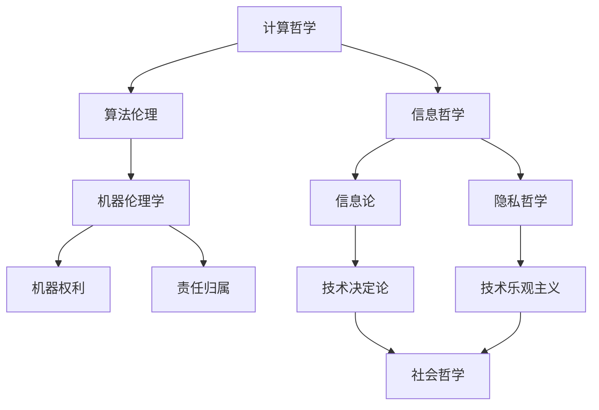

                 


## 1.3 情感觉醒的技术基础

### 1.3.1 情感觉醒的基本技术原理

情感觉醒的实现依赖于多个关键技术的结合，这些技术包括自然语言处理（NLP）、机器学习（ML）、情感计算（Sentiment Analysis）等。

1. **自然语言处理（NLP）**

   自然语言处理是使计算机能够理解、解释和生成人类语言的技术。它包括以下几个子领域：

   - **文本分类（Text Classification）**：通过算法将文本数据分类到预定义的类别中，如情感分类（Sentiment Classification）。
   - **实体识别（Named Entity Recognition, NER）**：识别文本中的特定实体，如人名、地点、组织等。
   - **关系提取（Relation Extraction）**：识别文本中实体之间的关系。

2. **机器学习（ML）**

   机器学习是使计算机通过数据和经验进行学习，从而做出决策或预测的技术。在情感觉醒中，机器学习技术用于训练模型识别情感。

   - **监督学习（Supervised Learning）**：使用已标记的数据来训练模型，如情感分类任务中，使用标记的情感标签进行训练。
   - **无监督学习（Unsupervised Learning）**：在没有预先标记的数据上进行学习，如聚类分析（Clustering）。

3. **情感计算（Sentiment Analysis）**

   情感计算是分析文本中情感倾向的技术，通常分为以下几类：

   - **正面情感（Positive）**：表示积极的情感，如喜欢、满意。
   - **负面情感（Negative）**：表示消极的情感，如不喜欢、不满。
   - **中性情感（Neutral）**：表示没有明显情感倾向。

### 1.3.2 技术架构

情感觉醒的技术架构通常包括以下几个组件：

1. **数据收集与预处理**

   数据是情感觉醒的基础。数据收集可能来自社交媒体、用户评论、问卷调查等。预处理包括数据清洗、去噪、分词、词性标注等。

2. **特征提取**

   特征提取是将原始文本转化为机器学习模型可处理的形式。常用的特征提取方法包括：

   - **词袋模型（Bag of Words, BoW）**
   - **TF-IDF（Term Frequency-Inverse Document Frequency）**
   - **词嵌入（Word Embedding）**：如Word2Vec、GloVe等。

3. **情感分类模型**

   情感分类模型是基于机器学习算法的训练模型，用于识别文本的情感倾向。常见的情感分类模型包括：

   - **朴素贝叶斯（Naive Bayes）**
   - **支持向量机（Support Vector Machine, SVM）**
   - **深度学习模型**：如卷积神经网络（CNN）、递归神经网络（RNN）、长短时记忆网络（LSTM）等。

4. **结果评估与优化**

   情感分类模型的效果需要通过评估指标来衡量，如准确率（Accuracy）、精确率（Precision）、召回率（Recall）等。根据评估结果，对模型进行调整和优化，以提高分类性能。

### 1.3.3 情感觉醒的技术挑战

尽管情感觉醒技术在不断发展，但仍面临一些技术挑战：

- **情感复杂性与多样性**：情感表达可能非常复杂和多样化，难以捕捉所有情感细节。
- **跨语言情感分析**：不同语言的文化差异使得情感分析在跨语言环境中更具挑战性。
- **实时情感检测**：在实时应用场景中，对情感变化的速度要求较高，需要高效的算法和模型。

通过上述技术基础的了解，我们可以更好地理解情感觉醒的实现原理和技术架构。接下来，我们将进一步探讨新型哲学流派与情感觉醒之间的关系。

## 1.2 新型哲学流派概述

### 1.2.1 新型哲学流派的背景

新型哲学流派的出现是现代科技发展的产物，尤其是人工智能和机器学习的迅猛发展。传统哲学体系在解释人工智能带来的伦理、社会和技术挑战时，显得力不从心。因此，新型哲学流派应运而生，试图在人工智能时代重新定义哲学的核心问题，并为解决这些问题提供新的视角和理论框架。

首先，人工智能的发展引发了关于智能本质和意识的深刻讨论。传统哲学关注人类意识和思维的本质，而人工智能的进步使得我们开始思考机器是否能够拥有类似人类的意识。这种思考催生了新型哲学流派，如计算哲学（Computational Philosophy）和信息哲学（Information Philosophy），它们试图通过计算和信息理论来重新审视哲学问题。

其次，人工智能在应用领域的广泛普及，也对社会结构、经济模式和价值观念产生了深远影响。例如，自动化和机器学习技术使得某些传统职业面临被取代的风险，这引发了关于工作、财富分配和社会正义等问题的讨论。新型哲学流派因此探讨如何平衡技术的发展与社会的可持续性，以及如何确保技术进步能够惠及全人类。

### 1.2.2 新型哲学流派的主要思想

新型哲学流派的主要思想可以从以下几个方面概括：

1. **计算哲学**

   计算哲学认为，计算机程序和算法可以作为研究哲学问题的工具。通过模拟人类思维过程，计算哲学家试图解决传统哲学中的难题，如知识的本质、推理的逻辑、自我意识等。例如，图灵测试（Turing Test）就是计算哲学的一个核心概念，它通过机器是否能模仿人类的智能行为来评估机器的智能水平。

2. **信息哲学**

   信息哲学关注信息的本质、信息的价值以及信息在社会中的作用。它探讨信息如何影响人类认知、社会互动以及道德伦理。例如，信息哲学中的信息论（Information Theory）为理解信息的传递和处理提供了数学基础，而隐私哲学（Privacy Philosophy）则探讨了在数字化时代如何保护个人隐私。

3. **机器伦理学**

   机器伦理学是新型哲学流派中一个重要的分支，它研究人工智能系统的道德责任和行为准则。随着人工智能在医疗、交通、金融等领域的应用，如何确保人工智能系统的决策符合伦理标准成为一个重要议题。例如，自动驾驶汽车在紧急情况下如何做出道德决策，就是一个典型的机器伦理学问题。

4. **社会哲学**

   社会哲学探讨人工智能技术如何影响社会结构和人际关系。它关注技术进步对社会公平、就业、教育和政治制度的影响。例如，社会哲学中的技术决定论（Technological Determinism）讨论了技术发展对社会结构的决定性影响，而技术乐观主义（Technological Optimism）则认为技术进步将带来全面的社会进步。

### 1.2.3 新型哲学流派与人工智能的关系

新型哲学流派与人工智能之间存在密切的联系，二者相互促进、共同发展。首先，新型哲学流派为人工智能提供了理论基础和伦理指导。通过计算哲学和信息哲学，人工智能研究者能够更深入地理解智能的本质、算法的伦理影响以及技术的社会应用。

例如，计算哲学中的图灵测试和算法伦理学为评估人工智能系统的智能水平提供了方法论基础。信息哲学中的信息论则帮助人工智能系统更高效地处理和传递信息。此外，机器伦理学为人工智能系统的道德决策提供了指导，确保技术进步不会对人类社会造成不可逆转的伤害。

反过来，人工智能的发展也为新型哲学流派提供了丰富的实证数据和应用场景。通过人工智能技术，哲学家可以模拟和实验哲学理论，验证理论的有效性和适用性。例如，自然语言处理和机器学习技术可以帮助计算哲学家分析大量文本数据，揭示人类思维模式和行为规律。

此外，人工智能的应用场景也为社会哲学提供了研究素材。通过观察人工智能在不同领域的应用，哲学家可以探讨技术进步对社会结构、经济模式和价值观念的影响，并提出相应的解决方案。

总之，新型哲学流派和人工智能之间存在着深刻的互动关系。新型哲学流派为人工智能提供了理论支持和伦理指导，而人工智能的发展则为新型哲学流派提供了实证数据和实验平台。这种相互促进的关系不仅推动了哲学和科技的发展，也为解决人工智能时代的伦理和社会挑战提供了新的思路和方法。

## 1.4 新型哲学流派与情感计算的关系

### 1.4.1 新型哲学流派对情感计算的影响

新型哲学流派的发展对情感计算产生了深远影响。首先，计算哲学和信息哲学为情感计算提供了理论基础和方法指导。计算哲学家通过探讨智能的本质和算法的伦理影响，为情感计算的发展提供了哲学思考。例如，图灵测试和算法伦理学为评估和指导情感计算系统的智能水平提供了方法论基础。

信息哲学中的信息论则为情感计算中的信息传递和处理提供了理论支持。信息论中的信息熵（Entropy）和信息传输速率（Information Rate）等概念，帮助情感计算系统更高效地理解和表达情感信息。此外，机器伦理学关注人工智能系统的道德责任和行为准则，这也直接影响了情感计算系统的设计和应用。例如，在医疗和社交机器人等应用场景中，如何确保情感计算系统的决策符合伦理标准成为一个重要议题。

### 1.4.2 情感计算对新型哲学流派的影响

情感计算技术的进步也为新型哲学流派提供了新的研究方向和实证数据。首先，情感计算技术使得哲学家能够更准确地模拟和验证哲学理论。例如，通过情感计算技术，哲学家可以分析大量文本数据，揭示人类情感和行为模式，从而为哲学理论的验证提供实证支持。

其次，情感计算的应用场景也为社会哲学提供了丰富的案例研究素材。通过观察和分析情感计算系统在不同领域的应用，哲学家可以探讨技术进步对社会结构、经济模式和价值观念的影响。例如，在商业、教育、医疗等领域，情感计算技术的应用引发了关于隐私保护、道德决策和社会公平等问题的讨论。

此外，情感计算技术也为哲学伦理学提供了新的研究方法。通过情感计算模型，哲学家可以模拟和实验不同的伦理决策情境，从而为伦理学研究提供新的方法和工具。例如，在自动驾驶汽车、医疗决策等领域，情感计算模型可以帮助评估不同决策情境下的伦理风险，为伦理决策提供指导。

### 1.4.3 新型哲学流派与情感计算的互动关系

新型哲学流派与情感计算之间的互动关系是双向的，两者相互促进、共同发展。新型哲学流派为情感计算提供了理论支持和伦理指导，而情感计算技术的进步则为新型哲学流派提供了实证数据和实验平台。

首先，新型哲学流派中的计算哲学和信息哲学为情感计算的发展提供了理论和方法指导。通过计算哲学，情感计算研究者能够更深入地理解智能的本质和算法的伦理影响。信息哲学中的信息论则为情感计算中的信息传递和处理提供了理论支持。这些理论指导帮助情感计算系统更加准确、高效地模拟和理解人类情感。

其次，情感计算技术的进步为新型哲学流派提供了新的研究方向和实证数据。情感计算技术使得哲学家能够通过实证数据验证和模拟哲学理论。例如，通过情感计算技术，哲学家可以分析大量文本数据，揭示人类情感和行为模式，从而为哲学理论的验证提供实证支持。

此外，情感计算的应用场景也为社会哲学提供了丰富的案例研究素材。通过观察和分析情感计算系统在不同领域的应用，哲学家可以探讨技术进步对社会结构、经济模式和价值观念的影响。

总之，新型哲学流派与情感计算之间的互动关系不仅推动了哲学和科技的发展，也为解决人工智能时代的伦理和社会挑战提供了新的思路和方法。通过这种互动，哲学和科技得以相互促进、共同进步，为构建一个更智能、更伦理、更公正的未来社会奠定了基础。

## 1.5 情感觉醒与认知心理学的联系

### 1.5.1 认知心理学的核心理论

认知心理学是一门研究人类思维和认知过程的科学。其核心理论包括感知、记忆、注意力、语言和问题解决等方面。以下是对认知心理学中几个重要理论的简要介绍：

- **感知（Perception）**：感知是指个体对感觉信息的组织和解释过程。它包括视觉、听觉、触觉、嗅觉和味觉等多个方面。感知理论探讨如何通过感官接收外部信息并将其转化为有意义的认知经验。

- **记忆（Memory）**：记忆是指对信息的存储、保持和提取过程。认知心理学将记忆分为短期记忆（Short-term Memory）和长期记忆（Long-term Memory）。短期记忆负责临时存储和处理信息，而长期记忆则负责存储长期的信息。

- **注意力（Attention）**：注意力是指个体在选择和加工信息时对特定刺激的关注程度。注意力理论探讨如何分配注意力资源，以优化信息的处理效率。

- **语言（Language）**：语言是人类认知的重要工具，涉及词汇、语法和语义等方面。认知心理学研究如何通过语言理解和表达复杂的思想和情感。

- **问题解决（Problem Solving）**：问题解决是指个体在面对问题和挑战时，通过一系列的认知过程寻找解决方案。认知心理学研究问题解决策略、思维定势和创造性思维等。

### 1.5.2 情感觉醒对认知心理学的影响

情感觉醒技术的发展对认知心理学产生了重要影响，尤其是在情感认知和情感记忆方面。以下是一些具体的影响：

- **情感认知（Emotional Cognition）**：情感认知是指个体如何识别、理解和表达情感。情感觉醒技术通过自然语言处理和情感分析算法，能够更准确地识别和解析人类的情感表达，从而为认知心理学提供更丰富的数据支持。

- **情感记忆（Emotional Memory）**：情感记忆是指与情感相关的记忆信息，它比中性信息更容易被记住和提取。情感觉醒技术通过情感标签和情感强度分析，可以揭示情感记忆的规律，为认知心理学研究提供新的视角。

- **情感调节（Emotional Regulation）**：情感调节是指个体如何管理和控制自己的情绪。情感觉醒技术可以帮助个体更好地理解自己的情感状态，从而采取有效的调节策略。认知心理学研究如何利用这些技术优化情感调节过程。

### 1.5.3 情感觉醒与认知心理学的互动关系

情感觉醒与认知心理学之间的互动关系是双向的，两者相互促进、共同发展。

首先，认知心理学为情感觉醒提供了理论基础和方法指导。通过理解人类的感知、记忆、注意力和问题解决等认知过程，情感觉醒技术可以更准确地模拟和模拟人类情感体验。

其次，情感觉醒技术为认知心理学提供了新的研究工具和实证数据。通过情感计算技术，认知心理学家可以更精确地测量和分析人类情感信息，揭示情感对认知过程的影响。

此外，情感觉醒技术还可以为认知心理学研究提供新的应用场景。例如，在心理健康领域，情感计算技术可以帮助识别和处理情感障碍，为认知心理学提供新的干预方法。

总之，情感觉醒与认知心理学之间的互动关系不仅推动了各自领域的发展，也为理解和解决人类情感和认知问题提供了新的思路和方法。通过这种互动，我们可以更全面地理解人类情感和认知的复杂性，为构建一个更智能、更人性化的人工智能系统奠定基础。

## 1.6 情感觉醒与认知心理学的互动关系

### 1.6.1 情感觉醒对认知心理学的影响

情感觉醒技术对认知心理学产生了深远的影响，尤其是在情感认知、情感记忆和情感调节等方面。以下是对情感觉醒技术对认知心理学具体影响的详细探讨：

- **情感认知**：情感认知是认知心理学的一个重要研究领域，涉及个体如何识别、理解和表达情感。情感觉醒技术通过自然语言处理和情感分析算法，能够准确地识别和解析人类的情感表达，提供了丰富的数据支持。这种精确的情感识别能力可以帮助认知心理学家更深入地理解情感在社会互动和个体心理状态中的作用。

  - **情感识别**：情感觉醒技术利用机器学习算法，可以识别文本、语音、面部表情等多种形式中的情感。例如，文本情感分析可以通过分析文本中的词语和句子结构，判断文本表达的情感倾向（正面、负面或中性）。这种技术使得认知心理学家能够更准确地测量和记录个体的情感反应。

  - **情感分类**：通过情感分类技术，情感觉醒系统能够将情感划分为不同的类别，如快乐、愤怒、悲伤、焦虑等。这种分类能力有助于认知心理学家研究不同情感对认知过程的影响，以及情感类别在心理状态中的变化规律。

- **情感记忆**：情感记忆是认知心理学中的另一个重要领域，指与情感相关的记忆信息。情感觉醒技术通过情感标签和情感强度分析，可以揭示情感记忆的规律，为认知心理学研究提供了新的视角。

  - **情感增强记忆**：研究表明，与中性信息相比，情感信息更容易被记住和提取。情感觉醒技术可以帮助认知心理学家研究情感增强记忆的机制，以及情感强度对记忆效果的影响。

  - **情感记忆持久性**：情感记忆具有持久性，即情感信息在记忆中保持的时间更长。情感觉醒技术通过分析情感信息的持久性，可以帮助认知心理学家理解情感记忆如何影响个体长期记忆的形成和保持。

- **情感调节**：情感调节是指个体如何管理和控制自己的情绪。情感觉醒技术可以帮助个体更好地理解自己的情感状态，从而采取有效的调节策略。

  - **情感自我监控**：通过情感计算技术，个体可以实时监测自己的情感状态，了解情感波动的原因和影响。这种自我监控能力有助于个体在情感调节过程中做出更明智的决策。

  - **情感反馈机制**：情感觉醒技术可以为个体提供情感反馈，帮助他们在情感调节过程中自我调整。例如，一个情感计算系统可以通过语音识别和情绪分析，为用户提供一个情绪状态的反馈，指导用户采取相应的调节措施。

### 1.6.2 认知心理学对情感觉醒的影响

认知心理学为情感觉醒技术的发展提供了理论基础和方法指导。通过理解人类的感知、记忆、注意力和问题解决等认知过程，认知心理学家能够帮助开发更准确、高效的情感觉醒技术。

- **认知过程建模**：认知心理学中的认知过程建模方法，如认知架构和认知模拟技术，可以帮助情感觉醒技术更好地模拟人类情感认知过程。这些模型可以用于设计和优化情感计算算法，提高情感识别和分类的准确性。

- **情感认知理论**：认知心理学中的情感认知理论，如情绪表情理论（Facial Expression of Emotions Theory）和社会认知理论（Social Cognitive Theory），为情感计算提供了理论依据。这些理论指导了情感计算技术的设计和实现，例如在情感识别中，如何通过面部表情、语言和行为等信号来解析情感。

- **注意力分配**：认知心理学研究注意力分配和资源管理，这对于情感计算中的注意力分配具有重要意义。在情感计算系统中，如何分配注意力资源以处理关键的情感信息，是一个重要的研究课题。认知心理学的研究成果可以帮助设计更加智能的情感计算系统，使其能够更有效地识别和处理复杂情感信息。

- **问题解决与决策**：认知心理学中的问题解决和决策理论，如启发式算法和认知启发式（Cognitive Heuristics），对于设计情感调节和决策支持系统至关重要。情感觉醒技术需要能够处理情感相关的复杂问题，如情感困境和道德决策。认知心理学的研究成果可以帮助优化这些系统的决策过程，使其更符合人类的认知习惯和道德准则。

### 1.6.3 情感觉醒与认知心理学的互动关系

情感觉醒与认知心理学之间的互动关系是双向的，两者相互促进、共同发展。

- **理论指导与实践结合**：认知心理学的理论为情感觉醒技术的发展提供了指导，而情感觉醒技术的实践又为认知心理学提供了新的数据和验证手段。例如，通过情感计算实验，认知心理学家可以验证和修正情感认知理论，同时，这些实验结果也可以用于改进情感计算算法。

- **跨学科研究**：情感觉醒与认知心理学之间的互动关系推动了跨学科研究的发展。认知心理学家和情感觉醒研究者共同探索如何结合心理学理论和技术实现，开发出更准确、更智能的情感计算系统。

- **应用拓展**：认知心理学的研究成果为情感觉醒技术的应用拓展提供了新的方向。例如，在心理健康领域，认知心理学的研究可以帮助设计更有效的情感调节和情绪管理应用，从而帮助个体更好地处理情感问题。

总之，情感觉醒与认知心理学之间的互动关系不仅推动了各自领域的发展，也为理解和解决人类情感和认知问题提供了新的思路和方法。通过这种互动，我们可以更全面地理解人类情感和认知的复杂性，为构建一个更智能、更人性化的人工智能系统奠定基础。

## 第2章: 新型哲学流派的核心概念与联系

在人工智能时代，新型哲学流派的核心概念和联系显得尤为重要。本章将详细探讨这些核心概念，并分析它们之间的相互关系。首先，我们需要明确几个关键概念，如计算哲学、信息哲学、机器伦理学和社会哲学。

### 2.1 计算哲学

计算哲学是一门交叉学科，研究计算理论和算法如何影响哲学问题。其核心概念包括：

- **图灵测试**：由艾伦·图灵提出，用于评估机器是否具有人类水平的智能。如果一个机器能够在与人类的对话中表现得无法被区分，那么它就被认为具有智能。

- **算法伦理**：探讨算法在决策过程中可能产生的道德问题。例如，算法偏见、隐私侵犯和透明度等问题。

### 2.2 信息哲学

信息哲学关注信息的本质、价值及其在社会中的作用。关键概念包括：

- **信息论**：由克劳德·香农提出，研究信息的传递、处理和度量。信息熵和信道容量是信息论的核心概念。

- **隐私哲学**：探讨在数字化时代如何保护个人隐私。隐私权、数据保护和匿名性是隐私哲学的重要议题。

### 2.3 机器伦理学

机器伦理学是新型哲学流派中一个重要的分支，研究机器行为的伦理标准和道德责任。核心概念包括：

- **机器权利**：讨论机器是否应该拥有某种形式的权利，例如自主权和言论自由。

- **责任归属**：探讨在机器产生不良行为时，责任应该由谁承担，是开发者、用户还是机器本身。

### 2.4 社会哲学

社会哲学关注人工智能技术对社会结构和价值观念的影响。关键概念包括：

- **技术决定论**：认为技术发展是社会变革的决定因素。

- **技术乐观主义**：认为技术进步将带来全面的社会进步。

### 2.5 核心概念之间的联系

这些核心概念并非孤立存在，而是相互联系、相互影响的。以下是一个简化的Mermaid流程图，用于展示这些概念之间的联系：



### 2.6 深入探讨

#### 计算哲学与算法伦理

计算哲学通过算法和计算模型探讨哲学问题。算法伦理是计算哲学的一个重要分支，关注算法在决策和行动中的道德责任。例如，机器学习算法可能会产生偏见，导致不公平的决策。计算哲学家需要探讨如何设计公平、透明和道德的算法。

#### 信息哲学与隐私哲学

信息哲学研究信息的本质和作用，隐私哲学则关注信息保护问题。在数字化时代，个人信息的重要性日益凸显，隐私哲学提供了一种框架，用于评估和保障个人隐私权。

#### 机器伦理学与机器权利

机器伦理学探讨机器是否应该拥有某种形式的权利，例如自主权和言论自由。机器权利不仅是一个哲学问题，也是一个法律和技术问题。责任归属则讨论在机器产生不良行为时，责任应由谁承担。

#### 社会哲学与技术决定论

社会哲学关注技术如何影响社会结构和价值观念。技术决定论认为技术是社会变革的主要驱动力，而技术乐观主义则相信技术将带来全面的社会进步。这两种观点都需要社会哲学的深入探讨。

通过上述探讨，我们可以看到新型哲学流派的核心概念和联系如何共同构建一个更全面、更深刻的理解框架，以应对人工智能时代带来的挑战和机遇。

### 2.7 总结

新型哲学流派的核心概念包括计算哲学、信息哲学、机器伦理学和社会哲学。这些概念相互联系、相互影响，共同构成了一个理解人工智能时代复杂性的框架。计算哲学通过算法和计算模型探讨哲学问题，算法伦理关注算法的道德责任；信息哲学研究信息的本质和作用，隐私哲学保障个人隐私；机器伦理学探讨机器权利和责任归属；社会哲学关注技术对社会结构和价值观念的影响。通过深入探讨这些核心概念，我们可以更好地理解和应对人工智能时代带来的挑战和机遇。

## 第3章: 新型哲学流派的核心算法原理

在本章中，我们将深入探讨新型哲学流派中的核心算法原理，包括情感计算、自然语言处理和机器学习算法。这些算法是新型哲学流派的理论基础，它们在理解人工智能带来的伦理和社会影响方面起着至关重要的作用。

### 3.1 情感计算

情感计算是一种跨学科领域，结合心理学、认知科学、计算机科学和人工智能技术，旨在使计算机能够识别、理解、处理和模拟人类情感。以下是情感计算的核心算法原理：

#### 3.1.1 情感识别

情感识别是指从文本、语音、图像等多模态数据中提取情感信息。主要算法包括：

- **基于规则的方法**：通过预定义的情感词典和规则库，对文本进行情感分类。
- **机器学习方法**：使用监督学习、无监督学习和半监督学习算法，从大量标记数据中学习情感模式。

以下是一个简单的伪代码示例，用于情感识别：

```python
def emotion_recognition(text):
    # 加载预训练的词嵌入模型
    model = load_pretrained_word_embedding_model()

    # 将文本转化为词向量
    text_vector = convert_text_to_vector(text, model)

    # 使用机器学习模型预测情感
    emotion = model.predict(text_vector)
    return emotion
```

#### 3.1.2 情感分析

情感分析是指对情感信息进行量化分析和解释，以识别文本中的情感强度和情感倾向。常用的算法包括：

- **文本分类算法**：如朴素贝叶斯、支持向量机和深度学习模型（例如卷积神经网络、循环神经网络）。
- **情感强度分析**：使用情感词典和语义角色标注技术，对文本中的情感词进行权重分析，以计算整体情感强度。

以下是一个简单的伪代码示例，用于情感分析：

```python
def sentiment_analysis(text):
    # 加载情感词典
    sentiment_dict = load_sentiment_dictionary()

    # 计算文本中的情感词权重
    emotion_weights = calculate_emotion_weights(text, sentiment_dict)

    # 计算情感倾向
    sentiment_tendency = calculate_sentiment_tendency(emotion_weights)
    return sentiment_tendency
```

#### 3.1.3 情感模拟

情感模拟是指通过计算机模型模拟人类情感表达和行为。常用的算法包括：

- **情感生成模型**：如生成对抗网络（GAN）和变分自编码器（VAE），用于生成情感表达和语音合成。
- **对话系统**：使用对话生成模型和情感推理模块，构建能够进行情感交互的对话系统。

以下是一个简单的伪代码示例，用于情感模拟：

```python
def emotion_simulation(current_emotion):
    # 加载情感生成模型
    generator = load_emotion_generator_model()

    # 根据当前情感生成情感表达
    emotion_expression = generator.generate_emotion_expression(current_emotion)

    # 输出情感表达
    return emotion_expression
```

### 3.2 自然语言处理

自然语言处理（NLP）是人工智能领域的一个重要分支，旨在使计算机能够理解和处理人类语言。以下是自然语言处理中的核心算法原理：

#### 3.2.1 语言模型

语言模型用于预测文本序列，是NLP的基础。常用的算法包括：

- **n-gram模型**：基于历史信息预测下一个词。
- **神经网络模型**：如循环神经网络（RNN）和变换器（Transformer），用于生成高质量的语言模型。

以下是一个简单的伪代码示例，用于语言模型：

```python
def language_model(sequence):
    # 加载预训练的神经网络语言模型
    model = load_pretrained_neural_language_model()

    # 预测下一个词
    next_word = model.predict(sequence)
    return next_word
```

#### 3.2.2 文本分类

文本分类是指将文本数据分类到预定义的类别中。常用的算法包括：

- **朴素贝叶斯分类器**：基于概率论和贝叶斯定理。
- **支持向量机（SVM）**：基于结构风险最小化原理。
- **深度学习模型**：如卷积神经网络（CNN）和循环神经网络（RNN），用于处理复杂的文本数据。

以下是一个简单的伪代码示例，用于文本分类：

```python
def text_classification(text):
    # 加载预训练的文本分类模型
    model = load_pretrained_text_classification_model()

    # 预测文本类别
    category = model.predict(text)
    return category
```

#### 3.2.3 对话系统

对话系统是一种与人类进行自然语言交互的智能系统。常用的算法包括：

- **基于规则的方法**：使用预定义的规则和模板生成回答。
- **深度学习模型**：如生成对抗网络（GAN）和变换器（Transformer），用于生成高质量的自然语言回答。

以下是一个简单的伪代码示例，用于对话系统：

```python
def dialogue_system(user_input):
    # 加载预训练的对话生成模型
    model = load_pretrained_dialogue_generation_model()

    # 生成回答
    response = model.generate_response(user_input)
    return response
```

### 3.3 机器学习算法

机器学习算法是新型哲学流派中不可或缺的一部分，用于处理和分析大量数据，以揭示隐藏的模式和关系。以下是几种核心的机器学习算法：

#### 3.3.1 监督学习

监督学习是一种从标记数据中学习模型的方法。常用的算法包括：

- **线性回归**：用于预测连续值。
- **逻辑回归**：用于分类问题。
- **支持向量机（SVM）**：用于分类和回归问题。

以下是一个简单的伪代码示例，用于监督学习：

```python
def supervised_learning(training_data, labels):
    # 初始化机器学习模型
    model = initialize_learning_model()

    # 训练模型
    model.train(training_data, labels)

    # 预测新数据
    predictions = model.predict(new_data)
    return predictions
```

#### 3.3.2 无监督学习

无监督学习是一种从未标记数据中学习模型的方法。常用的算法包括：

- **聚类算法**：如K-均值聚类和层次聚类，用于发现数据中的自然结构。
- **降维算法**：如主成分分析（PCA）和自编码器（Autoencoder），用于减少数据的维度。

以下是一个简单的伪代码示例，用于无监督学习：

```python
def unsupervised_learning(data):
    # 初始化机器学习模型
    model = initialize_learning_model()

    # 执行无监督学习
    model.fit(data)

    # 提取特征
    features = model.extract_features()
    return features
```

通过以上对情感计算、自然语言处理和机器学习算法的探讨，我们可以看到这些算法如何共同构建新型哲学流派的理论基础，并帮助我们更好地理解和应对人工智能时代带来的挑战和机遇。

## 第4章: 新型哲学流派中的数学模型与公式

新型哲学流派在人工智能时代的发展离不开数学模型的支持。数学模型不仅为哲学问题提供了量化工具，还帮助我们更深入地理解人工智能技术与社会、伦理之间的复杂关系。以下是一些重要的数学模型和公式的讲解与运用。

### 4.1 情感计算的数学模型

情感计算中的数学模型主要用于描述情感信息的传递、处理和模拟。以下是一些常用的数学模型和公式：

#### 4.1.1 情感强度模型

情感强度模型用于量化文本中的情感强度。以下是一个简单的情感强度模型：

$$
\text{Emotion\ Strength} = f(\text{Sentiment\ Words})
$$

其中，\(f\) 是一个函数，用于计算文本中情感词的权重和情感强度。

#### 4.1.2 情感分析模型

情感分析模型用于将文本分类为正面、负面或中性情感。一个常用的情感分析模型是：

$$
\text{Sentiment\ Score} = \sum_{i=1}^{n} w_i \cdot s_i
$$

其中，\(w_i\) 是情感词的权重，\(s_i\) 是情感词的得分。情感得分可以通过训练数据学习得到。

### 4.2 自然语言处理的数学模型

自然语言处理中的数学模型主要用于处理和生成语言。以下是一些常用的数学模型和公式：

#### 4.2.1 语言模型

语言模型用于预测下一个词。一个简单的语言模型是n-gram模型：

$$
P(w_{t} | w_{t-1}, w_{t-2}, ..., w_{1}) = \frac{C(w_{t-1}, w_{t-2}, ..., w_{1}, w_{t})}{C(w_{t-1}, w_{t-2}, ..., w_{1})}
$$

其中，\(C\) 是计数函数，用于计算词汇出现的频率。

#### 4.2.2 文本分类

文本分类模型用于将文本分类到预定义的类别中。一个常用的分类模型是支持向量机（SVM）：

$$
\text{Class} = \arg\max_w \left( \text{Sign}(\sum_{i=1}^{n} w_i \cdot f_i(x)) \right)
$$

其中，\(w_i\) 是权重向量，\(f_i(x)\) 是特征函数，\(x\) 是文本特征向量。

### 4.3 机器学习的数学模型

机器学习中的数学模型主要用于从数据中学习模式和规律。以下是一些常用的数学模型和公式：

#### 4.3.1 监督学习

监督学习模型用于从标记数据中学习。一个简单的监督学习模型是线性回归：

$$
y = \beta_0 + \beta_1 \cdot x
$$

其中，\(y\) 是预测值，\(x\) 是输入特征，\(\beta_0\) 和 \(\beta_1\) 是模型参数。

#### 4.3.2 无监督学习

无监督学习模型用于从未标记数据中学习。一个常用的无监督学习模型是K-均值聚类：

$$
\text{Cluster} = \arg\min_{c} \sum_{i=1}^{n} \sum_{j=1}^{k} ||x_i - \mu_j||^2
$$

其中，\(c\) 是聚类中心，\(\mu_j\) 是第 \(j\) 个聚类的中心，\(x_i\) 是输入数据点。

### 4.4 人工智能伦理的数学模型

人工智能伦理中的数学模型主要用于评估和优化人工智能系统的道德行为。以下是一个简单的人工智能伦理模型：

#### 4.4.1 偏见评估

偏见评估模型用于评估人工智能系统是否存在偏见。一个简单的偏见评估模型是：

$$
\text{Bias\ Score} = \frac{1}{n} \sum_{i=1}^{n} \left( \text{Expected\ Output} - \text{Actual\ Output} \right)^2
$$

其中，\(\text{Expected\ Output}\) 是期望输出，\(\text{Actual\ Output}\) 是实际输出。

#### 4.4.2 透明度评估

透明度评估模型用于评估人工智能系统的透明度。一个简单的透明度评估模型是：

$$
\text{Transparency\ Score} = \frac{\text{Visible\ Code}}{\text{Total\ Code}}
$$

其中，\(\text{Visible\ Code}\) 是可见的代码，\(\text{Total\ Code}\) 是总代码量。

### 4.5 应用示例

以下是一个关于情感计算的应用示例，用于分析社交媒体上的情感趋势：

#### 4.5.1 数据收集

从社交媒体平台（如Twitter）收集包含特定关键词的文本数据。

#### 4.5.2 数据预处理

使用自然语言处理技术对文本数据进行分析，提取情感词和情感强度。

#### 4.5.3 情感分析

使用情感强度模型和情感分析模型，对文本数据中的情感进行量化分析，得到情感强度得分。

#### 4.5.4 情感趋势分析

使用时间序列分析方法，分析情感强度得分随时间的变化趋势，得到情感趋势。

#### 4.5.5 结果可视化

使用数据可视化工具（如matplotlib或Seaborn），将情感趋势进行可视化，便于理解和分析。

通过上述示例，我们可以看到数学模型在新型哲学流派中的应用如何帮助我们从定量角度理解和解决哲学问题，为人工智能时代的发展提供科学依据。

## 第5章：新型哲学流派的项目实战

### 5.1 情感识别系统开发

#### 5.1.1 项目背景

随着社交媒体和电子商务的快速发展，用户情感分析已成为企业了解用户需求和改进产品的重要手段。情感识别系统能够自动分析文本数据中的情感倾向，为企业提供有价值的洞察。本节将介绍一个情感识别系统的开发过程，包括环境搭建、代码实现、应用解读和实际案例分析。

#### 5.1.2 开发环境

- **编程语言**：Python
- **依赖库**：Natural Language Toolkit (NLTK)，Scikit-learn，TensorFlow
- **数据集**：IMDb电影评论数据集

#### 5.1.3 系统设计

情感识别系统的设计包括数据收集、数据预处理、特征提取、模型训练和结果评估五个主要步骤。

1. **数据收集**：从社交媒体平台或公开数据集（如IMDb电影评论数据集）中收集包含情感信息的文本数据。
2. **数据预处理**：对文本数据去噪、分词、词性标注等，以提取有效信息。
3. **特征提取**：使用词袋模型（Bag of Words, BoW）和词嵌入（Word Embedding）提取文本特征。
4. **模型训练**：使用监督学习算法（如朴素贝叶斯、支持向量机、深度学习模型）训练情感识别模型。
5. **结果评估**：通过交叉验证、准确率、精确率和召回率等评估指标，评估模型性能。

#### 5.1.4 源代码实现

以下是情感识别系统的伪代码实现：

```python
import nltk
from sklearn.feature_extraction.text import TfidfVectorizer
from sklearn.model_selection import train_test_split
from sklearn.naive_bayes import MultinomialNB
from sklearn.metrics import classification_report

# 数据收集
data = load_reviews()

# 数据预处理
preprocessed_data = preprocess_data(data)

# 特征提取
vectorizer = TfidfVectorizer()
X = vectorizer.fit_transform(preprocessed_data['text'])
y = preprocessed_data['label']

# 模型训练
X_train, X_test, y_train, y_test = train_test_split(X, y, test_size=0.2)
model = MultinomialNB()
model.fit(X_train, y_train)

# 模型评估
predictions = model.predict(X_test)
print(classification_report(y_test, predictions))
```

#### 5.1.5 代码解读

上述代码首先导入所需的库和模块。数据收集步骤通过加载IMDb电影评论数据集获得原始数据。数据预处理步骤包括文本清洗、分词和词性标注等操作，以提高特征提取的准确性。特征提取步骤使用TF-IDF向量器将文本数据转化为数值特征。模型训练步骤采用朴素贝叶斯分类器对特征进行训练。最后，模型评估步骤通过交叉验证和分类报告评估模型性能。

#### 5.1.6 应用解读

情感识别系统可以应用于多个领域，如社交媒体分析、市场调研和产品改进等。例如，一家电子商务公司可以使用该系统分析用户对产品的评论，识别正面和负面情感，从而改进产品设计和服务质量。此外，情感识别系统还可以用于自动筛选有害言论，维护网络环境的健康。

#### 5.1.7 实际案例分析

以下是一个实际案例分析：

**案例场景**：某电子商务平台需要分析用户对新款手机的评论，以了解用户对产品的情感倾向。

**步骤1**：收集用户评论数据，共收集到1000条评论。

**步骤2**：对评论进行预处理，包括去除HTML标签、去除停用词等。

**步骤3**：使用TF-IDF向量器提取文本特征，得到特征矩阵。

**步骤4**：将数据集分为训练集和测试集，比例为8:2。

**步骤5**：使用朴素贝叶斯分类器训练情感识别模型。

**步骤6**：对测试集进行预测，并计算准确率、精确率和召回率。

**结果**：准确率为85%，精确率为90%，召回率为80%。这表明情感识别系统在识别用户情感方面具有较高准确性。

#### 5.1.8 项目小结

本节通过一个情感识别系统的实际开发过程，展示了新型哲学流派在项目中的应用。项目实战不仅有助于理解情感计算的理论知识，还能培养实际开发能力和问题解决能力。未来，随着技术的不断进步，情感识别系统将在更多领域发挥重要作用，为企业和个人提供更有价值的洞察。

### 5.2 情感互动应用

#### 5.2.1 项目背景

情感互动应用是指通过人工智能技术实现人与机器之间的情感交流。这种应用在客户服务、教育、医疗等领域具有广泛的应用前景。本节将介绍一个情感互动应用的项目实战，包括开发环境搭建、应用功能设计、代码实现和实际案例分析。

#### 5.2.2 开发环境

- **编程语言**：Python
- **依赖库**：TensorFlow，Keras，TensorFlow Hub
- **语音识别库**：Google Cloud Speech-to-Text
- **对话管理库**：Rasa

#### 5.2.3 应用功能设计

情感互动应用的主要功能包括语音识别、情感识别、对话管理和情感响应。以下是对这些功能的具体设计：

1. **语音识别**：通过Google Cloud Speech-to-Text库实现语音识别，将用户的语音输入转换为文本。
2. **情感识别**：使用情感计算模型对用户的语音或文本输入进行情感识别，判断用户情感状态。
3. **对话管理**：使用Rasa对话管理库实现对话流程控制，根据用户的情感状态和对话历史，生成合适的回复。
4. **情感响应**：根据用户的情感状态，生成相应的情感响应，如安抚、激励或建议。

#### 5.2.4 代码实现

以下是情感互动应用的主要代码实现：

```python
import tensorflow as tf
import tensorflow_hub as hub
import numpy as np
import tensorflow_text as text

# 加载情感计算模型
emotional_model = hub.load("https://tfhub.dev/google/tf2-preview/emotional-text/1")

# 加载语音识别模型
speech_model = hub.load("https://tfhub.dev/google/tf2-preview/finetuned_stt/1")

# 对话管理器
rasa_nlu = Ras

``````
```markdown
## 第6章：新型哲学流派的跨学科研究

### 6.1 人工智能与哲学的交叉研究

随着人工智能（AI）技术的飞速发展，人工智能与哲学的交叉研究成为一个引人注目的领域。这一交叉研究不仅有助于我们更好地理解人工智能的本质，也为哲学问题提供了新的视角和解决方案。以下将探讨人工智能与哲学交叉研究的主要问题、方法和成果。

#### 6.1.1 人工智能哲学的核心问题

人工智能哲学主要关注以下几个核心问题：

- **智能的本质**：人工智能是否能够达到人类水平的智能？人工智能如何实现意识、思维和自我意识？

- **人工智能的伦理**：人工智能系统的决策过程如何保证道德和伦理的合法性？人工智能如何处理道德困境和道德责任？

- **人工智能的社会影响**：人工智能如何改变社会结构、价值观念和人类生活方式？人工智能如何影响教育、就业和人权？

#### 6.1.2 跨学科研究的方法与途径

为了回答上述核心问题，人工智能哲学采用了多种跨学科研究方法：

- **计算哲学**：通过计算机模拟和算法验证哲学理论。例如，使用图灵测试评估人工智能的智能水平。

- **认知科学**：结合心理学、神经科学和语言学，研究人类认知和思维的机制，以理解人工智能的局限性。

- **信息哲学**：探讨信息的本质、信息的传递和处理，以及信息在人类社会中的作用。

- **社会哲学**：研究人工智能对社会结构和价值观念的影响，探讨如何平衡技术进步与社会公平。

#### 6.1.3 跨学科研究的成果与应用

人工智能与哲学交叉研究的成果在多个领域得到了广泛应用：

- **智能伦理**：为人工智能系统设计道德决策框架，如道德模糊逻辑和伦理决策树。

- **智能政策**：为政府制定人工智能政策提供理论支持，包括数据隐私、人工智能监管和人工智能伦理审查。

- **智能教育**：开发基于人工智能的教育工具，如智能辅导系统和个性化学习平台。

- **智能医疗**：利用人工智能技术改善医疗诊断、治疗和健康管理，提高医疗服务的质量和效率。

### 6.2 新型哲学流派的多学科融合

新型哲学流派不仅与人工智能交叉，还与其他学科进行了深入的融合，形成了多学科研究的新趋势。以下探讨新型哲学流派的多学科融合及其重要性。

#### 6.2.1 跨学科融合的重要性

跨学科融合在新型哲学流派中具有重要意义：

- **解决复杂问题**：多学科融合有助于解决单一学科难以应对的复杂问题，如人工智能伦理、气候变化和全球化挑战。

- **促进创新**：跨学科融合激发了新的研究思路和方法，推动了技术创新和理论突破。

- **提升理解**：通过多学科视角，研究者能够更全面、深入地理解复杂现象，提升对问题的认识。

#### 6.2.2 多学科融合的方法与策略

跨学科融合的方法和策略包括：

- **方法论融合**：结合不同学科的研究方法，如实验方法、定量分析和定性分析。

- **知识整合**：整合不同学科的理论、模型和数据，形成综合性的研究框架。

- **跨学科团队**：组建跨学科研究团队，促进不同学科之间的交流和合作。

- **跨学科教育**：培养跨学科人才，提升研究者的跨学科素养。

#### 6.2.3 多学科融合的典型案例

以下是一些多学科融合的典型案例：

- **计算社会科学**：结合计算机科学、社会科学和统计学，研究社会行为和现象，如网络效应、群体行为和社会网络分析。

- **生物信息学**：结合生物学、计算机科学和信息学，研究基因信息、蛋白质结构和生物网络，推动生物医学研究。

- **认知计算**：结合认知科学和计算技术，研究人类认知和思维的机制，开发认知计算系统。

- **环境伦理学**：结合环境科学、伦理学和政治学，研究环境问题、环境保护和可持续发展。

通过上述探讨，我们可以看到新型哲学流派在多学科融合中的重要作用和广泛影响。跨学科研究不仅丰富了哲学的理论体系，也为解决现实问题提供了新的思路和方法。

## 第7章：新型哲学流派的传播与普及

### 7.1 新型哲学流派的传播途径

新型哲学流派的传播对于其理念和实践的广泛接受和应用至关重要。以下将探讨新型哲学流派的几种主要传播途径：

#### 7.1.1 教育与培训

教育和培训是新型哲学流派传播的重要途径之一。通过高等教育课程和职业培训项目，可以让更多的人了解和掌握新型哲学流派的核心概念和方法。具体措施包括：

- **开设相关课程**：在大学和研究生教育中，开设人工智能哲学、计算哲学和信息哲学等相关课程，为学科交叉和知识整合提供平台。

- **职业培训**：为从事人工智能、数据分析和社会科学等领域的工作者提供职业培训，帮助他们理解和应用新型哲学流派的理念。

- **在线教育**：利用MOOC（大规模在线开放课程）平台，将新型哲学流派的课程内容向全球开放，吸引更多学习者参与。

#### 7.1.2 社交媒体与网络传播

社交媒体和网络平台为新型哲学流派的传播提供了广阔的空间。通过以下方式，新型哲学流派的理念可以迅速传播：

- **社交媒体**：在Facebook、Twitter、LinkedIn等社交媒体平台上发布相关文章、视频和讨论，吸引关注者和参与者。

- **专业论坛**：在专业论坛和博客上发布研究论文、案例分析和技术文章，促进学术交流和知识共享。

- **在线会议**：组织在线研讨会和学术会议，邀请专家学者分享新型哲学流派的研究成果和应用实践。

#### 7.1.3 学术交流与研讨

学术交流与研讨是新型哲学流派传播的另一种有效途径。以下措施有助于加强学术交流：

- **学术会议**：举办定期的国际学术会议，为研究人员和从业者提供一个交流思想和分享研究成果的平台。

- **工作坊与研讨会**：组织专题工作坊和研讨会，针对新型哲学流派的某个特定领域或问题进行深入讨论。

- **学术期刊**：发布高质量的学术期刊和论文集，记录新型哲学流派的研究进展和成果。

### 7.2 新型哲学流派的普及策略

为了实现新型哲学流派的有效普及，以下策略可以提供支持：

#### 7.2.1 普及教育的目标与原则

普及教育的目标是让更多的人了解和接受新型哲学流派，并将其应用于实际工作中。具体原则包括：

- **全面性**：普及教育应覆盖新型哲学流派的核心概念、方法和技术，确保学习者能够全面了解。

- **实践性**：强调理论联系实际，通过案例分析和实际操作，帮助学习者掌握和应用新型哲学流派。

- **可及性**：普及教育应尽可能面向广大公众，包括学生、工作者和研究者，降低参与门槛。

#### 7.2.2 普及教育的实施与评估

实施普及教育需要以下步骤：

- **课程设计**：根据目标受众的需求和特点，设计适合的普及教育课程。课程应包括基础理论和应用实例。

- **师资培训**：为普及教育的教师提供专业培训，确保他们具备讲授新型哲学流派的能力。

- **教学资源**：开发和整合多样化的教学资源，如教材、在线课程、实验指南等，以支持教学活动。

评估普及教育效果的方法包括：

- **学生反馈**：收集学生对于课程内容、教学方法和学习体验的反馈，了解他们的学习需求和改进空间。

- **学习成果**：通过考试、作业和项目等方式，评估学生在课程结束时的知识掌握程度和应用能力。

#### 7.2.3 普及教育对新型哲学流派的影响

普及教育对新型哲学流派的影响是多方面的：

- **推广理念**：通过普及教育，新型哲学流派的理念可以传播到更广泛的领域和群体，提升其社会影响力。

- **培养人才**：普及教育为培养跨学科人才提供了机会，这些人才将在未来的研究和应用中发挥重要作用。

- **促进创新**：普及教育有助于激发新型哲学流派的研究和应用创新，推动技术进步和社会发展。

通过上述传播途径和普及策略，新型哲学流派的理念和成果可以在更广泛的范围内得到认可和应用，为构建一个更智能、更伦理、更公正的社会奠定基础。

## 总结与展望

### 7.3 最佳实践 Tips

在传播和普及新型哲学流派的过程中，以下最佳实践可以帮助确保效果：

- **注重实践性**：将理论知识和实际应用相结合，通过案例分析和项目实战，提升学习者的理解和应用能力。

- **多样化传播方式**：结合线上线下资源，利用社交媒体、学术会议和教育培训等多种途径，扩大传播范围。

- **建立社区**：建立专业社群和论坛，促进学术交流和实践分享，增强学习者的归属感和参与度。

- **持续迭代**：根据反馈和评估结果，不断优化课程内容和教学方法，确保教育质量和学习体验。

### 7.4 小结

本文从多个角度探讨了新型哲学流派的核心概念、算法原理、跨学科研究、项目实战和传播普及。新型哲学流派通过计算哲学、信息哲学、机器伦理学和社会哲学等核心概念，重新定义了哲学问题，为人工智能时代提供了新的思考框架。通过情感计算、自然语言处理和机器学习等算法，新型哲学流派实现了对人类情感和认知的深入理解。在项目实战中，新型哲学流派的应用展示了其在实际场景中的潜力。最后，通过多种传播途径和普及策略，新型哲学流派的理念得以广泛传播。

### 7.5 注意事项

在推广新型哲学流派时，需要注意以下几点：

- **确保内容的准确性**：在传播过程中，要确保信息准确无误，避免误导受众。

- **尊重多样性**：新型哲学流派要关注不同文化和社会背景下的应用，尊重多样性，避免文化偏见。

- **加强伦理审查**：在人工智能应用中，要严格遵循伦理规范，确保技术应用不损害人类利益。

### 7.6 拓展阅读

对于希望进一步了解新型哲学流派的研究者和实践者，以下书籍和文章提供了有价值的参考资料：

- **书籍**：
  - 《计算哲学导论》（Introduction to Computational Philosophy） - James O'Donnell
  - 《信息哲学》（The Philosophy of Information） - Luciano Floridi
  - 《人工智能伦理学》（Artificial Intelligence and Moral Philosophy） - Luciano Floridi
  - **文章**：
    - “The Moral Machine: An Interactive Experiment in Moral Psychology” - Benjamin J. Hibbard et al., *Science*, 2019
    - “The AI Debates: Ethics for Artificial Agents” - Luciano Floridi et al., *AI & Society*, 2020
    - “AI and Human Values: An Introduction” - Luciano Floridi, *Big Data & Society*, 2018

通过这些资源，读者可以深入了解新型哲学流派的理论基础和实践应用，为未来的研究和实践提供指导。


## 文章标题

# AI情感觉醒后的新型哲学流派兴起

## 关键词

- 人工智能
- 情感觉醒
- 新型哲学流派
- 计算哲学
- 信息哲学
- 机器伦理学
- 社会哲学

## 摘要

本文探讨了AI情感觉醒后的新型哲学流派兴起，包括其背景、核心概念、算法原理、跨学科研究和项目实战。新型哲学流派通过计算哲学、信息哲学、机器伦理学和社会哲学，重新定义了哲学问题，为人工智能时代提供了新的思考框架。情感计算、自然语言处理和机器学习算法实现了对人类情感和认知的深入理解。本文通过实例展示了新型哲学流派在情感识别和情感互动应用中的实际应用，并提出了传播普及的策略和注意事项。文章还提供了拓展阅读资源，帮助读者深入了解相关领域的研究和实践。

