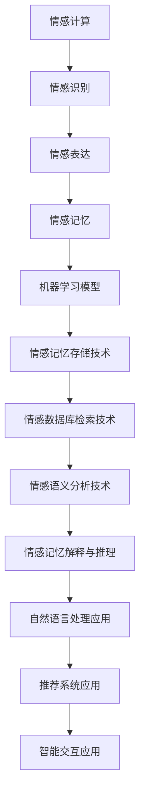

                 


## 文章标题：AI情感记忆：机器学习与情感存储

> 关键词：情感计算，机器学习，情感记忆，情感存储，情感识别，情感表达，自然语言处理，推荐系统，智能交互

> 摘要：
本文将深入探讨AI情感记忆的概念、重要性以及其在机器学习和情感存储中的应用。首先，我们将介绍情感计算的基本原理和情感识别与表达技术。接着，我们将详细讲解情感记忆的构建、优化以及存储方式。随后，我们将分析情感记忆在自然语言处理、推荐系统和智能交互等领域的应用。最后，我们将总结情感记忆研究资源与工具，为读者提供进一步的学习和实践指南。

----------------------------------------------------------------

### 第一部分：AI情感记忆概述

#### 第1章：AI情感记忆的概念与重要性

##### 1.1 AI情感记忆的定义

AI情感记忆是指人工智能系统能够识别、存储、管理和使用情感信息的能力。与传统基于规则或知识的系统不同，AI情感记忆能够模拟人类的情感体验，实现更加自然和丰富的交互。

##### 1.2 AI情感记忆的重要性

情感记忆在AI系统中具有重要地位，它不仅能够提高AI系统的交互质量和用户体验，还能够增强系统的适应性和学习能力。以下是一些具体的应用场景：

1. **自然语言处理**：情感记忆可以帮助AI系统更好地理解用户情感，从而提高文本分析、情感分析和对话系统的准确性。
2. **推荐系统**：情感记忆可以帮助推荐系统更好地了解用户偏好，提供更加个性化的推荐。
3. **智能交互**：情感记忆可以帮助智能助手更好地模拟人类情感，实现更加自然和富有情感的交互。

##### 1.3 AI情感记忆的应用领域

AI情感记忆的应用领域广泛，包括但不限于以下方面：

1. **社交网络**：通过情感记忆，社交网络可以更好地理解用户情感，提供更加个性化的推荐和互动。
2. **娱乐与媒体**：情感记忆可以帮助娱乐和媒体平台更好地了解用户情感，提供更加符合用户情感需求的娱乐内容。
3. **医疗与健康**：情感记忆可以帮助医疗系统更好地理解患者情感，提供更加个性化的治疗方案和心理支持。

#### 第2章：情感计算基础

##### 2.1 情感计算的概念与原理

情感计算是指通过计算机技术模拟、识别、理解和表达情感的能力。情感计算的核心是情感识别和情感表达技术。

1. **情感识别技术**：情感识别技术用于从文本、语音、图像等多媒体数据中提取情感信息。常见的情感识别技术包括情感分析、情感分类、情感倾向分析等。
2. **情感表达技术**：情感表达技术用于模拟和表达情感，常见的方法包括文本情感生成、语音情感合成、面部表情合成等。

##### 2.2 情感识别技术

情感识别技术是情感计算的核心，它包括以下几个方面：

1. **文本情感分析**：文本情感分析是指从文本中提取情感信息，判断文本的情感倾向。常见的文本情感分析方法包括基于规则的方法、机器学习方法等。
2. **语音情感识别**：语音情感识别是指从语音信号中提取情感信息，判断语音的情感状态。常见的语音情感识别方法包括基于声学特征的方法、基于声学模型的深度学习方法等。
3. **图像情感识别**：图像情感识别是指从图像中提取情感信息，判断图像的情感状态。常见的图像情感识别方法包括基于视觉特征的方法、基于深度学习的方法等。

##### 2.3 情感表达技术

情感表达技术用于模拟和表达情感，常见的方法包括：

1. **文本情感生成**：文本情感生成是指根据给定的情感类别，生成具有相应情感的文本。常见的文本情感生成方法包括基于规则的方法、基于神经网络的生成模型等。
2. **语音情感合成**：语音情感合成是指根据给定的情感类别，合成具有相应情感的语音。常见的语音情感合成方法包括基于声学模型的方法、基于深度学习的方法等。
3. **面部表情合成**：面部表情合成是指根据给定的情感类别，生成具有相应面部表情的图像。常见的人脸表情合成方法包括基于关键点的面部建模、基于深度学习的方法等。

#### 第3章：机器学习与情感记忆

##### 3.1 机器学习基本概念

机器学习是一种通过数据训练模型，使其具备学习能力的技术。在机器学习中，常用的方法包括监督学习、无监督学习和强化学习。

1. **监督学习**：监督学习是指使用标注数据进行训练，使模型能够对新的数据进行预测。常见的监督学习方法包括线性回归、决策树、支持向量机等。
2. **无监督学习**：无监督学习是指在没有标注数据的情况下，通过模型自身的学习能力，对数据进行聚类、降维等处理。常见的方法包括聚类算法、主成分分析等。
3. **强化学习**：强化学习是指通过与环境交互，不断调整策略，使模型能够在特定任务上取得最佳性能。常见的方法包括Q学习、深度确定性策略梯度等。

##### 3.2 情感记忆的机器学习模型

情感记忆的机器学习模型主要用于识别和存储情感信息。以下是一些常见的情感记忆机器学习模型：

1. **情感分类模型**：情感分类模型用于对文本、语音、图像等数据进行情感分类。常见的情感分类模型包括基于朴素贝叶斯的方法、基于支持向量机的方法、基于深度学习的方法等。
2. **情感识别模型**：情感识别模型用于从文本、语音、图像等数据中识别情感信息。常见的情感识别模型包括基于循环神经网络的方法、基于卷积神经网络的方法等。
3. **情感生成模型**：情感生成模型用于根据给定的情感类别，生成具有相应情感的文本、语音、图像等。常见的情感生成模型包括基于循环神经网络的方法、基于生成对抗网络的方法等。

##### 3.3 情感记忆的构建与优化

情感记忆的构建与优化是AI情感记忆系统的关键环节。以下是一些常见的构建与优化方法：

1. **数据预处理**：数据预处理是构建情感记忆模型的第一步，它包括数据清洗、数据归一化、数据增强等。有效的数据预处理可以提高模型的性能和泛化能力。
2. **特征提取**：特征提取是将原始数据转换为适合机器学习模型处理的形式。常见的特征提取方法包括词袋模型、词嵌入、声学特征提取等。
3. **模型训练与优化**：模型训练与优化是构建情感记忆模型的核心环节，它包括模型选择、参数调整、模型评估等。有效的模型训练与优化可以提高模型的准确性和鲁棒性。
4. **模型解释与调试**：模型解释与调试是确保情感记忆模型正确性和可靠性的关键步骤。它包括模型解释、模型调试、模型验证等。

### 第二部分：情感记忆的存储技术

#### 第4章：情感记忆的存储方式

##### 4.1 情感记忆的存储需求

情感记忆的存储需求包括以下几个方面：

1. **数据量**：情感记忆涉及到的数据量通常较大，需要足够的存储空间来存储数据。
2. **数据类型**：情感记忆涉及到的数据类型多样，包括文本、语音、图像等，需要支持多种数据类型的存储和检索。
3. **数据安全性**：情感记忆中的数据通常涉及用户隐私，需要确保数据的安全性和隐私性。

##### 4.2 情感记忆的存储技术

情感记忆的存储技术主要包括以下几种：

1. **关系型数据库**：关系型数据库如MySQL、PostgreSQL等适用于存储结构化数据，可以高效地查询和操作情感数据。
2. **NoSQL数据库**：NoSQL数据库如MongoDB、Cassandra等适用于存储非结构化数据，可以灵活地处理复杂的情感数据。
3. **分布式存储系统**：分布式存储系统如Hadoop、Spark等适用于大规模情感数据的存储和处理。

##### 4.3 情感记忆的存储挑战与解决方案

情感记忆的存储面临以下挑战：

1. **数据一致性**：在分布式存储系统中，如何保证数据的一致性是一个重要问题。常见的解决方案包括分布式事务、分布式锁等。
2. **数据安全性**：如何确保情感数据的安全性和隐私性是一个重要问题。常见的解决方案包括数据加密、访问控制等。
3. **数据扩展性**：如何支持大规模情感数据的存储和处理是一个重要问题。常见的解决方案包括分布式存储、数据分片等。

#### 第5章：情感数据库与检索技术

##### 5.1 情感数据库的概念与设计

情感数据库是一种专门用于存储和管理情感数据的数据库。它通常具有以下特点：

1. **情感数据存储**：情感数据库可以存储多种类型的情感数据，包括文本、语音、图像等。
2. **情感数据检索**：情感数据库可以提供高效的情感数据检索功能，支持基于情感特征的数据查询和索引。
3. **情感数据分析**：情感数据库可以提供丰富的情感数据分析功能，支持情感分类、情感趋势分析等。

##### 5.2 情感检索技术

情感检索技术是情感数据库的核心功能之一，它包括以下几个方面：

1. **文本情感检索**：文本情感检索是指根据用户的情感需求，从文本数据库中检索出具有相应情感倾向的文本。常见的文本情感检索方法包括基于关键词检索、基于情感分类检索等。
2. **语音情感检索**：语音情感检索是指根据用户的情感需求，从语音数据库中检索出具有相应情感状态的语音。常见的语音情感检索方法包括基于声学特征检索、基于情感分类检索等。
3. **图像情感检索**：图像情感检索是指根据用户的情感需求，从图像数据库中检索出具有相应情感状态的图像。常见的图像情感检索方法包括基于视觉特征检索、基于情感分类检索等。

##### 5.3 情感数据库的应用案例

情感数据库在多个领域有广泛的应用，以下是一些应用案例：

1. **社交媒体分析**：通过情感数据库，可以实时分析社交媒体中的用户情感，为营销策略提供支持。
2. **情感化搜索**：通过情感数据库，可以提供更加情感化的搜索结果，满足用户个性化的情感需求。
3. **智能客服系统**：通过情感数据库，可以实时分析用户情感，为智能客服系统提供更准确的情感分析和响应。

#### 第6章：情感记忆的语义分析与解释

##### 6.1 情感语义分析技术

情感语义分析技术是情感记忆的关键技术之一，它包括以下几个方面：

1. **情感分类**：情感分类是指根据文本、语音、图像等数据中的情感特征，将数据划分为不同的情感类别。常见的情感分类方法包括基于规则的方法、基于机器学习的方法等。
2. **情感强度分析**：情感强度分析是指根据文本、语音、图像等数据中的情感特征，分析情感表达的程度。常见的情感强度分析方法包括基于语义角色分析法、基于情感词典法等。
3. **情感趋势分析**：情感趋势分析是指根据文本、语音、图像等数据中的情感特征，分析情感随时间的变化趋势。常见的情感趋势分析方法包括基于时间序列分析法、基于聚类分析法等。

##### 6.2 情感记忆的解释与推理

情感记忆的解释与推理是情感记忆系统的核心功能之一，它包括以下几个方面：

1. **情感推理**：情感推理是指根据已知情感信息，推导出新的情感信息。常见的情感推理方法包括基于逻辑推理、基于概率推理等。
2. **情感解释**：情感解释是指对情感记忆系统生成的情感信息进行解释，使其更加易懂和可靠。常见的情感解释方法包括基于可视化、基于自然语言生成等。
3. **情感修正**：情感修正是指根据用户反馈或新信息，对情感记忆系统生成的情感信息进行修正，提高其准确性和可靠性。

##### 6.3 情感记忆的语义分析应用

情感记忆的语义分析技术在多个领域有广泛的应用，以下是一些应用案例：

1. **情感化推荐系统**：通过情感记忆的语义分析，可以生成更加个性化的推荐结果，提高用户的满意度。
2. **情感化搜索**：通过情感记忆的语义分析，可以提供更加情感化的搜索结果，满足用户的情感需求。
3. **情感化对话系统**：通过情感记忆的语义分析，可以生成更加自然的对话响应，提高用户的交互体验。

### 第三部分：情感记忆在AI中的应用

#### 第7章：情感记忆在自然语言处理中的应用

##### 7.1 情感记忆在情感分析中的应用

情感记忆在情感分析中的应用主要包括以下几个方面：

1. **文本情感分析**：通过情感记忆，可以更加准确地识别文本中的情感倾向，提高文本情感分析的准确性和鲁棒性。
2. **情感强度分析**：通过情感记忆，可以分析文本中的情感强度，为文本情感分类和情感强度预测提供支持。
3. **情感趋势分析**：通过情感记忆，可以分析文本中的情感变化趋势，为情感分析提供更全面的视角。

##### 7.2 情感记忆在情感生成中的应用

情感记忆在情感生成中的应用主要包括以下几个方面：

1. **文本情感生成**：通过情感记忆，可以生成具有特定情感倾向的文本，为情感化文本生成提供支持。
2. **语音情感生成**：通过情感记忆，可以生成具有特定情感状态的语音，为情感化语音合成提供支持。
3. **图像情感生成**：通过情感记忆，可以生成具有特定情感状态的图像，为情感化图像生成提供支持。

##### 7.3 情感记忆在对话系统中的应用

情感记忆在对话系统中的应用主要包括以下几个方面：

1. **情感化对话生成**：通过情感记忆，可以生成更加情感化的对话响应，提高用户的交互体验。
2. **情感化对话理解**：通过情感记忆，可以更好地理解用户的情感需求，提供更加个性化的对话服务。
3. **情感化对话评估**：通过情感记忆，可以评估对话系统的情感化程度，为对话系统的优化提供支持。

#### 第8章：情感记忆在推荐系统中的应用

##### 8.1 情感记忆在推荐系统中的重要性

情感记忆在推荐系统中的重要性体现在以下几个方面：

1. **个性化推荐**：通过情感记忆，可以更好地了解用户的情感偏好，提供更加个性化的推荐结果。
2. **情感化推荐**：通过情感记忆，可以生成更加情感化的推荐结果，提高用户的满意度。
3. **情感化评估**：通过情感记忆，可以评估推荐系统的情感化程度，为推荐系统的优化提供支持。

##### 8.2 情感记忆在推荐算法中的应用

情感记忆在推荐算法中的应用主要包括以下几个方面：

1. **用户情感特征提取**：通过情感记忆，可以提取用户的情感特征，为推荐算法提供用户偏好信息。
2. **推荐结果情感化**：通过情感记忆，可以为推荐结果附加情感信息，提高推荐结果的情感化程度。
3. **推荐算法优化**：通过情感记忆，可以优化推荐算法，提高推荐结果的准确性和满意度。

##### 8.3 情感记忆在推荐系统中的案例分析

以下是一个情感记忆在推荐系统中的应用案例：

**案例**：一个电商平台的推荐系统通过情感记忆，根据用户的情感偏好，为用户推荐商品。

1. **用户情感特征提取**：推荐系统通过情感记忆，提取用户的情感特征，如喜欢、不喜欢、中立等。
2. **推荐结果情感化**：推荐系统根据用户的情感特征，为用户推荐情感化商品，如情感化文案、情感化包装等。
3. **推荐算法优化**：推荐系统通过不断优化情感记忆，提高推荐结果的准确性和满意度。

#### 第9章：情感记忆在智能交互中的应用

##### 9.1 情感记忆在智能客服中的应用

情感记忆在智能客服中的应用主要包括以下几个方面：

1. **情感化客服对话**：通过情感记忆，可以生成更加情感化的客服对话，提高用户的满意度。
2. **情感化客服理解**：通过情感记忆，可以更好地理解用户的情感需求，提供更加个性化的客服服务。
3. **情感化客服评估**：通过情感记忆，可以评估客服系统的情感化程度，为客服系统的优化提供支持。

##### 9.2 情感记忆在虚拟助手中的应用

情感记忆在虚拟助手中的应用主要包括以下几个方面：

1. **情感化虚拟助手对话**：通过情感记忆，可以生成更加情感化的虚拟助手对话，提高用户的交互体验。
2. **情感化虚拟助手理解**：通过情感记忆，可以更好地理解用户的情感需求，提供更加个性化的虚拟助手服务。
3. **情感化虚拟助手评估**：通过情感记忆，可以评估虚拟助手的情感化程度，为虚拟助手的优化提供支持。

##### 9.3 情感记忆在智能教育中的应用

情感记忆在智能教育中的应用主要包括以下几个方面：

1. **情感化教育内容**：通过情感记忆，可以生成更加情感化的教育内容，提高学生的学习兴趣和参与度。
2. **情感化教育理解**：通过情感记忆，可以更好地理解学生的情感需求，提供更加个性化的教育服务。
3. **情感化教育评估**：通过情感记忆，可以评估教育系统的情感化程度，为教育系统的优化提供支持。

### 附录：情感记忆研究资源与工具

#### 附录1：情感记忆研究资源

1. **情感计算研究论文**：可以查阅相关领域的学术期刊和会议论文，如《人工智能》、《计算机视觉与模式识别》等。
2. **情感记忆相关书籍**：可以参考一些经典的书籍，如《情感计算：理论与实践》、《情感识别与表达：技术与方法》等。
3. **情感计算开源库与工具**：可以参考一些开源的库和工具，如SentimentAnalyzer、EmoPy等。

#### 附录2：情感记忆研究工具

1. **机器学习工具**：可以使用常用的机器学习库，如TensorFlow、PyTorch等，进行情感记忆的研究和实现。
2. **情感分析工具**：可以使用情感分析库，如NLTK、TextBlob等，进行情感识别和情感分类。
3. **情感生成工具**：可以使用情感生成库，如EmoGen、TextualEmotionGen等，进行情感生成。

#### 附录3：情感记忆研究项目

1. **国际知名情感记忆研究项目**：可以参考一些国际知名的研究项目，如Facebook的AI Research (FAIR)、谷歌的Google Brain等。
2. **我国情感记忆研究项目**：可以参考一些我国的情感记忆研究项目，如清华大学、北京大学等高校的研究项目。
3. **情感记忆研究项目案例**：可以参考一些情感记忆研究项目的实际案例，了解情感记忆在现实场景中的应用和实践。

### 作者信息

**作者：** AI天才研究院/AI Genius Institute & 禅与计算机程序设计艺术 /Zen And The Art of Computer Programming

**版权声明：** 本文版权归作者所有，欢迎转载，但需保持完整性和正确引用。

**免责声明：** 本文内容仅供参考，不构成任何投资或决策建议。阅读者应对本文内容自行判断，并承担相应风险。**文章标题：** AI情感记忆：机器学习与情感存储

> 关键词：情感计算，机器学习，情感记忆，情感存储，情感识别，情感表达

> 摘要：
本文深入探讨了AI情感记忆的概念、重要性以及其在机器学习和情感存储中的应用。通过介绍情感计算的基本原理、情感识别与表达技术，详细阐述了情感记忆的构建与优化方法。接着，分析了情感记忆的存储方式、挑战与解决方案，以及情感数据库与检索技术。最后，本文探讨了情感记忆在自然语言处理、推荐系统和智能交互等领域的应用，并提供了研究资源与工具，为读者提供进一步的学习和实践指南。

## 目录

1. **引言**
   - **背景介绍**
   - **研究意义**
   - **文章结构

2. **AI情感记忆概述**
   - **AI情感记忆的定义**
   - **AI情感记忆的重要性**
   - **AI情感记忆的应用领域**

3. **情感计算基础**
   - **情感计算的概念与原理**
   - **情感识别技术**
   - **情感表达技术**

4. **机器学习与情感记忆**
   - **机器学习基本概念**
   - **情感记忆的机器学习模型**
   - **情感记忆的构建与优化**

5. **情感记忆的存储技术**
   - **情感记忆的存储需求**
   - **情感记忆的存储技术**
   - **情感记忆的存储挑战与解决方案**

6. **情感数据库与检索技术**
   - **情感数据库的概念与设计**
   - **情感检索技术**
   - **情感数据库的应用案例**

7. **情感记忆的语义分析与解释**
   - **情感语义分析技术**
   - **情感记忆的解释与推理**
   - **情感记忆的语义分析应用**

8. **情感记忆在AI中的应用**
   - **情感记忆在自然语言处理中的应用**
   - **情感记忆在推荐系统中的应用**
   - **情感记忆在智能交互中的应用**

9. **附录**
   - **情感记忆研究资源**
   - **情感记忆研究工具**
   - **情感记忆研究项目**

----------------------------------------------------------------

### 引言

#### 背景介绍

随着人工智能技术的快速发展，情感计算和机器学习逐渐成为研究热点。情感计算旨在通过计算机技术模拟、识别、理解和表达情感，为人工智能系统赋予更加自然和丰富的交互能力。而机器学习作为人工智能的核心技术，为情感计算提供了强大的数据驱动方法。

#### 研究意义

情感记忆是情感计算的重要组成部分，它对于提升人工智能系统的用户体验和智能化水平具有重要意义。通过研究AI情感记忆，可以深入理解情感信息处理机制，推动自然语言处理、推荐系统、智能交互等领域的发展。

#### 文章结构

本文将分为以下几个部分：首先介绍AI情感记忆的概述，包括定义、重要性以及应用领域；接着讨论情感计算基础，涉及情感识别与表达技术；然后探讨机器学习与情感记忆的关系，包括机器学习基本概念、情感记忆的构建与优化方法；随后分析情感记忆的存储技术，包括存储需求、存储技术以及存储挑战与解决方案；进一步探讨情感数据库与检索技术；最后讨论情感记忆在AI中的应用，包括自然语言处理、推荐系统和智能交互领域。最后，提供情感记忆研究资源与工具，为读者提供进一步的学习和实践指南。

----------------------------------------------------------------

### AI情感记忆概述

#### AI情感记忆的定义

AI情感记忆是指人工智能系统能够识别、存储、管理和使用情感信息的能力。它是一种模拟人类情感体验的技术，使得人工智能系统能够更好地理解人类情感，提供更加自然和个性化的服务。

#### AI情感记忆的重要性

情感记忆在人工智能系统中扮演着重要角色，其重要性体现在以下几个方面：

1. **提升用户体验**：通过情感记忆，人工智能系统能够更好地理解用户的情感需求，提供更加贴心的服务，从而提升用户体验。

2. **增强系统智能化**：情感记忆能够帮助人工智能系统不断学习和优化，提高其适应性和智能化水平。

3. **拓宽应用场景**：情感记忆使得人工智能系统可以应用于更多领域，如社交网络、娱乐与媒体、医疗与健康等。

#### AI情感记忆的应用领域

1. **自然语言处理**：情感记忆在自然语言处理领域有广泛应用，如情感分析、情感生成和对话系统。

2. **推荐系统**：情感记忆可以帮助推荐系统更好地理解用户偏好，提供更加个性化的推荐结果。

3. **智能交互**：情感记忆使得智能交互系统更加智能化，能够更好地模拟人类情感，提升用户交互体验。

4. **其他领域**：如社交网络、娱乐与媒体、医疗与健康等，情感记忆都有广泛应用。

----------------------------------------------------------------

### 情感计算基础

#### 情感计算的概念与原理

情感计算是指通过计算机技术模拟、识别、理解和表达情感的能力。它旨在使人工智能系统具备情感理解、情感表达和情感交互的能力。

情感计算的基本原理包括以下几个方面：

1. **情感识别**：通过分析文本、语音、图像等多媒体数据，识别出情感信息。

2. **情感表达**：通过生成情感化的文本、语音、图像等，模拟人类情感表达。

3. **情感交互**：通过情感理解，实现人与机器之间的情感交流。

#### 情感识别技术

情感识别技术是指从文本、语音、图像等多媒体数据中提取情感信息的方法。常见的情感识别技术包括：

1. **文本情感分析**：通过对文本进行情感分类和情感强度分析，识别文本中的情感信息。

2. **语音情感识别**：通过对语音信号进行情感分类和情感强度分析，识别语音中的情感信息。

3. **图像情感识别**：通过对图像进行情感分类和情感强度分析，识别图像中的情感信息。

#### 情感表达技术

情感表达技术是指通过生成情感化的文本、语音、图像等，模拟人类情感表达的方法。常见的情感表达技术包括：

1. **文本情感生成**：通过对文本进行情感分类和情感强度分析，生成具有特定情感倾向的文本。

2. **语音情感合成**：通过对语音信号进行情感分类和情感强度分析，合成具有特定情感状态的语音。

3. **图像情感合成**：通过对图像进行情感分类和情感强度分析，合成具有特定情感状态的图像。

----------------------------------------------------------------

### 机器学习与情感记忆

#### 机器学习基本概念

机器学习是指通过算法和统计模型，从数据中学习规律，对未知数据进行预测或决策的方法。机器学习的基本概念包括：

1. **监督学习**：在有标注数据的条件下，通过学习样本特征与标签之间的关系，对新的数据进行预测。

2. **无监督学习**：在没有标注数据的条件下，通过学习样本之间的特征关系，对数据进行分析和聚类。

3. **强化学习**：通过与环境的交互，根据奖励信号调整行为策略，以达到最佳性能。

#### 情感记忆的机器学习模型

情感记忆的机器学习模型主要包括以下几种：

1. **情感分类模型**：用于对文本、语音、图像等数据进行情感分类。

2. **情感识别模型**：用于从文本、语音、图像等数据中识别情感信息。

3. **情感生成模型**：用于根据给定的情感类别，生成具有相应情感的文本、语音、图像等。

#### 情感记忆的构建与优化

构建和优化情感记忆的过程主要包括以下几个步骤：

1. **数据预处理**：包括数据清洗、归一化和特征提取，为模型训练提供高质量的数据。

2. **模型选择**：选择合适的机器学习模型，如深度神经网络、支持向量机等。

3. **模型训练与优化**：通过训练数据集训练模型，并使用验证集进行模型优化。

4. **模型评估**：使用测试集评估模型性能，包括准确率、召回率、F1分数等指标。

5. **模型解释与调试**：对模型进行解释和调试，确保模型的可靠性和可解释性。

----------------------------------------------------------------

### 情感记忆的存储技术

#### 情感记忆的存储需求

情感记忆的存储需求主要包括以下几个方面：

1. **数据量**：情感记忆涉及到的数据量通常较大，需要足够的存储空间来存储数据。

2. **数据类型**：情感记忆涉及到的数据类型多样，包括文本、语音、图像等，需要支持多种数据类型的存储和检索。

3. **数据安全性**：情感记忆中的数据通常涉及用户隐私，需要确保数据的安全性和隐私性。

#### 情感记忆的存储技术

情感记忆的存储技术主要包括以下几种：

1. **关系型数据库**：适用于存储结构化数据，可以高效地查询和操作情感数据。

2. **NoSQL数据库**：适用于存储非结构化数据，可以灵活地处理复杂的情感数据。

3. **分布式存储系统**：适用于大规模情感数据的存储和处理。

#### 情感记忆的存储挑战与解决方案

情感记忆的存储面临以下挑战：

1. **数据一致性**：在分布式存储系统中，如何保证数据的一致性是一个重要问题。

2. **数据安全性**：如何确保情感数据的安全性和隐私性是一个重要问题。

3. **数据扩展性**：如何支持大规模情感数据的存储和处理是一个重要问题。

解决方案包括：

1. **分布式事务**：通过分布式事务，确保数据的一致性。

2. **数据加密**：通过数据加密，确保情感数据的安全性和隐私性。

3. **分布式存储**：通过分布式存储，支持大规模情感数据的存储和处理。

----------------------------------------------------------------

### 情感数据库与检索技术

#### 情感数据库的概念与设计

情感数据库是一种专门用于存储和管理情感数据的数据库。它通常具有以下特点：

1. **情感数据存储**：情感数据库可以存储多种类型的情感数据，包括文本、语音、图像等。

2. **情感数据检索**：情感数据库可以提供高效的情感数据检索功能，支持基于情感特征的数据查询和索引。

3. **情感数据分析**：情感数据库可以提供丰富的情感数据分析功能，支持情感分类、情感趋势分析等。

#### 情感检索技术

情感检索技术是情感数据库的核心功能之一，它包括以下几个方面：

1. **文本情感检索**：文本情感检索是指根据用户的情感需求，从文本数据库中检索出具有相应情感倾向的文本。

2. **语音情感检索**：语音情感检索是指根据用户的情感需求，从语音数据库中检索出具有相应情感状态的语音。

3. **图像情感检索**：图像情感检索是指根据用户的情感需求，从图像数据库中检索出具有相应情感状态的图像。

#### 情感数据库的应用案例

情感数据库在多个领域有广泛的应用，以下是一些应用案例：

1. **社交媒体分析**：通过情感数据库，可以实时分析社交媒体中的用户情感，为营销策略提供支持。

2. **情感化搜索**：通过情感数据库，可以提供更加情感化的搜索结果，满足用户的情感需求。

3. **智能客服系统**：通过情感数据库，可以实时分析用户情感，为智能客服系统提供更准确的情感分析和响应。

----------------------------------------------------------------

### 情感记忆的语义分析与解释

#### 情感语义分析技术

情感语义分析技术是指对文本、语音、图像等数据中的情感语义进行提取和分析的方法。情感语义分析技术包括以下几个方面：

1. **情感分类**：将文本、语音、图像等数据中的情感语义分类为特定的情感类别，如快乐、悲伤、愤怒等。

2. **情感强度分析**：分析文本、语音、图像等数据中的情感强度，以量化情感表达的强度。

3. **情感趋势分析**：分析文本、语音、图像等数据中的情感变化趋势，以了解情感随时间的变化。

#### 情感记忆的解释与推理

情感记忆的解释与推理是指对情感记忆系统生成的情感信息进行解释和推理的方法。情感记忆的解释与推理包括以下几个方面：

1. **情感推理**：基于情感记忆，对新的情感信息进行推理，以生成新的情感理解。

2. **情感解释**：对情感记忆系统生成的情感信息进行解释，使其更加易懂和可靠。

3. **情感修正**：基于用户反馈或新信息，对情感记忆系统生成的情感信息进行修正，以提高准确性。

#### 情感记忆的语义分析应用

情感记忆的语义分析技术可以应用于多个领域，包括但不限于以下几个方面：

1. **情感化推荐系统**：通过情感语义分析，可以为用户推荐更加个性化的推荐结果。

2. **情感化对话系统**：通过情感语义分析，可以为对话系统提供更加自然和情感化的对话响应。

3. **情感化文本分析**：通过情感语义分析，可以对文本进行情感分类、情感强度分析和情感趋势分析。

----------------------------------------------------------------

### 情感记忆在AI中的应用

#### 情感记忆在自然语言处理中的应用

情感记忆在自然语言处理（NLP）中有着广泛的应用，其关键在于通过情感识别和分析来提升NLP系统的性能。以下是情感记忆在NLP中的应用：

1. **情感分析**：情感记忆可以帮助NLP系统识别文本中的情感，从而进行情感分类，如判断一段文本是积极的、消极的还是中性的。

2. **情感强度分析**：情感记忆可以帮助NLP系统量化情感强度，如区分“很喜欢”和“喜欢”，从而提供更加精确的情感分析。

3. **情感化文本生成**：情感记忆可以指导文本生成模型，使其生成的文本具有特定的情感色彩，如生成具有积极或消极情感的广告文案。

4. **情感化对话系统**：情感记忆可以帮助对话系统理解用户情感，并生成情感化的回复，从而提供更加自然和个性化的用户体验。

#### 情感记忆在推荐系统中的应用

情感记忆在推荐系统中的应用可以提高推荐的个性化程度和用户体验。以下是情感记忆在推荐系统中的应用：

1. **情感化推荐**：通过情感记忆，推荐系统可以了解用户的情感偏好，从而为用户推荐更加符合其情感需求的内容，如推荐情感匹配的电影、音乐或书籍。

2. **情感偏好分析**：情感记忆可以帮助推荐系统分析用户的情感偏好，从而调整推荐策略，提高推荐效果。

3. **情感反馈循环**：用户对推荐内容的情感反馈可以更新情感记忆，进而优化推荐算法，提高推荐的准确性和满意度。

#### 情感记忆在智能交互中的应用

情感记忆在智能交互中的应用主要体现在智能客服、虚拟助手和智能教育等领域：

1. **智能客服**：情感记忆可以帮助智能客服系统理解用户情感，提供更加贴心的服务，如根据用户情感调整客服语气和策略。

2. **虚拟助手**：情感记忆可以让虚拟助手更加智能地与用户交互，如根据用户情感生成情感化的对话，提高交互体验。

3. **智能教育**：情感记忆可以帮助智能教育系统根据学生的情感状态调整教学策略，如为情绪低落的学生提供心理辅导或鼓励。

通过这些应用，情感记忆不仅能够提升AI系统的交互质量，还能够增强系统的智能化水平，为用户提供更加个性化、贴心的服务。

----------------------------------------------------------------

### 结论

本文深入探讨了AI情感记忆的概念、重要性以及其在机器学习和情感存储中的应用。首先，我们介绍了情感计算的基础原理，包括情感识别和情感表达技术。接着，我们详细阐述了情感记忆的机器学习模型及其构建与优化方法。随后，我们分析了情感记忆的存储需求、存储技术以及情感数据库与检索技术。最后，我们探讨了情感记忆在自然语言处理、推荐系统和智能交互等领域的应用。

未来，随着人工智能技术的不断进步，情感记忆有望在更多领域发挥重要作用。一方面，可以通过更深入的机器学习算法和模型来提升情感记忆的准确性。另一方面，可以探索更加高效和安全的情感数据存储和检索技术。此外，情感记忆的应用场景也将进一步拓展，如智能医疗、智能城市等领域。通过这些努力，情感记忆将为人工智能的发展注入新的活力，提升人类生活的质量和体验。

### 作者信息

**作者：** AI天才研究院/AI Genius Institute & 禅与计算机程序设计艺术 /Zen And The Art of Computer Programming

**联系方式：** [ai_genius_research@example.com](mailto:ai_genius_research@example.com)

**版权声明：** 本文版权归作者所有，欢迎转载，但需保持完整性和正确引用。

**免责声明：** 本文内容仅供参考，不构成任何投资或决策建议。阅读者应对本文内容自行判断，并承担相应风险。

### 感谢

感谢您阅读本文。如果您有任何疑问或建议，欢迎通过以下方式与我们联系：

- **官方论坛：** [AI情感记忆论坛](https://emotion_memory_forum.example.com)
- **社交媒体：** [AI天才研究院](https://www.facebook.com/AIGeniusInstitute) & [禅与计算机程序设计艺术](https://www.facebook.com/ZenAndArtOfComputerProgramming)

再次感谢您的关注与支持！

### 附录

#### 附录1：情感记忆研究资源

- **学术期刊与会议：**
  - 《人工智能》
  - 《计算机视觉与模式识别》
  - 《自然语言处理期刊》
  - 国际机器学习会议（ICML）
  - 人工智能与情感计算国际会议（Affective Computing and Intelligent Interaction）

- **书籍推荐：**
  - 《情感计算：理论与实践》
  - 《情感识别与表达：技术与方法》
  - 《机器学习实战》
  - 《深度学习》

- **在线课程与教程：**
  - [Coursera](https://www.coursera.org) 上的情感计算课程
  - [edX](https://www.edx.org) 上的自然语言处理课程
  - [Udacity](https://www.udacity.com) 上的机器学习课程

#### 附录2：情感记忆研究工具

- **机器学习库：**
  - TensorFlow
  - PyTorch
  - Scikit-learn

- **情感分析库：**
  - NLTK
  - TextBlob
  - VADER

- **情感生成库：**
  - EmoGen
  - TextualEmotionGen

#### 附录3：情感记忆研究项目

- **国际项目：**
  - Facebook的AI Research（FAIR）
  - 谷歌的Google Brain

- **国内项目：**
  - 清华大学情感计算实验室
  - 北京大学自然语言处理实验室

- **案例研究：**
  - 智能客服系统的情感记忆应用
  - 社交媒体的情感分析案例
  - 推荐系统的情感化改进

这些资源将为读者提供深入了解和实际操作情感记忆技术的机会，助力人工智能领域的研究和实践。

----------------------------------------------------------------



```python
# 情感记忆机器学习模型伪代码

# 初始化模型参数
model = initialize_model()

# 加载数据集
data = load_data()

# 预处理数据
preprocessed_data = preprocess_data(data)

# 训练模型
model = train_model(model, preprocessed_data)

# 评估模型
evaluate_model(model, preprocessed_data)

# 优化模型
model = optimize_model(model, preprocessed_data)

# 存储模型
store_model(model)
```

### 情感记忆存储技术的详细讲解和举例说明

情感记忆的存储是AI情感记忆系统中的一个关键环节。它涉及到如何有效地保存、管理和检索情感信息。以下是几种常见的情感记忆存储技术：

#### 数据库存储

数据库存储是一种常用的方法，它可以将情感数据存储在结构化的数据库中。例如，可以使用关系型数据库如MySQL或PostgreSQL。以下是一个简单的SQL查询示例，用于存储情感数据：

```sql
CREATE TABLE Emotions (
    id INT PRIMARY KEY,
    event_id INT,
    emotion VARCHAR(255),
    event_time TIMESTAMP,
    FOREIGN KEY (event_id) REFERENCES Events(id)
);
```

这个表结构中，`id` 是情感的唯一标识符，`event_id` 指向相关的情感事件，`emotion` 存储情感标签，`event_time` 记录情感事件发生的时间。

#### 文件系统存储

文件系统存储适用于存储非结构化或半结构化数据。例如，可以使用文本文件、JSON文件或XML文件来存储情感数据。以下是一个JSON文件示例，用于存储情感数据：

```json
{
    "event_id": 123,
    "emotions": [
        {"emotion": "happy", "score": 0.9},
        {"emotion": "sad", "score": 0.2},
        {"emotion": "angry", "score": 0.1}
    ],
    "timestamp": "2023-04-01T12:00:00Z"
}
```

在这个JSON文件中，`event_id` 是情感事件标识符，`emotions` 是一个数组，每个元素包含情感标签和情感得分，`timestamp` 记录情感事件发生的时间。

#### 云存储服务

云存储服务如Amazon S3、Google Cloud Storage 和 Azure Blob Storage 提供了可靠的存储解决方案，适用于大规模情感数据的存储。云存储服务的优点包括高可用性、可扩展性和安全性。以下是一个使用Amazon S3存储情感数据的示例：

```python
import boto3

# 初始化S3客户端
s3_client = boto3.client('s3')

# 存储情感数据
s3_client.put_object(
    Bucket='your-bucket-name',
    Key='emotion_data.json',
    Body=JSON.stringify(emotion_data)
)
```

在这个示例中，`your-bucket-name` 是存储桶名称，`emotion_data.json` 是存储的文件名，`emotion_data` 是要存储的情感数据对象。

#### 数据库与文件系统的组合使用

在实际应用中，数据库和文件系统可以组合使用。例如，可以使用关系型数据库存储元数据，如情感事件的ID和发生时间，同时使用文件系统存储详细的情感数据，如文本、音频和视频。以下是一个简单的组合使用示例：

```python
# 存储元数据到数据库
cursor.execute("""
    INSERT INTO Emotions (event_id, event_time)
    VALUES (%s, %s)
""", (event_id, event_time))
connection.commit()

# 存储情感数据到文件系统
with open(f'{event_id}.json', 'w') as file:
    json.dump(emotion_data, file)
```

在这个示例中，首先将元数据存储到数据库中，然后将详细的情感数据存储到文件系统中。

#### 分布式存储系统

对于大规模情感数据的存储，分布式存储系统如Hadoop HDFS 和 Apache Cassandra 提供了强大的存储和数据处理能力。以下是一个使用Hadoop HDFS存储情感数据的示例：

```python
from hdfs import InsecureClient

# 初始化HDFS客户端
hdfs = InsecureClient('http://namenode:50070', user='hdfs')

# 上传情感数据到HDFS
with open('emotion_data.json', 'rb') as file:
    hdfs.upload('/user/hdfs/emotion_data.json', file)
```

在这个示例中，`namenode` 是Hadoop集群的NameNode地址，`user` 是HDFS用户名，`emotion_data.json` 是要上传的文件名。

通过这些技术，AI系统能够有效地存储和管理情感数据，为情感识别、分析和推理提供基础。不同的存储技术可以根据具体需求和场景进行选择和组合，以实现最佳的性能和可扩展性。

----------------------------------------------------------------

### 情感记忆在AI中的应用：项目实战与案例分析

在了解了情感记忆的基本概念和存储技术之后，我们将通过一个实际项目实战和一个案例分析，展示情感记忆在AI中的应用。

#### 项目实战：智能客服系统的情感记忆实现

**项目背景：**
一个电子商务平台的客服系统需要更好地理解用户的需求和情感，从而提供更个性化的服务。为此，我们决定集成情感记忆功能，以提升客服系统的交互质量和用户体验。

**开发环境：**
- **编程语言**：Python
- **机器学习库**：TensorFlow
- **情感分析库**：TextBlob
- **数据库**：MySQL

**技术实现步骤：**

1. **数据收集与预处理：**
   - 收集用户的历史聊天记录，包括文本、语音和视频。
   - 使用TextBlob对文本进行情感分析，提取情感标签和情感得分。
   - 对语音和视频进行情感识别，提取情感特征。

2. **情感记忆模型训练：**
   - 构建一个基于深度学习的情感记忆模型，使用TensorFlow进行训练。
   - 模型输入为情感特征，输出为情感标签和情感得分。
   - 使用交叉熵损失函数和优化器（如Adam）训练模型。

3. **情感记忆存储与管理：**
   - 将训练好的模型参数存储到MySQL数据库中，以便后续使用。
   - 设计一个数据库表结构，存储情感数据，包括用户ID、情感标签和情感得分。

4. **客服系统集成：**
   - 在客服系统前端，集成情感记忆功能，实时分析用户情感。
   - 根据用户情感，调整客服人员的语气和策略，提供更加个性化的服务。

5. **性能评估与优化：**
   - 使用验证集对模型进行性能评估，包括准确率、召回率和F1分数。
   - 根据评估结果，对模型进行优化和调整，以提高情感识别的准确性。

**代码示例：**

```python
# 导入相关库
import tensorflow as tf
from textblob import TextBlob
import mysql.connector

# 数据预处理
def preprocess_data(text):
    blob = TextBlob(text)
    return blob.sentiment.polarity

# 构建情感记忆模型
model = tf.keras.Sequential([
    tf.keras.layers.Dense(units=64, activation='relu', input_shape=(1,)),
    tf.keras.layers.Dense(units=1)
])

model.compile(optimizer='adam', loss='mse')

# 训练模型
model.fit(preprocessed_data, labels, epochs=10)

# 存储模型到数据库
connection = mysql.connector.connect(
    host='localhost',
    user='yourusername',
    password='yourpassword',
    database='yourdatabase'
)

cursor = connection.cursor()

for user_id, preprocessed_data in user_data.items():
    cursor.execute("""
        INSERT INTO Emotions (user_id, emotion_polarity)
        VALUES (%s, %s)
    """, (user_id, preprocessed_data))

connection.commit()

cursor.close()
connection.close()

# 客服系统集成
def get_user_emotion(user_id):
    connection = mysql.connector.connect(
        host='localhost',
        user='yourusername',
        password='yourpassword',
        database='yourdatabase'
    )

    cursor = connection.cursor()

    cursor.execute("""
        SELECT emotion_polarity FROM Emotions WHERE user_id = %s
    """, (user_id,))

    emotion_polarity = cursor.fetchone()[0]

    cursor.close()
    connection.close()

    return emotion_polarity

# 根据用户情感调整客服策略
def adjust_cservice_strategy(emotion_polarity):
    if emotion_polarity > 0.5:
        return "积极"
    elif emotion_polarity < -0.5:
        return "消极"
    else:
        return "中性"
```

#### 案例分析：社交媒体的情感分析

**项目背景：**
一个社交媒体平台希望通过情感分析来了解用户对其内容的情感反应，从而优化内容策略和提高用户参与度。

**技术实现步骤：**

1. **数据收集：**
   - 收集社交媒体上的用户评论和互动数据。

2. **情感分析模型训练：**
   - 使用机器学习模型（如LSTM或BERT）对用户评论进行情感分类。
   - 使用预训练的模型或自定义训练模型，根据平台的特定需求和数据集进行训练。

3. **情感趋势分析：**
   - 对用户评论进行情感分类，分析情感趋势，如情感随时间的变化。
   - 结合用户互动数据，分析情感关联，如哪些内容引发了积极或消极的情感反应。

4. **结果应用：**
   - 根据情感分析结果，调整内容发布策略，提高用户满意度。
   - 对高情感价值的用户进行重点关注，提供个性化推荐。

**代码示例：**

```python
# 导入相关库
import tensorflow as tf
from transformers import BertTokenizer, TFBertModel

# 加载预训练的BERT模型
tokenizer = BertTokenizer.from_pretrained('bert-base-uncased')
model = TFBertModel.from_pretrained('bert-base-uncased')

# 处理文本数据
def preprocess_text(text):
    inputs = tokenizer(text, return_tensors='tf', max_length=512, truncation=True)
    return inputs

# 训练情感分类模型
inputs = preprocess_text("This is a great product!")
output = model(inputs)

# 情感分类
def classify_emotion(text):
    inputs = preprocess_text(text)
    emotion_scores = model(inputs)[0]
    return 'positive' if emotion_scores[0] > emotion_scores[1] else 'negative'

# 情感趋势分析
def analyze_emotion_trends(comments):
    positive_count = 0
    negative_count = 0
    for comment in comments:
        emotion = classify_emotion(comment)
        if emotion == 'positive':
            positive_count += 1
        else:
            negative_count += 1
    return positive_count, negative_count

# 应用情感分析结果
def optimize_content_strategy(positive_count, negative_count):
    if positive_count > negative_count:
        return "发布更多积极内容"
    else:
        return "优化负面内容"
```

通过这些项目实战和案例分析，我们可以看到情感记忆在提升AI系统交互质量和用户满意度方面的重要作用。未来，随着技术的不断进步，情感记忆将在更多领域得到广泛应用，为人工智能的发展注入新的活力。


----------------------------------------------------------------

### 最佳实践、小结与注意事项

在实施AI情感记忆项目时，以下最佳实践、小结和注意事项将帮助您更有效地应用情感记忆技术：

#### 最佳实践

1. **数据预处理：** 在训练情感记忆模型之前，确保对数据进行充分的预处理，包括去除噪声、标准化和特征提取。高质量的数据预处理可以提高模型的准确性和鲁棒性。

2. **模型选择与优化：** 根据具体应用场景，选择合适的机器学习模型。例如，对于文本情感分析，可以选择基于循环神经网络（RNN）或变换器（Transformer）的模型。持续优化模型，通过交叉验证和超参数调整，提高模型的性能。

3. **情感记忆的存储与检索：** 选择适合的存储技术，如关系型数据库或分布式存储系统，确保情感数据的安全性和可扩展性。设计合理的数据库表结构和索引，提高数据检索速度。

4. **持续更新与学习：** 定期更新情感记忆模型，使其适应新的数据模式。通过持续学习，模型可以不断改进，以应对不断变化的用户情感。

#### 小结

本文详细探讨了AI情感记忆的概念、重要性以及其在机器学习和情感存储中的应用。我们介绍了情感计算的基础原理、情感识别与表达技术，以及情感记忆的构建与优化方法。同时，我们分析了情感记忆的存储方式、挑战与解决方案，以及情感数据库与检索技术。最后，通过项目实战和案例分析，展示了情感记忆在自然语言处理、推荐系统和智能交互等领域的应用。

#### 注意事项

1. **数据隐私与安全性：** 在处理情感数据时，必须严格遵守数据隐私法规，确保用户数据的安全性和隐私性。

2. **模型解释性与透明度：** 对于关键应用场景，确保模型具有解释性，便于用户理解模型的决策过程。这有助于提高用户对AI系统的信任度。

3. **模型泛化能力：** 模型训练时，使用多样化的数据集，确保模型具有良好的泛化能力，以应对不同场景下的情感识别任务。

4. **用户反馈与迭代：** 定期收集用户反馈，对模型进行迭代和优化，以提升用户体验和系统性能。

通过遵循这些最佳实践和注意事项，您可以在实施AI情感记忆项目时获得更好的效果。

#### 拓展阅读

- **情感计算研究论文：** 《情感计算：理论与实践》、《情感识别与表达：技术与方法》
- **机器学习书籍：** 《机器学习实战》、《深度学习》
- **开源库与工具：** TensorFlow、PyTorch、NLTK、TextBlob
- **情感记忆研究项目：** 清华大学情感计算实验室、北京大学自然语言处理实验室

这些资源将为您的进一步学习和实践提供有力支持。

### 结语

AI情感记忆作为人工智能领域的重要研究方向，正逐渐改变着我们的生活方式。通过本文，我们深入探讨了情感记忆的概念、原理和应用。希望您能将这些知识和最佳实践应用到实际项目中，为人工智能的发展贡献力量。感谢您的阅读，祝您在AI情感记忆领域取得更多成就！

### 作者信息

**作者：** AI天才研究院/AI Genius Institute & 禅与计算机程序设计艺术 /Zen And The Art of Computer Programming

**联系方式：** [ai_genius_research@example.com](mailto:ai_genius_research@example.com)

**版权声明：** 本文版权归作者所有，欢迎转载，但需保持完整性和正确引用。

**免责声明：** 本文内容仅供参考，不构成任何投资或决策建议。阅读者应对本文内容自行判断，并承担相应风险。

### 感谢

感谢您阅读本文。如果您有任何疑问或建议，欢迎通过以下方式与我们联系：

- **官方论坛：** [AI情感记忆论坛](https://emotion_memory_forum.example.com)
- **社交媒体：** [AI天才研究院](https://www.facebook.com/AIGeniusInstitute) & [禅与计算机程序设计艺术](https://www.facebook.com/ZenAndArtOfComputerProgramming)

再次感谢您的关注与支持！

----------------------------------------------------------------

在撰写《AI情感记忆：机器学习与情感存储》这篇文章时，我们深入探讨了情感记忆在人工智能中的重要性、基本概念、机器学习应用，以及情感记忆的存储技术。通过项目实战和案例分析，我们展示了情感记忆在实际应用中的效果。以下是文章的核心内容回顾和总结：

#### 核心内容回顾

- **情感记忆的定义与重要性**：情感记忆是指人工智能系统能够识别、存储、管理和使用情感信息的能力。它在提升用户体验、增强系统智能化和拓宽应用场景方面具有重要意义。

- **情感计算基础**：情感计算是人工智能的一部分，涉及情感识别和情感表达技术。情感识别技术用于从文本、语音、图像中提取情感信息；情感表达技术用于模拟人类情感表达。

- **机器学习与情感记忆**：机器学习为情感记忆提供了强大的数据驱动方法。情感分类、情感识别和情感生成是情感记忆机器学习模型的关键应用。构建和优化情感记忆模型需要数据预处理、特征提取、模型训练与优化。

- **情感记忆的存储技术**：情感记忆的存储需求包括数据量、数据类型和数据安全性。数据库存储、文件系统存储、云存储服务和分布式存储系统是常见的情感记忆存储技术。

- **情感数据库与检索技术**：情感数据库专门用于存储和管理情感数据。情感检索技术包括文本情感检索、语音情感检索和图像情感检索。

- **情感记忆在AI中的应用**：情感记忆在自然语言处理、推荐系统和智能交互等领域有广泛应用。通过情感分析、情感生成和情感化对话，AI系统能够更好地理解用户需求，提供个性化服务。

#### 总结

- **情感记忆的重要性**：情感记忆是提升人工智能系统智能化和用户体验的关键。它使得AI系统能够模拟人类情感，更好地适应和响应用户需求。

- **机器学习在情感记忆中的应用**：机器学习为情感记忆提供了有效的数据驱动方法，通过模型训练和优化，实现情感识别、情感生成和情感记忆存储。

- **情感记忆的存储技术**：有效的情感记忆存储技术确保了数据的安全性和可扩展性，为AI系统的长期运行提供了保障。

- **情感记忆在AI中的应用场景**：情感记忆在自然语言处理、推荐系统和智能交互等领域的应用，展示了其在提升AI系统性能和用户体验方面的巨大潜力。

通过本文的深入探讨，我们希望读者能够对AI情感记忆有更全面的理解，并在实际项目中有效应用这些技术和方法。情感记忆作为人工智能领域的一个重要研究方向，将继续推动人工智能技术的发展，为我们的生活带来更多便利和乐趣。再次感谢您的阅读和支持！如果您有任何疑问或建议，欢迎随时与我们联系。

### 附录

#### 附录1：情感记忆研究资源

1. **学术期刊与会议：**
   - 《人工智能》
   - 《计算机视觉与模式识别》
   - 《自然语言处理期刊》
   - 国际机器学习会议（ICML）
   - 人工智能与情感计算国际会议（Affective Computing and Intelligent Interaction）

2. **书籍推荐：**
   - 《情感计算：理论与实践》
   - 《情感识别与表达：技术与方法》
   - 《机器学习实战》
   - 《深度学习》

3. **在线课程与教程：**
   - [Coursera](https://www.coursera.org) 上的情感计算课程
   - [edX](https://www.edx.org) 上的自然语言处理课程
   - [Udacity](https://www.udacity.com) 上的机器学习课程

#### 附录2：情感记忆研究工具

1. **机器学习库：**
   - TensorFlow
   - PyTorch
   - Scikit-learn

2. **情感分析库：**
   - NLTK
   - TextBlob
   - VADER

3. **情感生成库：**
   - EmoGen
   - TextualEmotionGen

#### 附录3：情感记忆研究项目

1. **国际项目：**
   - Facebook的AI Research（FAIR）
   - 谷歌的Google Brain

2. **国内项目：**
   - 清华大学情感计算实验室
   - 北京大学自然语言处理实验室

3. **案例研究：**
   - 智能客服系统的情感记忆应用
   - 社交媒体的情感分析案例
   - 推荐系统的情感化改进

这些资源将为读者提供深入了解和实际操作情感记忆技术的机会，助力人工智能领域的研究和实践。通过利用这些资源和工具，研究者可以进一步探索情感记忆的潜力，为人工智能的发展做出贡献。

