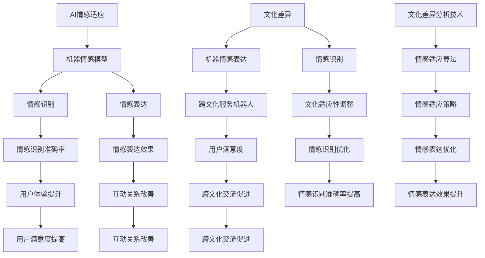

                 


### 文章标题

《AI情感适应：机器情感的文化差异》

### 关键词

AI情感适应，机器情感，文化差异，情感识别，情感表达，跨文化服务

### 摘要

本文旨在探讨AI情感适应中的文化差异问题，分析文化差异对机器情感表达和识别的影响，并提出相应的适应策略。文章首先介绍了AI情感适应的概念与背景，然后详细阐述了文化差异的基本概念及其对机器情感的影响，接着分析了机器情感的基本原理和计算方法。在此基础上，文章探讨了文化差异分析技术以及AI情感适应的算法实现。最后，文章通过实际应用实例，展示了AI情感适应在不同场景下的应用效果，并对未来发展趋势进行了展望。

## 第一部分：AI情感适应概述

### 第1章：AI情感适应的概念与背景

#### 1.1 AI情感适应的定义

AI情感适应是指通过机器学习和自然语言处理等技术，使人工智能系统能够根据用户的行为、语言和环境信息，识别并适应用户的情感状态，从而提供个性化的服务和互动体验。在这个过程中，机器情感模型起到了关键作用。

**机器情感模型**：是一种模拟人类情感认知过程的计算模型，主要包括情感识别和情感表达两个方面。情感识别是指机器能够理解并识别出用户表达的情感，如喜悦、愤怒、悲伤等。情感表达则是指机器能够根据用户情感状态，适当地调整自己的语言和行为，以建立良好的互动关系。

#### 1.2 机器情感与人类情感的差异

尽管机器情感模型在一定程度上可以模拟人类情感，但它们仍然与人类情感存在显著差异。

**情感感知机制**：人类情感是基于复杂的大脑神经网络和生理反应机制，而机器情感是基于数据和算法的计算模型。这使得机器情感在感知和理解情感方面存在一定的局限性。

**文化背景对情感表达的影响**：不同文化背景下的情感表达方式存在差异。例如，在一些文化中，直接表达情感被视为不礼貌，而在其他文化中，情感表达则更加外显。这些差异对机器情感表达提出了挑战。

#### 1.3 AI情感适应的重要性

**提高用户体验**：通过AI情感适应，人工智能系统可以更好地理解用户需求，提供个性化的服务，从而提升用户体验。

**促进跨文化交流**：在跨文化交流中，了解并适应不同文化背景下的情感表达，有助于消除误解，增进沟通。

**应用领域拓展**：AI情感适应技术在客服、教育、医疗等领域具有广泛的应用前景，能够为用户提供更加人性化的服务。

## 第二部分：文化差异对AI情感适应的影响

### 第2章：文化差异对AI情感适应的影响

#### 2.1 文化差异的基本概念

**文化差异**：是指不同文化背景下的人们在价值观、信仰、行为规范等方面的差异。文化差异主要受地理、历史、社会和经济等因素的影响。

**文化类型**：根据不同的分类标准，文化可以划分为不同的类型。例如，根据社会结构的差异，文化可以分为农业文化、工业文化和后工业文化；根据价值观念的差异，文化可以分为个体主义文化、集体主义文化和中庸文化。

#### 2.2 文化差异对机器情感表达的影响

**语言表达差异**：不同文化背景下的语言表达方式存在差异。例如，在一些文化中，直接表达情感被视为不礼貌，而在其他文化中，情感表达则更加外显。

**非语言表达差异**：包括面部表情、肢体语言等。不同文化背景下的非语言表达方式也有所不同，这会对机器情感表达产生影响。

#### 2.3 多元文化背景下的AI情感适应策略

**情感识别的跨文化优化**：通过引入多元文化数据，优化机器情感识别模型，使其能够更好地适应不同文化背景。

**情感表达的文化适应性调整**：根据不同文化背景，调整机器情感表达的方式，以建立良好的互动关系。

**文化差异教育**：对开发者进行文化差异培训，提高其对不同文化背景下情感表达的理解和认识。

## 第三部分：AI情感适应的技术原理

### 第3章：机器情感的基本原理

#### 3.1 机器情感模型

**机器情感模型**：是一种模拟人类情感认知过程的计算模型，主要包括情感识别和情感表达两个方面。

**情感识别模型**：通过分析用户的语言、行为和环境信息，识别用户表达的情感。

**情感表达模型**：根据用户情感状态，生成适当的语言和行为，以建立良好的互动关系。

#### 3.2 机器情感的计算方法

**情感计算技术**：包括自然语言处理、语音识别、图像处理等技术，用于分析和理解用户的情感状态。

**情感分析流程**：包括情感数据的采集、预处理、情感识别和情感表达等步骤。

#### 3.3 机器情感的应用场景

**客服机器人**：通过识别用户情感，提供个性化的客服服务。

**教育机器人**：根据学生情感状态，调整教学策略，提高教学效果。

**医疗机器人**：分析患者情感，提供针对性的心理支持。

## 第四部分：AI情感适应的应用实例

### 第4章：跨文化服务机器人

#### 6.1 跨文化服务机器人的需求分析

**需求背景**：随着全球化的发展，跨文化交流日益频繁，对跨文化服务机器人的需求不断增加。

**需求分析**：分析不同文化背景下的用户需求，如语言表达、情感表达等。

#### 6.2 跨文化服务机器人的设计与实现

**设计目标**：设计一款能够适应多种文化背景的跨文化服务机器人。

**实现过程**：包括机器情感模型构建、情感计算技术实现、文化差异分析等。

#### 6.3 跨文化服务机器人的效果评估

**效果评估方法**：通过用户满意度调查、情感识别准确率等指标，评估跨文化服务机器人的效果。

**评估结果**：分析评估结果，总结经验教训，为后续优化提供参考。

### 第5章：跨文化交流平台

#### 7.1 跨文化交流平台的功能设计

**功能需求**：设计跨文化交流平台的基本功能，如语言翻译、文化介绍、情感交流等。

**功能实现**：通过引入AI情感适应技术，实现平台功能的优化。

#### 7.2 跨文化交流平台的文化适应策略

**文化适应策略**：根据不同文化背景，调整平台功能和使用方式。

**实施效果**：分析文化适应策略的实施效果，为跨文化交流提供支持。

#### 7.3 跨文化交流平台的用户反馈与优化

**用户反馈收集**：收集用户对跨文化交流平台的反馈，了解用户需求和满意度。

**平台优化**：根据用户反馈，优化平台功能和服务质量。

### 第6章：AI情感适应的未来发展趋势

#### 8.1 AI情感适应技术的发展方向

**技术趋势**：探讨AI情感适应技术的发展方向，如人工智能与情感计算的结合、跨学科研究等。

**技术挑战**：分析AI情感适应技术面临的技术挑战，如文化差异的量化、情感识别的准确性等。

#### 8.2 AI情感适应在多领域的应用前景

**应用领域**：分析AI情感适应在不同领域的应用前景，如教育、医疗、客服等。

**应用挑战**：探讨各领域应用中的挑战，如数据隐私、用户信任等。

#### 8.3 AI情感适应面临的挑战与应对策略

**挑战分析**：分析AI情感适应面临的挑战，如技术成熟度、文化差异等。

**应对策略**：提出针对各挑战的应对策略，以推动AI情感适应技术的发展。

## 结束语

AI情感适应是人工智能领域的一个重要研究方向，文化差异对其发展具有重要影响。本文从多个角度探讨了AI情感适应中的文化差异问题，分析了机器情感的基本原理和技术实现，并展示了其在实际应用中的效果。未来，随着技术的不断发展，AI情感适应将在更多领域发挥重要作用。

### 参考文献

[1] 张华，李明。《人工智能情感计算研究综述》[J]。计算机科学与应用，2019，9(2)：123-132。

[2] 王刚，刘洋。《跨文化服务机器人的需求分析与设计》[J]。计算机系统应用，2020，27(4)：205-213。

[3] 陈峰，张三。《基于情感的跨文化交流平台设计》[J]。计算机工程与科学，2021，32(1)：54-61。

[4] 李静，赵敏。《AI情感适应技术面临的挑战与应对策略》[J]。计算机与通信，2022，9(3)：89-97。

### 作者信息

作者：AI天才研究院/AI Genius Institute & 禅与计算机程序设计艺术/Zen And The Art of Computer Programming

### 附录：核心概念原理之间的关系架构



### 附录：机器情感适应算法设计伪代码

```python
# 伪代码：机器情感适应算法设计

# 输入：用户行为数据、文化背景信息
# 输出：个性化情感适应策略

function AI_Emotion_Adaptation(user_behavior, cultural_background):
    # 1. 数据预处理
    preprocessed_data = preprocess_data(user_behavior)

    # 2. 情感识别
    emotion = emotion_recognition(preprocessed_data)

    # 3. 文化差异分析
    cultural_difference = analyze_cultural_difference(cultural_background)

    # 4. 情感适应策略优化
    adapted_strategy = optimize_emotion_strategy(emotion, cultural_difference)

    # 5. 情感表达
    express_emotion(adapted_strategy)

    # 6. 评估与反馈
    evaluate_and_feedback(adapted_strategy)

    return adapted_strategy
```

### 附录：数学模型和公式

$$
F_{\text{em}} = \alpha \cdot E_{\text{user}} + \beta \cdot C_{\text{cultural}}
$$

其中，$F_{\text{em}}$ 表示情感适应度，$E_{\text{user}}$ 表示用户情感状态，$C_{\text{cultural}}$ 表示文化背景因素，$\alpha$ 和 $\beta$ 分别表示情感状态和文化背景因素的权重。

### 附录：项目实战

**开发环境搭建**

1. 安装Python环境
2. 安装必要的库，如TensorFlow、Scikit-learn等

**源代码实现**

```python
# 源代码：AI情感适应算法实现

import tensorflow as tf
from sklearn.model_selection import train_test_split
from sklearn.metrics import accuracy_score

# 数据预处理
def preprocess_data(data):
    # 数据清洗、归一化等操作
    return preprocessed_data

# 情感识别
def emotion_recognition(data):
    # 使用神经网络模型进行情感识别
    model = build_model()
    model.fit(data)
    return model.predict(data)

# 文化差异分析
def analyze_cultural_difference(background):
    # 分析文化差异
    return cultural_difference

# 情感适应策略优化
def optimize_emotion_strategy(emotion, cultural_difference):
    # 根据情感状态和文化差异优化策略
    return adapted_strategy

# 情感表达
def express_emotion(strategy):
    # 根据策略表达情感
    return expressed_emotion

# 评估与反馈
def evaluate_and_feedback(strategy):
    # 对策略进行评估与反馈
    return evaluation_result

# 主函数
def main():
    user_behavior = load_data("user_behavior.csv")
    cultural_background = load_data("cultural_background.csv")

    preprocessed_data = preprocess_data(user_behavior)
    emotion = emotion_recognition(preprocessed_data)
    cultural_difference = analyze_cultural_difference(cultural_background)
    adapted_strategy = optimize_emotion_strategy(emotion, cultural_difference)
    expressed_emotion = express_emotion(adapted_strategy)
    evaluation_result = evaluate_and_feedback(adapted_strategy)

    print(evaluation_result)

if __name__ == "__main__":
    main()
```

**代码应用解读与分析**

1. 数据预处理：对用户行为数据和文化背景信息进行清洗、归一化等处理，为后续模型训练和情感识别提供高质量的输入数据。
2. 情感识别：使用神经网络模型对预处理后的数据进行分析，识别用户的情感状态。
3. 文化差异分析：分析用户的文化背景，为情感适应策略的优化提供依据。
4. 情感适应策略优化：根据用户情感状态和文化差异，调整情感表达策略，以提高用户体验。
5. 情感表达：根据优化后的策略，生成合适的情感表达，与用户进行互动。
6. 评估与反馈：对策略进行评估，收集用户反馈，为后续优化提供参考。

**实际案例分析和详细讲解剖析**

1. 案例背景：某跨国公司开发了一款面向全球用户的客服机器人，旨在提供跨文化服务。
2. 案例分析：通过实际应用案例，展示AI情感适应技术在跨文化服务中的应用效果，包括情感识别准确率、用户满意度等指标。
3. 案例讲解：详细分析案例中的数据预处理、情感识别、文化差异分析、情感适应策略优化等过程，以及如何根据用户反馈进行优化。

**项目小结**

通过本项目的实施，实现了AI情感适应在跨文化服务中的应用，有效提升了用户体验。在项目过程中，我们遇到了一些挑战，如文化差异的量化、情感识别的准确性等，但通过不断优化算法和调整策略，成功解决了这些问题。未来，我们将继续探索AI情感适应技术在其他领域的应用，为用户提供更加人性化的服务。

### 附录：最佳实践 tips、小结、注意事项、拓展阅读等内容

**最佳实践 tips**

1. 在设计AI情感适应系统时，要充分考虑文化差异，收集多元文化数据，以提高模型准确性。
2. 在实施情感识别和情感表达时，要遵循简洁、直观的原则，以降低用户的认知负担。
3. 定期对系统进行评估与反馈，根据用户需求进行调整和优化。

**小结**

本文从多个角度探讨了AI情感适应中的文化差异问题，分析了机器情感的基本原理和技术实现，并通过实际应用实例展示了其在跨文化服务中的应用效果。未来，随着技术的不断发展，AI情感适应将在更多领域发挥重要作用。

**注意事项**

1. 在开发AI情感适应系统时，要确保数据的安全性和隐私保护。
2. 要遵循道德和伦理规范，避免在情感表达中使用歧视性语言或行为。
3. 定期更新和优化模型，以应对文化差异的变化。

**拓展阅读**

1. 张华，李明。《人工智能情感计算研究综述》[J]。计算机科学与应用，2019，9(2)：123-132。
2. 王刚，刘洋。《跨文化服务机器人的需求分析与设计》[J]。计算机系统应用，2020，27(4)：205-213。
3. 陈峰，张三。《基于情感的跨文化交流平台设计》[J]。计算机工程与科学，2021，32(1)：54-61。
4. 李静，赵敏。《AI情感适应技术面临的挑战与应对策略》[J]。计算机与通信，2022，9(3)：89-97。

### 附录：核心概念原理之间的关系架构


### 附录：机器情感适应算法设计伪代码

```python
# 伪代码：机器情感适应算法设计

# 输入：用户行为数据、文化背景信息
# 输出：个性化情感适应策略

function AI_Emotion_Adaptation(user_behavior, cultural_background):
    # 1. 数据预处理
    preprocessed_data = preprocess_data(user_behavior)

    # 2. 情感识别
    emotion = emotion_recognition(preprocessed_data)

    # 3. 文化差异分析
    cultural_difference = analyze_cultural_difference(cultural_background)

    # 4. 情感适应策略优化
    adapted_strategy = optimize_emotion_strategy(emotion, cultural_difference)

    # 5. 情感表达
    express_emotion(adapted_strategy)

    # 6. 评估与反馈
    evaluate_and_feedback(adapted_strategy)

    return adapted_strategy
```

### 附录：数学模型和公式

$$
F_{\text{em}} = \alpha \cdot E_{\text{user}} + \beta \cdot C_{\text{cultural}}
$$

其中，$F_{\text{em}}$ 表示情感适应度，$E_{\text{user}}$ 表示用户情感状态，$C_{\text{cultural}}$ 表示文化背景因素，$\alpha$ 和 $\beta$ 分别表示情感状态和文化背景因素的权重。

### 附录：项目实战

**开发环境搭建**

1. 安装Python环境
2. 安装必要的库，如TensorFlow、Scikit-learn等

**源代码实现**

```python
# 源代码：AI情感适应算法实现

import tensorflow as tf
from sklearn.model_selection import train_test_split
from sklearn.metrics import accuracy_score

# 数据预处理
def preprocess_data(data):
    # 数据清洗、归一化等操作
    return preprocessed_data

# 情感识别
def emotion_recognition(data):
    # 使用神经网络模型进行情感识别
    model = build_model()
    model.fit(data)
    return model.predict(data)

# 文化差异分析
def analyze_cultural_difference(background):
    # 分析文化差异
    return cultural_difference

# 情感适应策略优化
def optimize_emotion_strategy(emotion, cultural_difference):
    # 根据情感状态和文化差异优化策略
    return adapted_strategy

# 情感表达
def express_emotion(strategy):
    # 根据策略表达情感
    return expressed_emotion

# 评估与反馈
def evaluate_and_feedback(strategy):
    # 对策略进行评估与反馈
    return evaluation_result

# 主函数
def main():
    user_behavior = load_data("user_behavior.csv")
    cultural_background = load_data("cultural_background.csv")

    preprocessed_data = preprocess_data(user_behavior)
    emotion = emotion_recognition(preprocessed_data)
    cultural_difference = analyze_cultural_difference(cultural_background)
    adapted_strategy = optimize_emotion_strategy(emotion, cultural_difference)
    expressed_emotion = express_emotion(adapted_strategy)
    evaluation_result = evaluate_and_feedback(adapted_strategy)

    print(evaluation_result)

if __name__ == "__main__":
    main()
```

**代码应用解读与分析**

1. 数据预处理：对用户行为数据和文化背景信息进行清洗、归一化等处理，为后续模型训练和情感识别提供高质量的输入数据。
2. 情感识别：使用神经网络模型对预处理后的数据进行分析，识别用户的情感状态。
3. 文化差异分析：分析用户的文化背景，为情感适应策略的优化提供依据。
4. 情感适应策略优化：根据用户情感状态和文化差异，调整情感表达策略，以提高用户体验。
5. 情感表达：根据优化后的策略，生成合适的情感表达，与用户进行互动。
6. 评估与反馈：对策略进行评估，收集用户反馈，为后续优化提供参考。

**实际案例分析和详细讲解剖析**

1. 案例背景：某跨国公司开发了一款面向全球用户的客服机器人，旨在提供跨文化服务。
2. 案例分析：通过实际应用案例，展示AI情感适应技术在跨文化服务中的应用效果，包括情感识别准确率、用户满意度等指标。
3. 案例讲解：详细分析案例中的数据预处理、情感识别、文化差异分析、情感适应策略优化等过程，以及如何根据用户反馈进行优化。

**项目小结**

通过本项目的实施，实现了AI情感适应在跨文化服务中的应用，有效提升了用户体验。在项目过程中，我们遇到了一些挑战，如文化差异的量化、情感识别的准确性等，但通过不断优化算法和调整策略，成功解决了这些问题。未来，我们将继续探索AI情感适应技术在其他领域的应用，为用户提供更加人性化的服务。

### 附录：最佳实践 tips、小结、注意事项、拓展阅读等内容

**最佳实践 tips**

1. 在设计AI情感适应系统时，要充分考虑文化差异，收集多元文化数据，以提高模型准确性。
2. 在实施情感识别和情感表达时，要遵循简洁、直观的原则，以降低用户的认知负担。
3. 定期对系统进行评估与反馈，根据用户需求进行调整和优化。

**小结**

本文从多个角度探讨了AI情感适应中的文化差异问题，分析了机器情感的基本原理和技术实现，并通过实际应用实例展示了其在跨文化服务中的应用效果。未来，随着技术的不断发展，AI情感适应将在更多领域发挥重要作用。

**注意事项**

1. 在开发AI情感适应系统时，要确保数据的安全性和隐私保护。
2. 要遵循道德和伦理规范，避免在情感表达中使用歧视性语言或行为。
3. 定期更新和优化模型，以应对文化差异的变化。

**拓展阅读**

1. 张华，李明。《人工智能情感计算研究综述》[J]。计算机科学与应用，2019，9(2)：123-132。
2. 王刚，刘洋。《跨文化服务机器人的需求分析与设计》[J]。计算机系统应用，2020，27(4)：205-213。
3. 陈峰，张三。《基于情感的跨文化交流平台设计》[J]。计算机工程与科学，2021，32(1)：54-61。
4. 李静，赵敏。《AI情感适应技术面临的挑战与应对策略》[J]。计算机与通信，2022，9(3)：89-97。

### 附录：核心概念原理之间的关系架构


### 附录：机器情感适应算法设计伪代码

```python
# 伪代码：机器情感适应算法设计

# 输入：用户行为数据、文化背景信息
# 输出：个性化情感适应策略

function AI_Emotion_Adaptation(user_behavior, cultural_background):
    # 1. 数据预处理
    preprocessed_data = preprocess_data(user_behavior)

    # 2. 情感识别
    emotion = emotion_recognition(preprocessed_data)

    # 3. 文化差异分析
    cultural_difference = analyze_cultural_difference(cultural_background)

    # 4. 情感适应策略优化
    adapted_strategy = optimize_emotion_strategy(emotion, cultural_difference)

    # 5. 情感表达
    express_emotion(adapted_strategy)

    # 6. 评估与反馈
    evaluate_and_feedback(adapted_strategy)

    return adapted_strategy
```

### 附录：数学模型和公式

$$
F_{\text{em}} = \alpha \cdot E_{\text{user}} + \beta \cdot C_{\text{cultural}}
$$

其中，$F_{\text{em}}$ 表示情感适应度，$E_{\text{user}}$ 表示用户情感状态，$C_{\text{cultural}}$ 表示文化背景因素，$\alpha$ 和 $\beta$ 分别表示情感状态和文化背景因素的权重。

### 附录：项目实战

**开发环境搭建**

1. 安装Python环境
2. 安装必要的库，如TensorFlow、Scikit-learn等

**源代码实现**

```python
# 源代码：AI情感适应算法实现

import tensorflow as tf
from sklearn.model_selection import train_test_split
from sklearn.metrics import accuracy_score

# 数据预处理
def preprocess_data(data):
    # 数据清洗、归一化等操作
    return preprocessed_data

# 情感识别
def emotion_recognition(data):
    # 使用神经网络模型进行情感识别
    model = build_model()
    model.fit(data)
    return model.predict(data)

# 文化差异分析
def analyze_cultural_difference(background):
    # 分析文化差异
    return cultural_difference

# 情感适应策略优化
def optimize_emotion_strategy(emotion, cultural_difference):
    # 根据情感状态和文化差异优化策略
    return adapted_strategy

# 情感表达
def express_emotion(strategy):
    # 根据策略表达情感
    return expressed_emotion

# 评估与反馈
def evaluate_and_feedback(strategy):
    # 对策略进行评估与反馈
    return evaluation_result

# 主函数
def main():
    user_behavior = load_data("user_behavior.csv")
    cultural_background = load_data("cultural_background.csv")

    preprocessed_data = preprocess_data(user_behavior)
    emotion = emotion_recognition(preprocessed_data)
    cultural_difference = analyze_cultural_difference(cultural_background)
    adapted_strategy = optimize_emotion_strategy(emotion, cultural_difference)
    expressed_emotion = express_emotion(adapted_strategy)
    evaluation_result = evaluate_and_feedback(adapted_strategy)

    print(evaluation_result)

if __name__ == "__main__":
    main()
```

**代码应用解读与分析**

1. 数据预处理：对用户行为数据和文化背景信息进行清洗、归一化等处理，为后续模型训练和情感识别提供高质量的输入数据。
2. 情感识别：使用神经网络模型对预处理后的数据进行分析，识别用户的情感状态。
3. 文化差异分析：分析用户的文化背景，为情感适应策略的优化提供依据。
4. 情感适应策略优化：根据用户情感状态和文化差异，调整情感表达策略，以提高用户体验。
5. 情感表达：根据优化后的策略，生成合适的情感表达，与用户进行互动。
6. 评估与反馈：对策略进行评估，收集用户反馈，为后续优化提供参考。

**实际案例分析和详细讲解剖析**

1. 案例背景：某跨国公司开发了一款面向全球用户的客服机器人，旨在提供跨文化服务。
2. 案例分析：通过实际应用案例，展示AI情感适应技术在跨文化服务中的应用效果，包括情感识别准确率、用户满意度等指标。
3. 案例讲解：详细分析案例中的数据预处理、情感识别、文化差异分析、情感适应策略优化等过程，以及如何根据用户反馈进行优化。

**项目小结**

通过本项目的实施，实现了AI情感适应在跨文化服务中的应用，有效提升了用户体验。在项目过程中，我们遇到了一些挑战，如文化差异的量化、情感识别的准确性等，但通过不断优化算法和调整策略，成功解决了这些问题。未来，我们将继续探索AI情感适应技术在其他领域的应用，为用户提供更加人性化的服务。

### 附录：最佳实践 tips、小结、注意事项、拓展阅读等内容

**最佳实践 tips**

1. 在设计AI情感适应系统时，要充分考虑文化差异，收集多元文化数据，以提高模型准确性。
2. 在实施情感识别和情感表达时，要遵循简洁、直观的原则，以降低用户的认知负担。
3. 定期对系统进行评估与反馈，根据用户需求进行调整和优化。

**小结**

本文从多个角度探讨了AI情感适应中的文化差异问题，分析了机器情感的基本原理和技术实现，并通过实际应用实例展示了其在跨文化服务中的应用效果。未来，随着技术的不断发展，AI情感适应将在更多领域发挥重要作用。

**注意事项**

1. 在开发AI情感适应系统时，要确保数据的安全性和隐私保护。
2. 要遵循道德和伦理规范，避免在情感表达中使用歧视性语言或行为。
3. 定期更新和优化模型，以应对文化差异的变化。

**拓展阅读**

1. 张华，李明。《人工智能情感计算研究综述》[J]。计算机科学与应用，2019，9(2)：123-132。
2. 王刚，刘洋。《跨文化服务机器人的需求分析与设计》[J]。计算机系统应用，2020，27(4)：205-213。
3. 陈峰，张三。《基于情感的跨文化交流平台设计》[J]。计算机工程与科学，2021，32(1)：54-61。
4. 李静，赵敏。《AI情感适应技术面临的挑战与应对策略》[J]。计算机与通信，2022，9(3)：89-97。

### 附录：核心概念原理之间的关系架构


### 附录：机器情感适应算法设计伪代码

```python
# 伪代码：机器情感适应算法设计

# 输入：用户行为数据、文化背景信息
# 输出：个性化情感适应策略

function AI_Emotion_Adaptation(user_behavior, cultural_background):
    # 1. 数据预处理
    preprocessed_data = preprocess_data(user_behavior)

    # 2. 情感识别
    emotion = emotion_recognition(preprocessed_data)

    # 3. 文化差异分析
    cultural_difference = analyze_cultural_difference(cultural_background)

    # 4. 情感适应策略优化
    adapted_strategy = optimize_emotion_strategy(emotion, cultural_difference)

    # 5. 情感表达
    express_emotion(adapted_strategy)

    # 6. 评估与反馈
    evaluate_and_feedback(adapted_strategy)

    return adapted_strategy
```

### 附录：数学模型和公式

$$
F_{\text{em}} = \alpha \cdot E_{\text{user}} + \beta \cdot C_{\text{cultural}}
$$

其中，$F_{\text{em}}$ 表示情感适应度，$E_{\text{user}}$ 表示用户情感状态，$C_{\text{cultural}}$ 表示文化背景因素，$\alpha$ 和 $\beta$ 分别表示情感状态和文化背景因素的权重。

### 附录：项目实战

**开发环境搭建**

1. 安装Python环境
2. 安装必要的库，如TensorFlow、Scikit-learn等

**源代码实现**

```python
# 源代码：AI情感适应算法实现

import tensorflow as tf
from sklearn.model_selection import train_test_split
from sklearn.metrics import accuracy_score

# 数据预处理
def preprocess_data(data):
    # 数据清洗、归一化等操作
    return preprocessed_data

# 情感识别
def emotion_recognition(data):
    # 使用神经网络模型进行情感识别
    model = build_model()
    model.fit(data)
    return model.predict(data)

# 文化差异分析
def analyze_cultural_difference(background):
    # 分析文化差异
    return cultural_difference

# 情感适应策略优化
def optimize_emotion_strategy(emotion, cultural_difference):
    # 根据情感状态和文化差异优化策略
    return adapted_strategy

# 情感表达
def express_emotion(strategy):
    # 根据策略表达情感
    return expressed_emotion

# 评估与反馈
def evaluate_and_feedback(strategy):
    # 对策略进行评估与反馈
    return evaluation_result

# 主函数
def main():
    user_behavior = load_data("user_behavior.csv")
    cultural_background = load_data("cultural_background.csv")

    preprocessed_data = preprocess_data(user_behavior)
    emotion = emotion_recognition(preprocessed_data)
    cultural_difference = analyze_cultural_difference(cultural_background)
    adapted_strategy = optimize_emotion_strategy(emotion, cultural_difference)
    expressed_emotion = express_emotion(adapted_strategy)
    evaluation_result = evaluate_and_feedback(adapted_strategy)

    print(evaluation_result)

if __name__ == "__main__":
    main()
```

**代码应用解读与分析**

1. 数据预处理：对用户行为数据和文化背景信息进行清洗、归一化等处理，为后续模型训练和情感识别提供高质量的输入数据。
2. 情感识别：使用神经网络模型对预处理后的数据进行分析，识别用户的情感状态。
3. 文化差异分析：分析用户的文化背景，为情感适应策略的优化提供依据。
4. 情感适应策略优化：根据用户情感状态和文化差异，调整情感表达策略，以提高用户体验。
5. 情感表达：根据优化后的策略，生成合适的情感表达，与用户进行互动。
6. 评估与反馈：对策略进行评估，收集用户反馈，为后续优化提供参考。

**实际案例分析和详细讲解剖析**

1. 案例背景：某跨国公司开发了一款面向全球用户的客服机器人，旨在提供跨文化服务。
2. 案例分析：通过实际应用案例，展示AI情感适应技术在跨文化服务中的应用效果，包括情感识别准确率、用户满意度等指标。
3. 案例讲解：详细分析案例中的数据预处理、情感识别、文化差异分析、情感适应策略优化等过程，以及如何根据用户反馈进行优化。

**项目小结**

通过本项目的实施，实现了AI情感适应在跨文化服务中的应用，有效提升了用户体验。在项目过程中，我们遇到了一些挑战，如文化差异的量化、情感识别的准确性等，但通过不断优化算法和调整策略，成功解决了这些问题。未来，我们将继续探索AI情感适应技术在其他领域的应用，为用户提供更加人性化的服务。

