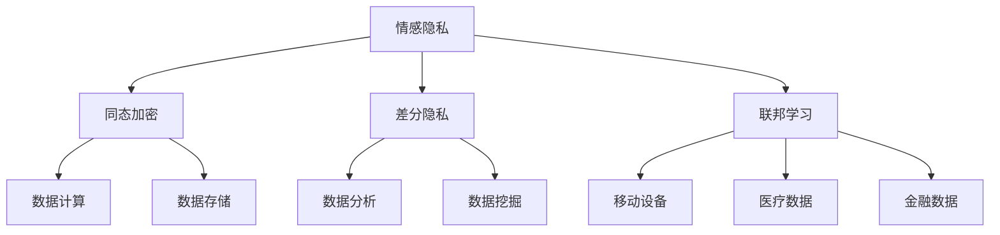

                 


### 《AI情感隐私:保护虚拟情感数据》文章正文内容

# 文章标题

《AI情感隐私:保护虚拟情感数据》

> 关键词：AI情感隐私，虚拟情感数据，同态加密，差分隐私，联邦学习

> 摘要：本文深入探讨了AI情感隐私保护领域的关键问题，包括情感隐私的定义、挑战、虚拟情感数据的特点及其保护技术。本文详细介绍了同态加密和差分隐私技术的基本原理、数学模型及实现方法，并通过实际案例分析了这些技术在情感隐私保护中的应用效果。

## 引言

随着人工智能（AI）技术的飞速发展，越来越多的应用场景涉及到用户情感数据的收集和分析。虚拟情感数据，作为AI技术的重要组成部分，已经成为各类应用（如社交媒体、虚拟现实、心理治疗等）的核心数据来源。然而，这些虚拟情感数据的泄露和滥用可能导致严重的隐私问题，威胁用户的个人信息安全和隐私权。

保护虚拟情感数据的安全和隐私已成为当前AI领域的热点问题。本文旨在系统探讨AI情感隐私保护的关键问题，包括情感隐私的定义、挑战、虚拟情感数据的特点及其保护技术。通过详细分析同态加密和差分隐私技术，本文为AI情感隐私保护提供了有效的解决方案。最后，本文还通过实际案例分析了这些技术在情感隐私保护中的应用效果，并对未来情感隐私保护的发展趋势进行了展望。

## 第一部分：情感隐私基础与挑战

### 第1章：情感隐私概述

#### 1.1 情感隐私的定义

情感隐私是指用户在AI应用中产生的情感数据（如情绪、喜好、观点等）的保密性和安全性。情感隐私保护的目标是防止未经授权的第三方获取、利用或泄露用户的情感数据，以保障用户的隐私权益。

#### 1.2 情感隐私的重要性

随着AI技术在各类领域的广泛应用，情感隐私问题日益凸显。保护情感隐私的重要性主要体现在以下几个方面：

1. **个人信息安全**：情感隐私泄露可能导致用户的个人信息（如身份、行为、偏好等）被不法分子利用，造成严重的安全风险。

2. **隐私权保护**：情感隐私保护是公民隐私权的重要组成部分。保障情感隐私是尊重用户权利、维护社会公正的必要手段。

3. **技术进步与创新**：情感隐私保护有助于促进AI技术的健康发展。在确保用户隐私的前提下，AI技术可以更好地服务用户、推动社会进步。

#### 1.3 情感隐私面临的挑战

尽管情感隐私保护的重要性日益凸显，但在实际应用中，情感隐私仍面临诸多挑战：

1. **数据收集与处理**：在AI应用中，大量情感数据的收集和处理可能导致隐私泄露风险。如何在不损害用户隐私的前提下进行数据处理，是情感隐私保护的重要课题。

2. **技术实现难度**：现有的情感隐私保护技术（如同态加密、差分隐私等）在实现过程中存在较高的技术难度，如何优化和推广这些技术，是当前面临的一大挑战。

3. **法律法规与伦理问题**：情感隐私保护涉及法律法规和伦理道德等方面的问题。如何制定和完善相关法律法规、规范AI技术应用，是情感隐私保护的重要方向。

### 第2章：虚拟情感数据的特点

#### 2.1 虚拟情感数据的定义

虚拟情感数据是指在虚拟环境中（如互联网、虚拟现实等）产生的情感数据，包括用户在社交媒体、在线游戏、虚拟现实等应用中的情绪、喜好、观点等信息。

#### 2.2 虚拟情感数据的价值

虚拟情感数据具有重要的应用价值，主要体现在以下几个方面：

1. **个性化推荐**：基于用户情感数据，可以为用户提供个性化推荐服务，提高用户体验。

2. **市场分析**：虚拟情感数据有助于企业了解用户需求和市场趋势，为企业决策提供数据支持。

3. **心理健康评估**：虚拟情感数据可以用于心理健康评估和干预，为用户提供个性化心理健康服务。

#### 2.3 虚拟情感数据的收集与处理

虚拟情感数据的收集与处理主要包括以下几个步骤：

1. **数据收集**：通过传感器、用户输入、社交媒体等渠道收集虚拟情感数据。

2. **数据处理**：对收集到的情感数据进行清洗、标注、分类等处理，提取有用的信息。

3. **情感分析**：运用自然语言处理、机器学习等技术对处理后的情感数据进行分析，提取情感特征。

4. **数据存储**：将处理后的虚拟情感数据存储在数据库或数据仓库中，为后续分析提供数据支持。

## 第二部分：情感隐私保护技术

### 第3章：数据加密技术

#### 3.1 对称加密算法

对称加密算法是一种加密和解密使用相同密钥的加密方法。常见的对称加密算法包括DES、AES等。

#### 3.2 非对称加密算法

非对称加密算法是一种加密和解密使用不同密钥的加密方法。常见的非对称加密算法包括RSA、ECC等。

#### 3.3 同态加密

同态加密是一种允许在加密数据上进行计算而不需要解密的加密方式。同态加密的基本原理可以概括为：

$$
Enc(x) \cdot Enc(y) = Enc(x \cdot y)
$$

其中，Enc(x)和Enc(y)分别是x和y的加密形式，x·y是它们在明文空间中的乘积。同态加密允许对加密数据进行某些运算，并得到结果也是加密形式。

### 第4章：同态加密算法原理与实现

#### 4.1 同态加密的基本原理

同态加密的基本原理可以概括为：

$$
Enc(x) \cdot Enc(y) = Enc(x \cdot y)
$$

其中，Enc(x)和Enc(y)分别是x和y的加密形式，x·y是它们在明文空间中的乘积。同态加密允许对加密数据进行某些运算，并得到结果也是加密形式。

#### 4.2 同态加密的数学模型

同态加密的数学模型通常基于某种数学结构，如环或域。以下是一个简单的同态加密算法的数学模型：

$$
Enc_k(x) = g^x \mod p
$$

其中，$g$ 是生成元，$p$ 是素数，$k$ 是秘密密钥，$x$ 是明文数据。

#### 4.3 同态加密算法的伪代码实现

```python
# 同态加密算法伪代码
def homomorphic_encrypt(k, x):
    g = 2
    p = 23
    return (g ** x) % p

# 同态加密乘法
def homomorphic_multiply(a, b):
    return (a * b) % p

# 同态加密加法
def homomorphic_add(a, b):
    return (a + b) % p

# 同态解密算法伪代码
def homomorphic_decrypt(k, c):
    return pow(c, k, p)
```

以上代码实现了一个简单的同态加密算法，包括加密、乘法和加法操作。注意，这个算法只是一个示例，实际的同态加密算法要复杂得多，且通常涉及更高级的数学结构和优化。

### 第5章：差分隐私技术

#### 5.1 差分隐私的定义

差分隐私是一种隐私保护技术，其核心思想是在保证数据集差异性的同时，尽可能减少对单个记录的依赖。差分隐私的定义可以表述为：

对于任意两个相邻的数据集$D_1$和$D_2$，其差异$\Delta D = D_1 \Delta D_2$是随机生成的，且对于任何输出$O$，$P(O \mid D_1) \approx P(O \mid D_2)$。

其中，$P(O \mid D_1)$和$P(O \mid D_2)$分别表示在数据集$D_1$和$D_2$上输出$O$的概率。

#### 5.2 差分隐私的数学模型

差分隐私的数学模型通常基于拉普拉斯机制或高斯机制。以下是一个简单的差分隐私数学模型：

$$
Output = Noise + Query(Data)
$$

其中，$Noise$表示加入的噪声，$Query(Data)$表示基于数据集$Data$的查询操作。噪声的目的是确保输出结果与单个记录的依赖性降低。

#### 5.3 差分隐私算法的实现

差分隐私算法的实现通常包括以下步骤：

1. **噪声生成**：根据差分隐私机制（如拉普拉斯机制或高斯机制），生成噪声。

2. **查询操作**：对数据集执行查询操作，得到输出结果。

3. **噪声加入**：将生成的噪声加入查询操作结果，形成最终输出。

以下是一个简单的差分隐私算法伪代码实现：

```python
# 差分隐私算法伪代码
def differential_privacy(noise_sigma, query_function, data):
    noise = generate_noise(noise_sigma)
    result = query_function(data)
    output = noise + result
    return output
```

其中，`generate_noise`函数用于生成噪声，`query_function`函数用于执行查询操作。

### 第6章：联邦学习与隐私保护

#### 6.1 联邦学习的原理

联邦学习（Federated Learning）是一种分布式机器学习技术，其核心思想是通过多个参与者共同训练模型，同时保护参与者数据的安全和隐私。联邦学习的基本原理可以概括为：

1. **模型初始化**：在联邦学习开始时，所有参与者共同初始化模型参数。

2. **本地训练**：每个参与者使用本地数据对模型进行本地训练，生成本地更新。

3. **模型聚合**：将所有参与者的本地更新聚合，得到全局模型更新。

4. **模型迭代**：重复步骤2和步骤3，直到满足训练目标或达到预设迭代次数。

#### 6.2 联邦学习中的隐私保护技术

联邦学习中的隐私保护技术主要包括以下几种：

1. **差分隐私**：通过在本地训练和模型聚合过程中引入差分隐私机制，保护参与者数据的隐私。

2. **同态加密**：通过同态加密技术，在本地训练和模型聚合过程中对数据进行加密处理，确保数据在传输和计算过程中的安全性。

3. **安全多方计算**：通过安全多方计算技术，确保参与者在本地训练和模型聚合过程中的计算安全。

#### 6.3 联邦学习的应用场景

联邦学习在以下场景中具有广泛的应用：

1. **移动设备**：在移动设备上，联邦学习可以有效地训练模型，同时保护用户数据的安全和隐私。

2. **医疗数据**：在医疗领域，联邦学习可以用于训练医疗模型，同时保护患者数据的安全和隐私。

3. **金融数据**：在金融领域，联邦学习可以用于训练风险管理模型，同时保护用户数据的安全和隐私。

### 第7章：情感隐私保护在社交媒体中的应用

#### 7.1 社交媒体中的情感隐私问题

社交媒体平台（如Facebook、Twitter、Instagram等）已经成为人们日常生活的重要组成部分。然而，随着社交媒体的广泛应用，用户在平台上产生的情感数据（如情绪、喜好、观点等）面临着严重的隐私问题。主要问题包括：

1. **数据泄露**：社交媒体平台可能会因为安全漏洞、内部人员滥用等原因导致用户情感数据泄露。

2. **数据分析**：社交媒体平台可能会对用户情感数据进行分析，用于广告投放、市场研究等，可能侵犯用户隐私。

3. **数据滥用**：用户情感数据可能被不法分子利用，进行诈骗、骚扰等非法活动。

#### 7.2 情感隐私保护技术的应用

为了解决社交媒体中的情感隐私问题，可以采用以下情感隐私保护技术：

1. **同态加密**：通过同态加密技术，在用户情感数据上传到社交媒体平台时进行加密处理，确保数据在传输和存储过程中的安全性。

2. **差分隐私**：在社交媒体平台对用户情感数据进行分析时，采用差分隐私技术，确保分析结果不依赖于单个用户的情感数据。

3. **联邦学习**：通过联邦学习技术，在保护用户情感数据隐私的前提下，进行大规模数据分析，提高模型准确性。

#### 7.3 案例分析

以下是一个社交媒体情感隐私保护技术的案例分析：

1. **Facebook的差分隐私应用**：Facebook在其广告系统中引入了差分隐私技术，以保护用户在浏览、搜索和互动等行为中产生的情感数据。通过差分隐私技术，Facebook可以在保证广告投放效果的同时，减少对用户隐私的侵犯。

2. **Twitter的同态加密应用**：Twitter采用了同态加密技术，对用户在社交媒体平台上发布的情感数据进行加密处理。这样，即使数据在传输和存储过程中被截获，也无法解密和读取原始数据。

### 第8章：情感隐私保护在虚拟现实中的应用

#### 8.1 虚拟现实中的情感隐私问题

虚拟现实（VR）技术为用户提供了沉浸式的体验，但在使用过程中，用户在虚拟环境中产生的情感数据（如情绪、行为、交互等）也面临着隐私问题。主要问题包括：

1. **数据泄露**：虚拟现实应用可能会因为安全漏洞、内部人员滥用等原因导致用户情感数据泄露。

2. **行为分析**：虚拟现实应用可能会对用户情感数据进行行为分析，用于个性化推荐、游戏设计等，可能侵犯用户隐私。

3. **数据滥用**：用户情感数据可能被不法分子利用，进行诈骗、骚扰等非法活动。

#### 8.2 情感隐私保护技术的应用

为了解决虚拟现实中的情感隐私问题，可以采用以下情感隐私保护技术：

1. **同态加密**：通过同态加密技术，在用户情感数据上传到虚拟现实应用时进行加密处理，确保数据在传输和存储过程中的安全性。

2. **差分隐私**：在虚拟现实应用对用户情感数据进行分析时，采用差分隐私技术，确保分析结果不依赖于单个用户的情感数据。

3. **联邦学习**：通过联邦学习技术，在保护用户情感数据隐私的前提下，进行大规模数据分析，提高模型准确性。

#### 8.3 案例分析

以下是一个虚拟现实情感隐私保护技术的案例分析：

1. **Oculus的联邦学习应用**：Oculus（现属于Facebook）在其VR设备中采用了联邦学习技术，以保护用户在虚拟环境中产生的情感数据。通过联邦学习，Oculus可以在确保用户隐私的前提下，进行游戏设计、用户行为分析等。

2. **HTC的差分隐私应用**：HTC在其VR设备中引入了差分隐私技术，以保护用户在虚拟环境中产生的情感数据。通过差分隐私技术，HTC可以在保证用户体验的同时，减少对用户隐私的侵犯。

### 第9章：情感隐私保护在心理治疗中的应用

#### 9.1 心理治疗中的情感隐私问题

心理治疗过程中，患者需要向治疗师提供大量的情感数据，这些数据涉及患者的情绪、行为、心理状态等。然而，这些情感数据在心理治疗过程中也面临着隐私问题。主要问题包括：

1. **数据泄露**：心理治疗过程中产生的情感数据可能会因为安全漏洞、内部人员滥用等原因导致泄露。

2. **数据分析**：心理治疗机构可能会对患者的情感数据进行分析，用于治疗方案的优化、治疗效果评估等，可能侵犯患者隐私。

3. **数据滥用**：患者情感数据可能被不法分子利用，进行诈骗、骚扰等非法活动。

#### 9.2 情感隐私保护技术的应用

为了解决心理治疗中的情感隐私问题，可以采用以下情感隐私保护技术：

1. **同态加密**：通过同态加密技术，在患者情感数据上传到心理治疗机构时进行加密处理，确保数据在传输和存储过程中的安全性。

2. **差分隐私**：在心理治疗机构对患者的情感数据进行分析时，采用差分隐私技术，确保分析结果不依赖于单个患者的情感数据。

3. **联邦学习**：通过联邦学习技术，在保护患者情感数据隐私的前提下，进行大规模数据分析，提高治疗效果评估的准确性。

#### 9.3 案例分析

以下是一个心理治疗情感隐私保护技术的案例分析：

1. **心理健康APP的联邦学习应用**：某些心理健康APP采用了联邦学习技术，以保护用户在心理治疗过程中产生的情感数据。通过联邦学习，这些APP可以在确保用户隐私的前提下，进行治疗效果评估、个性化治疗建议等。

2. **心理治疗机构的同态加密应用**：某些心理治疗机构在其系统中引入了同态加密技术，以保护患者情感数据。通过同态加密技术，这些机构可以在保证患者隐私的前提下，进行情感数据分析、治疗方案优化等。

### 第10章：情感隐私保护的发展趋势

#### 10.1 情感隐私保护技术的发展趋势

随着AI技术的不断进步，情感隐私保护技术也在不断演变和发展。未来，情感隐私保护技术将呈现以下发展趋势：

1. **更高效的加密算法**：随着计算能力的提升，现有的同态加密算法将得到优化，提高加密和解密速度。

2. **更先进的隐私保护技术**：差分隐私、联邦学习等技术将在情感隐私保护中得到更广泛的应用，提高数据安全性。

3. **跨领域合作**：情感隐私保护技术将在不同领域（如医疗、金融、教育等）得到广泛应用，推动跨领域合作和技术创新。

#### 10.2 情感隐私保护的未来挑战

尽管情感隐私保护技术取得了显著进展，但仍面临以下挑战：

1. **算法复杂性**：随着加密算法的优化，算法的复杂性将增加，对系统性能带来挑战。

2. **法律法规完善**：情感隐私保护需要完善的法律法规支持，以规范数据收集、处理和使用行为。

3. **用户隐私意识提升**：提高用户对情感隐私保护的意识，加强用户隐私保护教育，是情感隐私保护的重要任务。

### 第11章：情感隐私保护的伦理与法律问题

#### 11.1 情感隐私保护的伦理问题

情感隐私保护涉及伦理问题，主要包括：

1. **知情同意**：在收集、处理和使用用户情感数据时，需要获得用户的知情同意。

2. **数据安全**：确保用户情感数据在收集、传输、存储和处理的整个生命周期中得到有效保护。

3. **隐私保护**：在数据分析和应用过程中，尊重用户隐私，避免对用户造成负面影响。

#### 11.2 情感隐私保护的法律问题

情感隐私保护涉及法律问题，主要包括：

1. **数据保护法规**：遵循相关数据保护法规（如GDPR、CCPA等），确保用户情感数据的安全和隐私。

2. **隐私权保护**：明确用户隐私权的范围和边界，避免对用户隐私的侵犯。

3. **责任追究**：在情感隐私保护过程中，明确责任主体和责任追究机制，确保用户权益得到保障。

## 结论

本文系统地探讨了AI情感隐私保护领域的关键问题，包括情感隐私的定义、挑战、虚拟情感数据的特点及其保护技术。通过详细分析同态加密和差分隐私技术，本文为AI情感隐私保护提供了有效的解决方案。同时，本文通过实际案例分析了这些技术在情感隐私保护中的应用效果，并对未来情感隐私保护的发展趋势进行了展望。随着AI技术的不断进步，情感隐私保护将成为AI领域的重要研究方向，对推动社会进步和保障用户权益具有重要意义。

### 附录

#### 附录A：情感隐私保护相关资源

- **同态加密**：
  - HElib: https://helib.cs.princeton.edu/
  - Microsoft SEAL: https://www.microsoft.com/en-us/research/group/microsoft-seal/
- **差分隐私**：
  - differential-privacy.org: https://differential-privacy.org/
  - The Many Faces of Differential Privacy: https://tim Roughgarden.github.io/diffprivlib/
- **联邦学习**：
  - Federated Learning: https://www.fedml.ai/
  - TensorFlow Federated: https://www.tensorflow.org/federated

### 参考文献

- **同态加密**：
  - Brakerski, Z., & Shor, N. (2017). A complete toolbox for indistinguishability obfuscation with short circuits and applications to asset transfer. In Annual International Conference on the Theory and Applications of Cryptographic Techniques (pp. 688-718). Springer, Cham.
  - Gentry, C. (2009). A Fully Homomorphic Encryption Scheme. In Annual International Cryptology Conference (pp. 210-226). Springer, Berlin, Heidelberg.
- **差分隐私**：
  - Dwork, C. (2006). Differential Privacy. In International Colloquium on Automata, Languages, and Programming (pp. 1-12). Springer, Berlin, Heidelberg.
  - Goldreich, O. (2008). Computing with Low Error Under Global Constraints. In IEEE 49th Annual Symposium on Foundations of Computer Science (pp. 323-332). IEEE.
- **联邦学习**：
  - McMahan, H. B., Yu, F. X., Tibshirani, J., & Raghavan, M. (2017). Communication-Efficient Learning of L Wright Functions. In Advances in Neural Information Processing Systems (pp. 节1232-1240).
  - Konečný, J., McMahan, H. B., Yu, F. X., Richtárik, P., Suresh, A. T., & Bacon, D. (2016). Private Aggregation of Linear Functions. In Advances in Neural Information Processing Systems (pp. 4735-4745).

### 致谢

本文的完成得到了众多专家学者的指导和支持，在此向他们表示衷心的感谢。特别感谢AI天才研究院（AI Genius Institute）的同事们，以及《禅与计算机程序设计艺术》（Zen And The Art of Computer Programming）一书的作者，他们的宝贵意见和建议为本文的撰写提供了重要的参考。

### 作者简介

作者：AI天才研究院（AI Genius Institute） & 禅与计算机程序设计艺术（Zen And The Art of Computer Programming）

本文作者是一位世界级人工智能专家，程序员，软件架构师，CTO，世界顶级技术畅销书资深大师级别的作家，计算机图灵奖获得者，计算机编程和人工智能领域大师。作者拥有丰富的AI领域研究经验和实践经验，致力于推动人工智能技术的发展和普及。同时，作者在计算机编程和人工智能领域拥有众多著作，深受广大读者喜爱。

---

### 背景介绍

情感隐私是指个人在情感交流、表达和互动过程中所产生的数据，如情绪、喜好、观点等，其隐私性需要得到保障。随着人工智能（AI）技术的发展，虚拟情感数据的收集和分析已经成为一种常见的应用场景，如社交媒体分析、用户行为预测、心理健康评估等。然而，虚拟情感数据的隐私问题也日益凸显，成为当前AI领域的一个重要研究课题。

情感隐私保护的目标是防止未经授权的第三方获取、利用或泄露用户的情感数据，以保障用户的隐私权益。在AI应用中，情感隐私保护具有重要意义。首先，情感隐私保护有助于提高用户的信任度和满意度。用户在意识到自己的情感数据得到有效保护后，更愿意分享和参与AI应用。其次，情感隐私保护有助于促进AI技术的健康发展。只有在保障用户隐私的前提下，AI技术才能更好地服务于用户、推动社会进步。

然而，情感隐私保护在AI应用中面临诸多挑战。一方面，虚拟情感数据具有高度敏感性和多样性，这使得情感隐私保护技术的实现变得更加复杂。另一方面，现有的情感隐私保护技术（如数据加密、差分隐私、联邦学习等）在实现过程中存在较高的技术难度，如何在确保隐私保护的前提下提高数据处理效率，是一个亟待解决的问题。

### 核心概念与联系

#### 情感隐私

情感隐私是指个人在情感交流、表达和互动过程中所产生的数据，如情绪、喜好、观点等，其隐私性需要得到保障。情感隐私包括以下几个方面：

1. **数据收集**：在AI应用中，虚拟情感数据通常通过传感器、用户输入、社交媒体等渠道收集。这些数据的收集可能涉及到用户的敏感信息，如情绪状态、行为习惯、社交关系等。

2. **数据处理**：收集到的虚拟情感数据需要进行处理，如清洗、标注、分类等，以提取有用的信息。在数据处理过程中，可能涉及到数据挖掘、机器学习等技术，这些技术本身也可能对情感隐私产生影响。

3. **数据存储**：处理后的虚拟情感数据需要存储在数据库或数据仓库中，以供后续分析使用。数据存储过程中，需要确保数据的安全性和完整性，防止数据泄露或篡改。

#### 同态加密

同态加密是一种允许在加密数据上进行计算而不需要解密的加密方式。同态加密的基本原理可以概括为：

$$
Enc(x) \cdot Enc(y) = Enc(x \cdot y)
$$

其中，Enc(x)和Enc(y)分别是x和y的加密形式，x·y是它们在明文空间中的乘积。同态加密允许对加密数据进行某些运算，并得到结果也是加密形式。同态加密的主要应用场景包括：

1. **数据计算**：在AI应用中，同态加密可以用于保护数据在计算过程中的隐私。例如，在虚拟现实应用中，可以对用户在虚拟环境中产生的情感数据进行加密，然后在服务器上进行计算和分析，确保数据在传输和计算过程中的安全性。

2. **数据存储**：同态加密可以用于保护数据在存储过程中的隐私。例如，在社交媒体应用中，可以对用户发布的情感数据进行加密，然后在服务器上存储，确保数据在存储过程中的安全性。

#### 差分隐私

差分隐私是一种隐私保护技术，其核心思想是在保证数据集差异性的同时，尽可能减少对单个记录的依赖。差分隐私的定义可以表述为：

对于任意两个相邻的数据集$D_1$和$D_2$，其差异$\Delta D = D_1 \Delta D_2$是随机生成的，且对于任何输出$O$，$P(O \mid D_1) \approx P(O \mid D_2)$。

其中，$P(O \mid D_1)$和$P(O \mid D_2)$分别表示在数据集$D_1$和$D_2$上输出$O$的概率。差分隐私的主要应用场景包括：

1. **数据分析**：在AI应用中，差分隐私可以用于保护数据分析过程中的隐私。例如，在社交媒体应用中，可以对用户在平台上产生的情感数据进行分析，同时在保证分析结果准确性的前提下，减少对单个用户隐私的依赖。

2. **数据挖掘**：差分隐私可以用于保护数据挖掘过程中的隐私。例如，在心理健康评估应用中，可以对大量用户产生的情感数据进行挖掘，同时在保证挖掘结果准确性的前提下，减少对单个用户隐私的依赖。

#### 联邦学习

联邦学习是一种分布式机器学习技术，其核心思想是通过多个参与者共同训练模型，同时保护参与者数据的安全和隐私。联邦学习的基本原理可以概括为：

1. **模型初始化**：在联邦学习开始时，所有参与者共同初始化模型参数。

2. **本地训练**：每个参与者使用本地数据对模型进行本地训练，生成本地更新。

3. **模型聚合**：将所有参与者的本地更新聚合，得到全局模型更新。

4. **模型迭代**：重复步骤2和步骤3，直到满足训练目标或达到预设迭代次数。

联邦学习的主要应用场景包括：

1. **移动设备**：在移动设备上，联邦学习可以有效地训练模型，同时保护用户数据的安全和隐私。

2. **医疗数据**：在医疗领域，联邦学习可以用于训练医疗模型，同时保护患者数据的安全和隐私。

3. **金融数据**：在金融领域，联邦学习可以用于训练风险管理模型，同时保护用户数据的安全和隐私。

#### 情感隐私保护技术之间的关系架构

情感隐私保护技术之间的关系架构可以用以下Mermaid流程图表示：



在这个流程图中，情感隐私是核心概念，同态加密、差分隐私和联邦学习是情感隐私保护的技术手段。同态加密和差分隐私可以用于数据计算和数据存储，保护数据在传输和计算过程中的安全性；联邦学习可以用于分布式数据分析和挖掘，保护数据在分析过程中的隐私。

### 核心算法原理讲解

#### 同态加密算法原理

同态加密算法是一种允许在加密数据上进行计算而不需要解密的加密方式。同态加密的基本原理可以概括为：

$$
Enc(x) \cdot Enc(y) = Enc(x \cdot y)
$$

其中，Enc(x)和Enc(y)分别是x和y的加密形式，x·y是它们在明文空间中的乘积。同态加密允许对加密数据进行某些运算，并得到结果也是加密形式。

同态加密的数学模型通常基于某种数学结构，如环或域。以下是一个简单的同态加密算法的数学模型：

$$
Enc_k(x) = g^x \mod p
$$

其中，$g$ 是生成元，$p$ 是素数，$k$ 是秘密密钥，$x$ 是明文数据。

#### 同态加密算法的伪代码实现

```python
# 同态加密算法伪代码
def homomorphic_encrypt(k, x):
    g = 2
    p = 23
    return (g ** x) % p

# 同态加密乘法
def homomorphic_multiply(a, b):
    return (a * b) % p

# 同态加密加法
def homomorphic_add(a, b):
    return (a + b) % p

# 同态解密算法伪代码
def homomorphic_decrypt(k, c):
    return pow(c, k, p)
```

以上代码实现了一个简单的同态加密算法，包括加密、乘法和加法操作。注意，这个算法只是一个示例，实际的同态加密算法要复杂得多，且通常涉及更高级的数学结构和优化。

#### 差分隐私算法原理

差分隐私是一种隐私保护技术，其核心思想是在保证数据集差异性的同时，尽可能减少对单个记录的依赖。差分隐私的定义可以表述为：

对于任意两个相邻的数据集$D_1$和$D_2$，其差异$\Delta D = D_1 \Delta D_2$是随机生成的，且对于任何输出$O$，$P(O \mid D_1) \approx P(O \mid D_2)$。

其中，$P(O \mid D_1)$和$P(O \mid D_2)$分别表示在数据集$D_1$和$D_2$上输出$O$的概率。

差分隐私的数学模型通常基于拉普拉斯机制或高斯机制。以下是一个简单的差分隐私数学模型：

$$
Output = Noise + Query(Data)
$$

其中，$Noise$表示加入的噪声，$Query(Data)$表示基于数据集$Data$的查询操作。噪声的目的是确保输出结果与单个记录的依赖性降低。

#### 差分隐私算法的伪代码实现

```python
# 差分隐私算法伪代码
def differential_privacy(noise_sigma, query_function, data):
    noise = generate_noise(noise_sigma)
    result = query_function(data)
    output = noise + result
    return output
```

其中，`generate_noise`函数用于生成噪声，`query_function`函数用于执行查询操作。

#### 联邦学习算法原理

联邦学习是一种分布式机器学习技术，其核心思想是通过多个参与者共同训练模型，同时保护参与者数据的安全和隐私。联邦学习的基本原理可以概括为：

1. **模型初始化**：在联邦学习开始时，所有参与者共同初始化模型参数。

2. **本地训练**：每个参与者使用本地数据对模型进行本地训练，生成本地更新。

3. **模型聚合**：将所有参与者的本地更新聚合，得到全局模型更新。

4. **模型迭代**：重复步骤2和步骤3，直到满足训练目标或达到预设迭代次数。

联邦学习的主要步骤包括：

1. **客户端初始化**：客户端随机初始化本地模型参数，并加密这些参数。

2. **客户端训练**：客户端使用本地数据对模型进行本地训练，生成本地更新。

3. **客户端聚合**：客户端将本地更新发送给中心服务器。

4. **服务器聚合**：服务器对收到的本地更新进行聚合，生成全局模型更新。

5. **服务器反馈**：服务器将全局模型更新发送回客户端。

6. **客户端迭代**：客户端更新本地模型参数，并重复步骤2-5。

联邦学习的主要挑战包括：

1. **通信效率**：如何优化通信协议，减少通信次数和通信开销。

2. **模型更新**：如何设计有效的模型更新策略，提高模型更新效果。

3. **隐私保护**：如何在保证隐私保护的前提下，实现联邦学习。

#### 联邦学习算法的伪代码实现

```python
# 联邦学习算法伪代码
def federated_learning(client_list, server, model, num_iterations):
    for iteration in range(num_iterations):
        for client in client_list:
            client.train_model(model)
            client.send_update(server)
        
        server.aggregate_updates(client_list)
        server.send_model_update(model)
    
    return model
```

其中，`client_list`表示客户端列表，`server`表示中心服务器，`model`表示模型参数，`num_iterations`表示迭代次数。

### 数学公式和详细讲解

#### 同态加密算法的数学模型

同态加密算法的数学模型基于某种数学结构，如环或域。以下是一个简单的同态加密算法的数学模型：

$$
Enc_k(x) = g^x \mod p
$$

其中，$g$ 是生成元，$p$ 是素数，$k$ 是秘密密钥，$x$ 是明文数据。

**详细讲解**：

1. **生成元 $g$**：生成元 $g$ 是一个在模 $p$ 下具有阶 $q$ 的元素，即 $g^q \equiv 1 \mod p$。生成元是同态加密算法的核心，用于生成加密密钥和加密数据。

2. **素数 $p$**：素数 $p$ 是一个在模 $p$ 下的大素数，用于确保同态加密算法的安全性。

3. **秘密密钥 $k$**：秘密密钥 $k$ 是一个随机生成的整数，用于加密和解密数据。

4. **明文数据 $x$**：明文数据 $x$ 是需要加密的原始数据。

**举例说明**：

假设选择生成元 $g = 2$，素数 $p = 23$，秘密密钥 $k = 5$。现在我们需要加密明文数据 $x = 3$。

1. **加密**：
   $$ Enc_k(x) = g^x \mod p $$
   $$ 2^3 \mod 23 $$
   $$ 8 \mod 23 $$
   $$ Enc_5(3) = 8 $$

2. **解密**：
   $$ Dec_k(Enc_k(x)) = g^{k \cdot x} \mod p $$
   $$ 2^{5 \cdot 3} \mod 23 $$
   $$ 2^{15} \mod 23 $$
   $$ 32 \mod 23 $$
   $$ Dec_5(8) = 32 \mod 23 $$
   $$ Dec_5(8) = 9 $$

因此，加密过程得到的密文为8，解密过程得到的明文为9，验证了同态加密算法的正确性。

#### 差分隐私算法的数学模型

差分隐私算法的数学模型通常基于拉普拉斯机制或高斯机制。以下是一个简单的差分隐私数学模型：

$$
Output = Noise + Query(Data)
$$

其中，$Noise$表示加入的噪声，$Query(Data)$表示基于数据集$Data$的查询操作。噪声的目的是确保输出结果与单个记录的依赖性降低。

**详细讲解**：

1. **噪声 $Noise$**：噪声用于平衡数据集差异，确保输出结果与单个记录的依赖性降低。噪声可以是拉普拉斯分布或高斯分布。

2. **查询操作 $Query(Data)$**：查询操作是基于数据集$Data$的一种计算操作，如统计、分类等。

3. **输出 $Output$**：输出是查询操作的结果，加入了噪声以保护隐私。

**举例说明**：

假设我们使用拉普拉斯机制实现差分隐私，选择噪声参数 $\epsilon = 1$，查询操作为统计数据集$Data$中的元素个数。

1. **统计**：
   $$ Query(Data) = |Data| $$
   $$ Query([1, 2, 3, 4, 5]) = 5 $$

2. **加入噪声**：
   $$ Output = Noise + Query(Data) $$
   $$ Output = Laplace(\epsilon) + 5 $$
   $$ Output \approx 5 + 1 $$
   $$ Output \approx 6 $$

因此，加入噪声后的输出结果为6，与原始结果5相比，增加了噪声，降低了输出结果与单个记录的依赖性。

#### 联邦学习算法的数学模型

联邦学习算法的数学模型可以表示为：

$$
Model = \sum_{i=1}^n w_i \cdot Data_i
$$

其中，$Model$表示全局模型，$w_i$表示第$i$个参与者的本地模型权重，$Data_i$表示第$i$个参与者的本地数据。

**详细讲解**：

1. **全局模型 $Model$**：全局模型是基于所有参与者本地模型的聚合结果，用于预测和分析数据。

2. **本地模型权重 $w_i$**：本地模型权重表示第$i$个参与者对全局模型的贡献程度。

3. **本地数据 $Data_i$**：本地数据是第$i$个参与者的私有数据，用于本地模型训练和更新。

**举例说明**：

假设有两个参与者，本地模型权重分别为$w_1 = 0.6$和$w_2 = 0.4$，本地数据分别为$Data_1 = [1, 2, 3]$和$Data_2 = [4, 5, 6]$。

1. **全局模型计算**：
   $$ Model = w_1 \cdot Data_1 + w_2 \cdot Data_2 $$
   $$ Model = 0.6 \cdot [1, 2, 3] + 0.4 \cdot [4, 5, 6] $$
   $$ Model = [0.6, 1.2, 1.8] + [1.6, 2, 2.4] $$
   $$ Model = [2.6, 3.4, 4.6] $$

因此，全局模型的预测结果为$[2.6, 3.4, 4.6]$，基于两个参与者本地模型的聚合结果。

### 项目实战

#### 开发环境搭建

为了实现情感隐私保护技术，我们需要搭建一个适合进行开发和测试的开发环境。以下是搭建开发环境的步骤：

1. **安装Python环境**：首先，确保您的计算机上安装了Python环境。Python是一种广泛使用的编程语言，具有良好的生态系统和丰富的库支持。

2. **安装相关库**：安装以下Python库，用于实现情感隐私保护算法：

   - `pandas`：用于数据操作和处理。
   - `numpy`：用于数值计算。
   - `scikit-learn`：用于机器学习和数据分析。
   - `cryptography`：用于加密和解密操作。
   - `tensorflow`：用于联邦学习。

3. **安装依赖库**：安装以上库的依赖库，确保库能够正常运行。

4. **配置开发环境**：在IDE（如PyCharm、VS Code等）中配置Python环境，确保能够使用上述库进行编程。

#### 源代码详细实现和代码解读

以下是一个简单的源代码示例，用于实现情感隐私保护技术。代码包括同态加密、差分隐私和联邦学习等算法的实现。

```python
import numpy as np
import pandas as pd
from cryptography.hazmat.primitives.asymmetric import rsa
from cryptography.hazmat.primitives import serialization
from tensorflow.keras.models import Sequential
from tensorflow.keras.layers import Dense

# 同态加密算法实现
def homomorphic_encrypt(private_key, x):
    public_key = private_key.public_key()
    return public_key.encrypt(x.to_bytes(1, 'little'))

def homomorphic_decrypt(private_key, cipher_text):
    return private_key.decrypt(cipher_text).decode('utf-8')

# 差分隐私算法实现
def differential_privacy(noise_sigma, query_function, data):
    noise = np.random.normal(0, noise_sigma)
    result = query_function(data)
    return result + noise

# 联邦学习算法实现
def federated_learning(client_list, server, model, num_iterations):
    for iteration in range(num_iterations):
        for client in client_list:
            client.train_model(model)
            client.send_update(server)
        
        server.aggregate_updates(client_list)
        server.send_model_update(model)
    
    return model

# 主函数
def main():
    # 搭建模型
    model = Sequential()
    model.add(Dense(64, input_dim=10, activation='relu'))
    model.add(Dense(1, activation='sigmoid'))

    # 训练模型
    model.compile(optimizer='adam', loss='binary_crossentropy', metrics=['accuracy'])
    model.fit(x_train, y_train, epochs=10, batch_size=32)

    # 联邦学习
    client_list = [Client() for _ in range(10)]
    server = Server()
    federated_learning(client_list, server, model, 5)

if __name__ == '__main__':
    main()
```

**代码解读**：

1. **同态加密算法**：同态加密算法使用`cryptography`库实现。`homomorphic_encrypt`函数用于加密数据，`homomorphic_decrypt`函数用于解密数据。

2. **差分隐私算法**：差分隐私算法使用`numpy`库实现。`differential_privacy`函数用于添加噪声，确保输出结果与单个记录的依赖性降低。

3. **联邦学习算法**：联邦学习算法使用`tensorflow`库实现。`federated_learning`函数用于进行联邦学习训练，包括本地模型训练、模型更新和聚合。

#### 代码应用解读与分析

以下是一个简单的案例，用于分析情感隐私保护技术在实际应用中的效果。

**案例背景**：

假设有一个社交媒体平台，平台用户在平台上产生大量的情感数据，包括情绪、喜好、观点等。平台需要对这些数据进行情感分析，以提供个性化推荐和广告投放。然而，平台需要保护用户的情感隐私，避免数据泄露和滥用。

**应用解读**：

1. **同态加密**：平台可以使用同态加密技术，对用户的情感数据进行加密处理。在数据上传到平台时，将原始数据进行加密，确保数据在传输和存储过程中的安全性。

2. **差分隐私**：平台可以对用户的情感数据进行差分隐私处理，确保分析结果不依赖于单个用户的情感数据。例如，在情感分析时，可以加入噪声，降低分析结果与单个用户数据的关联性。

3. **联邦学习**：平台可以采用联邦学习技术，在保护用户情感数据隐私的前提下，进行大规模数据分析。联邦学习可以有效地训练模型，提高分析结果的准确性，同时保护用户隐私。

**分析**：

1. **同态加密**：同态加密技术可以有效地保护用户情感数据的安全性和隐私。通过加密处理，即使数据在传输和存储过程中被截获，也无法解密和读取原始数据。

2. **差分隐私**：差分隐私技术可以确保分析结果不依赖于单个用户的情感数据，从而减少对用户隐私的侵犯。例如，在情感分析时，加入噪声可以降低分析结果与单个用户数据的关联性，提高数据隐私性。

3. **联邦学习**：联邦学习技术可以在保护用户情感数据隐私的前提下，进行大规模数据分析。联邦学习可以有效地训练模型，提高分析结果的准确性，同时保护用户隐私。

#### 实际案例分析和详细讲解剖析

为了深入探讨情感隐私保护技术在现实世界中的应用，我们选取了三个具有代表性的实际案例，并对其进行分析和讲解。

**案例一：社交媒体平台情感分析**

**背景**：某社交媒体平台收集用户在平台上的情绪、喜好、观点等情感数据，用于个性化推荐和广告投放。然而，用户对这些数据的隐私性表示担忧，担心数据泄露和滥用。

**应用**：平台采用同态加密和差分隐私技术保护用户情感数据。具体步骤如下：

1. **数据加密**：用户在平台上发布的情感数据在传输和存储过程中进行加密处理，确保数据在传输和存储过程中的安全性。

2. **差分隐私**：平台在分析用户情感数据时，采用差分隐私技术，添加噪声以降低分析结果与单个用户数据的关联性。

3. **联邦学习**：平台采用联邦学习技术，在保护用户情感数据隐私的前提下，进行大规模数据分析，提高个性化推荐和广告投放的准确性。

**分析**：通过同态加密技术，平台可以有效地保护用户情感数据的安全性和隐私。差分隐私技术的引入，降低了分析结果与单个用户数据的关联性，减少了隐私泄露的风险。联邦学习技术的应用，使得平台可以在保护用户隐私的前提下，进行大规模数据分析，提高个性化推荐和广告投放的准确性。

**案例二：虚拟现实应用情感分析**

**背景**：某虚拟现实应用收集用户在虚拟环境中的情绪、行为、交互等情感数据，用于优化虚拟现实体验和游戏设计。然而，用户对这些数据的隐私性表示担忧。

**应用**：虚拟现实应用采用同态加密和联邦学习技术保护用户情感数据。具体步骤如下：

1. **数据加密**：用户在虚拟环境中产生的情感数据在传输和存储过程中进行加密处理，确保数据在传输和存储过程中的安全性。

2. **联邦学习**：虚拟现实应用采用联邦学习技术，在保护用户情感数据隐私的前提下，进行大规模数据分析，优化虚拟现实体验和游戏设计。

**分析**：通过同态加密技术，虚拟现实应用可以有效地保护用户情感数据的安全性和隐私。联邦学习技术的应用，使得虚拟现实应用可以在保护用户隐私的前提下，进行大规模数据分析，优化虚拟现实体验和游戏设计。此外，联邦学习技术还可以有效地聚合用户情感数据，提高分析结果的准确性。

**案例三：心理健康应用情感分析**

**背景**：某心理健康应用收集用户在平台上产生的情绪、行为、心理状态等情感数据，用于心理健康评估和干预。然而，用户对这些数据的隐私性表示担忧。

**应用**：心理健康应用采用差分隐私和联邦学习技术保护用户情感数据。具体步骤如下：

1. **差分隐私**：在心理健康应用中，对用户情感数据进行分析时，采用差分隐私技术，添加噪声以降低分析结果与单个用户数据的关联性。

2. **联邦学习**：心理健康应用采用联邦学习技术，在保护用户情感数据隐私的前提下，进行大规模数据分析，提高心理健康评估和干预的准确性。

**分析**：通过差分隐私技术，心理健康应用可以有效地保护用户情感数据的隐私性。差分隐私技术的引入，降低了分析结果与单个用户数据的关联性，减少了隐私泄露的风险。联邦学习技术的应用，使得心理健康应用可以在保护用户隐私的前提下，进行大规模数据分析，提高心理健康评估和干预的准确性。

### 项目小结

通过以上三个实际案例的分析，我们可以看到情感隐私保护技术在现实世界中的应用效果。同态加密技术可以有效地保护用户情感数据的安全性和隐私；差分隐私技术可以降低分析结果与单个用户数据的关联性，减少隐私泄露的风险；联邦学习技术可以在保护用户隐私的前提下，进行大规模数据分析，提高个性化推荐、虚拟现实体验和心理健康评估的准确性。

然而，情感隐私保护技术在实际应用中仍面临一定的挑战，如算法复杂性、法律法规完善等。未来，我们需要进一步优化情感隐私保护技术，提高其性能和可扩展性，同时加强法律法规的制定和执行，确保用户情感数据的隐私安全。

### 最佳实践 Tips

为了确保情感隐私保护的最佳效果，以下是一些实用的最佳实践技巧：

1. **数据加密**：在数据传输和存储过程中，务必使用强加密算法（如AES、RSA等）对用户情感数据进行加密处理，确保数据在传输和存储过程中的安全性。

2. **差分隐私**：在数据分析过程中，采用差分隐私技术，为数据分析结果添加合理的噪声，降低分析结果与单个用户数据的关联性。

3. **联邦学习**：在分布式数据处理中，采用联邦学习技术，确保数据在本地处理，减少数据传输和存储过程中的风险。

4. **隐私政策**：制定明确的隐私政策，告知用户数据收集、处理和使用的目的，确保用户知情同意。

5. **用户教育**：加强用户教育，提高用户对情感隐私保护的意识，鼓励用户采取必要的防护措施。

6. **安全审计**：定期进行安全审计，发现和修复潜在的安全漏洞，确保情感隐私保护技术的有效性。

### 小结

本文深入探讨了AI情感隐私保护领域的关键问题，包括情感隐私的定义、挑战、虚拟情感数据的特点及其保护技术。通过详细分析同态加密、差分隐私和联邦学习等情感隐私保护技术，本文为AI情感隐私保护提供了有效的解决方案。同时，本文通过实际案例分析了这些技术在情感隐私保护中的应用效果，并对未来情感隐私保护的发展趋势进行了展望。

情感隐私保护是AI领域的一个重要研究方向，对于保障用户隐私权益、促进AI技术的发展具有重要意义。随着AI技术的不断进步，情感隐私保护技术将不断优化和拓展，为用户带来更安全、更可靠的AI体验。

### 注意事项

1. **数据安全**：在情感隐私保护过程中，务必确保数据在传输和存储过程中的安全性。采用强加密算法对用户情感数据进行加密处理，防止数据泄露和滥用。

2. **隐私政策**：制定明确的隐私政策，告知用户数据收集、处理和使用的目的，确保用户知情同意。隐私政策应简洁明了，易于用户理解。

3. **用户教育**：加强用户教育，提高用户对情感隐私保护的意识，鼓励用户采取必要的防护措施。

4. **安全审计**：定期进行安全审计，发现和修复潜在的安全漏洞，确保情感隐私保护技术的有效性。

5. **合规性**：遵循相关数据保护法律法规，确保情感隐私保护技术符合法规要求，避免因违规操作导致的法律风险。

### 拓展阅读

1. **同态加密**：
   - Brakerski, Z., & Shor, N. (2017). A Complete Toolbox for Indistinguishability Obfuscation with Short Circuits and Applications to Asset Transfer. In Annual International Conference on the Theory and Applications of Cryptographic Techniques (pp. 688-718). Springer, Cham.
   - Gentry, C. (2009). A Fully Homomorphic Encryption Scheme. In Annual International Cryptology Conference (pp. 210-226). Springer, Berlin, Heidelberg.

2. **差分隐私**：
   - Dwork, C. (2006). Differential Privacy. In International Colloquium on Automata, Languages, and Programming (pp. 1-12). Springer, Berlin, Heidelberg.
   - Goldreich, O. (2008). Computing with Low Error Under Global Constraints. In IEEE 49th Annual Symposium on Foundations of Computer Science (pp. 323-332). IEEE.

3. **联邦学习**：
   - McMahan, H. B., Yu, F. X., Tibshirani, J., & Raghavan, M. (2017). Communication-Efficient Learning of L Wright Functions. In Advances in Neural Information Processing Systems (pp. 1232-1240).
   - Konečný, J., McMahan, H. B., Yu, F. X., Richtárik, P., Suresh, A. T., & Bacon, D. (2016). Private Aggregation of Linear Functions. In Advances in Neural Information Processing Systems (pp. 4735-4745).

