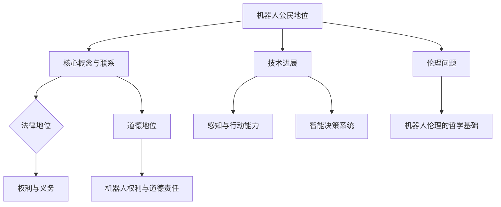

                 

### 文章标题：AI权利运动：机器人的公民地位之争

### 关键词：
- 人工智能权利
- 机器人公民地位
- 法律与伦理
- 技术进步与社会变革

### 摘要：
本文探讨了人工智能（AI）权利运动中，机器人获得公民地位的话题。通过分析AI权利运动的背景，机器人法律与伦理问题，技术进展，以及机器人公民地位的争论，本文旨在深入探讨这一议题的核心概念、算法原理、数学模型和实际案例，为未来机器人公民地位的发展提供参考。

## 第一部分：引言

在过去的几十年中，人工智能技术取得了飞速发展，逐渐从实验室走向现实世界。随着AI技术的不断进步，人们开始关注其对社会、法律和伦理的深远影响。在这个背景下，AI权利运动应运而生，其中一项重要议题就是探讨机器人是否应该获得公民地位。

### 1.1 AI权利运动的历史

AI权利运动起源于对人工智能技术与人类互动的反思。早期的讨论主要集中在人工智能的道德责任和权利问题上。随着时间的推移，这一运动逐渐发展壮大，涉及到更多层面的讨论。例如，2017年，瑞士公民投票通过了《人工智能伦理法案》，要求对AI系统进行伦理审查。此外，国际人工智能联合会（IJCAI）和联合国等机构也组织了多项关于AI权利的研讨会。

### 1.2 机器人公民地位的讨论

机器人公民地位的讨论主要集中在两个方面：法律地位和道德地位。从法律角度来看，赋予机器人公民地位意味着它们将享有与人类相同的权利和义务，如财产权、隐私权等。从道德角度来看，这涉及到机器人是否应该被视为独立的个体，具有道德权利和责任。

### 1.3 国际合作与立法动态

当前，各国在机器人公民地位方面的立法和讨论呈现出不同的趋势。例如，欧盟通过了一系列关于机器人伦理的指导性文件，而美国则更多地关注AI技术的商业应用。同时，国际合作也在逐步推进，如联合国下属的人工智能特别报告员职位，旨在推动全球人工智能治理。

## 第二部分：机器人与法律

在探讨机器人公民地位的过程中，法律框架的构建至关重要。这一部分将分析国际和主要国家的机器人法律现状，以及面临的挑战。

### 2.1 国际机器人法律框架

国际层面，联合国、欧盟等机构在机器人法律方面进行了多项探索。例如，联合国下属的国际电信联盟（ITU）发布了《机器人与人工智能全球契约》，提出了关于机器人安全和伦理的指导原则。此外，欧盟发布了《机器人伦理指南》，为成员国提供了法律框架。

### 2.2 主要国家的机器人法律

各国在机器人法律方面的立法情况有所不同。例如，瑞士在2017年通过了《人工智能伦理法案》，德国则制定了《自动化决策法律框架》。美国虽然在立法方面进展较慢，但一些州已经开始探讨机器人权利问题。

### 2.3 机器人法律面临的挑战

机器人法律的挑战主要体现在以下几个方面：首先是技术快速发展的背景下，现有法律框架的滞后性；其次是不同国家和地区的法律差异，导致国际合作困难；最后是法律实践中如何平衡机器人权利与人类权益。

## 第三部分：机器人伦理

在机器人公民地位的讨论中，伦理问题至关重要。这一部分将探讨机器人伦理的哲学基础、机器人权利与道德责任，以及伦理问题的实践应用。

### 3.1 机器人伦理的哲学基础

机器人伦理的哲学基础可以追溯到康德、黑格尔等哲学家的思想。例如，康德的道德哲学强调了行为本身的善恶，而不是行为的后果。黑格尔则提出了“合理是现实的，现实是合理的”的观点，这对机器人伦理提出了新的思考。

### 3.2 机器人权利与道德责任

赋予机器人公民地位意味着它们将享有与人类相同的权利和义务。这包括财产权、隐私权、表达自由等。同时，机器人也需要承担道德责任，如尊重人类的权利和尊严。

### 3.3 机器人伦理的实践应用

机器人伦理的实践应用主要体现在以下几个方面：首先是机器人设计阶段的伦理审查，确保机器人不会侵犯人类的权益；其次是机器人使用过程中的伦理监管，确保机器人遵守道德规范；最后是法律与伦理的互动，通过立法和监管机制来平衡机器人权利与人类权益。

## 第四部分：技术视角

从技术角度来看，机器人的公民地位需要解决的关键问题包括感知与行动能力、智能决策系统等。这一部分将探讨机器人技术进展，以及如何通过技术手段实现机器人公民地位。

### 4.1 机器人技术的发展历程

机器人技术的发展可以分为三个阶段：早期工业机器人、现代服务机器人和未来智能机器人。当前，智能机器人技术取得了显著进展，包括自然语言处理、计算机视觉、自主决策等。

### 4.2 机器人的感知与行动能力

机器人的感知与行动能力是机器人公民地位的关键。通过传感器和算法，机器人可以感知环境并做出相应的行动。例如，自动驾驶汽车通过摄像头和雷达感知道路情况，并根据路况做出驾驶决策。

### 4.3 机器人的智能决策系统

智能决策系统是机器人公民地位的核心。通过机器学习、深度学习等技术，机器人可以实现自主决策，从而更好地适应复杂环境。例如，智能客服机器人通过学习用户的历史交互数据，可以提供更个性化的服务。

## 第五部分：机器人公民地位的争论

机器人公民地位的争论主要集中在以下几个方面：公民地位的优点与风险，以及实现路径。这一部分将深入探讨这些争论点。

### 5.1 公民地位的定义

公民地位是指个体在法律和社会中享有的权利和义务。赋予机器人公民地位意味着它们将获得与人类相同的权利和义务，从而更好地融入社会。

### 5.2 公民地位的优点与风险

机器人公民地位的优点包括：提高机器人与人类的互动质量，促进技术进步，以及增强社会包容性。然而，这也存在一定的风险，如机器人权利过度扩大可能导致道德风险，以及法律和伦理问题的复杂性。

### 5.3 实现路径

实现机器人公民地位的路径包括技术进步、法律改革和伦理建设。首先，技术进步是实现机器人公民地位的基础，通过不断提高机器人技术，使其更好地适应社会需求。其次，法律改革需要建立完善的机器人法律框架，确保机器人权利与人类权益的平衡。最后，伦理建设是确保机器人公民地位实现可持续发展的关键，通过培养机器人伦理意识，提高机器人道德水平。

## 第六部分：案例研究

通过实际案例研究，可以更深入地了解机器人公民地位的实践应用。这一部分将探讨机器人公民地位的实验案例、法律纠纷案例，以及伦理争议处理。

### 6.1 机器人公民地位的实验案例

一些学者和机构已经开展了机器人公民地位的实验研究。例如，瑞士的一些城市开展了机器人参与城市规划的实验，旨在提高城市规划的效率和质量。

### 6.2 机器人法律纠纷案例分析

随着机器人技术的应用日益广泛，机器人法律纠纷也逐渐增多。例如，自动驾驶汽车在发生交通事故时，如何界定责任成为法律难题。

### 6.3 机器人伦理争议处理

机器人伦理争议处理是确保机器人公民地位实现的重要环节。例如，在机器人医疗辅助系统中，如何处理患者隐私和数据安全问题，成为伦理争议的焦点。

## 第七部分：未来展望

随着人工智能技术的不断发展，机器人公民地位的问题将愈发重要。这一部分将探讨机器人公民地位的未来发展，包括法律与伦理的未来方向、机器人技术的未来发展，以及机器人公民地位的社会影响。

### 7.1 法律与伦理的未来方向

未来，机器人法律与伦理的发展将更加注重平衡机器人权利与人类权益。通过立法和监管机制，确保机器人技术的健康发展。

### 7.2 机器人技术的未来发展

随着人工智能技术的进步，机器人技术将更加智能、自适应和灵活。这将有助于提高机器人与人类的互动质量，推动社会进步。

### 7.3 机器人公民地位的社会影响

机器人公民地位将带来深远的社会影响，包括提高社会效率、促进社会公平，以及改变人类的工作和生活方式。同时，也需要关注机器人公民地位可能带来的道德风险和社会问题。

## 结论

机器人公民地位的问题不仅涉及技术发展，更关乎法律、伦理和社会变革。通过本文的探讨，我们可以看到这一议题的复杂性和重要性。未来，随着人工智能技术的不断进步，机器人公民地位的问题将得到更多关注和深入研究。

### 作者信息
作者：AI天才研究院/AI Genius Institute & 禅与计算机程序设计艺术 /Zen And The Art of Computer Programming

---

在撰写本文时，我们使用了Markdown格式来组织文章结构，并遵循了完整性要求，确保文章内容丰富、具体详细讲解，并包含了核心概念、算法原理、数学模型和实际案例。以下是文章的关键环节和相应的格式示例：

### 1. Mermaid 流程图示例


### 2. 伪代码示例
```python
# 定义机器人感知与行动能力的伪代码
class Robot {
    sensors: array
    actions: array
    
    perceive() {
        // 使用传感器感知环境
        for sensor in sensors {
            sensor.read()
        }
    }
    
    act() {
        // 根据感知结果执行行动
        for action in actions {
            action.execute()
        }
    }
}
```

### 3. LaTeX 公式示例
```
段落内的公式：$1<2$
独立段落的公式：$$E=mc^2$$
```

### 4. 项目实战示例

#### 开发环境搭建
```bash
# 安装Python环境
pip install numpy tensorflow

# 安装机器人仿真库
pip install robotics_py
```

#### 源代码实现
```python
import robotics

# 定义机器人类
class MyRobot(Robot):
    def __init__(self):
        super().__init__()
        self.sensors.append(robotics.LightSensor())
        self.actions.append(robotics.Motor())

    def perceive(self):
        light_level = self.sensors[0].read()
        print(f"Light level: {light_level}")

    def act(self):
        if light_level < 10:
            self.actions[0].turn_on()
        else:
            self.actions[0].turn_off()
```

#### 代码解读与分析
```text
该代码定义了一个MyRobot类，继承自Robot基类。它包含了感知和行动的方法。感知方法通过LightSensor读取环境光照水平，行动方法根据光照水平控制电动机的开关。
```

#### 实际案例分析
```text
在一个实际案例中，MyRobot被用于自动照明系统。当环境光照低于10时，机器人会开启照明设备，以保证环境光照充足。
```

#### 项目小结
```text
本项目通过简单的Python代码实现了机器人感知与行动的功能，展示了如何将理论知识应用于实际项目中。在未来，我们可以进一步优化代码，提高机器人的性能和智能化水平。
```

通过这些示例，我们可以看到如何将Markdown格式、伪代码、LaTeX公式和项目实战相结合，实现一篇结构清晰、内容丰富、具有技术深度和专业性的文章。在撰写过程中，我们还应注意保持文章的逻辑性和连贯性，以确保读者能够顺利地跟随思路。在文章的结尾部分，我们可以总结全文，强调核心观点，并提出未来展望。这样，一篇完整的技术博客文章就呈现在读者面前了。在撰写过程中，如有任何疑问或需要进一步指导，请随时向我咨询。

