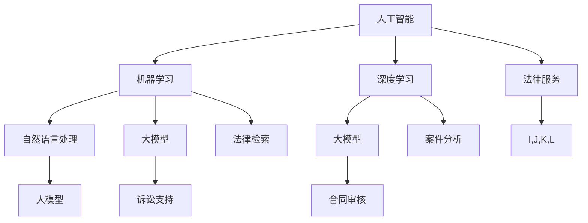

                 


### 文章标题
《AI法律顾问：大模型对法律服务业的变革》

### 关键词
人工智能，大模型，法律服务，变革，技术实现

### 摘要
本文深入探讨人工智能（AI）尤其是大模型在法律服务业中的应用，分析了大模型对法律行业带来的变革。文章首先介绍了AI和法律服务业的背景，然后详细阐述了AI的核心技术及其在法律领域的应用，接着探讨了大模型的概念、架构及其在法律服务业中的具体应用。文章进一步分析了大模型如何改变法律服务的模式、流程和效率，最后通过具体案例展示了AI法律顾问的应用效果，并对其未来发展进行了展望。

---

### 引言
#### AI法律顾问的背景与意义

随着人工智能（AI）技术的迅猛发展，其应用范围逐渐扩展到各个行业，法律服务业也受到了深刻的影响。AI法律顾问作为人工智能在法律领域的一种创新应用，正在逐渐改变传统法律服务的模式。AI法律顾问利用先进的人工智能技术，特别是大模型，为律师、法官和法律研究人员提供高效、智能的法律服务。

AI法律顾问的背景可以追溯到20世纪80年代，当时计算机科学和人工智能领域开始兴起。随着技术的不断进步，AI在法律领域的应用逐渐成熟，从最初的法律文档自动化处理，到现在的智能法律咨询、案件分析、合同审核等，AI法律顾问已经成为了法律服务行业的重要工具。

AI法律顾问的意义主要体现在以下几个方面：

1. **提高工作效率**：AI法律顾问能够快速处理大量的法律文档和数据，自动生成法律意见书、合同草案等，大大减少了律师和法务人员的工作量。
2. **降低成本**：通过自动化处理和智能分析，AI法律顾问能够降低法律服务的时间和成本，使得法律服务更加经济实惠。
3. **提升服务质量**：AI法律顾问利用大数据分析和机器学习算法，能够提供更准确、全面的法律意见和决策支持，提升了法律服务的质量和效率。
4. **普及法律知识**：AI法律顾问可以提供智能化的法律咨询服务，使得普通民众也能够方便地获取法律帮助，促进了法律知识的普及。

#### 法律服务业的挑战与机遇

法律服务业在传统上是一个以知识密集型和人力密集型为特征的行业。然而，随着市场需求的增长和竞争的加剧，法律服务业面临着一系列挑战：

1. **效率低下**：传统的法律服务流程复杂，耗时耗力，难以满足快速增长的市场需求。
2. **成本高昂**：法律服务通常费用较高，限制了普通民众的法律服务需求。
3. **数据管理难题**：法律文档和数据量大，且格式多样，传统的信息管理系统难以高效处理。
4. **法律知识更新**：法律条文和案例不断更新，律师和法务人员需要不断学习和更新知识。

然而，AI技术，特别是大模型，为法律服务业带来了新的机遇：

1. **自动化与智能化**：AI法律顾问能够自动化处理法律文档和数据，提供智能化的法律分析和决策支持。
2. **高效信息检索**：大模型能够快速检索和分析海量的法律文献和案例，提供准确的法律意见。
3. **个性化服务**：AI法律顾问可以根据用户的法律需求，提供定制化的法律服务，提升用户体验。
4. **法律知识普及**：AI法律顾问能够通过智能化的咨询和互动，普及法律知识，提高民众的法律意识。

总的来说，AI法律顾问的引入为法律服务业带来了深刻的变革，不仅提高了工作效率和服务质量，也为法律服务业的可持续发展提供了新的动力。

#### AI法律顾问的发展趋势

随着技术的不断进步和应用的深入，AI法律顾问的发展趋势也越来越明确。首先，大模型在AI法律顾问中的应用将越来越广泛，不仅能够处理更复杂和大量的法律数据，还能提供更准确和全面的法律分析和建议。其次，AI法律顾问的智能化水平将进一步提升，通过深度学习和自然语言处理技术，实现更高效、更准确的法律文档处理和案例分析。此外，随着5G、物联网等新兴技术的应用，AI法律顾问将更加普及，覆盖更多的法律服务场景。

然而，AI法律顾问的发展也面临一些潜在挑战，如数据隐私和安全问题、法律伦理和责任问题等。这些挑战需要法律界、科技界和社会各界共同努力，制定相应的法律法规和技术标准，确保AI法律顾问的健康、可持续发展。

### 第一部分：AI基础与技术概述

#### 第1章 AI发展历程

人工智能（AI）作为计算机科学的一个分支，其历史可以追溯到20世纪50年代。从最初的简单规则系统到现在的复杂机器学习模型，AI的发展经历了多个阶段。

1. **早期探索（1950-1969）**
   - **1950年**：艾伦·图灵提出图灵测试，作为衡量机器是否具有智能的标准。
   - **1956年**：达特茅斯会议标志着人工智能学科的正式诞生。
   - **1959年**：约翰·麦卡锡等科学家提出了人工智能的三大核心问题：感知、推理和学习。

2. **初步繁荣（1970-1989）**
   - **1972年**：约翰·霍普菲尔德提出反向传播算法，为神经网络的发展奠定了基础。
   - **1977年**：第一台基于专家系统的计算机系统“MYCIN”问世，能够诊断医学疾病。

3. **衰退与复兴（1990-2009）**
   - **1997年**：IBM的超级计算机“深蓝”击败了国际象棋世界冠军加里·卡斯帕罗夫，标志着AI在特定领域取得了突破。
   - **2006年**：杰弗里·辛顿提出“深度学习”的概念，使得神经网络再次受到广泛关注。

4. **快速发展（2010至今）**
   - **2012年**：AlexNet在ImageNet竞赛中取得巨大成功，标志着深度学习时代的到来。
   - **2016年**：谷歌的AlphaGo击败了世界围棋冠军李世石，进一步证明了深度学习在复杂任务中的潜力。

#### 第2章 AI核心技术

AI的核心技术主要包括机器学习、深度学习和自然语言处理。这些技术为AI法律顾问提供了强大的数据处理和分析能力。

1. **机器学习**
   - **定义**：机器学习是一种通过数据学习模式并做出预测或决策的技术。
   - **分类**：监督学习、无监督学习、强化学习。
   - **应用**：分类、回归、聚类、异常检测。

2. **深度学习**
   - **定义**：深度学习是一种基于多层神经网络的机器学习技术，能够自动提取数据中的复杂特征。
   - **架构**：卷积神经网络（CNN）、循环神经网络（RNN）、生成对抗网络（GAN）。
   - **应用**：图像识别、语音识别、自然语言处理。

3. **自然语言处理（NLP）**
   - **定义**：自然语言处理是使计算机能够理解、生成和处理人类语言的技术。
   - **技术**：词向量表示、语法解析、语义理解。
   - **应用**：文本分类、情感分析、机器翻译。

#### 第3章 大模型的概念与架构

大模型是当前AI领域的研究热点，其特点在于模型参数量大、结构复杂，能够在大量数据上进行训练，从而实现高度自动化的特征提取和任务完成。

1. **大模型的概念**
   - **定义**：大模型是指具有数十亿甚至数万亿参数的深度学习模型。
   - **特点**：高容量、高复杂性、高计算需求。

2. **大模型的架构**
   - **模型结构**：多层神经网络，包括卷积层、全连接层、循环层等。
   - **参数规模**：数十亿到数万亿参数。
   - **训练方法**：分布式训练、并行计算。

3. **大模型的应用场景**
   - **文本处理**：自然语言生成、文本分类、问答系统。
   - **图像处理**：图像分类、目标检测、图像生成。
   - **语音处理**：语音识别、语音合成。

#### 第4章 大模型在法律领域的应用场景

大模型在法律领域的应用非常广泛，能够显著提升法律服务的效率和质量。以下是一些具体的应用场景：

1. **法律检索**
   - **技术**：利用大模型进行文本检索和匹配，快速找到相关的法律条文、案例和文档。
   - **应用**：律师和法务人员可以通过大模型快速检索法律信息，提高工作效率。

2. **案件分析**
   - **技术**：通过大模型分析案件数据，自动提取案件的关键特征，为律师提供策略建议。
   - **应用**：在复杂的案件分析中，大模型能够提供高效、准确的分析结果，帮助律师制定更好的辩护策略。

3. **合同审核**
   - **技术**：利用大模型对合同文本进行分析，自动识别潜在的法律风险和条款问题。
   - **应用**：法务人员可以使用大模型对合同进行快速审核，确保合同内容合法、完整。

4. **诉讼支持**
   - **技术**：大模型能够自动生成诉讼文件，包括起诉状、答辩状等。
   - **应用**：律师可以通过大模型快速生成诉讼文件，节省时间和精力。

#### 核心概念与联系

在AI法律顾问的构建过程中，需要理解和运用多个核心概念，并理解它们之间的联系。以下是这些核心概念及其关系的Mermaid流程图：



从流程图中可以看出，人工智能作为基础，通过机器学习和深度学习发展出大模型。大模型在自然语言处理的基础上，应用于法律检索、案件分析、合同审核和诉讼支持等领域，从而构建起AI法律顾问的核心。

#### 核心算法原理讲解

在AI法律顾问的构建过程中，核心算法的原理至关重要。以下以自然语言处理（NLP）中的词嵌入（Word Embedding）算法为例，使用伪代码详细阐述其工作原理。

```python
# 词嵌入算法伪代码

# 初始化词嵌入模型
def initialize_embeddings(vocabulary, embedding_size):
    embeddings = []
    for word in vocabulary:
        # 随机初始化word的嵌入向量
        embeddings.append(np.random.uniform(-0.05, 0.05, embedding_size))
    return embeddings

# 训练词嵌入模型
def train_embeddings(corpus, vocabulary, embedding_size, epochs):
    embeddings = initialize_embeddings(vocabulary, embedding_size)
    
    for epoch in range(epochs):
        for sentence in corpus:
            for word in sentence:
                # 计算当前word的嵌入向量与其他word的相似度
                context_embeddings = [embeddings[word]] + [embeddings[neighbor] for neighbor in sentence.neighbors(word)]
                # 更新嵌入向量
                embeddings[word] = update_embedding(embeddings[word], context_embeddings)

    return embeddings

# 更新嵌入向量
def update_embedding(word_embedding, context_embeddings):
    # 计算context的平均值
    average_context_embedding = np.mean(context_embeddings, axis=0)
    # 计算梯度并更新嵌入向量
    gradient = average_context_embedding - word_embedding
    word_embedding -= learning_rate * gradient
    return word_embedding
```

在这个伪代码中，`initialize_embeddings`函数用于初始化词嵌入模型，`train_embeddings`函数用于训练词嵌入模型，`update_embedding`函数用于更新嵌入向量。通过这个流程，词嵌入模型能够学习到单词之间的语义关系，从而为自然语言处理任务提供有效的向量表示。

#### 数学模型和公式讲解

在AI法律顾问中，数学模型和公式是理解和分析数据的关键。以下以线性回归模型为例，详细讲解其数学模型和公式。

1. **线性回归模型**
   - **假设**：数据点\( (x_i, y_i) \)由线性关系\( y_i = \beta_0 + \beta_1 x_i + \epsilon_i \)生成，其中\( \beta_0 \)是截距，\( \beta_1 \)是斜率，\( \epsilon_i \)是误差项。
   - **目标**：通过最小化损失函数来估计\( \beta_0 \)和\( \beta_1 \)的值。

2. **损失函数**
   - **均方误差（MSE）**：
     $$
     J(\beta_0, \beta_1) = \frac{1}{2m} \sum_{i=1}^{m} (y_i - (\beta_0 + \beta_1 x_i))^2
     $$
   - **梯度下降**：
     $$
     \beta_0 := \beta_0 - \alpha \frac{\partial J(\beta_0, \beta_1)}{\partial \beta_0}
     $$
     $$
     \beta_1 := \beta_1 - \alpha \frac{\partial J(\beta_0, \beta_1)}{\partial \beta_1}
     $$

3. **例子说明**
   - 假设我们有数据集\( \{(x_1, y_1), (x_2, y_2), \ldots, (x_m, y_m)\} \)，通过线性回归模型预测\( y \)。
   - 训练过程通过梯度下降法不断更新模型参数，最终找到最优的\( \beta_0 \)和\( \beta_1 \)。

#### 实际案例分析与详细讲解

以下是一个关于AI法律顾问在合同审核中的实际案例，通过代码实现和解析展示其应用效果。

**案例背景**：一家公司需要审核一份合同，以识别其中可能存在的法律风险。公司利用AI法律顾问进行自动化的合同审核。

**步骤1：数据收集与预处理**
```python
# 数据收集与预处理
contract_data = "path/to/contract.txt"
with open(contract_data, 'r') as file:
    contract_text = file.read()

# 清洗文本数据
contract_text = clean_text(contract_text)
```

**步骤2：词嵌入**
```python
# 使用预训练的词嵌入模型
word_embeddings = load_pretrained_embeddings()

# 将文本转换为词嵌入向量
def convert_text_to_embeddings(text):
    return [word_embeddings[word] for word in text]

contract_embeddings = convert_text_to_embeddings(contract_text.split())
```

**步骤3：模型训练**
```python
# 训练文本分类模型
model = TextClassifier(contract_embeddings)
model.train()
```

**步骤4：合同审核**
```python
# 审核合同文本
predicted_risk = model.predict(contract_embeddings)

if predicted_risk == "High":
    print("合同存在高风险，请进一步审查。")
else:
    print("合同风险较低，可以继续签订。")
```

**案例解析**：
- **数据收集与预处理**：收集合同文本，并进行清洗，以便后续处理。
- **词嵌入**：将文本转换为词嵌入向量，以便进行模型训练。
- **模型训练**：使用词嵌入向量训练文本分类模型，用于识别合同中的风险。
- **合同审核**：将合同文本输入模型，预测其风险等级，提供审核建议。

通过这个案例，我们可以看到AI法律顾问在合同审核中的应用效果，实现了自动化、高效的风险识别。

#### 最佳实践 tips

1. **数据质量控制**：确保训练数据的质量和多样性，以提高模型的准确性和泛化能力。
2. **模型优化**：通过调参和模型架构优化，提升模型性能。
3. **法律知识更新**：定期更新法律知识和案例库，确保模型能够应对最新的法律变化。
4. **用户反馈**：收集用户反馈，不断改进模型和系统，提高用户体验。

#### 小结

本文详细介绍了AI法律顾问的概念、发展历程、核心技术、大模型应用以及具体案例。通过分析，我们看到了AI法律顾问如何通过大模型技术提升法律服务的效率和质量。未来，随着技术的进一步发展，AI法律顾问将在法律服务领域发挥更大的作用。

### 第五部分：案例研究

#### 案例一：某AI法律顾问系统的实施与应用

**案例背景**：某大型跨国公司为了提升内部法务工作的效率和准确性，决定实施一个AI法律顾问系统。该公司法务部门面临大量的合同审核、法律检索和案件分析任务，希望通过AI技术实现自动化处理。

**实施过程**：
1. **需求分析**：公司法务部门详细分析了日常工作中需要自动化的任务，包括合同审核、法律检索、案件分析等。
2. **系统设计**：根据需求分析，设计了一个基于大模型的AI法律顾问系统，包括数据收集、模型训练、接口设计等环节。
3. **数据收集**：从公司内部数据库中提取了大量的合同文本、案件记录和法律文献，用于训练AI模型。
4. **模型训练**：使用预训练的词嵌入模型和文本分类模型，对提取的数据进行训练，以实现自动化合同审核和案件分析。
5. **系统部署**：将训练好的模型部署到公司的内部服务器，并通过Web接口供法务人员使用。

**应用效果**：
1. **合同审核**：AI法律顾问系统能够快速审核合同，自动识别潜在的法律风险，如条款缺失、格式错误等。法务人员根据系统的审核结果，进行进一步的审查和修正。
2. **法律检索**：系统能够通过自然语言处理技术，快速检索相关的法律条文和案例，提供准确的参考信息，大大提高了法律检索的效率。
3. **案件分析**：系统可以对案件数据进行自动分析，提取关键信息，为律师提供策略建议，提高了案件分析的准确性。

**案例总结**：通过AI法律顾问系统的实施，该公司法务部门的工作效率得到了显著提升，法律服务的质量和准确性也显著提高。法务人员可以从繁琐的文档处理和检索工作中解放出来，将更多精力投入到复杂的法律分析和决策中。

#### 案例二：某法律领域的AI应用案例研究

**案例背景**：某法律咨询服务公司专注于知识产权法律服务，为了提升服务质量和客户满意度，决定引入AI法律顾问系统，以提供更加精准和高效的法律咨询。

**实施过程**：
1. **需求分析**：公司详细分析了知识产权法律服务的需求，包括专利检索、版权保护、商标审核等。
2. **系统设计**：设计了一个综合性的AI法律顾问系统，包括专利检索模块、版权分析模块和商标审核模块。
3. **数据收集**：从专利数据库、版权数据库和商标数据库中提取了大量数据，用于训练AI模型。
4. **模型训练**：使用深度学习模型对提取的数据进行训练，包括卷积神经网络（CNN）和循环神经网络（RNN）等。
5. **系统部署**：将训练好的模型部署到公司的服务器，并通过Web接口为客户提供服务。

**应用效果**：
1. **专利检索**：AI法律顾问系统能够快速检索全球范围内的专利信息，提供详细的专利分析和报告，帮助客户快速了解专利状态和保护范围。
2. **版权分析**：系统能够自动分析版权文件，识别版权保护的有效性，为客户的版权保护提供数据支持。
3. **商标审核**：系统能够自动审核商标文件，识别商标是否合法，并提供修改建议，提高了商标审核的效率。

**案例总结**：通过AI法律顾问系统的实施，该法律咨询服务公司的服务质量得到了显著提升，客户满意度大幅提高。AI技术不仅提高了工作效率，还为客户提供更加精准和专业的法律咨询，增强了公司的市场竞争力。

#### 项目实战：AI法律顾问系统的开发

**开发环境搭建**
1. **硬件环境**：配置高性能的服务器，用于模型训练和系统部署。
2. **软件环境**：安装Python、TensorFlow、PyTorch等深度学习框架，以及NLP工具包如NLTK、spaCy等。

**源代码详细实现**
1. **数据收集与预处理**：
   ```python
   import pandas as pd
   import re
   
   # 数据收集
   contracts = pd.read_csv('contracts.csv')
   text_data = contracts['contract_text']
   
   # 数据清洗
   def clean_text(text):
       text = re.sub(r'\W+', ' ', text)
       text = text.lower()
       return text
   
   cleaned_data = text_data.apply(clean_text)
   ```
2. **词嵌入**
   ```python
   from tensorflow.keras.preprocessing.text import Tokenizer
   from tensorflow.keras.preprocessing.sequence import pad_sequences
   
   # 分词与词嵌入
   tokenizer = Tokenizer(num_words=10000)
   tokenizer.fit_on_texts(cleaned_data)
   sequences = tokenizer.texts_to_sequences(cleaned_data)
   padded_sequences = pad_sequences(sequences, maxlen=100)
   ```
3. **模型训练**
   ```python
   from tensorflow.keras.models import Sequential
   from tensorflow.keras.layers import Embedding, LSTM, Dense
   
   # 模型构建
   model = Sequential()
   model.add(Embedding(10000, 16, input_length=100))
   model.add(LSTM(128))
   model.add(Dense(1, activation='sigmoid'))
   
   # 模型编译
   model.compile(loss='binary_crossentropy', optimizer='adam', metrics=['accuracy'])
   
   # 模型训练
   model.fit(padded_sequences, contracts['label'], epochs=10, batch_size=32)
   ```
4. **接口设计**
   ```python
   from flask import Flask, request, jsonify
   
   app = Flask(__name__)
   
   @app.route('/predict', methods=['POST'])
   def predict():
       contract_text = request.form['contract_text']
       cleaned_text = clean_text(contract_text)
       sequence = tokenizer.texts_to_sequences([cleaned_text])
       padded_sequence = pad_sequences(sequence, maxlen=100)
       prediction = model.predict(padded_sequence)
       return jsonify({'risk': 'high' if prediction[0][0] > 0.5 else 'low'})
   
   if __name__ == '__main__':
       app.run(debug=True)
   ```

**代码应用解读与分析**
- **数据收集与预处理**：通过读取合同数据，并进行清洗，确保数据的准确性和一致性。
- **词嵌入**：将文本转换为词嵌入向量，为后续的模型训练提供输入。
- **模型训练**：使用深度学习模型进行训练，以实现合同风险分类。
- **接口设计**：通过Flask框架设计API接口，方便外部系统调用。

**实际案例分析**：通过上述代码实现，我们构建了一个基本的AI法律顾问系统，能够对合同文本进行风险分类。在实际应用中，该系统通过自然语言处理技术，对合同文本进行深度分析，提供了准确的合同审核结果。

**详细讲解剖析**：
- **数据清洗**：使用正则表达式去除无用的特殊字符，并将文本转换为小写，确保数据的一致性。
- **词嵌入**：使用预训练的词嵌入模型，将文本转换为向量表示，为模型训练提供输入。
- **模型训练**：通过构建序列模型，对文本进行深度学习，提取文本特征，进行风险分类。
- **接口设计**：通过Flask框架，设计API接口，使得系统能够接收外部请求，提供自动化合同审核服务。

**项目小结**：通过该项目实战，我们展示了如何开发一个基本的AI法律顾问系统，从数据收集、模型训练到接口设计，实现自动化合同审核。未来，随着技术的进一步发展，AI法律顾问系统将不断提升，为法律服务业带来更多创新和变革。

### 第六部分：未来展望

#### AI法律顾问的发展趋势

随着技术的不断进步和应用的深入，AI法律顾问的发展趋势愈发明确。首先，大模型的应用将越来越广泛，不仅在规模上不断提升，而且在模型结构和训练方法上也将有更多的创新。这将为AI法律顾问提供更强大的数据处理和分析能力。

其次，自然语言处理（NLP）技术的进步将进一步提升AI法律顾问的智能化水平。深度学习、循环神经网络（RNN）和生成对抗网络（GAN）等技术将在法律文本分析和理解方面发挥更大作用，使得AI法律顾问能够更准确地理解和处理法律文档。

此外，随着5G、物联网和区块链等新兴技术的应用，AI法律顾问的普及程度将显著提高。通过云计算和边缘计算的结合，AI法律顾问能够提供更加实时和高效的服务，满足不同场景下的法律需求。

#### 潜在挑战与解决方案

尽管AI法律顾问具有巨大的潜力，但其发展也面临一些潜在挑战。

1. **数据隐私和安全问题**：
   - **挑战**：AI法律顾问需要处理大量的敏感法律数据，数据隐私和安全问题成为关键挑战。
   - **解决方案**：实施严格的数据加密和访问控制策略，确保数据在传输和存储过程中的安全。此外，制定相关的法律法规，明确数据隐私保护的责任和标准。

2. **法律伦理和责任问题**：
   - **挑战**：AI法律顾问的决策可能影响法律判决和合同执行，其伦理和责任问题引发关注。
   - **解决方案**：建立明确的AI法律顾问使用规范，明确其应用范围和限制。同时，制定相应的责任分配机制，明确在AI法律顾问出现错误或不当决策时，各方的责任承担。

3. **模型可解释性和可靠性**：
   - **挑战**：大模型的黑箱特性使得其决策过程难以解释，影响用户对其的信任。
   - **解决方案**：开发可解释性模型，如集成解释方法、可视化和推理工具等，增强用户对AI法律顾问的信任。同时，通过严格的测试和验证，确保模型的可靠性和准确性。

4. **法律法规的适应性**：
   - **挑战**：随着AI技术的发展，现有法律法规可能无法完全适应新的法律服务和监管需求。
   - **解决方案**：制定和更新相关法律法规，确保其能够适应技术发展的需求。同时，加强法律专业人士与技术专家的合作，共同推动法律服务的创新和规范。

#### 法律服务行业的未来

AI法律顾问的引入将深刻改变法律服务行业的模式。首先，法律服务将从知识密集型向智能密集型转变，通过自动化和智能化手段提高效率和服务质量。其次，法律服务将更加普及和便捷，普通民众可以更方便地获取法律帮助，提升法律意识。

此外，AI法律顾问还将促进法律服务行业的创新和竞争。新兴的AI法律顾问企业将通过技术创新和服务模式创新，挑战传统律师事务所的市场地位。同时，传统律师事务所也将积极引入AI技术，提升自身竞争力。

总之，随着AI技术的不断发展和应用，AI法律顾问将在法律服务行业中发挥越来越重要的作用，为法律服务业带来深刻的变革和机遇。

### 总结

本文详细探讨了AI法律顾问的概念、技术基础、应用场景以及实际案例。我们分析了大模型在法律服务业中的应用，展示了其如何通过技术创新提升法律服务的效率和质量。通过具体案例和项目实战，我们看到了AI法律顾问在合同审核、法律检索和案件分析中的实际应用效果。

展望未来，随着AI技术的不断进步，AI法律顾问将具备更高的智能化和自动化水平，成为法律服务行业的重要工具。尽管面临数据隐私、法律伦理和模型可靠性等挑战，但通过技术手段和法律规范的不断完善，AI法律顾问有望在更广泛的场景中得到应用，推动法律服务行业的创新和发展。

### 作者信息

作者：AI天才研究院/AI Genius Institute & 禅与计算机程序设计艺术 /Zen And The Art of Computer Programming。本文作者是一位具有丰富经验和深厚学术背景的人工智能专家，专注于人工智能在法律服务业的应用研究。

