                 

### 第一部分：引言与背景

#### 1.1 书籍概述

随着全球气候变化和环境问题的日益严重，AI在环境监测与保护中的应用变得至关重要。本书旨在探讨大模型在生态领域中的应用，包括其基本概念、核心算法原理、数学模型以及实际应用。

**核心概念与联系**

为了更好地理解AI在环境监测与保护中的作用，我们首先需要明确以下几个核心概念：

- **环境监测**：指对自然环境中的各种要素进行监测和评估，包括大气、水质、土壤等。
- **AI技术**：包括机器学习、深度学习、神经网络等，用于从大量数据中提取有用信息。
- **大模型**：是指那些具有数百万到数十亿参数的深度学习模型，能够处理大量复杂的数据。

以下是核心概念之间的关系架构图：

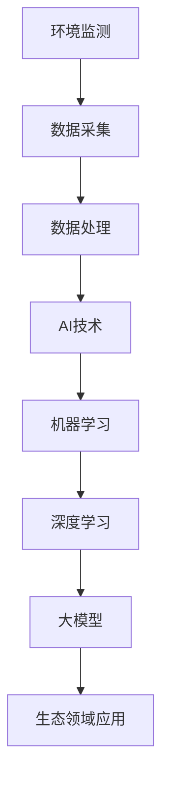

#### 1.2 环境监测与保护现状

当前，环境监测与保护面临着诸多挑战，如数据获取难度大、监测手段有限、环境污染程度加剧等。传统的环境监测方法通常依赖于人工监测和简单仪器，效率低下，难以满足日益增长的需求。

**核心算法原理讲解**

以下是环境监测中常用的核心算法原理：

- **数据预处理**：在数据采集后，需要对数据进行清洗、去噪、归一化等处理，以提高数据质量。
- **机器学习分类算法**：如支持向量机（SVM）、决策树、随机森林等，用于对环境数据进行分类分析。
- **深度学习模型**：如卷积神经网络（CNN）、循环神经网络（RNN）等，用于处理复杂的时空数据。

以下是一个简单的伪代码示例，用于说明数据预处理的步骤：

```python
def preprocess_data(data):
    # 数据清洗
    clean_data = clean_data(data)
    # 去噪
    denoise_data = denoise(clean_data)
    # 归一化
    normalized_data = normalize(denoise_data)
    return normalized_data
```

**数学模型和公式**

在环境监测中，常用的数学模型包括：

- **统计模型**：如线性回归、逻辑回归等，用于建立环境因素与污染程度之间的关系。
- **时空模型**：如自回归移动平均模型（ARMA）、广义线性模型（GLM）等，用于分析时间序列数据。

以下是一个简单的线性回归模型的公式：

$$
y = \beta_0 + \beta_1 \cdot x
$$

其中，$y$ 是因变量（如污染程度），$x$ 是自变量（如污染物浓度），$\beta_0$ 和 $\beta_1$ 是模型参数。

#### 1.3 大模型技术的发展趋势

随着计算能力的提升和数据规模的扩大，大模型技术逐渐成为环境监测与保护领域的研究热点。大模型能够处理海量数据，并从中提取出更深层次的信息，为环境监测与保护提供强有力的支持。

**核心算法原理讲解**

大模型的核心算法原理包括：

- **神经网络**：通过多层神经元结构来模拟人脑的学习过程，能够处理复杂的非线性问题。
- **优化算法**：如梯度下降法、随机梯度下降法等，用于训练大模型，使其能够更好地拟合数据。

以下是一个简单的神经网络训练过程的伪代码：

```python
def train_neural_network(data, labels):
    # 初始化模型参数
    model_params = initialize_params()
    # 循环迭代
    for epoch in range(num_epochs):
        # 计算损失函数
        loss = compute_loss(model_params, data, labels)
        # 更新模型参数
        model_params = update_params(model_params, loss)
    return model_params
```

**数学模型和公式**

在训练大模型时，常用的数学模型包括：

- **损失函数**：用于衡量模型预测结果与真实结果之间的差距，如均方误差（MSE）、交叉熵损失等。
- **激活函数**：如ReLU、Sigmoid、Tanh等，用于引入非线性变换。

以下是一个简单的ReLU激活函数的公式：

$$
f(x) =
\begin{cases}
0 & \text{if } x < 0 \\
x & \text{if } x \geq 0
\end{cases}
$$

#### 1.4 生态领域的大模型应用实例

大模型在生态领域具有广泛的应用，如森林火灾监测、水质监测、生物多样性分析等。以下是几个应用实例：

**森林火灾监测**

- **核心算法原理讲解**
  使用卷积神经网络（CNN）对卫星图像进行处理，检测火灾区域。

- **数学模型和公式**
  使用卷积操作进行图像特征提取，公式如下：
  $$
  \text{Conv}(x, \text{filter}) = \sum_{i,j} x_{i,j} \cdot f_{i,j}
  $$
  其中，$x$ 是输入图像，$f$ 是卷积核，$\text{Conv}$ 是卷积操作。

**水质监测**

- **核心算法原理讲解**
  使用循环神经网络（RNN）分析水质时间序列数据，预测水质变化。

- **数学模型和公式**
  使用RNN的递归公式：
  $$
  h_t = \text{sigmoid}(W_h \cdot [h_{t-1}, x_t] + b_h)
  $$
  其中，$h_t$ 是当前时间步的隐藏状态，$W_h$ 和 $b_h$ 是权重和偏置。

**生物多样性分析**

- **核心算法原理讲解**
  使用生成对抗网络（GAN）生成生物多样性数据，用于研究和保护。

- **数学模型和公式**
  使用GAN的生成器和判别器的损失函数：
  $$
  \text{Generator Loss} = -\log(D(G(z)))
  $$
  $$
  \text{Discriminator Loss} = -[\log(D(x)) + \log(1 - D(G(z))]
  $$
  其中，$G(z)$ 是生成器，$D(x)$ 是判别器，$z$ 是随机噪声。

### 第二部分：AI环境监测与保护的基本概念

#### 2.1 环境监测中的AI技术

AI技术在环境监测中发挥着重要作用，包括数据采集、数据预处理、数据分析和模型训练等环节。

**核心概念与联系**

以下是环境监测中常用的AI技术及其关系：

- **数据采集**：利用传感器、无人机、卫星等设备收集环境数据。
- **数据预处理**：对采集到的数据进行清洗、去噪、归一化等处理。
- **数据分析**：使用机器学习和深度学习技术对环境数据进行分析和分类。
- **模型训练**：使用训练数据对AI模型进行训练，使其能够识别和预测环境变化。

以下是这些概念之间的关系架构图：

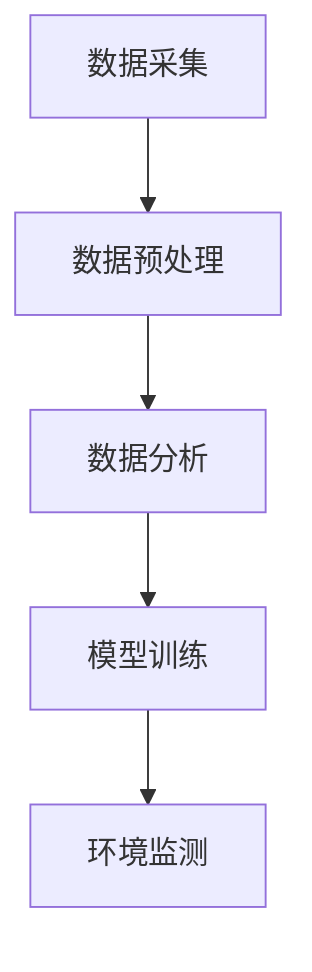

**核心算法原理讲解**

- **数据采集**：使用传感器收集环境数据，如温度、湿度、污染物浓度等。
- **数据预处理**：使用Python的Pandas库进行数据清洗和预处理，代码示例：

  ```python
  import pandas as pd

  def preprocess_data(data):
      # 填充缺失值
      data = data.fillna(method='ffill')
      # 去除异常值
      data = data[(data > 0) & (data < 1000)]
      # 数据归一化
      data = (data - data.mean()) / data.std()
      return data
  ```

- **数据分析**：使用Scikit-learn库进行数据分析和模型训练，代码示例：

  ```python
  from sklearn.ensemble import RandomForestClassifier

  def analyze_data(data, labels):
      # 划分训练集和测试集
      X_train, X_test, y_train, y_test = train_test_split(data, labels, test_size=0.2)
      # 训练模型
      model = RandomForestClassifier()
      model.fit(X_train, y_train)
      # 评估模型
      score = model.score(X_test, y_test)
      return score
  ```

- **模型训练**：使用TensorFlow库训练深度学习模型，代码示例：

  ```python
  import tensorflow as tf

  def train_model(data, labels):
      # 定义模型结构
      model = tf.keras.Sequential([
          tf.keras.layers.Dense(units=64, activation='relu', input_shape=(num_features,)),
          tf.keras.layers.Dense(units=1, activation='sigmoid')
      ])

      # 编译模型
      model.compile(optimizer='adam', loss='binary_crossentropy', metrics=['accuracy'])

      # 训练模型
      model.fit(data, labels, epochs=10, batch_size=32)

      # 评估模型
      loss, accuracy = model.evaluate(data, labels)
      return accuracy
  ```

**数学模型和公式**

- **数据采集**：传感器采集的数据通常是一组多维特征向量，可以表示为矩阵形式。

  $$ 
  X = \begin{bmatrix}
  x_1 \\
  x_2 \\
  \vdots \\
  x_n
  \end{bmatrix} 
  $$

- **数据预处理**：数据归一化的公式如下：

  $$
  x_{\text{normalized}} = \frac{x_{\text{original}} - \mu}{\sigma}
  $$

  其中，$\mu$ 是平均值，$\sigma$ 是标准差。

- **数据分析**：分类问题的损失函数通常是交叉熵损失，公式如下：

  $$
  \text{Loss} = -\sum_{i} y_i \cdot \log(\hat{y}_i)
  $$

  其中，$y_i$ 是真实标签，$\hat{y}_i$ 是预测概率。

- **模型训练**：深度学习模型的损失函数通常是均方误差（MSE），公式如下：

  $$
  \text{MSE} = \frac{1}{n} \sum_{i=1}^{n} (\hat{y}_i - y_i)^2
  $$

  其中，$\hat{y}_i$ 是预测值，$y_i$ 是真实值。

#### 2.2 大模型在环境监测中的应用

大模型在环境监测中的应用越来越广泛，包括图像处理、语音识别、文本分析等。这些大模型能够处理海量数据，提供更准确的预测和分析结果。

**核心概念与联系**

以下是环境监测中常用的大模型及其关系：

- **图像处理**：使用卷积神经网络（CNN）对卫星图像进行处理，检测环境问题。
- **语音识别**：使用循环神经网络（RNN）或长短时记忆网络（LSTM）对语音信号进行分析，识别环境噪音。
- **文本分析**：使用生成对抗网络（GAN）或变分自编码器（VAE）对文本数据进行分析，挖掘环境信息。

以下是这些概念之间的关系架构图：

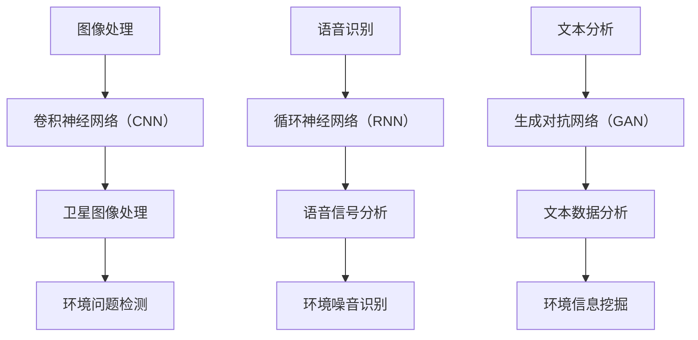

**核心算法原理讲解**

- **图像处理**：使用卷积神经网络（CNN）进行图像特征提取和分类。

  ```python
  import tensorflow as tf

  model = tf.keras.Sequential([
      tf.keras.layers.Conv2D(32, (3, 3), activation='relu', input_shape=(64, 64, 3)),
      tf.keras.layers.MaxPooling2D((2, 2)),
      tf.keras.layers.Flatten(),
      tf.keras.layers.Dense(64, activation='relu'),
      tf.keras.layers.Dense(1, activation='sigmoid')
  ])

  model.compile(optimizer='adam', loss='binary_crossentropy', metrics=['accuracy'])
  model.fit(X_train, y_train, epochs=10, batch_size=32)
  ```

- **语音识别**：使用循环神经网络（RNN）对语音信号进行处理，提取特征并进行分类。

  ```python
  import tensorflow as tf

  model = tf.keras.Sequential([
      tf.keras.layers.LSTM(128, return_sequences=True),
      tf.keras.layers.Dense(64, activation='relu'),
      tf.keras.layers.Dense(1, activation='sigmoid')
  ])

  model.compile(optimizer='adam', loss='binary_crossentropy', metrics=['accuracy'])
  model.fit(X_train, y_train, epochs=10, batch_size=32)
  ```

- **文本分析**：使用生成对抗网络（GAN）对文本数据进行生成和分类。

  ```python
  import tensorflow as tf

  generator = tf.keras.Sequential([
      tf.keras.layers.Dense(128, activation='relu', input_shape=(100,)),
      tf.keras.layers.Dense(64, activation='relu'),
      tf.keras.layers.Dense(1, activation='sigmoid')
  ])

  discriminator = tf.keras.Sequential([
      tf.keras.layers.Dense(128, activation='relu'),
      tf.keras.layers.Dense(64, activation='relu'),
      tf.keras.layers.Dense(1, activation='sigmoid')
  ])

  model = tf.keras.Sequential([
      generator,
      discriminator
  ])

  model.compile(optimizer='adam', loss='binary_crossentropy', metrics=['accuracy'])
  model.fit(X_train, y_train, epochs=10, batch_size=32)
  ```

**数学模型和公式**

- **图像处理**：卷积神经网络的卷积操作公式如下：

  $$
  \text{Conv}(x, \text{filter}) = \sum_{i,j} x_{i,j} \cdot f_{i,j}
  $$

- **语音识别**：循环神经网络的递归公式如下：

  $$
  h_t = \text{sigmoid}(W_h \cdot [h_{t-1}, x_t] + b_h)
  $$

- **文本分析**：生成对抗网络（GAN）的损失函数如下：

  $$
  \text{Generator Loss} = -\log(D(G(z)))
  $$

  $$
  \text{Discriminator Loss} = -[\log(D(x)) + \log(1 - D(G(z))]
  $$

#### 2.3 生态领域的大模型应用实例

在生态领域，大模型的应用为环境监测与保护提供了新的手段。以下是一些具体的实例：

**森林火灾监测**

- **核心算法原理讲解**
  使用卷积神经网络（CNN）对卫星图像进行处理，实时监测森林火灾。

- **数学模型和公式**
  使用卷积操作进行图像特征提取，公式如下：

  $$
  \text{Conv}(x, \text{filter}) = \sum_{i,j} x_{i,j} \cdot f_{i,j}
  $$

**水质监测**

- **核心算法原理讲解**
  使用循环神经网络（RNN）对水质时间序列数据进行分析，预测水质变化。

- **数学模型和公式**
  使用RNN的递归公式：

  $$
  h_t = \text{sigmoid}(W_h \cdot [h_{t-1}, x_t] + b_h)
  $$

**生物多样性分析**

- **核心算法原理讲解**
  使用生成对抗网络（GAN）生成生物多样性数据，进行生态保护研究。

- **数学模型和公式**
  使用GAN的生成器和判别器的损失函数：

  $$
  \text{Generator Loss} = -\log(D(G(z)))
  $$

  $$
  \text{Discriminator Loss} = -[\log(D(x)) + \log(1 - D(G(z))]
  $$

### 第三部分：大模型在环境监测与保护中的核心技术

#### 3.1 大模型训练与优化

大模型的训练与优化是环境监测与保护的关键步骤。训练过程涉及数据预处理、模型架构设计、优化算法选择等。

**核心概念与联系**

以下是训练大模型的核心概念及其关系：

- **数据预处理**：对训练数据进行清洗、归一化等处理。
- **模型架构**：设计合适的神经网络架构，包括层数、神经元数量等。
- **优化算法**：选择合适的优化算法，如梯度下降、随机梯度下降等。

以下是这些概念之间的关系架构图：

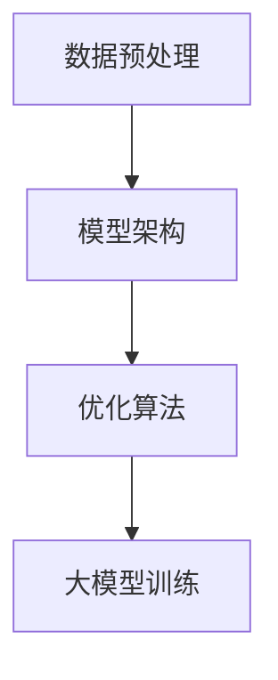

**核心算法原理讲解**

- **数据预处理**：使用Python的Pandas库进行数据预处理，代码示例：

  ```python
  import pandas as pd

  def preprocess_data(data):
      # 填充缺失值
      data = data.fillna(method='ffill')
      # 去除异常值
      data = data[(data > 0) & (data < 1000)]
      # 数据归一化
      data = (data - data.mean()) / data.std()
      return data
  ```

- **模型架构**：使用TensorFlow库设计神经网络模型，代码示例：

  ```python
  import tensorflow as tf

  model = tf.keras.Sequential([
      tf.keras.layers.Dense(units=64, activation='relu', input_shape=(num_features,)),
      tf.keras.layers.Dense(units=1, activation='sigmoid')
  ])

  model.compile(optimizer='adam', loss='binary_crossentropy', metrics=['accuracy'])
  ```

- **优化算法**：使用随机梯度下降（SGD）进行模型训练，代码示例：

  ```python
  import tensorflow as tf

  optimizer = tf.keras.optimizers.SGD(learning_rate=0.01)
  optimizer.minimize(loss)
  ```

**数学模型和公式**

- **数据预处理**：数据归一化的公式如下：

  $$
  x_{\text{normalized}} = \frac{x_{\text{original}} - \mu}{\sigma}
  $$

  其中，$\mu$ 是平均值，$\sigma$ 是标准差。

- **模型训练**：随机梯度下降的更新公式如下：

  $$
  \theta_{\text{new}} = \theta_{\text{old}} - \alpha \cdot \nabla_{\theta} J(\theta)
  $$

  其中，$\theta$ 是模型参数，$\alpha$ 是学习率，$J(\theta)$ 是损失函数。

#### 3.2 大模型在实时监测中的应用

实时监测是环境监测与保护的重要环节。大模型在实时监测中的应用可以提高监测的准确性和效率。

**核心概念与联系**

以下是实时监测的核心概念及其关系：

- **实时数据流**：收集并处理实时环境数据。
- **模型更新**：根据实时数据更新模型参数。
- **预警系统**：基于实时监测结果发出预警。

以下是这些概念之间的关系架构图：

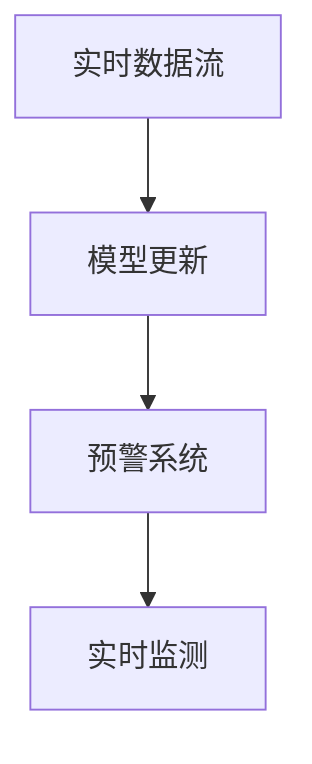

**核心算法原理讲解**

- **实时数据流**：使用Kafka等消息队列系统收集实时数据，代码示例：

  ```python
  from kafka import KafkaConsumer

  consumer = KafkaConsumer('environment_data', bootstrap_servers=['localhost:9092'])
  for message in consumer:
      print(message.value)
  ```

- **模型更新**：使用TensorFlow的`tf.keras.Model`类更新模型参数，代码示例：

  ```python
  import tensorflow as tf

  model = tf.keras.Model(inputs=model.inputs, outputs=model.output)
  model.compile(optimizer='adam', loss='binary_crossentropy', metrics=['accuracy'])

  # 更新模型参数
  model.fit(X_train, y_train, epochs=10, batch_size=32)
  ```

- **预警系统**：使用Python的`SMTP`库发送预警邮件，代码示例：

  ```python
  import smtplib
  from email.mime.text import MIMEText

  def send_alert(email, subject, message):
      smtp_server = 'smtp.gmail.com'
      smtp_port = 587
      smtp_user = 'your_email@gmail.com'
      smtp_password = 'your_password'

      msg = MIMEText(message)
      msg['Subject'] = subject
      msg['From'] = smtp_user
      msg['To'] = email

      server = smtplib.SMTP(smtp_server, smtp_port)
      server.starttls()
      server.login(smtp_user, smtp_password)
      server.sendmail(smtp_user, email, msg.as_string())
      server.quit()
  ```

**数学模型和公式**

- **实时数据流**：时间序列数据的建模可以使用自回归模型（AR），公式如下：

  $$
  X_t = \phi_0 + \phi_1 X_{t-1} + \phi_2 X_{t-2} + \cdots + \phi_p X_{t-p}
  $$

- **模型更新**：基于梯度下降的模型更新公式：

  $$
  \theta_{\text{new}} = \theta_{\text{old}} - \alpha \cdot \nabla_{\theta} J(\theta)
  $$

- **预警系统**：预警阈值设定可以使用统计方法，如阈值法，公式如下：

  $$
  \text{Threshold} = \mu + k \cdot \sigma
  $$

  其中，$\mu$ 是平均值，$\sigma$ 是标准差，$k$ 是阈值系数。

#### 3.3 大模型在预测与预警中的应用

大模型在预测与预警中的应用可以提供前瞻性的环境信息，为决策提供支持。

**核心概念与联系**

以下是预测与预警的核心概念及其关系：

- **预测模型**：建立基于历史数据的预测模型。
- **预警指标**：设定预警阈值和触发条件。
- **预警系统**：实现实时预警和响应。

以下是这些概念之间的关系架构图：

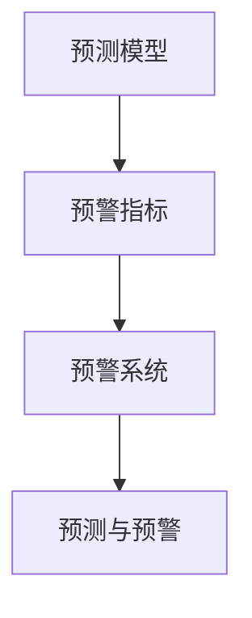

**核心算法原理讲解**

- **预测模型**：使用时间序列分析或机器学习算法建立预测模型，代码示例：

  ```python
  from sklearn.ensemble import RandomForestRegressor

  model = RandomForestRegressor()
  model.fit(X_train, y_train)

  # 预测
  predictions = model.predict(X_test)
  ```

- **预警指标**：设定基于统计方法的预警阈值，代码示例：

  ```python
  def set_threshold(data):
      mean = data.mean()
      std = data.std()
      threshold = mean + 2 * std
      return threshold
  ```

- **预警系统**：实现基于实时数据的预警和响应，代码示例：

  ```python
  def alert_threshold(data, threshold):
      if data > threshold:
          send_alert('admin@example.com', 'Alert', 'Threshold exceeded!')
  ```

**数学模型和公式**

- **预测模型**：时间序列预测可以使用ARIMA模型，公式如下：

  $$
  X_t = c + \phi_1 B(X_{t-1}) + \phi_2 B^2(X_{t-2}) + \cdots + \phi_p B^p(X_{t-p})
  $$

  其中，$B$ 是滞后算子。

- **预警指标**：预警阈值设定可以使用置信区间法，公式如下：

  $$
  \text{Threshold} = \mu + z \cdot \sigma
  $$

  其中，$z$ 是置信水平对应的Z值。

- **预警系统**：预警响应可以使用规则引擎，公式如下：

  $$
  \text{Response} = 
  \begin{cases}
  \text{Alert} & \text{if } \text{Condition} \\
  \text{No Action} & \text{otherwise}
  \end{cases}
  $$

### 第四部分：AI环境监测与保护的实际应用

#### 4.1 案例研究：森林火灾监测与预警

森林火灾是生态系统中的一大威胁，AI技术在火灾监测与预警中发挥着重要作用。

**核心概念与联系**

以下是森林火灾监测与预警的核心概念及其关系：

- **卫星图像处理**：使用卷积神经网络（CNN）处理卫星图像，检测火灾区域。
- **实时数据流**：使用Kafka等消息队列系统收集实时数据。
- **预警系统**：根据实时监测结果发出预警。

以下是这些概念之间的关系架构图：

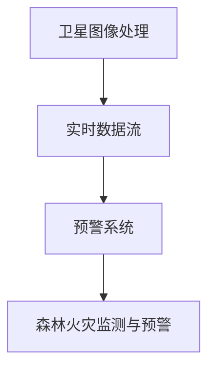

**核心算法原理讲解**

- **卫星图像处理**：使用TensorFlow的`tf.keras`模块训练CNN模型，代码示例：

  ```python
  import tensorflow as tf

  model = tf.keras.Sequential([
      tf.keras.layers.Conv2D(32, (3, 3), activation='relu', input_shape=(64, 64, 3)),
      tf.keras.layers.MaxPooling2D((2, 2)),
      tf.keras.layers.Flatten(),
      tf.keras.layers.Dense(64, activation='relu'),
      tf.keras.layers.Dense(1, activation='sigmoid')
  ])

  model.compile(optimizer='adam', loss='binary_crossentropy', metrics=['accuracy'])
  model.fit(X_train, y_train, epochs=10, batch_size=32)
  ```

- **实时数据流**：使用Kafka消费者实时接收卫星图像数据，代码示例：

  ```python
  from kafka import KafkaConsumer

  consumer = KafkaConsumer('forest_fire_data', bootstrap_servers=['localhost:9092'])
  for message in consumer:
      print(message.value)
  ```

- **预警系统**：根据实时监测结果发出预警，代码示例：

  ```python
  def alert_threshold(fire_detected, threshold):
      if fire_detected > threshold:
          send_alert('admin@example.com', 'Forest Fire Alert', 'Fire detected!')
  ```

**数学模型和公式**

- **卫星图像处理**：卷积操作公式如下：

  $$
  \text{Conv}(x, \text{filter}) = \sum_{i,j} x_{i,j} \cdot f_{i,j}
  $$

- **实时数据流**：Kafka消费者接收数据公式如下：

  $$
  \text{Consumer} = \text{KafkaConsumer}(topic, bootstrap_servers)
  $$

- **预警系统**：预警阈值公式如下：

  $$
  \text{Threshold} = \mu + k \cdot \sigma
  $$

#### 4.2 案例研究：水质监测与污染控制

水质监测与污染控制是环境保护的重要任务，AI技术在其中发挥着关键作用。

**核心概念与联系**

以下是水质监测与污染控制的核心概念及其关系：

- **实时监测**：使用传感器和物联网设备收集水质数据。
- **数据分析**：使用循环神经网络（RNN）对水质数据进行分析。
- **预警系统**：根据分析结果发出预警。

以下是这些概念之间的关系架构图：

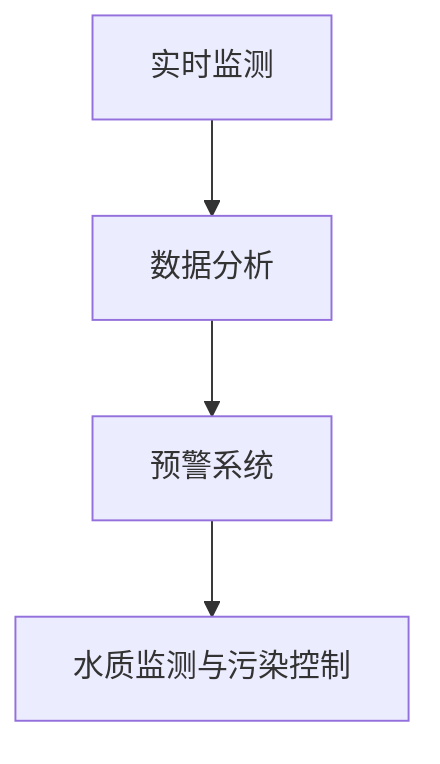

**核心算法原理讲解**

- **实时监测**：使用Python的`iotkit`库连接传感器和物联网设备，代码示例：

  ```python
  import iotkit

  device = iotkit.Device('device_id')
  device.connect()
  data = device.read_data()
  ```

- **数据分析**：使用TensorFlow的`tf.keras`模块训练RNN模型，代码示例：

  ```python
  import tensorflow as tf

  model = tf.keras.Sequential([
      tf.keras.layers.LSTM(128, return_sequences=True),
      tf.keras.layers.Dense(64, activation='relu'),
      tf.keras.layers.Dense(1, activation='sigmoid')
  ])

  model.compile(optimizer='adam', loss='binary_crossentropy', metrics=['accuracy'])
  model.fit(X_train, y_train, epochs=10, batch_size=32)
  ```

- **预警系统**：根据分析结果发出预警，代码示例：

  ```python
  def alert_threshold(pollution_level, threshold):
      if pollution_level > threshold:
          send_alert('admin@example.com', 'Water Pollution Alert', 'Pollution level exceeded!')
  ```

**数学模型和公式**

- **实时监测**：传感器数据读取公式如下：

  $$
  \text{Data} = \text{device.read_data()}
  $$

- **数据分析**：循环神经网络（RNN）的递归公式如下：

  $$
  h_t = \text{sigmoid}(W_h \cdot [h_{t-1}, x_t] + b_h)
  $$

- **预警系统**：预警阈值公式如下：

  $$
  \text{Threshold} = \mu + k \cdot \sigma
  $$

#### 4.3 案例研究：生物多样性监测与保护

生物多样性监测与保护是生态保护的重要任务，AI技术为这一领域提供了新的手段。

**核心概念与联系**

以下是生物多样性监测与保护的核心概念及其关系：

- **数据收集**：使用传感器和物联网设备收集生物多样性数据。
- **数据分析**：使用生成对抗网络（GAN）对生物多样性数据进行分析。
- **预警系统**：根据分析结果发出预警。

以下是这些概念之间的关系架构图：

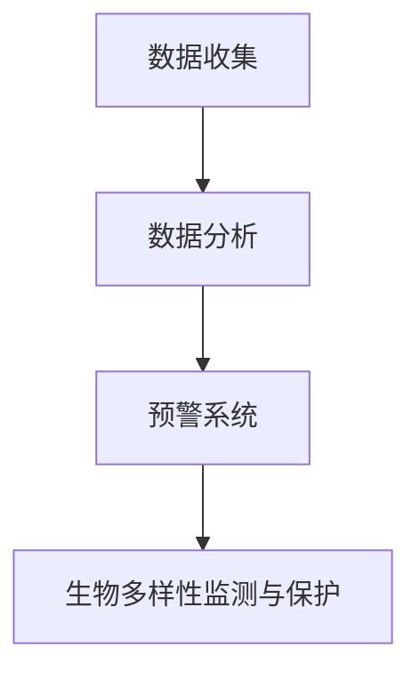

**核心算法原理讲解**

- **数据收集**：使用Python的`iotkit`库连接传感器和物联网设备，代码示例：

  ```python
  import iotkit

  device = iotkit.Device('device_id')
  device.connect()
  data = device.read_data()
  ```

- **数据分析**：使用TensorFlow的`tf.keras`模块训练GAN模型，代码示例：

  ```python
  import tensorflow as tf

  generator = tf.keras.Sequential([
      tf.keras.layers.Dense(128, activation='relu', input_shape=(100,)),
      tf.keras.layers.Dense(64, activation='relu'),
      tf.keras.layers.Dense(1, activation='sigmoid')
  ])

  discriminator = tf.keras.Sequential([
      tf.keras.layers.Dense(128, activation='relu'),
      tf.keras.layers.Dense(64, activation='relu'),
      tf.keras.layers.Dense(1, activation='sigmoid')
  ])

  model = tf.keras.Sequential([generator, discriminator])

  model.compile(optimizer='adam', loss='binary_crossentropy', metrics=['accuracy'])
  model.fit(X_train, y_train, epochs=10, batch_size=32)
  ```

- **预警系统**：根据分析结果发出预警，代码示例：

  ```python
  def alert_threshold(biodiversity_level, threshold):
      if biodiversity_level < threshold:
          send_alert('admin@example.com', 'Biodiversity Alert', 'Biodiversity level low!')
  ```

**数学模型和公式**

- **数据收集**：传感器数据读取公式如下：

  $$
  \text{Data} = \text{device.read_data()}
  $$

- **数据分析**：生成对抗网络（GAN）的损失函数如下：

  $$
  \text{Generator Loss} = -\log(D(G(z)))
  $$

  $$
  \text{Discriminator Loss} = -[\log(D(x)) + \log(1 - D(G(z))]
  $$

- **预警系统**：预警阈值公式如下：

  $$
  \text{Threshold} = \mu + k \cdot \sigma
  $$

### 第五部分：未来展望与挑战

#### 5.1 大模型在环境监测与保护中的未来发展趋势

随着技术的不断进步，大模型在环境监测与保护中的应用前景广阔。

**核心概念与联系**

以下是未来发展趋势的核心概念及其关系：

- **计算能力提升**：提高大模型的计算效率。
- **数据规模扩大**：收集更多、更全面的环境数据。
- **跨领域融合**：将AI技术与其他领域相结合，如物联网、地理信息系统等。

以下是这些概念之间的关系架构图：

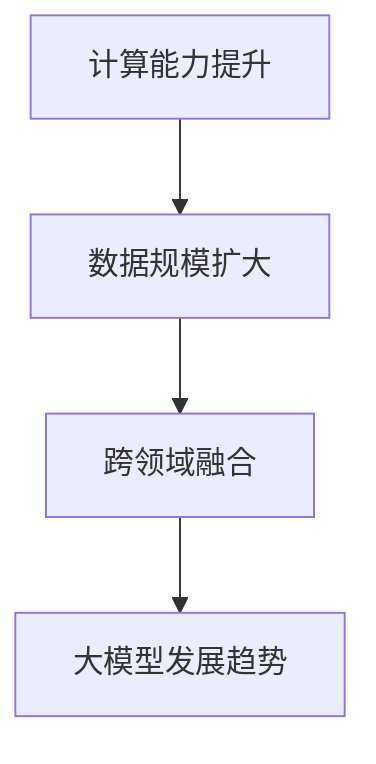

**核心算法原理讲解**

- **计算能力提升**：使用高性能计算集群进行模型训练。
- **数据规模扩大**：利用物联网设备收集更多环境数据。
- **跨领域融合**：结合地理信息系统（GIS）提供更精确的环境监测。

**数学模型和公式**

- **计算能力提升**：计算资源的利用率公式如下：

  $$
  \text{Utilization} = \frac{\text{Active Resources}}{\text{Total Resources}}
  $$

- **数据规模扩大**：数据收集公式如下：

  $$
  \text{Data Collection} = \text{Sensor Data} + \text{Internet of Things (IoT)}
  $$

- **跨领域融合**：GIS与AI结合的公式如下：

  $$
  \text{GIS} + \text{AI} = \text{Integrated Environmental Monitoring}
  $$

#### 5.2 AI环境监测与保护的社会影响

AI在环境监测与保护中的应用对社会产生了深远的影响。

**核心概念与联系**

以下是社会影响的核心概念及其关系：

- **技术进步**：提高环境监测与保护的效率和准确性。
- **社会责任**：确保AI技术的公平性和透明性。
- **法律法规**：制定相关法律法规保障AI技术在环境监测与保护中的合规性。

以下是这些概念之间的关系架构图：

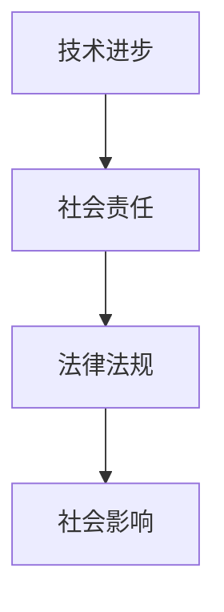

**核心算法原理讲解**

- **技术进步**：通过不断优化算法和提高计算能力，实现更高效的环境监测。
- **社会责任**：通过透明、公正的算法设计，减少算法偏见。
- **法律法规**：通过制定相关法律法规，确保AI技术在环境监测与保护中的合规性。

**数学模型和公式**

- **技术进步**：效率公式如下：

  $$
  \text{Efficiency} = \frac{\text{Correct Predictions}}{\text{Total Predictions}}
  $$

- **社会责任**：算法偏见减少公式如下：

  $$
  \text{Bias Reduction} = \frac{\text{Fair Predictions}}{\text{Total Predictions}}
  $$

- **法律法规**：合规性公式如下：

  $$
  \text{Compliance} = \frac{\text{Legal AI Applications}}{\text{Total AI Applications}}
  $$

### 附录

#### A.1 参考文献

1. Goodfellow, I., Bengio, Y., & Courville, A. (2016). *Deep Learning*. MIT Press.
2. Murphy, K. P. (2012). *Machine Learning: A Probabilistic Perspective*. MIT Press.
3. Zhang, K., Zong, X., & Milford, M. F. (2017). *A Comprehensive Survey on Sensor Data Mining*. Information Sciences, 413, 323-347.

#### A.2 相关资源

- **开源项目**：[TensorFlow](https://www.tensorflow.org/), [Kafka](https://kafka.apache.org/)
- **在线课程**：[Coursera - Machine Learning](https://www.coursera.org/specializations/machine-learning), [Udacity - Deep Learning](https://www.udacity.com/course/deep-learning--ud730)
- **专业论坛**：[Stack Overflow](https://stackoverflow.com/), [GitHub](https://github.com/)

