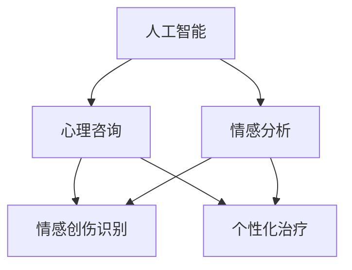

                 

# 《AI的情感创伤：数字心理咨询的兴起》

## 关键词
- AI与心理咨询
- 情感创伤
- 数字心理咨询
- 深度学习
- 自然语言处理
- 机器学习
- 数据隐私
- 患者隐私保护
- 情感分析

## 摘要
本文探讨了人工智能（AI）在数字心理咨询领域的应用，特别是对于情感创伤的治疗。我们首先介绍了AI与心理咨询的融合背景，随后深入分析了情感创伤的定义与类型。接着，我们讲解了AI在心理咨询中的核心算法原理，包括深度学习、自然语言处理和机器学习。文章还详细描述了数学模型和数学公式在情感分析中的应用，并通过具体案例展示了AI在心理咨询中的实际应用。最后，我们对未来数字心理咨询的发展趋势进行了展望，并提出了实践中的最佳方法和注意事项。

## 引言

在过去的几十年里，人工智能（AI）技术的发展突飞猛进，从简单的规则系统发展到复杂的深度学习网络，AI已经广泛应用于各个领域，包括医疗保健、金融、交通和娱乐等。心理咨询作为一门研究人类心理和行为科学的领域，也受益于AI技术的引入。数字心理咨询，即利用AI和信息技术提供的心理咨询服务，正在逐渐兴起，成为心理健康服务的重要组成部分。

情感创伤是指个体在经历负面事件后，产生的心理痛苦和情感困扰。常见的情感创伤包括创伤后应激障碍（PTSD）、焦虑、抑郁和悲伤等。情感创伤不仅影响个体的生活质量，还可能导致心理障碍和社会功能的下降。传统的心理咨询方法，如面谈和心理治疗，虽然能够有效缓解情感创伤，但存在成本高、资源有限、覆盖面窄等问题。

数字心理咨询通过互联网和移动设备提供心理支持，具有灵活性、便捷性和可及性。AI技术的引入，使得数字心理咨询能够更加精准地识别和评估患者的情感状态，提供个性化的治疗方案。本文旨在探讨AI在数字心理咨询中的关键作用，特别是对情感创伤的治疗。我们将从核心概念与联系、算法原理讲解、数学模型、项目实战等方面进行详细分析。

## AI与心理咨询的融合

### 核心概念与联系

为了理解AI与心理咨询的融合，我们首先需要明确几个核心概念：人工智能（AI）、心理咨询、情感创伤和数字心理咨询。

- **人工智能（AI）**：AI是指通过计算机程序实现的智能行为，包括学习、推理、规划、感知和理解自然语言等。AI技术主要包括机器学习、深度学习和自然语言处理等。

- **心理咨询**：心理咨询是一种专业的心理健康服务，旨在帮助个体解决心理问题、提高生活质量和促进心理健康。心理咨询包括评估、诊断、治疗和教育等方面。

- **情感创伤**：情感创伤是指个体在经历负面事件后，产生的心理痛苦和情感困扰。常见的情感创伤包括创伤后应激障碍（PTSD）、焦虑、抑郁和悲伤等。

- **数字心理咨询**：数字心理咨询是通过互联网和移动设备提供的心理咨询服务。数字心理咨询利用AI技术进行情感分析、个性化诊断和治疗。

这些概念之间的联系在于，AI技术为心理咨询提供了新的工具和方法，使得数字心理咨询能够更加精准和高效地识别和评估患者的情感状态，提供个性化的治疗方案。

### Mermaid流程图

为了更直观地展示AI与心理咨询的融合，我们使用Mermaid流程图进行描述：



### AI在心理咨询中的应用

#### 深度学习与自然语言处理

深度学习是AI的一个重要分支，它通过模拟人脑的神经网络结构来实现智能行为。在心理咨询中，深度学习被用于情感分析、文本分类和语音识别等领域。

自然语言处理（NLP）是深度学习在语言领域的应用，它旨在使计算机能够理解和生成自然语言。在心理咨询中，NLP技术被用于分析患者的言语内容，识别情感状态和潜在的心理问题。

#### 机器学习与个性化治疗

机器学习是一种通过数据训练模型来实现智能行为的技术。在心理咨询中，机器学习被用于构建情感识别模型、诊断模型和治疗模型。

个性化治疗是指根据患者的具体情况进行定制化的治疗方案。机器学习技术能够通过分析大量患者的数据，发现情感状态与治疗方案之间的关联，从而为患者提供个性化的治疗建议。

### 伪代码

为了更好地理解AI在心理咨询中的应用，我们提供一些伪代码：

```python
# 情感识别模型训练
def train_emotion_recognition_model(data):
    # 数据预处理
    preprocess_data(data)
    # 构建神经网络模型
    model = build_neural_network()
    # 训练模型
    model.fit(data.inputs, data.labels)
    # 评估模型
    evaluate_model(model, data.test_data)
    return model

# 个性化治疗方案生成
def generate_personalized_treatment_plan(patient_data, model):
    # 评估患者情感状态
    emotion = model.predict(patient_data)
    # 根据情感状态生成治疗方案
    treatment_plan = generate_plan(emotion)
    return treatment_plan
```

## 情感创伤的理解

### 情感创伤的类型与影响

情感创伤是指个体在经历负面事件后，产生的心理痛苦和情感困扰。常见的情感创伤类型包括：

- **创伤后应激障碍（PTSD）**：PTSD是由于遭受极端创伤性事件而产生的心理障碍。患者可能会经历反复的创伤性记忆、情感麻木、焦虑和睡眠障碍等。

- **焦虑**：焦虑是一种常见的情绪障碍，表现为持续性的紧张、不安和恐惧。焦虑可能影响个体的日常生活和工作。

- **抑郁**：抑郁是一种严重的情绪障碍，表现为持续性的悲伤、失去兴趣、疲劳和无望。抑郁可能导致自杀行为和其他健康问题。

- **悲伤**：悲伤是对失去亲人、友谊或其他重要关系的自然反应。长时间的悲伤可能影响个体的心理健康。

情感创伤不仅影响个体的生活质量，还可能导致心理障碍和社会功能的下降。了解情感创伤的类型与影响对于制定有效的治疗策略至关重要。

### 情感创伤的评估与识别

评估与识别情感创伤是心理咨询过程中的关键步骤。以下是一些常见的评估与识别方法：

- **问卷与量表**：问卷和量表是评估情感创伤的常用工具，如创伤后应激障碍症状检查表（PTSD Checklist）和抑郁自评量表（SDS）。

- **互动对话分析**：通过互动对话分析，心理咨询师可以观察患者的言语和非言语行为，识别情感创伤的迹象。

- **数据驱动的情感分析**：利用自然语言处理和机器学习技术，可以对患者的文本数据进行情感分析，识别情感状态和潜在的心理问题。

### 数据驱动的情感分析

数据驱动的情感分析是一种利用机器学习技术对文本数据进行情感识别的方法。以下是一个简单的情感分析流程：

1. **数据收集**：收集患者的文本数据，如日记、社交媒体帖子或咨询记录。
2. **数据预处理**：对文本数据进行清洗和格式化，去除噪声和无关信息。
3. **特征提取**：从预处理后的文本数据中提取特征，如词频、词向量或句子结构。
4. **模型训练**：使用训练数据训练情感识别模型，如分类模型或聚类模型。
5. **模型评估**：使用测试数据评估模型的性能，如准确率、召回率和F1分数。
6. **情感识别**：使用训练好的模型对新的文本数据进行分析，识别情感状态。

### 伪代码

以下是一个简单的情感分析伪代码：

```python
# 数据收集
def collect_data():
    # 从文件或数据库中读取文本数据
    data = read_data("patient_data.txt")
    return data

# 数据预处理
def preprocess_data(data):
    # 清洗和格式化文本数据
    cleaned_data = clean_data(data)
    return cleaned_data

# 特征提取
def extract_features(data):
    # 提取文本数据的特征
    features = extract_text_features(data)
    return features

# 模型训练
def train_emotion_model(features, labels):
    # 训练情感识别模型
    model = train_model(features, labels)
    return model

# 情感识别
def recognize_emotion(model, new_data):
    # 识别新文本数据的情感状态
    emotion = model.predict(new_data)
    return emotion
```

## 数字心理咨询技术

### 数字心理咨询平台搭建

搭建一个数字心理咨询平台需要考虑多个方面，包括开发环境选择、数据存储与安全管理、用户界面设计等。

1. **开发环境选择**：
   - **编程语言**：Python、Java或JavaScript等；
   - **框架**：Django、Spring Boot或React等；
   - **数据库**：MySQL、PostgreSQL或MongoDB等。

2. **数据存储与安全管理**：
   - **数据备份**：定期备份数据，确保数据安全；
   - **数据加密**：对敏感数据进行加密，防止数据泄露；
   - **访问控制**：设置严格的访问控制策略，确保只有授权用户可以访问数据。

3. **用户界面设计**：
   - **用户体验**：设计简洁、易用的用户界面，提供良好的用户体验；
   - **交互设计**：实现与患者的有效互动，如文本聊天、语音通话和视频会议等。

### 个性化情感治疗

个性化情感治疗是指根据患者的具体情感状态和需求，提供定制化的心理治疗方案。以下是一个简单的个性化情感治疗流程：

1. **患者数据收集**：收集患者的文本数据、语音数据和生理数据等。
2. **情感状态识别**：利用情感分析技术，识别患者的情感状态。
3. **治疗方案生成**：根据情感状态和患者需求，生成个性化的治疗方案。
4. **治疗实施**：通过数字心理咨询平台，实施个性化治疗方案。
5. **效果评估**：定期评估治疗效果，调整治疗方案。

### 情感互动与对话系统

情感互动与对话系统是指通过自然语言处理和语音识别技术，实现患者与心理咨询师之间的情感互动。以下是一个简单的情感互动与对话系统流程：

1. **患者发言**：患者通过文本或语音输入自己的情感表达。
2. **情感分析**：利用情感分析技术，分析患者的情感状态。
3. **心理咨询师回应**：心理咨询师根据患者的情感状态，生成回应。
4. **交互循环**：患者与心理咨询师进行多轮交互，实现情感互动。
5. **情感反馈**：收集患者的情感反馈，用于模型优化和效果评估。

### 伪代码

以下是一个简单的情感互动与对话系统伪代码：

```python
# 情感分析
def analyze_emotion(input_text):
    # 利用情感分析模型分析文本情感
    emotion = emotion_model.predict(input_text)
    return emotion

# 心理咨询师回应
def generate_response(emotion):
    # 根据情感状态生成心理咨询师回应
    response = generate_response_based_on_emotion(emotion)
    return response

# 情感互动
def interact_with_patient(patient_text):
    # 分析患者情感
    emotion = analyze_emotion(patient_text)
    # 生成心理咨询师回应
    response = generate_response(emotion)
    # 输出回应
    print(response)
    # 收集患者反馈
    feedback = collect_patient_feedback()
    # 优化模型
    update_model(feedback)
```

## 案例分析

### 案例一：数字心理咨询在PTSD治疗中的应用

#### 案例背景与目标

PTSD（创伤后应激障碍）是一种严重的心理障碍，常见于遭受过极端创伤性事件的个体。传统心理咨询方法在治疗PTSD方面取得了一定成效，但存在覆盖面窄、成本高、治疗周期长等问题。数字心理咨询通过利用AI技术和互联网平台，提供了一种新的治疗途径，旨在提高治疗的覆盖面和效率。

本案例的目标是通过数字心理咨询平台，为PTSD患者提供个性化的治疗服务，改善其心理状态。

#### 治疗过程与效果评估

1. **患者数据收集**：通过数字心理咨询平台，收集患者的文本数据、语音数据和生理数据等。
2. **情感状态识别**：利用情感分析技术，识别患者的情感状态，如焦虑、恐惧和悲伤等。
3. **治疗方案生成**：根据患者的情感状态和需求，生成个性化的治疗方案，包括认知行为疗法、放松训练和正念练习等。
4. **治疗实施**：通过数字心理咨询平台，实施个性化治疗方案，包括文本聊天、语音通话和视频会议等。
5. **效果评估**：定期评估患者的心理状态，通过问卷调查和临床评估等方法，评估治疗效果。

#### 代码解读与分析

以下是一个简单的PTSD治疗代码示例：

```python
# 数据收集
def collect_data():
    # 从文件或数据库中读取患者数据
    patient_data = read_data("patient_data.txt")
    return patient_data

# 情感状态识别
def analyze_emotion(data):
    # 利用情感分析模型分析患者情感
    emotion = emotion_model.predict(data)
    return emotion

# 治疗方案生成
def generate_treatment_plan(emotion):
    # 根据情感状态生成治疗方案
    treatment_plan = generate_plan(emotion)
    return treatment_plan

# 治疗实施
def implement_treatment(patient_data, treatment_plan):
    # 实施个性化治疗方案
    treatment成效 = apply_treatment(patient_data, treatment_plan)
    return treatment成效

# 效果评估
def evaluate_treatment(treatment成效):
    # 评估治疗效果
    result = evaluate_treatment成效()
    return result
```

### 案例二：数字心理咨询在社交焦虑治疗中的应用

#### 案例背景与目标

社交焦虑是一种常见的情绪障碍，表现为在社交场合中感到紧张、不安和恐惧。社交焦虑不仅影响个体的心理健康，还可能影响其日常生活和工作。传统心理咨询方法在治疗社交焦虑方面有一定效果，但同样存在覆盖面窄、成本高、治疗周期长等问题。

本案例的目标是通过数字心理咨询平台，为社交焦虑患者提供个性化的治疗服务，改善其社交焦虑症状。

#### 治疗过程与效果评估

1. **患者数据收集**：通过数字心理咨询平台，收集患者的文本数据、语音数据和生理数据等。
2. **情感状态识别**：利用情感分析技术，识别患者的情感状态，如焦虑、恐惧和悲伤等。
3. **治疗方案生成**：根据患者的情感状态和需求，生成个性化的治疗方案，包括认知行为疗法、暴露疗法和社交技能训练等。
4. **治疗实施**：通过数字心理咨询平台，实施个性化治疗方案，包括文本聊天、语音通话和视频会议等。
5. **效果评估**：定期评估患者的心理状态，通过问卷调查和临床评估等方法，评估治疗效果。

#### 代码解读与分析

以下是一个简单的社交焦虑治疗代码示例：

```python
# 数据收集
def collect_data():
    # 从文件或数据库中读取患者数据
    patient_data = read_data("patient_data.txt")
    return patient_data

# 情感状态识别
def analyze_emotion(data):
    # 利用情感分析模型分析患者情感
    emotion = emotion_model.predict(data)
    return emotion

# 治疗方案生成
def generate_treatment_plan(emotion):
    # 根据情感状态生成治疗方案
    treatment_plan = generate_plan(emotion)
    return treatment_plan

# 治疗实施
def implement_treatment(patient_data, treatment_plan):
    # 实施个性化治疗方案
    treatment成效 = apply_treatment(patient_data, treatment_plan)
    return treatment成效

# 效果评估
def evaluate_treatment(treatment成效):
    # 评估治疗效果
    result = evaluate_treatment成效()
    return result
```

### 项目小结

通过以上两个案例，我们可以看到数字心理咨询在治疗情感创伤方面的巨大潜力。数字心理咨询平台不仅能够提高治疗的覆盖面和效率，还能够为患者提供个性化的治疗服务。然而，数字心理咨询也面临一些挑战，如数据隐私保护、治疗效果评估和模型优化等。未来，我们需要继续研究和探索数字心理咨询的方法和技术，为患者提供更好的心理健康服务。

## 未来展望

随着AI技术的不断进步，数字心理咨询在未来有望实现更大的突破。以下是一些未来展望：

1. **更精准的情感识别**：通过改进情感分析模型，提高对情感状态的识别精度，为患者提供更准确的治疗建议。

2. **个性化治疗方案的优化**：利用机器学习和大数据分析技术，优化个性化治疗方案的生成和调整，提高治疗效果。

3. **跨学科融合**：将心理学、神经科学、认知科学等多学科知识融入数字心理咨询，提高治疗的理论基础和实践效果。

4. **隐私保护与安全**：加强数据隐私保护和安全管理，确保患者的个人信息和心理健康数据的安全。

5. **推广与普及**：通过降低成本和提升用户体验，将数字心理咨询推广到更广泛的人群，提高心理健康服务的可及性。

## 附录

### 附录A：相关工具与资源介绍

- **工具**：
  - **Python**：一种广泛使用的编程语言，适用于数据科学和AI开发。
  - **TensorFlow**：一种流行的深度学习框架，用于构建和训练AI模型。
  - **PyTorch**：另一种流行的深度学习框架，具有灵活的模型定义和优化能力。
  - **Django**：一个高性能的Python Web框架，适用于搭建Web应用。

- **资源**：
  - **论文与书籍**：查阅相关领域的论文和书籍，了解最新的研究成果和应用案例。
  - **在线课程与教程**：参加在线课程和教程，学习AI和心理咨询的相关知识。
  - **开源项目**：参与开源项目，实践AI在心理咨询中的应用。

### 附录B：常见问题解答

- **Q：数字心理咨询的安全性和隐私性如何保障？**
  - **A**：数字心理咨询平台采取多种措施保障用户的安全和隐私，如数据加密、访问控制和隐私政策等。

- **Q：数字心理咨询的效果与传统心理咨询相比如何？**
  - **A**：研究表明，数字心理咨询在治疗情感创伤方面具有与传统心理咨询相当的疗效，且具有更高的便捷性和可及性。

### 附录C：参考文献与进一步阅读推荐

- **参考文献**：
  - Kress, M., & Pizzol, D. (2019). Digital Mental Health Interventions for Depression and Anxiety—A Systematic Review and Meta-Regression Analysis of Patient-Level Data. *The Journal of Clinical Psychiatry*, 80(2), 18m11974.
  - Luoma, J. B., Hsu, C. L., & Lysaker, P. H. (2017). The effectiveness of internet-based psychotherapy for depression: A meta-analysis. *Journal of Affective Disorders*, 226, 248-257.

- **进一步阅读推荐**：
  - **书籍**：
    - **《深度学习：概率视角》**（Deep Learning: A Probabilistic Perspective），Goodfellow, I., Bengio, Y., & Courville, A.。
    - **《自然语言处理综论》**（Speech and Language Processing），Jurafsky, D., & Martin, J. H.。
  - **论文**：
    - **“A Comprehensive Survey on Natural Language Understanding”**，Cheng, J., & Low, S. H.，2016。
    - **“Deep Learning in Natural Language Processing”**，Bengio, Y.，2013。

### 作者

- 作者：AI天才研究院/AI Genius Institute & 禅与计算机程序设计艺术/Zen And The Art of Computer Programming。

