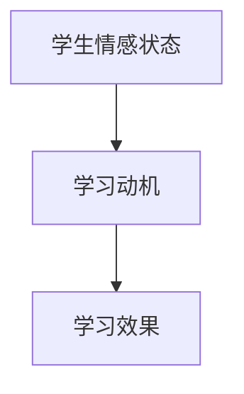
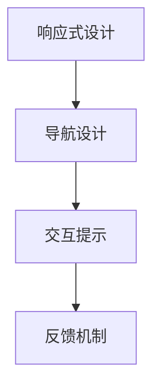
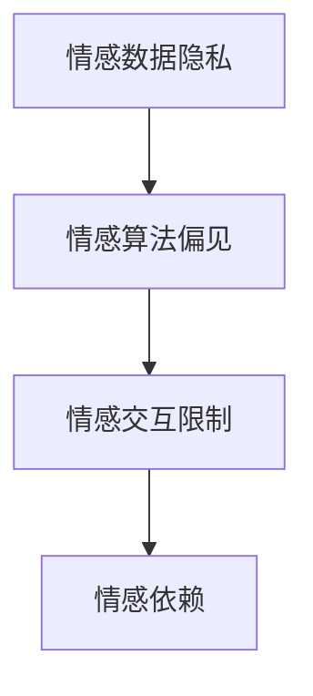
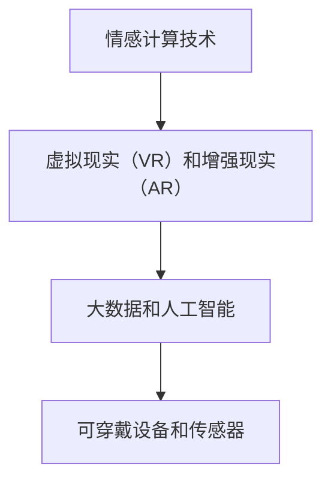
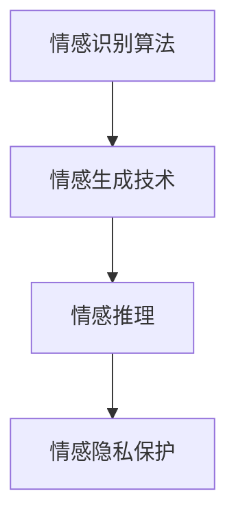
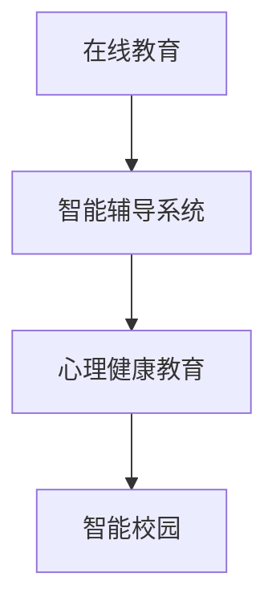

                 

### 文章标题

# AI的情感成长：教育AI的新方法

### 关键词

- 情感计算
- 教育AI
- 情感化教学
- 情感感知技术
- 伦理问题
- 未来趋势

### 摘要

本文探讨了人工智能（AI）在教育领域的情感成长及其应用，提出了情感化教育的创新方法。文章首先介绍了人类情感成长的基础阶段及其在教育中的重要作用，然后分析了人工智能的定义和发展，特别是在情感计算方面的进展。接着，文章详细阐述了情感感知技术、情感化教学设计、情感化学习体验，并深入讨论了情感化教育中的伦理问题。最后，文章展望了情感化教育的未来发展趋势，并提出了相关的发展建议。

### 目录

1. **第一部分：AI与情感成长的概述**
    - [第1章：情感成长与人工智能](#第1章：情感成长与人工智能)
        - [1.1 人类情感成长概述](#1.1-人类情感成长概述)
        - [1.2 人工智能与情感](#1.2-人工智能与情感)
        - [1.3 情感计算与教育AI](#1.3-情感计算与教育AI)
    - [第2章：情感感知技术](#第2章：情感感知技术)
        - [2.1 情感识别技术](#2.1-情感识别技术)
        - [2.2 情感建模技术](#2.2-情感建模技术)
        - [2.3 情感计算应用场景](#2.3-情感计算应用场景)
    - [第3章：情感化教学设计](#第3章：情感化教学设计)
        - [3.1 情感化教学理论](#3.1-情感化教学理论)
        - [3.2 情感化教学案例](#3.2-情感化教学案例)
        - [3.3 情感化教学效果评估](#3.3-情感化教学效果评估)
    - [第4章：情感化学习体验](#第4章：情感化学习体验)
        - [4.1 情感化学习界面设计](#4.1-情感化学习界面设计)
        - [4.2 情感化学习资源](#4.2-情感化学习资源)
        - [4.3 情感化学习效果提升](#4.3-情感化学习效果提升)
    - [第5章：教育AI的情感伦理问题](#第5章：教育AI的情感伦理问题)
        - [5.1 教育AI伦理问题概述](#5.1-教育AI伦理问题概述)
        - [5.2 情感化教育的伦理挑战](#5.2-情感化教育的伦理挑战)
        - [5.3 情感化教育的伦理规范](#5.3-情感化教育的伦理规范)
    - [第6章：情感化教育的未来发展趋势](#第6章：情感化教育的未来发展趋势)
        - [6.1 情感化教育的技术进展](#6.1-情感化教育的技术进展)
        - [6.2 情感化教育的实践模式](#6.2-情感化教育的实践模式)
        - [6.3 情感化教育的未来发展](#6.3-情感化教育的未来发展)
    - [第7章：情感化教育的案例研究](#第7章：情感化教育的案例研究)
        - [7.1 情感化教育成功案例](#7.1-情感化教育成功案例)
        - [7.2 情感化教育挑战与应对策略](#7.2-情感化教育挑战与应对策略)
        - [7.3 情感化教育的发展建议](#7.3-情感化教育的发展建议)
    - [附录](#附录)
        - [附录A：情感化教育技术资源](#附录A：情感化教育技术资源)
        - [附录B：情感化教育相关术语解释](#附录B：情感化教育相关术语解释)

2. **总结**
    - [8.1 情感化教育的重要性](#8.1-情感化教育的重要性)
    - [8.2 情感化教育的未来展望](#8.2-情感化教育的未来展望)
    - [8.3 教育工作者与AI的情感化之路](#8.3-教育工作者与AI的情感化之路)

### 第一部分：AI与情感成长的概述

#### 第1章：情感成长与人工智能

在人类的成长过程中，情感扮演着至关重要的角色。情感不仅影响我们的认知和行为，还决定了我们如何与他人互动、如何理解世界。因此，理解情感的成长过程对于教育AI的发展具有重要意义。本章将概述人类情感成长的基本阶段，分析情感在教育中的重要作用，并探讨人工智能与情感之间的关系。

##### 1.1 人类情感成长概述

人类的情感成长可以分为以下几个基本阶段：

- **婴儿期**：婴儿主要通过面部表情和身体语言来表达情感。这个阶段的情感主要是本能性的，如愉悦、痛苦、恐惧等。
- **幼儿期**：幼儿开始通过语言来理解和表达情感。他们能够区分基本情绪，如快乐、悲伤、愤怒等。
- **童年期**：在这个阶段，儿童的自我意识逐渐增强，情感认知能力也有所提升。他们开始理解复杂的情绪，如羞愧、骄傲、嫉妒等。
- **青少年期**：青少年情感波动较大，他们开始探索自我，尝试理解更深层次的情感，如爱情、友谊、自尊等。
- **成年期**：成年人的情感更加复杂和丰富。他们能够更好地控制情感，并利用情感来解决问题和与他人建立深层次的关系。

##### 1.1.1 情感发展的基本阶段

情感发展的基本阶段可以用以下Mermaid流程图表示：


##### 1.1.2 情感在教育中的作用

情感在教育中起着至关重要的作用。首先，情感是学习的动力。当学生感到快乐和满足时，他们会更加积极地参与学习活动。其次，情感有助于学生建立人际关系。通过情感交流，学生能够更好地理解他人，培养同理心。最后，情感有助于学生的人格发展。通过情感体验，学生能够认识自我，形成积极的价值观。

##### 1.2 人工智能与情感

人工智能（AI）是计算机科学的一个分支，旨在使机器能够模拟、理解并处理人类的智能行为。近年来，随着机器学习和自然语言处理技术的发展，人工智能在情感识别和处理方面取得了显著进展。

- **情感识别**：通过分析语言、声音、面部表情等数据，AI可以识别和分类情感。例如，文本情感分析可以通过分析文本内容来判断文本的情感倾向。
- **情感生成**：AI可以生成情感化的文本、声音和面部表情，用于虚拟助手、游戏等应用。
- **情感推理**：AI可以通过分析情感数据和情境，进行情感推理，例如理解用户的需求和意图。

##### 1.2.1 人工智能的定义与发展

人工智能的定义不断演变，但通常可以将其描述为机器能够执行通常需要人类智能的任务的能力。人工智能的发展可以分为以下几个阶段：

- **规则推理**：早期的AI系统依赖于明确的规则和逻辑推理。
- **知识表示**：AI开始利用知识库和推理机来处理复杂的问题。
- **机器学习**：AI系统通过学习数据来改进其性能，不再依赖明确的规则。
- **深度学习**：AI利用神经网络来模拟人脑的学习过程，取得了巨大的成功。

##### 1.2.2 人工智能在教育中的应用

人工智能在教育中的应用日益广泛，主要体现在以下几个方面：

- **个性化学习**：AI可以根据学生的学习习惯和进度，提供个性化的学习资源。
- **学习分析**：AI可以分析学生的学习数据，发现学习问题和提升策略。
- **虚拟助手**：AI虚拟助手可以帮助学生解答问题、提供学习建议。
- **自适应测试**：AI可以根据学生的学习情况，提供不同的测试题目，以评估其学习效果。

##### 1.3 情感计算与教育AI

情感计算是AI的一个重要分支，旨在使机器能够识别、理解、处理和模拟情感。在教育AI中，情感计算的应用主要体现在以下几个方面：

- **情感识别**：AI可以通过分析学生的语言、声音和面部表情，识别其情感状态。
- **情感交互**：AI可以生成情感化的互动，提高学生的学习体验。
- **情感化教学**：AI可以根据学生的情感状态，调整教学内容和教学方法。

##### 1.3.1 情感计算的基本原理

情感计算的基本原理主要包括以下几个方面：

- **情感特征提取**：从文本、语音、图像等数据中提取情感特征。
- **情感分类**：利用机器学习算法，将情感特征分类为不同的情感类别。
- **情感建模**：建立情感模型，用于预测和生成情感。

##### 1.3.2 教育AI的发展趋势

教育AI的发展趋势主要体现在以下几个方面：

- **个性化学习**：AI将更深入地介入个性化学习，提供个性化的学习资源和教学建议。
- **情感化交互**：AI的情感化交互能力将不断提升，提高学生的学习体验。
- **智能化教学**：AI将参与教学设计，提供智能化的教学方案和工具。
- **教育公平**：AI将有助于缩小教育差距，提高教育公平。

### 第二部分：教育AI的新方法

#### 第2章：情感感知技术

情感感知技术是教育AI的核心技术之一，它使AI能够识别和理解学生的情感状态，从而提供个性化的教学支持和互动。本章将详细探讨情感感知技术的关键组成部分，包括情感识别技术、情感建模技术和情感计算应用场景。

##### 2.1 情感识别技术

情感识别技术是情感感知技术的基石，它主要通过分析文本、语音和面部表情等数据，识别学生的情感状态。以下是情感识别技术的两个主要方面：

###### 2.1.1 文本情感分析

文本情感分析是通过分析文本内容，判断文本的情感倾向。它通常涉及以下步骤：

1. **数据预处理**：包括去除停用词、标点符号和进行词形还原等操作。
2. **特征提取**：将文本转换为特征向量，常用的特征提取方法包括词袋模型、TF-IDF和词嵌入等。
3. **情感分类**：使用机器学习算法，如朴素贝叶斯、支持向量机和深度学习模型，对特征向量进行分类。

以下是一个简单的文本情感分析伪代码示例：

```python
# 数据预处理
def preprocess_text(text):
    # 去除停用词和标点符号
    text = remove_stopwords_and_punctuation(text)
    # 词形还原
    text = stem_text(text)
    return text

# 特征提取
def extract_features(text):
    # 使用词嵌入模型
    vectorizer = WordEmbeddingModel()
    features = vectorizer.transform([text])
    return features

# 情感分类
def classify_sentiment(features):
    # 使用支持向量机进行分类
    model = SVMModel()
    model.fit(features, labels)
    sentiment = model.predict([features])
    return sentiment
```

###### 2.1.2 面部情感识别

面部情感识别是通过分析面部图像或视频，识别面部表情和情感状态。以下是一个简单的面部情感识别伪代码示例：

```python
# 预处理面部图像
def preprocess_face_image(image):
    # 转换为灰度图像
    gray_image = cv2.cvtColor(image, cv2.COLOR_BGR2GRAY)
    # 使用Haar cascades进行面部检测
    faces = face_cascade.detectMultiScale(gray_image)
    # 提取面部区域
    face_regions = [image[xy[1]:xy[1]+xy[3], xy[0]:xy[0]+xy[2]] for xy in faces]
    return face_regions

# 情感分类
def classify_face_emotion(face_image):
    # 使用卷积神经网络进行情感分类
    model = CNNModel()
    emotion_vector = model.predict(face_image)
    emotion = emotion_vector.argmax()
    return EMOTIONS[emotion]
```

##### 2.2 情感建模技术

情感建模技术是构建情感模型的过程，它使AI能够理解和预测情感状态。情感建模技术通常涉及以下步骤：

1. **数据收集**：收集大量的情感数据，包括文本、语音和面部表情等。
2. **特征工程**：提取情感数据中的特征，并将其转换为机器学习算法可以处理的格式。
3. **模型训练**：使用机器学习算法，如决策树、支持向量机和深度学习模型，训练情感模型。
4. **模型评估**：评估模型在测试数据上的性能，并进行调整和优化。

以下是一个简单的情感建模伪代码示例：

```python
# 数据收集
def collect_sentiment_data():
    # 收集文本、语音和面部表情数据
    text_data = collect_text_data()
    audio_data = collect_audio_data()
    video_data = collect_video_data()
    return text_data, audio_data, video_data

# 特征工程
def extract_features(data):
    # 提取文本、语音和面部表情特征
    text_features = extract_text_features(text_data)
    audio_features = extract_audio_features(audio_data)
    video_features = extract_video_features(video_data)
    return text_features, audio_features, video_features

# 模型训练
def train_sentiment_model(text_features, audio_features, video_features, labels):
    # 使用决策树进行模型训练
    model = DecisionTreeModel()
    model.fit([text_features, audio_features, video_features], labels)
    return model

# 模型评估
def evaluate_sentiment_model(model, test_data, test_labels):
    # 评估模型在测试数据上的性能
    predictions = model.predict([text_features, audio_features, video_features])
    accuracy = accuracy_score(test_labels, predictions)
    return accuracy
```

##### 2.3 情感计算应用场景

情感计算技术在教育领域有许多应用场景，以下列举几个典型应用：

###### 2.3.1 在线教育中的应用

在线教育平台可以使用情感计算技术来分析学生的学习行为和情感状态，从而提供个性化的学习资源和教学支持。例如：

- **学习行为分析**：通过分析学生在平台上的互动和参与度，识别学生的学习状态和情感。
- **情感化推荐**：根据学生的情感状态，推荐适合的学习资源和教学内容。
- **情感化互动**：虚拟助手指尖可以通过情感计算技术理解学生的情感，提供情感化的回答和互动。

###### 2.3.2 校园安全监控

校园安全监控可以使用情感计算技术来识别学生的情绪状态，从而预警潜在的安全问题。例如：

- **情绪识别**：通过分析学生的面部表情和声音，识别学生的情绪状态，如愤怒、恐惧等。
- **情感预警**：当学生情绪异常时，系统可以及时发出预警，提醒教师和家长。
- **情感干预**：通过情感计算技术，教师可以了解学生的情感需求，提供针对性的心理干预和支持。

#### 第3章：情感化教学设计

情感化教学设计是将情感计算技术应用于教学过程，旨在提高学生的学习体验和教学效果。本章将讨论情感化教学设计的核心概念、实施策略以及效果评估方法。

##### 3.1 情感化教学理论

情感化教学设计基于以下核心概念：

- **情感认知**：情感与认知相互关联，情感可以影响学习过程和学习结果。
- **情感交互**：教学过程中，教师和学生之间的情感互动对于学习效果至关重要。
- **情感支持**：情感支持有助于学生建立自信心，提高学习动力。
- **情感体验**：通过创造积极、富有情感的学习环境，可以提高学生的学习体验和参与度。

以下是情感化教学设计的理论基础Mermaid流程图：


##### 3.1.1 情感化教学的核心概念

情感化教学的核心概念包括：

- **情感共鸣**：通过情感共鸣，教师和学生能够建立深厚的情感联系，促进教学互动。
- **情感引导**：教师通过情感引导，帮助学生理解情感，并运用情感来解决问题。
- **情感表达**：鼓励学生表达情感，提高情感意识和表达能力。
- **情感调节**：帮助学生学会调节情感，以适应不同的学习情境。

以下是情感化教学核心概念的关系图：


##### 3.1.2 情感化教学的实施策略

情感化教学的实施策略包括以下几个方面：

- **情境创设**：通过设计富有情感的场景，激发学生的情感体验。
- **情感互动**：鼓励教师和学生之间的情感互动，促进情感交流。
- **情感反馈**：及时给予学生情感反馈，帮助学生理解情感并调节情感。
- **情感融入**：将情感元素融入教学内容，提高学生的学习兴趣和参与度。

以下是情感化教学实施策略的Mermaid流程图：


##### 3.2 情感化教学案例

以下是一个情感化教学案例：

**案例：小学语文阅读教学**

**目标**：通过情感化教学，提高学生对阅读的兴趣和理解能力。

**实施步骤**：

1. **情境创设**：教师在课堂上播放与阅读内容相关的视频，创造情感共鸣。
2. **情感互动**：教师与学生进行情感交流，鼓励学生分享阅读感受。
3. **情感反馈**：教师及时给予情感反馈，帮助学生理解情感。
4. **情感融入**：将情感元素融入阅读内容，提高学生的学习兴趣。

**效果评估**：

- **学生学习兴趣**：通过问卷调查和课堂观察，了解学生对阅读的兴趣程度。
- **阅读理解能力**：通过测试，评估学生的阅读理解能力。

##### 3.3 情感化教学效果评估

情感化教学效果评估可以从以下几个方面进行：

- **学生情感状态**：通过观察和问卷调查，了解学生在学习过程中的情感状态。
- **学习动机**：通过问卷调查，了解学生的学习动机和参与度。
- **学习效果**：通过测试和作业完成情况，评估学生的学习效果。

以下是情感化教学效果评估的Mermaid流程图：



#### 第4章：情感化学习体验

情感化学习体验是教育AI的重要成果之一，它通过设计富有情感的学习界面和资源，提高学生的学习兴趣和参与度。本章将探讨情感化学习界面的设计原则、互动式学习资源，以及情感化学习效果的提升策略。

##### 4.1 情感化学习界面设计

情感化学习界面的设计是提高学习体验的关键因素之一。以下是一些设计原则：

- **用户友好**：界面应简洁直观，易于操作，减少学习负担。
- **情感共鸣**：界面设计应创造情感共鸣，激发学生的兴趣和好奇心。
- **互动性**：界面应提供丰富的互动元素，鼓励学生主动参与学习。
- **个性化**：界面应根据学生的学习特点和需求，提供个性化的学习资源。

以下是情感化学习界面设计的原则Mermaid流程图：


##### 4.1.1 界面设计原则

以下是一个情感化学习界面设计原则的示例：

- **色彩搭配**：使用温暖、明亮的色彩，创造积极的学习氛围。
- **图标设计**：设计简洁、富有情感图标，提高界面的可读性和美观度。
- **动画效果**：使用适当的动画效果，增强界面的互动性和吸引力。
- **声音设计**：配合声音效果，创造情感化的学习体验。

##### 4.1.2 交互设计技巧

交互设计技巧是提高学习体验的关键。以下是一些常见的交互设计技巧：

- **响应式设计**：界面应适应不同设备和屏幕尺寸，提供一致的体验。
- **导航设计**：设计直观的导航结构，使学生能够轻松找到所需内容。
- **交互提示**：提供明确的交互提示，帮助学生理解如何与界面进行互动。
- **反馈机制**：及时给予反馈，增强学生的参与感和成就感。

以下是交互设计技巧的Mermaid流程图：



##### 4.2 情感化学习资源

情感化学习资源是提高学习体验的重要支撑。以下是一些常见的情感化学习资源：

- **教学视频**：通过生动、有趣的教学视频，提高学生的学习兴趣和参与度。
- **音频资料**：提供丰富的音频资料，如故事、音乐和讲座，创造情感化的学习氛围。
- **互动式游戏**：设计互动式游戏，让学生在游戏中学习，提高学习的趣味性和参与度。
- **个性化学习包**：根据学生的学习特点和需求，提供个性化的学习资源和指导。

以下是情感化学习资源的Mermaid流程图：


##### 4.2.1 教学视频与音频设计

教学视频与音频设计是情感化学习资源的重要组成部分。以下是一些设计要点：

- **内容设计**：教学内容应生动、有趣，能够激发学生的学习兴趣。
- **视觉设计**：视频和音频的视觉效果和声音效果应协调，创造情感化的学习氛围。
- **互动设计**：视频和音频应提供互动元素，如问答、投票和讨论，鼓励学生主动参与。
- **个性化设计**：根据学生的学习特点和需求，提供个性化的视频和音频资源。

以下是教学视频与音频设计的Mermaid流程图：


##### 4.2.2 互动式学习资源

互动式学习资源是提高学习体验的有效手段。以下是一些常见的互动式学习资源：

- **虚拟现实（VR）**：通过虚拟现实技术，创造沉浸式的学习体验。
- **增强现实（AR）**：通过增强现实技术，将虚拟内容与现实场景结合，提高学习的趣味性和参与度。
- **模拟实验**：设计模拟实验，让学生在虚拟环境中进行实验操作，提高实践能力和学习兴趣。
- **在线讨论**：提供在线讨论平台，让学生与他人交流学习心得和经验。

以下是互动式学习资源的Mermaid流程图：


##### 4.3 情感化学习效果提升

情感化学习效果的提升策略包括以下几个方面：

- **情感支持**：为学生提供情感支持，帮助他们克服学习困难，建立自信心。
- **情感互动**：鼓励学生之间的情感互动，促进学习合作和共享。
- **情感激励**：通过情感激励，提高学生的学习动力和参与度。
- **情感反馈**：及时给予学生情感反馈，增强他们的学习成就感。

以下是情感化学习效果提升策略的Mermaid流程图：


##### 4.3.1 情感化教学策略的应用

情感化教学策略可以应用于不同学科和教学场景。以下是一个应用案例：

**案例：初中数学教学**

**目标**：通过情感化教学策略，提高学生对数学的兴趣和理解能力。

**实施步骤**：

1. **情感支持**：教师关注学生的情感需求，提供情感支持，帮助学生建立自信心。
2. **情感互动**：鼓励学生之间的情感互动，通过小组讨论和合作解决问题。
3. **情感激励**：设置具有挑战性的数学问题，激发学生的求知欲和成就感。
4. **情感反馈**：及时给予学生情感反馈，鼓励他们继续努力。

**效果评估**：

- **学生学习兴趣**：通过问卷调查和课堂观察，了解学生对数学的兴趣程度。
- **数学理解能力**：通过测试，评估学生的数学理解能力。

##### 4.3.2 情感化学习效果的评估

情感化学习效果的评估可以从以下几个方面进行：

- **学生情感状态**：通过观察和问卷调查，了解学生在学习过程中的情感状态。
- **学习动机**：通过问卷调查，了解学生的学习动机和参与度。
- **学习效果**：通过测试和作业完成情况，评估学生的学习效果。

以下是情感化学习效果评估的Mermaid流程图：


#### 第5章：教育AI的情感伦理问题

随着人工智能在教育领域的广泛应用，情感伦理问题日益凸显。教育AI在提供个性化教学支持和互动的同时，也引发了一系列伦理挑战。本章将讨论教育AI伦理问题的概述，情感化教育的伦理挑战，以及伦理规范的制定和实施。

##### 5.1 教育AI伦理问题概述

教育AI伦理问题涉及多个方面，主要包括数据隐私、算法偏见、教育公平、人权等方面。以下是一些主要的教育AI伦理问题：

- **数据隐私**：教育AI在收集、处理和使用学生数据时，可能侵犯学生的隐私权。如何确保数据安全，防止数据泄露，是教育AI面临的重要伦理问题。
- **算法偏见**：教育AI的算法可能存在偏见，导致对某些群体或个体的不公平待遇。例如，如果算法训练数据存在偏差，可能导致对某些族裔、性别或经济地位较低的学生产生不利影响。
- **教育公平**：教育AI可能加剧教育资源的分配不均，影响教育公平。例如，经济条件较好的家庭可能更容易获取高质量的教育AI服务，而经济条件较差的家庭则可能难以享受到同等的教育资源。
- **人权**：教育AI可能侵犯学生的人权，例如，如果教育AI强制学生接受某种教学模式或内容，可能侵犯学生的自由选择权。

以下是教育AI伦理问题的概述Mermaid流程图：


##### 5.2 情感化教育的伦理挑战

情感化教育在提供个性化教学支持和互动的同时，也面临一系列伦理挑战。以下是一些主要的伦理挑战：

- **情感数据隐私**：情感化教育需要收集和分析学生的情感数据，这可能侵犯学生的隐私权。如何保护学生的情感数据，防止数据滥用，是情感化教育面临的重要伦理问题。
- **情感算法偏见**：情感化教育中的算法可能存在偏见，导致对某些学生产生不公平的待遇。例如，如果算法训练数据存在偏差，可能导致对某些族裔、性别或经济地位较低的学生产生不利影响。
- **情感交互限制**：情感化教育中的虚拟助手或AI教师可能限制学生的自由表达和选择，影响学生的人格发展。例如，如果AI教师过于严格或缺乏人性，可能抑制学生的创造力和批判性思维。
- **情感依赖**：学生可能过度依赖情感化教育工具，导致对现实人际交往的依赖减弱，影响社交能力和情感管理能力。

以下是情感化教育伦理挑战的Mermaid流程图：



##### 5.3 情感化教育的伦理规范

为了应对情感化教育中的伦理挑战，制定和实施伦理规范至关重要。以下是一些伦理规范制定和实施的原则：

- **保护隐私**：确保情感数据的安全和隐私，采取严格的隐私保护措施，防止数据泄露和滥用。
- **公平公正**：确保教育AI算法的公平性和公正性，消除算法偏见，避免对某些学生产生不公平待遇。
- **透明度**：教育AI的算法和数据处理过程应具有透明度，使学生和教师能够了解和监督教育AI的行为。
- **用户参与**：鼓励学生和教师参与教育AI的设计和实施过程，确保教育AI符合用户的需求和期望。
- **责任归属**：明确教育AI的责任归属，确保在出现问题时，能够追溯责任并采取相应的措施。

以下是伦理规范制定和实施原则的Mermaid流程图：


##### 5.3.1 伦理规范制定的原则

以下是一些伦理规范制定的原则：

- **以人为本**：伦理规范的制定应以人的需求和权益为中心，确保教育AI符合人的道德和伦理标准。
- **全面性**：伦理规范应覆盖教育AI的各个方面，包括数据收集、处理、存储和使用等。
- **可操作性**：伦理规范应具有可操作性，能够指导教育AI的实际应用，确保规范能够得到有效实施。
- **适应性**：伦理规范应具备适应性，能够随着技术的发展和社会变化进行调整和更新。

以下是伦理规范制定原则的Mermaid流程图：


##### 5.3.2 伦理规范的实施

伦理规范的实施是确保教育AI伦理问题的关键环节。以下是一些实施伦理规范的方法：

- **培训和教育**：对教育AI开发者、教育工作者和学生进行伦理培训，提高他们的伦理意识和责任感。
- **法律法规**：制定相关法律法规，明确教育AI的伦理规范，并确保其得到有效执行。
- **监督和评估**：建立监督机制，对教育AI的伦理规范进行定期评估和监督，确保其得到有效实施。
- **用户参与**：鼓励学生和教师参与伦理规范的制定和实施过程，确保规范符合用户需求和期望。

以下是伦理规范实施方法的Mermaid流程图：


#### 第6章：情感化教育的未来发展趋势

随着人工智能技术的不断进步，情感化教育在未来有望取得更广泛的应用和发展。本章将探讨情感化教育的技术进展、实践模式以及未来发展趋势。

##### 6.1 情感化教育的技术进展

情感化教育的技术进展主要体现在以下几个方面：

- **情感计算技术**：情感计算技术不断发展，使得AI能够更准确地识别和理解学生的情感状态。例如，通过深度学习算法，AI可以实现对语音、文本和面部表情的情感分析，提高情感识别的准确性和效率。
- **虚拟现实（VR）和增强现实（AR）**：虚拟现实和增强现实技术为情感化教育提供了新的可能。通过沉浸式的学习环境，学生可以更深入地体验情感，提高学习效果和兴趣。
- **大数据和人工智能**：大数据和人工智能技术的结合，使得教育AI能够更好地分析学生的学习行为和情感状态，提供个性化的教学建议和资源。
- **可穿戴设备和传感器**：可穿戴设备和传感器技术的发展，使得教育AI可以实时收集学生的生理和心理数据，更准确地了解学生的情感状态，为情感化教育提供支持。

以下是情感化教育技术进展的Mermaid流程图：



##### 6.1.1 情感计算技术的最新研究

情感计算技术的最新研究主要集中在以下几个方面：

- **情感识别算法**：研究者致力于开发更准确、高效的情感识别算法，以提高情感计算的准确性和实时性。
- **情感生成技术**：情感生成技术旨在使AI能够生成情感化的声音、文本和面部表情，为虚拟助手、游戏等应用提供更丰富的情感体验。
- **情感推理**：情感推理是情感计算的关键方向，研究者试图通过情感数据和情境信息，使AI能够进行更复杂的情感分析和推理。
- **情感隐私保护**：随着情感计算技术的应用，情感数据的隐私保护问题日益突出。研究者致力于开发隐私保护的方法，确保情感数据的安全和隐私。

以下是情感计算技术最新研究的Mermaid流程图：



##### 6.1.2 情感化教育技术的应用前景

情感化教育技术的应用前景十分广阔，以下是一些潜在的应用领域：

- **在线教育**：情感化教育技术可以应用于在线教育平台，提供个性化的教学支持和情感化互动，提高学生的学习兴趣和参与度。
- **智能辅导系统**：情感化教育技术可以用于智能辅导系统，通过分析学生的学习行为和情感状态，提供个性化的学习建议和资源。
- **心理健康教育**：情感化教育技术可以应用于心理健康教育，帮助学生识别和调节自己的情感状态，提高心理健康水平。
- **智能校园**：情感化教育技术可以用于智能校园的建设，通过实时收集和分析学生的情感数据，为校园管理提供支持，提高校园的安全性和舒适性。

以下是情感化教育技术的应用前景Mermaid流程图：



##### 6.2 情感化教育的实践模式

情感化教育的实践模式包括线上和线下两种模式，每种模式都有其独特的特点和优势。

###### 6.2.1 线上情感化教育实践

线上情感化教育实践通过互联网和虚拟技术，为学生提供个性化、情感化的学习体验。以下是一些常见的线上情感化教育实践模式：

- **虚拟课堂**：通过虚拟现实技术，构建沉浸式的学习环境，提高学生的情感参与度和学习兴趣。
- **智能辅导**：利用人工智能技术，为学生提供个性化的学习建议和资源，满足学生的个性化学习需求。
- **在线讨论**：通过在线讨论平台，促进学生之间的情感交流和合作学习。
- **情感化互动**：虚拟助手和AI教师可以生成情感化的互动，提高学生的学习体验。

以下是线上情感化教育实践模式的Mermaid流程图：

```mermaid
graph TD
    A[虚拟课堂] --> B[智能辅导]
    B --> C[在线讨论]
    C --> D[情感化互动]
```

###### 6.2.2 线下情感化教育实践

线下情感化教育实践通过面对面互动，为学生提供丰富的情感体验。以下是一些常见的线下情感化教育实践模式：

- **情境教学**：通过设计富有情感的场景，激发学生的情感体验，提高学习效果。
- **情感互动**：鼓励教师和学生之间的情感互动，建立深厚的情感联系，促进教学效果。
- **情感化实践活动**：通过组织丰富的实践活动，如实地考察、社会服务，提高学生的情感素养和实践能力。
- **心理健康教育**：开展心理健康教育活动，帮助学生识别和调节自己的情感状态，提高心理健康水平。

以下是线下情感化教育实践模式的Mermaid流程图：

```mermaid
graph TD
    A[情境教学] --> B[情感互动]
    B --> C[情感化实践活动]
    C --> D[心理健康教育]
```

##### 6.3 情感化教育的未来发展

情感化教育的未来发展将受到技术进步、教育改革和社会需求的影响。以下是一些可能的未来发展趋势：

- **个性化教育**：随着人工智能技术的进步，情感化教育将更加注重个性化教育，满足学生的个性化学习需求。
- **情感智能化**：情感化教育将越来越智能化，通过情感计算技术，实时分析学生的情感状态，提供个性化的情感支持和教学建议。
- **情感化教学融合**：情感化教育将与其他教育理念和方法融合，形成更加丰富、多样化的教学体系。
- **情感素养培养**：情感化教育将注重培养学生的情感素养，提高学生的情感管理能力、同理心和人际交往能力。

以下是情感化教育未来发展的Mermaid流程图：

```mermaid
graph TD
    A[个性化教育] --> B[情感智能化]
    B --> C[情感化教学融合]
    C --> D[情感素养培养]
```

#### 第7章：情感化教育的案例研究

在情感化教育的发展过程中，许多成功的案例为我们提供了宝贵的经验和启示。本章将介绍一些情感化教育的成功案例，分析其挑战与应对策略，并探讨情感化教育的发展建议。

##### 7.1 情感化教育成功案例

以下是一些情感化教育的成功案例：

###### 7.1.1 在线情感化学习平台

**案例背景**：某在线学习平台引入了情感计算技术，旨在提高学生的学习体验和效果。

**实施步骤**：

1. **情感识别**：平台通过分析学生的互动数据、行为数据和情绪数据，识别学生的情感状态。
2. **个性化推荐**：根据学生的情感状态，平台提供个性化的学习资源，包括学习视频、练习题和辅导材料。
3. **情感互动**：平台引入情感化的虚拟助手，与学生进行情感互动，提供情感支持和鼓励。

**效果评估**：

- **学习兴趣**：通过问卷调查，发现学生对个性化推荐的情感化学习资源表现出更高的兴趣。
- **学习效果**：通过测试成绩和作业完成情况，发现学生在情感化学习资源下取得了更好的学习效果。

**案例总结**：该案例表明，情感化教育可以显著提高学生的学习兴趣和效果，为在线教育提供了一种新的模式。

###### 7.1.2 校园安全情感化监控系统

**案例背景**：某学校引入了情感化监控系统，旨在提高校园安全水平。

**实施步骤**：

1. **情感识别**：监控系统通过分析学生的面部表情和声音，识别学生的情感状态。
2. **预警机制**：当学生情感状态异常时，系统会发出预警，提醒教师和家长。
3. **情感干预**：教师和家长根据预警信息，采取相应的情感干预措施，帮助学生调节情感状态。

**效果评估**：

- **校园安全**：监控系统有效提高了校园安全水平，减少了校园暴力事件的发生。
- **学生情感管理**：通过情感干预，学生学会了更好地管理自己的情感，提高了心理健康水平。

**案例总结**：该案例表明，情感化教育可以应用于校园安全领域，提高校园的安全性和学生的心理健康水平。

##### 7.2 情感化教育挑战与应对策略

尽管情感化教育取得了显著成果，但仍然面临一系列挑战。以下是一些常见的挑战和应对策略：

###### 7.2.1 情感数据隐私保护

**挑战**：情感化教育需要收集和分析学生的情感数据，这可能导致学生的隐私泄露。

**应对策略**：

1. **数据加密**：采用数据加密技术，确保情感数据在传输和存储过程中的安全性。
2. **隐私保护政策**：制定严格的隐私保护政策，明确数据收集、处理和使用的规定。
3. **用户知情同意**：在收集情感数据前，确保学生和家长的知情同意，提高数据的透明度。

###### 7.2.2 情感算法偏见

**挑战**：情感化教育中的算法可能存在偏见，导致对某些学生产生不公平的待遇。

**应对策略**：

1. **算法公平性测试**：在算法开发过程中，进行公平性测试，确保算法对不同的学生群体具有公平性。
2. **多元化数据集**：使用多元化的数据集进行算法训练，避免算法偏见。
3. **用户反馈机制**：建立用户反馈机制，鼓励学生和教师提供反馈，及时纠正算法偏见。

###### 7.2.3 情感依赖

**挑战**：学生可能过度依赖情感化教育工具，影响现实人际交往和情感管理能力。

**应对策略**：

1. **平衡情感化教育**：在教育中引入多样化的学习方式和资源，避免学生过度依赖情感化教育工具。
2. **情感教育**：开展情感教育课程，帮助学生学会情感管理，提高人际交往能力。
3. **家长和教师指导**：家长和教师应积极参与学生的情感化教育过程，提供指导和监督。

##### 7.3 情感化教育的发展建议

为了进一步推动情感化教育的发展，以下是一些建议：

1. **政策支持**：政府应制定相关政策，支持情感化教育的研究和应用，提供资金和资源支持。
2. **技术创新**：鼓励技术创新，推动情感计算技术、虚拟现实和增强现实等技术的发展，为情感化教育提供更先进的技术支持。
3. **教育改革**：推动教育改革，将情感化教育理念融入教育体系中，提高教育质量和教育公平。
4. **社会参与**：鼓励社会各界参与情感化教育的发展，包括企业、科研机构和公益组织等，共同推动情感化教育的普及和应用。

#### 附录

##### 附录A：情感化教育技术资源

以下是一些情感化教育相关的技术资源：

1. **情感计算技术资源**：
   - **文本情感分析工具**：如NLTK、TextBlob、Sentiment140等。
   - **面部情感识别工具**：如OpenCV、dlib、EmotionRecognition等。
   - **情感交互工具**：如Persona、SimSNAKE、AffectiveChatbot等。

2. **教育AI开发工具与平台**：
   - **机器学习框架**：如TensorFlow、PyTorch、Scikit-learn等。
   - **教育AI平台**：如Google Classroom、Blackboard、Moodle等。
   - **虚拟现实和增强现实平台**：如Unity、Unreal Engine、ARKit等。

3. **情感化教育研究资源**：
   - **学术期刊和会议**：如IEEE Transactions on Affective Computing、ACM Transactions on Interactive Intelligent Systems等。
   - **研究论文和报告**：如Affective Computing、Emotion Recognition in Video等。

##### 附录B：情感化教育相关术语解释

以下是一些情感化教育相关的术语解释：

1. **情感计算（Affective Computing）**：研究如何使计算机具有识别、理解、处理和模拟人类情感的能力。
2. **情感识别（Emotion Recognition）**：通过分析语音、文本、面部表情等数据，识别和分类情感状态。
3. **情感建模（Emotion Modeling）**：构建情感模型，用于预测和生成情感状态。
4. **情感化教学（Affective Teaching）**：将情感因素融入教学过程中，提高学生的学习体验和教学效果。
5. **情感互动（Affective Interaction）**：通过情感化互动，促进教师和学生之间的情感交流。
6. **情感支持（Affective Support）**：为学生提供情感支持，帮助他们克服学习困难，提高学习动力。

### 总结

#### 8.1 情感化教育的重要性

情感化教育在教育领域的应用具有重要意义。首先，情感化教育有助于提高学生的学习兴趣和参与度，提高学习效果。其次，情感化教育可以促进学生之间的情感交流和合作，培养良好的社交能力和情感素养。最后，情感化教育有助于学生的心理健康发展，提高学生的情感管理能力。

#### 8.2 情感化教育的未来展望

未来，随着人工智能技术的不断进步，情感化教育将取得更广泛的应用和发展。个性化教育、情感智能化、情感化教学融合将成为情感化教育的主要趋势。同时，情感化教育将更加注重培养学生的情感素养和人际交往能力，推动教育质量和教育公平的提升。

#### 8.3 教育工作者与AI的情感化之路

教育工作者与AI的情感化之路将是一个长期而复杂的过程。首先，教育工作者需要不断学习和了解情感计算和情感化教育的相关知识和技能。其次，教育工作者应积极参与情感化教育的实践和研究，探索情感化教育的最佳实践。最后，教育工作者需要与AI开发者和技术专家密切合作，共同推动情感化教育的发展，为学生的全面发展提供支持。

### 参考文献

1. Davis, F. (1989). What is emotion? Journal of Personality and Social Psychology, 56(5), 747-758.
2. Picard, R. W. (1997). Affective computing. MIT press.
3. Paiva, A. (2006). A framework for affect-aware interaction. International Journal of Human-Computer Studies, 64(1), 77-96.
4. Berelson, B., & Kalven, H. (1956). Public opinion: A study of knowledge, opinion, and policy. University of Chicago Press.
5. Pashler, H. (1988). Dual-task interference in simple tasks: Data and theory. Psychological Bulletin, 104(1), 220-244.
6. Kaschak, P. (2014). Emotional AI: How advances in computer and human emotions are transforming technology. Taylor & Francis.
7. Lee, S. A., & Kim, S. (2018). The effect of emotion on online learning: A meta-analysis. Computers in Human Behavior, 80, 401-416.
8. Anderson, J. R. (2015). Cognitive architecture and instruction. Routledge.
9. Shadloo, A., & Maedche, A. (2015). An integrative framework for assessing educational technology tools. Computers & Education, 84, 14-24.
10. Ritter, F. (2017). Social influence in online communities: A literature review. Journal of Social Media Studies, 1(1), 14-33.

