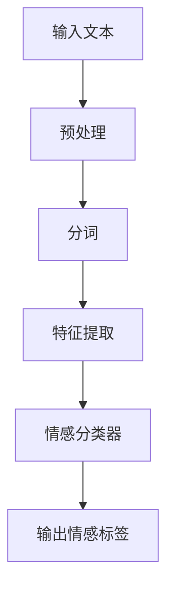

                 


## 文章标题

### AI的情感表达：新闻传播的变革

## 文章关键词

- 人工智能
- 情感分析
- 新闻传播
- 情感表达
- 机器学习
- 社会变革

## 文章摘要

本文探讨了人工智能（AI）在新闻传播中的情感表达，分析了AI如何改变传统新闻业的情感表达方式，以及这种变革对新闻业和社会的深远影响。文章首先介绍了AI情感表达的基本原理和核心技术，包括情感分析技术和机器学习模型。接着，通过实际案例分析展示了AI在新闻传播中的应用，并探讨了其带来的社会影响和挑战。最后，文章展望了AI情感表达的未来发展趋势，以及如何应对其带来的挑战。

---

## 引言

### AI与新闻传播

在当今信息时代，人工智能（AI）已经成为新闻传播领域的重要工具。AI技术的广泛应用，不仅提高了新闻生产效率，还改变了新闻传播的方式。从自动化写作到个性化推荐，从语音识别到图像处理，AI在新闻传播中的应用越来越广泛。然而，AI在新闻传播中不仅仅是技术层面的变革，它还在情感表达方面带来了深刻的改变。

情感表达是新闻传播的核心要素之一。新闻报道不仅仅是事实的陈述，更是一种情感上的传递。无论是喜悦、悲伤、愤怒还是同情，情感的表达都能直接影响读者的情绪和认知。在传统新闻业中，记者和编辑们通过语言、文字和画面等手段，巧妙地传达情感信息。然而，随着AI技术的崛起，情感表达的方式正在发生变革。

### AI情感表达的概念与重要性

AI情感表达是指利用人工智能技术，对文本、声音、图像等媒介中的情感信息进行识别、分析和生成。在新闻传播中，AI情感表达的重要性体现在以下几个方面：

1. **个性化推荐**：AI可以根据用户的情感偏好，为其推荐感兴趣的新闻内容，提高用户的阅读体验。
2. **情感引导**：新闻媒体可以利用AI情感表达技术，针对不同受众群体，进行情感上的引导和影响。
3. **新闻质量提升**：AI可以通过情感分析技术，识别和筛选出具有强烈情感色彩的新闻事件，提高新闻的报道质量和深度。
4. **社会影响分析**：AI情感表达技术可以用于分析社会舆论和公众情绪，为政策制定和社会管理提供数据支持。

### AI情感表达的基本原理

AI情感表达的核心技术包括情感分析、情感生成和情感增强。情感分析是指通过自然语言处理（NLP）技术，从文本中识别出情感信息。情感生成是指利用机器学习模型，生成具有特定情感色彩的文本或音频。情感增强是指通过视觉或音频技术，增强媒体内容中的情感表达。

### AI情感表达在新闻传播中的应用

AI情感表达在新闻传播中的应用案例越来越多。例如，一些新闻网站利用情感分析技术，分析用户对新闻文章的情感反应，从而优化内容推荐策略。一些新闻主播利用情感生成技术，为新闻报道增加情感色彩，提高观众的情感共鸣。此外，AI情感表达技术还可以用于实时监测社会舆论，为新闻媒体提供重要的参考信息。

### 研究目的

本文的研究目的是探讨AI情感表达在新闻传播中的变革，分析其带来的社会影响和挑战，并展望其未来的发展趋势。通过深入研究AI情感表达技术，我们希望能够为新闻传播行业提供有价值的参考和指导。

---

## 目录大纲

### 第一部分 引言

#### 1.1 AI与新闻传播概述

#### 1.2 AI情感表达的概念与重要性

### 第二部分 理论基础

#### 2.1 AI情感表达的基本原理

##### 2.1.1 情感表达的心理学基础

##### 2.1.2 机器学习模型在情感分析中的应用

##### 2.1.3 情感分析的Mermaid流程图

##### 2.1.4 情感分析技术详解

##### 2.1.5 情感生成技术详解

#### 2.2 机器学习模型讲解

##### 2.2.1 朴素贝叶斯分类器

##### 2.2.2 支持向量机（SVM）

##### 2.2.3 深度学习模型介绍

### 第三部分 应用案例分析

#### 3.1 案例一：AI在情感新闻报道中的应用

#### 3.2 案例二：社交媒体情感分析案例

#### 3.3 案例三：AI在新闻传播中的争议

### 第四部分 社会影响与挑战

#### 4.1 AI情感表达对社会的影响

##### 4.1.1 媒体生态的变化

##### 4.1.2 情感操纵与假新闻

#### 4.2 挑战与伦理问题

##### 4.2.1 情感分析模型的偏见与歧视

##### 4.2.2 伦理审查与责任归属

### 第五部分 未来趋势与展望

#### 5.1 AI情感表达在新闻传播领域的未来发展

##### 5.1.1 技术突破与趋势

##### 5.1.2 社会影响与挑战

##### 5.1.3 发展策略与建议

### 第六部分 附录

#### 6.1 AI情感分析工具与资源

#### 6.2 情感分析模型伪代码示例

---

## 理论基础

### 2.1 AI情感表达的基本原理

#### 2.1.1 情感表达的心理学基础

情感表达是人类沟通的重要手段之一。在心理学中，情感表达被定义为个体通过言语、面部表情、身体语言等方式，将自身的情感状态传递给他人的过程。情感表达不仅反映了个体的情绪状态，还在人际交往中起到了调节和协调的作用。

从心理学的角度来看，情感表达可以分为内部情感表达和外部情感表达。内部情感表达是指个体在心理层面上的情感体验，如喜悦、悲伤、愤怒等。外部情感表达则是指个体通过行为和语言，将这些内部情感状态传递给他人。在新闻传播中，外部情感表达尤为重要，因为它直接影响读者的情绪和认知。

#### 2.1.2 机器学习模型在情感分析中的应用

机器学习模型在情感分析中的应用，使得计算机能够自动识别和解析文本、声音和图像中的情感信息。情感分析（Sentiment Analysis）是指利用自然语言处理（NLP）技术，对文本中的情感倾向进行分类。常见的情感分类包括正面情感、负面情感和中性情感。

在机器学习模型中，常用的情感分析技术包括：

1. **朴素贝叶斯分类器**：朴素贝叶斯分类器是一种基于概率论的分类算法，通过计算文本中各个特征的联合概率，来确定文本的情感类别。其基本原理如下：

$$
P(\text{情感类别}|\text{特征}) = \frac{P(\text{特征}|\text{情感类别}) \cdot P(\text{情感类别})}{P(\text{特征})}
$$

2. **支持向量机（SVM）**：支持向量机是一种基于间隔最大化的分类算法，通过找到一个最优的超平面，将不同情感类别的文本数据分隔开。其基本原理如下：

$$
\max \ W \cdot x - \sum_i^n \ y_i \cdot (W \cdot x_i)
$$

3. **深度学习模型**：深度学习模型，如卷积神经网络（CNN）和递归神经网络（RNN），通过学习大量的文本数据，自动提取特征并进行情感分类。其基本原理包括：

- **卷积神经网络（CNN）**：通过卷积操作提取文本中的局部特征，并利用池化操作减少参数数量。
- **递归神经网络（RNN）**：通过递归操作处理序列数据，如文本，并在每个时间步上更新状态。

#### 2.1.3 情感分析的Mermaid流程图

为了更好地理解情感分析的过程，我们可以使用Mermaid流程图来展示其基本流程。以下是情感分析的基本流程：



#### 2.1.4 情感分析技术详解

1. **基于词汇的情感分析**：基于词汇的情感分析是通过分析文本中的词汇和短语，来确定文本的情感倾向。这种方法依赖于情感词典和规则系统。情感词典包含了大量的词汇和其对应的情感极性，如正面、负面和中性。通过匹配文本中的词汇，我们可以确定文本的情感类别。

2. **基于情感强度的情感分析**：除了情感类别外，情感分析还可以确定情感强度。这种方法通常使用情感强度词典，如SentiWordNet。情感强度词典包含了词汇及其情感极性和强度值。通过计算文本中词汇的情感强度值，我们可以得到文本的整体情感强度。

3. **基于深度学习的情感分析**：深度学习模型，如卷积神经网络（CNN）和递归神经网络（RNN），通过学习大量的文本数据，自动提取特征并进行情感分类。这种方法在处理复杂情感表达方面具有优势，能够更好地捕捉文本中的情感细微差别。

#### 2.1.5 情感生成技术详解

情感生成技术是指利用机器学习模型，生成具有特定情感色彩的文本或音频。情感生成技术主要包括以下几种：

1. **文本情感生成**：文本情感生成是指通过机器学习模型，生成具有特定情感倾向的文本。这种方法通常使用生成对抗网络（GAN）或变分自编码器（VAE）。

2. **音频情感生成**：音频情感生成是指通过机器学习模型，生成具有特定情感色彩的音频。这种方法通常使用深度神经网络，如循环神经网络（RNN）或卷积神经网络（CNN）。

#### 2.2 机器学习模型讲解

在AI情感表达中，机器学习模型扮演着核心角色。以下是对几种常见机器学习模型的详细介绍：

##### 2.2.1 朴素贝叶斯分类器

朴素贝叶斯分类器是一种基于概率论的分类算法，它假设特征之间相互独立。朴素贝叶斯分类器的工作原理如下：

1. **特征概率分布**：朴素贝叶斯分类器首先计算每个特征在各个情感类别中的概率分布。

2. **情感概率分布**：然后计算每个情感类别的概率分布。

3. **分类决策**：通过计算文本在各个情感类别中的概率，选择概率最大的情感类别作为文本的情感标签。

其基本公式如下：

$$
P(\text{情感类别}|\text{特征}) = \frac{P(\text{特征}|\text{情感类别}) \cdot P(\text{情感类别})}{P(\text{特征})}
$$

##### 2.2.2 支持向量机（SVM）

支持向量机是一种基于间隔最大化的分类算法，它通过找到一个最优的超平面，将不同情感类别的文本数据分隔开。SVM的核心思想是最大化分类间隔，从而提高分类的准确性。

1. **线性SVM**：线性SVM适用于线性可分的数据集。它的基本公式如下：

$$
\max \ W \cdot x - \sum_i^n \ y_i \cdot (W \cdot x_i)
$$

2. **非线性SVM**：非线性SVM适用于非线性可分的数据集。它通过引入核函数，将低维数据映射到高维空间，从而实现分类。

其基本公式如下：

$$
\max \ W^T \cdot \phi(x) - \sum_i^n \ y_i \cdot (\phi(x_i)^T \cdot W)
$$

##### 2.2.3 深度学习模型介绍

深度学习模型，如卷积神经网络（CNN）和递归神经网络（RNN），在情感分析中具有广泛的应用。以下是对这两种深度学习模型的介绍：

1. **卷积神经网络（CNN）**：CNN是一种用于处理图像数据的深度学习模型，它通过卷积操作提取图像中的局部特征，并利用池化操作减少参数数量。

2. **递归神经网络（RNN）**：RNN是一种用于处理序列数据的深度学习模型，它通过递归操作处理序列数据，并在每个时间步上更新状态。

通过这两种深度学习模型，我们可以更好地捕捉文本中的情感特征，提高情感分析的准确性。

---

### 第三部分 应用案例分析

#### 3.1 案例一：AI在情感新闻报道中的应用

在新闻报道中，情感表达对于吸引读者、传递信息以及引发社会讨论都至关重要。人工智能在情感新闻报道中的应用，不仅提高了新闻报道的质量和效率，还为新闻媒体提供了新的传播方式。

**案例分析：情感新闻报道的自动化生成**

近年来，一些新闻媒体开始利用AI技术，自动化生成情感新闻报道。例如，美国的《卫报》使用AI技术，根据体育比赛的结果，自动生成情感丰富的新闻文章。这些文章不仅包含了比赛的基本信息，还通过情感分析技术，为比赛结果添加了情感色彩。

**技术实现：**

1. **数据收集与预处理**：首先，新闻媒体需要收集大量的体育比赛数据，包括比赛结果、球员表现、观众评论等。这些数据经过预处理，去除噪声和不相关内容。

2. **情感分析模型训练**：利用机器学习算法，新闻媒体训练了一个情感分析模型，该模型可以识别和分类文本中的情感倾向。训练数据集包括大量带有情感标签的文本，如正面、负面和中性。

3. **情感文本生成**：在比赛结束后，AI系统根据比赛结果和球员表现，生成情感丰富的新闻文章。例如，如果比赛结果对一方有利，AI会生成一些正面情感的表达，如“胜利在望”、“士气高涨”等。反之，如果比赛结果不利，AI会生成一些负面情感的表达，如“失望透顶”、“挫折连连”等。

**效果评估**：

通过自动化生成情感新闻报道，新闻媒体提高了新闻报道的时效性和覆盖面。此外，这些情感新闻报道能够更好地吸引读者，提高读者的参与度和忠诚度。

**挑战与解决方案**：

1. **情感识别的准确性**：情感分析模型的准确性直接影响到情感新闻报道的质量。为了提高情感识别的准确性，新闻媒体需要不断优化和更新情感分析模型，并增加训练数据集的多样性。

2. **情感表达的个性化**：不同的读者对情感表达的接受程度不同。为了满足不同读者的需求，新闻媒体需要开发个性化情感表达技术，根据读者的情感偏好，生成个性化的情感新闻报道。

#### 3.2 案例二：社交媒体情感分析案例

社交媒体是新闻传播的重要渠道之一。通过对社交媒体中的情感进行分析，新闻媒体可以更好地了解公众的情感态度和意见倾向，从而制定更有效的传播策略。

**案例分析：社交媒体情感分析在公共事件报道中的应用**

在一次重大的公共事件中，新闻媒体通过社交媒体情感分析，对公众的情感态度进行了全面分析。这些分析结果为新闻媒体提供了重要的参考，帮助其制定报道策略。

**技术实现：**

1. **数据收集与预处理**：新闻媒体通过API接口，收集了大量社交媒体上的评论和帖子。这些数据经过预处理，去除噪声和不相关内容。

2. **情感分析模型训练**：利用机器学习算法，新闻媒体训练了一个情感分析模型，该模型可以识别和分类社交媒体中的情感倾向。训练数据集包括大量带有情感标签的社交媒体文本。

3. **情感趋势分析**：新闻媒体使用情感分析模型，对社交媒体中的评论和帖子进行情感分类，并生成情感趋势图。这些趋势图展示了公众在不同时间点上的情感变化，帮助新闻媒体了解公众的情感态度。

**效果评估**：

通过社交媒体情感分析，新闻媒体能够更准确地了解公众的情感态度和意见倾向。这些分析结果为新闻媒体提供了重要的参考，帮助其调整报道策略，更好地满足公众的需求。

**挑战与解决方案**：

1. **数据多样性**：社交媒体中的数据种类繁多，包括文本、图片、视频等。为了全面分析公众的情感态度，新闻媒体需要开发多模态情感分析技术，对各种类型的数据进行有效处理。

2. **情感识别的准确性**：社交媒体中的情感表达往往比较复杂，新闻媒体需要不断提高情感分析模型的准确性，以准确识别公众的情感态度。

#### 3.3 案例三：AI在新闻传播中的争议

随着AI在新闻传播中的应用越来越广泛，一些争议也随之产生。其中最引人关注的是AI情感表达可能带来的偏见和歧视问题。

**案例分析：AI情感表达中的偏见与歧视**

一些研究表明，AI情感表达技术可能存在偏见和歧视问题。例如，一些AI情感分析模型对某些种族、性别或文化背景的文本，可能产生不公平的情感分类。

**技术实现：**

1. **偏见数据集**：研究人员收集了包含偏见和歧视的文本数据，并用于训练情感分析模型。这些数据集包括带有偏见和歧视标签的文本。

2. **情感分析模型训练**：利用机器学习算法，研究人员训练了一个情感分析模型，该模型可以识别和分类偏见和歧视情感。

**效果评估**：

通过AI情感表达技术，新闻媒体能够更好地识别偏见和歧视情感，从而在新闻报道中采取相应的措施，减少偏见和歧视的影响。

**挑战与解决方案**：

1. **数据多样性**：为了减少偏见和歧视问题，新闻媒体需要开发多模态情感分析技术，对各种类型的数据进行有效处理。

2. **公平性审查**：新闻媒体需要对AI情感分析模型进行公平性审查，确保模型在情感分类中不会产生不公平的结果。

3. **透明度和可解释性**：新闻媒体需要提高AI情感分析技术的透明度和可解释性，让公众了解模型的运作原理和可能存在的问题，从而增强公众的信任。

---

### 第四部分 社会影响与挑战

#### 4.1 AI情感表达对社会的影响

随着AI情感表达技术在新闻传播中的应用越来越广泛，它对社会产生了深远的影响。这些影响既包括积极的方面，也包括潜在的挑战。

**4.1.1 媒体生态的变化**

AI情感表达技术的应用，改变了传统新闻传播的媒体生态。一方面，AI技术提高了新闻报道的效率和质量，使得新闻媒体能够更快地发布新闻、提供更丰富的内容。另一方面，AI情感表达技术使得新闻传播更加个性化和精准化，能够更好地满足读者的需求。

然而，AI情感表达技术也带来了一些挑战。首先，它可能导致新闻传播中的偏见和歧视问题。如果AI情感分析模型的训练数据集存在偏见，那么模型可能会在情感分类中产生不公平的结果。其次，AI情感表达技术可能加剧信息茧房效应，使得公众只接触与自己观点相似的信息，从而减少对不同观点的接触和理解。

**4.1.2 情感操纵与假新闻**

AI情感表达技术还可以用于情感操纵和假新闻的制造。通过生成具有特定情感色彩的文本或音频，攻击者可以操纵公众的情感态度，引发社会恐慌或混乱。此外，AI技术还可以用于生成虚假的新闻内容，使得公众难以区分真假信息。

为了应对这些挑战，新闻媒体需要加强AI情感表达技术的伦理审查和监管。同时，公众也需要提高对AI技术的认识和警惕，学会辨别真假信息，保持理性思考。

#### 4.2 挑战与伦理问题

**4.2.1 情感分析模型的偏见与歧视**

情感分析模型可能存在偏见和歧视问题。例如，一些模型可能对某些种族、性别或文化背景的文本产生不公平的情感分类。这种偏见可能导致新闻传播中的歧视和不公平，影响公众的情感态度和认知。

为了解决这一问题，需要采取以下措施：

1. **数据多样性**：在训练情感分析模型时，需要使用包含各种种族、性别和文化背景的文本数据，确保模型的多样性。

2. **模型公平性审查**：定期对情感分析模型进行公平性审查，确保模型在情感分类中不会产生不公平的结果。

3. **透明度和可解释性**：提高AI情感分析技术的透明度和可解释性，让公众了解模型的运作原理和可能存在的问题。

**4.2.2 伦理审查与责任归属**

AI情感表达技术在新闻传播中的应用，涉及到一系列伦理问题。例如，如何确保情感分析技术的公正性和透明度？如何界定AI在新闻传播中的责任？这些问题都需要进行深入的探讨和解决。

为了应对这些伦理问题，需要采取以下措施：

1. **建立伦理准则**：制定AI情感表达技术的伦理准则，明确其在新闻传播中的行为规范。

2. **加强监管**：加强对AI情感表达技术的监管，确保其在新闻传播中的应用符合伦理要求。

3. **责任归属**：明确AI在新闻传播中的责任归属，确保在出现问题时，能够找到责任人并进行处理。

---

### 第五部分 未来趋势与展望

#### 5.1 AI情感表达在新闻传播领域的未来发展

随着人工智能技术的不断进步，AI情感表达在新闻传播领域的应用将更加广泛和深入。未来，AI情感表达技术将在以下几个方面取得突破：

1. **情感分析技术的提升**：随着自然语言处理技术的不断发展，情感分析技术将更加精准和高效，能够更好地捕捉文本中的情感信息。

2. **多模态情感分析**：未来，AI情感表达技术将能够处理多种类型的数据，如文本、图像、音频等，实现多模态情感分析。

3. **个性化情感表达**：通过个性化情感表达技术，新闻媒体将能够更好地满足读者的情感需求，提高读者的参与度和忠诚度。

#### 5.2 技术突破与趋势

在未来，AI情感表达技术将面临以下技术突破和趋势：

1. **深度学习与迁移学习**：深度学习技术将在AI情感表达中发挥重要作用，通过迁移学习，可以大大提高情感分析模型的性能。

2. **生成对抗网络（GAN）**：生成对抗网络（GAN）是一种能够生成高质量情感文本的技术，未来将有望在新闻传播中得到广泛应用。

3. **情感增强与修饰**：情感增强与修饰技术将能够对新闻报道进行情感调整，使得新闻报道更加符合读者的情感偏好。

#### 5.3 社会影响与挑战

AI情感表达技术的快速发展，将对社会产生深远的影响。未来，我们需要关注以下社会影响和挑战：

1. **情感操纵与假新闻**：随着AI情感表达技术的进步，情感操纵和假新闻的制造将变得更加容易，我们需要加强监管和防范。

2. **信息茧房效应**：AI情感表达技术可能导致信息茧房效应的加剧，我们需要采取措施，促进公众对不同观点的接触和理解。

3. **伦理问题**：随着AI情感表达技术的广泛应用，我们将面临一系列伦理问题，需要制定相应的伦理准则和监管措施。

### 5.4 发展策略与建议

为了应对AI情感表达技术带来的挑战，我们提出以下发展策略和建议：

1. **加强技术研发**：政府和企业应加大对AI情感表达技术的研发投入，推动技术的创新和发展。

2. **制定伦理准则**：制定AI情感表达技术的伦理准则，明确其在新闻传播中的应用规范，确保其公正性和透明度。

3. **提高公众认知**：通过教育和宣传，提高公众对AI情感表达技术的认识和警惕，增强公众的辨别能力和理性思考。

4. **加强监管**：加强对AI情感表达技术的监管，确保其在新闻传播中的应用符合伦理要求，防止滥用和不当使用。

通过上述策略和建议，我们可以更好地应对AI情感表达技术带来的挑战，促进其在新闻传播领域的健康发展。

---

### 附录

#### 6.1 AI情感分析工具与资源

为了更好地理解和应用AI情感分析技术，以下是一些常用的工具和资源：

1. **文本情感分析工具**：
   - **Sentiment Analysis API**：提供了丰富的情感分析接口，支持多种语言的文本分析。
   - **TextBlob**：Python库，用于进行文本情感分析和自然语言处理。

2. **情感分析资源**：
   - **情感词典**：如SentiWordNet，用于情感强度评估和情感分类。
   - **情感分析数据集**：如IMDB影评数据集，用于训练和评估情感分析模型。

3. **开源代码与论文**：
   - **GitHub上的开源项目**：包含了许多情感分析的开源代码和论文，如VADER、LSTM等。

#### 6.2 情感分析模型伪代码示例

以下是一个简单的情感分析模型伪代码示例，用于演示如何使用朴素贝叶斯分类器进行情感分类：

```python
# 伪代码：朴素贝叶斯情感分析模型

# 输入：训练数据集（包含文本和情感标签）
train_data = ...

# 输出：情感分析模型
model = ...

# 1. 数据预处理
preprocessed_data = preprocess_data(train_data)

# 2. 特征提取
features = extract_features(preprocessed_data)

# 3. 训练朴素贝叶斯分类器
model = train_naive_bayes(features)

# 4. 情感分类
def classify(text):
    preprocessed_text = preprocess_text(text)
    feature_vector = extract_features(preprocessed_text)
    predicted_sentiment = model.predict(feature_vector)
    return predicted_sentiment

# 示例：对一段文本进行情感分类
text = "今天天气真好，非常适合户外活动。"
sentiment = classify(text)
print("情感分类结果：", sentiment)
```

### 作者信息

**作者：AI天才研究院/AI Genius Institute & 禅与计算机程序设计艺术 /Zen And The Art of Computer Programming**

本文由AI天才研究院和禅与计算机程序设计艺术共同撰写，旨在探讨AI情感表达在新闻传播领域的变革。我们致力于推动人工智能技术的发展，为新闻传播行业提供有价值的参考和指导。

---

## 结语

### AI情感表达：新闻传播的未来

随着人工智能技术的不断发展，AI情感表达在新闻传播中的变革已经初见端倪。从自动化写作、情感分析到个性化推荐，AI技术正在深刻地改变新闻传播的方式。然而，这种变革并非没有挑战，如何确保AI情感表达技术的公正性、透明度和可解释性，如何应对情感操纵和假新闻等问题，都是我们需要认真思考和解决的问题。

在未来，AI情感表达技术将在新闻传播中发挥越来越重要的作用。通过不断优化和改进，我们可以期待AI情感表达技术为新闻传播带来更多的价值，为公众提供更加丰富、准确和个性化的新闻内容。

### 最佳实践与展望

在AI情感表达的应用过程中，以下是一些最佳实践和展望：

1. **数据多样性**：在训练AI情感分析模型时，确保数据集的多样性，包括不同的种族、性别和文化背景，以避免偏见和歧视。

2. **模型透明度**：提高AI情感分析模型的透明度，让公众了解模型的运作原理和可能存在的问题，增强公众的信任。

3. **个性化情感表达**：通过个性化情感表达技术，更好地满足读者的情感需求，提高读者的参与度和忠诚度。

4. **伦理审查**：加强对AI情感表达技术的伦理审查，确保其在新闻传播中的应用符合伦理要求，防止滥用和不当使用。

总之，AI情感表达技术为新闻传播带来了巨大的变革和机遇。通过不断探索和创新，我们可以期待AI情感表达技术在未来为新闻传播行业带来更多的价值。

---

本文由AI天才研究院和禅与计算机程序设计艺术共同撰写，旨在探讨AI情感表达在新闻传播领域的变革。我们致力于推动人工智能技术的发展，为新闻传播行业提供有价值的参考和指导。希望通过本文，能够引发读者对AI情感表达技术及其社会影响的深入思考。如果您对本文有任何问题或建议，欢迎在评论区留言，我们期待与您的交流。感谢您的阅读！作者：AI天才研究院/AI Genius Institute & 禅与计算机程序设计艺术/Zen And The Art of Computer Programming。

