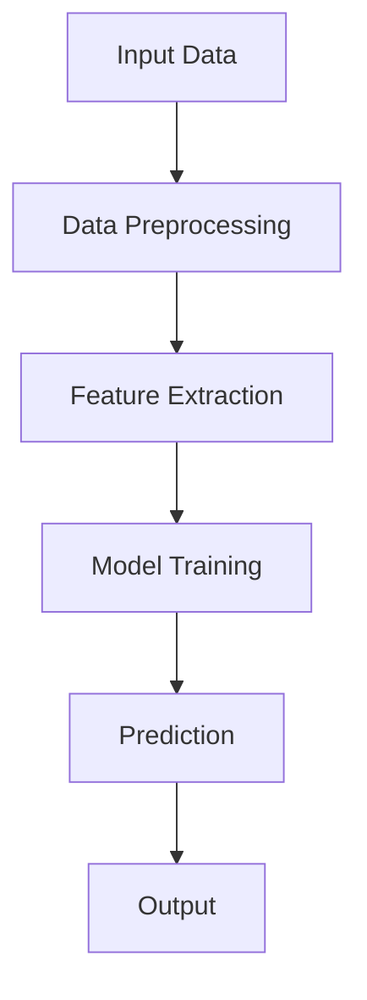

                 


### AI's Emotional Needs: New Considerations for Social Resource Allocation

#### Keywords: AI, Emotional Recognition, Social Resource Allocation, Optimization, Challenges

#### Abstract: This article explores the emerging concept of AI's emotional needs and its implications for the allocation of social resources. By delving into the technology behind AI emotional recognition and analyzing the relationship between emotions and resource distribution, we aim to highlight the potential of AI to revolutionize social resource management. The article presents a comprehensive overview of the current state-of-the-art in AI emotional recognition, discusses the role of emotions in resource allocation, examines the challenges and opportunities of AI-driven optimization, and provides case studies illustrating real-world applications. We conclude with future prospects and challenges in this innovative field.

---

### Introduction and Background

#### 1.1 Introduction to AI's Emotional Needs

##### 1.1.1 Background and Significance

The advent of artificial intelligence (AI) has revolutionized various sectors, from healthcare and finance to transportation and education. One of the most intriguing areas of AI research is emotional recognition, which involves understanding and interpreting emotional states exhibited by humans and other entities. While AI has made significant strides in fields such as image recognition and natural language processing, emotional recognition presents a unique challenge due to the complexity and subtlety of human emotions.

Understanding AI's emotional needs is crucial for several reasons. Firstly, emotions play a pivotal role in human decision-making and social interactions. By recognizing and addressing emotional needs, AI systems can enhance their ability to interact with humans more effectively, leading to improved user experiences and increased productivity. Secondly, AI's emotional needs can influence how resources are allocated within society, potentially leading to more equitable and efficient distribution of resources.

##### 1.1.2 Emergence of AI in Social Resource Allocation

Traditionally, social resource allocation has been a complex and often contentious process, involving numerous stakeholders and requiring a deep understanding of social, economic, and political factors. With the rise of AI, however, there is a growing interest in leveraging AI technologies to optimize resource allocation. AI can analyze large volumes of data, identify patterns and trends, and make data-driven decisions that may be difficult or time-consuming for humans to achieve.

AI's ability to recognize and process emotional data opens up new possibilities for social resource allocation. For example, AI systems can analyze emotional signals from social media to gauge public sentiment and predict social trends, enabling policymakers to make more informed decisions. Additionally, AI can help identify individuals or communities with unmet emotional needs, ensuring that resources are directed towards those who need them most.

---

#### The Importance of Understanding Emotional Needs

##### 1.2.1 Human Emotional Needs

Human emotions are complex and multifaceted, encompassing a wide range of feelings such as happiness, sadness, anger, fear, and joy. These emotions are not only a fundamental aspect of human experience but also play a critical role in decision-making and social interactions. For example, happiness and joy can enhance motivation and productivity, while sadness and fear can signal potential threats and inspire caution. Understanding these emotions is essential for creating effective interventions and policies that address the emotional well-being of individuals and communities.

##### 1.2.2 AI's Ability to Recognize and Address Emotional Needs

AI systems have made significant progress in recognizing and interpreting human emotions. This progress is primarily driven by advancements in computer vision, natural language processing, and machine learning. Computer vision algorithms can analyze facial expressions, skin color, and body language to detect emotional states. Natural language processing techniques can interpret emotional content in text and speech, while machine learning models can learn from large datasets to predict emotional states with high accuracy.

AI's ability to recognize and address emotional needs has numerous applications. In healthcare, AI can assist in diagnosing mental health disorders by analyzing emotional signals from patients. In education, AI can personalize learning experiences by understanding students' emotional states and adjusting instructional methods accordingly. In social services, AI can help identify individuals at risk of social isolation or emotional distress, enabling early intervention and support.

---

### AI Emotional Recognition Technology

#### 2.1 Fundamentals of AI Emotional Recognition

##### 2.1.1 Core Concepts and Relationships

To understand AI emotional recognition, it's essential to grasp the core concepts and their relationships. Below is a Mermaid flowchart illustrating the key components of an AI emotional recognition system.



- **Input Data**: The raw data, such as images, text, or audio, containing emotional information.
- **Data Preprocessing**: Steps to clean and prepare the data for feature extraction, including normalization, scaling, and handling missing values.
- **Feature Extraction**: The process of extracting relevant features from the preprocessed data, which are used to represent emotional states.
- **Model Training**: The use of machine learning algorithms to train a model on labeled emotional data, enabling the model to recognize emotional states.
- **Prediction**: The application of the trained model to new, unseen data to predict emotional states.
- **Output**: The emotional state predicted by the AI system.

##### 2.1.2 Algorithmic Principles

AI emotional recognition relies on several key algorithms, including facial recognition, natural language processing (NLP), and sentiment analysis. Below is a pseudo-code representation of the core algorithmic principles involved in each of these processes.

```python
# Facial Recognition
def facial_recognition(image):
    face区域内图像预处理
    feature_vectors = extract_face_features(image)
    predicted_emotion = classify_emotion(feature_vectors)
    return predicted_emotion

# Natural Language Processing
def nlp_sentiment_analysis(text):
    cleaned_text = preprocess_text(text)
    sentiment_score = calculate_sentiment(cleaned_text)
    predicted_emotion = interpret_sentiment_score(sentiment_score)
    return predicted_emotion

# Sentiment Analysis
def sentiment_analysis(audio):
    audio_features = extract_audio_features(audio)
    sentiment_score = calculate_sentiment(audio_features)
    predicted_emotion = interpret_sentiment_score(sentiment_score)
    return predicted_emotion
```

##### 2.1.3 Application Scenarios

AI emotional recognition has numerous practical applications across various domains. Here are a few examples:

- **Healthcare**: AI can assist in diagnosing mental health disorders by analyzing emotional signals from patients' facial expressions and speech. For instance, AI can detect signs of depression or anxiety based on changes in facial muscle movements and tone of voice.
- **Education**: AI systems can personalize learning experiences by understanding students' emotional states. For example, an AI tutor can adapt its teaching style based on whether a student appears frustrated or engaged.
- **Customer Service**: AI-powered chatbots can understand and respond to customers' emotional needs, providing more empathetic and effective support.

---

### Emotional Needs and Social Resource Allocation

#### 2.2 The Role of Emotions in Resource Allocation

Emotions play a significant role in resource allocation decisions, both at the individual and societal levels. Here, we explore how emotions influence resource distribution and examine the implications for social policy.

##### 2.2.1 Emotional Needs and Prioritization

When allocating resources, individuals and policymakers often consider emotional needs alongside other factors such as economic and social factors. For example, in times of crisis, such as natural disasters or pandemics, emotional needs—like safety, security, and comfort—often take precedence over other considerations. This prioritization reflects the understanding that emotional well-being is crucial for overall societal resilience.

##### 2.2.2 Emotional Inequities in Resource Allocation

Emotional needs can also lead to inequities in resource allocation. For instance, individuals with visible emotional needs, such as those with visible disabilities or those who appear to be in distress, may receive more attention and resources than those with hidden or less visible emotional needs. This can result in unequal distribution of resources, potentially exacerbating social inequalities.

##### 2.2.3 Emotional Insights for Policy Development

By leveraging AI emotional recognition technology, policymakers can gain valuable insights into the emotional needs of individuals and communities. This information can inform more targeted and effective resource allocation strategies. For example, AI can help identify underserved populations with high emotional needs, enabling policymakers to allocate resources more equitably.

---

### AI Optimization of Social Resource Allocation

#### 2.3 The Potential of AI in Resource Allocation

AI's ability to recognize and process emotional data opens up new opportunities for optimizing social resource allocation. By analyzing emotional signals, AI can identify individuals or communities with unmet emotional needs and prioritize resource distribution accordingly. Here, we examine the potential benefits and challenges of AI-driven optimization.

##### 2.3.1 Improved Efficiency and Equity

AI can help streamline resource allocation processes by analyzing vast amounts of data quickly and accurately. This can lead to more efficient use of resources and a more equitable distribution of resources. For example, AI can identify individuals who are most in need of mental health services and prioritize them for support, ensuring that resources are directed to those who need them most.

##### 2.3.2 Data-Driven Decision Making

AI-driven optimization can help policymakers make more informed decisions by providing data-driven insights into the emotional needs of different populations. This can lead to more effective and targeted resource allocation strategies, improving outcomes for individuals and communities.

##### 2.3.3 Challenges and Limitations

Despite the potential benefits, AI-driven optimization of social resource allocation also faces challenges and limitations. One challenge is the accuracy of emotional recognition algorithms, which can vary depending on the context and the type of emotional signal being analyzed. Another challenge is the ethical implications of using emotional data for resource allocation, particularly if the data is used to make decisions about individuals' access to critical resources.

---

### Case Studies

#### 2.4 Real-World Applications of AI in Resource Allocation

To illustrate the potential of AI in optimizing social resource allocation, we present several case studies highlighting real-world applications.

##### 2.4.1 Case Study 1: Mental Health Support

In one example, an AI-driven mental health support system was developed to identify individuals with high levels of emotional distress. By analyzing social media posts, chatbot interactions, and other digital data, the system could detect signs of depression, anxiety, and other mental health disorders. This information was then used to prioritize individuals for mental health support services, leading to more effective intervention and improved outcomes.

##### 2.4.2 Case Study 2: Disaster Response

During a natural disaster, an AI system was deployed to analyze social media data and identify communities with high levels of emotional distress. This information was used to allocate resources more effectively, ensuring that those in need of emotional support and other resources received timely assistance.

##### 2.4.3 Case Study 3: Education

In an educational setting, an AI-powered tutoring system was developed to personalize learning experiences based on students' emotional states. By analyzing facial expressions and speech, the system could detect when students were feeling frustrated or disengaged and adapt its teaching methods accordingly, improving learning outcomes.

---

### Future Directions and Challenges

#### 2.5 The Road Ahead

The potential of AI in optimizing social resource allocation is promising, but it also presents several challenges and opportunities for future research and development. Here, we discuss future directions and challenges in this emerging field.

##### 2.5.1 Improved Algorithm Accuracy

One of the key challenges in AI-driven resource allocation is the accuracy of emotional recognition algorithms. Advances in machine learning and data science can help improve the accuracy of these algorithms, enabling more reliable and effective resource allocation.

##### 2.5.2 Ethical Considerations

The use of emotional data for resource allocation raises important ethical considerations, particularly regarding privacy and data security. It's crucial to develop robust ethical guidelines and regulations to ensure the responsible use of emotional data.

##### 2.5.3 Integration with Human Decision-Making

While AI has the potential to optimize social resource allocation, it's essential to maintain a balance between machine-driven decisions and human judgment. Integrating AI insights with human expertise can lead to more effective and ethical resource allocation strategies.

---

### Conclusion

#### 2.6 Summary and Reflections

In conclusion, AI's emotional needs present a new dimension for considering social resource allocation. By leveraging AI's ability to recognize and process emotional data, we can enhance the efficiency and equity of resource distribution. However, this also comes with challenges, including algorithm accuracy, ethical considerations, and the need for human-AI collaboration. As we continue to explore the potential of AI in this field, it's crucial to approach it with careful consideration and ethical responsibility.

---

### Author Information

#### 作者：AI天才研究院/AI Genius Institute & 禅与计算机程序设计艺术 /Zen And The Art of Computer Programming

