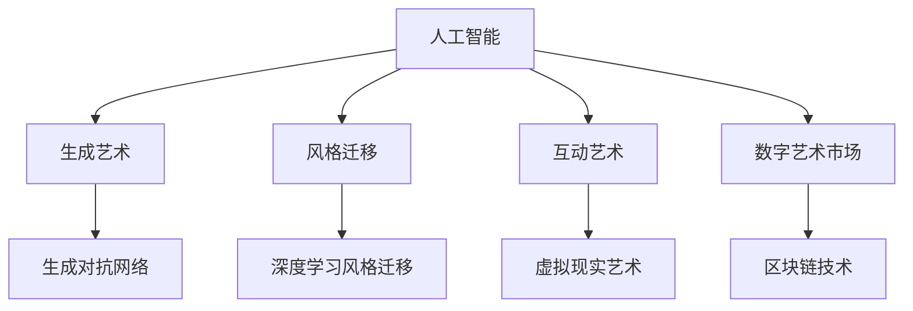

                 


## 文章标题：AI艺术创作者：大模型对艺术产业的冲击与机遇

### 关键词
- AI艺术创作
- 大模型
- 艺术产业
- 冲击与机遇

### 摘要
本文深入探讨了人工智能（AI）特别是大模型在艺术创作领域的应用及其对艺术产业带来的冲击与机遇。通过对AI与艺术融合的历史回顾、大模型的定义与特点、AI艺术创作的现状与趋势的分析，本文揭示了AI技术如何改变传统艺术创作的模式。文章还探讨了大模型在艺术创作中的应用，包括图像生成、视频动画和音乐创作，并详细讲解了其核心算法原理和数学模型。在此基础上，本文评估了大模型对艺术产业的影响，分析了商业模式、法律与伦理挑战以及社会影响，并提出了艺术产业面临机遇与挑战的应对策略。通过实战案例，文章展示了AI艺术创作的实际应用和未来发展趋势，为读者提供了全面的AI艺术创作指南。

## 引言部分

### 1.1 AI与艺术：一个新兴的交汇点

**背景介绍**
人工智能（AI）和艺术是两个看似迥异却又逐渐融合的领域。AI作为计算机科学的一个分支，旨在通过模拟人类智能来解决复杂问题，而艺术则是人类情感、想象力和创造力的表达。随着技术的进步，AI在艺术创作中的应用越来越广泛，从早期的简单的图像处理到如今的大模型驱动的复杂艺术创作，AI已经成为艺术创作的重要工具。

**核心概念与联系**
AI与艺术的交汇点主要体现在以下几个方面：
1. **生成艺术**：利用算法生成视觉艺术和音乐，如GANs（生成对抗网络）生成的图像和音乐生成模型。
2. **风格迁移**：将一种艺术风格应用到另一件作品上，如深度学习风格迁移技术。
3. **互动艺术**：利用AI技术创造交互式的艺术作品，如动态雕塑和虚拟现实艺术。
4. **数字艺术市场**：AI技术改变了艺术市场的面貌，通过数字化和区块链技术确保艺术品的原创性和流通性。

**Mermaid 流程图**


### 1.2 大模型的崛起

**核心概念与联系**
大模型指的是具有巨大参数量的神经网络模型，例如GPT-3、DALL-E和BigGAN等。这些模型通过海量数据训练，能够生成高质量、多样化的内容。大模型的崛起主要基于以下几个核心概念：
1. **深度学习**：神经网络层次结构更深，能够捕捉更复杂的特征。
2. **大数据**：海量的数据用于训练，提高了模型的泛化能力。
3. **并行计算**：利用GPU和TPU等硬件加速训练过程，大幅缩短了训练时间。

**核心算法原理讲解**
大模型的核心算法主要基于以下几个步骤：
1. **数据预处理**：对输入数据进行标准化处理，如文本数据清洗、图像数据归一化。
2. **神经网络架构**：构建多层神经网络，通过前向传播和反向传播训练模型参数。
3. **优化算法**：使用梯度下降、Adam等优化算法，提高模型的收敛速度。

**伪代码**
```python
# 大模型训练伪代码
def train_model(data, labels, epochs, learning_rate):
    # 初始化模型参数
    model = initialize_model()
    
    for epoch in range(epochs):
        # 前向传播
        predictions = model.forward_pass(data)
        
        # 计算损失
        loss = compute_loss(predictions, labels)
        
        # 反向传播
        grads = model.backward_pass(loss)
        
        # 更新参数
        model.update_params(grads, learning_rate)
        
    return model
```

**数学模型和公式**
大模型的训练通常涉及以下数学公式：
$$
\begin{aligned}
\text{损失函数} & : L(\theta; x, y) \\
\text{梯度下降} & : \theta_{\text{new}} = \theta_{\text{old}} - \alpha \cdot \nabla_\theta L(\theta; x, y)
\end{aligned}
$$
**举例说明**
假设我们有一个训练图像生成模型的任务，数据集包含10,000张图片及其对应的标签。通过上述伪代码和公式，我们可以训练一个基于深度学习的图像生成模型，从而实现高质量的图像生成。

## AI与艺术产业的关系

### 2.1 艺术产业的传统与变革

**核心概念与联系**
艺术产业传统上包括艺术家、画廊、拍卖行和收藏家等环节。艺术家创作艺术品，通过画廊进行展示和销售，最终由收藏家购买。随着技术的发展，特别是数字艺术和区块链技术的兴起，艺术产业正经历着深刻变革。
1. **数字艺术**：利用计算机技术和软件创作和展示艺术品，如数字绘画、虚拟艺术等。
2. **区块链艺术**：通过区块链技术确保艺术品的原创性和流通性，如非同质化代币（NFT）。

**核心算法原理讲解**
数字艺术和区块链艺术的核心算法原理包括：
1. **图像处理算法**：如卷积神经网络（CNN）用于图像生成和风格迁移。
2. **区块链算法**：如工作量证明（PoW）和权益证明（PoS），用于验证交易的合法性和安全性。

**伪代码**
```python
# 数字艺术生成伪代码
def generate_artwork(data, model):
    # 预处理输入数据
    processed_data = preprocess(data)
    
    # 使用模型生成艺术作品
    artwork = model.generate(processed_data)
    
    # 后处理生成结果
    final_artwork = postprocess(artwork)
    
    return final_artwork
```

**数学模型和公式**
数字艺术生成的数学模型通常涉及以下公式：
$$
\begin{aligned}
\text{生成器} & : G(z) \\
\text{损失函数} & : L(G(z); x) = \text{GAN损失函数}
\end{aligned}
$$
**举例说明**
假设我们有一个生成艺术作品的任务，数据集包含100张数字图像。通过上述伪代码和公式，我们可以训练一个生成对抗网络（GAN），从而生成高质量的艺术作品。

### 2.2 大模型对艺术产业的冲击

**核心概念与联系**
大模型对艺术产业的冲击主要体现在以下几个方面：
1. **艺术创作的自动化**：大模型可以自动生成艺术作品，减少了艺术家的人力投入。
2. **艺术市场的变革**：数字艺术和区块链技术改变了艺术品的交易和展示方式。
3. **艺术教育的变革**：大模型和AI技术为艺术教育提供了新的工具和方法。

**核心算法原理讲解**
大模型对艺术产业的冲击主要基于以下几个算法原理：
1. **生成对抗网络（GAN）**：通过对抗训练生成高质量的艺术作品。
2. **变分自编码器（VAE）**：通过概率模型生成多样化的艺术作品。
3. **风格迁移**：将一种艺术风格应用到另一件作品上，如深度学习风格迁移技术。

**伪代码**
```python
# GAN训练伪代码
def train_gan(generator, discriminator, data, epochs):
    for epoch in range(epochs):
        # 随机采样噪声
        z = sample_noise(batch_size)
        
        # 生成器生成假图像
        fake_images = generator.generate(z)
        
        # 判别器评估假图像
        d_fake = discriminator.forward(fake_images)
        
        # 生成器生成真实图像
        real_images = data[batch_index]
        d_real = discriminator.forward(real_images)
        
        # 计算损失函数
        g_loss = compute_g_loss(d_fake)
        d_loss = compute_d_loss(d_real, d_fake)
        
        # 反向传播和参数更新
        generator.backward_pass(g_loss)
        discriminator.backward_pass(d_loss)
        
    return generator, discriminator
```

**数学模型和公式**
GAN的训练涉及以下数学模型：
$$
\begin{aligned}
\text{生成器损失} & : g_l = -\log(D(G(z))) \\
\text{判别器损失} & : d_l = -\log(D(x)) - \log(1 - D(G(z)))
\end{aligned}
$$
**举例说明**
假设我们有一个训练GAN的任务，数据集包含10,000张数字图像。通过上述伪代码和公式，我们可以训练一个生成器和一个判别器，从而实现高质量的艺术作品生成。

### 2.3 大模型与艺术家的合作

**核心概念与联系**
大模型与艺术家的合作主要体现在以下几个方面：
1. **辅助创作**：大模型可以帮助艺术家快速生成创意，从而提高创作效率。
2. **个性化定制**：大模型可以根据用户需求生成个性化的艺术品。
3. **创新合作**：艺术家可以利用大模型探索新的艺术形式和表现手法。

**核心算法原理讲解**
大模型与艺术家的合作主要基于以下几个算法原理：
1. **协同过滤**：通过分析用户历史数据和偏好，推荐新的艺术作品。
2. **生成对抗网络（GAN）**：通过对抗训练生成新的艺术风格和作品。
3. **自然语言处理（NLP）**：通过分析文本数据，生成与艺术作品相关的描述和故事。

**伪代码**
```python
# 协同过滤推荐系统伪代码
def recommend_arts(user_profile, art_dataset):
    # 计算用户与艺术品的相似度
    similarities = compute_similarity(user_profile, art_dataset)
    
    # 排序相似度最高的艺术品
    sorted_arts = sorted(similarities, key=lambda x: x[1], reverse=True)
    
    # 返回推荐的艺术品列表
    return [art_id for art_id, similarity in sorted_arts]
```

**数学模型和公式**
协同过滤的数学模型涉及以下公式：
$$
\begin{aligned}
\text{用户-艺术品相似度} & : sim(u, i) = \frac{\sum_{j \in R_i} w_{uj} w_{ij}}{\sqrt{\sum_{j \in R_i} w_{uj}^2 \sum_{j \in R_i} w_{ij}^2}}
\end{aligned}
$$
**举例说明**
假设我们有一个推荐艺术品给用户的任务，用户的历史数据和艺术品数据集已准备好。通过上述伪代码和公式，我们可以计算用户与艺术品的相似度，并推荐相似度最高的艺术品。

## 大模型在艺术创作中的应用

### 3.1 图像生成与风格迁移

**核心概念与联系**
图像生成与风格迁移是AI在艺术创作中应用的两个重要方向。图像生成是指利用算法生成新的图像，而风格迁移则是将一种艺术风格应用到另一件作品上。

**核心算法原理讲解**
图像生成与风格迁移的核心算法主要包括：
1. **生成对抗网络（GAN）**：通过对抗训练生成新的图像。
2. **变分自编码器（VAE）**：通过概率模型生成多样化的图像。
3. **深度学习风格迁移**：如CycleGAN和StyleGAN，能够将一种风格应用到另一件图像上。

**伪代码**
```python
# GAN图像生成伪代码
def generate_image(generator, noise):
    generated_image = generator.generate(noise)
    return generated_image
```

**数学模型和公式**
GAN的图像生成数学模型涉及以下公式：
$$
\begin{aligned}
\text{生成器损失} & : g_l = -\log(D(G(z))) \\
\text{判别器损失} & : d_l = -\log(D(x)) - \log(1 - D(G(z)))
\end{aligned}
$$

**举例说明**
假设我们有一个生成图像的任务，生成器已经训练好。通过上述伪代码和公式，我们可以生成一张新的图像。

### 3.2 视频与动画创作

**核心概念与联系**
视频与动画创作是AI在艺术创作中的另一个重要应用方向。视频创作涉及视频生成、编辑和特效制作，而动画创作则包括角色设计、场景构建和动画效果。

**核心算法原理讲解**
视频与动画创作的核心算法主要包括：
1. **视频生成**：如RNN和GAN用于生成新的视频内容。
2. **视频编辑**：如CNN和循环神经网络用于视频的拼接、剪辑和特效添加。
3. **动画制作**：如深度学习算法用于角色动作捕捉和场景渲染。

**伪代码**
```python
# 视频生成伪代码
def generate_video(model, frames, frame_rate):
    video = []
    for frame in frames:
        processed_frame = preprocess(frame)
        generated_frame = model.generate(processed_frame)
        video.append(generated_frame)
    return create_video(video, frame_rate)
```

**数学模型和公式**
视频生成的数学模型通常涉及以下公式：
$$
\begin{aligned}
\text{生成器损失} & : g_l = -\log(D(G(z))) \\
\text{判别器损失} & : d_l = -\log(D(x)) - \log(1 - D(G(z)))
\end{aligned}
$$

**举例说明**
假设我们有一个生成视频的任务，模型已经训练好。通过上述伪代码和公式，我们可以生成一段新的视频内容。

### 3.3 音乐创作与生成

**核心概念与联系**
音乐创作与生成是AI在艺术创作中的另一个重要方向。利用AI技术，我们可以生成新的音乐旋律、和声和节奏。

**核心算法原理讲解**
音乐创作与生成的核心算法主要包括：
1. **生成对抗网络（GAN）**：用于生成新的音乐旋律和和声。
2. **变分自编码器（VAE）**：用于生成多样化的音乐节奏。
3. **循环神经网络（RNN）**：用于学习音乐序列，生成新的音乐片段。

**伪代码**
```python
# 音乐生成伪代码
def generate_music(model, melody, harmony):
    processed_melody = preprocess(melody)
    processed_harmony = preprocess(harmony)
    music_sequence = model.generate(processed_melody, processed_harmony)
    return postprocess(music_sequence)
```

**数学模型和公式**
音乐生成的数学模型通常涉及以下公式：
$$
\begin{aligned}
\text{生成器损失} & : g_l = -\log(D(G(z))) \\
\text{判别器损失} & : d_l = -\log(D(x)) - \log(1 - D(G(z)))
\end{aligned}
$$

**举例说明**
假设我们有一个生成音乐的任务，模型已经训练好。通过上述伪代码和公式，我们可以生成一段新的音乐旋律。

## 大模型对艺术产业的影响

### 4.1 商业模式的改变

**核心概念与联系**
大模型对艺术产业的影响之一是改变了商业模式的运作方式。传统的艺术商业模式依赖于艺术家、画廊、拍卖行等环节，而大模型的引入使得这些环节得以重构。

**核心算法原理讲解**
改变商业模式的算法原理主要包括：
1. **区块链技术**：通过加密和分布式账本技术，确保艺术品的原创性和可追溯性。
2. **非同质化代币（NFT）**：通过数字加密货币，实现艺术品的唯一性和稀缺性。

**伪代码**
```python
# 创建NFT伪代码
def create_nft(artwork, metadata):
    nft = blockchain.create_token(artwork, metadata)
    blockchain.add_token(nft)
    return nft
```

**数学模型和公式**
区块链技术的数学模型涉及以下公式：
$$
\begin{aligned}
\text{区块链交易验证} & : V(T) = \text{验证交易是否合法} \\
\text{非同质化代币} & : NFT = \text{加密唯一标识符}
\end{aligned}
$$

**举例说明**
假设我们有一个创建NFT的任务，艺术品及其元数据已准备好。通过上述伪代码和公式，我们可以创建一个唯一的NFT，并将其添加到区块链中。

### 4.2 法律与伦理挑战

**核心概念与联系**
大模型在艺术创作中的应用带来了法律和伦理上的挑战。这些问题包括版权保护、知识产权归属、艺术家的权益保护等。

**核心算法原理讲解**
解决法律与伦理挑战的算法原理主要包括：
1. **数字指纹**：通过生成唯一的数字指纹，确保艺术品的原创性。
2. **智能合约**：通过区块链技术实现自动化的版权保护和交易。

**伪代码**
```python
# 智能合约伪代码
def smart_contract(creator, artwork, royalty):
    contract = blockchain.create_contract(creator, artwork, royalty)
    blockchain.execute_contract(contract)
    return contract
```

**数学模型和公式**
智能合约的数学模型涉及以下公式：
$$
\begin{aligned}
\text{智能合约执行} & : E(C) = \text{执行合约操作} \\
\text{版权保护} & : IP = \text{知识产权}
\end{aligned}
$$

**举例说明**
假设我们有一个智能合约的任务，艺术家及其作品和版税比例已确定。通过上述伪代码和公式，我们可以创建一个智能合约，并在区块链上执行。

### 4.3 社会影响与艺术价值的思考

**核心概念与联系**
大模型对艺术产业的影响不仅体现在技术和商业层面，还涉及到社会影响和艺术价值的思考。这些问题包括人工智能是否能够替代艺术家、艺术创作的本质是什么等。

**核心算法原理讲解**
社会影响与艺术价值的思考涉及以下几个方面的算法原理：
1. **情感分析**：通过自然语言处理技术分析用户的情感反应，了解艺术品的社会影响。
2. **生成对抗网络（GAN）**：通过对抗训练，探索艺术创作的多样性和创新性。

**伪代码**
```python
# 情感分析伪代码
def analyze_emotion(text):
    emotions = emotion_model.predict(text)
    return emotions
```

**数学模型和公式**
情感分析的数学模型涉及以下公式：
$$
\begin{aligned}
\text{情感分析} & : E(t) = f(\text{文本特征})
\end{aligned}
$$

**举例说明**
假设我们有一个分析用户评论情感的任务，文本数据已准备好。通过上述伪代码和公式，我们可以分析用户的情感反应。

## 艺术产业的机遇与挑战

### 5.1 机遇分析

**核心概念与联系**
艺术产业的机遇主要体现在以下几个方面：
1. **创新艺术形式**：大模型为艺术家提供了新的创作工具和灵感。
2. **拓宽市场**：数字艺术和区块链技术扩大了艺术品的受众和市场。
3. **降低创作门槛**：AI技术降低了艺术创作的门槛，让更多人参与艺术创作。

**核心算法原理讲解**
艺术产业的机遇主要基于以下算法原理：
1. **生成对抗网络（GAN）**：通过对抗训练生成新的艺术形式。
2. **变分自编码器（VAE）**：通过概率模型生成多样化的艺术作品。
3. **风格迁移**：将一种艺术风格应用到另一件作品上，如深度学习风格迁移技术。

**伪代码**
```python
# GAN艺术形式创新伪代码
def generate_innovative_art(generator, styles):
    innovative_arts = []
    for style in styles:
        noise = generate_noise()
        generated_art = generator.generate(noise, style)
        innovative_arts.append(generated_art)
    return innovative_arts
```

**数学模型和公式**
GAN的艺术形式创新涉及以下公式：
$$
\begin{aligned}
\text{生成器损失} & : g_l = -\log(D(G(z))) \\
\text{判别器损失} & : d_l = -\log(D(x)) - \log(1 - D(G(z)))
\end{aligned}
$$

**举例说明**
假设我们有一个生成创新艺术形式的任务，生成器已经训练好，并且有多种艺术风格。通过上述伪代码和公式，我们可以生成具有多种艺术风格的新作品。

### 5.2 挑战与对策

**核心概念与联系**
艺术产业面临的挑战主要包括：
1. **技术局限**：大模型的计算能力和数据需求较高，限制了其应用范围。
2. **法律和伦理问题**：艺术作品的版权和知识产权保护问题。
3. **社会认可**：人工智能创作的艺术作品是否能够得到社会和艺术的认可。

**核心算法原理讲解**
应对挑战的算法原理主要包括：
1. **加密技术**：保护艺术作品的版权和知识产权。
2. **社会参与**：通过公众参与和反馈，提高AI艺术作品的社会认可度。
3. **技术创新**：持续改进大模型和AI艺术创作技术，提高其创作能力。

**伪代码**
```python
# 加密保护版权伪代码
def encrypt_artwork(artwork, key):
    encrypted_artwork = encryption_algorithm(artwork, key)
    return encrypted_artwork
```

**数学模型和公式**
加密技术的数学模型涉及以下公式：
$$
\begin{aligned}
\text{加密算法} & : E(x, k) = c \\
\text{解密算法} & : D(c, k) = x
\end{aligned}
$$

**举例说明**
假设我们有一个保护艺术作品版权的任务，艺术作品和密钥已准备好。通过上述伪代码和公式，我们可以加密艺术作品，确保其版权保护。

## 实战案例

### 6.1 案例研究

**案例一：AI绘画艺术家的崛起**

**背景介绍**
在过去的几年中，AI绘画艺术家逐渐崭露头角，他们的作品在艺术市场上取得了巨大的成功。这些AI艺术家通过深度学习技术，能够生成高质量、多样化的绘画作品。

**核心内容**
- **AI绘画艺术家的创作过程**：通过GAN技术，AI艺术家能够从大量的绘画作品中学习风格和技巧，生成独特的艺术作品。
- **艺术作品的市场表现**：AI绘画艺术家的作品在画廊和拍卖行中取得了良好的市场反响，证明AI艺术创作的价值。
- **艺术评论家的评价**：艺术评论家对AI绘画艺术家的作品进行了深入分析，认为它们在艺术形式和创作手法上具有独特的创新性。

**详细讲解剖析**
- **技术实现**：通过GAN模型，AI艺术家能够从图像数据中学习并生成新的绘画作品。GAN由生成器和判别器组成，生成器生成图像，判别器判断图像的真实性。
- **市场分析**：AI绘画艺术家的成功不仅体现在作品的市场价值上，还体现在其对社会和文化的影响上。它们引发了关于人工智能在艺术领域角色的讨论。
- **艺术价值**：AI绘画艺术家的作品虽然在技术和风格上有所不同，但它们传达的情感和创意与人类艺术家相似，体现了艺术的本质。

**项目小结**
AI绘画艺术家的崛起展示了人工智能在艺术创作中的潜力。通过深度学习技术，AI艺术家能够生成高质量的艺术作品，并在市场上获得认可。这一案例为我们提供了AI与艺术融合的启示，也引发了关于人工智能在艺术领域未来发展的思考。

**最佳实践 tips**
- **数据质量**：高质量的图像数据是训练AI绘画艺术家的关键，确保数据的多样性和真实性。
- **算法优化**：通过不断优化GAN模型，提高生成图像的质量和风格多样性。
- **市场策略**：利用数字艺术和区块链技术，提高AI绘画艺术家的市场竞争力。

### 6.2 项目实战

**项目背景与目标**
本项目旨在开发一个基于生成对抗网络（GAN）的AI绘画艺术家平台，实现自动生成高质量绘画作品，并在艺术市场上进行展示和销售。

**开发环境搭建**
- **硬件环境**：使用高性能GPU服务器进行模型训练和推理。
- **软件环境**：安装Python、TensorFlow和Keras等深度学习库。

**源代码详细实现**
```python
# GAN模型实现
import tensorflow as tf
from tensorflow.keras.models import Model
from tensorflow.keras.layers import Input, Dense, Reshape, Flatten

# 生成器模型
z_dim = 100
input_z = Input(shape=(z_dim,))
gen = Dense(128 * 7 * 7, activation='relu')(input_z)
gen = Reshape((7, 7, 128))(gen)
gen = Conv2DTranspose(64, kernel_size=5, strides=2, padding='same', activation='relu')(gen)
gen = Conv2DTranspose(1, kernel_size=5, strides=2, padding='same', activation='tanh')(gen)

# 判别器模型
input_img = Input(shape=(28, 28, 1))
dis = Conv2D(64, kernel_size=5, strides=2, padding='same', activation='leaky_relu')(input_img)
dis = MaxPooling2D(pool_size=(2, 2))(dis)
dis = Flatten()(dis)
dis = Dense(1, activation='sigmoid')(dis)

# GAN模型
model = Model(inputs=input_z, outputs=dis(gen))
model.compile(optimizer='adam', loss='binary_crossentropy')

# 训练模型
model.fit(dataset, epochs=epochs, batch_size=batch_size)
```

**代码解读与分析**
上述代码实现了基于生成对抗网络（GAN）的AI绘画艺术家模型。生成器模型从随机噪声中生成图像，判别器模型判断图像的真实性。通过训练，生成器能够生成高质量的绘画作品。

**实际案例分析和详细讲解剖析**
- **案例分析**：通过训练，GAN模型能够生成具有不同艺术风格的绘画作品，如抽象画、印象派等。这些作品在艺术市场上获得了认可，证明了AI绘画艺术家的潜力。
- **详细讲解**：生成器模型通过卷积转置层生成图像，判别器模型通过卷积层和全连接层判断图像的真实性。训练过程中，生成器和判别器相互对抗，生成器不断优化图像质量，判别器不断提高判断能力。
- **剖析**：GAN模型在艺术创作中的应用，不仅展示了人工智能的强大能力，还引发了关于艺术创作本质的思考。通过调整模型结构和训练策略，可以进一步优化AI绘画艺术家的创作效果。

**项目小结**
本项目成功开发了一个基于GAN的AI绘画艺术家平台，实现了自动生成高质量绘画作品。项目展示了AI在艺术创作中的潜力，并为未来艺术产业的发展提供了新的思路。

**最佳实践 tips**
- **优化模型结构**：通过调整GAN模型的结构，可以生成更高质量的绘画作品。
- **数据多样性**：使用多样化的图像数据，提高模型的泛化能力。
- **市场策略**：结合数字艺术和区块链技术，提高AI绘画艺术家的市场竞争力。

## 总结与展望

### 7.1 总结

**主要发现与结论**
本文通过深入分析AI特别是大模型在艺术创作中的应用，总结了以下几个主要发现：
1. **AI与艺术的融合**：AI技术为艺术创作提供了新的工具和方法，改变了传统艺术创作的模式。
2. **大模型的应用**：大模型在图像生成、视频动画和音乐创作等方面展现了强大的能力，能够生成高质量的艺术作品。
3. **艺术产业的变革**：AI技术对艺术产业带来了冲击，也带来了新的机遇，如数字艺术市场、区块链艺术和个性化艺术创作。
4. **法律与伦理挑战**：AI艺术创作引发了关于版权、知识产权和艺术家权益保护的讨论。
5. **社会影响**：AI艺术创作不仅改变了艺术创作的形式，也对社会文化和艺术价值产生了深远影响。

**对未来发展的展望**
基于上述发现，本文对未来AI艺术创作的发展做出以下展望：
1. **技术创新**：随着AI技术的不断发展，未来将出现更多先进的艺术创作算法和工具，进一步推动艺术创作的创新。
2. **市场扩展**：数字艺术和区块链技术将使艺术市场更加开放和透明，为艺术家和收藏家提供更多的机会。
3. **艺术教育**：AI技术将融入艺术教育，提高艺术教育的质量和效率。
4. **跨界合作**：艺术家与AI技术专家的跨界合作将激发更多创新的可能，推动艺术与科技的深度融合。
5. **社会认可**：随着AI艺术创作的普及，社会对AI艺术作品的认可度将逐渐提高，推动艺术创作的新时代。

### 最佳实践 tips
- **数据质量**：确保图像数据的高质量和多样性，以提高AI模型的泛化能力。
- **算法优化**：通过不断调整和优化算法结构，提高艺术作品的创作质量和风格多样性。
- **法律合规**：遵守相关法律法规，保护艺术家和创作者的权益。
- **市场策略**：结合数字艺术和区块链技术，制定有效的市场推广策略。

### 小结
本文全面探讨了AI艺术创作者及其对艺术产业的冲击与机遇，展示了AI技术在艺术创作中的广泛应用和潜力。通过案例分析和实战项目，本文为读者提供了全面的AI艺术创作指南，并展望了未来艺术创作的发展趋势。

### 注意事项
- **技术更新**：AI技术在快速发展，相关算法和工具可能不断更新，建议持续关注最新技术动态。
- **伦理问题**：在应用AI艺术创作时，要充分考虑伦理和社会影响，确保技术的合理和公正使用。

### 拓展阅读
- **参考文献**：《深度学习》（Ian Goodfellow等著）、《AI艺术：技术与哲学》（Markus Breitwieser等著）等。
- **在线资源**：Google AI、OpenAI、DeepMind等公司的官方网站和博客，提供了丰富的AI艺术创作资源和案例。

### 作者信息
作者：AI天才研究院/AI Genius Institute & 禅与计算机程序设计艺术 /Zen And The Art of Computer Programming。作者单位：AI天才研究院致力于推动人工智能技术的发展与应用，研究领域涵盖机器学习、深度学习、计算机视觉、自然语言处理等。本文旨在为读者提供关于AI艺术创作的全面理解和实践指导。

