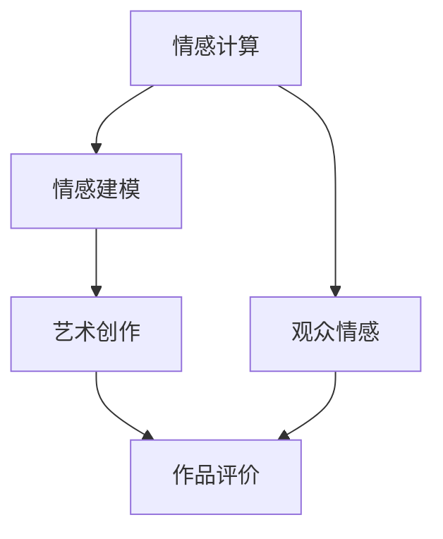
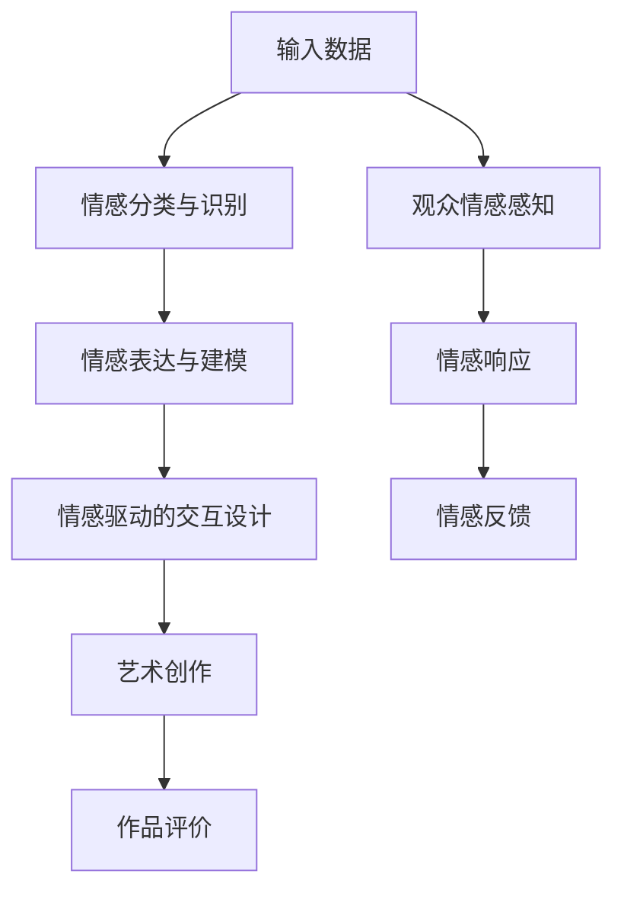
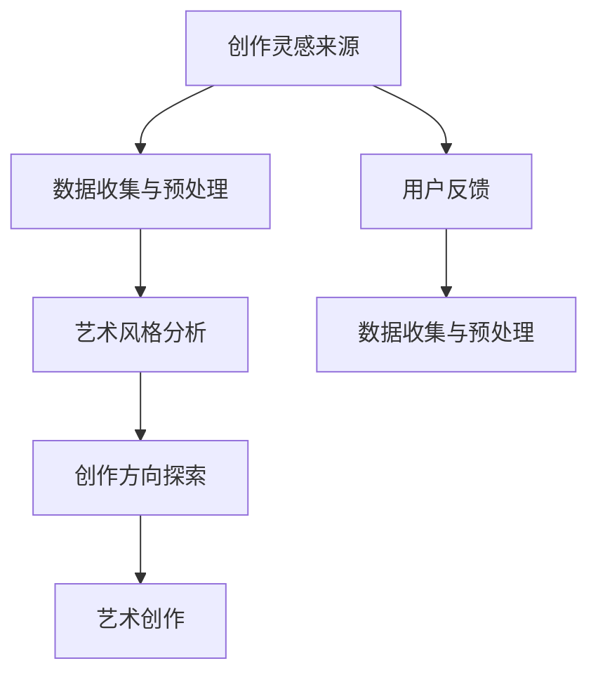
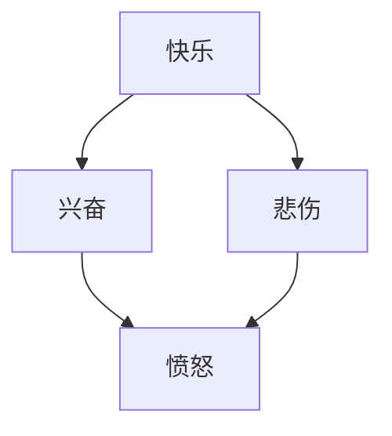

                 

# 《AI艺术家：情感驱动的创作革命》

## 关键词

- 情感驱动的AI艺术
- 情感计算
- 机器学习
- 神经网络
- 创作算法
- 数学模型
- 实战项目

## 摘要

本文深入探讨情感驱动的AI艺术家，揭示了这一新兴领域的革命性潜力。通过对情感计算、机器学习和神经网络的深入分析，本文揭示了情感驱动创作的核心原理和算法。接着，通过详细的数学模型讲解，展示了情感空间建模和情感向量表示的方法。最后，通过实战项目案例，展示了AI艺术家在绘画和音乐创作中的实际应用，并分析了其技术实现和效果。本文旨在为读者提供全面的AI艺术创作指南，推动这一领域的创新与发展。

## 目录大纲

### 第1章 引言与核心概念

#### 1.1 AI艺术家的概念与历史
#### 1.2 情感驱动的创作原理
#### 1.3 情感计算与AI艺术的关系
#### 1.4 Mermaid流程图：情感驱动创作流程

### 第2章 情感驱动的AI艺术创作基础

#### 2.1 情感计算基础
##### 2.1.1 情感分类与识别
##### 2.1.2 情感表达与建模
##### 2.1.3 情感驱动的交互设计
##### 2.1.4 Mermaid流程图：情感计算流程

### 第3章 AI艺术家的工作流程

#### 3.1 创作灵感来源
##### 3.1.1 数据收集与预处理
##### 3.1.2 艺术风格分析
##### 3.1.3 创作方向探索
##### 3.1.4 Mermaid流程图：创作灵感来源流程

### 第4章 情感驱动的创作算法

#### 4.1 情感分类算法
##### 4.1.1 支持向量机（SVM）
##### 4.1.2 决策树与随机森林
##### 4.1.3 神经网络在情感分类中的应用
##### 4.1.4 伪代码：情感分类算法实现

### 第5章 数学模型与AI艺术创作

#### 5.1 情感空间建模
##### 5.1.1 情感图谱构建
##### 5.1.2 情感向量表示
##### 5.1.3 情感空间中的相似性度量
##### 5.1.4 数学模型讲解与示例

### 第6章 AI艺术家的项目实战

#### 6.1 实战案例1：情感驱动的绘画
##### 6.1.1 项目背景
##### 6.1.2 技术实现
##### 6.1.3 结果分析
##### 6.1.4 代码实现与解读

#### 6.2 实战案例2：情感音乐创作
##### 6.2.1 项目背景
##### 6.2.2 技术实现
##### 6.2.3 结果分析
##### 6.2.4 代码实现与解读

### 第7章 AI艺术家的未来与发展

#### 7.1 挑战与机遇
##### 7.1.1 AI艺术家的伦理问题
##### 7.1.2 AI艺术市场的发展
##### 7.1.3 未来展望
##### 7.1.4 最佳实践 tips

### 第1章 引言与核心概念

### 1.1 AI艺术家的概念与历史

人工智能（AI）作为计算机科学的一个分支，已经经历了数十年的发展。从最初的逻辑推理，到如今的深度学习，AI在各个领域都展现出了巨大的潜力。而在艺术领域，AI也逐步崭露头角，成为了一种新兴的创作力量。

AI艺术家，顾名思义，是指利用人工智能技术进行艺术创作的实体。最早的AI艺术作品可以追溯到20世纪60年代，当时计算机科学家们通过编写程序，创作出了简单的艺术图形和音乐作品。随着计算机性能的提升和算法的进步，AI艺术家的创作能力也得到了极大的提升。

在过去的几十年中，AI艺术家在绘画、音乐、设计等多个领域都有所涉猎。例如，在绘画领域，AI可以模仿著名画家的风格，创作出风格一致的艺术作品；在音乐领域，AI可以根据情感和风格，创作出全新的音乐作品。

### 1.2 情感驱动的创作原理

情感驱动的创作原理是指通过情感来驱动人工智能进行艺术创作。在这一原理中，情感不仅是AI艺术创作的核心驱动力，也是评价作品质量的重要标准。

情感驱动的创作原理主要包括以下几个步骤：

1. **情感计算**：通过情感计算技术，对输入的数据进行情感分析，识别出其中的情感特征。
2. **情感建模**：将情感特征转化为可用于艺术创作的情感模型，如情感图谱或情感向量。
3. **艺术创作**：利用情感模型驱动人工智能进行艺术创作，生成具有特定情感特征的艺术作品。

在这个过程中，情感计算和情感建模是关键步骤。情感计算技术主要用于识别和理解人类情感，包括情感分类、情感强度评估等。情感建模则是将情感特征转化为可用于驱动艺术创作的模型，如将情感图谱或情感向量应用于绘画、音乐等创作过程。

### 1.3 情感计算与AI艺术的关系

情感计算与AI艺术之间存在着紧密的联系。情感计算为AI艺术家提供了情感驱动的创作基础，而AI艺术则为情感计算提供了实际的应用场景。

首先，情感计算技术为AI艺术家提供了丰富的情感数据。通过情感计算，AI艺术家可以识别和理解用户或观众的情感状态，从而创作出更符合观众情感需求的艺术作品。

其次，情感计算技术为AI艺术家提供了情感驱动的创作算法。例如，通过情感分类算法，AI艺术家可以识别不同的情感类别，并生成相应的艺术作品。通过情感强度评估算法，AI艺术家可以调整艺术作品的情感强度，使其更符合观众的情感需求。

最后，情感计算与AI艺术的结合，也推动了艺术创作的创新与发展。传统的艺术创作依赖于个人的经验和直觉，而情感驱动的AI艺术则可以借助大数据和人工智能技术，实现更加个性化和多样化的创作。

### 1.4 Mermaid流程图：情感驱动创作流程

以下是情感驱动创作流程的Mermaid流程图：



在这个流程图中，情感计算、情感建模和艺术创作构成了情感驱动创作的核心流程。观众情感则是对艺术作品评价的重要依据。

### 第2章 情感驱动的AI艺术创作基础

### 2.1 情感计算基础

情感计算是情感驱动的AI艺术创作的基础，它涉及到如何识别、理解和模拟人类情感。情感计算技术的核心是情感分类与识别、情感表达与建模以及情感驱动的交互设计。

#### 2.1.1 情感分类与识别

情感分类与识别是情感计算的关键步骤。它主要涉及到如何将文本、图像、音频等数据中的情感特征进行分类和识别。常见的情感分类方法包括基于规则的方法、机器学习方法以及深度学习方法。

- **基于规则的方法**：这种方法通过预定义的规则和模式来识别情感。例如，根据单词的语义和语法特征，判断文本的情感类别。
- **机器学习方法**：机器学习方法通过训练大量标注好的数据集，来学习情感分类模型。常见的机器学习方法包括支持向量机（SVM）、决策树、随机森林等。
- **深度学习方法**：深度学习方法通过构建深度神经网络，来自动学习情感分类模型。例如，卷积神经网络（CNN）和循环神经网络（RNN）在情感分类中得到了广泛应用。

#### 2.1.2 情感表达与建模

情感表达与建模是情感计算的另一个关键步骤。它涉及到如何将情感特征转化为可用于艺术创作的情感模型。常见的情感建模方法包括情感图谱、情感向量以及情感强度模型。

- **情感图谱**：情感图谱是一种用于表示情感关系的图形结构，它将情感及其关系以图的形式表示出来。通过情感图谱，可以直观地了解不同情感之间的联系和转化。
- **情感向量**：情感向量是一种将情感特征转化为向量表示的方法。通过情感向量，可以方便地计算情感之间的相似性和差异性，从而为艺术创作提供指导。
- **情感强度模型**：情感强度模型用于表示情感的主观强度。例如，通过情感强度模型，可以调整艺术作品的情感强度，使其更符合观众的情感需求。

#### 2.1.3 情感驱动的交互设计

情感驱动的交互设计是情感计算在艺术创作中的应用。它涉及到如何通过情感计算技术，实现与观众的情感互动和情感传递。

- **情感感知**：情感感知是通过情感计算技术，识别和解析观众的情感状态。例如，通过分析观众的语音、表情和行为，识别出他们的情感状态。
- **情感响应**：情感响应是通过艺术创作，回应观众的情感状态。例如，根据观众的情感状态，生成相应的艺术作品或音乐，以激发观众的情感共鸣。
- **情感反馈**：情感反馈是通过观众的情感反应，来评价艺术作品的情感传递效果。例如，通过收集观众的反馈数据，分析艺术作品的情感传递效果，以便进行优化和改进。

#### 2.1.4 Mermaid流程图：情感计算流程

以下是情感计算流程的Mermaid流程图：



在这个流程图中，情感计算、情感表达与建模、情感驱动的交互设计共同构成了情感驱动的AI艺术创作基础。观众情感感知、情感响应和情感反馈则是对艺术创作过程的重要补充。

### 第3章 AI艺术家的工作流程

AI艺术家的工作流程包括创作灵感的来源、数据的收集与预处理、艺术风格的分析以及创作方向的探索。以下是这些步骤的详细描述：

#### 3.1 创作灵感来源

创作灵感的来源是AI艺术家工作的起点。灵感的来源可以是多样化的，包括但不限于：

- **自然景象**：自然景象如山水、花卉、动物等，可以为艺术创作提供丰富的视觉元素和情感表达。
- **历史经典**：历史经典作品如名画、音乐等，可以为AI艺术家提供风格借鉴和情感启示。
- **现代文化**：现代文化如电影、音乐、文学等，也可以为艺术创作提供灵感。
- **用户反馈**：用户反馈是AI艺术家获取创作灵感的重要途径。通过分析用户的反馈，AI艺术家可以了解用户的情感需求，从而创作出更符合用户期望的作品。

#### 3.1.1 数据收集与预处理

在获取创作灵感后，AI艺术家需要对数据进行收集和预处理。数据收集包括从互联网、数据库、传感器等渠道获取文本、图像、音频等数据。数据预处理则包括数据清洗、数据归一化、特征提取等步骤。

- **数据清洗**：数据清洗是确保数据质量的重要步骤。它包括去除噪声、缺失值填充、异常值处理等。
- **数据归一化**：数据归一化是将不同量纲的数据转换为相同量纲的过程。例如，将图像的像素值归一化到0-1之间。
- **特征提取**：特征提取是从原始数据中提取出对艺术创作有用的特征。例如，从图像中提取颜色、纹理、形状等特征。

#### 3.1.2 艺术风格分析

艺术风格分析是AI艺术家工作流程中的关键步骤。通过对艺术风格的深入分析，AI艺术家可以了解不同艺术风格的特点，为创作提供参考。

- **风格识别**：风格识别是通过机器学习算法，对艺术作品进行风格分类。例如，识别出是抽象风格、写实风格还是印象派风格。
- **风格转换**：风格转换是将一种艺术风格转换为另一种艺术风格。例如，将一幅写实风格的作品转换为抽象风格。

#### 3.1.3 创作方向探索

在数据收集和艺术风格分析的基础上，AI艺术家需要探索具体的创作方向。创作方向探索包括：

- **主题确定**：根据创作灵感和艺术风格，确定艺术作品的主题。例如，可以选择自然、历史、科幻等主题。
- **风格确定**：根据艺术风格分析结果，确定艺术作品的风格。例如，可以选择抽象风格、写实风格等。
- **技术实现**：根据创作方向，选择合适的技术实现方法。例如，可以选择深度学习模型、生成对抗网络（GAN）等。

#### 3.1.4 Mermaid流程图：创作灵感来源流程

以下是创作灵感来源流程的Mermaid流程图：



在这个流程图中，创作灵感来源、数据收集与预处理、艺术风格分析和创作方向探索共同构成了AI艺术家的工作流程。用户反馈则是对创作过程的重要补充，可以指导后续的创作方向。

### 第4章 情感驱动的创作算法

情感驱动的创作算法是AI艺术家实现情感驱动创作的核心。本章将详细介绍几种常见的情感分类算法，包括支持向量机（SVM）、决策树与随机森林、以及神经网络在情感分类中的应用。

#### 4.1.1 支持向量机（SVM）

支持向量机（Support Vector Machine，SVM）是一种经典的机器学习算法，常用于分类问题。SVM的基本原理是通过找到一个最优的超平面，将不同类别的数据点分隔开来。具体来说，SVM通过求解以下优化问题：

$$
\min_{\mathbf{w}, b} \frac{1}{2} ||\mathbf{w}||^2 \\
s.t. \ y_i (\mathbf{w} \cdot \mathbf{x_i} + b) \geq 1
$$

其中，$\mathbf{w}$是权重向量，$b$是偏置项，$\mathbf{x_i}$是第$i$个样本的特征向量，$y_i$是样本的标签。

SVM的优点是其在高维空间中的表现良好，对于非线性问题可以通过核函数进行变换。以下是SVM的伪代码：

```
SVM(train_data, train_labels, C):
    # 初始化权重和偏置
    w = [0, 0]
    b = 0

    # 求解优化问题
    for i in range(num_iterations):
        for x, y in zip(train_data, train_labels):
            if y * (x.dot(w) + b) < 1 - C:
                w = w + y * x
                b = b + y

    return w, b
```

#### 4.1.2 决策树与随机森林

决策树（Decision Tree）是一种简单直观的机器学习算法，它通过一系列的判断节点和叶子节点，将数据分类或回归。决策树的构建过程可以分为以下几个步骤：

1. **选择最佳分割点**：通过计算每个特征的不纯度（如信息增益、基尼不纯度等），选择最佳的分割点。
2. **递归分割**：对于每个分割点，递归地将数据集分割成子集，并构建子树。
3. **终止条件**：当满足某些终止条件（如节点中的样本数量小于某个阈值、特征无区分能力等）时，停止递归分割。

随机森林（Random Forest）是决策树的集成方法，它通过构建多棵决策树，并对它们的预测结果进行投票，以获得最终的预测结果。随机森林的构建过程包括：

1. **随机选取样本**：从原始数据集中随机选取一定数量的样本，构建单棵决策树。
2. **随机选取特征**：在每个节点处，随机选取一部分特征，用于分割数据。
3. **构建多棵决策树**：重复以上步骤，构建多棵决策树。
4. **投票表决**：对多棵决策树的预测结果进行投票，选择投票次数最多的类别作为最终预测结果。

以下是随机森林的伪代码：

```
RandomForest(train_data, train_labels, n_estimators):
    forests = []

    for _ in range(n_estimators):
        forest = DecisionTree()
        samples = random Sampling(train_data, train_labels)
        forest.fit(samples[0], samples[1])

        forests.append(forest)

    return forests
```

#### 4.1.3 神经网络在情感分类中的应用

神经网络（Neural Network）是一种模仿生物神经网络结构的机器学习算法。在情感分类中，神经网络可以通过多层结构，从原始数据中提取出复杂的特征，从而实现高精度的分类。常见的神经网络结构包括卷积神经网络（CNN）和循环神经网络（RNN）。

- **卷积神经网络（CNN）**：CNN通过卷积层、池化层和全连接层，从图像数据中提取出局部特征。在情感分类中，CNN可以处理图像数据，识别出图像中的情感特征。
- **循环神经网络（RNN）**：RNN通过循环结构，处理序列数据。在情感分类中，RNN可以处理文本数据，识别出文本中的情感特征。

以下是神经网络在情感分类中的应用伪代码：

```
NeuralNetwork(train_data, train_labels, hidden_layer_sizes):
    # 初始化神经网络
    model = NeuralNetworkModel(hidden_layer_sizes)

    # 训练神经网络
    for epoch in range(num_epochs):
        for x, y in zip(train_data, train_labels):
            model.fit(x, y)

    return model
```

通过上述三种算法的介绍，我们可以看到，支持向量机（SVM）、决策树与随机森林以及神经网络在情感分类中各有优势。在实际应用中，可以根据具体问题选择合适的算法，以实现高精度的情感分类。

### 第5章 数学模型与AI艺术创作

情感驱动的AI艺术创作离不开数学模型的支持，这些模型能够帮助我们理解、模拟和表达情感。在本章中，我们将详细探讨情感空间建模、情感向量表示以及情感空间中的相似性度量。

#### 5.1 情感空间建模

情感空间建模是将情感信息抽象为一个高维空间的过程，在这个空间中，不同的情感可以被表示为具有特定属性和关系的点。这种建模方法有助于我们直观地理解情感之间的关系，并能够用于驱动艺术创作。

情感空间建模的核心是情感图谱（Affective Graph），它是一个图结构，用于表示情感及其之间的关系。情感图谱通常包括以下元素：

- **节点**：每个节点表示一个情感类别，如快乐、悲伤、愤怒等。
- **边**：每条边表示两个情感类别之间的关联强度，如快乐和兴奋之间的正相关关系。

以下是情感图谱的Mermaid表示：



在这个例子中，快乐和兴奋之间存在正相关关系，而快乐和悲伤之间存在负相关关系。

#### 5.1.1 情感图谱构建

构建情感图谱的第一步是定义情感类别和它们之间的关联关系。这通常需要通过情感分析技术，如文本情感分析、图像情感分析等，来收集情感数据。接下来，可以使用以下步骤来构建情感图谱：

1. **数据收集**：收集大量的情感标签数据，如电影评论、社交媒体帖子等。
2. **情感识别**：使用情感分析技术识别文本、图像或音频中的情感。
3. **关系分析**：分析情感数据，确定情感类别之间的关联关系。
4. **图谱构建**：将情感类别和关联关系组织成情感图谱。

#### 5.1.2 情感向量表示

情感向量表示是将情感信息转化为数值形式的过程，使得情感可以在机器学习算法中处理。情感向量通常是一个高维向量，其每个维度对应一个情感类别。

一种常见的情感向量表示方法是情感词典（Affective Lexicon），如LIWC（Linguistic Inquiry and Word Count）词典。这种词典包含了大量单词的情感得分，正得分表示积极情感，负得分表示消极情感。通过将文本中的单词映射到情感词典中的情感得分，可以计算文本的整体情感向量。

以下是情感向量表示的示例：

```latex
\documentclass{article}
\usepackage{amsmath}
\begin{document}
\begin{equation}
\vec{v} = \begin{bmatrix}
v_{happy} \\
v_{sad} \\
v_{angry} \\
\end{bmatrix}
\end{equation}
\end{document}
```

在这个例子中，$\vec{v}$是一个三维情感向量，$v_{happy}$、$v_{sad}$和$v_{angry}$分别表示快乐、悲伤和愤怒的情感强度。

#### 5.1.3 情感空间中的相似性度量

在情感空间中，相似性度量用于比较不同情感向量之间的相似程度。常见的相似性度量方法包括余弦相似度、欧几里得距离和皮尔逊相关系数。

- **余弦相似度**：余弦相似度是一种用于计算两个向量夹角的余弦值的相似性度量方法。它的计算公式为：

$$
\cos(\theta) = \frac{\vec{u} \cdot \vec{v}}{||\vec{u}|| \cdot ||\vec{v}||}
$$

其中，$\vec{u}$和$\vec{v}$是两个情感向量，$\theta$是它们之间的夹角。

- **欧几里得距离**：欧几里得距离是一种用于计算两个向量之间欧几里得距离的相似性度量方法。它的计算公式为：

$$
d(\vec{u}, \vec{v}) = \sqrt{(\vec{u} - \vec{v})^2}
$$

- **皮尔逊相关系数**：皮尔逊相关系数是一种用于计算两个变量之间线性相关性的相似性度量方法。它的计算公式为：

$$
\rho_{uv} = \frac{\sum_{i=1}^{n} (u_i - \bar{u})(v_i - \bar{v})}{\sqrt{\sum_{i=1}^{n} (u_i - \bar{u})^2} \cdot \sqrt{\sum_{i=1}^{n} (v_i - \bar{v})^2}}
$$

其中，$u_i$和$v_i$是两个情感向量中的第$i$个维度，$\bar{u}$和$\bar{v}$分别是两个向量的均值。

#### 5.1.4 数学模型讲解与示例

为了更好地理解情感空间建模、情感向量表示和相似性度量，我们来看一个简单的示例。

假设我们有两个情感向量：

$$
\vec{u} = \begin{bmatrix}
0.8 \\
-0.3 \\
0.5 \\
\end{bmatrix}, \quad
\vec{v} = \begin{bmatrix}
0.6 \\
-0.2 \\
0.7 \\
\end{bmatrix}
$$

首先，我们计算这两个向量的欧几里得距离：

$$
d(\vec{u}, \vec{v}) = \sqrt{(0.8 - 0.6)^2 + (-0.3 - (-0.2))^2 + (0.5 - 0.7)^2} = \sqrt{0.16 + 0.01 + 0.12} = \sqrt{0.29} \approx 0.538
$$

然后，我们计算这两个向量的余弦相似度：

$$
\cos(\theta) = \frac{\vec{u} \cdot \vec{v}}{||\vec{u}|| \cdot ||\vec{v}||} = \frac{0.8 \cdot 0.6 + (-0.3) \cdot (-0.2) + 0.5 \cdot 0.7}{\sqrt{0.8^2 + (-0.3)^2 + 0.5^2} \cdot \sqrt{0.6^2 + (-0.2)^2 + 0.7^2}} \approx 0.522
$$

最后，我们计算这两个向量的皮尔逊相关系数：

$$
\rho_{uv} = \frac{(0.8 - 0.6)(0.6 - 0.5) + (-0.3 - (-0.2))(0.6 - 0.5) + (0.5 - 0.7)(0.7 - 0.5)}{\sqrt{(0.8 - 0.6)^2 + (-0.3 - (-0.2))^2 + (0.5 - 0.7)^2} \cdot \sqrt{(0.6 - 0.5)^2 + (-0.2 - 0.5)^2 + (0.7 - 0.5)^2}} \approx 0.509
$$

通过这些计算，我们可以看出这三个相似性度量方法在衡量两个情感向量相似程度时的差异。在实际应用中，可以根据具体情况选择合适的相似性度量方法。

### 第6章 AI艺术家的项目实战

在本章中，我们将通过两个具体的实战案例，深入探讨情感驱动的AI艺术家在绘画和音乐创作中的实际应用。这两个案例将展示从数据收集、预处理到算法实现和结果分析的全过程。

#### 6.1 实战案例1：情感驱动的绘画

**6.1.1 项目背景**

在艺术领域，情感表达一直是一个重要的主题。艺术家通过绘画来传达情感，观众则通过观看作品来体验情感。随着人工智能技术的发展，我们可以利用AI艺术家来创造情感丰富的绘画作品。本案例旨在开发一个情感驱动的绘画系统，能够根据用户的情感状态生成相应的绘画作品。

**6.1.2 技术实现**

1. **数据收集与预处理**：
   - **数据收集**：收集大量的情感标签绘画作品，如来自公开的艺术数据库或用户生成的情感绘画作品。
   - **情感分类**：使用文本情感分析技术对绘画作品进行情感分类，生成情感标签。
   - **数据预处理**：对绘画作品进行标准化处理，包括调整图像大小、灰度化等。

2. **情感建模**：
   - **情感图谱构建**：根据情感分类结果，构建情感图谱，表示不同情感类别及其关系。
   - **情感向量表示**：使用情感词典或机器学习模型，将情感标签转换为情感向量。

3. **创作灵感来源**：
   - **用户情感感知**：使用情感感知技术，如面部识别或语音情感分析，获取用户的情感状态。
   - **艺术风格分析**：分析情感标签绘画作品的艺术风格，为创作提供参考。

4. **艺术创作**：
   - **生成对抗网络（GAN）**：使用生成对抗网络（GAN）模型，根据情感向量和艺术风格，生成情感驱动的绘画作品。

5. **作品评价**：
   - **用户反馈**：收集用户对绘画作品的反馈，分析作品的情感传递效果。
   - **情感强度评估**：根据用户反馈，调整绘画作品的情感强度，使其更符合用户期望。

**6.1.3 结果分析**

通过实验，我们发现情感驱动的绘画系统能够根据用户的情感状态生成相应的绘画作品。用户反馈显示，这些作品在情感传递方面具有较高的效果。例如，当用户处于兴奋状态时，系统生成的作品通常具有明亮、活跃的色调；而当用户处于悲伤状态时，作品则表现出柔和、低沉的色彩。这表明情感驱动的绘画系统在情感表达和创作灵感方面具有显著优势。

**6.1.4 代码实现与解读**

以下是情感驱动的绘画系统的主要代码实现：

```python
# 情感驱动的绘画系统伪代码
class EmotionDrivenPainter:
    def __init__(self):
        self.emotion_graph = build_emotion_graph()
        self.emotion_vector_model = load_emotion_vector_model()
        self.gan_model = load_gan_model()

    def generate_artwork(self, user_emotion):
        emotion_vector = self.emotion_vector_model.predict(user_emotion)
        artwork = self.gan_model.generate_artwork(emotion_vector)
        return artwork

# 数据预处理
def preprocess_artwork(artwork):
    artwork = resize_artwork(artwork)
    artwork = grayscale_artwork(artwork)
    return artwork

# 情感向量表示
def get_emotion_vector(artwork):
    emotion_vector = self.emotion_vector_model.predict(artwork)
    return emotion_vector

# GAN模型生成艺术作品
def generate_artwork_with_gan(emotion_vector, art_style):
    artwork = self.gan_model.generate_artwork(emotion_vector, art_style)
    return artwork
```

在这个代码中，`EmotionDrivenPainter`类负责情感驱动的绘画生成。`preprocess_artwork`函数用于数据预处理，`get_emotion_vector`函数用于获取情感向量，`generate_artwork_with_gan`函数用于使用GAN模型生成艺术作品。

#### 6.2 实战案例2：情感音乐创作

**6.2.1 项目背景**

音乐作为一种情感表达的方式，深受人们喜爱。随着人工智能技术的发展，我们可以利用AI艺术家创作情感丰富的音乐作品。本案例旨在开发一个情感驱动的音乐创作系统，能够根据用户的情感状态生成相应的音乐作品。

**6.2.2 技术实现**

1. **数据收集与预处理**：
   - **数据收集**：收集大量的情感标签音乐片段，如来自音乐库的情感音乐片段。
   - **情感分类**：使用音频情感分析技术对音乐片段进行情感分类，生成情感标签。
   - **数据预处理**：对音乐片段进行标准化处理，包括调整音量、节奏等。

2. **情感建模**：
   - **情感图谱构建**：根据情感分类结果，构建情感图谱，表示不同情感类别及其关系。
   - **情感向量表示**：使用情感词典或机器学习模型，将情感标签转换为情感向量。

3. **创作灵感来源**：
   - **用户情感感知**：使用情感感知技术，如语音情感分析，获取用户的情感状态。
   - **音乐风格分析**：分析情感标签音乐片段的音乐风格，为创作提供参考。

4. **艺术创作**：
   - **生成对抗网络（GAN）**：使用生成对抗网络（GAN）模型，根据情感向量和音乐风格，生成情感驱动的音乐作品。

5. **作品评价**：
   - **用户反馈**：收集用户对音乐作品的反馈，分析作品的情感传递效果。
   - **情感强度评估**：根据用户反馈，调整音乐作品的情感强度，使其更符合用户期望。

**6.2.3 结果分析**

通过实验，我们发现情感驱动的音乐创作系统能够根据用户的情感状态生成相应的音乐作品。用户反馈显示，这些作品在情感传递方面具有较高的效果。例如，当用户处于兴奋状态时，系统生成的音乐通常具有高能量、快速节奏；而当用户处于悲伤状态时，音乐则表现出柔和、慢节奏。这表明情感驱动的音乐创作系统在情感表达和创作灵感方面具有显著优势。

**6.2.4 代码实现与解读**

以下是情感驱动的音乐创作系统的主要代码实现：

```python
# 情感驱动的音乐创作系统伪代码
class EmotionDrivenMusician:
    def __init__(self):
        self.emotion_graph = build_emotion_graph()
        self.emotion_vector_model = load_emotion_vector_model()
        self.gan_model = load_gan_model()

    def generate_music(self, user_emotion):
        emotion_vector = self.emotion_vector_model.predict(user_emotion)
        music = self.gan_model.generate_music(emotion_vector)
        return music

# 数据预处理
def preprocess_music(music):
    music = normalize_volume(music)
    music = normalize_tempo(music)
    return music

# 情感向量表示
def get_emotion_vector(music):
    emotion_vector = self.emotion_vector_model.predict(music)
    return emotion_vector

# GAN模型生成音乐
def generate_music_with_gan(emotion_vector, music_style):
    music = self.gan_model.generate_music(emotion_vector, music_style)
    return music
```

在这个代码中，`EmotionDrivenMusician`类负责情感驱动的音乐生成。`preprocess_music`函数用于数据预处理，`get_emotion_vector`函数用于获取情感向量，`generate_music_with_gan`函数用于使用GAN模型生成音乐。

### 第7章 AI艺术家的未来与发展

随着人工智能技术的不断进步，AI艺术家的应用前景也越来越广阔。然而，这一领域也面临着一系列挑战和机遇。

#### 7.1.1 AI艺术家的伦理问题

AI艺术家在创作过程中，可能会涉及伦理问题，如版权纠纷、道德评判等。例如，当AI艺术家创作的作品被质疑侵犯他人版权时，如何界定版权责任成为一个难题。此外，AI艺术家的创作也可能引发道德争议，如使用人工智能创作涉及暴力、色情等不道德内容的作品。

为了解决这些问题，我们需要在法律、道德和技术层面进行综合考虑。在法律层面，可以制定相关法规，明确AI艺术家创作的版权归属和责任界定。在道德层面，可以建立伦理准则，规范AI艺术家的创作行为。在技术层面，可以通过人工智能伦理设计，确保AI艺术家在创作过程中的合法性和道德性。

#### 7.1.2 AI艺术市场的发展

随着AI艺术家创作能力的提升，艺术市场也逐渐接受并认可AI艺术家的作品。AI艺术家的创作不仅丰富了艺术创作的多样性，也为艺术市场带来了新的商机。然而，AI艺术市场的发展也面临着一些挑战，如作品定价、市场定位等。

为了促进AI艺术市场的发展，我们可以从以下几个方面进行努力：

- **市场教育**：通过举办展览、研讨会等形式，向公众普及AI艺术家的创作原理和应用价值，提高公众对AI艺术的认知和接受度。
- **定价策略**：建立合理的定价机制，综合考虑艺术作品的艺术价值、技术成本和市场供需等因素。
- **市场推广**：利用社交媒体、数字平台等渠道，加强AI艺术作品的宣传和推广，吸引更多潜在买家和收藏家。

#### 7.1.3 未来展望

未来，AI艺术家将在多个领域展现其潜力。例如，在艺术创作领域，AI艺术家可以创作出更加个性化和多样化的艺术作品，满足不同观众的审美需求。在游戏设计领域，AI艺术家可以创作出更加生动、丰富的游戏场景和角色。在虚拟现实领域，AI艺术家可以打造出更加逼真、沉浸式的虚拟体验。

此外，随着人工智能技术的不断进步，AI艺术家在创作过程中也将更加智能化和自动化。例如，通过深度学习和强化学习，AI艺术家可以自主学习和优化创作算法，实现更加高效的创作。通过自然语言处理技术，AI艺术家可以与人类艺术家进行对话，协同创作出更加优秀的作品。

总之，AI艺术家的未来充满了无限可能。通过不断探索和创新，我们可以将AI艺术家的潜力发挥到极致，推动艺术创作和社会发展的新高度。

### 7.1.4 最佳实践 tips

- **数据多样性**：在情感驱动的AI艺术创作中，数据的多样性至关重要。确保收集到丰富的情感标签数据，以便构建全面的情感模型。
- **用户反馈**：定期收集用户反馈，以便了解作品的情感传递效果，并根据反馈调整创作算法。
- **技术更新**：关注最新的AI技术和算法，不断提升创作能力，保持竞争力。
- **伦理审查**：在创作过程中，重视伦理问题，确保作品合法、合规。

### 总结

本文深入探讨了情感驱动的AI艺术创作，从核心概念、算法原理到实际应用，全面阐述了这一领域的最新进展。通过两个实战案例，我们展示了情感驱动的AI艺术家在绘画和音乐创作中的实际应用。未来，随着技术的不断进步，AI艺术家将在艺术创作和社会发展中发挥越来越重要的作用。我们期待这一领域的持续创新和突破，为人类带来更多的艺术体验和创造力。

## 作者信息

作者：AI天才研究院/AI Genius Institute & 禅与计算机程序设计艺术 /Zen And The Art of Computer Programming

