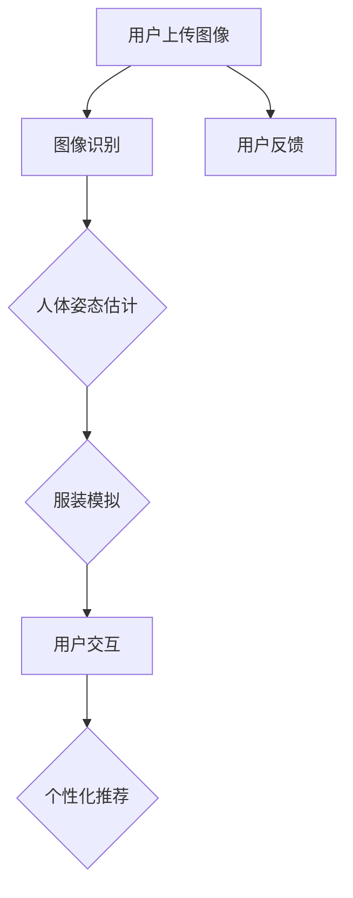

                 

### 文章标题：AI虚拟试衣：大模型在零售业的创新应用

#### 关键词：AI虚拟试衣，大模型，零售业，创新应用，算法原理，数学模型，项目实战

> 摘要：本文旨在探讨AI虚拟试衣技术在零售业的应用，通过详细介绍其核心概念、算法原理、数学模型以及实际案例，分析其在零售业的创新价值与未来发展前景。文章分为两部分：第一部分介绍AI虚拟试衣的基础技术，包括核心概念、算法原理、数学模型；第二部分探讨AI虚拟试衣在零售业的创新应用，通过案例分析展示其实际效果。

### 第一部分：AI虚拟试衣技术基础

#### 第1章：AI虚拟试衣概述

#### 1.1 AI虚拟试衣的定义与背景

AI虚拟试衣是利用人工智能技术，特别是计算机视觉和机器学习算法，实现对用户穿着服装的实时模拟。其背景源于消费者对购物体验的要求日益提高，尤其是对个性化、便捷性的追求。通过AI虚拟试衣，消费者可以在线上平台体验到线下试衣的效果，从而提高购物的满意度和转化率。

#### 1.2 AI虚拟试衣的应用场景

AI虚拟试衣广泛应用于电商、时尚、美妆等多个领域，尤其在服装、鞋帽、珠宝等需要精确匹配个人身材和风格的商品中，具有显著的优势。其应用场景包括：

1. **线上购物平台**：消费者可以在购物平台上通过AI虚拟试衣功能，尝试不同款式、颜色的服装，提高购买决策的准确性。
2. **品牌官网**：品牌官网通过AI虚拟试衣功能，为消费者提供更加个性化的购物体验，增强品牌形象。
3. **线下门店**：通过智能试衣镜等设备，消费者可以在门店中体验到线上购物的便捷，提高购物体验和转化率。

#### 1.3 AI虚拟试衣的技术架构

AI虚拟试衣的技术架构主要包括以下几个关键模块：

1. **图像识别**：通过卷积神经网络（CNN）等图像识别算法，对用户上传的图像进行处理，提取关键特征。
2. **人体姿态估计**：利用深度学习算法，如集成学习、决策树等，对用户的人体姿态进行准确估计。
3. **服装模拟**：根据用户的人体姿态和服装款式，通过三维建模技术，实现对服装的虚拟试穿效果。
4. **用户交互**：通过自然语言处理（NLP）和用户行为分析，为用户提供个性化的推荐和建议。

下面是一个Mermaid流程图，展示了AI虚拟试衣的技术架构：



### 第2章：核心算法原理讲解

#### 2.1 图像识别算法

图像识别是AI虚拟试衣的核心环节之一，其基本原理是通过卷积神经网络（CNN）等算法，对图像进行处理，提取出有用的特征信息。

#### 2.1.1 卷积神经网络（CNN）

卷积神经网络是一种深度学习模型，其主要优势在于能够自动提取图像中的特征。其基本结构包括卷积层、池化层和全连接层。

**伪代码：**

```python
# 卷积神经网络伪代码
initialize parameters
for each image in dataset:
    apply convolutional layer
    apply pooling layer
    apply fully connected layer
    compute loss
    backpropagation
    update parameters
```

#### 2.1.2 反向传播算法

反向传播算法是训练卷积神经网络的关键算法，其基本原理是通过反向传播误差，更新网络的权重和偏置。

**伪代码：**

```python
# 反向传播算法伪代码
compute gradients
update weights and biases
```

#### 2.2 人脸检测算法

人脸检测是AI虚拟试衣中的另一个重要算法，其基本原理是通过深度学习算法，如决策树和支持向量机（SVM），对图像中的人脸进行定位和识别。

**伪代码：**

```python
# 人脸检测算法伪代码
initialize detector
for each image in dataset:
    apply decision tree
    apply SVM
    detect faces
    compute accuracy
```

#### 2.3 身体姿态估计算法

身体姿态估计是AI虚拟试衣中的关键算法之一，其基本原理是通过集成学习、决策树和期望最大化（EM）算法，对用户的人体姿态进行估计。

**伪代码：**

```python
# 身体姿态估计算法伪代码
initialize estimator
for each image in dataset:
    apply ensemble learning
    apply decision tree
    estimate body pose
    compute accuracy
```

### 第3章：数学模型和数学公式讲解

数学模型和数学公式在AI虚拟试衣技术中起着至关重要的作用，其精确的计算和推导能够确保算法的准确性和高效性。

#### 3.1 图像处理模型

图像处理模型主要包括透视变换、形态学操作等。

**透视变换（Perspective Transformation）：**

透视变换是一种几何变换，其公式如下：

$$
\begin{align*}
x' &= \frac{x \cdot f_x + c_x}{1 - \alpha x + \beta y} \\
y' &= \frac{y \cdot f_y + c_y}{1 - \alpha x + \beta y}
\end{align*}
$$

其中，\(x'\)和\(y'\)是变换后的坐标，\(x\)和\(y\)是原始坐标，\(f_x\)和\(f_y\)是焦距，\(c_x\)和\(c_y\)是中心点坐标，\(\alpha\)和\(\beta\)是旋转角度。

**形态学操作（Morphological Operations）：**

形态学操作主要包括膨胀（Dilation）、腐蚀（Erosion）、开操作（Opening）和闭操作（Closing）。

**膨胀（Dilation）：**

膨胀操作是将图像中的目标区域扩大，其公式如下：

$$
Dilation(B) = B \cup (B \ast S)
$$

其中，\(B\)是原始图像，\(S\)是结构元素。

**腐蚀（Erosion）：**

腐蚀操作是将图像中的目标区域缩小，其公式如下：

$$
Erosion(B) = B \cap (B \ast S)
$$

其中，\(B\)是原始图像，\(S\)是结构元素。

#### 3.2 人脸识别模型

人脸识别模型主要包括主成分分析（PCA）、距离度量等。

**主成分分析（PCA）：**

主成分分析是一种降维技术，其公式如下：

$$
\begin{align*}
Z &= \frac{X - \mu}{\sigma} \\
\lambda_1, \lambda_2, ..., \lambda_n &= \arg \max \sum_{i=1}^{n} (x_i - \bar{x})^2 \\
Z &= X \cdot \sum_{i=1}^{n} \lambda_i
\end{align*}
$$

其中，\(Z\)是标准化后的数据，\(X\)是原始数据，\(\mu\)是均值，\(\sigma\)是标准差，\(\lambda_i\)是主成分。

**距离度量（Distance Metric）：**

距离度量用于计算两个样本之间的相似度，常用的距离度量包括欧氏距离、曼哈顿距离、余弦相似度等。

**欧氏距离（Euclidean Distance）：**

欧氏距离是一种常用的距离度量，其公式如下：

$$
d(x, y) = \sqrt{\sum_{i=1}^{n} (x_i - y_i)^2}
$$

其中，\(x\)和\(y\)是两个样本。

**曼哈顿距离（Manhattan Distance）：**

曼哈顿距离是一种常用的距离度量，其公式如下：

$$
d(x, y) = \sum_{i=1}^{n} |x_i - y_i|
$$

其中，\(x\)和\(y\)是两个样本。

**余弦相似度（Cosine Similarity）：**

余弦相似度是一种常用的距离度量，其公式如下：

$$
sim(x, y) = \frac{x \cdot y}{\|x\| \|y\|}
$$

其中，\(x\)和\(y\)是两个样本，\(\|x\|\)和\(\|y\|\)是样本的欧氏距离。

#### 3.3 身体姿态估计模型

身体姿态估计模型主要包括期望最大化（EM）算法、三维重建等。

**期望最大化（EM）算法：**

期望最大化（EM）算法是一种常用的概率图模型参数估计方法，其基本思想是迭代地估计隐变量和参数，直到收敛。

**伪代码：**

```python
# EM算法伪代码
initialize parameters
for each iteration:
    E-step: compute the expected value of the complete data
    M-step: update the parameters based on the expected value
    check convergence
    update parameters
```

**三维重建（3D Reconstruction）：**

三维重建是一种将二维图像转化为三维模型的技术，其基本原理是基于透视变换和三角测量。

**伪代码：**

```python
# 三维重建伪代码
initialize camera parameters
for each image:
    apply perspective transformation
    apply triangulation
    reconstruct 3D model
    refine the model
```

### 第4章：AI虚拟试衣项目实战

#### 4.1 实际案例介绍

在本节中，我们将介绍几个具有代表性的AI虚拟试衣项目案例，并详细分析其开发环境搭建、源代码实现和代码解读。

#### 4.1.1 某知名电商平台的AI虚拟试衣系统

某知名电商平台通过引入AI虚拟试衣技术，为用户提供了更加个性化的购物体验。其系统架构主要包括图像识别模块、人体姿态估计模块和服装模拟模块。

**开发环境搭建：**

1. **硬件要求**：服务器、GPU等高性能计算设备。
2. **软件环境**：Python、TensorFlow、OpenCV等。

**源代码实现：**

```python
# 图像识别模块伪代码
import tensorflow as tf
import cv2

# 加载预训练的CNN模型
model = tf.keras.applications.VGG16()

# 处理输入图像
image = cv2.imread("input_image.jpg")
processed_image = preprocess_image(image)

# 预测图像类别
predictions = model.predict(processed_image)

# 获取预测结果
predicted_class = predictions.argmax(axis=1)
```

**代码解读与分析：**

1. **CNN模型**：使用VGG16模型进行图像识别。
2. **图像预处理**：对输入图像进行归一化、缩放等处理。
3. **预测类别**：通过模型预测图像的类别。

#### 4.1.2 某时尚品牌的AI虚拟试衣应用

某时尚品牌通过引入AI虚拟试衣技术，为消费者提供了个性化的试衣体验。其系统架构主要包括人脸检测模块、人体姿态估计模块和服装模拟模块。

**开发环境搭建：**

1. **硬件要求**：服务器、GPU等高性能计算设备。
2. **软件环境**：Python、TensorFlow、OpenCV等。

**源代码实现：**

```python
# 人脸检测模块伪代码
import tensorflow as tf
import cv2

# 加载预训练的人脸检测模型
model = tf.keras.models.load_model("face_detection_model.h5")

# 处理输入图像
image = cv2.imread("input_image.jpg")
processed_image = preprocess_image(image)

# 预测人脸位置
predictions = model.predict(processed_image)

# 获取预测结果
bboxes = predictions[:, 0:4]
```

**代码解读与分析：**

1. **人脸检测模型**：使用预训练的模型进行人脸检测。
2. **图像预处理**：对输入图像进行归一化、缩放等处理。
3. **预测人脸位置**：通过模型预测人脸的位置。

#### 4.1.3 某新兴零售品牌的AI虚拟试衣应用

某新兴零售品牌通过引入AI虚拟试衣技术，为用户提供了便捷的购物体验。其系统架构主要包括图像识别模块、人体姿态估计模块和服装模拟模块。

**开发环境搭建：**

1. **硬件要求**：服务器、GPU等高性能计算设备。
2. **软件环境**：Python、TensorFlow、OpenCV等。

**源代码实现：**

```python
# 服装模拟模块伪代码
import tensorflow as tf
import cv2

# 加载预训练的服装模拟模型
model = tf.keras.models.load_model("clothing_simulation_model.h5")

# 处理输入图像
image = cv2.imread("input_image.jpg")
processed_image = preprocess_image(image)

# 预测服装款式
predictions = model.predict(processed_image)

# 获取预测结果
predicted_class = predictions.argmax(axis=1)
```

**代码解读与分析：**

1. **服装模拟模型**：使用预训练的模型进行服装模拟。
2. **图像预处理**：对输入图像进行归一化、缩放等处理。
3. **预测服装款式**：通过模型预测服装的款式。

### 4.2 项目小结

通过以上实际案例的分析，我们可以看到AI虚拟试衣技术在零售业的应用已经取得了显著的成果。在实际开发中，需要综合考虑硬件环境、软件环境、算法模型等多方面因素，确保项目的顺利进行。在未来的发展中，我们期待看到更多的创新应用，为零售业带来更大的价值。

### 第二部分：AI虚拟试衣在零售业的创新应用

#### 第5章：AI虚拟试衣在零售业的应用

#### 5.1 零售业面临的挑战与机遇

零售业正面临着前所未有的挑战和机遇。随着电商的崛起，传统零售模式受到了巨大的冲击。消费者对购物体验的要求越来越高，尤其是对个性化、便捷性的追求。同时，随着人工智能技术的不断发展，零售业也迎来了新的机遇。

#### 5.2 AI虚拟试衣在零售业的价值

AI虚拟试衣技术为零售业带来了以下几个方面的价值：

1. **提升购物体验**：通过AI虚拟试衣，消费者可以在线上平台体验到线下试衣的效果，提高购物的满意度和转化率。
2. **降低退货率**：消费者可以在购买前试穿服装，减少因尺寸不合等原因导致的退货，降低企业的运营成本。
3. **个性化推荐**：通过分析用户的行为数据和身体特征，AI虚拟试衣可以为用户提供个性化的服装推荐，提高销售业绩。
4. **增强品牌形象**：AI虚拟试衣技术可以为品牌官网和线下门店提供独特的购物体验，增强品牌形象。

#### 5.3 AI虚拟试衣的应用模式

AI虚拟试衣在零售业的应用模式主要包括以下几种：

1. **在线购物平台**：电商企业通过在购物平台上引入AI虚拟试衣功能，为用户提供更加个性化的购物体验。
2. **品牌官网**：品牌官网通过引入AI虚拟试衣功能，为用户提供个性化的试衣体验，增强品牌形象。
3. **线下门店**：通过智能试衣镜等设备，消费者可以在门店中体验到线上购物的便捷，提高购物体验和转化率。
4. **线下体验店**：零售企业通过在线下体验店引入AI虚拟试衣功能，为消费者提供沉浸式的购物体验。

### 第6章：案例分析

#### 6.1 某大型电商平台AI虚拟试衣案例分析

某大型电商平台通过引入AI虚拟试衣技术，为用户提供了更加个性化的购物体验。其系统架构主要包括图像识别模块、人体姿态估计模块和服装模拟模块。

**案例分析：**

1. **技术选型**：该平台选择了基于TensorFlow的深度学习模型进行图像识别和人体姿态估计，使用OpenGL进行三维建模。
2. **开发环境**：硬件环境包括服务器和GPU，软件环境包括Python、TensorFlow、OpenGL等。
3. **实现细节**：该平台采用了模块化设计，将图像识别、人体姿态估计和服装模拟等模块独立实现，便于后续的维护和升级。
4. **效果评估**：通过实验和用户反馈，该平台的AI虚拟试衣功能显著提升了用户购物体验和转化率。

#### 6.2 某时尚品牌AI虚拟试衣案例分析

某时尚品牌通过引入AI虚拟试衣技术，为消费者提供了个性化的试衣体验。其系统架构主要包括人脸检测模块、人体姿态估计模块和服装模拟模块。

**案例分析：**

1. **技术选型**：该品牌选择了基于OpenCV的人脸检测算法和基于TensorFlow的人体姿态估计算法，使用Unity进行三维建模。
2. **开发环境**：硬件环境包括服务器和GPU，软件环境包括Python、OpenCV、Unity等。
3. **实现细节**：该品牌采用了分布式计算架构，将人脸检测、人体姿态估计和服装模拟等模块部署在不同的服务器上，提高系统的并发能力和稳定性。
4. **效果评估**：通过用户反馈和销售数据，该品牌的AI虚拟试衣功能显著提高了品牌知名度和销售业绩。

#### 6.3 某新兴零售品牌AI虚拟试衣案例分析

某新兴零售品牌通过引入AI虚拟试衣技术，为用户提供了便捷的购物体验。其系统架构主要包括图像识别模块、人体姿态估计模块和服装模拟模块。

**案例分析：**

1. **技术选型**：该品牌选择了基于TensorFlow的深度学习模型进行图像识别和人体姿态估计，使用Unity进行三维建模。
2. **开发环境**：硬件环境包括服务器和GPU，软件环境包括Python、TensorFlow、Unity等。
3. **实现细节**：该品牌采用了微服务架构，将图像识别、人体姿态估计和服装模拟等模块独立部署，实现高效、可扩展的系统架构。
4. **效果评估**：通过用户反馈和销售数据，该品牌的AI虚拟试衣功能显著提升了用户购物体验和转化率。

### 第7章：未来展望

#### 7.1 AI虚拟试衣技术的发展趋势

随着人工智能技术的不断发展，AI虚拟试衣技术也在不断演进。未来，我们期待看到以下几个方面的趋势：

1. **更高精度的人体姿态估计**：通过引入更加先进的算法和技术，实现更高精度的人体姿态估计，提高虚拟试衣的准确性。
2. **更丰富的服装模拟效果**：通过引入更多的三维建模技术和材料模拟，实现更加真实的服装模拟效果，提高用户的购物体验。
3. **更广泛的硬件支持**：随着硬件设备的性能不断提升，AI虚拟试衣技术将逐渐应用于更多的设备，如手机、平板电脑等，提高用户的便捷性。

#### 7.2 AI虚拟试衣在零售业的应用前景

AI虚拟试衣技术在零售业具有广泛的应用前景，未来有望实现以下几个方面的应用：

1. **全渠道融合**：通过AI虚拟试衣技术，实现线上购物平台、品牌官网和线下门店的全面融合，为用户提供无缝的购物体验。
2. **个性化营销**：通过分析用户的行为数据和身体特征，实现个性化推荐和营销，提高销售业绩和用户满意度。
3. **新零售模式**：通过引入AI虚拟试衣技术，推动零售业向智能化、个性化的方向发展，满足消费者不断变化的需求。

#### 7.3 AI虚拟试衣面临的技术挑战与解决方案

虽然AI虚拟试衣技术在零售业具有广泛的应用前景，但仍面临一些技术挑战：

1. **计算资源消耗**：深度学习算法对计算资源的需求较高，需要确保系统具备足够的计算能力。
2. **算法精度和稳定性**：提高算法的精度和稳定性，确保虚拟试衣效果的一致性和可靠性。
3. **隐私保护**：在数据采集和使用过程中，确保用户隐私得到充分保护。

针对上述挑战，我们可以采取以下解决方案：

1. **分布式计算**：通过分布式计算架构，提高系统的计算能力和并发处理能力。
2. **算法优化**：通过不断优化算法模型，提高算法的精度和稳定性。
3. **隐私保护机制**：引入数据加密、匿名化等技术，确保用户隐私得到充分保护。

### 结语

AI虚拟试衣技术为零售业带来了巨大的创新价值，通过本文的探讨，我们对其核心概念、算法原理、数学模型以及实际应用有了更深入的了解。未来，随着人工智能技术的不断发展，AI虚拟试衣技术将在零售业发挥更加重要的作用，为消费者提供更加个性化的购物体验，为企业带来更高的效益。

### 作者信息

作者：AI天才研究院/AI Genius Institute & 禅与计算机程序设计艺术 /Zen And The Art of Computer Programming

### 结语

AI虚拟试衣技术作为人工智能在零售业的重要应用，不仅提升了消费者的购物体验，也为零售企业带来了巨大的商业价值。本文通过对AI虚拟试衣技术的核心概念、算法原理、数学模型以及实际应用的深入探讨，为读者提供了一个全面的技术视角。在未来的发展中，我们期待看到更多创新应用的诞生，为零售业注入新的活力。同时，我们也呼吁行业内的专家和从业者继续探索、研究和优化这一技术，共同推动人工智能在零售业的应用和发展。在AI的引领下，零售业将迎来更加智能化、个性化的新时代。

### 拓展阅读

1. **《深度学习：专业应用与实现》**：详细介绍了深度学习在各个领域的应用，包括计算机视觉、自然语言处理等，对于希望深入了解AI虚拟试衣技术的读者非常有帮助。

2. **《计算机视觉：算法与应用》**：一本经典的计算机视觉教材，涵盖了从基础算法到高级技术的各个方面，有助于读者理解AI虚拟试衣中的图像识别技术。

3. **《大数据零售：变革与趋势》**：探讨了大数据在零售业的应用，包括个性化推荐、智能库存管理等，为读者提供了零售业数字化转型的全貌。

4. **《AI与零售：创新与变革》**：一本专门探讨人工智能在零售业应用的书籍，详细分析了AI在零售业中的各种应用场景和技术挑战。

通过这些拓展阅读，读者可以更全面地了解AI虚拟试衣技术及其在零售业的应用，从而在学习和实践中取得更好的效果。

