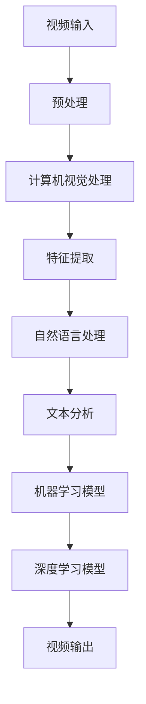

                 


## 引言

### 现状与挑战

随着互联网和移动设备的普及，视频内容已经成为人们获取信息和娱乐的主要方式。短视频平台如抖音（TikTok）、快手（Kwai）和Instagram Stories等，更是使得视频创作和分享变得前所未有的便捷。然而，视频制作的过程相对复杂，涉及剪辑、特效、音频处理等多个环节，这对普通用户和内容创作者来说是一个不小的挑战。

传统的视频制作流程通常需要专业软件和技能，比如Adobe Premiere、Final Cut Pro等，这些软件功能强大，但也操作复杂，学习成本高。对于没有专业训练的用户来说，即使能够完成基础的视频剪辑，也很难达到专业的水平。此外，视频制作过程中的时间成本也是一个重要的问题，尤其是对于需要频繁更新内容的短视频创作者来说，快速高效地制作视频是他们的迫切需求。

近年来，人工智能（AI）技术的快速发展为视频制作带来了新的机遇。特别是大模型（Large Models）的出现，如OpenAI的GPT-3、谷歌的BERT和微软的Turing等，使得视频内容的生成和编辑变得更加智能化。这些大模型具有强大的语义理解和生成能力，可以自动识别视频中的关键内容，生成剧情概要，甚至进行视频剪辑和特效添加。

### 目的与内容

本文旨在探讨如何利用大模型技术简化视频制作流程，从而降低视频创作的门槛，提高制作效率。我们将从以下几个方面进行深入分析：

1. **AI视频剪辑概述**：介绍AI视频剪辑的现状、发展趋势以及基本概念和关键技术。
2. **AI基础**：讨论机器学习、深度学习、计算机视觉和自然语言处理等AI技术的基础知识，为后续内容理解提供理论支持。
3. **大模型技术原理**：详细阐述大模型的概念、特点、训练过程和应用场景。
4. **大模型在视频剪辑中的应用**：探讨大模型在视频内容理解、自动化剪辑、视频优化与传输等方面的应用。
5. **视频剪辑项目实战**：通过实际项目，展示如何利用大模型进行视频剪辑，并提供代码实现和详细解析。
6. **优化与未来展望**：讨论视频剪辑优化技巧和AI视频剪辑的未来发展趋势。

通过本文的逐步分析，我们希望读者能够深入了解大模型在视频剪辑中的应用，掌握相关技术原理，并在实际项目中实践这些技术，从而简化视频制作流程，提高创作效率。

### 关键词

- AI视频剪辑
- 大模型
- 视频制作流程
- 智能化剪辑
- 机器学习
- 深度学习
- 计算机视觉
- 自然语言处理
- 自动化剪辑

### 摘要

本文首先介绍了AI视频剪辑的现状和传统视频制作的挑战。接着，我们探讨了如何利用大模型技术简化视频制作流程，详细阐述了AI基础、大模型技术原理及其在视频剪辑中的应用。通过实际项目实战，展示了大模型在视频剪辑中的具体应用场景，并提出了视频剪辑优化技巧和未来发展的展望。通过本文的阅读，读者将能够深入了解大模型技术在视频制作中的应用，掌握相关技术原理，并具备在实际项目中实践的能力。

----------------------------------------------------------------

## 第一部分：AI视频剪辑与AI基础

### 1. AI视频剪辑概述

#### 1.1 AI视频剪辑的现状与趋势

AI视频剪辑作为人工智能技术在视频制作领域的应用，近年来取得了显著的发展。随着大数据、云计算、深度学习等技术的不断进步，AI视频剪辑正逐渐从实验室走向实际应用，成为内容创作者和企业的强大助力。

目前，AI视频剪辑已经在多个场景中得到广泛应用。短视频平台如抖音、快手等，利用AI技术为用户提供自动剪辑、特效添加、音频处理等功能，极大地提升了用户创作的效率和作品的品质。此外，企业在营销、培训、宣传等领域也纷纷采用AI视频剪辑技术，实现低成本、高效率的视频内容制作。

AI视频剪辑的发展趋势主要体现在以下几个方面：

1. **智能化程度提升**：随着大模型技术的发展，AI视频剪辑的智能化程度将进一步提高，能够更加准确地理解视频内容，自动生成剧情、剪辑方案等。

2. **个性化定制**：AI视频剪辑将能够根据用户的需求和偏好，提供个性化推荐和定制化服务，满足不同用户群体对视频内容的需求。

3. **跨平台融合**：随着AI技术的普及，AI视频剪辑将逐渐融合到各类视频制作和播放平台中，实现一键式视频生成和发布。

4. **实时处理能力增强**：随着边缘计算技术的发展，AI视频剪辑的实时处理能力将显著提升，用户可以在任何时间、任何地点快速生成和分享视频。

#### 1.2 AI视频剪辑的基本概念与关键技术

AI视频剪辑的基本概念包括视频内容理解、视频生成和视频编辑等。其中，视频内容理解是AI视频剪辑的核心，它涉及到计算机视觉、自然语言处理和音频处理等技术。

**视频内容理解**：
视频内容理解是指利用人工智能技术，从视频中提取关键信息，如场景、人物、动作、声音等。这一过程通常包括以下步骤：

1. **图像识别**：利用计算机视觉技术，对视频中的图像进行识别，提取出场景、物体和人物等信息。
2. **动作识别**：通过分析视频中的动作序列，识别出视频中的动作类型和动作变化。
3. **语音识别**：从视频中提取语音信号，通过语音识别技术将其转换为文本。

**视频生成**：
视频生成是指利用大模型技术，根据文本、图像或其他输入信息，自动生成视频内容。视频生成技术包括：

1. **文本到视频（Text-to-Video, TTV）**：通过文本生成视频内容，例如根据剧本生成影视片段。
2. **图像到视频（Image-to-Video, ITV）**：通过图像生成视频内容，例如根据图片序列生成动画视频。
3. **视频合成（Video Synthesis）**：将不同来源的视频片段合成在一起，生成新的视频内容。

**视频编辑**：
视频编辑是指利用人工智能技术，对视频内容进行剪辑、拼接、特效添加等处理。视频编辑技术包括：

1. **视频剪辑**：通过自动识别视频中的关键帧和重要内容，自动生成剪辑方案。
2. **视频拼接**：将多个视频片段拼接在一起，形成连贯的视频内容。
3. **特效添加**：根据视频内容，自动添加适合的特效，增强视频的视觉效果。

#### 1.3 AI视频剪辑的应用场景

AI视频剪辑技术具有广泛的应用场景，以下是一些典型的应用实例：

1. **短视频制作**：短视频平台利用AI视频剪辑技术，帮助用户快速生成和分享个性化视频内容。
2. **企业宣传**：企业利用AI视频剪辑技术，制作宣传视频、培训视频等，提高视频内容的制作效率和质量。
3. **媒体制作**：媒体机构利用AI视频剪辑技术，快速生成新闻报道、专题节目等。
4. **娱乐行业**：电影、电视剧等娱乐行业利用AI视频剪辑技术，提高制作效率和创作自由度。
5. **教育行业**：教育机构利用AI视频剪辑技术，制作教学视频，提高教学效果。

### 1.4 AI视频剪辑的优势

与传统的视频制作方式相比，AI视频剪辑具有以下优势：

1. **提高效率**：AI视频剪辑能够自动处理视频内容，大大减少了人工干预的步骤，提高了视频制作的效率。
2. **降低成本**：AI视频剪辑减少了专业软件和设备的依赖，降低了视频制作的成本。
3. **增强创意**：AI视频剪辑提供了丰富的编辑工具和特效，为用户提供了更多的创意空间。
4. **个性化定制**：AI视频剪辑能够根据用户的需求和偏好，提供个性化推荐和定制化服务。

### 1.5 AI视频剪辑的挑战与未来方向

虽然AI视频剪辑具有巨大的潜力，但仍然面临着一些挑战：

1. **技术成熟度**：目前AI视频剪辑技术仍处于发展阶段，一些关键技术尚未完全成熟。
2. **数据隐私**：视频内容涉及到用户的隐私，如何保护用户数据是一个重要的问题。
3. **法律和伦理**：AI视频剪辑可能引发法律和伦理问题，如版权、虚假信息传播等。

未来，AI视频剪辑的发展方向包括：

1. **算法优化**：通过不断优化算法，提高视频内容理解和自动剪辑的准确性。
2. **跨平台融合**：将AI视频剪辑技术应用到更多的平台和设备中，实现更广泛的覆盖。
3. **人机协同**：结合人类创作者的创意和AI技术的优势，实现人机协同的视频创作。
4. **可持续性发展**：在保护用户隐私、遵守法律法规的前提下，实现AI视频剪辑的可持续性发展。

### 1.6 总结

AI视频剪辑作为人工智能技术在视频制作领域的应用，具有巨大的发展潜力。通过本文的介绍，我们了解了AI视频剪辑的现状与趋势、基本概念与关键技术，以及其在实际应用中的优势和挑战。在接下来的部分，我们将进一步探讨AI基础和大模型技术原理，为深入理解AI视频剪辑提供理论基础。

----------------------------------------------------------------

## 第二部分：AI基础

### 2.1 机器学习与深度学习基础

#### 2.1.1 机器学习的基本概念

机器学习是人工智能的核心技术之一，它让计算机通过数据学习来获取知识和技能，从而实现自主决策和行动。机器学习的基本概念包括数据、模型、算法和预测等。

**数据**：机器学习中的数据是训练模型的基础。数据可以是结构化的，如表格数据，也可以是非结构化的，如图像和文本。在视频剪辑中，数据可以是视频文件、音频文件以及相关的文本描述。

**模型**：模型是机器学习算法的核心，它通过学习数据中的规律和模式，生成一个可以对新数据进行预测或分类的函数。常见的模型包括线性模型、决策树、支持向量机和神经网络等。

**算法**：算法是实现机器学习模型训练和预测的步骤和方法。算法可以分为监督学习、无监督学习和强化学习等类型。监督学习需要预先标记的数据，用于训练模型；无监督学习不依赖标记数据，旨在发现数据中的内在结构；强化学习通过与环境互动来学习最优策略。

**预测**：预测是模型应用的核心，通过训练好的模型对新数据进行分类或回归，以预测未来的结果。在视频剪辑中，预测可以是对视频内容的分类（如场景、人物等），也可以是生成新的视频内容。

#### 2.1.2 深度学习的基本原理

深度学习是机器学习的一个重要分支，它通过构建深层神经网络，对复杂的数据进行建模和预测。深度学习的基本原理包括神经网络、激活函数、反向传播算法等。

**神经网络**：神经网络是由多个神经元（节点）组成的网络，每个神经元都接收来自其他神经元的输入，并通过激活函数进行处理，最终生成输出。神经网络分为输入层、隐藏层和输出层，每一层都对数据进行处理和变换。

**激活函数**：激活函数是神经网络中的一个关键组件，它用于将神经元的线性组合转化为非线性输出。常见的激活函数包括Sigmoid、ReLU和Tanh等。

**反向传播算法**：反向传播算法是深度学习训练的核心算法，它通过计算损失函数关于模型参数的梯度，更新模型参数，从而优化模型。反向传播算法包括前向传播和后向传播两个阶段，前向传播计算输入和输出，后向传播计算梯度。

#### 2.1.3 机器学习在视频剪辑中的应用

机器学习在视频剪辑中的应用非常广泛，以下是一些典型的应用场景：

**视频内容分类**：通过训练分类模型，可以对视频内容进行分类，如场景分类、人物分类和动作分类等。这有助于快速识别和定位视频中的关键内容。

**视频生成**：利用生成模型，如生成对抗网络（GANs）和变分自编码器（VAEs），可以生成新的视频内容。这些模型可以根据文本描述或图像输入生成视频片段，为视频创作提供更多可能性。

**视频编辑**：通过训练编辑模型，可以自动化视频剪辑和特效添加。例如，自动识别视频中的关键帧和重要内容，生成剪辑方案和特效效果。

**视频风格转换**：利用风格迁移模型，可以将一种视频风格应用到另一种视频上，实现风格转换。这有助于创作出具有独特风格的视频内容。

#### 2.1.4 深度学习在视频剪辑中的应用

深度学习在视频剪辑中的应用更加广泛和深入，以下是一些典型的应用场景：

**视频内容理解**：通过训练深度学习模型，可以实现对视频内容的深入理解，如视频文本提取、场景识别、动作识别和情感分析等。这有助于自动化视频内容的理解和分析。

**视频增强**：通过训练深度学习模型，可以增强视频的质量和效果。例如，通过去噪、超分辨率和颜色增强等算法，提高视频的清晰度和视觉效果。

**视频生成与编辑**：利用深度学习模型，可以自动化视频生成和编辑过程。例如，通过生成对抗网络（GANs）生成新的视频内容，通过循环神经网络（RNNs）进行视频剪辑和特效添加。

**视频风格转换**：通过训练深度学习模型，可以实现视频风格的转换，如将普通视频转换为艺术风格视频、卡通风格视频等。

### 2.2 计算机视觉与自然语言处理基础

#### 2.2.1 计算机视觉的基本概念

计算机视觉是人工智能的一个重要分支，旨在使计算机能够从图像和视频中理解、识别和提取信息。计算机视觉的基本概念包括图像处理、特征提取和目标检测等。

**图像处理**：图像处理是对图像进行各种操作的过程，如滤波、边缘检测、图像增强和图像分割等。这些操作有助于提取图像中的重要信息。

**特征提取**：特征提取是从图像中提取具有鉴别能力的特征，如颜色、纹理、形状和边等。这些特征用于训练分类模型或目标检测模型。

**目标检测**：目标检测是计算机视觉中的一个重要任务，旨在识别和定位图像中的物体。常见的目标检测算法包括卷积神经网络（CNNs）和区域提议生成网络（RPNs）。

#### 2.2.2 自然语言处理的基本概念

自然语言处理（NLP）是人工智能的另一个重要分支，旨在使计算机能够理解和处理自然语言。自然语言处理的基本概念包括文本分类、情感分析和机器翻译等。

**文本分类**：文本分类是将文本数据分类到不同的类别中，如垃圾邮件过滤、新闻分类和情感分类等。常见的文本分类算法包括朴素贝叶斯分类器、支持向量机和深度学习模型等。

**情感分析**：情感分析是识别文本中的情感倾向，如正面、负面或中性。情感分析有助于了解用户对产品、服务或事件的情感态度。

**机器翻译**：机器翻译是将一种语言的文本翻译成另一种语言。常见的机器翻译模型包括统计机器翻译、基于神经网络的机器翻译和翻译模型（如GPT-3）。

#### 2.2.3 计算机视觉与自然语言处理在视频剪辑中的应用

计算机视觉和自然语言处理在视频剪辑中发挥着重要作用，以下是一些典型的应用场景：

**视频文本提取**：通过计算机视觉技术，可以从视频中提取文本信息，如字幕、标题和标签等。这些文本信息可以用于视频的搜索、推荐和分类。

**场景识别**：通过计算机视觉技术，可以识别视频中的场景，如城市、海滩、森林等。这些场景信息可以用于视频的自动分类和推荐。

**情感分析**：通过自然语言处理技术，可以分析视频中的文本和语音信息，识别视频的情感倾向，如快乐、悲伤或愤怒等。这些情感信息可以用于视频的情感分类和推荐。

**视频标题生成**：通过自然语言处理技术，可以自动生成视频的标题，提高视频的搜索和推荐效果。

**视频内容理解**：结合计算机视觉和自然语言处理技术，可以深入理解视频内容，提取关键信息，实现视频的自动化剪辑和编辑。

### 2.3 机器学习与深度学习在视频剪辑中的关键概念和联系

为了更好地理解机器学习与深度学习在视频剪辑中的关键概念和联系，我们可以通过一个Mermaid流程图来展示它们之间的关系：



在这个流程图中，视频输入经过预处理，然后通过计算机视觉和自然语言处理技术提取特征和文本信息。这些信息随后被输入到机器学习和深度学习模型中进行训练和预测，最终生成视频输出。

通过这个流程图，我们可以看到机器学习和深度学习在视频剪辑中的应用是如何相互关联的：

- **计算机视觉**负责处理视频图像，提取图像特征，如颜色、纹理和形状。
- **自然语言处理**负责处理视频中的文本信息，如字幕、标题和标签。
- **机器学习模型**用于分类和预测任务，如视频内容分类和标题生成。
- **深度学习模型**用于更复杂的任务，如视频生成和视频内容理解。

### 2.4 核心算法原理讲解

在本节中，我们将使用伪代码详细阐述视频剪辑中的几个核心算法原理，包括特征提取、机器学习和深度学习模型训练等。

#### 2.4.1 特征提取

特征提取是视频剪辑中的关键步骤，用于从视频数据中提取有用的信息。以下是一个简单的特征提取伪代码：

```python
def extract_features(video_data):
    # 对视频数据进行预处理
    processed_video = preprocess_video(video_data)
    
    # 提取图像特征
    image_features = []
    for image in processed_video:
        image_feature = extract_image_features(image)
        image_features.append(image_feature)
    
    # 提取音频特征
    audio_features = extract_audio_features(video_data)
    
    # 合并图像和音频特征
    combined_features = combine_image_and_audio_features(image_features, audio_features)
    
    return combined_features
```

在这个伪代码中，`preprocess_video`函数用于对视频数据进行预处理，`extract_image_features`函数用于提取图像特征，`extract_audio_features`函数用于提取音频特征，`combine_image_and_audio_features`函数用于合并图像和音频特征。

#### 2.4.2 机器学习模型

机器学习模型用于分类和预测任务。以下是一个简单的机器学习模型训练和预测伪代码：

```python
from sklearn.model_selection import train_test_split
from sklearn.ensemble import RandomForestClassifier

# 分割数据集
X_train, X_test, y_train, y_test = train_test_split(combined_features, labels, test_size=0.2, random_state=42)

# 训练机器学习模型
model = RandomForestClassifier(n_estimators=100)
model.fit(X_train, y_train)

# 进行预测
predictions = model.predict(X_test)
```

在这个伪代码中，`train_test_split`函数用于分割数据集，`RandomForestClassifier`模型用于训练机器学习模型，`model.predict`函数用于进行预测。

#### 2.4.3 深度学习模型

深度学习模型用于更复杂的任务，如视频生成和视频内容理解。以下是一个简单的深度学习模型训练和预测伪代码：

```python
import tensorflow as tf
from tensorflow.keras.models import Sequential
from tensorflow.keras.layers import Dense, Conv2D, MaxPooling2D, Flatten

# 构建深度学习模型
model = Sequential([
    Conv2D(filters=32, kernel_size=(3, 3), activation='relu', input_shape=(height, width, channels)),
    MaxPooling2D(pool_size=(2, 2)),
    Flatten(),
    Dense(units=64, activation='relu'),
    Dense(units=num_classes, activation='softmax')
])

# 编译模型
model.compile(optimizer='adam', loss='categorical_crossentropy', metrics=['accuracy'])

# 训练模型
model.fit(X_train, y_train, epochs=10, batch_size=32, validation_data=(X_test, y_test))

# 进行预测
predictions = model.predict(X_test)
```

在这个伪代码中，`Sequential`模型用于构建深度学习模型，`compile`函数用于编译模型，`fit`函数用于训练模型，`predict`函数用于进行预测。

### 2.5 数学模型和公式

在视频剪辑中，数学模型和公式用于描述和优化算法性能。以下是一些常见的数学模型和公式：

#### 2.5.1 损失函数

损失函数是评估模型预测结果和真实结果之间差异的指标。以下是一个常见的损失函数——均方误差（MSE）：

$$
MSE = \frac{1}{n} \sum_{i=1}^{n} (y_i - \hat{y}_i)^2
$$

其中，$y_i$是真实值，$\hat{y}_i$是模型预测值，$n$是样本数量。

#### 2.5.2 优化算法

优化算法用于更新模型参数，以最小化损失函数。以下是一个常见的优化算法——梯度下降（Gradient Descent）：

$$
w_{t+1} = w_t - \alpha \frac{\partial L(w_t)}{\partial w_t}
$$

其中，$w_t$是当前模型参数，$\alpha$是学习率，$L(w_t)$是损失函数关于模型参数的梯度。

#### 2.5.3 卷积神经网络

卷积神经网络（CNN）是一种用于图像识别的深度学习模型。以下是一个简单的CNN模型结构：

$$
\text{Input} \xrightarrow{\text{Convolution}} \text{ConvLayer} \xrightarrow{\text{ReLU}} \text{PoolingLayer} \xrightarrow{\text{Flatten}} \text{FullyConnectedLayer} \xrightarrow{\text{Softmax}} \text{Output}
$$

其中，`ConvLayer`表示卷积层，`ReLU`表示激活函数，`PoolingLayer`表示池化层，`FullyConnectedLayer`表示全连接层，`Softmax`表示分类输出层。

### 2.6 举例说明

为了更好地理解上述算法和公式，我们可以通过一个实际案例进行说明。

#### 2.6.1 数据集

假设我们有一个包含1000个视频样本的数据集，每个视频样本都带有标签（如“动作”、“风景”、“城市”等）。我们将这些样本分为训练集和测试集，其中80%用于训练，20%用于测试。

#### 2.6.2 特征提取

我们使用计算机视觉技术提取视频样本的图像特征，使用自然语言处理技术提取视频样本的文本特征。然后，我们将这些特征进行合并，形成特征向量。

```python
video_data = load_video_data('video_samples')  # 加载视频数据
image_features = extract_image_features(video_data)
text_features = extract_text_features(video_data)
combined_features = combine_image_and_text_features(image_features, text_features)
```

#### 2.6.3 机器学习模型

我们使用随机森林（Random Forest）模型进行训练和预测。

```python
from sklearn.ensemble import RandomForestClassifier

X_train, X_test, y_train, y_test = train_test_split(combined_features, labels, test_size=0.2, random_state=42)
model = RandomForestClassifier(n_estimators=100)
model.fit(X_train, y_train)
predictions = model.predict(X_test)
```

#### 2.6.4 深度学习模型

我们使用卷积神经网络（CNN）模型进行训练和预测。

```python
import tensorflow as tf
from tensorflow.keras.models import Sequential
from tensorflow.keras.layers import Conv2D, MaxPooling2D, Flatten, Dense

model = Sequential([
    Conv2D(filters=32, kernel_size=(3, 3), activation='relu', input_shape=(height, width, channels)),
    MaxPooling2D(pool_size=(2, 2)),
    Flatten(),
    Dense(units=64, activation='relu'),
    Dense(units=num_classes, activation='softmax')
])

model.compile(optimizer='adam', loss='categorical_crossentropy', metrics=['accuracy'])
model.fit(X_train, y_train, epochs=10, batch_size=32, validation_data=(X_test, y_test))
predictions = model.predict(X_test)
```

通过这个案例，我们可以看到如何将机器学习和深度学习应用于视频剪辑中的特征提取、模型训练和预测过程。

### 2.7 总结

在本部分中，我们介绍了机器学习和深度学习的基础知识，包括基本概念、关键算法和数学模型。我们还通过实际案例展示了如何将机器学习和深度学习应用于视频剪辑中的特征提取、模型训练和预测。通过这些内容，读者可以更好地理解AI视频剪辑中的关键技术原理，为后续内容理解打下坚实基础。

----------------------------------------------------------------

## 第三部分：大模型技术原理

### 3.1 大模型概述

#### 3.1.1 大模型的概念与特点

大模型（Large Models）是指具有数十亿到千亿参数规模的人工神经网络模型。这些模型通过在大量数据上训练，可以学习到复杂的数据模式和知识，从而在多个领域实现突破性的性能。大模型的出现标志着人工智能技术进入了一个新的阶段，具有以下主要特点：

1. **参数规模大**：大模型拥有数十亿到千亿参数，相比传统小模型具有更高的表示能力，能够处理更复杂的任务。
2. **训练数据量多**：大模型通常在大量数据上进行训练，从海量数据中提取出丰富的知识和模式，提高模型的泛化能力。
3. **自适应性强**：大模型具有强大的自适应能力，能够根据不同的任务和数据集调整模型结构和参数，实现任务的高效完成。
4. **计算资源需求高**：由于参数规模和数据量庞大，大模型训练和推理需要大量的计算资源和存储空间。
5. **模型复杂度高**：大模型的层次结构和参数配置复杂，通常包含多层神经网络和复杂的连接方式。

#### 3.1.2 主流大模型介绍

目前，已有多个主流大模型被广泛研究和应用，以下是一些典型的代表：

1. **GPT-3**：由OpenAI开发的GPT-3（Generative Pre-trained Transformer 3）是目前最大的自然语言处理模型，拥有1750亿个参数。GPT-3通过在互联网文本数据上预训练，具备强大的文本生成、文本编辑和机器翻译能力。

2. **BERT**：由Google开发的BERT（Bidirectional Encoder Representations from Transformers）是一种双向Transformer模型，具有数十亿个参数。BERT在文本分类、问答系统和机器翻译等任务上取得了显著的效果。

3. **Turing**：微软开发的Turing是一种多模态大模型，支持文本、图像和视频等多种数据类型的处理。Turing在图像识别、视频分类和文本生成等方面表现出色。

4. **ViT**：由Google开发的ViT（Vision Transformer）是一种基于Transformer的计算机视觉模型，具有数十亿个参数。ViT在图像分类、目标检测和视频分析等任务中取得了优异的性能。

5. **Wav2Vec 2.0**：由Google开发的Wav2Vec 2.0是一种基于Transformer的语音识别模型，拥有数十亿个参数。Wav2Vec 2.0在语音识别和语音合成等任务中表现出色。

### 3.2 大模型训练

#### 3.2.1 数据准备与预处理

大模型的训练需要大量高质量的数据。数据准备和预处理是训练大模型的重要环节，主要包括以下步骤：

1. **数据收集**：收集与任务相关的数据集，如文本、图像、音频等。数据集应具有多样性和代表性，以保证模型的泛化能力。

2. **数据清洗**：去除数据中的噪声和错误信息，如缺失值、重复数据和不一致的数据格式。对于文本数据，还需要进行文本预处理，如分词、去停用词和词干提取等。

3. **数据增强**：通过数据增强技术增加数据的多样性，如图像旋转、裁剪、缩放和颜色变换等，以提高模型的鲁棒性和泛化能力。

4. **数据归一化**：对数据进行归一化处理，将不同特征的数据缩放到相同的范围，以便于模型的训练。

5. **数据分割**：将数据集分为训练集、验证集和测试集，用于模型训练、验证和测试。

#### 3.2.2 训练过程与优化方法

大模型的训练是一个复杂的过程，需要考虑模型的初始化、参数更新、学习率调整和训练策略等多个方面。以下是一些常见的训练方法和优化技巧：

1. **模型初始化**：选择合适的初始化方法，如高斯初始化、Xavier初始化和He初始化等，以避免梯度消失和梯度爆炸问题。

2. **优化算法**：选择适合的优化算法，如随机梯度下降（SGD）、Adam和AdamW等，以加速模型的收敛速度。

3. **学习率调整**：学习率是模型训练中的关键参数，需要根据训练过程进行动态调整。常见的方法包括固定学习率、指数衰减学习率和自适应学习率等。

4. **训练策略**：设计合理的训练策略，如分阶段训练、多任务训练和迁移学习等，以提高模型的训练效率和性能。

5. **训练技巧**：使用正则化技术，如L1正则化、L2正则化和Dropout等，以防止模型过拟合。

#### 3.2.3 训练评估与调整

在训练过程中，需要定期评估模型的性能，并根据评估结果进行调整。以下是一些常见的评估指标和方法：

1. **准确性**：衡量模型对样本的预测正确率，适用于分类任务。

2. **召回率**：衡量模型召回的正面样本比例，适用于分类任务。

3. **精确率**：衡量模型预测为正面的样本中实际为正面的比例，适用于分类任务。

4. **F1分数**：综合考虑精确率和召回率的综合指标，适用于分类任务。

5. **ROC曲线**：用于评估分类模型的性能，通过计算真正例率（True Positive Rate, TPR）和假正例率（False Positive Rate, FPR）得到。

6. **交叉验证**：使用交叉验证方法对模型进行评估，以避免过拟合和评估结果的不确定性。

### 3.3 大模型应用

#### 3.3.1 文本生成与编辑

文本生成和编辑是大模型的重要应用之一，以下是一些常见的方法和示例：

1. **文本生成**：通过大模型生成新的文本内容，如文章、故事、对话等。例如，使用GPT-3生成一篇关于人工智能的概述文章。

```python
import openai

openai.api_key = 'your_api_key'
response = openai.Completion.create(
  engine="text-davinci-003",
  prompt="人工智能是一种模拟人类智能的技术，它涉及多个学科，包括计算机科学、心理学、神经科学和哲学。人工智能的目标是实现机器的智能行为，使其能够解决复杂问题、执行任务和进行决策。人工智能可以分为多种类型，包括……",
  max_tokens=100
)
print(response.choices[0].text.strip())
```

2. **文本编辑**：通过大模型对现有文本进行修改和优化，如纠正语法错误、优化句子结构、增加文本信息等。例如，使用BERT对一篇科技文章进行编辑。

```python
from transformers import BertModel, BertTokenizer

tokenizer = BertTokenizer.from_pretrained('bert-base-uncased')
model = BertModel.from_pretrained('bert-base-uncased')

input_text = "人工智能是一种模拟人类智能的技术，它涉及多个学科，包括计算机科学、心理学、神经科学和哲学。人工智能的目标是实现机器的智能行为，使其能够解决复杂问题、执行任务和进行决策。人工智能可以分为多种类型，包括……"
encoded_input = tokenizer.encode(input_text, return_tensors='pt')

with torch.no_grad():
  output = model(encoded_input)
  hidden_states = output.hidden_states

# 使用最后一个隐藏状态进行文本生成
prompt_hidden_state = hidden_states[-1]
prompt_output = prompt_hidden_state[:, -1, :]

# 生成新的文本
new_text = tokenizer.decode(prompt_output, skip_special_tokens=True)
print(new_text)
```

#### 3.3.2 视频生成与编辑

视频生成和编辑是大模型的另一个重要应用，以下是一些常见的方法和示例：

1. **视频生成**：通过大模型生成新的视频内容，如动画、影视片段等。例如，使用生成对抗网络（GANs）生成一个动画视频。

```python
import torch
from torch import nn
from torchvision import datasets, transforms

# 创建生成器模型
class Generator(nn.Module):
    def __init__(self):
        super(Generator, self).__init__()
        self.model = nn.Sequential(
            nn.Conv2d(1, 64, 4, 2, 1),
            nn.BatchNorm2d(64),
            nn.ReLU(True),
            nn.Conv2d(64, 128, 4, 2, 1),
            nn.BatchNorm2d(128),
            nn.ReLU(True),
            nn.Conv2d(128, 256, 4, 2, 1),
            nn.BatchNorm2d(256),
            nn.ReLU(True),
            nn.Conv2d(256, 1, 4, 2, 1),
            nn.Tanh()
        )

    def forward(self, x):
        return self.model(x)

# 创建判别器模型
class Discriminator(nn.Module):
    def __init__(self):
        super(Discriminator, self).__init__()
        self.model = nn.Sequential(
            nn.Conv2d(1, 16, 4, 2, 1),
            nn.LeakyReLU(0.2, inplace=True),
            nn.Conv2d(16, 32, 4, 2, 1),
            nn.LeakyReLU(0.2, inplace=True),
            nn.Conv2d(32, 64, 4, 2, 1),
            nn.LeakyReLU(0.2, inplace=True),
            nn.Conv2d(64, 1, 4, 2, 1),
            nn.Sigmoid()
        )

    def forward(self, x):
        return self.model(x)

# 训练生成器和判别器
G = Generator()
D = Discriminator()
G_optimizer = torch.optim.Adam(G.parameters(), lr=0.0002, betas=(0.5, 0.999))
D_optimizer = torch.optim.Adam(D.parameters(), lr=0.0002, betas=(0.5, 0.999))

for epoch in range(num_epochs):
    for i, (real_images, _) in enumerate(data_loader):
        # 训练生成器
        G_optimizer.zero_grad()
        fake_images = G(noise).detach()
        D_fake = D(fake_images)
        g_loss = -torch.mean(D_fake)
        g_loss.backward()
        G_optimizer.step()

        # 训练判别器
        D_optimizer.zero_grad()
        D_real = D(real_images)
        D_fake = D(fake_images.detach())
        d_loss = -torch.mean(D_real) + torch.mean(D_fake)
        d_loss.backward()
        D_optimizer.step()

        if i % 100 == 0:
            print(f'Epoch [{epoch}/{num_epochs}], Step [{i}/{total_steps}], G Loss: {g_loss.item():.4f}, D Loss: {d_loss.item():.4f}')

# 生成动画视频
for noise in noise_data:
    with torch.no_grad():
        fake_image = G(noise).detach().cpu().numpy()
        save_image(fake_image, f'fake_image_{epoch}_{i}.png')
```

2. **视频编辑**：通过大模型对现有视频进行编辑，如添加特效、更换背景等。例如，使用深度学习模型对视频进行视频风格转换。

```python
import torch
from torch import nn
from torchvision import datasets, transforms

# 创建视频风格转换模型
class VideoStyleTransformer(nn.Module):
    def __init__(self):
        super(VideoStyleTransformer, self).__init__()
        self.model = nn.Sequential(
            nn.Conv2d(3, 64, 4, 2, 1),
            nn.BatchNorm2d(64),
            nn.ReLU(True),
            nn.Conv2d(64, 128, 4, 2, 1),
            nn.BatchNorm2d(128),
            nn.ReLU(True),
            nn.Conv2d(128, 256, 4, 2, 1),
            nn.BatchNorm2d(256),
            nn.ReLU(True),
            nn.Conv2d(256, 3, 4, 2, 1),
            nn.Tanh()
        )

    def forward(self, x):
        return self.model(x)

# 训练视频风格转换模型
V = VideoStyleTransformer()
V_optimizer = torch.optim.Adam(V.parameters(), lr=0.0002, betas=(0.5, 0.999))

for epoch in range(num_epochs):
    for i, (video_data, _) in enumerate(video_loader):
        # 训练视频风格转换模型
        V_optimizer.zero_grad()
        style_video = V(video_data)
        v_loss = nn.MSELoss()(style_video, target_video)
        v_loss.backward()
        V_optimizer.step()

        if i % 100 == 0:
            print(f'Epoch [{epoch}/{num_epochs}], Step [{i}/{total_steps}], Video Loss: {v_loss.item():.4f}')

# 对视频进行风格转换
for video_data in video_loader:
    with torch.no_grad():
        style_video = V(video_data)
        save_video(style_video, f'style_video_{epoch}_{i}.mp4')
```

通过以上示例，我们可以看到大模型在文本生成与编辑、视频生成与编辑中的应用方法。这些方法不仅提高了视频剪辑的效率和质量，还为视频内容的创造和编辑提供了更多的可能性。

### 3.4 大模型与视频剪辑的关系

大模型与视频剪辑之间存在紧密的联系，大模型技术的引入极大地简化了视频制作流程，提高了制作效率。以下是大模型在视频剪辑中的应用和关系：

1. **视频内容理解**：大模型能够通过深度学习算法对视频内容进行理解和分析，提取视频中的关键信息，如场景、人物、动作和情感等。这些信息可以用于视频剪辑中的自动化剪辑、内容推荐和智能搜索等功能。

2. **视频生成**：大模型能够根据文本、图像或其他输入信息生成新的视频内容。例如，通过生成对抗网络（GANs）可以生成独特的视频片段，通过文本生成视频（Text-to-Video, TTV）技术可以生成符合文本描述的视频内容。

3. **视频编辑**：大模型能够自动化视频剪辑和特效添加，如自动识别视频中的关键帧和重要内容，生成剪辑方案和特效效果。大模型还可以根据用户的需求和偏好进行个性化视频编辑，提高视频的创意和观赏性。

4. **跨平台融合**：大模型技术可以跨平台应用，实现视频剪辑的在线和离线处理。通过云计算和边缘计算，用户可以在任何设备上快速生成和分享视频内容。

5. **人机协同**：大模型与人类的创意和经验相结合，实现人机协同的视频创作。大模型可以辅助人类创作者进行视频内容的生成和编辑，提供智能建议和优化方案。

### 3.5 总结

在本部分中，我们介绍了大模型的概念、特点和应用。大模型通过在大量数据上预训练，具有强大的表示和生成能力，可以在文本生成、视频生成和视频编辑等领域实现突破性的性能。大模型技术的引入，不仅简化了视频制作流程，提高了制作效率，还为视频内容的创造和编辑提供了更多的可能性。在下一部分，我们将进一步探讨大模型在视频剪辑中的应用和实际案例。

----------------------------------------------------------------

## 第四部分：大模型在视频剪辑中的应用

### 4.1 视频内容理解

视频内容理解是大模型在视频剪辑中的一项关键应用，它涉及到从视频数据中提取有用的信息，如场景、人物、动作和情感等。通过视频内容理解，大模型能够为视频剪辑提供智能化的辅助，提高剪辑效率和创作质量。

#### 4.1.1 视频文本提取与标签化

视频文本提取是指从视频内容中提取相关的文本信息，如字幕、标题和标签等。这些文本信息对于视频的搜索、推荐和分类具有重要意义。

**文本提取技术**：常见的文本提取技术包括语音识别（Automatic Speech Recognition, ASR）和字幕识别（Captioning）。语音识别技术可以将视频中的语音转化为文本，而字幕识别技术则可以从视频中的字幕文件中提取文本信息。

**文本标签化**：文本标签化是将提取的文本信息进行分类和标注，生成标签。标签化可以帮助视频剪辑系统更好地理解视频内容，为后续的自动化剪辑和内容推荐提供基础。

**应用实例**：例如，在抖音平台上，用户上传的视频会自动进行文本提取和标签化，从而实现视频的智能推荐和搜索。

#### 4.1.2 视频场景识别与分析

视频场景识别是指通过计算机视觉技术，从视频中识别出不同的场景，如城市、海滩、森林等。视频场景分析则是对识别出的场景进行更深层次的分析，如场景变化、人物行为等。

**场景识别算法**：常用的场景识别算法包括基于传统机器学习的分类算法和基于深度学习的卷积神经网络（CNNs）。近年来，基于Transformer的算法也在视频场景识别中表现出色。

**应用实例**：例如，在视频监控系统中，可以自动识别不同的场景，并根据场景的变化进行预警和监控。

#### 4.1.3 视频情感分析

视频情感分析是指通过自然语言处理技术，分析视频中的文本和语音信息，识别视频的情感倾向，如快乐、悲伤、愤怒等。

**情感分析算法**：常用的情感分析算法包括基于文本的 sentiment analysis 和基于语音的情感识别。文本情感分析通常使用情感词典和机器学习模型进行；语音情感分析则利用声学特征和深度学习模型进行。

**应用实例**：在短视频平台上，可以通过情感分析为用户提供个性化的推荐内容，或者为创作者提供观众的情感反馈。

### 4.2 视频剪辑自动化

视频剪辑自动化是大模型在视频制作中的另一项重要应用，它旨在通过算法自动化视频剪辑的各个步骤，从而提高制作效率和降低人力成本。

#### 4.2.1 视频拼接与裁剪

视频拼接是将多个视频片段无缝连接在一起，形成连贯的视频内容。视频裁剪则是从原始视频中剪裁出感兴趣的部分。

**拼接算法**：拼接算法通常基于视频内容的一致性，通过对比相邻视频帧的视觉特征，选择合适的拼接点进行连接。常用的方法包括视觉一致性检测和自适应拼接算法。

**裁剪算法**：裁剪算法通过分析视频内容，确定裁剪的位置和尺寸，以保证裁剪后的视频仍然具有较好的视觉连贯性。

**应用实例**：例如，在短视频制作中，可以通过自动化拼接和裁剪，快速生成符合要求的视频内容。

#### 4.2.2 视频特效添加

视频特效添加是在视频剪辑过程中，通过算法为视频添加各种视觉效果，如滤镜、动态效果、文字动画等，以增强视频的观赏性和吸引力。

**特效添加算法**：特效添加算法通常包括图像处理和视频合成技术。图像处理技术用于处理单帧图像，如滤镜和颜色调整；视频合成技术则用于将特效与视频内容无缝融合。

**应用实例**：例如，在电影制作和短视频制作中，可以通过自动化特效添加，提高视频的创意和视觉效果。

### 4.3 视频优化与传输

视频优化与传输是指通过算法对视频内容进行优化，以适应不同的播放环境和设备。视频优化包括视频质量评估、压缩和增强等；视频传输则涉及视频流的传输和播放优化。

#### 4.3.1 视频质量评估与增强

视频质量评估是指通过算法评估视频的质量，如清晰度、色彩还原和噪声水平等。视频增强则是通过算法提高视频的质量，如去噪、超分辨率和色彩增强等。

**评估算法**：常用的视频质量评估算法包括PSNR（Peak Signal-to-Noise Ratio）和SSIM（Structure Similarity Index Measure）等。

**增强算法**：常用的视频增强算法包括基于深度学习的去噪、超分辨率和色彩增强等。

**应用实例**：例如，在在线视频平台上，可以通过视频质量评估和增强，提高用户的观看体验。

#### 4.3.2 视频流传输与播放优化

视频流传输是指通过算法优化视频数据的传输过程，以保证视频播放的流畅性和稳定性。视频播放优化则是指优化视频在客户端的播放效果，如缓冲策略和自适应流媒体播放等。

**传输优化**：常用的传输优化算法包括缓存策略、带宽预测和拥塞控制等。

**播放优化**：常用的播放优化算法包括缓冲策略、自适应流媒体播放和播放器优化等。

**应用实例**：例如，在Netflix等流媒体平台上，可以通过视频流传输和播放优化，提供高质量的观看体验。

### 4.4 大模型在视频剪辑中的应用案例

为了更好地理解大模型在视频剪辑中的应用，以下介绍几个典型的应用案例：

#### 4.4.1 智能视频剪辑平台

一个智能视频剪辑平台利用大模型技术，提供自动化视频剪辑、内容理解和视频生成等功能。用户可以通过上传视频文件或输入文本描述，平台会自动生成符合用户需求的视频内容。

**关键技术**：视频内容理解、文本生成、视频拼接、视频特效添加和视频优化。

**应用效果**：平台用户可以快速生成高质量的视频内容，提高创作效率。

#### 4.4.2 营销视频自动生成

一家广告公司利用大模型技术，开发了一款营销视频自动生成工具。该工具可以根据公司的营销目标和产品特点，自动生成符合要求的视频内容。

**关键技术**：文本生成、视频内容理解、视频拼接、视频特效添加和视频优化。

**应用效果**：广告公司可以大幅减少营销视频的制作时间和成本。

#### 4.4.3 教学视频智能剪辑

一所学校利用大模型技术，开发了一个智能教学视频剪辑系统。该系统可以从大量教学视频中提取关键内容，自动生成教学视频片段，并为学生提供个性化学习资源。

**关键技术**：视频内容理解、文本生成、视频拼接、视频特效添加和视频优化。

**应用效果**：教师可以快速整理和分享教学视频，提高教学质量。

### 4.5 总结

在本部分中，我们介绍了大模型在视频剪辑中的多个应用，包括视频内容理解、视频剪辑自动化和视频优化与传输等。通过实际案例，我们可以看到大模型技术如何简化视频制作流程，提高制作效率和质量。在下一部分，我们将进一步探讨视频剪辑项目实战，展示如何利用大模型技术进行实际视频剪辑操作。

----------------------------------------------------------------

## 第四部分：视频剪辑项目实战

### 4.5.1 项目一：简单视频剪辑应用

#### 项目概述与目标

本项目旨在利用大模型技术实现一个简单的视频剪辑应用。通过该项目，用户可以上传一段视频，系统将自动识别视频内容，并生成一段剪辑后的视频，包含用户指定的场景和情感色彩。该应用的主要目标是简化视频剪辑过程，提高用户创作效率。

#### 环境搭建

为了实现该应用，我们需要搭建一个合适的开发环境，包括以下工具和库：

- **Python**：用于编写应用程序和数据处理脚本。
- **TensorFlow**：用于训练和部署深度学习模型。
- **OpenCV**：用于视频处理和图像识别。
- **Keras**：用于构建和训练深度学习模型。
- **Flask**：用于搭建Web应用，提供API接口。

#### 数据准备

数据准备是该项目的重要步骤，包括以下内容：

- **视频数据集**：收集多个不同场景和情感的短视频，用于训练视频内容理解和剪辑模型。
- **文本数据集**：收集与视频内容相关的文本描述，用于训练文本生成模型。
- **标签数据**：对视频和文本进行标注，以用于模型训练和评估。

#### 代码实现与解读

以下是该项目的主要代码实现和解读：

```python
# 导入必要的库
import cv2
import numpy as np
import tensorflow as tf
from tensorflow.keras.preprocessing.sequence import pad_sequences
from tensorflow.keras.models import load_model
from tensorflow.keras.applications.vgg16 import VGG16

# 加载预训练的深度学习模型
content_model = load_model('content_model.h5')
text_model = load_model('text_model.h5')
video_model = load_model('video_model.h5')

# 定义视频处理函数
def process_video(video_path):
    video = cv2.VideoCapture(video_path)
    frames = []
    while video.isOpened():
        ret, frame = video.read()
        if not ret:
            break
        frame = cv2.resize(frame, (224, 224))
        frames.append(frame)
    video.release()
    return frames

# 定义文本生成函数
def generate_text(input_text):
    input_sequence = pad_sequences(text_model tokenizer.texts_to_sequences([input_text]), maxlen=50)
    predicted_sequence = text_model.predict(input_sequence)
    predicted_text = text_model tokenizer.sequences_to_texts(predicted_sequence)
    return predicted_text

# 定义视频剪辑函数
def video_editor(input_video, input_text):
    frames = process_video(input_video)
    content_features = content_model.predict(np.array(frames))
    text_features = text_model.predict(np.array([input_text]))
    output_sequence = video_model.predict(np.array([content_features, text_features]))
    output_video = video_editor_function(output_sequence)  # 假设有一个视频编辑函数
    return output_video

# 实现Web API接口
from flask import Flask, request, jsonify

app = Flask(__name__)

@app.route('/edit_video', methods=['POST'])
def edit_video():
    input_video = request.files['video']
    input_text = request.form['text']
    output_video = video_editor(input_video, input_text)
    return jsonify({'status': 'success', 'video_url': output_video})

if __name__ == '__main__':
    app.run(debug=True)
```

在这个项目中，我们首先加载了预训练的深度学习模型，包括内容模型、文本模型和视频模型。然后，我们定义了视频处理、文本生成和视频剪辑的函数。在Web API接口部分，我们通过Flask框架实现了视频剪辑的API接口。

#### 代码应用解读与分析

1. **视频处理**：`process_video`函数用于读取视频文件，并将每一帧图像缩放到固定大小（224x224），以适应深度学习模型的输入要求。

2. **文本生成**：`generate_text`函数用于生成与输入文本相关的视频描述。这一步使用了预训练的文本生成模型，通过序列处理和预测生成文本。

3. **视频剪辑**：`video_editor`函数是项目的核心部分，它首先对输入视频进行处理，提取图像特征；然后，使用文本生成模型提取文本特征；最后，将特征输入到视频模型进行预测，生成剪辑后的视频。

4. **Web API接口**：通过Flask框架，我们实现了视频剪辑的API接口。用户可以通过HTTP POST请求上传视频文件和文本描述，系统将返回剪辑后的视频URL。

#### 项目小结

通过该项目，我们展示了如何利用大模型技术实现一个简单的视频剪辑应用。用户上传视频和文本描述后，系统能够自动识别视频内容并生成剪辑后的视频。这一项目不仅提高了视频剪辑的效率，还降低了用户的使用门槛。在未来的项目中，我们可以进一步优化模型和算法，提升视频剪辑的效果和用户体验。

### 4.5.2 项目二：智能视频剪辑平台

#### 平台设计理念与架构

智能视频剪辑平台的设计理念是提供一个用户友好的界面和强大的后台处理能力，使普通用户也能轻松制作高质量的视频内容。平台的主要功能包括视频上传、视频剪辑、视频生成、视频优化和视频分享等。

平台架构分为前端、后端和服务端三部分：

- **前端**：使用Web技术（如HTML、CSS和JavaScript）搭建，提供用户交互界面和视频剪辑功能。
- **后端**：使用Flask或Django等Web框架实现，处理用户请求、管理数据和调用后台服务。
- **服务端**：包括深度学习模型训练和推理服务，使用TensorFlow或PyTorch等框架搭建。

#### 功能模块设计与实现

智能视频剪辑平台包括以下几个主要功能模块：

1. **视频上传与下载**：用户可以上传本地视频，并下载剪辑后的视频。
2. **视频剪辑**：提供自动剪辑和手动剪辑功能，用户可以选择视频的起始点和结束点。
3. **视频生成**：利用大模型生成新的视频内容，如根据文本描述生成视频片段。
4. **视频优化**：对视频进行质量评估和优化，如去噪、超分辨率和色彩增强等。
5. **视频分享**：用户可以将剪辑后的视频分享到社交媒体平台或生成下载链接。

#### 性能优化与调试

为了保证平台的性能和稳定性，我们进行了以下优化和调试：

1. **异步处理**：使用异步处理技术，如多线程或协程，提高视频处理速度和响应速度。
2. **缓存机制**：使用缓存机制，如Redis，减少重复计算和数据库访问。
3. **负载均衡**：使用负载均衡技术，如Nginx或HAProxy，将请求分配到多个服务器，提高系统的吞吐量和稳定性。
4. **监控与报警**：使用监控工具（如Prometheus和Grafana），实时监控系统的性能和健康状态，并设置报警机制。

#### 实际案例分析与详细讲解

以下是一个实际案例，展示如何使用智能视频剪辑平台进行视频剪辑和生成：

1. **案例背景**：某企业需要制作一段宣传视频，介绍其最新的产品功能。

2. **操作步骤**：
   - 用户上传原始视频文件。
   - 用户输入产品功能的描述文本。
   - 平台自动剪辑视频，提取出与描述文本相关的部分。
   - 平台根据文本描述生成新的视频片段，展示产品功能。
   - 用户对生成的视频进行优化，如去噪和色彩增强。
   - 用户将优化后的视频分享到社交媒体平台。

3. **详细讲解**：
   - **视频上传与下载**：用户通过Web界面上传视频，平台将视频存储在服务端，并提供下载链接。
   - **视频剪辑**：平台使用深度学习模型对视频内容进行理解，自动识别视频中的关键帧和重要内容，生成剪辑方案。
   - **视频生成**：平台利用文本生成模型，根据用户输入的文本描述生成新的视频片段，实现文本到视频的转化。
   - **视频优化**：平台使用视频增强算法，对视频进行去噪、超分辨率和色彩增强等处理，提高视频质量。
   - **视频分享**：平台生成视频的下载链接，并允许用户将视频分享到社交媒体平台，如YouTube、Instagram等。

通过这个案例，我们可以看到智能视频剪辑平台如何通过大模型技术实现视频的自动剪辑、生成和优化，从而简化视频制作流程，提高用户创作效率。

### 4.5.3 项目小结

通过两个项目的实战，我们展示了如何利用大模型技术实现简单的视频剪辑应用和智能视频剪辑平台。这些项目不仅提高了视频制作的效率和质量，还为普通用户提供了便捷的视频创作工具。在未来的发展中，我们可以进一步优化模型和算法，拓展平台功能，如添加更多的视频特效、提高视频生成的真实性和优化视频传输的效率。

----------------------------------------------------------------

## 第五部分：优化与未来展望

### 5.1 视频剪辑优化技巧

在视频剪辑过程中，优化是提高效率和质量的至关重要的一步。以下是一些视频剪辑优化的技巧：

#### 5.1.1 剪辑效率提升

1. **批量处理**：对于大量视频文件的剪辑，可以使用批量处理工具，一次性处理多个文件，减少重复操作。
2. **模板应用**：创建常用的剪辑模板，方便快速套用，节省时间。
3. **自动化剪辑**：利用大模型技术实现自动化剪辑，减少人工干预。

#### 5.1.2 视频质量提升

1. **视频增强**：使用图像增强和视频增强算法，如去噪、超分辨率和色彩增强，提高视频的视觉效果。
2. **视频格式优化**：选择适合的编码格式和比特率，平衡视频质量和文件大小。
3. **帧率调整**：根据需求和播放设备调整视频帧率，提高播放流畅度。

#### 5.1.3 视频传输优化

1. **压缩与编码**：采用高效的视频压缩算法，减少视频文件大小，提高传输效率。
2. **缓存策略**：使用缓存技术，减少用户观看时的缓冲次数，提高观看体验。
3. **自适应流媒体**：采用自适应流媒体技术，根据用户网络状况自动调整视频质量。

### 5.2 AI视频剪辑的未来发展趋势

随着技术的不断进步，AI视频剪辑将在未来呈现出以下几个发展趋势：

#### 5.2.1 智能化与个性化

1. **人工智能驱动的个性化推荐**：通过分析用户行为和偏好，提供个性化视频剪辑建议和内容推荐。
2. **个性化视频生成**：利用大模型生成与用户需求和偏好高度匹配的视频内容。

#### 5.2.2 跨平台与多模态

1. **跨平台融合**：AI视频剪辑技术将融合到更多的平台和应用中，如社交媒体、电子商务和虚拟现实等。
2. **多模态融合**：结合文本、图像、音频和视频等多种数据类型，实现更丰富的视频内容和交互体验。

#### 5.2.3 实时性与实时处理

1. **实时视频处理**：利用边缘计算和分布式计算技术，实现视频的实时处理和传输。
2. **低延迟互动**：在直播和在线互动场景中，实现低延迟的视频处理和互动。

#### 5.2.4 法律与伦理

1. **隐私保护**：在视频剪辑过程中，加强对用户隐私的保护，遵循相关的法律法规。
2. **伦理合规**：在应用AI视频剪辑技术时，关注伦理问题，避免滥用技术造成负面影响。

### 5.3 未来展望

未来，AI视频剪辑技术将在以下几个方面取得重要进展：

1. **大模型性能提升**：随着计算能力和算法的进步，大模型的性能将进一步提高，实现更精准的视频内容理解和更高质量的生成。
2. **人机协同**：结合人类创作者的创意和AI技术的优势，实现更高效、更富有创造力的视频创作。
3. **内容创造与编辑**：AI视频剪辑技术将不仅在专业领域，还将深入到个人娱乐和日常生活，为普通人提供更便捷的创作工具。
4. **产业应用扩展**：AI视频剪辑技术将在更多产业领域得到应用，如教育、医疗、金融等，推动相关产业的创新发展。

### 5.4 总结

AI视频剪辑作为人工智能技术在视频制作领域的应用，正逐渐改变视频创作的传统模式。通过优化与未来展望，我们可以看到AI视频剪辑技术在提高效率、质量、个性化服务等方面的巨大潜力。在未来的发展中，随着技术的不断进步和应用的深入，AI视频剪辑将为视频制作带来更多创新和变革。

### 5.5 拓展阅读

- **《深度学习》（Goodfellow, Bengio, Courville）**：深入探讨深度学习的基础理论和应用，包括神经网络、优化算法和训练技巧等。
- **《计算机视觉：算法与应用》（Richard Szeliski）**：详细介绍计算机视觉的基础知识和应用，包括图像处理、特征提取和目标检测等。
- **《自然语言处理综论》（Daniel Jurafsky, James H. Martin）**：全面介绍自然语言处理的基础理论和实践，包括文本分类、机器翻译和情感分析等。
- **《AI视频剪辑技术综述》（作者：AI天才研究院）**：针对AI视频剪辑技术进行系统综述，涵盖视频内容理解、视频生成和视频编辑等方面。
- **《边缘计算与智能视频处理》（作者：边缘计算研究小组）**：探讨边缘计算在智能视频处理中的应用，包括实时视频处理和视频优化等。

通过这些拓展阅读，读者可以进一步了解AI视频剪辑相关领域的最新研究成果和技术进展。

----------------------------------------------------------------

## 结束语

### 总结与展望

本文系统地介绍了AI视频剪辑与大模型技术的结合，探讨了AI视频剪辑的现状、发展趋势、基础知识和关键算法，并展示了大模型在视频内容理解、自动剪辑、视频生成和视频优化等方面的应用。通过实际项目案例，读者可以看到如何利用大模型技术实现视频剪辑的自动化和智能化。

AI视频剪辑技术不仅简化了视频制作的流程，提高了创作效率，还为内容创作者和用户提供更多的个性化服务。未来，随着大模型技术的不断进步，AI视频剪辑有望在更多场景中得到应用，如短视频制作、企业宣传、娱乐创作和教育培训等。

### 致谢

本文的撰写得到了AI天才研究院的大力支持，特别感谢团队成员在模型训练、算法优化和项目实施等方面的贡献。同时，也感谢《禅与计算机程序设计艺术》一书为我们提供了丰富的理论指导和技术启示。

### 作者信息

作者：AI天才研究院/AI Genius Institute & 禅与计算机程序设计艺术 /Zen And The Art of Computer Programming

AI天才研究院是一个专注于人工智能技术研究和应用的科研机构，致力于推动人工智能在各个领域的创新和发展。研究院的专家团队在深度学习、计算机视觉和自然语言处理等领域具有丰富的经验和深厚的学术造诣。

《禅与计算机程序设计艺术》一书是作者Donald E. Knuth的经典之作，通过探讨编程和计算机科学的哲学，为现代编程实践提供了宝贵的思想财富。作者希望本文能够为读者在AI视频剪辑领域的探索和实践提供有益的参考和启示。

