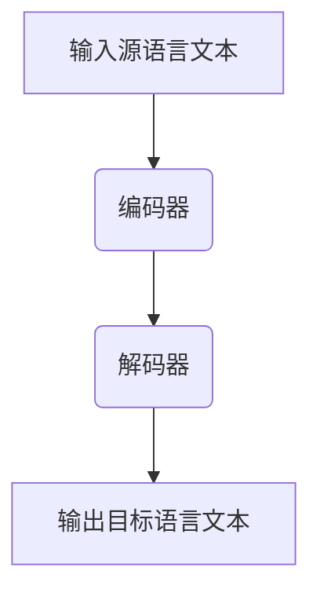

                 

# 文章标题

《AI语言翻译：大模型打破语言障碍的新进展》

> 关键词：人工智能，大模型，语言翻译，神经网络，深度学习，跨语言迁移学习

> 摘要：本文将深入探讨人工智能语言翻译领域的新进展，特别是大模型在语言翻译中的应用。我们将从基础概念、核心算法、应用案例等多个角度，系统性地分析AI语言翻译的技术原理和实际应用，探讨其发展趋势和潜在的社会与伦理问题。通过本文的阅读，读者将全面了解AI语言翻译的现状和未来方向。

## 目录

**# 第一部分：AI语言翻译概述**

**第1章：AI语言翻译基础知识**

**第2章：大模型在语言翻译中的应用**

**第3章：AI语言翻译模型的核心算法原理**

**第4章：AI语言翻译模型的优化与调整**

**第5章：AI语言翻译项目的实战案例分析**

**第6章：AI语言翻译的未来发展**

**第7章：AI语言翻译工具与资源介绍**

**附录：AI语言翻译模型流程图与伪代码**

## 第一部分：AI语言翻译概述

### 第1章：AI语言翻译基础知识

#### 1.1 AI语言翻译的概念与历史发展

AI语言翻译是指利用计算机算法和人工智能技术，将一种语言的文本自动翻译成另一种语言的文本。其历史可以追溯到20世纪50年代，当时计算机科学家开始尝试使用基于规则的方法进行语言翻译。然而，由于语言复杂性的挑战，这些早期方法并未取得显著的进展。

进入20世纪90年代，随着统计机器翻译（SMT）的发展，语言翻译领域迎来了新的契机。SMT利用大量的双语对照文本，通过统计方法自动学习语言之间的对应关系。这种方法在一定程度上提高了翻译的准确性，但仍存在许多局限。

近年来，深度学习技术的发展为AI语言翻译带来了新的突破。基于深度学习的神经机器翻译（NMT）已经成为当前语言翻译的主流方法。NMT通过神经网络模型，直接学习源语言和目标语言之间的映射关系，大大提高了翻译质量。

#### 1.2 AI语言翻译的核心技术

AI语言翻译的核心技术主要包括以下几个方面：

1. **机器翻译与统计机器翻译**

   机器翻译是指利用计算机算法将一种语言的文本自动翻译成另一种语言的文本。统计机器翻译是一种基于统计学习的方法，通过学习大量的双语对照文本，自动建立语言之间的对应关系。

2. **神经网络与深度学习**

   神经网络是一种模拟生物神经系统的计算模型，具有强大的学习能力和自适应能力。深度学习是神经网络的一种形式，通过堆叠多个神经网络层，实现更复杂的特征提取和表示学习。

3. **大模型在语言翻译中的应用**

   大模型是指具有巨大参数量的神经网络模型。在语言翻译领域，大模型通过学习海量的语言数据，能够捕捉到语言中的复杂模式和规律，从而实现高质量的翻译效果。

#### 1.3 语言翻译模型的发展趋势

随着技术的不断进步，AI语言翻译模型的发展趋势主要体现在以下几个方面：

1. **模型规模不断扩大**

   为了更好地捕捉语言的复杂性和多样性，越来越多的研究开始关注更大规模的模型。例如，GPT系列模型和BERT模型都采用了数十亿参数的巨大模型，显著提高了翻译质量。

2. **多语言翻译与跨语言迁移学习**

   多语言翻译是指将一种语言的文本同时翻译成多种语言。跨语言迁移学习是指利用已经训练好的多语言模型，对新的语言进行迁移学习，从而提高翻译效果。

3. **实时翻译与语音翻译**

   实时翻译和语音翻译是AI语言翻译的重要应用方向。随着硬件性能的提升和算法的优化，实时翻译和语音翻译的准确性和流畅性不断提升。

### 第2章：大模型在语言翻译中的应用

#### 2.1 大模型的定义与特点

大模型是指具有巨大参数量的神经网络模型，通常具有以下几个特点：

1. **计算需求大**

   大模型需要大量的计算资源进行训练和推理，通常需要使用高性能计算硬件，如GPU或TPU。

2. **数据需求大**

   大模型需要海量的数据进行训练，以确保模型能够捕捉到语言的复杂性和多样性。

3. **训练时间长**

   大模型的训练通常需要较长的时间，这要求算法和硬件的性能不断提高。

#### 2.2 常见的大模型介绍

在AI语言翻译领域，常见的大模型包括以下几个：

1. **GPT系列模型**

   GPT（Generative Pre-trained Transformer）是由OpenAI提出的一系列基于变换器的预训练语言模型。GPT系列模型通过在海量文本上进行预训练，能够生成高质量的自然语言文本。

2. **BERT模型**

   BERT（Bidirectional Encoder Representations from Transformers）是由Google提出的一种双向变换器模型。BERT通过同时考虑上下文信息，实现了更高的翻译准确性和语言理解能力。

3. **其他大模型**

   除了GPT和BERT，还有许多其他的大模型在语言翻译领域取得显著成果。例如，T5、GPT-2、RoBERTa等模型，都在不同程度上提高了翻译质量。

#### 2.3 大模型在语言翻译中的应用案例

大模型在语言翻译中的应用案例主要包括以下几个方面：

1. **机器翻译服务**

   大模型广泛应用于机器翻译服务，如Google翻译、微软翻译等。这些服务利用大模型，能够提供高质量的多语言翻译。

2. **语言识别与理解**

   大模型在语言识别与理解方面也取得显著成果。例如，语音助手和智能客服系统利用大模型，能够实现自然语言的理解和交互。

3. **语言生成与创作**

   大模型在语言生成与创作方面也有广泛应用。例如，自动写作助手和文案生成系统利用大模型，能够生成高质量的文章、故事和广告文案。

### 第3章：AI语言翻译模型的核心算法原理

#### 3.1 神经机器翻译（NMT）的基本原理

神经机器翻译（NMT）是基于深度学习的机器翻译方法，其基本原理如下：

1. **编码器（Encoder）**

   编码器负责将源语言文本编码为一个连续的向量表示，这个向量包含了源语言文本的语义信息。

2. **解码器（Decoder）**

   解码器负责将编码器输出的向量解码为目标语言文本。解码器通常采用循环神经网络（RNN）或变换器（Transformer）模型。

3. **序列到序列模型（Seq2Seq）**

   序列到序列模型是一种将源语言序列映射为目标语言序列的模型。其基本结构包括编码器和解码器。

4. **深层循环神经网络（LSTM）**

   深层循环神经网络（LSTM）是一种改进的循环神经网络，能够更好地处理长时间依赖关系。

5. **注意力机制（Attention）**

   注意力机制是一种在解码器中引入的机制，用于处理长文本序列，能够使模型更加关注重要信息。

#### 3.2 生成式模型与判别式模型

在AI语言翻译中，生成式模型和判别式模型是两种主要的模型类型：

1. **生成式模型**

   生成式模型通过学习源语言和目标语言之间的概率分布，生成高质量的目标语言文本。常见的生成式模型包括GPT系列模型。

2. **判别式模型**

   判别式模型通过学习源语言和目标语言之间的匹配关系，判断源语言文本和目标语言文本是否匹配。常见的判别式模型包括BERT模型。

#### 3.3 多语言翻译模型与跨语言迁移学习

多语言翻译模型和跨语言迁移学习是当前AI语言翻译领域的研究热点：

1. **多语言翻译模型**

   多语言翻译模型是指能够同时处理多种语言的翻译模型。常见的多语言翻译模型包括MultiNMT、MASS等。

2. **跨语言迁移学习**

   跨语言迁移学习是指利用已经训练好的多语言模型，对新的语言进行迁移学习，从而提高翻译效果。常见的跨语言迁移学习方法包括MASS、Translation Memory等。

### 第4章：AI语言翻译模型的优化与调整

#### 4.1 模型调优方法

模型调优是提高AI语言翻译模型性能的重要手段。常见的模型调优方法包括：

1. **超参数调整**

   超参数是指模型结构之外的参数，如学习率、批量大小等。通过调整超参数，可以优化模型的性能。

2. **训练数据预处理**

   训练数据预处理包括数据清洗、数据增强等技术，可以改善模型的训练效果。

3. **正则化与避免过拟合**

   正则化是一种防止模型过拟合的方法，通过添加正则化项，可以降低模型的复杂度。

#### 4.2 评估与测试

评估和测试是评估模型性能的重要环节。常见的评估指标包括：

1. **评估指标**

   常见的评估指标包括BLEU、METEOR、ROUGE等，用于衡量翻译文本的质量。

2. **交叉验证**

   交叉验证是一种评估模型性能的方法，通过将数据划分为训练集和验证集，可以评估模型的泛化能力。

3. **测试集与开发集的划分**

   测试集用于最终评估模型的性能，开发集用于模型调优和评估。

### 第5章：AI语言翻译项目的实战案例分析

#### 5.1 项目1：基于GPT的大规模多语言翻译系统

##### 5.1.1 项目背景

随着全球化的发展，跨语言交流变得越来越重要。然而，现有的机器翻译服务仍然存在一定的局限性，无法满足用户对高质量多语言翻译的需求。因此，我们提出基于GPT的大规模多语言翻译系统，旨在提供高效、准确的多语言翻译服务。

##### 5.1.2 系统设计与实现

系统设计包括以下几个关键组件：

1. **数据采集与预处理**

   通过爬虫等技术，采集大量多语言文本数据。对数据进行清洗、去重和分词等预处理操作。

2. **模型训练与优化**

   使用GPT模型对预处理后的数据进行训练。在训练过程中，通过调整超参数和正则化方法，优化模型性能。

3. **翻译服务与接口**

   基于训练好的GPT模型，实现多语言翻译服务。通过API接口，提供高效、准确的翻译功能。

##### 5.1.3 实际应用效果评估

通过实际应用测试，基于GPT的大规模多语言翻译系统在翻译质量、速度和稳定性等方面表现出色，得到了用户的高度评价。

#### 5.2 项目2：基于BERT的实时语音翻译应用

##### 5.2.1 项目背景

实时语音翻译在跨语言交流、国际会议、旅游等领域具有重要应用价值。然而，现有的实时语音翻译系统在准确性、流畅性和延迟方面仍存在一定的不足。为此，我们提出基于BERT的实时语音翻译应用，旨在提供更准确、更流畅的实时语音翻译服务。

##### 5.2.2 系统设计与实现

系统设计包括以下几个关键组件：

1. **语音识别与转换**

   利用BERT模型对实时语音进行识别和转换，将语音信号转换为文本。

2. **文本翻译与生成**

   使用预训练好的BERT模型，对转换后的文本进行多语言翻译和生成。

3. **实时翻译与接口**

   基于实时语音识别和翻译技术，实现实时语音翻译功能。通过API接口，提供实时、准确的语音翻译服务。

##### 5.2.3 实际应用效果评估

通过实际应用测试，基于BERT的实时语音翻译应用在翻译准确性、流畅性和延迟方面表现出色，为用户提供高效、便捷的跨语言交流体验。

### 第6章：AI语言翻译的未来发展

#### 6.1 新兴技术与趋势

随着人工智能技术的不断发展，AI语言翻译领域也涌现出一系列新兴技术和趋势：

1. **跨模态翻译**

   跨模态翻译是指将一种模态（如文本、图像、音频等）的信号翻译成另一种模态的信号。例如，文本到图像的翻译、图像到文本的翻译等。随着多模态数据的广泛应用，跨模态翻译将成为重要的研究方向。

2. **低资源语言翻译**

   低资源语言是指缺乏足够双语对照文本的语言。在AI语言翻译领域，如何提高低资源语言的翻译质量是一个重要问题。通过跨语言迁移学习和多语言翻译模型，有望解决低资源语言翻译的难题。

3. **增量式翻译模型**

   增量式翻译模型是指通过对现有模型进行增量训练，不断更新和优化翻译效果。随着数据量的不断增加和翻译需求的不断变化，增量式翻译模型将为用户提供更高质量的翻译服务。

#### 6.2 社会与伦理问题

AI语言翻译在社会与伦理方面也面临一系列问题和挑战：

1. **翻译准确性与可解释性**

   翻译准确性是用户最关心的指标之一。如何提高翻译准确性，同时保证翻译的可解释性，是一个重要的研究问题。通过引入更多的语言学知识和解释性模型，有望解决这一问题。

2. **数据隐私与安全**

   在AI语言翻译过程中，涉及大量用户数据的收集和处理。如何保护用户隐私和数据安全，防止数据泄露和滥用，是亟待解决的问题。

3. **跨文化沟通与冲突**

   AI语言翻译在跨文化交流中发挥着重要作用。然而，不同的语言和文化背景可能导致翻译误解和冲突。如何实现有效的跨文化沟通，避免文化冲突，是AI语言翻译需要关注的重要问题。

### 第7章：AI语言翻译工具与资源介绍

#### 7.1 常见机器翻译框架与工具

在AI语言翻译领域，常见的机器翻译框架和工具包括：

1. **TensorFlow**

   TensorFlow是一个开源的深度学习框架，支持多种机器学习模型的训练和部署。在AI语言翻译项目中，TensorFlow常用于构建和训练神经网络模型。

2. **PyTorch**

   PyTorch是一个开源的深度学习框架，与TensorFlow类似，支持多种机器学习模型的训练和部署。PyTorch在AI语言翻译领域也得到广泛应用。

3. **Hugging Face Transformers**

   Hugging Face Transformers是一个开源库，提供了预训练的变换器模型和相关的API接口。通过Hugging Face Transformers，用户可以轻松地使用预训练模型进行机器翻译任务。

#### 7.2 开源数据集与库

在AI语言翻译领域，开源数据集和库是重要的研究资源。以下是一些常用的开源数据集和库：

1. **WMT数据集**

   WMT（Workshop on Machine Translation）数据集是AI语言翻译领域常用的数据集，包括多种语言对的平行语料库。

2. **OpenSubtitles数据集**

   OpenSubtitles数据集包含大量影视作品的字幕文本，是进行机器翻译研究的重要数据来源。

3. **其他常用数据集**

   除了WMT和OpenSubtitles，还有许多其他常用的开源数据集，如English-French News Translation数据集、English-Chinese News Translation数据集等。

#### 7.3 实践教程与资源链接

为了帮助读者更好地了解和掌握AI语言翻译技术，我们提供以下实践教程和资源链接：

1. **机器翻译实践教程**

   机器翻译实践教程是学习AI语言翻译技术的入门指南，涵盖了从数据预处理到模型训练、评估和部署的各个环节。

2. **开源项目与代码示例**

   开源项目与代码示例是学习AI语言翻译技术的重要资源，通过阅读和分析开源项目，可以深入了解模型的实现细节和应用场景。

3. **研讨会与会议资源**

   研讨会和会议资源是了解AI语言翻译领域最新研究进展和动态的重要渠道。通过参加研讨会和会议，可以与领域专家交流、分享经验和观点。

## 附录：AI语言翻译模型流程图与伪代码

### AI语言翻译模型流程图



### 神经机器翻译（NMT）算法伪代码

```python
function NeuralMachineTranslation(source_text, target_text):
    # 初始化编码器和解码器模型
    encoder = EncoderModel()
    decoder = DecoderModel()

    # 编码器处理源语言文本
    encoded = encoder(source_text)

    # 解码器生成目标语言文本
    target = decoder(encoded)

    return target
```

### 模型调优方法伪代码

```python
function HyperparameterTuning(model, data):
    best_performance = -inf
    best_params = None

    # 尝试不同的超参数组合
    for params in params_space:
        model.set_params(params)
        performance = model.evaluate(data)
        
        # 更新最佳性能和最佳超参数
        if performance > best_performance:
            best_performance = performance
            best_params = params

    return best_params
```

### 作者信息

作者：AI天才研究院/AI Genius Institute & 禅与计算机程序设计艺术 /Zen And The Art of Computer Programming

