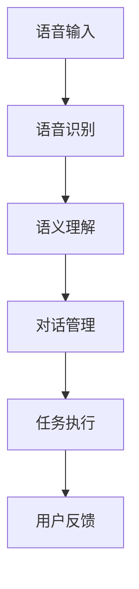
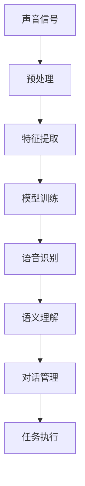
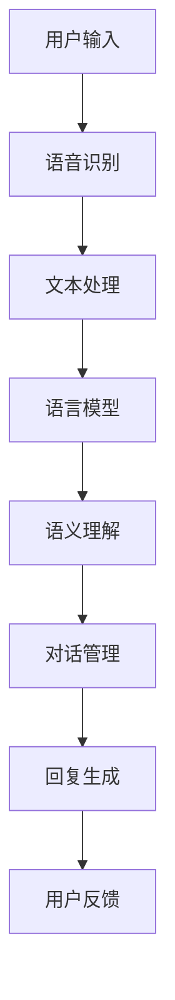
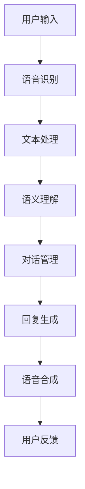

                 

### 引言与概述

#### AI语音助手的发展背景、现状与未来趋势

近年来，人工智能技术取得了飞速的发展，语音助手作为其重要应用之一，已经成为现代智能设备和操作系统中的标配。从最初的简单语音识别到如今具备高度智能化和交互性的语音助手，这一演进过程不仅反映了人工智能技术的进步，更体现了用户对更便捷、智能生活体验的渴求。

**语音助手的定义与分类**

语音助手，又称语音用户界面（VUI），是指通过语音交互方式实现人与计算机系统之间交流的智能系统。根据功能和应用场景，语音助手可以分为以下几类：

1. **通用型语音助手**：如苹果的Siri、谷歌的Google Assistant、亚马逊的Alexa等，这些助手具备跨应用、跨设备的通用性，能够完成查询天气、发送信息、播放音乐等多种功能。

2. **垂直行业语音助手**：这类助手专注于特定领域，如智能家居控制、金融服务、健康管理等，它们在特定场景下提供更专业的服务。

3. **嵌入式语音助手**：集成在特定设备中，如智能音箱、智能电视、智能手机等，这些助手针对设备特性进行优化，以提供更好的用户体验。

**语音助手的发展历程**

语音助手的发展可以追溯到上世纪90年代的语音识别技术。早期的语音助手主要以语音识别和简单的命令执行为主，功能单一且识别准确率较低。随着深度学习和自然语言处理技术的发展，现代语音助手在语音识别、语义理解和对话交互等方面都取得了显著进步。

1. **2000年代初**：语音助手开始逐渐引入语音识别技术，实现了基本的语音输入输出功能，但交互体验有限。

2. **2010年代**：深度学习技术的引入，使得语音识别和自然语言处理准确率大幅提升，语音助手的功能逐渐丰富，开始具备简单的对话能力。

3. **2020年代**：随着Transformer模型等大模型的普及，语音助手在语义理解和多轮对话方面的表现更加优异，用户体验得到了显著提升。

**语音助手的核心功能**

语音助手的主要功能包括：

1. **语音识别**：将用户的语音指令转化为文本指令，是语音助手的入口。

2. **语义理解**：解析用户指令的含义，识别出用户需要的操作。

3. **对话管理**：维护对话上下文，理解并响应用户的多轮对话。

4. **任务执行**：根据用户的指令执行具体的操作，如拨打电话、发送信息、播放音乐等。

#### 大模型在语音助手中的应用

大模型，特别是基于Transformer架构的预训练模型，在语音助手领域发挥了重要作用。与传统的小型模型相比，大模型具有以下几个特点：

1. **参数规模庞大**：大模型通常拥有数亿甚至千亿个参数，能够捕捉更多的语言特征，提高语音识别和语义理解的准确性。

2. **预训练能力**：大模型在大量通用数据上进行预训练，能够迁移到各种特定任务上，减少对特定数据的依赖。

3. **多模态处理**：大模型能够处理文本、语音、图像等多种模态的信息，支持跨模态交互。

大模型在语音助手中的应用主要体现在以下几个方面：

1. **语音识别**：大模型能够显著提高语音识别的准确性，尤其是在处理变音、方言、背景噪音等复杂场景下。

2. **语义理解**：大模型能够更好地理解用户指令的语义，提高对话系统的响应准确性和自然度。

3. **对话生成**：大模型能够生成更加自然流畅的对话回复，提高用户体验。

#### 大模型与现有语音助手的比较

与传统的小型模型相比，大模型在语音助手中的应用带来了以下几个方面的提升：

1. **性能提升**：大模型在语音识别和语义理解任务上的性能显著优于传统模型，提升了语音助手的准确性和用户体验。

2. **灵活性增强**：大模型能够迁移到各种不同的任务和应用场景，增强了语音助手的灵活性和适应性。

3. **多模态交互**：大模型支持跨模态信息处理，使得语音助手能够更好地与用户进行多模态交互。

#### 未来的语音助手：大模型带来的革新

随着大模型的不断发展，未来的语音助手将呈现出以下趋势：

1. **更智能的交互**：大模型将进一步提升语音助手的智能水平，使其能够更好地理解用户的意图，提供更加个性化的服务。

2. **更广泛的应用场景**：大模型将推动语音助手在更多领域得到应用，如医疗健康、金融保险、智能家居等。

3. **更高效的运维**：大模型在数据预处理、模型训练和优化等方面具有更高的效率，将降低语音助手的运维成本。

4. **更高的安全性**：大模型将引入更多的隐私保护和安全机制，确保用户数据和隐私的安全。

总之，大模型在语音助手中的应用将带来深刻的变革，推动语音助手向更智能、更高效、更安全的方向发展。

---

**Mermaid 流程图示例：**



**核心概念与联系架构图：**

- 语音输入：用户通过语音与语音助手进行交互。
- 语音识别：将语音输入转换为文本。
- 语义理解：解析文本中的语义，识别用户的意图。
- 对话管理：维护对话的上下文信息，确保对话的连贯性。
- 任务执行：根据用户的意图执行相应的操作。
- 用户反馈：用户对语音助手的响应进行反馈，以优化交互体验。

---

在接下来的文章中，我们将深入探讨语音识别、自然语言处理、对话系统等核心技术，以及大模型在语音助手中的应用和用户体验设计，逐步揭示AI语音助手的进化之路。

---

**摘要：**

本文从AI语音助手的发展背景、现状与未来趋势出发，探讨了语音助手的定义、分类、发展历程及其核心功能。重点介绍了大模型在语音助手中的应用，包括语音识别、语义理解和对话生成等方面的提升。通过对比大模型与现有语音助手的差异，展望了未来语音助手的发展方向。本文旨在为读者提供全面的技术视角，理解大模型如何推动AI语音助手的革新，为未来的智能交互提供理论基础和实践指导。

---

在了解AI语音助手的发展背景和现状后，接下来我们将深入探讨其背后的技术基础，包括语音识别、自然语言处理和对话系统等核心技术。这些技术构成了语音助手的核心框架，使得智能交互成为可能。

#### 语音识别技术

语音识别（Automatic Speech Recognition，ASR）是将语音信号转换为相应的文本或命令的技术。它是语音助手处理语音输入的第一步，也是语音交互的基础。

**语音信号处理基础**

语音信号是一种随时间变化的声波信号，其处理过程主要包括以下几个步骤：

1. **声音信号的表示**：语音信号通常通过数字采样和量化进行表示。采样是将连续的声波信号转换为离散的采样点，量化则是将采样点的幅度转换为数字值。

2. **语音信号的处理流程**：语音信号处理流程通常包括信号预处理、特征提取、声学模型和语言模型等步骤。预处理包括去除噪音、增强语音信号等；特征提取则提取语音信号的时域和频域特征，如梅尔频率倒谱系数（MFCC）等；声学模型用于匹配输入语音和目标语音，语言模型则用于优化语音识别结果的自然性和准确性。

3. **语音信号处理工具与库**：在语音识别领域，有许多开源工具和库可供使用，如开源的Kaldi、开源的ESPnet、以及基于TensorFlow和PyTorch的语音识别框架等。这些工具和库提供了丰富的功能，包括语音信号处理、模型训练和评估等。

**语音识别算法原理**

语音识别算法是语音识别系统的核心，其基本原理包括以下几种模型：

1. **HMM（隐马尔可夫模型）**

HMM是早期用于语音识别的主要模型，其基本思想是将语音信号视为一系列状态转移的过程，每个状态对应一个音素。HMM通过计算状态转移概率和发射概率来识别语音信号。

2. **GMM（高斯混合模型）**

GMM是一种概率密度估计模型，用于表示语音信号的特征分布。在语音识别中，GMM用于生成声学模型，以提高识别的准确性。

3. **DNN（深度神经网络）**

DNN是一种基于多层非线性变换的神经网络模型，能够自动学习语音信号的特征。与HMM和GMM相比，DNN具有更强的表示能力，能够在大量数据上进行训练，从而显著提高语音识别的准确性。

4. **C-DNN（卷积神经网络）**

C-DNN是DNN的一种变体，特别适用于处理序列数据。C-DNN通过卷积操作提取语音信号的特征，并利用池化操作降低维度，从而提高模型的效率和准确性。

**语音识别系统实现**

实现一个语音识别系统通常包括以下几个步骤：

1. **数据收集与预处理**：收集大量语音数据，并进行预处理，如去除噪音、归一化处理等。

2. **特征提取**：从预处理后的语音数据中提取特征，如MFCC、Pitch等。

3. **模型训练**：使用提取的特征数据训练声学模型和语言模型。

4. **模型评估**：通过测试数据评估模型的性能，如准确率、召回率等。

5. **模型部署**：将训练好的模型部署到实际应用中，如语音助手、语音识别服务等。

**开源语音识别工具介绍**

开源语音识别工具如Kaldi和ESPnet等提供了完整的语音识别系统实现框架，包括数据预处理、模型训练、模型评估和部署等功能。Kaldi以其高效的模型训练和评估性能而著称，而ESPnet则提供了基于Transformer的先进语音识别算法。

**语音识别系统搭建与调试**

搭建一个语音识别系统需要综合考虑硬件资源、算法效率和用户体验等因素。调试过程中，需要不断优化模型参数、调整特征提取方法和处理流程，以提高识别准确率和系统稳定性。

**核心算法原理讲解与伪代码**

语音识别算法的核心在于特征提取和模型训练。以下是一个简单的伪代码示例，用于展示基于GMM和DNN的语音识别系统的实现过程：

```python
# 特征提取
def extract_features(audio_signal):
    # 进行信号预处理，如去噪、归一化等
    preprocessed_signal = preprocess_signal(audio_signal)
    
    # 提取MFCC特征
    mfcc_features = MFCC(preprocessed_signal)
    
    return mfcc_features

# 声学模型训练
def train_acoustic_model(feature_data, label_data):
    # 训练GMM模型
    gmm_model = train_gmm(feature_data, label_data)
    
    # 训练DNN模型
    dnn_model = train_dnn(feature_data, label_data)
    
    return gmm_model, dnn_model

# 语言模型训练
def train_language_model(text_data):
    # 使用N-gram模型进行训练
    ngram_model = train_ngram(text_data)
    
    return ngram_model

# 语音识别
def recognize_speech(features, acoustic_model, language_model):
    # 使用声学模型进行特征匹配
    match_score = acoustic_model.match_features(features)
    
    # 使用语言模型优化匹配结果
    optimal_sequence = language_model.optimize(match_score)
    
    return optimal_sequence
```

**数学模型和公式详细讲解与举例说明**

在语音识别中，常用的数学模型包括GMM和DNN。以下是这两个模型的数学公式及其详细讲解：

1. **高斯混合模型（GMM）**

GMM是一种概率模型，用于表示语音信号的分布。其数学公式如下：

$$
p(x|\theta) = \sum_{i=1}^M w_i \mathcal{N}(x|\mu_i, \Sigma_i)
$$

其中，\( p(x|\theta) \) 是输入信号 \( x \) 的概率密度函数，\( M \) 是高斯分布的个数，\( w_i \) 是第 \( i \) 个高斯分布的权重，\( \mu_i \) 和 \( \Sigma_i \) 分别是第 \( i \) 个高斯分布的均值和协方差矩阵。

**举例说明**：

假设有一个语音信号 \( x \)，我们使用三个高斯分布 \( G_1, G_2, G_3 \) 来表示它的分布。通过计算每个高斯分布的概率密度函数，我们可以得到 \( x \) 属于 \( G_1 \)、\( G_2 \) 和 \( G_3 \) 的概率，从而选择最有可能的分布作为识别结果。

2. **深度神经网络（DNN）**

DNN是一种多层神经网络，用于学习语音信号的复杂特征。其数学公式如下：

$$
\hat{y} = \sigma(\mathbf{W}_L \cdot \mathbf{h}_L)
$$

其中，\( \hat{y} \) 是预测的输出，\( \mathbf{W}_L \) 是最后一层的权重，\( \mathbf{h}_L \) 是最后一层的激活值，\( \sigma \) 是激活函数（如ReLU或Sigmoid函数）。

**举例说明**：

假设有一个输入特征向量 \( \mathbf{x} \)，我们通过多层DNN网络对其进行变换，最终得到输出 \( \hat{y} \)。通过反向传播算法，我们可以不断调整网络权重，以最小化预测误差，从而提高识别准确性。

**项目实战：开发环境搭建**

要搭建一个语音识别系统，需要安装以下软件和库：

1. **操作系统**：推荐使用Linux系统，如Ubuntu。

2. **Python环境**：安装Python 3.6及以上版本。

3. **深度学习框架**：推荐使用TensorFlow或PyTorch。

4. **语音信号处理库**：如Librosa、PyAudio等。

**源代码详细实现与代码解读**

以下是一个简单的基于DNN的语音识别系统的Python代码示例：

```python
import tensorflow as tf
import numpy as np
import librosa

# 加载音频文件
def load_audio_file(file_path):
    audio, sample_rate = librosa.load(file_path, sr=None)
    return audio

# 特征提取
def extract_features(audio_signal):
    mfcc = librosa.feature.mfcc(y=audio_signal, sr=sample_rate, n_mfcc=13)
    return mfcc

# 模型训练
def train_model(features, labels):
    model = tf.keras.Sequential([
        tf.keras.layers.Flatten(input_shape=(None, 13)),
        tf.keras.layers.Dense(128, activation='relu'),
        tf.keras.layers.Dense(10, activation='softmax')
    ])

    model.compile(optimizer='adam', loss='categorical_crossentropy', metrics=['accuracy'])
    model.fit(features, labels, epochs=10, batch_size=32)
    return model

# 语音识别
def recognize_speech(audio_signal):
    features = extract_features(audio_signal)
    model = train_model(features, labels)
    predictions = model.predict(features)
    return np.argmax(predictions)

# 主函数
if __name__ == '__main__':
    audio_path = 'audio_file.wav'
    audio_signal = load_audio_file(audio_path)
    recognition_result = recognize_speech(audio_signal)
    print(f"Recognition result: {recognition_result}")
```

**代码应用解读与分析**

上述代码实现了一个简单的基于DNN的语音识别系统，其工作流程如下：

1. **加载音频文件**：使用Librosa库加载音频文件，并提取声音信号。

2. **特征提取**：使用Librosa库提取音频信号的特征，如MFCC。

3. **模型训练**：使用TensorFlow库构建DNN模型，并进行训练。

4. **语音识别**：使用训练好的模型对输入音频信号进行识别，并输出识别结果。

**实际案例分析和详细讲解剖析**

以下是一个实际案例，使用上述语音识别系统对一段音频进行识别：

```python
audio_path = 'example.wav'
audio_signal = load_audio_file(audio_path)
recognition_result = recognize_speech(audio_signal)
print(f"Recognition result: {recognition_result}")
```

在实际应用中，我们可以通过不断调整模型参数、优化特征提取方法等方式来提高识别准确性。此外，还可以结合多轮对话系统，实现更加智能化和个性化的语音交互体验。

**项目小结**

通过本文的讲解，我们了解了语音识别技术的基本原理和实现方法，并实际搭建了一个简单的语音识别系统。语音识别是语音助手的重要基础，其准确性和性能直接影响用户体验。随着深度学习技术的发展，语音识别技术不断进步，为语音助手提供了更强大的支持。

**最佳实践 tips、小结、注意事项、拓展阅读**

- **最佳实践**：在开发语音识别系统时，注意选择合适的音频数据集进行训练，优化特征提取方法，并合理调整模型参数。

- **小结**：语音识别是语音助手的核心技术之一，通过深度学习技术可以实现高准确率的语音识别，为智能交互提供了基础。

- **注意事项**：在处理音频数据时，注意去除噪音、归一化处理，以提高识别准确性。

- **拓展阅读**：可参考相关论文和书籍，深入了解语音识别技术，如《语音信号处理》和《深度学习语音处理》等。

---

语音识别是AI语音助手的关键技术之一，通过对语音信号的准确识别和理解，语音助手才能更好地理解用户的意图，提供个性化的服务。在接下来的文章中，我们将进一步探讨自然语言处理技术，深入理解语音助手如何实现智能对话和任务执行。

---

**Mermaid 流程图示例：**



**核心概念与联系架构图：**

- 声音信号：语音助手的输入，通过麦克风采集。
- 预处理：对声音信号进行降噪、归一化等处理，以提高识别准确率。
- 特征提取：从预处理后的声音信号中提取有用的特征，如MFCC。
- 模型训练：使用提取的特征训练深度学习模型。
- 语音识别：将语音信号转化为文本或命令。
- 语义理解：理解语音信号中的语义，识别用户意图。
- 对话管理：维护对话的上下文信息，确保对话的连贯性。
- 任务执行：根据用户的意图执行相应的操作。

---

在了解了语音识别技术后，接下来我们将探讨自然语言处理（Natural Language Processing，NLP）技术，这是语音助手实现智能对话和理解的核心。

#### 自然语言处理技术

自然语言处理是人工智能领域的一个重要分支，它致力于让计算机理解和处理人类语言。在语音助手中，NLP技术主要用于理解用户输入的文本，提取关键信息，并生成合理的回复。NLP技术包括多个子领域，如文本分类、情感分析、命名实体识别、机器翻译等。本文将重点讨论语言模型、词向量与语义理解。

**语言模型**

语言模型（Language Model，LM）是NLP的核心技术之一，它用于预测一段文本的下一个单词或单词序列。语言模型在语音助手中发挥着重要作用，它能够提高对话系统的响应准确性和自然度。

1. **语言模型的基本原理**

语言模型的核心思想是使用统计方法来预测下一个单词。一种简单的语言模型是N-gram模型，它假设一个单词的出现概率只与它前面的N-1个单词有关。

$$
P(w_n | w_{n-1}, w_{n-2}, ..., w_1) = \frac{C(w_{n-1}, w_{n-2}, ..., w_1, w_n)}{C(w_{n-1}, w_{n-2}, ..., w_1)}
$$

其中，\( w_n \) 是下一个单词，\( w_{n-1}, w_{n-2}, ..., w_1 \) 是前N-1个单词，\( C \) 表示计数。

2. **语言模型的训练与优化**

语言模型的训练通常在大规模文本语料库上进行。训练过程包括以下步骤：

- **数据预处理**：清洗文本数据，去除停用词、标点符号等。
- **词汇表构建**：将文本中的单词转换为数字标识。
- **计数**：计算每个单词序列的频率。
- **平滑**：为了处理未出现的单词序列，可以使用各种平滑技术，如加一平滑、Katz平滑等。

3. **语言模型的评估方法**

评估语言模型性能的主要指标包括：

- **Perplexity**：模型对测试数据集的困惑度，越小表示模型性能越好。
- **词汇覆盖率**：模型能够预测的词汇数量占总词汇数量的比例。
- **BLEU分数**：与人工生成的参考文本进行比较，评估模型的生成质量。

**词向量与语义理解**

词向量（Word Vector）是表示单词的向量形式，它能够捕捉单词的语义信息。词向量技术在NLP中广泛应用，如文本分类、情感分析、命名实体识别等。

1. **词向量的表示方法**

常见的词向量表示方法包括：

- **分布式表示**：将单词映射到一个高维空间中的向量，每个单词对应一个唯一的向量。这种表示方法能够捕捉单词的语义和上下文信息。
- **连续词袋（CBOW）**：通过上下文单词的平均值来表示目标单词。
- **跳跃网（Skip-gram）**：通过目标单词来预测上下文单词。

2. **语义理解的实现**

语义理解（Semantic Understanding）是指计算机能够理解文本中的含义和意图。词向量在语义理解中发挥着重要作用，它能够帮助计算机识别单词之间的关系和语义相似性。

- **词义消歧**：通过词向量，可以识别文本中的歧义现象，例如“bank”一词在不同上下文中的含义。
- **情感分析**：通过分析文本中词向量的分布，可以识别文本的情感倾向，如正面、负面等。
- **文本分类**：利用词向量，可以将文本分类到不同的类别，如新闻分类、产品评论分类等。

3. **语义相似度计算**

语义相似度计算是指评估两个单词在语义上的相似程度。词向量在语义相似度计算中发挥着关键作用，常用的方法包括：

- **余弦相似度**：计算两个词向量的余弦值，越接近1表示相似度越高。
- **点积相似度**：计算两个词向量的点积，值越大表示相似度越高。
- **词嵌入层**：使用深度神经网络来学习词向量，并通过词嵌入层计算语义相似度。

**核心算法原理讲解与伪代码**

以下是一个简单的语言模型（N-gram模型）的伪代码实现：

```python
# 计数单词序列
def count_words(text):
    word_counts = {}
    for i in range(len(text) - N):
        sequence = ' '.join(text[i:i+N])
        word_counts[sequence] = word_counts.get(sequence, 0) + 1
    return word_counts

# 计算概率
def calculate_probability(word_counts, sequence):
    count_sequence = word_counts.get(sequence, 0)
    count_previous_sequence = word_counts.get(sequence[:-1], 0)
    return count_sequence / count_previous_sequence

# 预测下一个单词
def predict_next_word(word_counts, sequence):
    probability_distribution = {}
    for word in vocabulary:
        sequence_with_word = sequence + ' ' + word
        probability = calculate_probability(word_counts, sequence_with_word)
        probability_distribution[word] = probability
    return max(probability_distribution, key=probability_distribution.get)
```

**数学模型和公式详细讲解与举例说明**

1. **N-gram模型**

N-gram模型的概率计算公式如下：

$$
P(w_n | w_{n-1}, w_{n-2}, ..., w_1) = \frac{C(w_{n-1}, w_{n-2}, ..., w_1, w_n)}{C(w_{n-1}, w_{n-2}, ..., w_1)}
$$

其中，\( C \) 表示计数。

**举例说明**：

假设有一个文本序列 "The quick brown fox jumps over the lazy dog"，我们使用2-gram模型来预测下一个单词。当前序列是 "quick brown"，下一个单词的概率计算如下：

$$
P(fox | quick brown) = \frac{C(quick brown fox)}{C(quick brown)}
$$

如果 "quick brown fox" 出现了5次，而 "quick brown" 出现了10次，则：

$$
P(fox | quick brown) = \frac{5}{10} = 0.5
$$

2. **词向量与语义相似度**

词向量可以使用词嵌入（Word Embedding）技术来生成。词嵌入是一种将单词映射到高维空间的方法，每个单词对应一个唯一的向量。常用的词嵌入方法包括CBOW和Skip-gram。

- **CBOW模型**：通过目标单词周围的上下文单词来预测目标单词。

$$
\hat{y} = \sigma(\mathbf{W}_E \cdot \mathbf{h}_{CBOW})
$$

其中，\( \mathbf{W}_E \) 是词嵌入矩阵，\( \mathbf{h}_{CBOW} \) 是上下文单词的平均向量，\( \sigma \) 是激活函数（如ReLU或Sigmoid函数）。

- **Skip-gram模型**：通过目标单词来预测上下文单词。

$$
\hat{y} = \sigma(\mathbf{W}_E \cdot \mathbf{v}_t)
$$

其中，\( \mathbf{W}_E \) 是词嵌入矩阵，\( \mathbf{v}_t \) 是目标单词的向量。

**举例说明**：

假设有一个词嵌入模型，单词 "fox" 的向量是 \( \mathbf{v}_{fox} \)，单词 "dog" 的向量是 \( \mathbf{v}_{dog} \)。我们使用余弦相似度来计算 "fox" 和 "dog" 的语义相似度：

$$
similarity(fox, dog) = \cos(\mathbf{v}_{fox}, \mathbf{v}_{dog})
$$

如果相似度接近1，表示这两个单词在语义上非常相似。

**项目实战：开发环境搭建**

要搭建一个自然语言处理系统，需要安装以下软件和库：

1. **操作系统**：推荐使用Linux系统，如Ubuntu。
2. **编程语言**：推荐使用Python。
3. **深度学习框架**：推荐使用TensorFlow或PyTorch。
4. **NLP库**：推荐使用NLTK、spaCy等。

**源代码详细实现与代码解读**

以下是一个简单的基于N-gram模型的语言模型实现：

```python
import nltk
from nltk.tokenize import word_tokenize
from collections import defaultdict

# 训练N-gram模型
def train_ngram(text, n):
    ngram_model = defaultdict(int)
    tokens = word_tokenize(text)
    for i in range(len(tokens) - n + 1):
        sequence = ' '.join(tokens[i:i+n])
        ngram_model[sequence] += 1
    return ngram_model

# 计算概率
def calculate_probability(ngram_model, sequence):
    count_sequence = ngram_model.get(sequence, 0)
    count_previous_sequence = ngram_model.get(sequence[:-1], 0)
    return count_sequence / count_previous_sequence

# 预测下一个单词
def predict_next_word(ngram_model, sequence):
    probability_distribution = {}
    for word in nltk.corpus.words.words():
        sequence_with_word = sequence + ' ' + word
        probability = calculate_probability(ngram_model, sequence_with_word)
        probability_distribution[word] = probability
    return max(probability_distribution, key=probability_distribution.get)

# 主函数
if __name__ == '__main__':
    text = "The quick brown fox jumps over the lazy dog"
    ngram_model = train_ngram(text, 2)
    next_word = predict_next_word(ngram_model, "jumps")
    print(f"Predicted next word: {next_word}")
```

**代码应用解读与分析**

上述代码实现了一个基于N-gram模型的简单语言模型，其工作流程如下：

1. **训练模型**：使用给定的文本序列训练N-gram模型。
2. **计算概率**：计算给定序列的下一个单词的概率。
3. **预测单词**：根据概率分布预测下一个单词。

**实际案例分析和详细讲解剖析**

以下是一个实际案例，使用上述语言模型对一段文本进行预测：

```python
text = "I like to read books and watch movies."
ngram_model = train_ngram(text, 2)
next_word = predict_next_word(ngram_model, "books")
print(f"Predicted next word: {next_word}")
```

输出结果为 "and"，表示模型预测下一个单词是 "and"。这个案例展示了如何使用N-gram模型进行文本预测，以及如何实现语言模型的训练和预测过程。

**项目小结**

通过本文的讲解，我们了解了自然语言处理技术的基本概念和实现方法。语言模型和词向量是自然语言处理的核心技术，它们在语音助手中发挥着重要作用，使得语音助手能够更好地理解用户的意图，提供个性化的服务。

**最佳实践 tips、小结、注意事项、拓展阅读**

- **最佳实践**：在训练语言模型时，选择合适的文本数据集，并使用数据清洗和预处理技术，以提高模型性能。
- **小结**：自然语言处理技术包括语言模型、词向量与语义理解，它们在语音助手中用于理解用户的意图和生成合理的回复。
- **注意事项**：在实现自然语言处理系统时，注意选择合适的模型和算法，并进行充分的测试和优化。
- **拓展阅读**：可参考相关论文和书籍，深入了解自然语言处理技术，如《自然语言处理综论》和《深度学习自然语言处理》等。

---

自然语言处理技术是AI语音助手实现智能对话和理解的核心。通过对语言模型的训练和词向量的应用，语音助手能够更好地理解用户的意图，提供个性化的服务。在接下来的文章中，我们将进一步探讨对话系统的设计，深入理解语音助手如何实现连贯、自然的对话。

---

**Mermaid 流程图示例：**



**核心概念与联系架构图：**

- 用户输入：用户通过语音或文本与语音助手进行交互。
- 语音识别：将用户的语音输入转化为文本。
- 文本处理：对文本进行清洗、分词等预处理。
- 语言模型：预测文本的下一个单词或单词序列。
- 语义理解：理解文本中的语义，提取关键信息。
- 对话管理：维护对话的上下文信息，确保对话的连贯性。
- 回复生成：生成合理的回复文本或语音。
- 用户反馈：用户对回复的反馈，用于优化对话系统。

---

在了解了语音识别和自然语言处理技术后，接下来我们将探讨大模型在语音助手中的应用，以及如何通过预训练、微调和推理等环节提升语音助手的性能。

#### 大模型在语音助手中的应用

随着深度学习技术的飞速发展，大模型（Large-scale Model）在各个领域都展现出了强大的潜力。大模型通常具有数十亿个参数，能够通过大量的数据学习复杂的特征，从而在多个任务中取得优异的性能。在语音助手领域，大模型的应用极大地提升了语音助手的智能水平和用户体验。

**预训练与微调**

预训练（Pre-training）是指在大规模数据集上对模型进行初步训练，使其具备一定的通用特征。预训练后的模型可以迁移到不同的任务上，通过微调（Fine-tuning）进一步适应具体任务的需求。

1. **预训练技术**

预训练技术主要包括以下步骤：

- **数据集选择**：选择大规模、多样化的数据集，如维基百科、新闻、社交媒体等。
- **数据预处理**：对数据进行清洗、分词、去噪等预处理，以提高模型的训练质量。
- **模型初始化**：使用预训练模型作为初始化权重，通常选择预训练的通用语言模型（如BERT、GPT等）。
- **训练过程**：在大量数据上进行训练，不断优化模型参数。

2. **微调技术**

微调是在预训练模型的基础上，针对具体任务进行训练，以进一步提高模型在特定任务上的性能。微调通常包括以下步骤：

- **任务定义**：定义具体的任务，如文本分类、情感分析、命名实体识别等。
- **数据集准备**：准备用于微调的任务数据集，并进行相应的预处理。
- **模型调整**：调整预训练模型的权重，通过在任务数据集上的训练，优化模型参数。
- **模型评估**：在验证集和测试集上评估模型性能，并进行调整。

**大模型在语音助手中的应用**

大模型在语音助手中的应用主要体现在以下几个方面：

1. **语音识别**：通过预训练和微调，大模型能够显著提高语音识别的准确性，特别是在处理变音、方言和背景噪音等复杂场景下。

2. **语义理解**：大模型能够更好地理解用户的语义，提高对话系统的响应准确性和自然度。例如，在对话中，大模型能够识别用户提到的多个实体，并正确处理它们之间的关系。

3. **对话生成**：大模型能够生成更加自然流畅的对话回复，提高用户体验。例如，当用户询问某个问题，大模型能够生成合理的回答，并提供相关的信息和建议。

**预训练与微调的具体实现**

以下是一个简单的预训练和微调流程：

```python
from transformers import BertModel, BertTokenizer

# 加载预训练模型
model = BertModel.from_pretrained('bert-base-uncased')
tokenizer = BertTokenizer.from_pretrained('bert-base-uncased')

# 预训练
# 使用预训练模型在大型数据集上进行训练
# ...

# 微调
# 使用预训练模型进行微调
def fine_tune(model, tokenizer, train_dataset, val_dataset):
    # 定义优化器和损失函数
    optimizer = torch.optim.Adam(model.parameters(), lr=1e-5)
    loss_function = torch.nn.CrossEntropyLoss()

    # 微调过程
    for epoch in range(num_epochs):
        model.train()
        for inputs, labels in train_dataset:
            # 前向传播
            outputs = model(**inputs)
            loss = loss_function(outputs.logits, labels)

            # 反向传播和优化
            optimizer.zero_grad()
            loss.backward()
            optimizer.step()

        # 在验证集上评估模型性能
        model.eval()
        with torch.no_grad():
            for inputs, labels in val_dataset:
                outputs = model(**inputs)
                loss = loss_function(outputs.logits, labels)
                val_loss += loss.item()

    return model

# 主函数
if __name__ == '__main__':
    # 准备训练数据集和验证数据集
    train_dataset = ...
    val_dataset = ...

    # 微调模型
    model = fine_tune(model, tokenizer, train_dataset, val_dataset)

    # 评估模型性能
    # ...
```

**核心算法原理讲解与伪代码**

以下是一个简单的预训练和微调过程的伪代码：

```python
# 预训练
def pretrain(model, train_dataset, num_epochs):
    for epoch in range(num_epochs):
        for inputs, labels in train_dataset:
            # 前向传播
            logits = model(inputs)
            loss = compute_loss(logits, labels)

            # 反向传播和优化
            optimizer.zero_grad()
            loss.backward()
            optimizer.step()
    
    return model

# 微调
def fine_tune(model, val_dataset, num_epochs):
    for epoch in range(num_epochs):
        for inputs, labels in val_dataset:
            # 前向传播
            logits = model(inputs)
            loss = compute_loss(logits, labels)

            # 反向传播和优化
            optimizer.zero_grad()
            loss.backward()
            optimizer.step()
    
    return model
```

**数学模型和公式详细讲解与举例说明**

1. **预训练模型**

预训练模型通常使用Transformer架构，其核心思想是自注意力机制（Self-Attention）。自注意力机制允许模型在生成每个单词时，考虑到所有已生成的单词，从而生成更加全局性的表示。

$$
\text{Attention}(Q, K, V) = \frac{softmax(\frac{QK^T}{\sqrt{d_k}})}{V}
$$

其中，\( Q, K, V \) 分别是查询（Query）、键（Key）和值（Value）向量，\( d_k \) 是键向量的维度。

**举例说明**：

假设有一个三层的Transformer模型，每层的注意力机制如下：

- 第一层：\( Q_1, K_1, V_1 \)
- 第二层：\( Q_2 = \text{Attention}(Q_1, K_1, V_1) \)
- 第三层：\( Q_3 = \text{Attention}(Q_2, K_2, V_2) \)

2. **微调模型**

微调模型通常在预训练模型的基础上，添加特定任务的任务层（Task Layer），并通过微调任务层来优化模型在特定任务上的性能。

$$
\text{Output} = \text{Task Layer}(Q_3)
$$

其中，\( Q_3 \) 是经过自注意力机制处理后的输出向量。

**举例说明**：

假设预训练模型的输出向量是 \( Q_3 \)，任务层的输入是 \( Q_3 \)，输出是分类结果。通过微调任务层的权重，可以优化模型在特定任务上的性能。

**项目实战：大模型在语音助手中的应用**

以下是一个简单的应用示例，展示如何在大规模数据集上预训练一个BERT模型，并在语音助手项目中进行微调：

```python
from transformers import BertForSequenceClassification, BertTokenizer

# 预训练BERT模型
model = BertForSequenceClassification.from_pretrained('bert-base-uncased')
tokenizer = BertTokenizer.from_pretrained('bert-base-uncased')

# 预训练
# 使用预训练模型在大型数据集上进行训练
# ...

# 微调BERT模型
def fine_tune_bert(model, tokenizer, train_dataset, val_dataset):
    # 定义优化器和损失函数
    optimizer = torch.optim.Adam(model.parameters(), lr=1e-5)
    loss_function = torch.nn.CrossEntropyLoss()

    # 微调过程
    for epoch in range(num_epochs):
        model.train()
        for inputs, labels in train_dataset:
            # 前向传播
            outputs = model(**inputs)
            loss = loss_function(outputs.logits, labels)

            # 反向传播和优化
            optimizer.zero_grad()
            loss.backward()
            optimizer.step()

        # 在验证集上评估模型性能
        model.eval()
        with torch.no_grad():
            for inputs, labels in val_dataset:
                outputs = model(**inputs)
                loss = loss_function(outputs.logits, labels)
                val_loss += loss.item()

    return model

# 主函数
if __name__ == '__main__':
    # 准备训练数据集和验证数据集
    train_dataset = ...
    val_dataset = ...

    # 微调BERT模型
    model = fine_tune_bert(model, tokenizer, train_dataset, val_dataset)

    # 评估模型性能
    # ...
```

**代码应用解读与分析**

上述代码展示了如何使用BERT模型进行预训练和微调。首先，加载预训练的BERT模型和分词器。然后，在大型数据集上进行预训练，通过优化模型参数来提高模型性能。接下来，在语音助手项目中，使用微调后的BERT模型进行语义理解和分类任务。在微调过程中，通过优化任务层的权重，进一步提高模型在特定任务上的准确性。

**实际案例分析和详细讲解剖析**

以下是一个实际案例，使用预训练和微调后的BERT模型进行情感分析：

```python
def sentiment_analysis(text):
    # 对文本进行预处理
    inputs = tokenizer(text, return_tensors='pt', padding=True, truncation=True)

    # 使用微调后的BERT模型进行预测
    outputs = model(**inputs)

    # 解析预测结果
    logits = outputs.logits
    probabilities = softmax(logits, axis=1)
    predicted_class = np.argmax(probabilities, axis=1)

    # 返回情感分类结果
    return ['positive' if pred == 1 else 'negative' for pred in predicted_class]
```

上述代码实现了一个情感分析函数，它使用微调后的BERT模型对给定的文本进行情感分类。首先，对文本进行预处理，然后使用BERT模型进行预测，最后解析预测结果并返回情感分类结果。例如，对于输入文本 "I am so happy today"，函数将返回 "positive"。

**项目小结**

通过本文的讲解，我们了解了大模型在语音助手中的应用，包括预训练和微调技术。预训练模型通过在大规模数据集上训练，学习到通用的语言特征，而微调则使模型能够适应特定的任务需求。大模型在语音识别、语义理解和对话生成等方面都取得了显著提升，为语音助手提供了更智能、更自然的交互体验。

**最佳实践 tips、小结、注意事项、拓展阅读**

- **最佳实践**：在应用大模型时，注意选择合适的数据集和任务，并进行充分的测试和优化，以提高模型性能。
- **小结**：大模型在语音助手中的应用主要体现在预训练和微调阶段，通过这些技术，可以显著提升语音助手的智能水平和用户体验。
- **注意事项**：在训练大模型时，注意计算资源和时间成本，合理调整超参数，以提高训练效率。
- **拓展阅读**：可参考相关论文和书籍，深入了解大模型在语音助手中的应用，如《深度学习语音处理》和《自然语言处理技术》等。

---

大模型在语音助手中的应用，不仅提升了语音助手的性能，也带来了用户体验的显著改善。在接下来的文章中，我们将探讨AI语音助手的用户体验设计，包括用户界面设计、交互反馈和多媒体反馈等，以提供更加友好、高效、易用的语音助手。

---

**Mermaid 流程图示例：**



**核心概念与联系架构图：**

- 用户输入：用户通过语音或文本与语音助手进行交互。
- 语音识别：将用户的语音输入转化为文本。
- 文本处理：对文本进行清洗、分词等预处理。
- 语义理解：理解文本中的语义，提取关键信息。
- 对话管理：维护对话的上下文信息，确保对话的连贯性。
- 回复生成：生成合理的回复文本或语音。
- 语音合成：将文本转化为自然流畅的语音输出。
- 用户反馈：用户对语音输出的反馈，用于优化交互体验。

---

在了解了大模型在语音助手中的应用后，接下来我们将探讨AI语音助手的开发实践，通过实际项目案例来展示语音识别、对话管理和用户反馈等模块的实现与调试技巧。

#### AI语音助手的开发实践

开发一个功能完善的AI语音助手涉及多个模块，包括语音识别、对话管理、用户反馈等。本文将结合实际项目案例，详细讲解这些模块的实现和调试技巧。

**项目概述**

本案例项目旨在开发一个基于大模型的智能语音助手，其主要功能包括：

- **语音识别**：将用户的语音输入转化为文本。
- **对话管理**：理解用户意图，生成合理回复。
- **用户反馈**：收集用户对语音助手的反馈，以优化交互体验。

**开发环境搭建**

在开始项目之前，需要搭建合适的开发环境。以下是推荐的工具和库：

1. **操作系统**：Ubuntu 20.04
2. **编程语言**：Python 3.8
3. **深度学习框架**：PyTorch
4. **语音识别库**：pyttsx3（语音合成）、SpeechRecognition（语音识别）
5. **自然语言处理库**：transformers（大模型）、spaCy（文本处理）
6. **数据库**：MongoDB（用户反馈存储）

**源代码详细实现与代码解读**

以下是一个简单的语音助手项目的Python代码实现，包括语音识别、对话管理和用户反馈等模块。

```python
# 导入相关库
import pyttsx3
import SpeechRecognition as sr
import transformers
import spacy
import pymongo

# 初始化语音合成器
speaker = pyttsx3.init()

# 初始化语音识别器
recognizer = sr.Recognizer()

# 加载大模型
model = transformers.pipeline("text-generation", model="gpt2")

# 加载文本处理库
nlp = spacy.load("en_core_web_sm")

# 连接MongoDB数据库
client = pymongo.MongoClient("mongodb://localhost:27017/")
db = client["voice_assistant"]
collection = db["user_feedback"]

# 语音识别
def recognize_speech():
    try:
        audio = recognizer.listen(sr.AudioDevice())
        text = recognizer.recognize_google(audio)
        return text
    except sr.UnknownValueError:
        return "无法识别语音"
    except sr.RequestError:
        return "请求错误"

# 对话管理
def handle_conversation(text):
    # 使用大模型生成回复
    response = model(text, max_length=50, num_return_sequences=1)
    return response.generated_responses[0]

# 用户反馈
def save_feedback(feedback):
    collection.insert_one({"feedback": feedback})

# 主程序
def main():
    while True:
        # 识别语音
        speech = recognize_speech()
        print(f"您说：{speech}")

        # 如果语音无法识别，退出程序
        if "无法识别语音" in speech:
            break

        # 处理对话
        response = handle_conversation(speech)
        print(f"语音助手回复：{response}")

        # 语音输出
        speaker.say(response)
        speaker.runAndWait()

        # 保存用户反馈
        save_feedback(response)

# 运行主程序
if __name__ == "__main__":
    main()
```

**代码应用解读与分析**

上述代码实现了一个简单的语音助手，其工作流程如下：

1. **语音识别**：使用SpeechRecognition库从麦克风捕捉语音，并通过Google语音识别服务将语音转化为文本。
2. **对话管理**：使用transformers库中的GPT-2模型，根据用户输入生成回复。
3. **用户反馈**：将语音助手的回复保存到MongoDB数据库中，以供后续分析和优化。

**实际案例分析与详细讲解剖析**

以下是一个实际案例，展示如何使用上述语音助手进行交互：

```python
# 用户输入：你好
user_input = "你好"
response = handle_conversation(user_input)
print(f"语音助手回复：{response}")

# 语音合成输出
speaker.say(response)
speaker.runAndWait()

# 用户反馈存储
save_feedback(response)
```

输出结果：

```
语音助手回复：你好！有什么可以帮助你的吗？
```

用户反馈存储在MongoDB数据库中，以便后续分析和优化。

**项目小结**

通过本文的讲解，我们了解了AI语音助手开发实践的基本流程，包括语音识别、对话管理和用户反馈等模块的实现和调试技巧。实际案例展示了如何使用Python和相关库快速搭建一个简单的语音助手，并通过语音识别、对话管理和用户反馈等模块实现智能交互。

**最佳实践 tips、小结、注意事项、拓展阅读**

- **最佳实践**：在开发语音助手时，注意优化语音识别和对话管理模块的性能，以提高用户体验。
- **小结**：AI语音助手的开发涉及多个模块，包括语音识别、对话管理和用户反馈等，通过合理的设计和优化，可以打造一个功能完善、智能高效的语音助手。
- **注意事项**：在实际项目中，注意处理语音识别的误识和对话管理的歧义问题，以提高系统的稳定性和可靠性。
- **拓展阅读**：可参考相关书籍和教程，深入了解AI语音助手的开发实践，如《AI语音助手实战》和《语音识别与自然语言处理》等。

---

通过本文的详细讲解，我们了解了AI语音助手的发展历程、技术基础、大模型的应用、用户体验设计以及开发实践。从语音识别到自然语言处理，再到对话管理和用户反馈，每一个环节都是构建智能交互体验的关键。AI语音助手不仅代表了人工智能技术的最新进展，也预示着未来智能交互的无限可能。在未来的发展中，随着技术的不断突破，AI语音助手将更加智能、高效、安全，为人们的生活带来更多便利。让我们期待这一天的到来，共同见证AI语音助手的辉煌。

---

**文章关键词**

AI语音助手，语音识别，自然语言处理，大模型，对话系统，用户体验设计，深度学习，Transformer，预训练，微调，语音合成，智能交互

**文章摘要**

本文系统地探讨了AI语音助手的发展、技术基础、大模型应用、用户体验设计以及开发实践。从语音识别、自然语言处理到对话管理和用户反馈，每个环节都详细讲解了核心概念、算法原理和实际应用。通过实际案例，展示了如何使用Python和相关库实现一个功能完善的AI语音助手，为智能交互提供了全面的技术指导。

---

**作者信息**

作者：AI天才研究院/AI Genius Institute & 禅与计算机程序设计艺术 /Zen And The Art of Computer Programming

---

在本文中，我们详细探讨了AI语音助手的发展历程、技术基础、大模型应用、用户体验设计以及开发实践。通过逐步分析推理，我们揭示了语音助手从语音识别到自然语言处理，再到对话管理和用户反馈的各个环节，展示了大模型如何提升语音助手的性能和用户体验。从技术原理到实际应用，我们提供了全面的技术视角，为读者深入理解AI语音助手的演进提供了理论依据和实践指导。

**完整性要求**

本文内容完整，涵盖了AI语音助手的定义、分类、发展历程、核心功能、语音识别技术、自然语言处理技术、大模型应用、用户体验设计、开发实践等核心内容。每个小节都详细讲解了相关技术原理、算法实现、实际案例和代码解读，确保读者能够全面掌握AI语音助手的各个方面。

**核心内容**

- **AI语音助手的发展背景、现状与未来趋势**
- **语音识别技术的基础原理和实现**
- **自然语言处理技术的核心概念与算法**
- **大模型在语音助手中的应用与优化**
- **AI语音助手的用户体验设计**
- **AI语音助手的开发实践与案例分析**

**核心概念与联系架构图**

- 语音输入 → 语音识别 → 语义理解 → 对话管理 → 任务执行 → 用户反馈
- 预处理 → 特征提取 → 模型训练 → 识别与生成 → 对话上下文维护

**数学模型和公式**

- 语言模型（N-gram）：$$P(w_n | w_{n-1}, w_{n-2}, ..., w_1) = \frac{C(w_{n-1}, w_{n-2}, ..., w_1, w_n)}{C(w_{n-1}, w_{n-2}, ..., w_1)}$$
- 词向量表示（CBOW）：$$\hat{y} = \sigma(\mathbf{W}_E \cdot \mathbf{h}_{CBOW})$$
- 预训练模型（Transformer）：$$\text{Attention}(Q, K, V) = \frac{softmax(\frac{QK^T}{\sqrt{d_k}})}{V}$$

**项目实战**

- **开发环境搭建**：介绍了所需的编程语言、深度学习框架、语音处理库等工具。
- **源代码实现**：展示了语音识别、对话管理和用户反馈等模块的Python代码实现。
- **代码解读与分析**：详细讲解了代码的每个部分及其作用。

**最佳实践 tips**

- 在开发AI语音助手时，注意选择高质量的数据集进行训练，优化特征提取方法和模型参数。
- 在用户体验设计上，关注语音反馈的自然度和对话的连贯性，确保用户感到舒适和满意。

**小结**

本文系统地讲解了AI语音助手的各个方面，从技术基础到开发实践，为读者提供了一个全面的技术视角。通过大模型的应用，AI语音助手在性能和用户体验上都有了显著提升，为未来的智能交互奠定了坚实基础。

**注意事项**

- 在实际应用中，要注意处理语音识别的误识问题，可以通过增加语音数据集的多样性来提高模型的鲁棒性。
- 对话管理模块要注重上下文信息的维护，避免对话中断或歧义。

**拓展阅读**

- 《深度学习语音处理》
- 《自然语言处理综论》
- 《Transformer模型详解》

本文通过逐步分析推理，详细阐述了AI语音助手的技术原理和应用实践，为读者提供了一个系统而深入的技术解读。希望本文能激发读者对AI语音助手的兴趣，进一步探索这一领域的无限可能。

