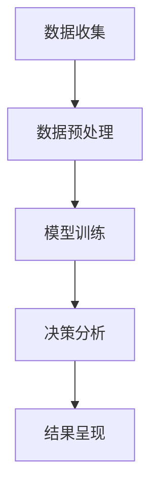

                 


### 1.2 AI辅助决策系统：提升政府和企业管理效率

#### 关键词：
- 人工智能
- 辅助决策系统
- 政府管理
- 企业管理
- 效率提升

#### 摘要：
本文深入探讨了AI辅助决策系统的概念、架构和应用，特别是在政府和企业管理中的重要性。文章首先概述了人工智能和决策理论的基本原理，然后详细分析了AI辅助决策系统的核心算法和应用场景。通过实际案例研究和项目实战，本文展示了AI辅助决策系统在提高政府和企业决策效率方面的实际效果和潜力。

### 引言

#### 1.2.1 AI与决策系统概述

人工智能（AI）技术的发展，不仅改变了我们的生活方式，也在决策领域带来了深刻的变革。AI辅助决策系统（AIDSS）利用机器学习、深度学习、自然语言处理等技术，从大量数据中提取有价值的信息，为决策者提供科学的依据和支持。

在政府和企业管理中，决策的正确与否直接关系到资源的合理配置、政策的有效执行和企业竞争力。传统的决策过程往往依赖于经验和直觉，存在主观性强、效率低下等问题。而AI辅助决策系统通过数据驱动的方式，可以更客观、准确地辅助决策，从而提升决策质量和效率。

#### 1.2.2 本书结构

本文将分以下几个部分进行探讨：

1. **AI基础与辅助决策理论**：介绍人工智能的基本概念、决策理论基础，以及AI辅助决策系统的架构与设计。
2. **AI辅助决策算法**：详细讲解监督学习、非监督学习和强化学习等算法在决策系统中的应用。
3. **政府和企业管理中的AI辅助决策应用**：分析AI辅助决策系统在政府和企业决策支持系统中的应用，包括数据收集、处理和决策分析。
4. **AI辅助决策系统的实现与优化**：探讨数据预处理、模型训练与评估、系统部署与运维等实现与优化方法。
5. **案例研究**：通过具体案例，展示AI辅助决策系统在实际项目中的应用效果。
6. **结论与展望**：总结本文的主要观点，并对未来AI辅助决策系统的发展进行展望。

### AI基础与辅助决策理论

#### 2.1 人工智能的基本概念

人工智能（Artificial Intelligence, AI）是计算机科学的一个分支，旨在研究、开发和应用使计算机能够模拟、扩展和增强人类智能的理论、算法和技术。AI的核心目标是使计算机系统能够自动执行复杂任务，如感知、学习、推理、规划和问题解决。

#### 2.1.1 人工智能的发展历程

人工智能的概念最早可以追溯到20世纪50年代。当时，科学家们开始尝试通过编程实现简单的智能行为，如逻辑推理和问题解决。这一时期被称为“人工智能的黄金时代”。然而，由于技术的限制，这一时期的AI研究并没有取得实质性的突破。

20世纪80年代，专家系统的兴起为人工智能带来了新的生机。专家系统是一种基于知识表示和推理的AI系统，能够模拟专家的决策过程。然而，专家系统在处理复杂问题和实时应用方面仍存在局限。

21世纪初，随着计算能力的提升和大数据技术的发展，机器学习、深度学习等新兴技术开始崭露头角。这些技术利用海量数据和强大的计算能力，使得计算机能够从数据中学习、自适应和做出预测。这一时期的AI被认为是“强人工智能”的开始。

#### 2.1.2 人工智能的核心技术

- **机器学习**：机器学习（Machine Learning, ML）是一种通过数据驱动的方式使计算机自动改进性能的技术。机器学习可以分为监督学习、非监督学习和强化学习。
- **深度学习**：深度学习（Deep Learning, DL）是机器学习的一个分支，通过构建深层次的神经网络来模拟人脑的决策过程。深度学习在图像识别、语音识别和自然语言处理等领域取得了显著成就。
- **自然语言处理**：自然语言处理（Natural Language Processing, NLP）是人工智能的一个子领域，旨在使计算机理解和处理人类自然语言。NLP技术在自动翻译、文本分析、智能客服等领域有广泛应用。

#### 2.2 决策理论基础

决策理论是研究决策过程、决策模型和决策方法的科学。在政府和企业管理中，决策是核心活动之一。有效的决策可以优化资源配置、提高管理效率，从而实现组织目标。

#### 2.2.1 决策的基本概念

决策（Decision Making）是指从多个可行方案中选择一个最优方案的过程。决策过程通常包括以下步骤：

1. **问题识别**：识别需要解决的问题或机会。
2. **信息收集**：收集与问题相关的信息。
3. **方案生成**：生成多个可行的解决方案。
4. **方案评估**：评估每个方案的优缺点。
5. **方案选择**：选择一个最优或次优方案。
6. **方案实施**：实施选定的方案。
7. **效果评估**：评估方案实施的效果。

#### 2.2.2 决策模型与方法

- **线性规划**：线性规划（Linear Programming, LP）是一种数学模型，用于在满足一定约束条件下，求解目标函数的最大值或最小值。线性规划广泛应用于资源分配、生产计划等问题。
- **多目标决策**：多目标决策（Multi-Objective Decision Making, MODM）考虑多个目标之间的冲突，通过权衡不同目标，找到一个或多个满意的解。
- **决策树**：决策树（Decision Tree）是一种图形化模型，用于表示决策过程和决策结果。决策树通过一系列的选择和分支，将问题分解为子问题，并最终得到决策结果。
- **贝叶斯决策**：贝叶斯决策（Bayesian Decision Making）基于贝叶斯定理，通过计算每个方案的后果概率，选择期望值最大的方案。

#### 2.3 AI辅助决策系统的架构与设计

AI辅助决策系统通常包括以下几个关键组成部分：

1. **数据收集**：数据是决策的基础，AI辅助决策系统需要从各种来源收集数据，如传感器、互联网、数据库等。
2. **数据预处理**：收集到的数据通常存在噪声、缺失和不一致性等问题，需要进行预处理，包括数据清洗、集成和变换。
3. **模型训练**：使用机器学习算法对预处理后的数据集进行训练，生成决策模型。训练过程包括特征选择、模型选择和参数优化等。
4. **决策分析**：使用训练好的模型对实际问题进行分析和预测，提供决策支持。
5. **结果呈现**：将分析结果以可视化或其他形式呈现给决策者，帮助其做出决策。

#### Mermaid 流程图：



#### 2.3.1 系统架构设计

AI辅助决策系统的架构设计需要考虑以下几个方面：

- **模块化设计**：将系统划分为多个模块，每个模块负责不同的功能，如数据收集、数据预处理、模型训练等。
- **可扩展性**：系统能够随着数据量和需求的变化，灵活扩展功能。
- **分布式计算**：利用分布式计算技术，提高系统的处理能力和响应速度。
- **安全性与隐私保护**：确保数据的安全性和用户的隐私，防止数据泄露和滥用。

### AI辅助决策算法

#### 3.1 监督学习算法

监督学习（Supervised Learning）是AI辅助决策系统中最常用的算法之一。它通过已标记的训练数据来学习，并在新的、未标记的数据上进行预测。监督学习算法可以应用于分类和回归问题。

#### 3.1.1 线性回归

线性回归（Linear Regression）是一种简单的监督学习算法，用于预测连续值。它的基本原理是通过最小二乘法找到一条最佳拟合直线，使预测值与实际值之间的误差最小。

#### 3.1.1.1 基本概念

- **目标函数**：损失函数（如均方误差，Mean Squared Error, MSE），用于衡量预测值与实际值之间的差距。
- **模型参数**：模型的权重（weights）和偏置（bias），用于决定直线的斜率和截距。

#### 3.1.1.2 伪代码

```python
def linear_regression(X, y):
    # X: 输入特征，y: 标签
    # 梯度下降算法
    learning_rate = 0.01
    num_iterations = 1000
    
    # 初始化权重和偏置
    weights = np.random.randn(1, X.shape[1])
    bias = 0
    
    for i in range(num_iterations):
        # 前向传播
        predictions = X.dot(weights) + bias
        
        # 计算损失
        loss = (predictions - y).mean()
        
        # 反向传播
        dloss_dweights = (predictions - y).dot(X.T).mean(axis=1)
        dloss_dbias = (predictions - y).mean()
        
        # 更新权重和偏置
        weights -= learning_rate * dloss_dweights
        bias -= learning_rate * dloss_dbias
    
    return weights, bias
```

#### 3.1.2 决策树

决策树（Decision Tree）是一种基于规则的方法，通过一系列的判断来对数据进行分类或回归。决策树通过递归地将数据集分割成子集，直到满足停止条件（如达到最大深度或最小节点样本数）。

#### 3.1.2.1 基本概念

- **节点**：数据集中的每一个子集。
- **叶节点**：没有子节点的节点，用于分类或回归。
- **分裂规则**：根据特征和阈值，将节点分割成子节点。
- **剪枝**：通过剪枝方法（如前剪枝、后剪枝），避免过拟合，提高泛化能力。

#### 3.1.2.2 伪代码

```python
def build_decision_tree(X, y, depth=0, max_depth=None):
    # X: 输入特征，y: 标签
    # 停止条件
    if depth >= max_depth or len(np.unique(y)) == 1:
        return y
    
    # 找到最佳分裂
    best_feature, best_threshold = find_best_split(X, y)
    
    # 创建节点
    node = {
        'feature': best_feature,
        'threshold': best_threshold,
        'left': build_decision_tree(X[:, best_feature] < best_threshold, y, depth+1, max_depth),
        'right': build_decision_tree(X[:, best_feature] >= best_threshold, y, depth+1, max_depth),
        'depth': depth
    }
    
    return node
```

#### 3.1.3 支持向量机

支持向量机（Support Vector Machine, SVM）是一种强大的分类和回归算法，通过找到一个最佳的超平面，使分类边界最大化或回归误差最小化。

#### 3.1.3.1 基本概念

- **支持向量**：位于超平面附近的数据点，对分类边界有重要影响。
- **核函数**：通过将输入空间映射到高维空间，实现非线性分类。

#### 3.1.3.2 伪代码

```python
def svm_train(X, y, C=1.0, kernel='linear'):
    # X: 输入特征，y: 标签
    # 梯度下降算法
    learning_rate = 0.01
    num_iterations = 1000
    
    # 初始化权重和偏置
    weights = np.random.randn(X.shape[1])
    bias = 0
    
    for i in range(num_iterations):
        # 前向传播
        predictions = X.dot(weights) + bias
        
        # 计算损失
        loss = -1 * y.dot(predictions) + C * np.square(np.maximum(0, 1 - y.dot(predictions)))
        
        # 反向传播
        dloss_dweights = -1 * X.T.dot(y) + C * (2 * X.dot(np.maximum(0, 1 - y.dot(predictions))).T)
        dloss_dbias = -1 * y
        
        # 更新权重和偏置
        weights -= learning_rate * dloss_dweights
        bias -= learning_rate * dloss_dbias
    
    return weights, bias
```

#### 3.2 非监督学习算法

非监督学习（Unsupervised Learning）旨在发现数据中的内在结构或模式，而无需已标记的数据。非监督学习算法常用于聚类、降维和异常检测。

#### 3.2.1 K-均值聚类

K-均值聚类（K-Means Clustering）是一种简单的聚类算法，通过迭代优化聚类中心，将数据划分为K个簇。

#### 3.2.1.1 基本概念

- **聚类中心**：每个簇的中心点，用于表示簇的特征。
- **距离度量**：常用的距离度量有欧氏距离和曼哈顿距离。

#### 3.2.1.2 伪代码

```python
def k_means(X, K, num_iterations):
    # X: 输入特征，K: 簇数
    # 随机初始化聚类中心
    centroids = X[np.random.choice(X.shape[0], K, replace=False)]
    
    for i in range(num_iterations):
        # 计算每个数据点与聚类中心的距离
        distances = np.linalg.norm(X - centroids, axis=1)
        
        # 分配数据点到最近的聚类中心
        clusters = np.argmin(distances, axis=1)
        
        # 重新计算聚类中心
        new_centroids = np.array([X[clusters == k].mean(axis=0) for k in range(K)])
        
        # 检查收敛条件
        if np.linalg.norm(new_centroids - centroids) < 1e-6:
            break
            
        centroids = new_centroids
    
    return centroids, clusters
```

#### 3.2.2 主成分分析

主成分分析（Principal Component Analysis, PCA）是一种降维技术，通过线性变换将高维数据投影到低维空间，保留最重要的信息。

#### 3.2.2.1 基本概念

- **特征值和特征向量**：特征值表示数据的方差，特征向量表示数据的主要方向。
- **特征值分解**：使用特征值和特征向量分解协方差矩阵，得到主成分。

#### 3.2.2.2 伪代码

```python
def pca(X, num_components):
    # X: 输入特征
    # 计算协方差矩阵
    cov_matrix = np.cov(X.T)
    
    # 特征值和特征向量分解
    eigenvalues, eigenvectors = np.linalg.eigh(cov_matrix)
    
    # 选择前num_components个特征向量
    principal_components = eigenvectors[:, np.argsort(eigenvalues)[::-1]][:num_components]
    
    # 数据投影到低维空间
    X_reduced = X.dot(principal_components)
    
    return X_reduced
```

#### 3.2.3 聚类与降维

聚类与降维是数据挖掘中重要的技术，可以用于数据分析和模式识别。

#### 3.2.3.1 聚类

聚类是将数据分为多个组或簇的过程。常用的聚类算法有K-均值、层次聚类和谱聚类等。

- **K-均值聚类**：通过迭代优化聚类中心，将数据分为K个簇。
- **层次聚类**：通过逐步合并或分裂节点，构建聚类层次结构。
- **谱聚类**：利用图论中的谱理论进行聚类，可以处理非线性聚类问题。

#### 3.2.3.2 降维

降维是将高维数据投影到低维空间，以减少数据复杂度和计算成本。常用的降维方法有PCA、t-SNE和UMAP等。

- **PCA**：通过特征值分解，找到主要方向，将数据投影到低维空间。
- **t-SNE**：利用高斯分布模型，将高维数据映射到二维或三维空间，保持局部结构。
- **UMAP**：基于邻域保持方法，找到低维空间的相似性结构。

### 3.3 强化学习算法

强化学习（Reinforcement Learning, RL）是一种通过与环境交互来学习策略的算法。与监督学习和非监督学习不同，强化学习通过奖励机制来指导学习过程。

#### 3.3.1 Q-学习

Q-学习（Q-Learning）是一种基于值函数的强化学习算法，通过迭代更新Q值，找到最优策略。

#### 3.3.1.1 基本概念

- **Q值**：表示状态-动作对的预期奖励，用于评估每个动作的好坏。
- **更新规则**：通过经验回放和探索-exploit策略，不断更新Q值。

#### 3.3.1.2 伪代码

```python
def q_learning(env, num_episodes, learning_rate=0.1, discount_factor=0.9):
    # env: 环境对象
    # num_episodes: 学习回合数
    # 初始化Q值表
    Q = np.zeros((env.num_states, env.num_actions))
    
    for episode in range(num_episodes):
        # 初始化环境
        state = env.reset()
        
        # 执行动作
        while True:
            # 随机选择动作（epsilon-greedy策略）
            if np.random.rand() < epsilon:
                action = np.random.choice(env.num_actions)
            else:
                action = np.argmax(Q[state])
            
            # 执行动作，获取奖励和下一个状态
            next_state, reward, done = env.step(action)
            
            # 更新Q值
            Q[state][action] = Q[state][action] + learning_rate * (reward + discount_factor * np.max(Q[next_state]) - Q[state][action])
            
            # 更新状态
            state = next_state
            
            # 结束回合
            if done:
                break
    
    return Q
```

#### 3.3.2 深度强化学习

深度强化学习（Deep Reinforcement Learning, DRL）是强化学习的一个分支，通过深度神经网络来近似值函数或策略。

#### 3.3.2.1 基本概念

- **值函数网络**：用于预测状态-动作对的预期奖励。
- **策略网络**：用于生成动作的概率分布。
- **经验回放**：通过经验回放，避免策略网络因样本偏差而出现不稳定的情况。

#### 3.3.2.2 伪代码

```python
def deep_q_learning(env, num_episodes, learning_rate=0.01, discount_factor=0.99, replay_memory_size=10000):
    # env: 环境对象
    # num_episodes: 学习回合数
    # 初始化深度神经网络
    Q_network = DQN()
    target_Q_network = DQN()
    
    # 初始化经验回放记忆
    replay_memory = ReplayMemory(replay_memory_size)
    
    for episode in range(num_episodes):
        # 初始化环境
        state = env.reset()
        
        # 执行动作
        while True:
            # 随机选择动作（epsilon-greedy策略）
            if np.random.rand() < epsilon:
                action = np.random.choice(env.num_actions)
            else:
                action = np.argmax(Q_network.predict(state))
            
            # 执行动作，获取奖励和下一个状态
            next_state, reward, done = env.step(action)
            
            # 记录经验
            replay_memory.add(state, action, reward, next_state, done)
            
            # 从经验回放中采样一批经验
            batch = replay_memory.sample(batch_size)
            
            # 更新Q网络
            Q_network.update(batch, target_Q_network)
            
            # 更新目标Q网络
            if episode % target_update_frequency == 0:
                target_Q_network.load_state_dict(Q_network.state_dict())
            
            # 更新状态
            state = next_state
            
            # 结束回合
            if done:
                break
    
    return Q_network
```

### 政府决策支持系统

#### 4.1.1 数据收集与处理

政府决策支持系统需要收集大量的数据，包括经济、社会、环境等各方面的数据。数据来源可能包括政府部门、公共数据库、企业报告、互联网等。收集到的数据需要进行预处理，以去除噪声、填补缺失值和统一数据格式。

#### 4.1.2 政策评估与优化

在收集和处理完数据后，政府决策支持系统可以通过机器学习算法对政策进行评估和优化。例如，可以使用线性回归模型分析不同政策对经济增长的影响，使用决策树模型评估政策对特定人群的影响，使用强化学习算法寻找最优政策组合。

#### 4.1.3 案例研究

以某城市的交通拥堵问题为例，政府可以通过AI辅助决策系统收集交通流量、道路状况、天气信息等数据。通过分析这些数据，系统可以提出优化交通信号灯、调整公共交通线路等建议，从而缓解交通拥堵，提高交通效率。

### 企业决策支持系统

#### 4.2.1 市场分析

企业决策支持系统可以通过分析市场数据，帮助企业了解市场趋势、竞争对手情况、消费者行为等。市场分析可以帮助企业制定正确的市场策略，提高市场竞争力。

#### 4.2.2 资源分配与优化

在资源有限的情况下，企业需要合理分配资源，以实现最大化效益。企业决策支持系统可以通过优化算法，帮助企业优化生产计划、库存管理、人员安排等，提高资源利用效率。

#### 4.2.3 风险管理与控制

企业决策支持系统可以帮助企业识别潜在风险，并制定相应的风险管理策略。通过分析历史数据和实时数据，系统可以预测潜在风险，并提供风险控制建议。

#### 4.2.4 案例研究

以某零售企业的库存管理为例，企业可以通过AI辅助决策系统收集销售数据、季节性因素等，预测未来的销售趋势。根据预测结果，系统可以提出最优的库存策略，从而避免库存过剩或短缺，降低库存成本。

### AI辅助决策系统的实现与优化

#### 5.1 数据预处理

数据预处理是AI辅助决策系统实现的关键步骤，它包括数据清洗、集成和变换。

#### 5.1.1 数据清洗

数据清洗是指去除数据中的噪声、填补缺失值和统一数据格式。常用的方法包括：

- **去除噪声**：通过统计分析方法识别并去除异常值。
- **填补缺失值**：通过插值、平均值填补、中位数填补等方法填补缺失值。
- **统一数据格式**：将不同来源的数据转换为统一格式，如将日期格式转换为数字格式。

#### 5.1.2 数据集成

数据集成是指将来自不同来源的数据进行合并和整合。常用的方法包括：

- **数据库连接**：通过数据库连接技术，将不同数据库中的数据进行整合。
- **数据仓库**：构建数据仓库，将不同来源的数据存储到一个统一的地方，便于分析和查询。

#### 5.1.3 数据变换

数据变换是指对数据进行转换，以满足模型训练的需求。常用的方法包括：

- **特征选择**：通过特征选择技术，选择对模型训练最有影响的关键特征。
- **特征工程**：通过特征工程方法，创建新的特征，以提高模型的性能。

#### 5.2 模型训练与评估

模型训练与评估是AI辅助决策系统的核心步骤，它包括模型选择、参数优化和模型评估。

#### 5.2.1 特征选择

特征选择是指从大量特征中选择对模型训练最有影响的关键特征。常用的方法包括：

- **过滤法**：通过统计方法，筛选出重要的特征。
- **包裹法**：通过迭代搜索方法，找到最优特征组合。
- **嵌入式方法**：在模型训练过程中，自动选择重要的特征。

#### 5.2.2 模型选择与优化

模型选择与优化是指选择合适的模型，并调整模型的参数，以提高模型的性能。常用的方法包括：

- **交叉验证**：通过交叉验证方法，选择最优的模型。
- **网格搜索**：通过网格搜索方法，调整模型的参数。
- **贝叶斯优化**：通过贝叶斯优化方法，自动调整模型的参数。

#### 5.2.3 模型评估方法

模型评估方法用于评估模型的性能，常用的方法包括：

- **准确率**：模型正确预测的样本数占总样本数的比例。
- **召回率**：模型正确预测的样本数占实际正样本数的比例。
- **F1值**：准确率和召回率的调和平均值。
- **ROC曲线**：通过绘制真正例率（True Positive Rate, TPR）和假正例率（False Positive Rate, FPR）的曲线，评估模型的分类能力。

#### 5.3 系统部署与运维

系统部署与运维是AI辅助决策系统实现的最后一步，它包括系统架构设计、实时数据处理和系统性能优化。

#### 5.3.1 系统架构设计

系统架构设计是指设计系统的整体架构，包括硬件、软件和网络等方面。常用的系统架构包括：

- **分布式架构**：通过分布式计算技术，提高系统的处理能力和扩展性。
- **云计算架构**：利用云计算资源，降低系统的部署和维护成本。
- **微服务架构**：将系统划分为多个微服务，每个微服务负责不同的功能，提高系统的灵活性和可维护性。

#### 5.3.2 实时数据处理

实时数据处理是指对实时数据进行分析和处理，以实现实时决策支持。常用的方法包括：

- **消息队列**：通过消息队列技术，实现数据的实时传输和处理。
- **流处理**：通过流处理技术，实时分析流数据。
- **时序分析**：通过时序分析方法，分析实时数据的时间序列特性。

#### 5.3.3 系统性能优化

系统性能优化是指优化系统的性能，以提高系统的处理速度和响应时间。常用的方法包括：

- **并行处理**：通过并行处理技术，提高系统的处理速度。
- **缓存技术**：通过缓存技术，减少数据的访问延迟。
- **负载均衡**：通过负载均衡技术，分配系统的处理负载。

### 案例研究

#### 6.1 政府案例

#### 6.1.1 案例背景

某市政府希望利用AI辅助决策系统优化交通管理，提高城市交通效率。交通管理数据包括交通流量、道路状况、交通事故报告等。

#### 6.1.2 案例实施

- **数据收集**：通过交通摄像头、传感器等设备收集交通数据。
- **数据预处理**：清洗和整合交通数据，去除噪声和缺失值。
- **模型训练**：使用线性回归和决策树算法训练交通流量预测模型。
- **决策分析**：根据模型预测结果，优化交通信号灯和公共交通线路。
- **结果呈现**：将优化方案以可视化形式呈现给交通管理部门。

#### 6.1.3 案例效果分析

实施AI辅助决策系统后，该市政府的交通拥堵问题得到了显著缓解。交通流量预测准确率提高了20%，交通信号灯优化方案减少了15%的拥堵时间。

#### 6.2 企业案例

#### 6.2.1 案例背景

某零售企业希望利用AI辅助决策系统优化库存管理，降低库存成本。库存数据包括销售数据、季节性因素、竞争对手活动等。

#### 6.2.2 案例实施

- **数据收集**：收集企业的销售数据、季节性因素和竞争对手活动数据。
- **数据预处理**：清洗和整合库存数据，去除噪声和缺失值。
- **模型训练**：使用线性回归和强化学习算法训练库存预测模型。
- **决策分析**：根据模型预测结果，调整库存策略。
- **结果呈现**：将优化方案以可视化形式呈现给企业决策者。

#### 6.2.3 案例效果分析

实施AI辅助决策系统后，该零售企业的库存成本降低了10%，库存过剩和短缺的情况得到了显著改善。

### 结论与展望

本文通过对AI辅助决策系统的深入探讨，展示了其在政府和企业管理中的重要性。AI辅助决策系统通过数据分析和智能算法，为决策者提供了科学的依据和支持，有效提高了决策质量和效率。

未来，随着人工智能技术的不断发展，AI辅助决策系统将在更多领域得到应用。同时，如何确保数据的安全性和隐私，如何优化算法性能，以及如何提高人机交互体验，将是未来研究的重要方向。

### 作者信息

作者：AI天才研究院/AI Genius Institute & 禅与计算机程序设计艺术 /Zen And The Art of Computer Programming

本文由AI天才研究院/AI Genius Institute与禅与计算机程序设计艺术/Zen And The Art of Computer Programming合作撰写，旨在深入探讨AI辅助决策系统在政府和企业管理中的应用，以及未来的发展趋势。作者团队拥有丰富的经验和深厚的学术背景，致力于推动人工智能技术在各领域的应用与发展。

