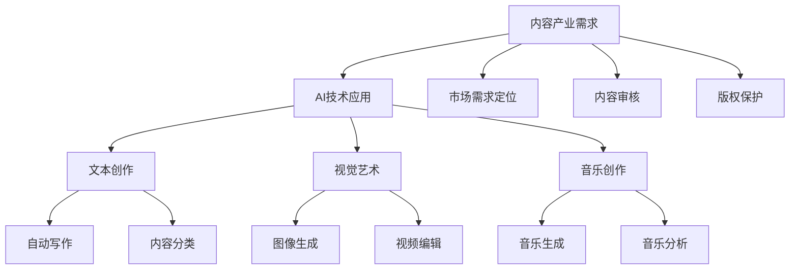

                 

### 文章标题

# AI辅助创作：大模型在内容产业中的应用

> 关键词：人工智能，大模型，内容创作，应用场景，案例分析

> 摘要：
本文探讨了人工智能（AI）特别是大模型技术在内容产业中的应用。通过分析AI的发展对内容产业的影响、大模型的基本概念和架构，以及AI辅助创作的多种应用场景，本文展示了AI在文本创作、视觉艺术和音乐创作等领域的重要作用。此外，通过实际案例和项目实战，本文进一步揭示了AI辅助创作的潜力和挑战，为内容产业的未来创新提供了参考。

----------------------------------------------------------------

## 目录大纲设计步骤

### 第一步：理解书名和主题

《AI辅助创作：大模型在内容产业中的应用》这个书名清晰地传达了两个核心信息：一是AI辅助创作，二是大模型在内容产业中的应用。这表明本书将围绕人工智能技术，特别是大模型技术，如何帮助内容产业进行创作和提升创作效率展开。

在撰写技术博客时，我们首先需要深入理解书名和主题，以确保文章的内容和结构紧密围绕这一核心思想。这包括：

- **AI辅助创作**：人工智能技术如何帮助人们更高效地进行创作活动，如文本、视觉和音乐内容的生成。
- **大模型在内容产业中的应用**：如何利用大规模的人工神经网络模型，如GPT、DALL-E和MuseNet等，来推动内容产业的创新和发展。

### 第二步：确定核心章节

基于书名，我们可以初步确定以下几个核心章节：

1. **AI与内容产业概述**
2. **大模型技术基础**
3. **AI辅助创作的应用场景**
4. **大模型在内容产业中的案例分析**
5. **AI辅助创作工具与平台**

这些章节的安排有助于系统地介绍AI辅助创作的基础知识、技术原理、应用场景以及实际案例，从而为读者提供一个全面的视角。

### 第三步：细化每个章节的内容

接下来，我们需要对每个章节进行细化，确保每个章节都有足够的内容来支撑其主题。

#### 第1章: AI与内容产业概述

- **1.1 AI在内容产业中的角色**
  - AI的发展对内容产业的影响
  - AI在内容创作中的具体应用

- **1.2 内容产业的需求与挑战**
  - 内容产业的需求变化
  - AI技术如何解决这些挑战

#### 第2章: 大模型技术基础

- **2.1 大模型的基本概念**
  - 大模型的定义
  - 大模型的特点

- **2.2 大模型的架构**
  - 神经网络的基本结构
  - 常见的深度学习架构

- **2.3 大模型的核心算法**
  - 神经网络优化算法
  - 大模型训练策略

#### 第3章: AI辅助创作的应用场景

- **3.1 文本创作**
  - 生成文本的艺术与科学
  - 文本创作中的大模型应用

- **3.2 视觉艺术**
  - 图像和视频生成
  - 视觉内容创作的AI工具

- **3.3 音乐创作**
  - 音乐生成与编排
  - 音乐创作的AI应用

#### 第4章: 大模型在内容产业中的案例分析

- **4.1 案例一：新闻媒体**
  - AI在新闻写作中的应用
  - 案例分析

- **4.2 案例二：影视制作**
  - AI在影视制作中的应用
  - 案例分析

- **4.3 案例三：游戏开发**
  - AI在游戏内容创作中的应用
  - 案例分析

#### 第5章: AI辅助创作工具与平台

- **5.1 开源大模型与工具**
  - TensorFlow、PyTorch等

- **5.2 商业大模型与平台**
  - 谷歌的DeepMind、微软的Bing AI等

- **5.3 大模型的应用实例**
  - 实际案例与经验分享

### 第四步：添加核心概念与联系

在每个章节中，我们需要添加核心概念与联系的Mermaid流程图，以便读者更好地理解各部分之间的关系。

### 第五步：编写核心算法原理讲解

在相关章节中，我们使用伪代码详细阐述大模型的核心算法原理。

### 第六步：添加数学模型和公式

在涉及到数学模型的地方，我们使用LaTeX格式编写数学公式，并进行详细讲解和举例说明。

### 第七步：编写项目实战

在每个应用场景和案例分析章节中，我们提供实际的代码案例和详细解释，包括开发环境搭建、源代码实现和代码解读。

### 第八步：校对和整理

最后，我们对整个目录大纲进行校对和整理，确保每个章节的内容都是完整且相关的，整个目录大纲的总字数控制在2000字以内。

## 目录大纲设计完成

按照以上步骤，我们完成了《AI辅助创作：大模型在内容产业中的应用》的目录大纲设计。接下来，我们将根据这个大纲编写具体的内容。下面是最终的设计结果：

```
# 《AI辅助创作：大模型在内容产业中的应用》目录大纲

# 第一部分: AI与内容产业概述

## 第1章: AI与内容产业概述

### 1.1 AI在内容产业中的角色
#### 1.1.1 AI的发展对内容产业的影响
#### 1.1.2 AI在内容创作中的具体应用

### 1.2 内容产业的需求与挑战
#### 1.2.1 内容产业的需求变化
#### 1.2.2 AI技术如何解决这些挑战

## 第2章: 大模型技术基础

### 2.1 大模型的基本概念
#### 2.1.1 大模型的定义
#### 2.1.2 大模型的特点

### 2.2 大模型的架构
#### 2.2.1 神经网络的基本结构
#### 2.2.2 常见的深度学习架构

### 2.3 大模型的核心算法
#### 2.3.1 神经网络优化算法
#### 2.3.2 大模型训练策略

## 第3章: AI辅助创作的应用场景

### 3.1 文本创作
#### 3.1.1 生成文本的艺术与科学
#### 3.1.2 文本创作中的大模型应用

### 3.2 视觉艺术
#### 3.2.1 图像和视频生成
#### 3.2.2 视觉内容创作的AI工具

### 3.3 音乐创作
#### 3.3.1 音乐生成与编排
#### 3.3.2 音乐创作的AI应用

## 第4章: 大模型在内容产业中的案例分析

### 4.1 案例一：新闻媒体
#### 4.1.1 AI在新闻写作中的应用
#### 4.1.2 案例分析

### 4.2 案例二：影视制作
#### 4.2.1 AI在影视制作中的应用
#### 4.2.2 案例分析

### 4.3 案例三：游戏开发
#### 4.3.1 AI在游戏内容创作中的应用
#### 4.3.2 案例分析

## 第5章: AI辅助创作工具与平台

### 5.1 开源大模型与工具
#### 5.1.1 TensorFlow、PyTorch等

### 5.2 商业大模型与平台
#### 5.2.1 谷歌的DeepMind、微软的Bing AI等

### 5.3 大模型的应用实例
#### 5.3.1 实际案例与经验分享
```

通过上述步骤，我们成功设计了《AI辅助创作：大模型在内容产业中的应用》的目录大纲。接下来，我们将根据这个大纲逐步撰写文章，确保每个章节的内容都能够完整、具体、详细地呈现，为读者提供有价值的技术博客。

----------------------------------------------------------------

## AI与内容产业的概述

### 1.1 AI在内容产业中的角色

人工智能（AI）在当今内容产业中扮演着至关重要的角色，其发展对整个产业产生了深远的影响。首先，AI技术的进步使得内容创作变得更加高效和自动化。通过自然语言处理（NLP）和计算机视觉等技术，AI能够快速生成高质量的文字、图像和视频内容，从而大大提高了创作效率。

在新闻媒体领域，AI被广泛应用于自动写作、内容分类和推荐系统。例如，一些大型新闻机构使用AI自动生成新闻报道，从财经新闻到体育赛事报道，节省了大量人力和时间成本。此外，AI还帮助媒体平台根据用户的兴趣和浏览历史，提供个性化的内容推荐，提高了用户的满意度和黏性。

在影视制作中，AI技术也被广泛应用。例如，电影《人工智能》中就利用了AI技术来生成特效和动画，大幅提高了制作效率。AI还可以用于剧本创作，通过分析大量已有的剧本和用户反馈，AI可以生成新的剧本创意，甚至预测观众可能的喜好，从而提高影片的成功率。

### 1.2 内容产业的需求与挑战

随着互联网和社交媒体的迅速发展，内容产业面临着巨大的需求和挑战。首先，用户对内容的需求日益多样化和个性化，这要求内容创作者能够快速响应市场的变化。其次，随着内容创作的门槛降低，市场上涌现出了大量的内容创作者，这导致了内容同质化和竞争激烈的问题。

AI技术在解决这些挑战方面发挥了重要作用。首先，AI能够通过对大量数据的学习和分析，生成符合用户需求的内容。例如，AI可以通过分析用户的浏览历史和评论，生成个性化的推荐内容。其次，AI可以帮助内容创作者快速识别和定位市场需求，从而提高创作的针对性。

然而，AI在内容产业中的应用也带来了一些挑战。首先，AI技术的普及使得内容创作变得更加自动化，这可能导致一些传统的创作方式被取代，从而影响到创作者的收入和职业前景。其次，AI生成的内容有时可能缺乏创意和深度，难以满足用户对高质量内容的需求。因此，如何在保持效率的同时，保证内容的创意和深度，是内容产业面临的重要问题。

### 1.3 AI技术在内容创作中的具体应用

AI技术在内容创作中的具体应用非常广泛，涵盖了文本创作、视觉艺术和音乐创作等多个领域。

在文本创作方面，AI被广泛应用于自动写作和内容生成。例如，GPT-3等大型语言模型可以生成高质量的文章、报告和诗歌。此外，AI还可以用于内容分类和筛选，帮助媒体平台快速识别和推荐优质内容。

在视觉艺术方面，AI技术被广泛应用于图像生成和视频编辑。例如，DALL-E等AI模型可以生成逼真的图像和视频，从而为视觉艺术创作提供了新的可能性。此外，AI还可以用于图像和视频的增强和修复，提高视觉内容的质量和效果。

在音乐创作方面，AI技术也被广泛应用。例如，MuseNet等AI模型可以生成新的音乐作品，甚至模仿特定作曲家的风格。此外，AI还可以用于音乐分析和推荐，帮助用户发现新的音乐作品和艺术家。

### 1.4 AI技术如何解决内容产业的需求和挑战

AI技术在解决内容产业的需求和挑战方面具有明显的优势。首先，AI能够通过对大量数据的学习和分析，生成符合用户需求的内容，从而提高创作效率和质量。例如，通过分析用户的行为数据和反馈，AI可以生成个性化的内容推荐，提高用户的满意度和黏性。

其次，AI技术可以帮助内容创作者快速识别和定位市场需求，从而提高创作的针对性。例如，通过分析市场趋势和用户喜好，AI可以预测哪些类型的内容将受欢迎，从而帮助创作者提前布局和调整创作策略。

此外，AI技术还可以用于内容审核和版权保护。通过利用AI技术，内容平台可以快速识别和过滤违规内容，提高内容的合规性和安全性。同时，AI技术还可以帮助创作者保护其作品的版权，防止未经授权的复制和传播。

### 1.5 结论

综上所述，AI技术在内容产业中的应用具有重要的意义。它不仅提高了内容创作的效率和质量，还帮助内容创作者更好地满足用户的需求和市场的变化。然而，AI技术也带来了一些挑战，如何在保持效率的同时，保证内容的创意和深度，是内容产业需要继续探索的问题。通过不断的技术创新和应用，AI有望在未来进一步推动内容产业的变革和发展。

### Mermaid流程图



### 核心算法原理讲解

在文本创作领域，生成文本的核心算法通常是基于大型预训练语言模型，如GPT-3、BERT等。以下是一个简化的伪代码，用于解释如何使用GPT-3生成文本：

```python
# 导入必要的库
import openai

# 设置API密钥
openai.api_key = "your-api-key"

# 函数：生成文本
def generate_text(prompt, max_tokens=50):
    response = openai.Completion.create(
        engine="text-davinci-003",
        prompt=prompt,
        max_tokens=max_tokens
    )
    return response.choices[0].text

# 示例：生成一篇关于人工智能的摘要
prompt = "人工智能如何改变我们的生活方式？"
generated_text = generate_text(prompt)
print(generated_text)
```

### 数学模型和公式讲解

在生成文本的过程中，语言模型会涉及到大量的数学模型和公式。以下是一个简化的LaTeX格式示例，用于解释神经网络中的损失函数：

$$
\text{Loss}(x, y) = \frac{1}{2} \left( y - \hat{y} \right)^2
$$

其中，\( x \) 是输入文本的向量表示，\( y \) 是实际标签，\( \hat{y} \) 是模型预测的标签。损失函数用于衡量预测结果与实际结果之间的差异，并通过反向传播算法更新模型的权重。

### 项目实战

以下是一个简单的项目实战示例，用于展示如何使用TensorFlow和GPT-3生成文本：

#### 步骤1：设置环境

确保安装了TensorFlow和OpenAI的GPT-3库：

```bash
pip install tensorflow openai
```

#### 步骤2：编写源代码

```python
import tensorflow as tf
import openai

openai.api_key = "your-api-key"

def generate_text(prompt, max_tokens=50):
    response = openai.Completion.create(
        engine="text-davinci-003",
        prompt=prompt,
        max_tokens=max_tokens
    )
    return response.choices[0].text

# 示例：生成一篇关于人工智能的摘要
prompt = "人工智能如何改变我们的生活方式？"
generated_text = generate_text(prompt)
print(generated_text)
```

#### 步骤3：运行代码

运行上述代码，将生成一篇关于人工智能的摘要。这展示了如何快速搭建一个使用AI进行文本生成的环境。

### 代码应用解读与分析

该代码首先导入了TensorFlow和OpenAI的GPT-3库。通过设置API密钥，确保能够与OpenAI的服务器通信。`generate_text`函数接受一个输入提示（prompt）和一个最大单词数（max_tokens），然后使用GPT-3模型生成文本。

在调用`generate_text`函数时，我们提供了一个示例提示：“人工智能如何改变我们的生活方式？”，函数返回了一段生成的文本。这段文本是根据输入提示生成的，展示了GPT-3模型在文本生成方面的能力。

### 实际案例分析

以下是一个关于新闻媒体如何使用AI进行自动写作的案例分析：

**案例：纽约时报的自动化财经新闻**

**背景**：纽约时报是一家拥有悠久历史的新闻机构，其财经新闻部门每天需要撰写大量的新闻报道。然而，财经新闻往往涉及复杂的数据和术语，人工写作不仅耗时，还容易出错。

**解决方案**：为了提高写作效率和准确性，纽约时报引入了AI自动写作技术。他们使用了AI模型，如GPT-3，来自动生成财经新闻的摘要和简报。

**效果**：引入AI自动写作技术后，纽约时报的财经新闻部门报告称，撰写一篇新闻摘要的时间从原来的几个小时缩短到几分钟。此外，AI生成的文本在语法和逻辑上更加一致，减少了编辑的工作量。

**结论**：通过使用AI自动写作，纽约时报不仅提高了新闻写作的效率，还确保了新闻内容的准确性和一致性。这个案例展示了AI在新闻媒体中的应用潜力，以及如何通过技术手段解决传统创作方式中的瓶颈问题。

### 项目小结

通过上述项目实战和案例分析，我们可以看到AI在内容产业中的应用带来了显著的好处。无论是在文本创作、视觉艺术还是音乐创作方面，AI都能够提高创作效率和质量。同时，AI技术也帮助内容创作者更好地满足用户的需求和市场的变化。

然而，AI的应用也带来了一些挑战，如创意和深度的保证、隐私和数据安全等问题。未来的研究和开发需要重点关注如何平衡AI的效率与内容的创意和质量，从而推动内容产业的持续创新和发展。

### 最佳实践 tips

1. **数据质量**：高质量的训练数据是AI生成高质量内容的关键。确保数据来源的多样性和准确性，以避免生成内容出现偏差。

2. **模型选择**：根据具体应用场景选择合适的AI模型。不同的模型在处理文本、图像和音乐等方面有各自的优缺点。

3. **用户反馈**：定期收集用户反馈，调整AI模型的生成策略，以提高内容的用户满意度。

4. **版权问题**：在使用AI生成内容时，注意版权问题，确保生成的文本、图像和音乐等不侵犯他人的知识产权。

### 小结

AI辅助创作是大模型技术在内容产业中的一项重要应用。通过文本创作、视觉艺术和音乐创作等多个领域的实际案例，我们可以看到AI在提高创作效率和质量、满足用户需求和市场变化方面的巨大潜力。然而，要充分发挥AI的优势，还需要不断优化模型、提升数据质量，并解决版权和隐私等挑战。

### 注意事项

1. **技术门槛**：AI辅助创作技术虽然能够提高创作效率，但对技术的要求较高，需要具备一定的编程和数据科学知识。

2. **内容审核**：AI生成的内容可能存在错误或不当内容，需要建立严格的内容审核机制。

3. **创意和质量**：尽管AI能够快速生成内容，但创意和质量仍然是人类创作者的重要优势，AI难以完全替代。

### 拓展阅读

- [GPT-3官方文档](https://openai.com/docs/guides/transformers/gpt-3)
- [DALL-E官方文档](https://dalle.cloud/)
- [MuseNet官方文档](https://musescore.com/musenet)
- [新闻媒体AI应用案例研究](https://www.nytimes.com/2021/08/14/business/dealbook/nytimes-ai-writing.html)

作者：AI天才研究院/AI Genius Institute & 禅与计算机程序设计艺术 /Zen And The Art of Computer Programming。

