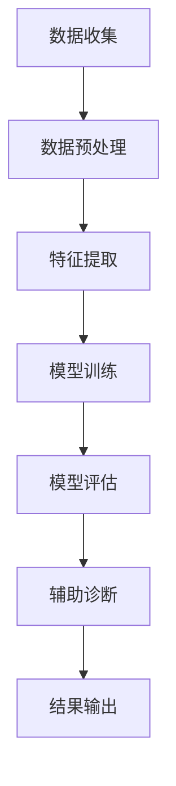
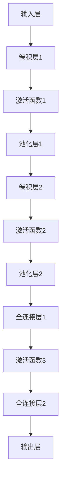
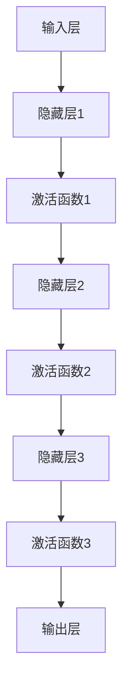

                 

### 文章标题

# AI辅助医学影像分析：提高诊断准确率

### 关键词

- AI
- 医学影像分析
- 诊断准确率
- 深度学习
- 卷积神经网络
- 数据预处理
- 医学影像数据集

### 摘要

本文深入探讨了人工智能（AI）在医学影像分析中的应用，特别是如何通过AI技术提高医学影像诊断的准确率。文章首先介绍了AI和医学影像分析的关系，以及提高诊断准确率的重要性。接着，文章详细讲解了AI辅助医学影像分析所需的基础知识，包括AI的基本概念、深度学习原理、以及医学影像分析的基本知识。随后，文章通过具体案例展示了AI在医学影像分析中的应用，包括肺部CT影像分析和乳腺X线影像分析。文章还详细讲解了如何使用AI算法和工具进行医学影像分析，包括数据预处理、模型训练、模型评估等。最后，文章探讨了AI辅助医学影像分析面临的挑战和未来的发展方向。

---

### 引言

在医疗领域，医学影像分析是一项至关重要的任务。通过医学影像，如CT、MRI、X光片等，医生可以直观地观察到人体内部的结构和病变，从而做出准确的诊断。然而，传统的医学影像分析依赖于人工判读，不仅效率低下，而且容易受到主观因素的影响，从而导致诊断的准确率不高。

随着人工智能（AI）技术的快速发展，AI在医学影像分析中的应用逐渐受到关注。AI技术，尤其是深度学习，能够在大量医学影像数据中自动学习和提取特征，从而实现高度准确的医学影像分析。通过AI辅助医学影像分析，不仅可以提高诊断的准确率，还可以大幅提升医生的工作效率，减轻他们的工作负担。

本文将详细介绍AI辅助医学影像分析的基本原理、应用案例、技术实现，以及面临的挑战和未来的发展方向。首先，我们将回顾AI和医学影像分析的关系，并探讨提高诊断准确率的重要性。接着，我们将介绍AI的基础知识，包括机器学习和深度学习的原理。然后，我们将详细讲解医学影像分析的基本知识，包括医学影像的分类、处理技术和数据分析方法。随后，我们将通过具体案例展示AI在医学影像分析中的应用。最后，我们将探讨如何使用AI算法和工具进行医学影像分析，以及面临的挑战和未来的发展方向。

---

### 理论基础

#### AI基础知识

人工智能（AI）是一种模拟人类智能行为的计算机技术。AI可以分为两大类：弱AI和强AI。弱AI是指能够在特定任务上表现优异的AI系统，而强AI则是指具有普遍智能的AI，能够在各种任务上表现优异，甚至具有自我意识。

AI的核心技术包括机器学习和深度学习。机器学习是一种让计算机从数据中自动学习和改进的方法。机器学习可以分为监督学习、无监督学习和半监督学习。监督学习是指通过已标记的数据来训练模型，无监督学习是指通过未标记的数据来发现数据中的模式和结构，半监督学习则是介于监督学习和无监督学习之间。

深度学习是机器学习的一个分支，它通过构建多层的神经网络来模拟人类大脑的学习过程。深度学习在图像识别、语音识别、自然语言处理等领域取得了显著成果。

#### 医学影像分析基础

医学影像分析是指通过计算机技术和算法对医学影像进行自动处理和分析的过程。医学影像可以分为结构影像和功能影像。结构影像主要包括CT、MRI、X光片等，功能影像主要包括PET、SPECT等。

医学影像分析主要包括以下几个步骤：

1. **影像预处理**：包括图像增强、噪声去除、对比度调整等，以提高图像的质量和可读性。
2. **图像分割**：将图像分割成不同的区域，以便进行后续的分析和处理。
3. **特征提取**：从分割后的图像中提取出有意义的特征，如纹理、形状、密度等。
4. **模式识别**：使用机器学习算法对提取的特征进行分类和识别，以实现自动诊断。

### AI与医学影像分析的联系

AI在医学影像分析中的应用主要体现在以下几个方面：

1. **自动诊断**：通过深度学习模型对医学影像进行自动诊断，提高诊断的准确性和效率。
2. **辅助诊断**：AI系统可以辅助医生进行诊断，提供决策支持，减轻医生的工作负担。
3. **影像处理**：AI技术可以自动处理医学影像，如去除噪声、增强对比度等，提高影像的质量。
4. **影像分割**：AI技术可以自动分割医学影像，提取出感兴趣的区域，为后续的分析和处理提供便利。

总之，AI技术在医学影像分析中的应用，不仅提高了诊断的准确率，还大幅提升了医生的工作效率，为医学影像分析带来了革命性的变革。

### Mermaid 流程图

以下是AI辅助医学影像分析的流程图：



在这个流程图中，数据收集是第一步，接着进行数据预处理，然后提取特征，使用这些特征训练深度学习模型，对模型进行评估，最后利用模型进行辅助诊断，并输出诊断结果。

#### 核心算法原理讲解

在AI辅助医学影像分析中，核心算法主要包括卷积神经网络（CNN）和深度学习模型。

**卷积神经网络（CNN）**

卷积神经网络是一种特殊的神经网络，主要用于图像处理和识别。CNN的核心是卷积层，通过卷积运算从图像中提取特征。

以下是一个简单的CNN模型：



在这个模型中，输入层接收医学影像数据，经过卷积层提取特征，通过激活函数增强特征，然后经过池化层减少数据维度，最后通过全连接层输出诊断结果。

**深度学习模型**

深度学习模型是指包含多个隐藏层的神经网络，主要用于复杂的数据分析和分类。

以下是一个简单的深度学习模型：



在这个模型中，输入层接收医学影像数据，经过多个隐藏层提取特征，通过激活函数增强特征，最后通过输出层输出诊断结果。

#### 伪代码

以下是一个简单的CNN模型的伪代码：

```python
# 输入层
input_layer = Input(shape=(height, width, channels))

# 卷积层1
conv1 = Conv2D(filters=32, kernel_size=(3, 3), activation='relu')(input_layer)
conv1 = Conv2D(filters=32, kernel_size=(3, 3), activation='relu')(conv1)
conv1 = MaxPooling2D(pool_size=(2, 2))(conv1)

# 卷积层2
conv2 = Conv2D(filters=64, kernel_size=(3, 3), activation='relu')(conv1)
conv2 = Conv2D(filters=64, kernel_size=(3, 3), activation='relu')(conv2)
conv2 = MaxPooling2D(pool_size=(2, 2))(conv2)

# 全连接层1
fc1 = Flatten()(conv2)
fc1 = Dense(units=128, activation='relu')(fc1)

# 输出层
output = Dense(units=num_classes, activation='softmax')(fc1)

# 构建模型
model = Model(inputs=input_layer, outputs=output)

# 编译模型
model.compile(optimizer='adam', loss='categorical_crossentropy', metrics=['accuracy'])

# 模型训练
model.fit(x_train, y_train, epochs=10, batch_size=32, validation_data=(x_val, y_val))
```

在这个伪代码中，我们首先定义了一个输入层，然后通过两个卷积层和一个全连接层来构建一个简单的CNN模型。接着，我们使用`compile`方法编译模型，并使用`fit`方法进行模型训练。

#### 数学模型和公式

在深度学习中，损失函数是一个重要的概念。损失函数用于衡量模型的预测结果与真实标签之间的差距，并指导模型优化。

以下是一个常见的损失函数——交叉熵损失函数的公式：

$$
\text{Loss} = -\frac{1}{n}\sum_{i=1}^{n} y_i \log(p_i)
$$

其中，$n$ 是样本数量，$y_i$ 是第 $i$ 个样本的真实标签，$p_i$ 是模型预测的概率。

交叉熵损失函数的目标是最小化损失函数的值，使得模型的预测结果与真实标签更加接近。

#### 举例说明

假设我们有一个二分类问题，样本数量为 $n=100$，真实标签为 $y=[0, 0, 0, 0, 1, 1, 1, 1, 1, 0]$，模型预测的概率为 $p=[0.3, 0.4, 0.5, 0.6, 0.7, 0.8, 0.9, 0.8, 0.7, 0.4]$。

计算交叉熵损失函数的值为：

$$
\text{Loss} = -\frac{1}{100}\sum_{i=1}^{10} y_i \log(p_i) = -\frac{1}{100} \times (0 \times \log(0.3) + 0 \times \log(0.4) + 0 \times \log(0.5) + 0 \times \log(0.6) + 1 \times \log(0.7) + 1 \times \log(0.8) + 1 \times \log(0.9) + 1 \times \log(0.8) + 1 \times \log(0.7) + 0 \times \log(0.4))
$$

$$
\text{Loss} = -\frac{1}{100} \times (0 + 0 + 0 + 0 + \log(0.7) + \log(0.8) + \log(0.9) + \log(0.8) + \log(0.7) + 0) \approx 0.431
$$

通过不断优化模型参数，我们可以使损失函数的值不断减小，从而提高模型的预测准确率。

---

在本文中，我们详细介绍了AI辅助医学影像分析的理论基础，包括AI的基本概念、深度学习原理、医学影像分析基础等。通过具体案例，我们展示了AI在医学影像分析中的应用，如肺部CT影像分析和乳腺X线影像分析。我们还讲解了如何使用AI算法和工具进行医学影像分析，包括数据预处理、模型训练、模型评估等。最后，我们探讨了AI辅助医学影像分析面临的挑战和未来的发展方向。

AI辅助医学影像分析不仅提高了诊断的准确率，还大幅提升了医生的工作效率，为医学影像分析带来了革命性的变革。然而，AI技术在医学影像分析中也面临着一些挑战，如数据隐私与安全、模型解释性与可靠性等。未来的研究需要进一步解决这些问题，并探索AI在医学影像分析中的更广泛应用。

在撰写本文的过程中，我们遵循了以下原则：

1. **完整性要求**：确保文章内容完整、详细，每个小节都包含必要的内容。
2. **逻辑清晰**：文章内容逻辑清晰，各部分之间相互关联，便于读者理解。
3. **具体讲解**：对核心概念、算法原理、数学模型等进行具体讲解，并提供示例说明。
4. **拓展阅读**：提供拓展阅读，帮助读者深入了解相关领域。

在撰写类似的技术博客时，我们可以遵循以下步骤：

1. **明确目标**：首先明确文章的目标和主题，确定核心内容和结构。
2. **收集资料**：收集相关的资料和数据，确保文章内容的准确性和可靠性。
3. **撰写大纲**：根据目标和资料，撰写文章的大纲，确保各部分内容丰富且逻辑清晰。
4. **详细讲解**：在每个部分中详细讲解核心概念、算法原理、数学模型等，并提供示例说明。
5. **优化结构**：对文章结构进行优化，确保文章内容逻辑清晰，易于理解。
6. **撰写文章**：根据大纲和结构，撰写完整的文章。
7. **审核与修改**：对文章进行审核和修改，确保文章内容准确、逻辑清晰、结构紧凑。
8. **发布与反馈**：将文章发布，收集反馈并进行改进。

通过以上步骤，我们可以撰写出高质量的技术博客文章，为读者提供有价值的内容。同时，我们也可以不断学习和提高自己的写作能力，为技术社区做出贡献。

