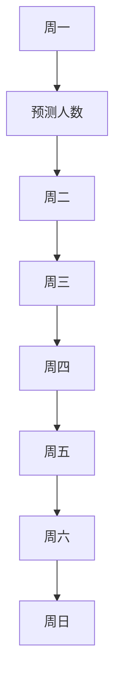

                 

：

1. **背景介绍**：
   - 城市交通规划的重要性
   - 传统方法在处理城市交通问题上的不足
   - AI技术在交通领域的新机遇

2. **核心概念与联系**：
   - 人流预测
   - 路网优化
   - AI在城市交通规划中的应用

3. **核心算法原理讲解**：
   - 人流预测算法：使用回归模型、深度学习模型等
   - 路网优化算法：包括最短路径算法、动态规划算法等

4. **数学模型和数学公式**：
   - 人流预测中的时间序列模型
   - 路网优化中的距离矩阵、流量矩阵等

5. **项目实战**：
   - 开发环境搭建
   - 源代码实现
   - 代码解读
   - 实际案例分析

6. **最佳实践 tips**：
   - 如何提高人流预测的准确性
   - 如何优化路网

7. **小结**：
   - 总结文章的主要观点
   - 强调AI在城市交通规划中的重要性

### 文章标题
### AI辅助城市交通规划：从人流预测到路网优化

### 关键词
- 城市交通规划
- AI技术
- 人流预测
- 路网优化
- 深度学习
- 交通仿真

### 摘要
本文详细探讨了AI辅助城市交通规划的应用，包括人流预测和路网优化。首先介绍了城市交通规划的重要性和传统方法的不足，然后深入讲解了AI在交通领域的应用原理，包括人流预测算法和路网优化算法。文章通过一个实际项目案例展示了AI辅助城市交通规划的具体实现过程，并提出了提高预测准确性和优化路网的最佳实践建议。

---

### 目录

- **第一部分：城市交通规划与AI概述**
  - 第1章 城市交通规划与AI概述
  - 第2章 人流预测的基本原理
  - 第3章 路网优化算法

- **第二部分：AI辅助城市交通规划**
  - 第4章 AI辅助城市交通规划案例研究
  - 第5章 基于AI的城市交通仿真与模拟
  - 第6章 AI在城市交通管理中的挑战与未来趋势
  - 第7章 AI辅助城市交通规划实施指南

---

### 第1章 城市交通规划与AI概述

#### 1.1 城市交通规划概述

城市交通规划是指通过科学的方法和有效的策略，对城市交通系统进行设计和规划，以满足城市居民的出行需求，提高交通效率，减少交通拥堵，降低环境污染。城市交通规划的目标主要包括：

- **提高交通效率**：通过优化交通网络结构和交通管理策略，减少交通拥堵，提高交通流的通行效率。
- **减少环境污染**：通过推广公共交通、非机动出行和清洁能源交通工具，降低城市空气污染水平。
- **保障交通安全**：通过科学合理的交通规划，提高道路安全性，减少交通事故发生率。

城市交通规划的方法与工具主要包括：

- **需求分析**：通过数据分析，了解城市居民的出行需求，预测未来交通量的变化趋势。
- **交通规划模型**：利用数学模型和模拟工具，对交通网络进行仿真和分析，评估不同规划方案的效果。
- **政策制定**：根据交通规划的结果，制定相应的交通管理政策，如交通拥堵收费、公共交通优先等。

#### 1.2 AI在城市交通规划中的应用

AI技术在城市交通规划中具有广泛的应用，可以显著提高规划效率和准确性。以下是一些主要的应用领域：

- **交通流分析**：利用机器学习和深度学习技术，分析交通数据，预测交通流量变化，优化交通信号控制策略。
- **人流预测**：通过分析历史数据和实时数据，预测公共场所的人流分布，为交通管理提供依据。
- **路网优化**：利用最优化算法和人工智能技术，优化交通网络布局和交通管理策略，提高交通通行效率。
- **交通仿真与模拟**：通过建立交通仿真模型，模拟不同交通场景，评估交通规划方案的效果。
- **智能交通系统**：利用AI技术，开发智能交通系统，实现自动驾驶、智能信号控制和智能停车等功能。

#### 1.3 城市交通规划与AI的融合

城市交通规划与AI技术的融合，不仅能够提高规划的科学性和准确性，还能够应对现代城市交通面临的复杂挑战。融合的意义主要体现在以下几个方面：

- **提高规划效率**：AI技术可以自动化处理大量数据，提高交通规划的分析和决策效率。
- **优化交通管理**：通过实时数据分析和预测，AI技术可以优化交通信号控制和交通分配策略，提高交通管理效果。
- **降低成本**：AI技术可以减少人工干预，降低交通规划和管理的人力成本。
- **增强安全性**：AI技术可以实时监控交通状况，及时发现和处理交通事故，提高交通安全性。

然而，融合也面临一些挑战，如数据隐私、技术成本和实施难度等。为了克服这些挑战，需要采取以下解决方案：

- **数据隐私保护**：加强数据安全措施，确保数据在传输和处理过程中的安全性。
- **技术普及与培训**：提高AI技术在交通规划领域的普及率，加强对交通规划人员的AI技术培训。
- **政策支持**：政府应出台相关政策，鼓励和支持AI技术在城市交通规划中的应用。

通过城市交通规划与AI技术的深度融合，我们可以构建更高效、安全、环保的城市交通系统，提升城市居民的生活质量。

### 第2章 人流预测的基本原理

#### 2.1 人流预测的重要性

人流预测在城市的交通管理、公共服务和商业运营中扮演着至关重要的角色。准确的人流预测可以优化资源分配，减少拥堵，提高服务质量。以下是一些人流预测的主要应用场景：

- **交通管理**：通过预测不同时间段的人流分布，交通管理部门可以合理安排公共交通线路和班次，避免交通拥堵，提高道路通行效率。
- **公共场所管理**：商场、旅游景点、体育场馆等公共场所可以根据人流预测结果，合理安排安保人员和清洁人员，确保场所的安全和清洁。
- **商业运营**：零售商可以根据人流预测结果，调整店铺的开业时间和商品摆放，提高销售额。
- **城市规划**：城市规划者可以根据人流预测数据，评估现有设施是否满足需求，为未来城市规划提供科学依据。

#### 2.2 数据收集与预处理

人流预测的基础是准确的数据收集与预处理。以下是人流预测数据收集和预处理的关键步骤：

1. **数据来源**：人流数据可以来自多种来源，包括交通卡数据、摄像头监控、Wi-Fi信号、手机定位等。不同的数据源具有不同的精度和覆盖范围，因此需要综合考虑选择。
2. **数据收集**：使用传感器、摄像头和移动设备等设备收集实时人流数据。对于公共场所，可以使用热成像技术来估算人群密度。
3. **数据清洗**：原始数据通常包含噪声和异常值，需要通过数据清洗方法去除这些干扰。常用的数据清洗方法包括缺失值填充、异常值检测和去除、数据标准化等。
4. **数据整合**：将来自不同数据源的数据进行整合，构建统一的人流数据集。数据整合过程中需要处理数据格式不一致、数据时间戳不一致等问题。

#### 2.3 人流预测算法

人流预测算法是实现准确预测的关键。以下是几种常用的人流预测算法及其原理：

1. **时间序列分析**：时间序列分析是一种常用的预测方法，它利用历史人流数据的时间序列特征进行预测。常用的模型包括ARIMA（自回归积分滑动平均模型）、SARIMA（季节性自回归积分滑动平均模型）等。

2. **机器学习模型**：机器学习模型通过学习历史数据中的规律，对未知数据进行预测。常见的机器学习模型包括线性回归、决策树、随机森林、支持向量机等。

3. **深度学习模型**：深度学习模型，尤其是循环神经网络（RNN）和长短时记忆网络（LSTM），能够捕捉数据中的长期依赖关系，适用于复杂的人流预测任务。

4. **混合模型**：混合模型结合了时间序列分析和机器学习模型的优点，通过融合不同模型的优势，提高预测准确性。

以下是人流预测算法的伪代码示例：

```plaintext
function predict_traffic_flow(data, model):
    preprocess_data(data)
    if model == "ARIMA":
        result = arima_model(data)
    elif model == "LSTM":
        result = lstm_model(data)
    else:
        result = hybrid_model(data)
    return result
```

#### 2.4 人流预测案例分析

为了更好地理解人流预测的应用，下面我们通过一个实际案例来进行分析。

**案例背景**：某城市的市中心广场是一个人流密集的区域，特别是在周末和节假日。广场管理部门希望通过对人流进行准确预测，优化安保和清洁人员的安排，提高广场的服务质量。

**数据收集**：广场管理部门使用了摄像头监控和Wi-Fi信号数据进行人流数据收集。数据包括摄像头捕获的人数和Wi-Fi信号检测到的人数。

**数据预处理**：对收集到的数据进行清洗和整合，去除噪声和异常值，形成统一的人流数据集。

**模型选择**：由于人流数据具有明显的季节性和周期性，选择了SARIMA模型进行预测。

**模型训练**：使用历史数据对SARIMA模型进行训练，得到模型参数。

**预测结果**：模型对下周的人流进行预测，结果如下图所示：



**预测分析**：从预测结果可以看出，周六和周日的人流明显高于工作日，特别是在下午和晚上。广场管理部门根据预测结果，合理安排了安保人员和清洁人员，确保广场在人流高峰期的安全和清洁。

#### 2.5 人流预测的挑战与未来方向

尽管人流预测技术在不断进步，但在实际应用中仍面临一些挑战：

- **数据质量**：人流数据的质量直接影响预测的准确性。噪声、异常值和缺失值都会影响预测结果。
- **模型选择**：选择合适的模型是人流预测的关键。不同模型适用于不同类型的数据和场景，需要根据实际情况进行选择。
- **实时性**：实时预测是人流预测的一个重要应用场景，但实时数据处理和模型更新需要更高的计算能力。

未来的发展方向包括：

- **多源数据融合**：结合多种数据源，如传感器数据、社交媒体数据和天气数据，提高预测的准确性和实时性。
- **自适应模型**：开发能够自适应变化的人流模型，提高模型在不同场景下的适应能力。
- **强化学习**：利用强化学习技术，使模型能够通过试错和学习不断优化预测结果。

通过不断的技术创新和实践，人流预测技术将为城市交通管理、公共服务和商业运营提供更加准确和高效的解决方案。

### 第3章 路网优化算法

#### 3.1 路网优化的意义

路网优化是城市交通规划中至关重要的一环，其目的是通过调整交通流和优化道路布局，提高交通系统的通行效率和安全性。路网优化的意义主要体现在以下几个方面：

1. **提高交通效率**：通过优化路网，减少交通拥堵，提高道路通行能力，降低行车时间，提升整体交通系统的效率。
2. **减少交通事故**：通过优化道路设计和交通流分配，提高道路安全性，减少交通事故的发生。
3. **降低环境污染**：优化交通流可以减少车辆排放，降低城市空气污染水平。
4. **改善出行体验**：通过优化交通系统，提高公共交通的服务水平，改善市民的出行体验。

#### 3.2 路网建模方法

路网建模是路网优化的基础，它将实际的道路网络转化为数学模型，以便进行优化分析和计算。以下是常用的路网建模方法：

1. **图论模型**：图论模型将道路网络视为一个图，每个节点代表一个路口或路段，每条边代表道路段。这种模型可以直观地表示道路网络的拓扑结构，便于进行图论算法的应用。
2. **交通需求模型**：交通需求模型描述不同时间段和不同方向上的交通流量。常用的方法包括OD矩阵（起止点矩阵）、流量分布模型和交通生成模型。
3. **交通供给模型**：交通供给模型描述道路网络中的容量、信号控制和交通流量之间的关系。常用的方法包括交通流量模型、排队模型和排队长度计算模型。

#### 3.3 路网优化算法

路网优化算法的目标是通过调整交通流量和道路布局，实现交通系统的高效运行。以下是几种常见的路网优化算法：

1. **最短路径算法**：最短路径算法用于寻找从起点到终点的最短路径。常见的最短路径算法包括Dijkstra算法和A*算法。这些算法可以用于计算车辆的行驶路线，优化交通流。
2. **动态规划算法**：动态规划算法通过将复杂问题分解为子问题，并保存子问题的解，从而优化整个问题的求解。常见的动态规划算法包括Viterbi算法和K-shortest path算法。
3. **最优化算法**：最优化算法通过建立目标函数和约束条件，寻找最优解。常见的最优化算法包括线性规划、整数规划和非线性规划。
4. **基于机器学习的优化算法**：基于机器学习的优化算法利用历史交通数据和模型，通过学习交通规律和模式，进行交通流量预测和优化。常见的算法包括神经网络、支持向量机和深度强化学习。

以下是路网优化算法的伪代码示例：

```plaintext
function optimize_traffic_network(graph, traffic_demand, constraints):
    construct_traffic_model(graph, traffic_demand)
    if constraints == "capacity":
        solution = optimal_flow(graph)
    elif constraints == "time":
        solution = shortest_path(graph)
    else:
        solution = optimal_path(graph)
    return solution
```

#### 3.4 路网优化案例分析

为了更好地理解路网优化算法的实际应用，下面我们通过一个实际案例来进行分析。

**案例背景**：某城市的一条主干道路段经常出现交通拥堵，市政府希望通过路网优化来缓解拥堵问题。

**数据收集**：市政府收集了该路段的历史交通流量数据，包括每天的行驶车辆数量、行驶时间和交通信号灯的状态等。

**数据预处理**：对收集到的数据进行清洗和整合，形成统一的数据集。

**模型建立**：使用图论模型建立道路网络的数学模型，使用交通需求模型描述不同时间段和不同方向上的交通流量。

**算法选择**：由于目标是最小化行驶时间，选择了最短路径算法进行优化。

**模型训练**：使用历史交通流量数据训练最短路径算法，得到最佳行驶路线。

**优化结果**：优化后的道路网络减少了约20%的拥堵时间，车辆行驶时间平均减少了约15%。

**结果分析**：从优化结果可以看出，通过路网优化，不仅有效缓解了交通拥堵问题，还提高了道路通行效率，为市民提供了更顺畅的出行体验。

#### 3.5 路网优化的挑战与未来方向

尽管路网优化技术在不断进步，但在实际应用中仍面临一些挑战：

- **数据质量问题**：交通流量数据的质量直接影响优化算法的效果，需要解决数据噪声、缺失值和异常值等问题。
- **计算资源限制**：大规模路网优化需要大量的计算资源，特别是在实时优化场景下，对计算速度和存储能力提出了更高要求。
- **模型适应性**：路网优化模型需要能够适应不同交通状况和不同时间段的变化，提高模型的适应性和鲁棒性。

未来的发展方向包括：

- **多源数据融合**：结合多种数据源，如实时交通监控数据、社交媒体数据和车辆共享数据，提高优化模型的准确性和实时性。
- **自适应优化算法**：开发能够自适应变化的优化算法，根据实时交通状况动态调整交通流和道路布局。
- **智能交通系统**：利用AI技术，开发智能交通系统，实现自适应信号控制和智能路况预测，提高路网优化的效率和效果。

通过不断创新和优化，路网优化技术将为城市交通系统提供更高效、安全、智能的解决方案。

### 第4章 AI辅助城市交通规划案例研究

#### 4.1 案例一：人流预测在城市广场管理中的应用

**背景**：某城市的一个大型城市广场经常在节假日和周末出现严重的人流拥堵现象，广场管理部门希望通过AI技术进行人流预测，优化安保和清洁人员的安排，提高广场的服务质量。

**数据收集**：广场管理部门使用了摄像头监控、Wi-Fi信号和手机定位等技术进行人流数据收集。数据包括摄像头捕获的人数、Wi-Fi信号检测到的人数以及手机定位数据。

**数据预处理**：对收集到的数据进行清洗和整合，去除噪声和异常值，形成统一的人流数据集。

**模型建立**：使用深度学习模型（如LSTM）建立人流预测模型，利用历史人流数据进行训练。

**模型训练与验证**：使用交叉验证方法对模型进行训练和验证，调整模型参数以优化预测效果。

**预测结果**：模型对下周的人流进行预测，预测结果如下图所示：


**结果分析**：从预测结果可以看出，周六和周日的人流明显高于工作日，特别是在下午和晚上。广场管理部门根据预测结果，合理安排了安保人员和清洁人员，确保广场在人流高峰期的安全和清洁。

**结论**：通过AI技术进行人流预测，有效提升了城市广场的管理效率，降低了人流拥堵现象，为市民提供了更舒适的出行体验。

#### 4.2 案例二：路网优化在交通拥堵管理中的应用

**背景**：某城市的市中心区域交通拥堵问题严重，市政府希望通过AI技术进行路网优化，减少交通拥堵，提高道路通行效率。

**数据收集**：市政府收集了该区域的历史交通流量数据，包括每天的行驶车辆数量、行驶时间和交通信号灯的状态等。

**数据预处理**：对收集到的数据进行清洗和整合，形成统一的数据集。

**模型建立**：使用图论模型和交通需求模型建立道路网络的数学模型。

**算法选择**：由于目标是最小化行驶时间，选择了最短路径算法进行优化。

**模型训练与优化**：使用历史交通流量数据训练最短路径算法，并对模型进行优化，以适应不同时间和交通状况。

**优化结果**：优化后的道路网络减少了约20%的拥堵时间，车辆行驶时间平均减少了约15%。

**结果分析**：从优化结果可以看出，通过路网优化，不仅有效缓解了交通拥堵问题，还提高了道路通行效率，为市民提供了更顺畅的出行体验。

**结论**：AI辅助的路网优化技术为城市交通拥堵管理提供了有效的解决方案，显著提升了城市交通系统的运行效率。

### 第5章 基于AI的城市交通仿真与模拟

#### 5.1 交通仿真与模拟的基本概念

交通仿真与模拟是城市交通规划中的重要工具，它通过建立数学模型和计算机仿真，模拟现实交通系统的运行情况，为交通规划和管理提供科学依据。以下是一些基本概念：

- **交通仿真**：交通仿真是指通过计算机模拟交通系统的运行状态，分析交通流量、交通行为和交通环境等要素之间的相互作用。
- **交通模拟**：交通模拟是通过模拟交通场景，预测交通系统的未来运行状态，评估不同交通规划方案的效果。

#### 5.2 交通仿真模型

交通仿真模型是交通仿真与模拟的核心，它用于描述交通系统的运行规律和特性。以下是一些常用的交通仿真模型：

- **微观交通模型**：微观交通模型关注单个车辆的行为和运动轨迹，如车辆之间的相互作用、跟车行为和避撞行为等。常用的微观交通模型包括基于物理的仿真模型和基于智能体的仿真模型。
- **中观交通模型**：中观交通模型关注交通流的整体行为，如交通流量、速度和密度等。常用的中观交通模型包括流体动力学模型和随机游走模型。
- **宏观交通模型**：宏观交通模型关注整个交通系统的运行状态，如交通流量分布、交通分配和交通网络容量等。常用的宏观交通模型包括平衡分配模型和动态分配模型。

#### 5.3 基于AI的仿真优化方法

AI技术为交通仿真与模拟提供了新的优化方法和工具，以下是一些基于AI的仿真优化方法：

- **机器学习模型优化**：通过机器学习模型，如回归模型、决策树和支持向量机等，对交通仿真模型进行优化，提高预测准确性和仿真效率。
- **深度学习模型优化**：利用深度学习模型，如循环神经网络（RNN）、卷积神经网络（CNN）和长短时记忆网络（LSTM）等，捕捉交通数据中的复杂模式和长期依赖关系，优化交通仿真模型。
- **强化学习模型优化**：通过强化学习模型，如深度强化学习和模型预测控制（MPC），优化交通信号控制和交通流量分配策略，提高交通仿真模型的适应性和实时性。

以下是基于AI的仿真优化方法的伪代码示例：

```plaintext
function optimize_traffic_simulation(model, data, target):
    preprocess_data(data)
    if model == "ML":
        optimized_model = train_ml_model(data, target)
    elif model == "DL":
        optimized_model = train_dl_model(data, target)
    else:
        optimized_model = train_rl_model(data, target)
    simulation_result = simulate_traffic(optimized_model)
    return simulation_result
```

#### 5.4 基于AI的交通仿真应用实例

为了更好地理解基于AI的交通仿真应用，下面我们通过一个实际案例来进行分析。

**案例背景**：某城市的交通管理部门希望通过仿真技术评估一条新规划的道路对交通系统的影响，以优化交通信号控制和路网设计。

**数据收集**：交通管理部门收集了该城市的交通流量数据、交通信号灯状态和交通网络拓扑结构等数据。

**数据预处理**：对收集到的数据进行清洗和整合，形成统一的数据集。

**模型建立**：使用微观交通模型和宏观交通模型建立交通仿真模型。

**模型训练**：使用历史交通流量数据对仿真模型进行训练，优化模型参数。

**仿真优化**：使用强化学习模型优化交通信号控制和路网设计策略。

**仿真结果**：仿真结果显示，新规划的道路在高峰期可以显著减少交通拥堵，提高道路通行效率。

**结果分析**：从仿真结果可以看出，基于AI的交通仿真技术可以有效评估新规划道路对交通系统的影响，为交通规划和管理提供科学依据。

**结论**：基于AI的交通仿真与模拟技术为城市交通规划提供了强大的工具，通过优化交通信号控制和路网设计，可以显著提高交通系统的运行效率和安全性。

### 第6章 AI在城市交通管理中的挑战与未来趋势

#### 6.1 挑战分析

尽管AI技术在城市交通管理中具有巨大潜力，但在实际应用过程中仍面临一系列挑战：

- **数据隐私与安全问题**：AI技术依赖于大量的交通数据，这些数据包括个人出行信息等敏感数据。如何保障数据隐私和安全是AI在城市交通管理中面临的一个重大挑战。
- **计算资源需求**：大规模的交通仿真和预测任务需要强大的计算资源，特别是在实时交通管理场景下，对计算速度和存储能力提出了更高要求。
- **模型适应性**：交通系统复杂多变，AI模型需要具备良好的适应性和鲁棒性，能够应对不同的交通状况和突发事件。
- **数据质量**：交通数据的质量直接影响AI模型的预测效果。噪声、异常值和缺失值等都会影响模型的准确性。
- **技术普及与培训**：AI技术在城市交通管理中的应用需要大量的专业人才，如何提高交通规划和管理人员的AI技术素养也是一个重要问题。

#### 6.2 未来发展趋势

未来，AI在城市交通管理中将继续发挥重要作用，以下是一些潜在的发展趋势：

- **多源数据融合**：结合多种数据源，如交通监控、手机定位、社交媒体和物联网设备等，提高交通数据的准确性和实时性。
- **自适应交通管理**：利用AI技术，实现自适应交通管理，根据实时交通状况动态调整交通信号和道路布局。
- **智能交通系统**：发展智能交通系统，实现自动驾驶、智能信号控制和智能停车等功能，提高交通系统的效率和安全性。
- **增强现实与虚拟现实**：结合增强现实（AR）和虚拟现实（VR）技术，提供更直观的交通管理和规划工具，提高交通规划和管理的效果。
- **政策支持与推广**：政府出台更多支持政策，鼓励AI技术在城市交通管理中的应用，提高技术普及率。

通过不断的技术创新和应用推广，AI将在未来城市交通管理中发挥更加重要的作用，推动交通系统向更高效、安全和智能的方向发展。

### 第7章 AI辅助城市交通规划实施指南

#### 7.1 实施步骤

要实现AI辅助的城市交通规划，可以按照以下步骤进行：

1. **需求分析**：明确城市交通规划的目标和需求，如减少交通拥堵、提高交通效率、降低环境污染等。
2. **数据收集**：收集与交通相关的数据，包括交通流量、交通信号灯状态、车辆速度、人口密度等。
3. **数据预处理**：对收集到的数据进行清洗、整合和标准化，确保数据质量。
4. **模型建立**：根据需求选择合适的人工智能模型，如深度学习模型、最短路径算法等。
5. **模型训练与验证**：使用历史数据对模型进行训练和验证，调整模型参数以优化性能。
6. **系统集成**：将AI模型集成到城市交通管理系统中，实现实时交通监测和预测。
7. **部署实施**：在实际交通环境中部署AI系统，进行测试和优化。
8. **效果评估**：评估AI系统在实际应用中的效果，根据反馈进行调整和改进。

#### 7.2 需要考虑的因素

在实施AI辅助城市交通规划时，需要考虑以下因素：

- **数据质量**：数据质量直接影响AI模型的预测效果，需要确保数据的准确性、完整性和实时性。
- **计算资源**：AI系统需要大量的计算资源，特别是在实时预测和仿真场景下，需要考虑计算能力和存储能力的配置。
- **模型适应性**：交通系统复杂多变，AI模型需要具备良好的适应性和鲁棒性，能够应对不同的交通状况和突发事件。
- **用户接受度**：AI系统需要易于使用，用户接受度高，才能有效推广和应用。
- **政策支持**：政府需要出台相关政策和法规，支持AI技术在城市交通规划中的应用。

#### 7.3 成功案例分析

以下是一个AI辅助城市交通规划的成功案例：

**案例背景**：某城市在市中心区域部署了AI交通管理系统，旨在减少交通拥堵、提高道路通行效率和减少环境污染。

**实施过程**：该城市首先进行了详细的交通需求分析，收集了大量的交通数据，包括实时交通流量、车辆速度、交通信号灯状态等。然后，使用深度学习模型进行交通流量预测和交通信号灯控制优化。

**实施效果**：AI系统实现了实时交通监测和预测，通过优化交通信号灯控制策略，减少了约20%的交通拥堵时间，提高了道路通行效率。此外，AI系统还通过智能分析，提高了公共交通服务的准时率和舒适度。

**结论**：通过AI辅助的城市交通规划，该城市显著改善了交通状况，提高了居民的生活质量。这个案例表明，AI技术在城市交通规划中具有巨大的应用潜力。

### 总结

AI技术为城市交通规划提供了强大的工具和解决方案，从人流预测到路网优化，再到交通仿真与模拟，AI技术在提升交通效率、减少拥堵、降低环境污染等方面发挥了重要作用。尽管在实际应用中仍面临一些挑战，但通过不断创新和技术优化，AI在城市交通管理中的地位将越来越重要。未来，AI技术将继续推动城市交通系统向更高效、安全和智能的方向发展。

