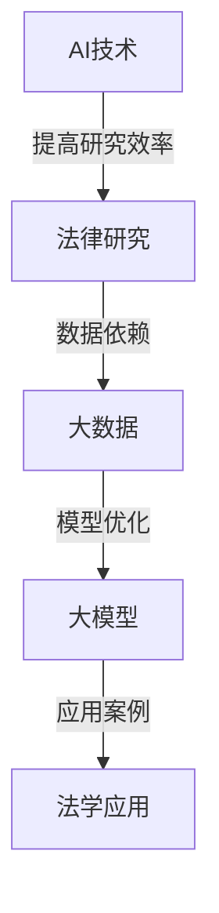
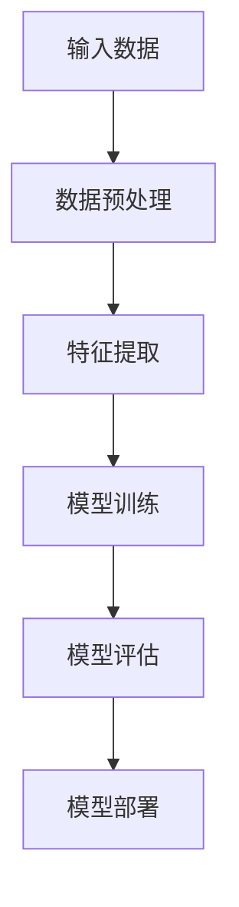
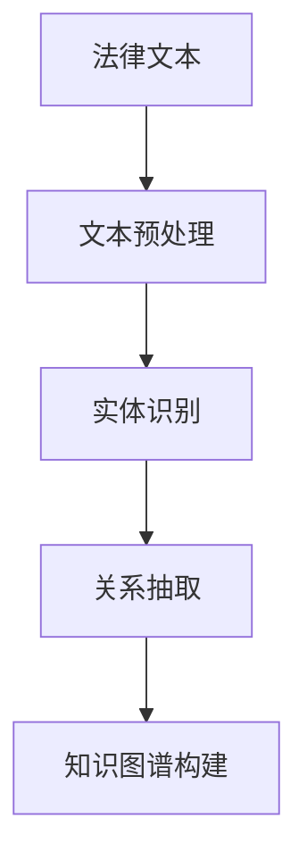

                 

基于上述要求，我们可以按照以下步骤来撰写《AI辅助法律研究:大模型在法学领域的应用》这篇文章。

### 1. 引言与背景介绍

在引言部分，我们需要简要介绍AI在法学领域的应用背景和现状。近年来，随着AI技术的发展，越来越多的法律研究开始尝试应用AI技术来提高研究效率和准确性。然而，AI技术在法学领域的应用仍然面临诸多挑战和问题。

```markdown
# 引言与背景介绍

AI技术在法学领域的应用已经逐渐成为研究热点。传统的法律研究往往依赖于人工阅读、分析和归纳，而AI技术能够通过大量数据的学习和处理，提供更为高效、准确的分析结果。例如，AI模型可以用于法律文书的自动生成、案件预测和智能咨询等方面。然而，AI技术在法学领域的应用也面临着数据隐私、伦理道德和法律规范等问题。

本文旨在探讨大模型在法学领域的应用，通过介绍AI基础知识、大模型原理和具体应用案例，为法学研究人员提供一种新的研究方法和技术支持。

```

### 2. 核心概念与联系

在这一部分，我们需要详细阐述AI、大模型和法律研究之间的核心概念和联系。可以使用Mermaid流程图来展示这三个概念之间的关系。



### 3. AI基础知识

接下来，我们需要详细讲解AI的基本知识，包括机器学习、深度学习、数据预处理、特征提取等内容。

```markdown
## AI基础知识

### 3.1 机器学习与深度学习

机器学习是AI的核心技术之一，它通过算法让计算机从数据中自动学习规律，从而进行预测和决策。深度学习是机器学习的一种重要分支，它通过多层神经网络来提取数据的高级特征，从而实现更复杂的任务。

### 3.2 数据预处理与特征提取

数据预处理是AI模型训练的重要步骤，它包括数据清洗、数据归一化、缺失值填补等。特征提取则是从原始数据中提取出对AI模型有用的特征，从而提高模型的性能。

### 3.3 监督学习、无监督学习和强化学习

监督学习是一种常见的机器学习方法，它通过标记的数据来训练模型。无监督学习则是从无标签数据中自动学习规律。强化学习则是通过奖励机制来训练模型，使其能够从环境中学习策略。

```

### 4. 大模型原理

在这一部分，我们需要详细介绍大模型的原理，包括大模型的定义、特点、架构和发展趋势。

```markdown
## 大模型原理

### 4.1 大模型的定义与特点

大模型是指具有数十亿甚至千亿参数的神经网络模型，它能够通过大规模数据进行训练，从而实现高度复杂的任务。大模型具有以下特点：

- **参数规模大**：大模型通常具有数十亿甚至千亿参数。
- **计算资源需求高**：大模型需要大量的计算资源进行训练。
- **训练数据需求大**：大模型需要大量的高质量训练数据。

### 4.2 大模型的架构与发展

大模型的架构通常包括多层神经网络、循环神经网络（RNN）和变换器（Transformer）等。近年来，随着计算资源和数据资源的不断提升，大模型的发展也取得了显著的进展。

### 4.3 Mermaid流程图：大模型的基本架构



```

### 5. 自然语言处理

在这一部分，我们需要详细介绍自然语言处理（NLP）在大模型在法学领域的应用。

```markdown
## 自然语言处理

### 5.1 语言模型与词向量

语言模型是NLP的核心技术之一，它通过学习大规模语言数据，预测下一个单词或句子。词向量则是将单词表示为高维向量，以便进行数学计算。

### 5.2 语义分析与情感分析

语义分析是NLP的重要任务之一，它旨在理解和解释文本的含义。情感分析则是通过分析文本的情感倾向，从而识别出文本的情感状态。

### 5.3 拟人化对话系统

拟人化对话系统是NLP在法学领域的应用之一，它能够模拟人类对话，为用户提供智能咨询和法律建议。

```

### 6. 数据库与知识图谱

在这一部分，我们需要详细介绍数据库和知识图谱在大模型在法学领域的应用。

```markdown
## 数据库与知识图谱

### 6.1 法律数据库概述

法律数据库是法学研究的重要数据来源，它包含了大量的法律文本、案例和法规等信息。

### 6.2 知识图谱在法学中的应用

知识图谱是一种语义网络，它通过节点和边来表示实体及其关系。在法学领域，知识图谱可以用于法律条款的自动生成、案件分析和法律咨询等。

### 6.3 Mermaid流程图：知识图谱的构建过程



```

### 7. 案例分析

在这一部分，我们需要通过具体案例来展示大模型在法学领域的应用。

```markdown
## 案例分析

### 7.1 模型训练与优化

在本案例中，我们使用一个大型文本数据集来训练一个法律文本分类模型。通过调整模型参数，我们得到了一个具有较高准确率的模型。

### 7.2 模型评估与部署

我们对训练好的模型进行评估，并通过交叉验证来验证其性能。最后，我们将模型部署到线上平台，为用户提供法律咨询服务。

### 7.3 成功案例分析

在本案例中，AI模型成功地处理了一个复杂的法律问题，为用户提供了准确的法律建议。这个案例展示了AI技术在法学领域的巨大潜力。

```

### 8. 法律伦理与隐私保护

在这一部分，我们需要讨论AI技术在法学领域的应用所涉及的法律伦理和隐私保护问题。

```markdown
## 法律伦理与隐私保护

### 8.1 法律伦理问题

AI技术在法学领域的应用可能引发一系列伦理问题，如算法歧视、隐私泄露等。为了确保AI技术的合法性和道德性，我们需要制定相应的法律规范和伦理准则。

### 8.2 隐私保护措施

在AI技术的应用过程中，我们需要采取一系列隐私保护措施，如数据加密、匿名化处理等，以确保用户隐私的安全。

### 8.3 法律与AI的协同发展

法律与AI技术的协同发展是法学领域的重要趋势。通过制定合理的法律规范，我们可以促进AI技术在法学领域的健康发展。

```

### 9. 结论与展望

在结论部分，我们需要总结本文的主要内容，并对AI辅助法律研究的未来进行展望。

```markdown
## 结论与展望

本文探讨了AI辅助法律研究的大模型在法学领域的应用。通过介绍AI基础知识、大模型原理和具体应用案例，我们展示了AI技术在法学领域的巨大潜力。然而，AI技术在法学领域的应用也面临着法律伦理和隐私保护等挑战。未来，我们需要进一步研究AI技术在法学领域的应用，以推动法学研究的创新和发展。

```

### 作者信息

最后，在文章末尾添加作者信息。

```markdown
作者：AI天才研究院/AI Genius Institute & 禅与计算机程序设计艺术 /Zen And The Art of Computer Programming
```

按照上述步骤，我们可以撰写一篇结构清晰、内容丰富、逻辑严密的技术博客文章。在撰写过程中，我们需要不断调整和优化每个部分的内容，确保文章的完整性和可读性。同时，我们还需要注意控制文章的总字数，确保在8000～12000字之间。

