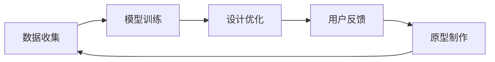

                 

### 文章标题

《AI辅助的产品设计：从概念到原型的快速迭代》

#### 关键词

- AI技术
- 产品设计
- 快速迭代
- 原型制作
- 计算机视觉
- 机器学习

#### 摘要

本文深入探讨了AI技术在产品设计中从概念到原型快速迭代的全过程。通过分析AI在产品设计中的应用背景和优势，介绍了AI辅助产品设计的核心概念和算法，并详细讲解了如何利用AI工具和平台进行产品设计的快速迭代。文章还通过实际案例展示了AI在产品设计中的实际应用，并提供了实用的工具和资源，帮助读者进一步学习和实践AI辅助产品设计的技巧。

### 引言

在当今快速变化的市场环境中，产品设计的成功往往取决于其快速迭代和灵活性。随着技术的不断发展，人工智能（AI）逐渐成为产品设计的重要助力。AI不仅能够提高设计的效率和准确性，还能通过智能化的数据分析和预测，帮助设计师更精准地满足用户需求。本文旨在探讨如何利用AI技术辅助产品设计的整个流程，从概念生成到原型制作的快速迭代过程。

随着AI技术的不断进步，其在产品设计中的应用也越来越广泛。从早期的辅助设计工具，到如今能够实现高度自动化和智能化的设计流程，AI已经逐渐成为设计师的得力助手。本文将首先介绍AI在产品设计中的应用背景和优势，然后深入探讨AI辅助产品设计的核心概念和算法，并通过实际案例展示AI在产品设计中的实际应用。最后，本文将提供一些实用的工具和资源，帮助读者更好地理解和应用AI辅助产品设计的理念。

### AI在产品设计中的应用背景

随着科技的快速发展，人工智能（AI）技术逐渐渗透到各个领域，其中产品设计领域也不例外。AI技术的应用不仅改变了传统的设计流程，还为设计师提供了强大的工具，使他们能够更高效地完成设计任务，从而提升产品竞争力。

首先，AI在产品设计中的挑战主要来源于以下几个方面：

1. **复杂性**：现代产品设计涉及到多个方面，包括功能、用户体验、视觉效果等。这些因素相互交织，使得设计过程变得复杂。AI技术可以通过处理大量数据和分析复杂关系，帮助设计师更好地理解并应对这种复杂性。

2. **多样性**：用户需求和产品功能多种多样，设计师需要不断调整设计方案以适应不同的用户和市场。AI技术能够通过机器学习和数据挖掘，分析用户的偏好和行为模式，从而提供更有针对性的设计建议。

3. **效率**：传统的设计流程往往需要大量的手工操作和时间投入。AI技术可以通过自动化和智能化，大大提高设计效率，减少不必要的重复劳动。

然而，面对这些挑战，AI技术也带来了诸多机遇：

1. **数据驱动的决策**：AI技术能够处理和分析大量数据，为设计师提供更精准的决策依据。通过对市场趋势、用户反馈等数据进行分析，设计师可以更准确地预测用户需求，从而设计出更符合市场期待的产品。

2. **智能化的设计工具**：AI技术为设计师提供了智能化的设计工具，如自动生成设计元素、智能调整布局等。这些工具不仅提高了设计效率，还减少了设计师的工作负担。

3. **创新能力的提升**：AI技术可以帮助设计师突破传统思维模式，从不同的角度和维度进行设计创新。例如，通过生成对抗网络（GAN）等算法，设计师可以创造出前所未有的设计样式和效果。

总之，AI技术在产品设计中的应用不仅解决了传统设计流程中的诸多问题，还为设计师提供了更多的机遇。通过AI技术，设计师可以更高效、更精准地完成设计任务，从而提升产品的市场竞争力。

### AI辅助产品设计的核心概念

AI辅助产品设计不仅仅是将AI技术简单地应用到设计流程中，而是通过深入理解和应用一系列核心概念和算法，使得设计过程更加智能化和高效。以下将详细介绍AI辅助产品设计中的核心概念和它们之间的关系。

#### 1. 机器学习基础

机器学习是AI的核心技术之一，它通过构建数学模型来使计算机从数据中自动学习和改进。在产品设计领域，机器学习主要用于以下方面：

1. **分类和预测**：通过分析用户行为数据，机器学习模型可以预测用户对不同设计元素的偏好，从而帮助设计师优化设计。
   - **伪代码示例**：
     ```python
     def predict_user_preference(data):
         # 输入：用户行为数据
         # 输出：预测的用户偏好
         model = train_model(data)
         preference = model.predict(data)
         return preference
     ```

2. **聚类分析**：机器学习可以将用户群体进行分类，从而为设计师提供不同用户群体的特征和需求，帮助设计出更符合市场需求的多样化产品。
   - **伪代码示例**：
     ```python
     def cluster_users(data):
         # 输入：用户数据
         # 输出：用户分类结果
         model = train_clustering_model(data)
         clusters = model.fit_predict(data)
         return clusters
     ```

#### 2. 计算机视觉在产品设计中的应用

计算机视觉是AI技术的重要组成部分，它在产品设计中的应用主要体现在以下几个方面：

1. **图像识别**：计算机视觉可以通过图像识别技术自动检测和分类产品中的设计元素，如颜色、形状和纹理等。
   - **伪代码示例**：
     ```python
     def recognize_elements(image):
         # 输入：图像数据
         # 输出：识别的设计元素
         model = train_image_recognition_model()
         elements = model.predict(image)
         return elements
     ```

2. **图像生成**：利用生成对抗网络（GAN）等技术，计算机视觉可以生成新颖的设计元素和视觉效果，为设计师提供更多的创意选择。
   - **伪代码示例**：
     ```python
     def generate_design_elements():
         # 输出：生成的新颖设计元素
         generator = GAN_generator()
         elements = generator.generate()
         return elements
     ```

3. **三维建模与渲染**：计算机视觉技术可以用于三维建模和渲染，帮助设计师更直观地展示产品概念和设计细节。
   - **伪代码示例**：
     ```python
     def create_3d_model(model_data):
         # 输入：模型数据
         # 输出：三维模型
         model = 3D_modeling_algorithm()
         model.create_model(model_data)
         return model
     ```

#### 3. 自然语言处理在产品设计中的应用

自然语言处理（NLP）技术可以理解和处理人类语言，它在产品设计中的应用主要包括：

1. **文本分析**：通过文本分析技术，设计师可以了解用户的反馈和需求，从而优化产品设计。
   - **伪代码示例**：
     ```python
     def analyze_user_feedback(feedback):
         # 输入：用户反馈文本
         # 输出：分析结果
         model = train_text_analysis_model()
         results = model.analyze(feedback)
         return results
     ```

2. **语音识别与生成**：语音识别技术可以将用户的语音输入转换为文本，而语音生成技术则可以将文本转换为自然的语音输出，从而实现人机交互的优化。
   - **伪代码示例**：
     ```python
     def recognize_speech(speech):
         # 输入：语音数据
         # 输出：文本转换
         model = train_speech_recognition_model()
         text = model.recognize(speech)
         return text
     ```

3. **情感分析**：通过情感分析技术，设计师可以了解用户对产品的情感反应，从而更好地调整设计方向。
   - **伪代码示例**：
     ```python
     def analyze_emotion(text):
         # 输入：文本数据
         # 输出：情感分析结果
         model = train_emotion_analysis_model()
         emotion = model.analyze(text)
         return emotion
     ```

#### 4. AI辅助设计的综合应用

上述核心概念和算法并不是孤立存在的，它们在实际设计过程中是相互融合、协同作用的。以下是一个综合应用的流程示例：

1. **数据收集**：收集用户行为数据、市场数据等，作为AI模型训练的数据基础。
2. **模型训练**：利用机器学习、计算机视觉和自然语言处理技术，训练相应的AI模型。
3. **设计优化**：通过AI模型对设计元素进行智能分析和生成，设计师根据分析结果进行设计调整。
4. **用户反馈**：收集用户对设计的反馈，再次进行AI分析，形成闭环迭代。
5. **原型制作**：利用AI工具生成设计原型，进行视觉和交互优化。

### Mermaid流程图

以下是一个简化的Mermaid流程图，展示了AI辅助设计的基本流程：



通过这样的流程，AI能够不断学习和优化设计，实现从概念到原型的快速迭代。综上所述，AI辅助产品设计不仅依赖于单一的技术，更需要各个核心概念的协同作用，以实现高效的智能化设计。

### AI辅助产品设计的核心算法原理

在AI辅助产品设计中，核心算法起着至关重要的作用。它们不仅决定了设计过程的高度自动化和智能化，还直接影响设计质量和效率。以下是AI辅助产品设计中的几个关键算法及其原理的详细讲解。

#### 1. 机器学习算法

机器学习算法是AI辅助产品设计的基础。它们通过从数据中学习规律和模式，从而帮助设计师进行智能决策。

- **监督学习（Supervised Learning）**：
  - **原理**：监督学习通过已标记的数据集进行训练，学习输入和输出之间的关系。常见的监督学习算法包括线性回归、决策树、支持向量机（SVM）等。
  - **应用**：在产品设计过程中，监督学习可以用于预测用户对设计元素的偏好。例如，通过训练一个分类模型，设计师可以根据用户的历史行为数据，预测用户对不同颜色、字体等设计元素的偏好，从而优化设计。
  - **伪代码示例**：
    ```python
    def train_classification_model(data, labels):
        # 输入：训练数据、标签
        # 输出：训练好的分类模型
        model = LinearRegression()
        model.fit(data, labels)
        return model
    
    def predict_user_preference(model, data):
        # 输入：训练好的模型、测试数据
        # 输出：预测的用户偏好
        preference = model.predict(data)
        return preference
    ```

- **无监督学习（Unsupervised Learning）**：
  - **原理**：无监督学习在没有标签的数据上进行训练，主要目标是发现数据中的内在结构和模式。常见的无监督学习算法包括聚类、主成分分析（PCA）等。
  - **应用**：在产品设计过程中，无监督学习可以用于用户分群、设计元素的特征提取等。例如，通过聚类算法，设计师可以识别出不同用户群体的特征，从而为不同群体设计个性化的产品。
  - **伪代码示例**：
    ```python
    def cluster_users(data):
        # 输入：用户数据
        # 输出：用户分类结果
        model = KMeans(n_clusters=3)
        clusters = model.fit_predict(data)
        return clusters
    ```

- **强化学习（Reinforcement Learning）**：
  - **原理**：强化学习通过与环境的交互进行学习，其目标是找到最优策略以最大化奖励。常见的强化学习算法包括Q-学习、深度强化学习（DRL）等。
  - **应用**：在产品设计过程中，强化学习可以用于交互式设计优化。例如，通过Q-学习算法，设计师可以训练一个模型来预测用户对设计变化的反应，从而自动调整设计参数，实现最佳的用户体验。
  - **伪代码示例**：
    ```python
    def train_q_learning(model, states, actions, rewards):
        # 输入：模型、状态、动作、奖励
        # 输出：训练好的Q值函数
        model.update_q_values(states, actions, rewards)
        return model
    
    def select_action(model, state):
        # 输入：训练好的模型、当前状态
        # 输出：最佳动作
        action = model.best_action(state)
        return action
    ```

#### 2. 计算机视觉算法

计算机视觉技术在产品设计中扮演着重要的角色，它们可以帮助设计师进行图像识别、图像生成和三维建模等操作。

- **图像识别（Image Recognition）**：
  - **原理**：图像识别算法通过训练模型，从图像中识别和分类不同的对象和特征。常见的图像识别算法包括卷积神经网络（CNN）等。
  - **应用**：在产品设计过程中，图像识别可以用于自动识别设计元素，如颜色、形状和纹理。例如，设计师可以训练一个CNN模型，识别产品图像中的颜色分布，从而优化颜色搭配。
  - **伪代码示例**：
    ```python
    def train_image_recognition_model(data, labels):
        # 输入：训练数据、标签
        # 输出：训练好的图像识别模型
        model = CNNModel()
        model.fit(data, labels)
        return model
    
    def recognize_elements(model, image):
        # 输入：训练好的模型、图像数据
        # 输出：识别的设计元素
        elements = model.predict(image)
        return elements
    ```

- **图像生成（Image Generation）**：
  - **原理**：图像生成算法通过生成对抗网络（GAN）等模型，生成具有特定特征的新图像。常见的图像生成算法包括生成对抗网络（GAN）、变分自编码器（VAE）等。
  - **应用**：在产品设计过程中，图像生成可以用于创造新颖的设计元素和视觉效果。例如，设计师可以利用GAN生成独特的图标或纹理，为产品设计提供更多的创意。
  - **伪代码示例**：
    ```python
    def generate_design_elements(generator):
        # 输入：生成器模型
        # 输出：生成的新颖设计元素
        elements = generator.generate()
        return elements
    ```

- **三维建模与渲染（3D Modeling and Rendering）**：
  - **原理**：三维建模与渲染算法通过处理三维数据，生成三维模型并对其进行渲染。常见的三维建模与渲染算法包括三维重建、纹理映射等。
  - **应用**：在产品设计过程中，三维建模与渲染可以用于创建详细的产品原型和视觉效果。例如，设计师可以通过三维建模技术，快速创建产品的三维模型，并进行渲染以展示设计效果。
  - **伪代码示例**：
    ```python
    def create_3d_model(skeleton, texture):
        # 输入：模型骨架、纹理数据
        # 输出：三维模型
        model = 3DModelingAlgorithm()
        model.create_model(skeleton, texture)
        return model
    
    def render_model(model, camera_angle):
        # 输入：三维模型、摄像机角度
        # 输出：渲染图像
        rendered_image = model.render(camera_angle)
        return rendered_image
    ```

#### 3. 自然语言处理算法

自然语言处理（NLP）技术在产品设计中主要用于文本分析、语音识别和生成等方面，帮助设计师更好地理解用户需求和市场趋势。

- **文本分析（Text Analysis）**：
  - **原理**：文本分析算法通过处理自然语言文本，提取出关键信息、情感和主题等。常见的文本分析算法包括词嵌入、情感分析、主题建模等。
  - **应用**：在产品设计过程中，文本分析可以用于分析用户反馈和评论，提取用户需求和情感。例如，通过情感分析算法，设计师可以了解用户对产品的情感反应，从而优化设计。
  - **伪代码示例**：
    ```python
    def analyze_text(text):
        # 输入：文本数据
        # 输出：分析结果
        model = TextAnalysisModel()
        results = model.analyze(text)
        return results
    
    def extract_sentiment(text):
        # 输入：文本数据
        # 输出：情感分析结果
        sentiment = model.analyze(text)
        return sentiment
    ```

- **语音识别与生成（Speech Recognition and Generation）**：
  - **原理**：语音识别算法将语音信号转换为文本，而语音生成算法将文本转换为自然的语音输出。常见的语音识别和生成算法包括隐马尔可夫模型（HMM）、循环神经网络（RNN）等。
  - **应用**：在产品设计过程中，语音识别和生成可以用于实现人机交互。例如，通过语音识别算法，设计师可以获取用户的语音指令，并通过语音生成算法回应用户，提供更自然的交互体验。
  - **伪代码示例**：
    ```python
    def recognize_speech(speech):
        # 输入：语音数据
        # 输出：文本转换
        model = SpeechRecognitionModel()
        text = model.recognize(speech)
        return text
    
    def generate_speech(text):
        # 输入：文本数据
        # 输出：语音生成
        model = SpeechGenerationModel()
        speech = model.generate(text)
        return speech
    ```

#### 4. 综合应用

在产品设计中，上述算法通常不是独立使用的，而是相互结合，共同作用，以实现更高效、更智能的设计过程。

例如，设计师可以通过机器学习算法分析用户反馈数据，利用计算机视觉算法生成新的设计元素，并通过自然语言处理算法提取用户需求，从而不断优化设计。以下是一个简化的综合应用流程：

1. **数据收集**：收集用户反馈、市场数据等。
2. **模型训练**：利用机器学习、计算机视觉和自然语言处理算法，训练相应的AI模型。
3. **设计优化**：通过AI模型对设计进行智能分析和优化。
4. **用户反馈**：收集新的用户反馈，再次进行AI分析，形成闭环迭代。
5. **原型制作**：利用AI工具生成设计原型，进行视觉和交互优化。

### 结论

AI辅助产品设计通过机器学习、计算机视觉和自然语言处理等核心算法，实现了设计过程的智能化和自动化。这些算法不仅提高了设计的效率和准确性，还为设计师提供了更多的创新空间。通过深入理解这些算法的原理和应用，设计师可以更有效地利用AI技术，提升产品的设计质量和用户体验。

### AI辅助产品设计的实践应用

在实际应用中，AI技术为产品设计师提供了强大的工具，使得从概念到原型的快速迭代成为可能。以下将详细讲解如何利用AI工具和平台进行产品设计的快速迭代，并通过实际案例展示其效果。

#### 1. 设计思维与AI结合

设计思维是一种以用户为中心的设计方法，强调通过迭代和实验来不断优化产品。将设计思维与AI技术结合，可以实现以下目标：

1. **用户需求分析**：通过AI技术分析用户反馈和市场数据，设计师可以更准确地理解用户需求。这有助于在设计初期就避免设计方向上的偏差。

2. **快速原型制作**：利用AI工具，设计师可以快速生成原型，节省时间和资源。例如，使用AI绘图工具可以自动生成设计草图，设计师只需对结果进行微调。

3. **反馈迭代**：通过AI技术收集用户对原型的反馈，设计师可以快速调整设计，实现迭代优化。这种闭环反馈机制有助于缩短设计周期，提高产品质量。

#### 2. 使用AI工具进行原型设计

以下是一些主流的AI工具和平台，它们可以帮助设计师进行产品设计的快速迭代：

1. **Adobe Sensei**：
   - **优势**：集成了多种AI技术，如图像识别、自然语言处理和推荐系统等，可以提供全面的设计支持。
   - **应用**：设计师可以使用Adobe Sensei进行图像和文字分析，提取设计元素，并利用其智能推荐功能生成新的设计样式。

2. **Autodesk generative design**：
   - **优势**：利用生成式设计算法，可以自动生成满足特定性能要求的设计方案，大幅减少设计时间和成本。
   - **应用**：设计师可以在Autodesk generative design平台上创建复杂的三维模型，并通过优化算法找到最佳的设计方案。

3. **SketchUp Make**：
   - **优势**：易于使用，适合初学者和专业人士，提供丰富的3D建模工具和模板。
   - **应用**：设计师可以使用SketchUp Make快速构建产品的3D原型，并通过其内置的AI工具进行智能调整和优化。

#### 3. 快速迭代案例

以下是一个使用AI工具进行产品设计的快速迭代案例：

**案例背景**：某公司需要开发一款智能家居设备，目标是提供一个易于使用且功能强大的解决方案。

**步骤一：用户需求分析**
- 设计团队通过AI工具分析用户反馈和市场数据，确定用户对智能家居设备的主要需求，如易用性、多功能性和智能控制等。

**步骤二：原型制作**
- 设计师使用AI绘图工具生成初步的设计草图，并使用SketchUp Make构建3D模型。通过Autodesk generative design优化算法，设计师找到了满足性能要求且结构优化的设计。

**步骤三：用户反馈与迭代**
- 设计团队将初步原型发布给用户测试，并通过AI工具收集用户反馈。根据反馈，设计师对原型进行了多次调整和优化，如改进用户界面、增加新的功能模块等。

**步骤四：原型验证**
- 最终的设计原型经过多轮用户测试和内部评审，确认其符合用户需求和市场定位。产品成功发布后，用户反馈良好，市场反响热烈。

#### 4. AI工具的优缺点分析

**优点**：
- **高效性**：AI工具可以快速生成设计原型，大幅减少设计时间和成本。
- **智能性**：AI工具通过数据分析，可以提供有针对性的设计建议，提高设计质量。
- **多样化**：AI工具可以生成多样化的设计选项，帮助设计师突破思维局限。

**缺点**：
- **依赖性**：过度依赖AI工具可能导致设计师失去创意能力，难以独立完成设计。
- **准确性**：AI工具依赖于训练数据和算法模型，可能存在偏差或错误。
- **成本**：购买和使用高端AI工具可能需要较大的投资。

#### 5. 实际应用效果

通过实际案例可以看出，AI工具在产品设计的快速迭代中发挥了重要作用。不仅提高了设计效率和质量，还帮助设计师更好地满足用户需求。然而，AI工具并非万能，设计师仍需发挥自身创意和专业知识，才能实现最佳的设计效果。

### AI辅助产品设计的工具和平台

在AI辅助产品设计的领域，有许多强大的工具和平台可以帮助设计师实现高效和智能化的设计流程。以下将介绍几款主流的开源AI工具、商业AI设计平台以及在线AI设计社区，并提供一些实用的工具和资源。

#### 1. 开源AI工具

**TensorFlow**：
- **优势**：由Google开发，具有丰富的文档和社区支持，适合进行复杂的数据分析和模型训练。
- **应用**：可以用于构建机器学习模型，辅助设计流程中的数据分析和预测。

**PyTorch**：
- **优势**：拥有简洁的代码和灵活的架构，是深度学习领域的热门框架。
- **应用**：用于构建和训练复杂的神经网络，辅助图像识别、自然语言处理等任务。

**Keras**：
- **优势**：建立在TensorFlow和Theano之上，提供了简洁易用的接口，适合快速构建和实验模型。
- **应用**：用于快速原型设计和模型实验，特别适合新手和研究人员。

**OpenCV**：
- **优势**：开源的计算机视觉库，提供了丰富的图像处理和计算机视觉算法。
- **应用**：用于图像识别、三维建模和渲染等任务，是产品设计师的有力工具。

#### 2. 商业AI设计平台

**Adobe Sensei**：
- **优势**：集成了多种AI技术，包括图像识别、自然语言处理和推荐系统，适用于各种设计任务。
- **应用**：提供智能化的设计工具和功能，如自动生成设计元素、智能调整布局等。

**Autodesk generative design**：
- **优势**：利用生成式设计算法，自动生成满足特定性能要求的设计方案。
- **应用**：适用于复杂的三维设计和优化任务，帮助设计师快速找到最佳设计方案。

**SketchUp Make**：
- **优势**：提供直观的三维建模工具和模板，适合初学者和专业人士。
- **应用**：用于快速构建产品的3D原型，并通过内置的AI工具进行智能调整和优化。

**Figma**：
- **优势**：基于网页的协作设计工具，支持实时协作和原型设计。
- **应用**：提供AI辅助设计功能，如自动布局和设计建议，适合UI/UX设计。

#### 3. 在线AI设计社区

**DesignAI**：
- **优势**：专注于AI在产品设计中的应用，提供丰富的教程和资源。
- **应用**：设计师可以学习最新的AI设计工具和技巧，分享设计经验和资源。

**Product Design Forum**：
- **优势**：一个活跃的产品设计社区，汇集了大量的设计师和开发者。
- **应用**：设计师可以在这里交流设计理念、获取灵感和反馈。

**AI for Product Design**：
- **优势**：专门讨论AI在产品设计中的实际应用和挑战，提供最新的研究成果和最佳实践。
- **应用**：设计师可以通过这个平台了解AI技术的最新进展，并应用于实际设计中。

#### 4. 实用工具和资源

- **AI设计工具集成**：许多设计平台已经集成了AI工具，如Adobe Sensei和Figma等，设计师可以直接在软件中利用AI功能。
- **在线教程和课程**：许多网站提供免费的AI设计教程和课程，如Coursera、Udemy等，帮助设计师提升技能。
- **开源项目和代码库**：GitHub等平台上有许多开源的AI设计和产品设计项目，设计师可以参考和改进。

总之，通过合理利用这些AI工具和平台，设计师可以大幅提升设计效率和创意能力，实现从概念到原型的快速迭代。同时，积极参与在线AI设计社区，不断学习和交流，将有助于设计师在AI辅助产品设计的道路上走得更远。

### AI辅助产品设计的前景与挑战

#### 1. AI辅助产品设计的发展趋势

随着AI技术的不断进步，AI辅助产品设计领域正迎来一系列重要的发展趋势：

- **智能化设计工具**：AI辅助设计工具将越来越智能化，不仅能够自动生成设计元素，还能根据用户反馈进行实时优化。例如，利用深度学习和自然语言处理技术，设计工具可以理解用户的需求，并生成更加个性化、精准的设计方案。

- **多学科融合**：AI辅助产品设计将逐渐与工程学、人机交互学、心理学等多个学科交叉融合，形成一个更加综合的设计生态系统。这种跨学科的合作将有助于提升设计质量，满足用户的多样化需求。

- **云端设计平台**：随着云计算技术的发展，越来越多的AI设计工具将迁移到云端，提供更加便捷和高效的设计服务。设计师可以通过互联网随时随地访问这些工具，实现远程协作和实时迭代。

- **用户体验优化**：AI技术将在用户体验（UX）设计中发挥越来越重要的作用。通过智能分析用户行为和偏好，AI辅助设计工具可以帮助设计师优化界面布局、交互流程和视觉设计，从而提升用户的满意度和使用体验。

#### 2. AI辅助产品设计的挑战

尽管AI辅助产品设计具有巨大的潜力，但实现这一目标仍面临诸多挑战：

- **技术挑战**：AI技术的复杂性使得设计工具的开发和维护变得困难。例如，训练高质量的AI模型需要大量的数据和计算资源，而算法的不确定性和误差可能影响设计质量。

- **数据隐私和安全**：AI辅助产品设计依赖于大量用户数据和敏感信息。如何确保这些数据的安全和隐私，防止数据泄露和滥用，是一个亟待解决的问题。

- **伦理和社会问题**：AI辅助产品设计可能带来一些伦理和社会问题。例如，设计过程中引入的算法偏见可能导致不公平的设计决策，影响用户体验和社会公正。此外，自动化设计工具可能导致设计师的失业，引发社会不安。

- **人才短缺**：AI辅助产品设计需要既懂设计又懂技术的复合型人才。然而，目前这类人才相对稀缺，如何培养和吸引这些人才，是行业发展的重要瓶颈。

#### 3. 应对挑战的策略

为了应对上述挑战，以下是一些建议和策略：

- **技术创新**：持续投资于AI技术的研究和开发，提高算法的效率和准确性，降低设计和维护成本。同时，推动跨学科的研究，将不同领域的知识和技术融合到设计工具中。

- **数据治理**：建立完善的数据治理框架，确保数据的安全和隐私。通过匿名化和加密技术保护用户数据，制定透明的数据使用政策，增强用户信任。

- **伦理监管**：制定和遵守伦理规范，确保AI辅助设计工具的应用不会造成不公平和社会问题。建立独立第三方机构，对AI工具进行评估和监督，确保其符合伦理标准。

- **人才培养**：推动教育改革，培养既懂设计又懂技术的复合型人才。建立校企合作机制，提供实践机会，帮助设计师提升技能。同时，鼓励跨学科合作，促进设计师和AI开发者的互动和交流。

通过上述策略，我们可以更好地应对AI辅助产品设计中的挑战，推动这一领域的发展，实现更高效、更智能的设计流程。

### 附录：AI辅助产品设计资源指南

#### 设计师与AI开发者的合作模式

在AI辅助产品设计中，设计师和AI开发者之间的紧密合作至关重要。以下是如何建立有效的合作模式的一些关键点：

**设计师的角色与任务**：
- **需求分析**：设计师需要深入了解用户需求和市场趋势，明确产品的设计目标和用户界面需求。
- **原型设计**：利用AI工具生成初步的设计原型，并与AI开发者合作进行迭代和优化。
- **用户体验**：确保设计符合用户的使用习惯和期望，通过用户测试收集反馈，不断调整和改进设计。

**AI开发者的角色与任务**：
- **模型训练与优化**：基于设计需求，开发并训练AI模型，不断优化算法以提高设计质量。
- **数据处理与分析**：处理和清洗数据，提取有价值的信息，为AI模型提供高质量的输入。
- **工具开发**：设计并开发AI辅助设计工具，确保这些工具易于使用且能高效地支持设计流程。

**如何建立有效的沟通与合作机制**：
- **定期会议**：设计师和AI开发者应定期召开会议，讨论设计需求和AI模型的进展情况，确保双方对项目的理解一致。
- **文档共享**：使用版本控制系统和协作工具（如GitHub、Jira）来共享设计和开发文档，确保信息的透明和可追溯性。
- **用户反馈循环**：建立用户反馈机制，将用户测试结果及时反馈给设计师和AI开发者，以指导设计优化和模型调整。

#### 跨学科团队构建与管理

构建一个高效的跨学科团队是实现AI辅助产品设计的关键。以下是一些团队构建与管理的策略：

**团队成员的能力要求**：
- **设计师**：具备扎实的设计理论基础和实战经验，能够理解用户需求并设计出高质量的用户界面。
- **AI开发者**：具备机器学习、数据科学和计算机视觉等相关领域的专业知识和技能，能够开发和优化AI模型。
- **产品经理**：负责产品规划和管理，协调设计师和开发者的工作，确保项目目标的实现。
- **数据分析师**：负责数据收集、处理和分析，为AI模型提供高质量的数据支持。

**团队构建的步骤与策略**：
- **需求分析**：明确项目目标和需求，确定所需的团队成员和技能。
- **招聘与选拔**：通过招聘会和社交媒体等渠道招聘合适的团队成员，进行面试和技能评估，确保团队具备所需的能力。
- **团队培训**：为新加入的团队成员提供培训，帮助他们快速适应团队工作和项目需求。
- **团队文化建设**：建立积极、开放和合作的团队文化，鼓励团队成员之间的交流和协作。

**团队协作工具与平台的选择**：
- **项目管理工具**：使用项目管理工具（如Jira、Trello）来规划任务、跟踪进度和协作，确保项目按计划进行。
- **文档协作工具**：使用文档协作工具（如Google Docs、Confluence）来共享文档、编辑和评论，确保信息的透明和一致性。
- **版本控制系统**：使用版本控制系统（如Git）来管理代码和设计文件，确保团队成员之间的协作和代码的版本管理。
- **通信工具**：使用即时通讯工具（如Slack、Microsoft Teams）来实时沟通和协作，确保团队成员之间的沟通顺畅。

通过有效的团队构建与管理策略，可以确保跨学科团队的高效运作，推动AI辅助产品设计的顺利进行。

